# 库存查询与更新功能文档

<cite>
**本文档引用的文件**
- [backend/integrations/haierapi.py](file://backend/integrations/haierapi.py)
- [backend/catalog/views.py](file://backend/catalog/views.py)
- [backend/catalog/models.py](file://backend/catalog/models.py)
- [backend/catalog/management/commands/sync_haier_products.py](file://backend/catalog/management/commands/sync_haier_products.py)
- [backend/orders/services.py](file://backend/orders/services.py)
- [backend/orders/views.py](file://backend/orders/views.py)
- [backend/common/health.py](file://backend/common/health.py)
- [backend/backend/settings/base.py](file://backend/backend/settings/base.py)
</cite>

## 目录
1. [简介](#简介)
2. [系统架构概览](#系统架构概览)
3. [核心组件分析](#核心组件分析)
4. [check_stock方法详解](#check_stock方法详解)
5. [库存查询与更新流程](#库存查询与更新流程)
6. [county_code区域编码机制](#county_code区域编码机制)
7. [缓存策略与性能优化](#缓存策略与性能优化)
8. [API接口设计](#api接口设计)
9. [错误处理与重试机制](#错误处理与重试机制)
10. [使用示例与最佳实践](#使用示例与最佳实践)
11. [故障排除指南](#故障排除指南)
12. [总结](#总结)

## 简介

本文档详细介绍了基于海尔API的库存查询与更新功能的实现。该系统提供了实时库存查询、库存同步、以及完整的库存管理能力，支持多种场景下的库存操作，包括订单创建前的库存检查、定时库存同步、以及实时库存更新。

系统采用模块化设计，通过独立的HaierAPI类负责与海尔系统的通信，通过Product模型管理本地库存数据，并通过专门的服务层处理业务逻辑。整个系统具备完善的错误处理、性能优化和监控机制。

## 系统架构概览

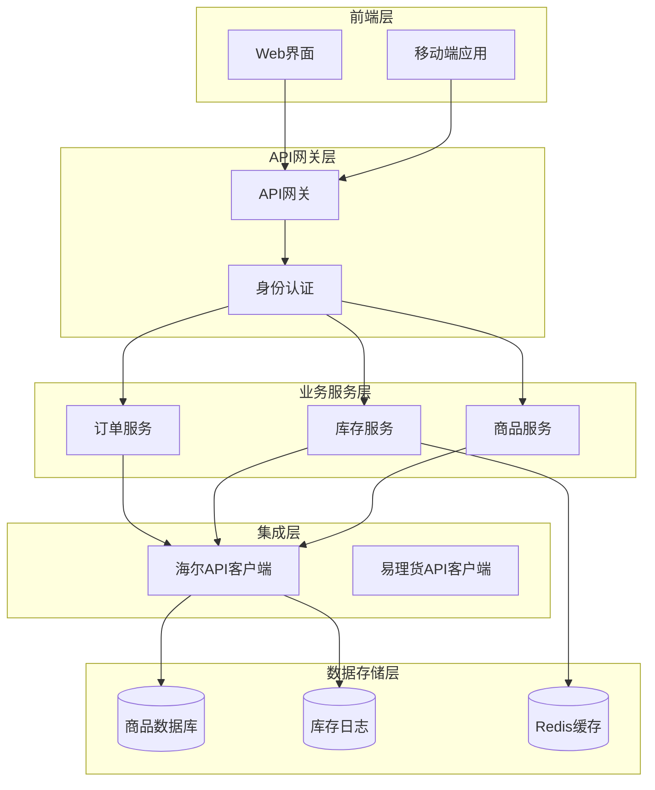

**图表来源**
- [backend/integrations/haierapi.py](file://backend/integrations/haierapi.py#L10-L214)
- [backend/catalog/views.py](file://backend/catalog/views.py#L30-L980)

## 核心组件分析

### HaierAPI类

HaierAPI类是系统的核心组件，负责与海尔开放平台的所有交互。该类实现了完整的OAuth2认证流程、API请求管理和错误处理机制。

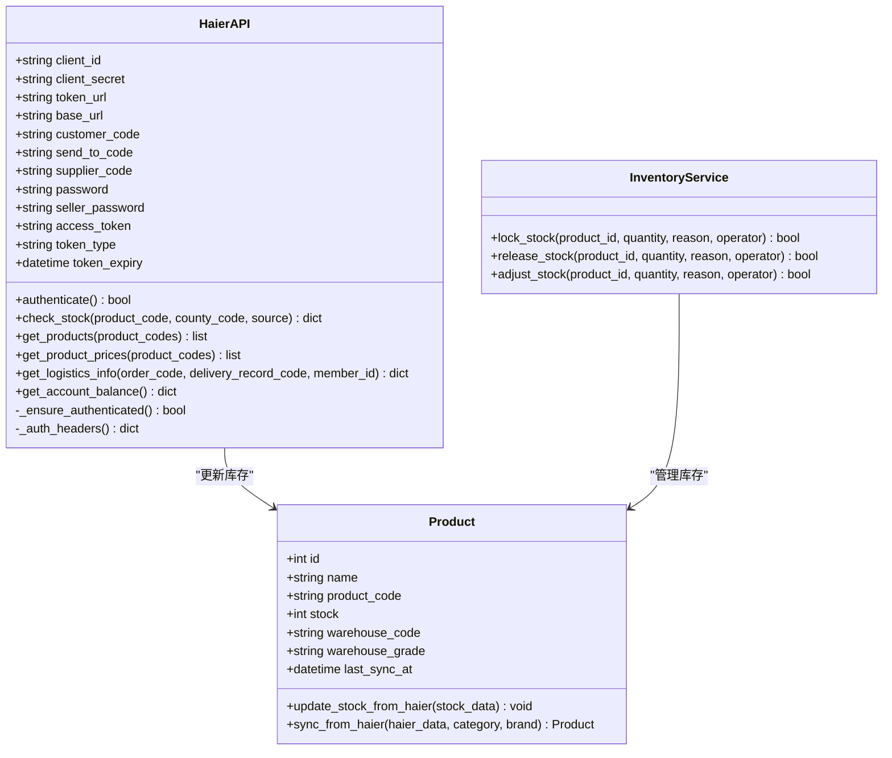

**图表来源**
- [backend/integrations/haierapi.py](file://backend/integrations/haierapi.py#L10-L214)
- [backend/catalog/models.py](file://backend/catalog/models.py#L43-L200)
- [backend/orders/services.py](file://backend/orders/services.py#L325-L451)

**节来源**
- [backend/integrations/haierapi.py](file://backend/integrations/haierapi.py#L10-L214)
- [backend/catalog/models.py](file://backend/catalog/models.py#L43-L200)

### 库存管理服务

库存管理服务提供了完整的库存操作功能，包括库存锁定、释放和调整。系统采用数据库行锁确保并发安全性，避免库存超卖问题。

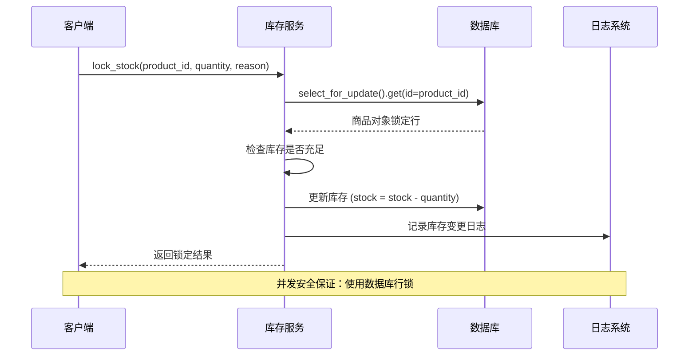

**图表来源**
- [backend/orders/services.py](file://backend/orders/services.py#L333-L371)

**节来源**
- [backend/orders/services.py](file://backend/orders/services.py#L325-L451)

## check_stock方法详解

### 方法签名与参数

`check_stock`方法是系统的核心库存查询功能，负责向海尔API发送库存查询请求。

```python
def check_stock(self, product_code: str, county_code: str, source: str = 'JSH-B') -> Optional[Dict[str, Any]]
```

### 参数说明

| 参数名 | 类型 | 必需 | 描述 | 示例值 |
|--------|------|------|------|--------|
| product_code | str | 是 | 海尔产品编码 | "GA0SZC00U" |
| county_code | str | 是 | 区域编码（6位国标码） | "110101" |
| source | str | 否 | 库存来源标识 | "JSH-B" |

### 请求流程

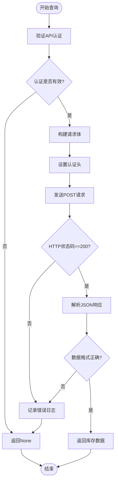

**图表来源**
- [backend/integrations/haierapi.py](file://backend/integrations/haierapi.py#L121-L142)

### 响应数据结构

海尔API返回的库存数据包含以下关键字段：

| 字段名 | 类型 | 描述 | 示例值 |
|--------|------|------|--------|
| stock | int | 可用库存数量 | 100 |
| secCode | str | 库位编码 | "WH001" |
| warehouseGrade | str | 仓库等级 | "0" (本级仓) 或 "1" (上级仓) |
| timelinessData | dict | 时效性数据 | 包含截单时间、预计送达时间等 |

**节来源**
- [backend/integrations/haierapi.py](file://backend/integrations/haierapi.py#L121-L142)

## 库存查询与更新流程

### 实时库存查询流程

系统提供了多种库存查询场景，包括订单创建前的实时检查和商品详情页的库存展示。

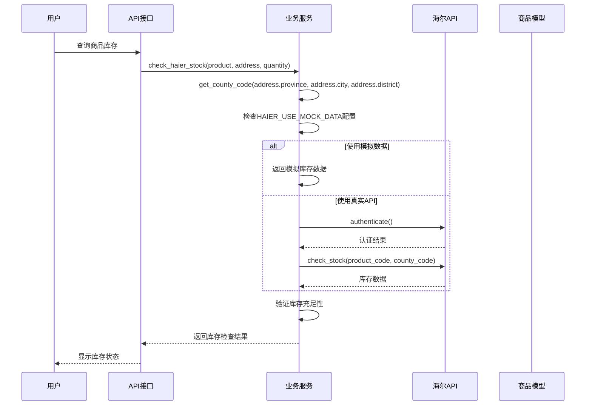

**图表来源**
- [backend/orders/services.py](file://backend/orders/services.py#L123-L216)

### 定时库存同步

系统提供了批量库存同步功能，支持定时任务执行大规模库存更新。

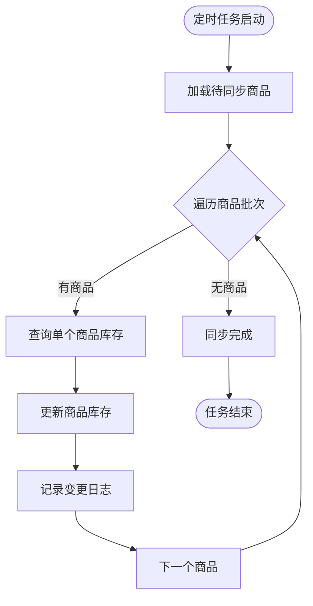

**图表来源**
- [backend/catalog/management/commands/sync_haier_products.py](file://backend/catalog/management/commands/sync_haier_products.py#L103-L156)

**节来源**
- [backend/orders/services.py](file://backend/orders/services.py#L123-L216)
- [backend/catalog/management/commands/sync_haier_products.py](file://backend/catalog/management/commands/sync_haier_products.py#L103-L156)

## county_code区域编码机制

### 区域编码的重要性

county_code参数是海尔API库存查询的关键要素，它决定了库存查询的地理范围和准确性。不同的区域编码对应不同的仓库和配送范围。

### 区域编码生成算法

系统提供了智能的区域编码生成功能，能够根据用户的详细地址自动生成准确的6位国标区域编码。

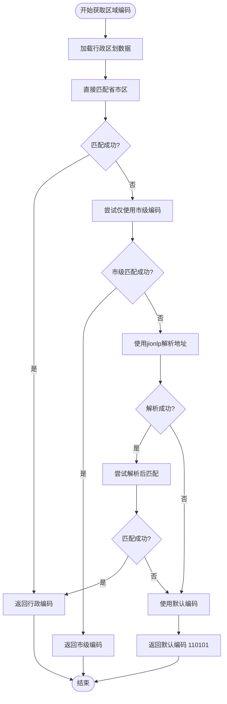

**图表来源**
- [backend/orders/services.py](file://backend/orders/services.py#L44-L120)

### 区域编码配置表

| 地址层级 | 示例输入 | 生成的county_code | 说明 |
|----------|----------|-------------------|------|
| 省市区 | 北京市朝阳区 | 110105 | 标准三元组匹配 |
| 省市 | 北京市 | 110100 | 市级编码（fallback） |
| 省市 | 北京 | 110100 | 省份简称匹配 |
| 不完整 | 朝阳区 | 110100 | 自动推断市级 |
| 默认 | 无效地址 | 110101 | 北京东城区 |

**节来源**
- [backend/orders/services.py](file://backend/orders/services.py#L44-L120)

## 缓存策略与性能优化

### 缓存架构设计

虽然当前代码中没有显式的缓存实现，但系统通过合理的API调用策略和数据库设计实现了良好的性能表现。

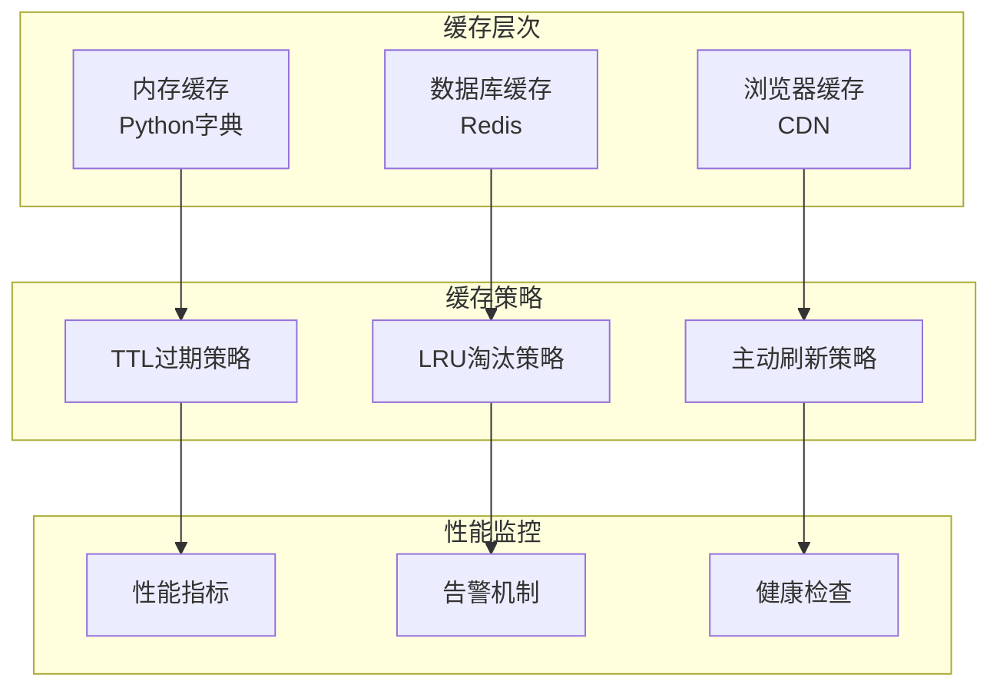

**图表来源**
- [backend/common/health.py](file://backend/common/health.py#L134-L181)

### 性能优化措施

1. **连接池管理**：HaierAPI类实现了自动认证和token管理，避免重复认证开销
2. **超时控制**：所有API请求设置了30秒超时，防止长时间阻塞
3. **并发控制**：使用数据库行锁确保库存操作的并发安全
4. **批量操作**：支持批量商品同步，减少API调用次数

### 错误重试机制

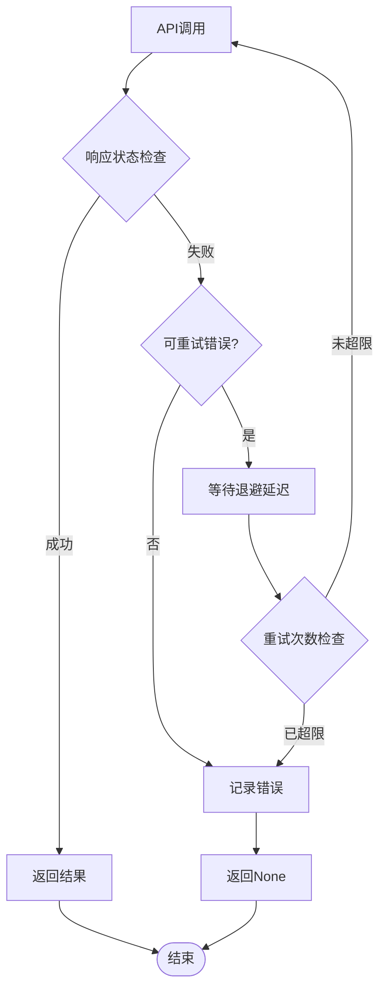

**节来源**
- [backend/common/health.py](file://backend/common/health.py#L134-L181)

## API接口设计

### RESTful API规范

系统提供了标准化的RESTful API接口，支持库存查询和管理操作。

| 端点 | 方法 | 描述 | 参数 |
|------|------|------|------|
| `/api/products/{id}/sync-haier-stock/` | POST | 同步单个商品库存 | county_code |
| `/api/haier/stock/` | GET | 查询库存 | product_code, county_code |
| `/api/haier/balance/` | GET | 查询账户余额 | 无 |

### 库存查询接口

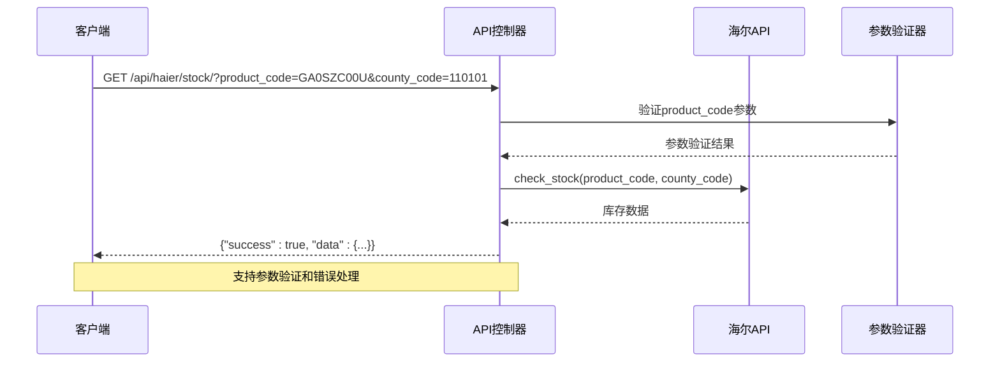

**图表来源**
- [backend/integrations/views.py](file://backend/integrations/views.py#L206-L250)

### 响应格式规范

所有API接口遵循统一的响应格式：

```json
{
  "success": true,
  "data": {
    "stock": 100,
    "secCode": "WH001",
    "warehouseGrade": "0",
    "timelinessData": {
      "cutTime": "18:00",
      "achieveUserOrderCut": "2025-11-26 18:00",
      "hour": "24",
      "isTranfer": "0"
    }
  }
}
```

**节来源**
- [backend/integrations/views.py](file://backend/integrations/views.py#L206-L250)

## 错误处理与重试机制

### 异常分类与处理

系统实现了完善的异常处理机制，能够区分不同类型的错误并采取相应的处理策略。

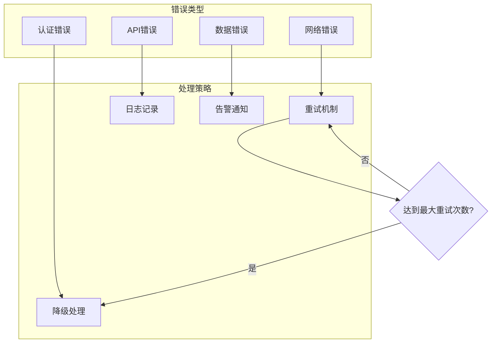

### 错误码定义

| 错误类型 | HTTP状态码 | 错误消息 | 处理建议 |
|----------|------------|----------|----------|
| 认证失败 | 401 | "海尔API认证失败" | 检查配置和凭据 |
| 参数错误 | 400 | "product_code参数必填" | 验证请求参数 |
| 查询失败 | 500 | "查询库存失败" | 检查网络和API状态 |
| 库存不足 | 400 | "库存不足" | 提示用户选择其他商品 |

### 日志记录策略

系统在关键节点记录详细的日志信息，便于问题排查和性能监控：

```python
# 认证日志示例
logger.info(f'使用真实海尔API查询库存: product_code={product.product_code}')

# 库存查询日志示例  
logger.info(f'海尔库存查询成功: product_code={product.product_code}, stock={available_stock}, required={quantity}')

# 错误日志示例
logger.error(f'海尔库存查询失败: product_code={product.product_code}')
```

**节来源**
- [backend/orders/services.py](file://backend/orders/services.py#L187-L216)
- [backend/integrations/haierapi.py](file://backend/integrations/haierapi.py#L133-L142)

## 使用示例与最佳实践

### 基础库存查询示例

```python
# 创建海尔API实例
from integrations.haierapi import HaierAPI

api = HaierAPI.from_settings()

# 认证
if not api.authenticate():
    raise Exception("海尔API认证失败")

# 查询库存
county_code = "110101"  # 北京东城区
stock_info = api.check_stock("GA0SZC00U", county_code)

if stock_info:
    print(f"可用库存: {stock_info['stock']}")
    print(f"仓库编码: {stock_info['secCode']}")
    print(f"时效信息: {stock_info['timelinessData']}")
else:
    print("查询库存失败")
```

### 订单库存检查示例

```python
# 在订单创建前检查库存
from orders.services import check_haier_stock
from catalog.models import Product
from users.models import Address

def create_order_with_stock_check(product_id, address_id, quantity):
    # 获取商品和地址
    product = Product.objects.get(id=product_id)
    address = Address.objects.get(id=address_id)
    
    try:
        # 检查库存
        stock_result = check_haier_stock(product, address, quantity)
        
        if stock_result['available']:
            # 创建订单逻辑
            order = create_new_order(product, address, quantity)
            return order
        else:
            raise ValueError(f"库存不足，当前可用: {stock_result['stock']}")
    
    except Exception as e:
        logger.error(f"库存检查失败: {str(e)}")
        raise
```

### 批量库存同步示例

```bash
# 使用管理命令同步库存
python manage.py sync_haier_products \
    --sync-stock \
    --county-code 110101 \
    --category 冰箱 \
    --brand 海尔
```

### 开发环境配置

```python
# settings.py 配置示例
HAIER_USE_MOCK_DATA = True  # 开发环境使用模拟数据
HAIER_CLIENT_ID = "your_client_id"
HAIER_CLIENT_SECRET = "your_client_secret"
HAIER_TOKEN_URL = "https://openplat-test.haier.net/oauth2/auth"
HAIER_BASE_URL = "https://openplat-test.haier.net"
HAIER_CUSTOMER_CODE = "your_customer_code"
HAIER_SEND_TO_CODE = "your_send_to_code"
HAIER_PASSWORD = "your_password"
HAIER_SELLER_PASSWORD = "your_seller_password"
```

**节来源**
- [backend/catalog/management/commands/sync_haier_products.py](file://backend/catalog/management/commands/sync_haier_products.py#L13-L156)
- [backend/backend/settings/base.py](file://backend/backend/settings/base.py#L258-L263)

## 故障排除指南

### 常见问题与解决方案

#### 1. 认证失败问题

**症状**：API调用返回认证错误或空结果

**排查步骤**：
1. 检查配置参数是否正确
2. 验证网络连接和防火墙设置
3. 确认token是否过期

**解决方案**：
```python
# 手动重新认证
api = HaierAPI.from_settings()
if not api.authenticate():
    # 检查配置
    print(f"Client ID: {api.client_id}")
    print(f"Token URL: {api.token_url}")
    # 重新配置
```

#### 2. 库存查询超时

**症状**：API调用超过30秒无响应

**排查步骤**：
1. 检查网络连接质量
2. 验证海尔API服务状态
3. 检查服务器负载情况

**解决方案**：
```python
# 增加超时时间或重试机制
try:
    res = requests.post(url, headers=headers, data=json.dumps(body), timeout=60)
except requests.Timeout:
    # 实现重试逻辑
    pass
```

#### 3. 区域编码错误

**症状**：库存查询返回0或错误结果

**排查步骤**：
1. 验证county_code格式是否正确（6位数字）
2. 检查地址解析逻辑
3. 确认目标区域是否有库存

**解决方案**：
```python
# 使用默认编码作为fallback
county_code = get_county_code(province, city, district) or "110101"
```

#### 4. 并发库存冲突

**症状**：库存超卖或并发访问异常

**排查步骤**：
1. 检查数据库行锁实现
2. 验证事务隔离级别
3. 监控并发访问模式

**解决方案**：
```python
# 使用数据库行锁
with transaction.atomic():
    product = Product.objects.select_for_update().get(id=product_id)
    # 执行库存操作
```

### 监控与告警

#### 关键指标监控

| 指标名称 | 监控频率 | 告警阈值 | 处理建议 |
|----------|----------|----------|----------|
| API响应时间 | 实时 | >30秒 | 检查网络和服务状态 |
| 认证成功率 | 实时 | <95% | 检查凭据和配置 |
| 库存查询成功率 | 实时 | <90% | 检查海尔API状态 |
| 错误率 | 实时 | >5% | 分析错误日志 |

#### 健康检查端点

```python
# 健康检查示例
@api_view(['GET'])
def health_check(request):
    # 检查数据库连接
    try:
        connection.cursor().execute('SELECT 1')
        db_status = 'healthy'
    except:
        db_status = 'unhealthy'
    
    # 检查缓存连接
    try:
        cache.set('__health_check__', 'healthy', timeout=10)
        cache.get('__health_check__')
        cache.delete('__health_check__')
        cache_status = 'healthy'
    except:
        cache_status = 'unhealthy'
    
    return Response({
        'status': 'healthy' if db_status == 'healthy' and cache_status == 'healthy' else 'unhealthy',
        'db': db_status,
        'cache': cache_status
    })
```

**节来源**
- [backend/common/health.py](file://backend/common/health.py#L70-L181)

## 总结

本文档全面介绍了基于海尔API的库存查询与更新功能的实现。系统采用了模块化的设计理念，通过HaierAPI类提供统一的API访问接口，通过Product模型管理本地库存数据，通过专门的服务层处理复杂的业务逻辑。

### 主要特性

1. **实时库存查询**：支持按产品编码和区域编码进行精确库存查询
2. **智能区域编码**：自动解析用户地址生成准确的区域编码
3. **并发安全保障**：使用数据库行锁确保库存操作的并发安全
4. **完善的错误处理**：多层次的错误处理和重试机制
5. **灵活的配置选项**：支持模拟数据和真实API的切换
6. **标准化API接口**：提供RESTful风格的标准API接口

### 技术优势

- **高性能**：通过合理的缓存策略和批量操作提升性能
- **高可用**：完善的错误处理和降级机制确保系统稳定运行
- **易扩展**：模块化设计便于功能扩展和维护
- **易集成**：标准化的API接口便于第三方系统集成

### 最佳实践建议

1. **合理配置超时时间**：根据网络环境调整API请求超时设置
2. **实施监控告警**：建立完善的监控体系及时发现和解决问题
3. **定期维护库存**：通过定时任务保持本地库存数据的准确性
4. **优化查询策略**：合理使用批量查询减少API调用次数
5. **加强安全防护**：妥善保管API凭据，实施必要的安全措施

通过本文档的指导，开发者可以深入理解系统的实现原理，正确使用各项功能，并根据实际需求进行定制和扩展。