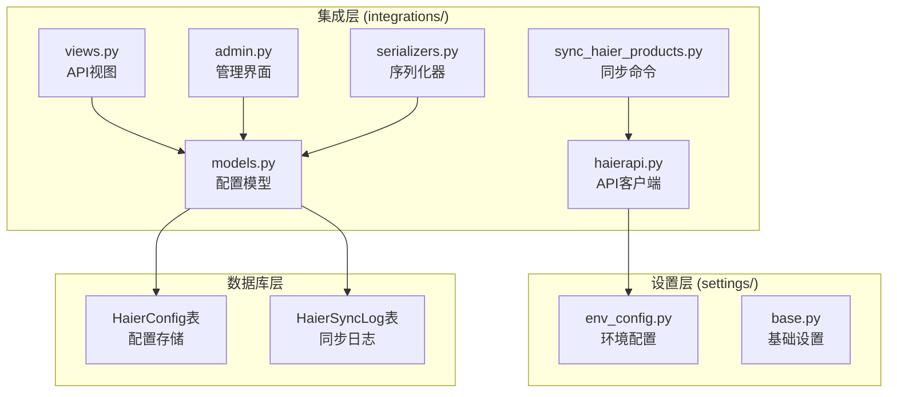
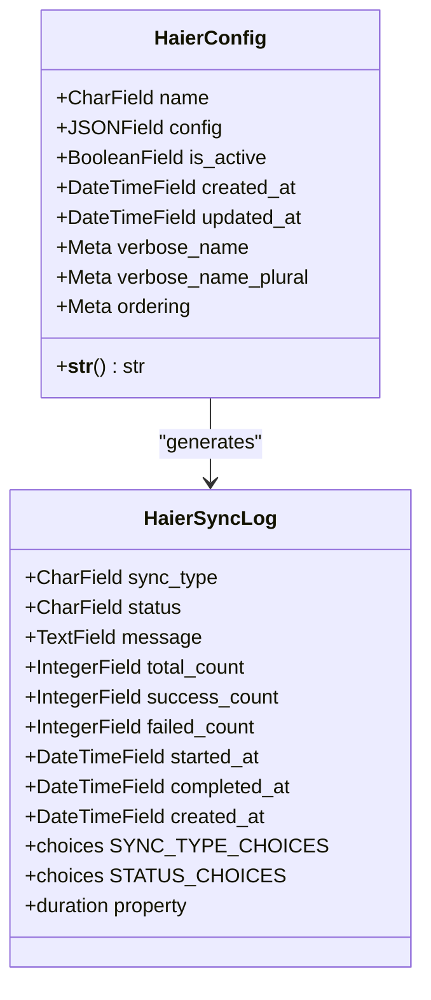
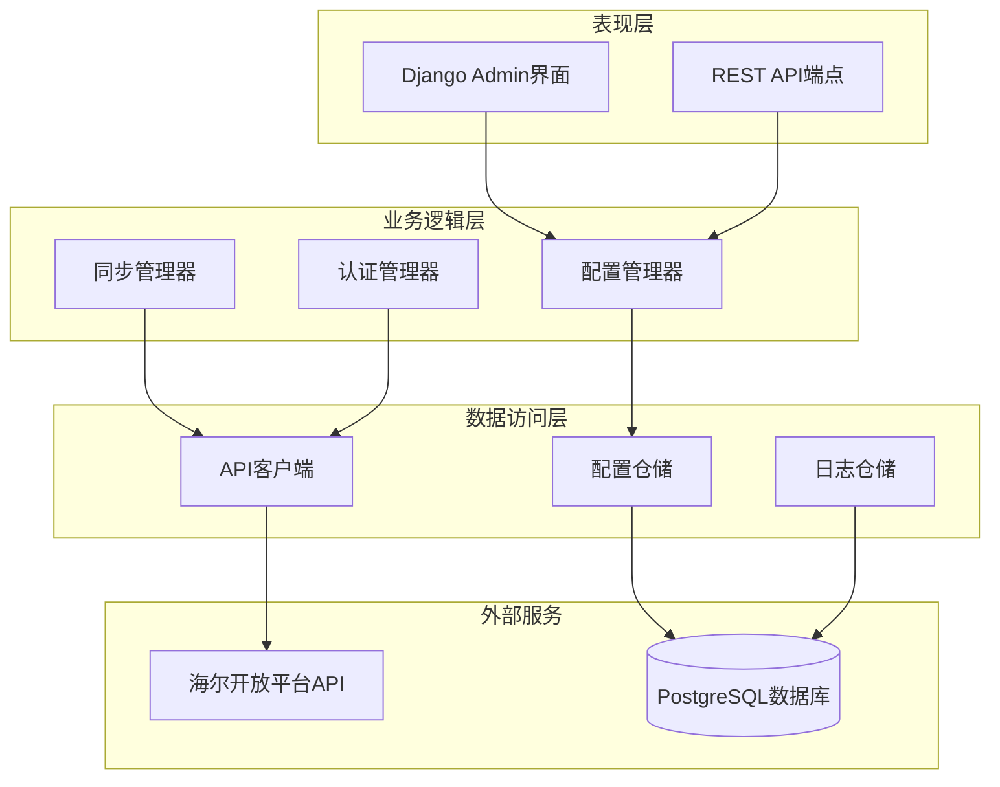
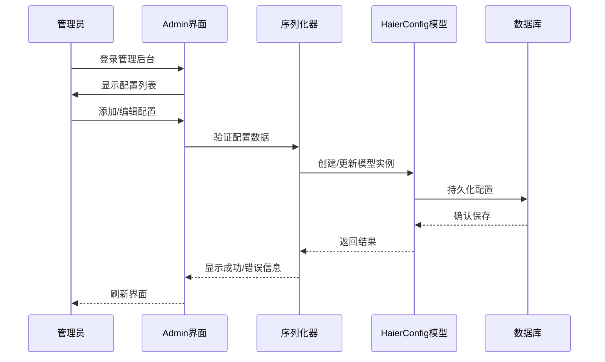
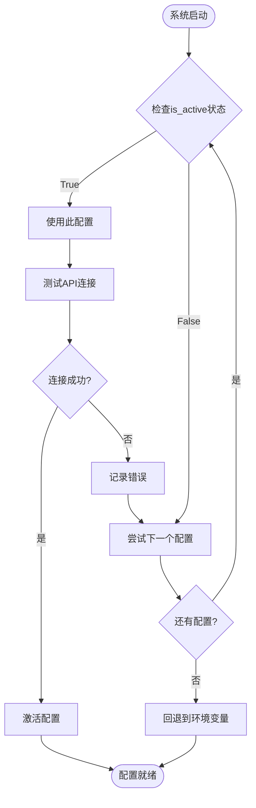
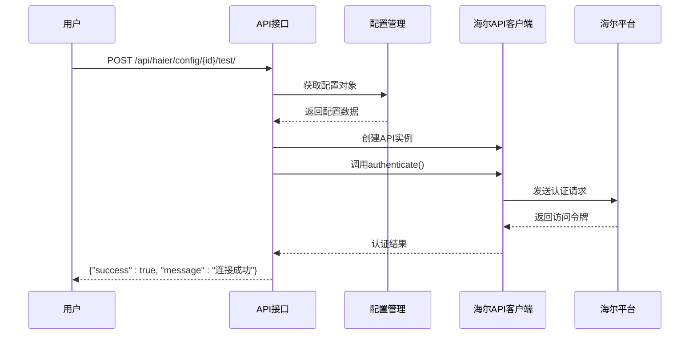
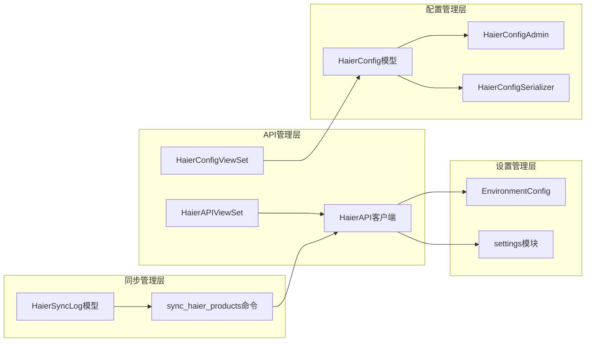

# 海尔API配置管理

<cite>
**本文档引用的文件**
- [models.py](file://backend/integrations/models.py)
- [admin.py](file://backend/integrations/admin.py)
- [serializers.py](file://backend/integrations/serializers.py)
- [views.py](file://backend/integrations/views.py)
- [haierapi.py](file://backend/integrations/haierapi.py)
- [env_config.py](file://backend/backend/settings/env_config.py)
- [base.py](file://backend/backend/settings/base.py)
- [sync_haier_products.py](file://backend/catalog/management/commands/sync_haier_products.py)
- [urls.py](file://backend/integrations/urls.py)
- [0002_haierconfig_haiersynclog_delete_supplierconfig_and_more.py](file://backend/integrations/migrations/0002_haierconfig_haiersynclog_delete_supplierconfig_and_more.py)
</cite>

## 目录
1. [简介](#简介)
2. [项目结构](#项目结构)
3. [核心组件](#核心组件)
4. [架构概览](#架构概览)
5. [详细组件分析](#详细组件分析)
6. [依赖关系分析](#依赖关系分析)
7. [性能考虑](#性能考虑)
8. [故障排除指南](#故障排除指南)
9. [结论](#结论)

## 简介

海尔API配置管理系统是一个基于Django框架的企业级集成解决方案，专门设计用于管理海尔开放平台API的认证凭据和配置参数。该系统提供了灵活的配置管理机制，支持数据库配置与环境变量配置的双重加载模式，确保了系统的安全性和可维护性。

系统的核心设计理念包括：
- **安全性优先**：通过JSONField存储敏感配置信息，支持数据库级别的加密存储
- **灵活性设计**：采用JSON格式存储配置，支持动态扩展新的配置项
- **多环境支持**：同时支持数据库配置和环境变量配置，满足不同部署场景需求
- **管理员友好**：提供直观的Django Admin界面，便于配置管理

## 项目结构

海尔API配置管理系统位于`backend/integrations/`目录下，采用模块化架构设计：



**图表来源**
- [models.py](file://backend/integrations/models.py#L1-L47)
- [admin.py](file://backend/integrations/admin.py#L1-L26)
- [views.py](file://backend/integrations/views.py#L36-L83)
- [haierapi.py](file://backend/integrations/haierapi.py#L1-L213)

**章节来源**
- [models.py](file://backend/integrations/models.py#L1-L47)
- [admin.py](file://backend/integrations/admin.py#L1-L26)
- [views.py](file://backend/integrations/views.py#L36-L83)

## 核心组件

### HaierConfig模型

HaierConfig是系统的核心数据模型，负责存储海尔API的所有配置信息：



**图表来源**
- [models.py](file://backend/integrations/models.py#L4-L47)
- [models.py](file://backend/integrations/models.py#L50-L149)

### 配置存储机制

系统采用JSONField存储配置信息，这种设计具有以下优势：

1. **灵活性**：支持动态添加新的配置字段，无需修改数据库结构
2. **可扩展性**：可以存储复杂的数据结构，如嵌套对象和数组
3. **版本兼容**：新旧配置可以共存，支持渐进式功能升级
4. **查询能力**：PostgreSQL的JSONField支持索引和查询优化

**章节来源**
- [models.py](file://backend/integrations/models.py#L4-L47)

## 架构概览

海尔API配置管理系统采用分层架构设计，确保了各层之间的职责分离和松耦合：



**图表来源**
- [admin.py](file://backend/integrations/admin.py#L5-L12)
- [views.py](file://backend/integrations/views.py#L36-L83)
- [haierapi.py](file://backend/integrations/haierapi.py#L10-L25)

## 详细组件分析

### HaierConfig模型设计

HaierConfig模型采用了精心设计的字段结构，每个字段都有明确的用途和约束：

#### 字段定义分析

| 字段名 | 类型 | 约束 | 用途 |
|--------|------|------|------|
| name | CharField | unique, max_length=50 | 配置标识符，默认为'haier' |
| config | JSONField | 必填 | 包含client_id、client_secret等认证信息 |
| is_active | BooleanField | default=True | 控制配置的启用/禁用状态 |
| created_at | DateTimeField | auto_now_add=True | 自动记录创建时间 |
| updated_at | DateTimeField | auto_now=True | 自动记录更新时间 |

#### JSONField配置信息结构

配置信息通过JSONField存储，支持以下关键字段：

```json
{
    "client_id": "your_client_id",
    "client_secret": "your_client_secret", 
    "token_url": "https://openplat-test.haier.net/oauth2/auth",
    "base_url": "https://openplat-test.haier.net",
    "customer_code": "8800633175",
    "send_to_code": "8800633175",
    "supplier_code": "1001",
    "password": "your_password",
    "seller_password": "your_password"
}
```

**章节来源**
- [models.py](file://backend/integrations/models.py#L11-L47)

### 管理界面实现

Django Admin提供了直观的配置管理界面：



**图表来源**
- [admin.py](file://backend/integrations/admin.py#L5-L12)
- [serializers.py](file://backend/integrations/serializers.py#L8-L30)

#### 安全特性

管理员界面实现了以下安全措施：

1. **只读字段**：创建时间和更新时间字段对管理员只读
2. **权限控制**：仅管理员用户可以访问配置管理功能
3. **输入验证**：序列化器对配置数据进行严格验证
4. **审计追踪**：自动记录配置的创建和修改时间

**章节来源**
- [admin.py](file://backend/integrations/admin.py#L5-L12)
- [serializers.py](file://backend/integrations/serializers.py#L16-L30)

### 环境变量配置机制

系统支持通过环境变量加载配置，提供了两种加载方式：

#### 1. 数据库配置优先

当数据库中存在HaierConfig记录时，系统优先使用数据库配置：

```python
# 从数据库配置加载
config_obj = HaierConfig.objects.first()
if config_obj and config_obj.is_active:
    api = HaierAPI(config_obj.config)
```

#### 2. 环境变量回退

当数据库配置不可用时，系统自动回退到环境变量配置：

```python
# 从环境变量加载
from django.conf import settings
config = {
    'client_id': settings.HAIER_CLIENT_ID,
    'client_secret': settings.HAIER_CLIENT_SECRET,
    'token_url': settings.HAIER_TOKEN_URL,
    'base_url': settings.HAIER_BASE_URL,
    'customer_code': settings.HAIER_CUSTOMER_CODE,
    'send_to_code': settings.HAIER_SEND_TO_CODE,
    'supplier_code': settings.HAIER_SUPPLIER_CODE,
    'password': settings.HAIER_PASSWORD,
    'seller_password': settings.HAIER_SELLER_PASSWORD,
}
```

**章节来源**
- [haierapi.py](file://backend/integrations/haierapi.py#L26-L40)
- [base.py](file://backend/backend/settings/base.py#L238-L246)

### 认证凭据安全管理

#### 敏感信息存储原则

1. **最小权限原则**：仅在必要时才存储敏感信息
2. **加密存储**：数据库配置通过JSONField存储，建议配合数据库加密
3. **访问控制**：严格的权限控制，仅授权用户可以访问
4. **审计日志**：所有配置变更都被记录和追踪

#### 最佳实践

以下是推荐的环境变量命名规范：

| 环境变量名 | 描述 | 示例值 |
|------------|------|--------|
| HAIER_CLIENT_ID | 客户端ID | `haier_client_12345` |
| HAIER_CLIENT_SECRET | 客户端密钥 | `secret_key_abc123` |
| HAIER_TOKEN_URL | 认证URL | `https://openplat-test.haier.net/oauth2/auth` |
| HAIER_BASE_URL | API基础URL | `https://openplat-test.haier.net` |
| HAIER_CUSTOMER_CODE | 客户编码 | `8800633175` |
| HAIER_SEND_TO_CODE | 发送方编码 | `8800633175` |
| HAIER_SUPPLIER_CODE | 供应商编码 | `1001` |
| HAIER_PASSWORD | 通用密码 | `supplier_password` |
| HAIER_SELLER_PASSWORD | 卖家密码 | `seller_password` |

**章节来源**
- [base.py](file://backend/backend/settings/base.py#L238-L246)
- [env_config.py](file://backend/backend/settings/env_config.py#L50-L63)

### 多配置环境控制策略

#### is_active字段的作用

`is_active`字段提供了灵活的配置控制机制：



**图表来源**
- [models.py](file://backend/integrations/models.py#L25-L29)
- [views.py](file://backend/integrations/views.py#L73-L83)

#### 启用/禁用控制策略

1. **优先级排序**：系统按`-is_active, name`顺序查找可用配置
2. **故障转移**：当主配置失效时，自动切换到备用配置
3. **实时生效**：配置状态变更立即生效，无需重启服务
4. **状态监控**：通过Admin界面实时监控配置状态

**章节来源**
- [models.py](file://backend/integrations/models.py#L44-L45)
- [views.py](file://backend/integrations/views.py#L60-L83)

### API测试功能

系统提供了完整的API连接测试功能：



**图表来源**
- [views.py](file://backend/integrations/views.py#L60-L83)
- [haierapi.py](file://backend/integrations/haierapi.py#L41-L69)

**章节来源**
- [views.py](file://backend/integrations/views.py#L60-L83)

## 依赖关系分析

### 组件依赖图



**图表来源**
- [models.py](file://backend/integrations/models.py#L1-L47)
- [admin.py](file://backend/integrations/admin.py#L1-L26)
- [views.py](file://backend/integrations/views.py#L36-L83)
- [haierapi.py](file://backend/integrations/haierapi.py#L10-L25)

### 外部依赖

系统依赖以下外部组件：

1. **Django框架**：提供Web框架和ORM功能
2. **PostgreSQL数据库**：支持JSONField和高性能查询
3. **requests库**：HTTP客户端，用于与海尔API通信
4. **Python标准库**：datetime、logging等基础功能

**章节来源**
- [haierapi.py](file://backend/integrations/haierapi.py#L1-L6)
- [models.py](file://backend/integrations/models.py#L1-L3)

## 性能考虑

### 查询优化

1. **索引策略**：
   - `is_active`字段用于优先级排序
   - `created_at`字段支持时间范围查询
   - `sync_type`和`status`字段支持同步日志查询优化

2. **缓存机制**：
   - 访问令牌缓存，避免频繁认证
   - 配置信息缓存，减少数据库查询

3. **批量操作**：
   - 支持批量商品同步
   - 批量价格和库存更新

### 内存管理

1. **流式处理**：大量数据同步采用流式处理，避免内存溢出
2. **连接池**：HTTP连接复用，减少连接开销
3. **垃圾回收**：及时释放不再使用的资源

## 故障排除指南

### 常见问题及解决方案

#### 1. 认证失败

**症状**：API调用返回401 Unauthorized

**排查步骤**：
1. 检查client_id和client_secret是否正确
2. 验证token_url是否可达
3. 确认网络连接和防火墙设置

**解决方案**：
```bash
# 测试配置
python manage.py shell
>>> from integrations.haierapi import HaierAPI
>>> config = {'client_id': '...', 'client_secret': '...', ...}
>>> api = HaierAPI(config)
>>> api.authenticate()
```

#### 2. 配置加载失败

**症状**：系统无法找到有效的配置

**排查步骤**：
1. 检查数据库中是否有活动配置
2. 验证环境变量是否正确设置
3. 查看系统日志获取详细错误信息

**解决方案**：
```python
# 检查配置状态
from integrations.models import HaierConfig
configs = HaierConfig.objects.all()
for config in configs:
    print(f"{config.name}: {'启用' if config.is_active else '禁用'}")
```

#### 3. 同步任务失败

**症状**：商品同步任务中断或失败

**排查步骤**：
1. 检查API响应状态码
2. 验证商品数据格式
3. 查看同步日志详情

**解决方案**：
```bash
# 查看同步日志
python manage.py shell
>>> from integrations.models import HaierSyncLog
>>> logs = HaierSyncLog.objects.filter(sync_type='products').order_by('-created_at')
>>> for log in logs[:10]:
...     print(f"{log.created_at}: {log.status} - {log.message}")
```

**章节来源**
- [views.py](file://backend/integrations/views.py#L60-L83)
- [sync_haier_products.py](file://backend/catalog/management/commands/sync_haier_products.py#L66-L70)

### 监控和告警

建议实施以下监控措施：

1. **健康检查**：定期测试API连接状态
2. **错误率监控**：跟踪同步任务的成功率
3. **性能监控**：监控API响应时间和吞吐量
4. **容量监控**：跟踪数据库存储使用情况

## 结论

海尔API配置管理系统通过精心设计的架构和安全机制，为企业提供了可靠、灵活的海尔开放平台API集成解决方案。系统的主要优势包括：

### 技术优势

1. **安全性**：通过JSONField存储配置，支持数据库加密；严格的权限控制和审计日志
2. **灵活性**：支持动态配置扩展，数据库配置与环境变量双重加载
3. **可靠性**：多配置环境支持，故障自动转移机制
4. **可维护性**：直观的管理界面，完善的API测试功能

### 最佳实践总结

1. **配置管理**：优先使用数据库配置，确保配置的持久性和可追溯性
2. **安全存储**：敏感信息应配合数据库加密功能使用
3. **环境隔离**：开发、测试、生产环境使用不同的配置
4. **监控告警**：建立完善的监控体系，及时发现和解决问题

### 未来发展方向

1. **配置模板**：提供标准化的配置模板，简化新项目的配置工作
2. **配置版本控制**：支持配置的历史版本管理和回滚功能
3. **自动化部署**：与CI/CD流水线集成，实现配置的自动化部署
4. **多租户支持**：扩展系统以支持多租户环境下的配置隔离

通过持续的优化和改进，该系统将为企业提供更加稳定、高效和安全的海尔API集成服务。