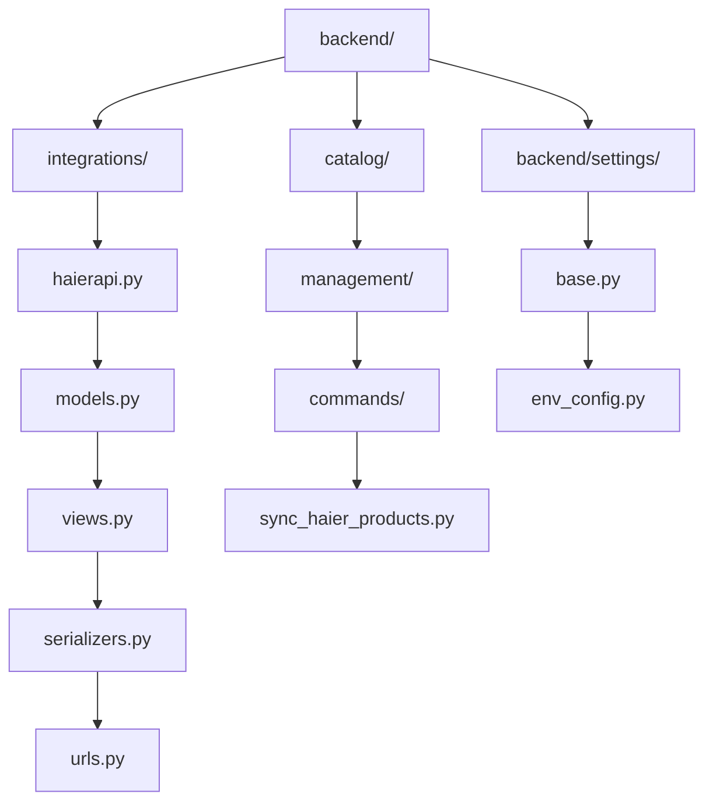
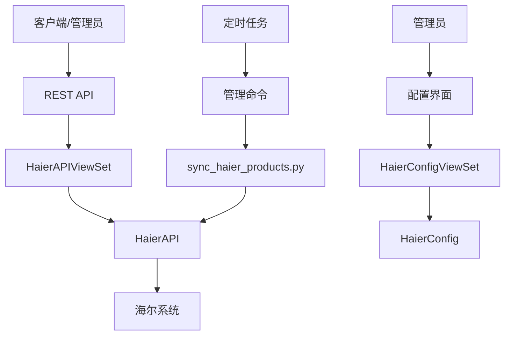
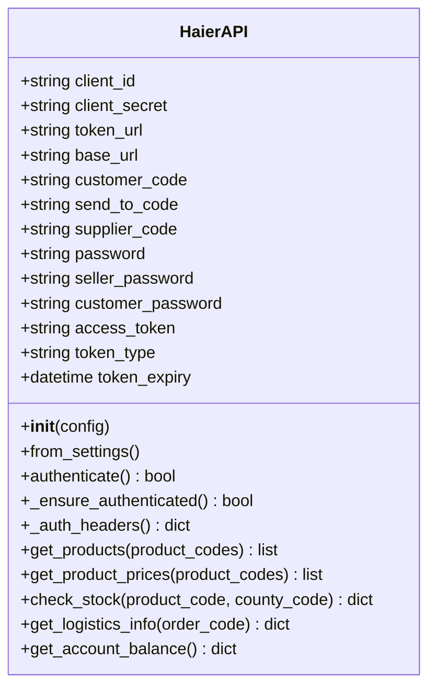
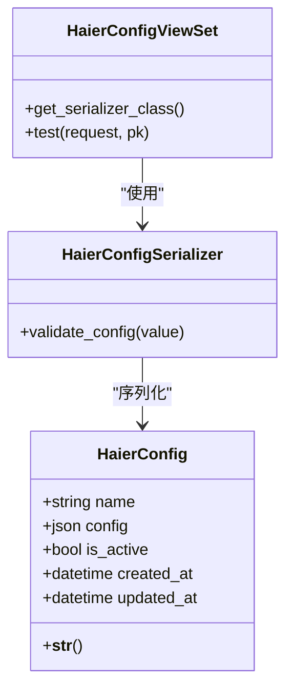
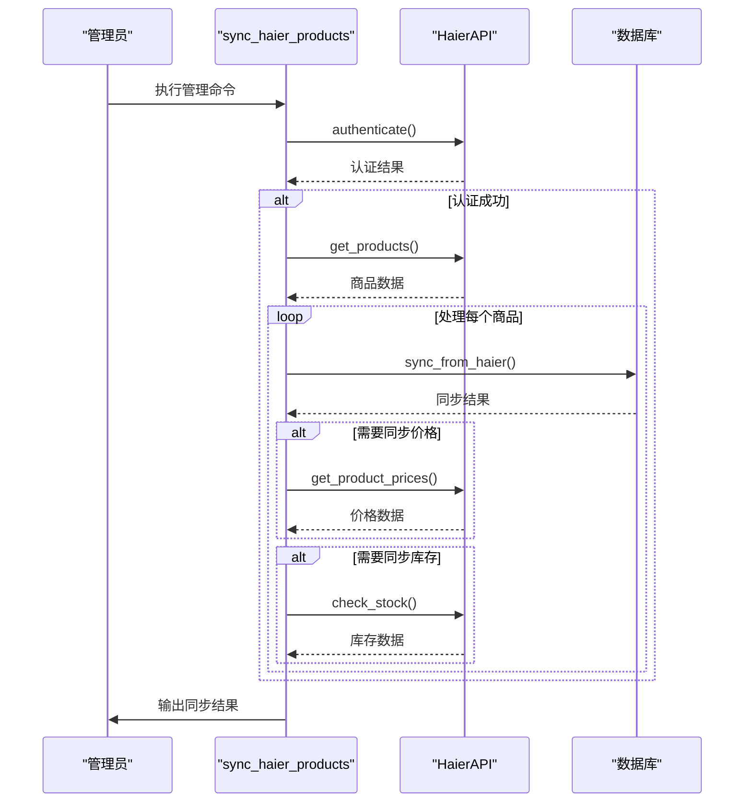
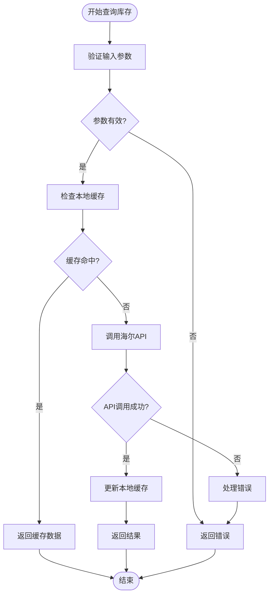
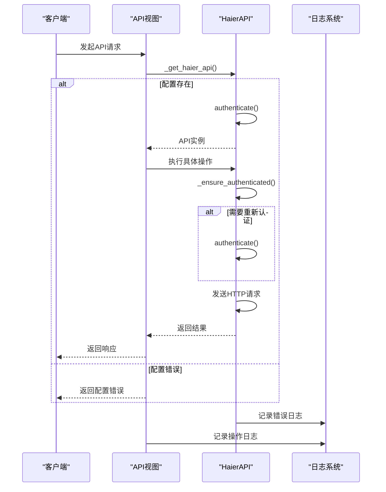
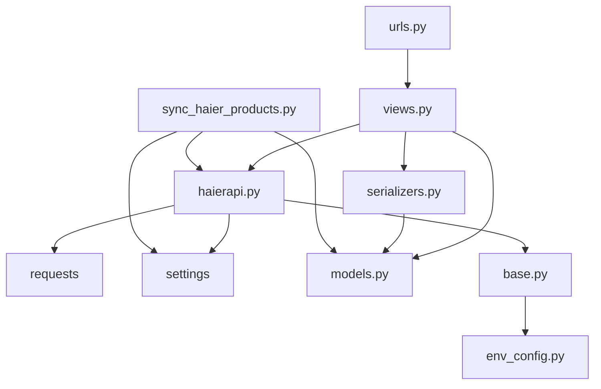

# 集成API

<cite>
**本文档引用的文件**  
- [haierapi.py](file://backend/integrations/haierapi.py)
- [views.py](file://backend/integrations/views.py)
- [models.py](file://backend/integrations/models.py)
- [serializers.py](file://backend/integrations/serializers.py)
- [urls.py](file://backend/integrations/urls.py)
- [sync_haier_products.py](file://backend/catalog/management/commands/sync_haier_products.py)
- [base.py](file://backend/backend/settings/base.py)
- [env_config.py](file://backend/backend/settings/env_config.py)
</cite>

## 目录
1. [简介](#简介)
2. [项目结构](#项目结构)
3. [核心组件](#核心组件)
4. [架构概述](#架构概述)
5. [详细组件分析](#详细组件分析)
6. [依赖分析](#依赖分析)
7. [性能考虑](#性能考虑)
8. [故障排除指南](#故障排除指南)
9. [结论](#结论)

## 简介
本文档详细介绍了与海尔系统的API集成功能，重点涵盖供应商数据同步、库存查询、配置管理、API调用机制和日志监控等方面。文档旨在为管理员和开发人员提供全面的技术指导，帮助他们理解和维护系统集成。

## 项目结构
项目结构清晰地划分了不同功能模块，其中`backend/integrations/`目录专门负责与外部系统的集成，特别是与海尔系统的对接。

**图示来源**
- [haierapi.py](file://backend/integrations/haierapi.py)
- [models.py](file://backend/integrations/models.py)
- [views.py](file://backend/integrations/views.py)
- [sync_haier_products.py](file://backend/catalog/management/commands/sync_haier_products.py)
- [base.py](file://backend/backend/settings/base.py)

## 核心组件
本节分析与海尔系统集成的核心组件，包括API客户端、配置管理、数据同步和日志记录。

**本节来源**
- [haierapi.py](file://backend/integrations/haierapi.py#L1-L214)
- [models.py](file://backend/integrations/models.py#L1-L150)
- [views.py](file://backend/integrations/views.py#L1-L327)

## 架构概述
系统通过`HaierAPI`客户端类与海尔API进行通信，使用Django REST Framework提供管理接口，并通过管理命令实现数据同步。

**图示来源**
- [haierapi.py](file://backend/integrations/haierapi.py#L10-L214)
- [views.py](file://backend/integrations/views.py#L104-L327)
- [models.py](file://backend/integrations/models.py#L4-L47)
- [sync_haier_products.py](file://backend/catalog/management/commands/sync_haier_products.py#L13-L156)

## 详细组件分析
本节深入分析各个关键组件的实现细节。

### 海尔API客户端分析
`HaierAPI`类是与海尔系统通信的核心客户端，封装了认证、API调用和错误处理逻辑。

#### 类图

**图示来源**
- [haierapi.py](file://backend/integrations/haierapi.py#L10-L214)

**本节来源**
- [haierapi.py](file://backend/integrations/haierapi.py#L10-L214)

### 配置管理分析
海尔API配置通过`HaierConfig`模型进行管理，支持在数据库中存储多个配置实例。

#### 类图

**图示来源**
- [models.py](file://backend/integrations/models.py#L4-L47)
- [serializers.py](file://backend/integrations/serializers.py#L8-L31)
- [views.py](file://backend/integrations/views.py#L36-L101)

**本节来源**
- [models.py](file://backend/integrations/models.py#L4-L47)
- [serializers.py](file://backend/integrations/serializers.py#L8-L31)
- [views.py](file://backend/integrations/views.py#L36-L101)

### 数据同步机制分析
供应商数据同步通过异步执行机制实现，支持按需同步特定商品或批量同步。

#### 序列图

**图示来源**
- [sync_haier_products.py](file://backend/catalog/management/commands/sync_haier_products.py#L13-L156)
- [haierapi.py](file://backend/integrations/haierapi.py#L74-L97)
- [models.py](file://backend/catalog/models.py)

**本节来源**
- [sync_haier_products.py](file://backend/catalog/management/commands/sync_haier_products.py#L13-L156)

### 库存查询接口分析
供应商库存查询接口实现了缓存策略以提高性能和响应速度。

#### 流程图

**图示来源**
- [haierapi.py](file://backend/integrations/haierapi.py#L121-L142)
- [base.py](file://backend/backend/settings/base.py#L213-L221)

**本节来源**
- [haierapi.py](file://backend/integrations/haierapi.py#L121-L142)

### API调用机制分析
API调用实现了重试机制、错误处理和性能优化策略。

#### 序列图

**图示来源**
- [views.py](file://backend/integrations/views.py#L122-L327)
- [haierapi.py](file://backend/integrations/haierapi.py#L41-L69)
- [models.py](file://backend/integrations/models.py#L50-L150)

**本节来源**
- [views.py](file://backend/integrations/views.py#L122-L327)
- [haierapi.py](file://backend/integrations/haierapi.py#L41-L69)

## 依赖分析
系统组件之间的依赖关系清晰，遵循了良好的分层架构原则。

**图示来源**
- [haierapi.py](file://backend/integrations/haierapi.py)
- [views.py](file://backend/integrations/views.py)
- [models.py](file://backend/integrations/models.py)
- [serializers.py](file://backend/integrations/serializers.py)
- [urls.py](file://backend/integrations/urls.py)
- [sync_haier_products.py](file://backend/catalog/management/commands/sync_haier_products.py)
- [base.py](file://backend/backend/settings/base.py)

**本节来源**
- [haierapi.py](file://backend/integrations/haierapi.py)
- [views.py](file://backend/integrations/views.py)
- [models.py](file://backend/integrations/models.py)

## 性能考虑
系统在性能方面进行了多项优化，包括缓存策略、连接复用和异步处理。

**本节来源**
- [base.py](file://backend/backend/settings/base.py#L213-L221)
- [haierapi.py](file://backend/integrations/haierapi.py#L48-L61)
- [sync_haier_products.py](file://backend/catalog/management/commands/sync_haier_products.py)

## 故障排除指南
本节提供常见问题的排查方法和建议。

**本节来源**
- [haierapi.py](file://backend/integrations/haierapi.py#L50-L64)
- [views.py](file://backend/integrations/views.py#L94-L101)
- [models.py](file://backend/integrations/models.py#L50-L150)

## 结论
本文档全面介绍了与海尔系统的API集成方案，涵盖了配置管理、数据同步、库存查询、API调用机制和日志监控等关键方面。系统设计合理，具有良好的可维护性和扩展性，能够满足业务需求。