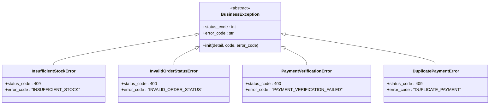

# 业务逻辑

<cite>
**本文档引用的文件**
- [backend/orders/models.py](file://backend/orders/models.py)
- [backend/orders/state_machine.py](file://backend/orders/state_machine.py)
- [backend/orders/payment_service.py](file://backend/orders/payment_service.py)
- [backend/orders/services.py](file://backend/orders/services.py)
- [backend/orders/views.py](file://backend/orders/views.py)
- [backend/catalog/search.py](file://backend/catalog/search.py)
- [backend/users/services.py](file://backend/users/services.py)
- [backend/common/exceptions.py](file://backend/common/exceptions.py)
</cite>

## 目录
1. [概述](#概述)
2. [订单创建流程](#订单创建流程)
3. [订单状态机](#订单状态机)
4. [支付生命周期管理](#支付生命周期管理)
5. [商品搜索算法](#商品搜索算法)
6. [用户认证与资料更新](#用户认证与资料更新)
7. [API视图调用关系](#api视图调用关系)
8. [异常处理机制](#异常处理机制)
9. [总结](#总结)

## 概述

本文档深入分析了电商小程序项目的核心业务逻辑实现，重点关注orders应用中的订单创建流程、状态转换规则、支付生命周期管理，以及catalog/search.py中的商品搜索算法和排序逻辑。同时阐述了users/services.py中的用户认证和资料更新逻辑，结合views.py中的调用关系，说明服务层如何被API视图调用，以及异常处理机制的应用。

## 订单创建流程

### 核心业务逻辑架构

订单创建流程是整个电商系统的核心，涉及库存检查、快照生成、支付记录创建等多个环节的原子性操作。

**图表来源**
- [backend/orders/services.py](file://backend/orders/services.py#L219-L297)
- [backend/orders/views.py](file://backend/orders/views.py#L136-L217)

### 库存检查机制

库存检查分为两种场景：普通产品和海尔产品。

#### 普通产品库存检查
对于非海尔产品，系统使用数据库行锁确保库存的并发安全性：

**图表来源**
- [backend/orders/services.py](file://backend/orders/services.py#L332-L372)

#### 海尔产品库存检查
海尔产品使用外部API进行库存验证：

**图表来源**
- [backend/orders/services.py](file://backend/orders/services.py#L123-L216)

**章节来源**
- [backend/orders/services.py](file://backend/orders/services.py#L219-L297)
- [backend/orders/views.py](file://backend/orders/views.py#L136-L217)

### 快照生成机制

订单创建时会生成商品快照，确保订单状态的不可变性：

| 快照字段 | 描述 | 数据来源 |
|---------|------|----------|
| snapshot_contact_name | 联系人姓名 | Address.contact_name |
| snapshot_phone | 联系电话 | Address.phone |
| snapshot_address | 完整地址 | Province + City + District + Detail |
| snapshot_province | 省份 | Address.province |
| snapshot_city | 城市 | Address.city |
| snapshot_district | 区县 | Address.district |
| snapshot_town | 乡镇街道 | Address.town |

**章节来源**
- [backend/orders/models.py](file://backend/orders/models.py#L35-L42)
- [backend/orders/services.py](file://backend/orders/services.py#L255-L288)

### 支付记录创建

订单创建完成后立即创建支付记录，确保支付流程的完整性：

**图表来源**
- [backend/orders/models.py](file://backend/orders/models.py#L186-L234)

**章节来源**
- [backend/orders/models.py](file://backend/orders/models.py#L186-L234)
- [backend/orders/views.py](file://backend/orders/views.py#L189-L194)

## 订单状态机

### 状态转换规则

订单状态机定义了严格的订单状态转换规则，确保业务逻辑的正确性：

**图表来源**
- [backend/orders/state_machine.py](file://backend/orders/state_machine.py#L33-L56)

### 状态转换约束

系统严格控制状态转换的合法性：

| 当前状态 | 允许转换到的状态 | 业务逻辑说明 |
|---------|----------------|-------------|
| pending | paid, cancelled | 待支付订单可以支付成功或取消 |
| paid | shipped, refunded, cancelled | 已支付订单可以发货、退款或取消 |
| shipped | completed, refunded | 已发货订单可以完成或退款 |
| completed | refunded | 已完成订单只能申请售后退款 |
| refunded | paid | 退款完成后可以恢复支付状态 |
| cancelled, refunded | 无 | 终态状态不允许进一步转换 |

**章节来源**
- [backend/orders/state_machine.py](file://backend/orders/state_machine.py#L33-L56)

### 状态转换业务逻辑

状态转换过程中会触发相应的业务逻辑：

**图表来源**
- [backend/orders/state_machine.py](file://backend/orders/state_machine.py#L95-L154)

**章节来源**
- [backend/orders/state_machine.py](file://backend/orders/state_machine.py#L95-L154)

## 支付生命周期管理

### 支付服务架构

支付服务负责处理支付流程的各个环节，包括签名验证、金额校验、状态更新等：

**图表来源**
- [backend/orders/payment_service.py](file://backend/orders/payment_service.py#L20-L292)

### 支付回调处理

支付回调是支付流程的重要环节，系统需要验证回调的真实性和安全性：

**图表来源**
- [backend/orders/views.py](file://backend/orders/views.py#L1134-L1294)
- [backend/orders/payment_service.py](file://backend/orders/payment_service.py#L106-L204)

### 支付安全机制

系统实现了多层次的安全防护：

| 安全措施 | 实现方式 | 目的 |
|---------|----------|------|
| 签名验证 | HMAC-SHA256算法 | 验证回调数据的真实性 |
| 金额校验 | 精确decimal比较 | 确保支付金额准确无误 |
| 幂等处理 | 基于支付ID的重复检查 | 防止重复处理支付回调 |
| 事务控制 | 数据库事务保证原子性 | 确保支付状态的一致性 |
| 过期检查 | TTL机制 | 防止过期支付的处理 |

**章节来源**
- [backend/orders/payment_service.py](file://backend/orders/payment_service.py#L30-L292)
- [backend/orders/views.py](file://backend/orders/views.py#L1134-L1294)

## 商品搜索算法

### 搜索服务架构

商品搜索服务提供了强大的搜索、过滤和排序功能：

**图表来源**
- [backend/catalog/search.py](file://backend/catalog/search.py#L19-L287)

### 关键词搜索算法

搜索算法支持模糊匹配和相关性排序：

**图表来源**
- [backend/catalog/search.py](file://backend/catalog/search.py#L97-L135)

### 排序逻辑

系统支持多种排序策略：

| 排序选项 | 排序依据 | 优先级 |
|---------|----------|--------|
| relevance | 关键词相关性 | 主要 |
| price_asc | 价格升序 | 次要 |
| price_desc | 价格降序 | 次要 |
| sales | 销量降序 | 次要 |
| views | 浏览量降序 | 次要 |
| created | 创建时间降序 | 次要 |

**章节来源**
- [backend/catalog/search.py](file://backend/catalog/search.py#L36-L44)
- [backend/catalog/search.py](file://backend/catalog/search.py#L160-L200)

### 搜索建议功能

系统提供智能搜索建议功能：

**图表来源**
- [backend/catalog/search.py](file://backend/catalog/search.py#L248-L282)

**章节来源**
- [backend/catalog/search.py](file://backend/catalog/search.py#L46-L287)

## 用户认证与资料更新

### 用户服务架构

用户服务提供了完整的用户管理功能：

**图表来源**
- [backend/users/services.py](file://backend/users/services.py#L1-55)

### 微信用户认证

系统支持微信OAuth认证：

**图表来源**
- [backend/users/services.py](file://backend/users/services.py#L5-L6)

### 管理员权限管理

系统提供了灵活的管理员权限管理机制：

| 功能 | 实现方式 | 触发条件 |
|------|----------|----------|
| 调试模式授权 | debug_code检查 | DEBUG=True且code以'admin'开头 |
| 自动初始化 | bootstrap_or_init_admin | 首次运行且无管理员账户 |
| 密码设置 | ensure_user_password | 用户首次登录且无密码 |
| 登录时间更新 | update_last_login | 每次成功登录 |

**章节来源**
- [backend/users/services.py](file://backend/users/services.py#L1-55)

## API视图调用关系

### 视图层架构

API视图层负责处理HTTP请求并协调各个服务组件：

**图表来源**
- [backend/orders/views.py](file://backend/orders/views.py#L23-L800)

### 请求处理流程

以订单创建为例，展示完整的调用链路：

**图表来源**
- [backend/orders/views.py](file://backend/orders/views.py#L136-L217)

### 异常处理集成

视图层与异常处理机制紧密集成：

**图表来源**
- [backend/orders/views.py](file://backend/orders/views.py#L198-L207)

**章节来源**
- [backend/orders/views.py](file://backend/orders/views.py#L23-L800)

## 异常处理机制

### 异常体系架构

系统建立了完整的异常处理体系：

**图表来源**
- [backend/common/exceptions.py](file://backend/common/exceptions.py#L26-L230)

### 统一异常处理器

系统实现了统一的异常处理机制：

**图表来源**
- [backend/common/exceptions.py](file://backend/common/exceptions.py#L251-L396)

### 异常分类与处理

| 异常类型 | HTTP状态码 | 错误代码 | 处理方式 |
|---------|-----------|----------|----------|
| InsufficientStockError | 409 | INSUFFICIENT_STOCK | 返回库存不足信息，提示用户重新选择 |
| InvalidOrderStatusError | 400 | INVALID_ORDER_STATUS | 返回状态转换错误，提示合法状态 |
| PaymentVerificationError | 400 | PAYMENT_VERIFICATION_FAILED | 返回支付验证失败，提示重新支付 |
| DuplicatePaymentError | 409 | DUPLICATE_PAYMENT | 返回重复支付错误，提示用户不要重复操作 |
| SupplierAPIError | 502 | SUPPLIER_API_ERROR | 返回供应商API错误，提示稍后重试 |

**章节来源**
- [backend/common/exceptions.py](file://backend/common/exceptions.py#L26-L230)

## 总结

本文档全面分析了电商小程序项目的核心业务逻辑实现，涵盖了以下关键方面：

### 核心业务特性

1. **订单创建流程**：实现了严格的库存检查、快照生成和支付记录创建的原子性操作
2. **状态机设计**：通过状态机模式确保订单状态转换的合法性和业务逻辑的正确性
3. **支付安全**：实现了多层次的支付安全保障机制，包括签名验证、金额校验和幂等处理
4. **搜索优化**：提供了智能的商品搜索算法，支持关键词匹配、过滤和排序功能
5. **用户管理**：实现了完整的用户认证和权限管理体系

### 架构设计亮点

1. **服务层分离**：清晰的服务层设计使得业务逻辑易于维护和扩展
2. **异常处理**：完善的异常处理机制确保系统的稳定性和用户体验
3. **事务控制**：关键业务操作采用数据库事务保证数据一致性
4. **并发安全**：通过数据库行锁和状态机确保并发环境下的数据安全

### 技术实现优势

1. **可扩展性**：模块化的设计便于功能扩展和系统升级
2. **可维护性**：清晰的代码结构和完善的异常处理提高了代码的可维护性
3. **性能优化**：合理的索引设计和查询优化提升了系统性能
4. **安全性**：多重安全防护机制保障了系统的安全性

这套业务逻辑设计充分体现了现代电商系统的核心需求，为构建稳定、高效、安全的电商业务平台奠定了坚实的基础。