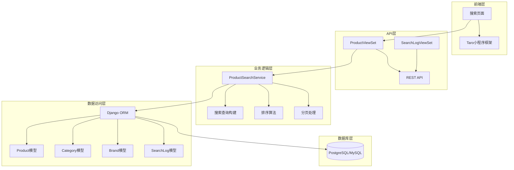
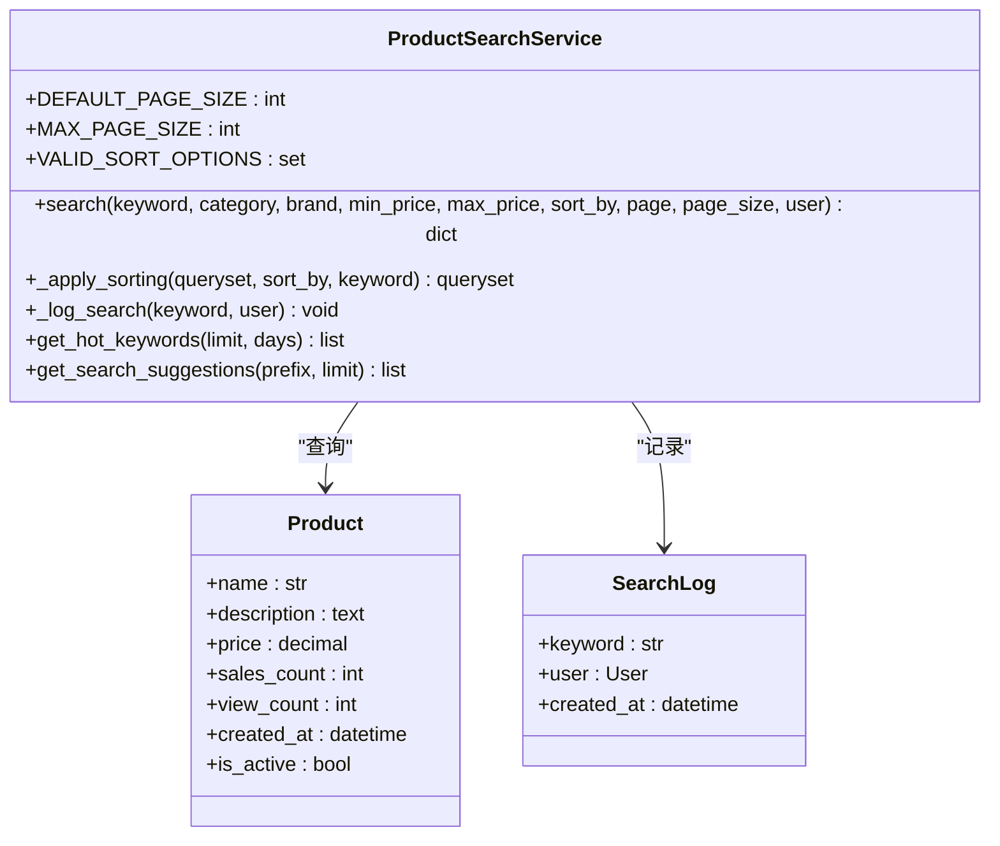
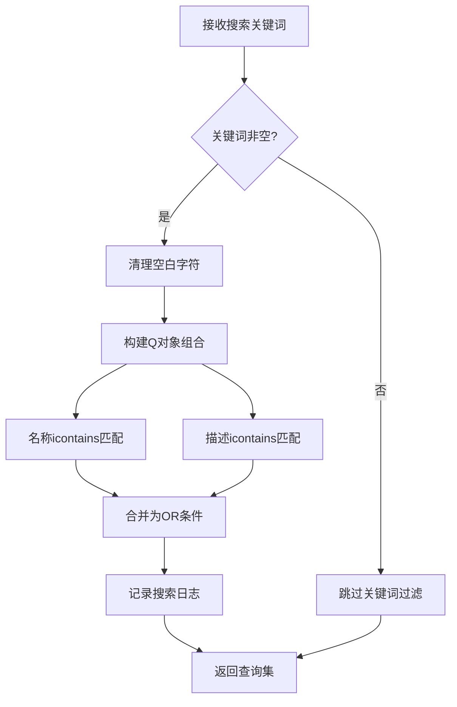
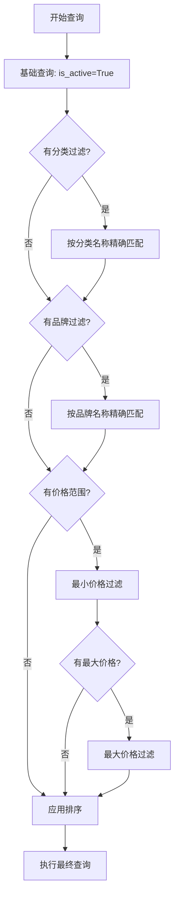
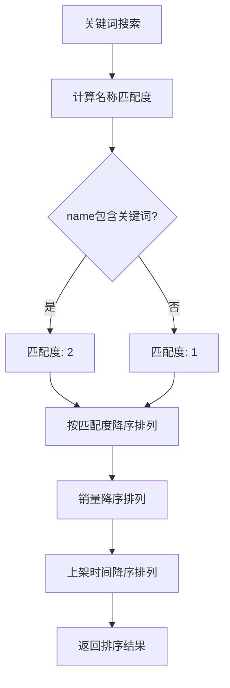
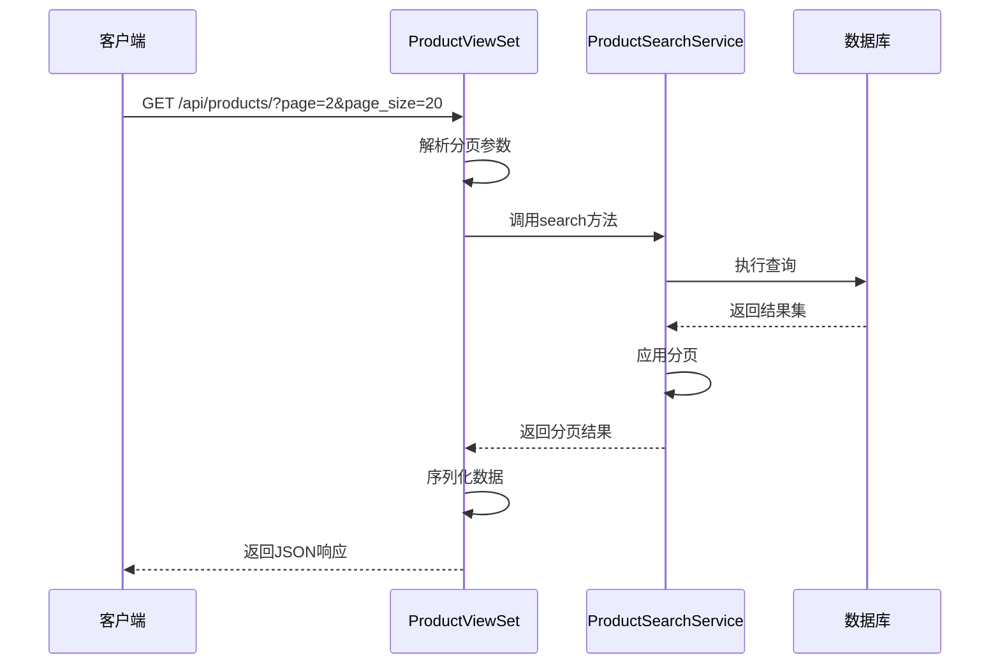
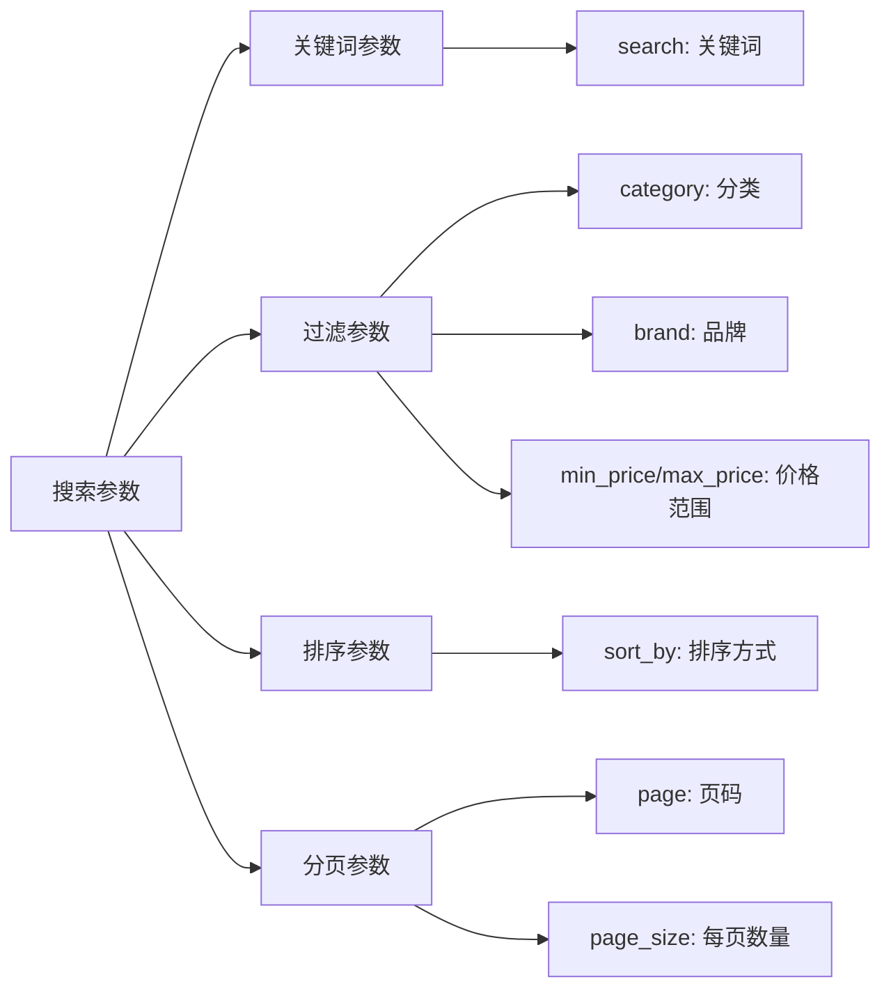
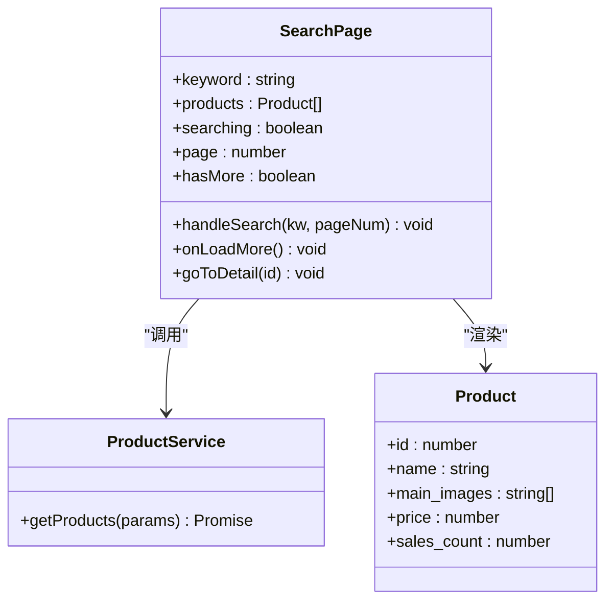
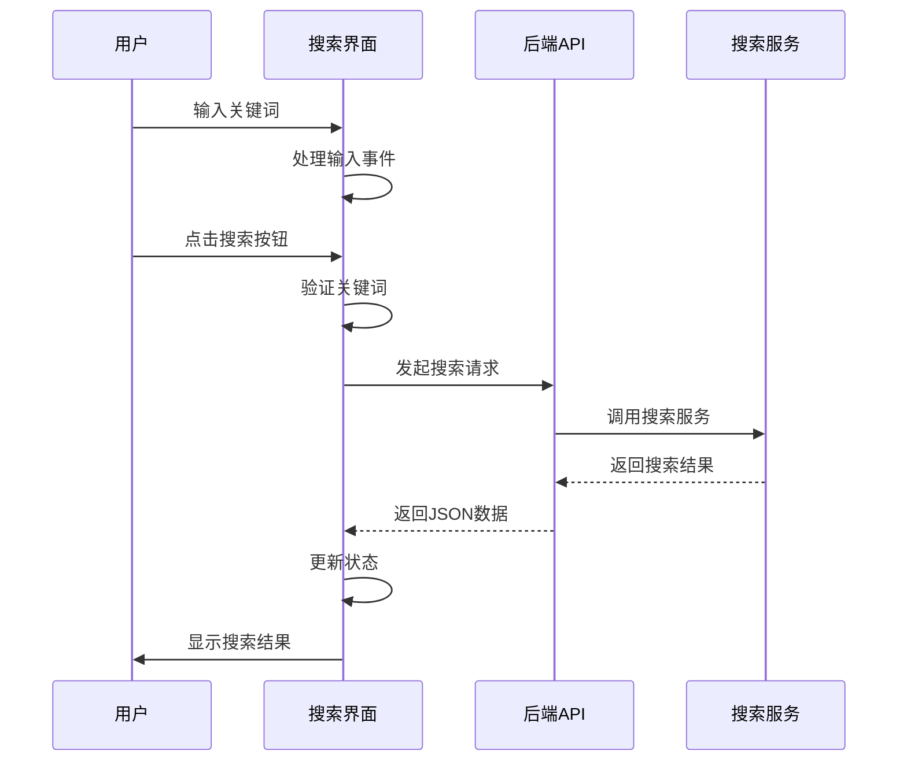

# 商品搜索功能深度解析

<cite>
**本文档引用的文件**
- [search.py](file://backend/catalog/search.py)
- [views.py](file://backend/catalog/views.py)
- [models.py](file://backend/catalog/models.py)
- [pagination.py](file://backend/common/pagination.py)
- [urls.py](file://backend/catalog/urls.py)
- [index.tsx](file://frontend/src/pages/search/index.tsx)
- [serializers.py](file://backend/catalog/serializers.py)
- [utils.py](file://backend/common/utils.py)
</cite>

## 目录
1. [概述](#概述)
2. [项目架构](#项目架构)
3. [核心组件分析](#核心组件分析)
4. [搜索查询构建](#搜索查询构建)
5. [排序算法实现](#排序算法实现)
6. [分页处理与性能优化](#分页处理与性能优化)
7. [API接口设计](#api接口设计)
8. [前端搜索界面](#前端搜索界面)
9. [性能优化建议](#性能优化建议)
10. [常见搜索场景示例](#常见搜索场景示例)
11. [总结](#总结)

## 概述

商品搜索功能是电商平台的核心组件之一，负责为用户提供高效、准确的商品检索服务。本文档深入分析了基于Django ORM的商品搜索系统实现，涵盖关键词匹配、分类过滤、价格区间筛选、多维度排序以及分页处理等核心功能。

该搜索系统采用模块化设计，主要包含以下特性：
- **多条件组合搜索**：支持关键词、分类、品牌、价格范围等多维度筛选
- **智能排序算法**：基于销量、价格、上架时间等多种指标的综合排序
- **高性能查询**：通过数据库索引和查询优化确保搜索响应速度
- **用户体验优化**：提供搜索建议、热门关键词等功能提升搜索体验

## 项目架构



**图表来源**
- [views.py](file://backend/catalog/views.py#L29-L51)
- [search.py](file://backend/catalog/search.py#L19-L44)
- [models.py](file://backend/catalog/models.py#L43-L113)

**章节来源**
- [views.py](file://backend/catalog/views.py#L1-L50)
- [search.py](file://backend/catalog/search.py#L1-L50)

## 核心组件分析

### ProductSearchService 类

`ProductSearchService` 是搜索功能的核心服务类，提供了完整的搜索能力。



**图表来源**
- [search.py](file://backend/catalog/search.py#L19-L287)
- [models.py](file://backend/catalog/models.py#L43-L261)

### 关键配置参数

系统定义了多个关键配置参数来控制搜索行为：

| 参数名称 | 默认值 | 最大值 | 说明 |
|---------|--------|--------|------|
| DEFAULT_PAGE_SIZE | 20 | - | 默认每页显示结果数 |
| MAX_PAGE_SIZE | 100 | - | 最大允许的分页大小 |
| VALID_SORT_OPTIONS | 6种选项 | - | 支持的排序方式集合 |

**章节来源**
- [search.py](file://backend/catalog/search.py#L30-L44)

## 搜索查询构建

### 关键词匹配机制

搜索系统支持在商品名称和描述字段进行模糊匹配：



**图表来源**
- [search.py](file://backend/catalog/search.py#L100-L109)

### 多条件过滤逻辑

系统支持多种过滤条件的组合：



**图表来源**
- [search.py](file://backend/catalog/search.py#L111-L133)

### 数据库索引优化

为了提升查询性能，系统在相关字段上建立了复合索引：

| 索引字段 | 类型 | 用途 |
|---------|------|------|
| `is_active, -sales_count` | 复合索引 | 销量排序优化 |
| `is_active, -view_count` | 复合索引 | 浏览量排序优化 |
| `category, is_active` | 复合索引 | 分类过滤优化 |
| `brand, is_active` | 复合索引 | 品牌过滤优化 |
| `-created_at` | 单字段索引 | 时间排序优化 |
| `product_code` | 单字段索引 | 海尔商品识别优化 |

**章节来源**
- [models.py](file://backend/catalog/models.py#L105-L113)

## 排序算法实现

### 排序策略矩阵

系统提供了六种不同的排序策略，每种都有特定的应用场景：

| 排序方式 | 主要依据 | 辅助依据 | 适用场景 |
|---------|----------|----------|----------|
| `relevance` | 关键词匹配度 | 销量、浏览量 | 关键词搜索结果 |
| `price_asc` | 价格升序 | - | 价格敏感用户 |
| `price_desc` | 价格降序 | - | 高端产品展示 |
| `sales` | 销量降序 | 上架时间 | 热销产品推荐 |
| `views` | 浏览量降序 | 上架时间 | 流行产品推荐 |
| `created` | 上架时间降序 | - | 新品展示 |

### 相关性排序算法

对于关键词搜索，系统实现了智能的相关性排序：



**图表来源**
- [search.py](file://backend/catalog/search.py#L189-L200)

**章节来源**
- [search.py](file://backend/catalog/search.py#L160-L202)

## 分页处理与性能优化

### 分页机制设计

系统采用标准的分页机制，提供丰富的分页元数据：



**图表来源**
- [views.py](file://backend/catalog/views.py#L83-L131)
- [search.py](file://backend/catalog/search.py#L137-L158)

### 性能优化措施

#### 1. 查询优化
- **选择性查询**：只查询必要的字段
- **预加载关联数据**：使用 `select_related` 减少数据库查询
- **批量查询**：避免 N+1 查询问题

#### 2. 缓存策略
- **搜索日志缓存**：热门关键词统计结果缓存
- **商品信息缓存**：频繁访问的商品数据缓存

#### 3. 数据库优化
- **索引优化**：为常用查询字段建立索引
- **查询计划优化**：定期分析查询执行计划
- **连接池管理**：合理配置数据库连接池

**章节来源**
- [views.py](file://backend/catalog/views.py#L52-L67)
- [pagination.py](file://backend/common/pagination.py#L8-L42)

## API接口设计

### 主要API端点

系统提供了多个专门的搜索相关API端点：

| 端点路径 | 方法 | 功能 | 参数 |
|---------|------|------|------|
| `/api/products/` | GET | 商品列表搜索 | search, category, brand, min_price, max_price, sort_by, page, page_size |
| `/api/products/search-suggestions/` | GET | 搜索建议 | prefix, limit |
| `/api/products/hot-keywords/` | GET | 热门关键词 | limit, days |
| `/api/search-logs/hot-keywords/` | GET | 搜索日志热门关键词 | limit, days |

### 请求参数规范

所有搜索相关的API都遵循统一的参数规范：



**图表来源**
- [views.py](file://backend/catalog/views.py#L38-L47)
- [views.py](file://backend/catalog/views.py#L133-L141)

### 响应格式标准化

所有搜索API都返回一致的响应格式：

```json
{
  "results": [...],           // 搜索结果列表
  "total": 100,              // 总记录数
  "page": 1,                 // 当前页码
  "total_pages": 5,          // 总页数
  "has_next": true,          // 是否有下一页
  "has_previous": false      // 是否有上一页
}
```

**章节来源**
- [views.py](file://backend/catalog/views.py#L123-L131)
- [urls.py](file://backend/catalog/urls.py#L1-L15)

## 前端搜索界面

### 搜索页面架构

前端搜索页面采用 React 组件模式，提供了完整的搜索体验：



**图表来源**
- [index.tsx](file://frontend/src/pages/search/index.tsx#L9-L114)

### 搜索交互流程



**图表来源**
- [index.tsx](file://frontend/src/pages/search/index.tsx#L25-L51)

**章节来源**
- [index.tsx](file://frontend/src/pages/search/index.tsx#L1-L114)

## 性能优化建议

### 数据库层面优化

1. **索引策略优化**
   - 为经常查询的字段建立单字段索引
   - 为复杂查询条件建立复合索引
   - 定期分析索引使用情况，移除冗余索引

2. **查询优化**
   - 使用 `select_related` 和 `prefetch_related` 减少查询次数
   - 避免在查询中使用复杂的函数表达式
   - 合理使用 `values()` 和 `values_list()` 减少内存占用

3. **缓存策略**
   - 对热门搜索结果进行缓存
   - 缓存搜索建议和热门关键词
   - 使用 Redis 等内存数据库提升缓存性能

### 应用层面优化

1. **异步处理**
   - 将搜索日志记录改为异步处理
   - 对于耗时的统计分析任务使用后台队列

2. **分页优化**
   - 实现懒加载机制减少初始加载时间
   - 提供预加载功能提升用户体验

3. **错误处理**
   - 实现优雅的错误恢复机制
   - 提供友好的错误提示信息

## 常见搜索场景示例

### 场景一：综合商品搜索

**需求描述**：用户希望搜索包含"冰箱"关键词的商品，并按销量排序。

**实现方案**：
```python
# 后端调用
search_result = ProductSearchService.search(
    keyword="冰箱",
    sort_by="sales",
    page=1,
    page_size=20
)
```

**前端实现**：
```typescript
// 前端调用
const products = await productService.getProducts({
    search: "冰箱",
    sort_by: "sales",
    page: 1,
    page_size: 20
});
```

### 场景二：价格区间筛选

**需求描述**：用户希望查找价格在1000-5000元之间的空调。

**实现方案**：
```python
# 后端调用
search_result = ProductSearchService.search(
    keyword="空调",
    min_price=1000,
    max_price=5000,
    sort_by="price_asc"
)
```

### 场景三：分类限定搜索

**需求描述**：用户希望查看某个品牌的全部商品。

**实现方案**：
```python
# 后端调用
search_result = ProductSearchService.search(
    brand="美的",
    sort_by="created"
)
```

### 场景四：搜索建议功能

**需求描述**：用户输入部分关键词时，提供智能搜索建议。

**实现方案**：
```python
# 获取搜索建议
suggestions = ProductSearchService.get_search_suggestions(
    prefix="空",
    limit=5
)
```

**章节来源**
- [search.py](file://backend/catalog/search.py#L248-L282)
- [views.py](file://backend/catalog/views.py#L141-L157)

## 总结

本文档全面分析了基于Django ORM的商品搜索功能实现，涵盖了从底层查询构建到前端交互的完整技术栈。该搜索系统具有以下特点：

### 核心优势

1. **功能完整性**：支持多维度搜索、智能排序、分页处理等完整功能
2. **性能优化**：通过索引优化、查询优化和缓存策略确保高性能
3. **用户体验**：提供搜索建议、热门关键词等增强功能
4. **扩展性强**：模块化设计便于功能扩展和维护

### 技术亮点

- **智能相关性排序**：基于关键词匹配度和业务指标的综合排序算法
- **灵活的过滤机制**：支持关键词、分类、品牌、价格范围等多种过滤条件
- **标准化的API设计**：统一的请求参数和响应格式，便于前后端协作
- **完善的错误处理**：健壮的异常处理机制确保系统稳定性

### 应用价值

该搜索系统为电商平台提供了强大的商品检索能力，能够满足用户多样化的搜索需求，同时保证了良好的性能表现和用户体验。通过合理的架构设计和技术选型，系统具备了良好的可维护性和扩展性，为业务发展提供了坚实的技术支撑。