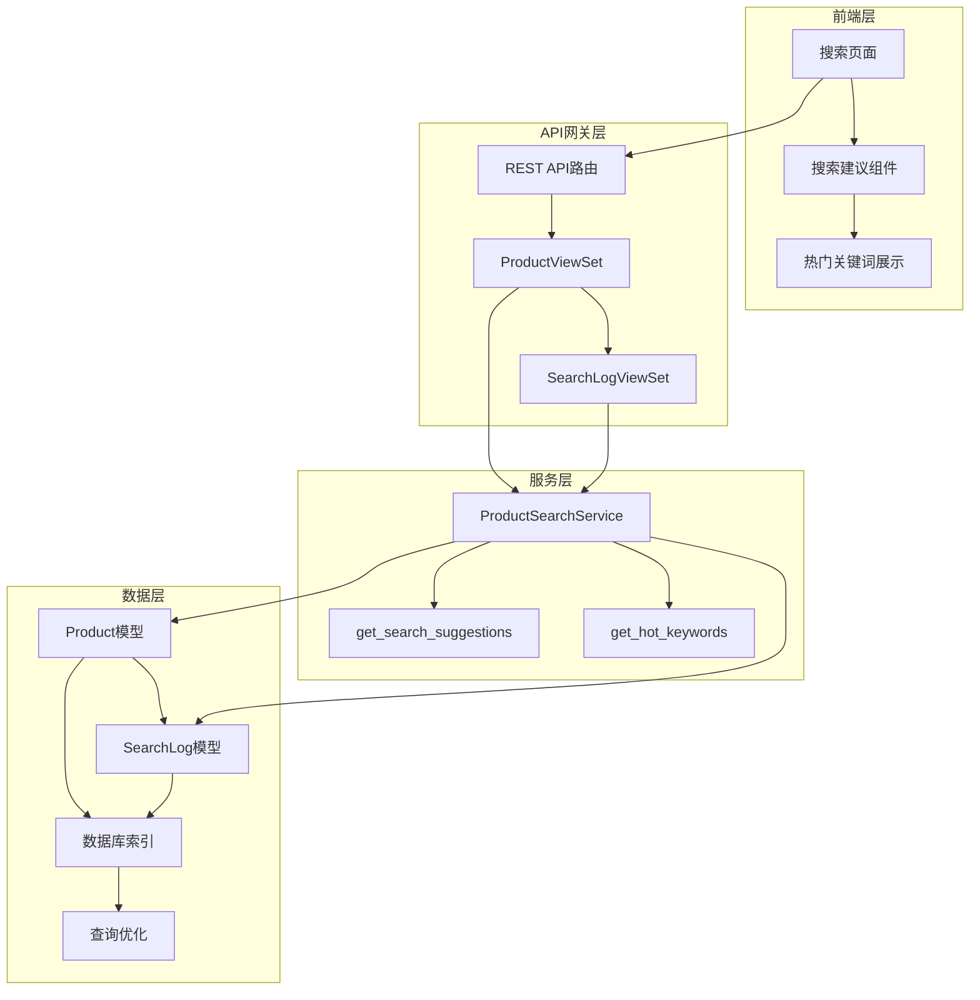
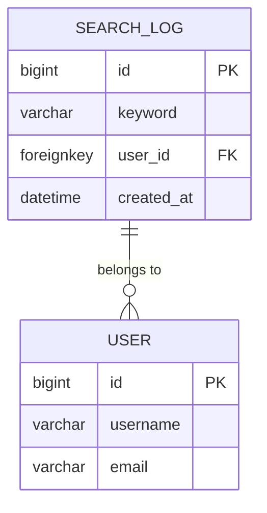
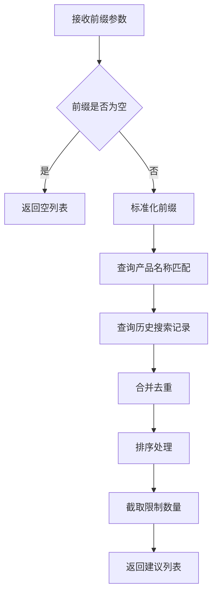
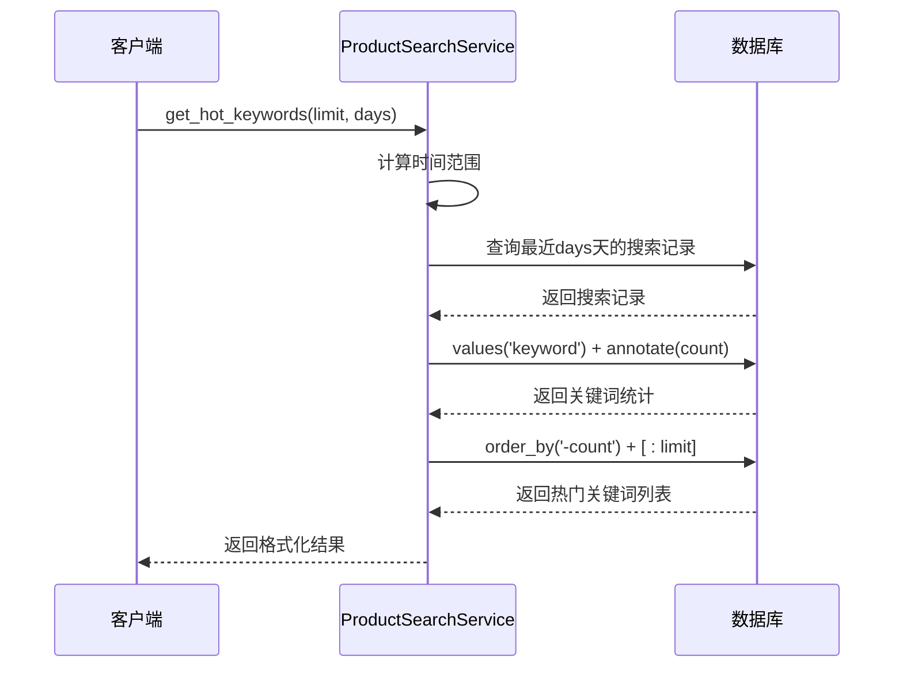

# 搜索建议与热门关键词功能深度解析

<cite>
**本文档引用的文件**
- [search.py](file://backend/catalog/search.py)
- [views.py](file://backend/catalog/views.py)
- [models.py](file://backend/catalog/models.py)
- [urls.py](file://backend/catalog/urls.py)
- [frontend.md](file://frontend.md)
- [index.tsx](file://frontend/src/pages/search/index.tsx)
- [product.ts](file://frontend/src/services/product.ts)
- [request.ts](file://frontend/src/utils/request.ts)
</cite>

## 目录
1. [功能概述](#功能概述)
2. [系统架构](#系统架构)
3. [核心组件分析](#核心组件分析)
4. [搜索建议功能](#搜索建议功能)
5. [热门关键词功能](#热门关键词功能)
6. [API端点详解](#api端点详解)
7. [前端集成实现](#前端集成实现)
8. [性能优化策略](#性能优化策略)
9. [使用示例](#使用示例)
10. [故障排除指南](#故障排除指南)

## 功能概述

搜索建议与热门关键词功能是电商平台的核心用户体验优化组件，旨在提升用户搜索效率和发现新商品的能力。该功能包含两个主要子功能：

### 搜索建议功能
- **前缀匹配**：基于用户输入的关键词前缀，提供智能搜索建议
- **双重数据源**：结合产品名称和历史搜索记录生成建议
- **去重排序**：智能合并和排序建议列表，确保最佳用户体验

### 热门关键词功能
- **统计分析**：基于最近时间段内的搜索行为统计热门关键词
- **时间范围配置**：支持灵活的时间窗口设置（默认7天）
- **实时更新**：反映最新的用户搜索趋势

## 系统架构



**架构图来源**
- [views.py](file://backend/catalog/views.py#L1-L15)
- [search.py](file://backend/catalog/search.py#L19-L287)

## 核心组件分析

### ProductSearchService类

`ProductSearchService`是搜索功能的核心服务类，提供了两个关键方法：

#### 主要特性
- **单一职责**：专注于搜索逻辑的实现
- **可复用性**：可在多个视图中调用
- **异常安全**：搜索日志记录的异常被静默处理

#### 方法概览
- `get_search_suggestions()`：生成搜索建议
- `get_hot_keywords()`：获取热门关键词
- `_log_search()`：记录搜索行为

**章节来源**
- [search.py](file://backend/catalog/search.py#L19-L287)

### 模型设计

#### SearchLog模型
负责记录用户的搜索行为，为热门关键词统计提供数据基础：



**实体关系图来源**
- [models.py](file://backend/catalog/models.py#L232-L261)

**章节来源**
- [models.py](file://backend/catalog/models.py#L232-L261)

## 搜索建议功能

### get_search_suggestions方法实现

该方法是搜索建议功能的核心实现，具有以下特点：

#### 算法流程



**流程图来源**
- [search.py](file://backend/catalog/search.py#L247-L283)

#### 关键实现细节

1. **前缀匹配策略**
   - 使用`name__istartswith`进行产品名称前缀匹配
   - 使用`keyword__istartswith`进行历史搜索记录匹配
   - 大小写不敏感匹配（`istartswith`）

2. **数据源整合**
   - **产品数据源**：直接从Product模型获取活跃产品的名称
   - **历史数据源**：从SearchLog模型获取用户搜索记录
   - **去重机制**：使用Python集合运算合并结果

3. **性能优化**
   - 使用`distinct()`避免重复结果
   - 使用`[:limit]`进行切片限制，减少内存占用
   - 使用`sorted()`进行稳定排序

**章节来源**
- [search.py](file://backend/catalog/search.py#L247-L283)

### 搜索日志记录机制

每次搜索都会自动记录到SearchLog表中，为后续的热门关键词统计提供数据支撑：

#### 记录时机
- 每次成功的搜索操作
- 即使搜索结果为空也会记录

#### 异常处理
- 记录过程中的异常被静默处理
- 不会影响主搜索流程的执行

**章节来源**
- [search.py](file://backend/catalog/search.py#L204-L221)

## 热门关键词功能

### get_hot_keywords方法实现

该方法通过聚合查询统计热门搜索关键词：

#### 查询逻辑



**序列图来源**
- [search.py](file://backend/catalog/search.py#L222-L246)

#### 关键技术点

1. **时间范围过滤**
   - 使用`timezone.now() - timedelta(days=days)`计算时间边界
   - 默认时间范围为7天

2. **聚合统计**
   - 使用`values('keyword')`按关键词分组
   - 使用`annotate(count=Count('id'))`统计每个关键词的出现次数

3. **排序策略**
   - 按搜索次数降序排列
   - 确保最热门的关键词排在前面

4. **结果格式**
   - 返回字典列表，包含`keyword`和`count`字段
   - 符合前端展示需求

**章节来源**
- [search.py](file://backend/catalog/search.py#L222-L246)

## API端点详解

### 搜索建议API

#### 端点信息
- **路径**：`/api/products/search-suggestions/`
- **方法**：`GET`
- **权限**：`AllowAny`（公开访问）

#### 查询参数

| 参数名 | 类型 | 必需 | 默认值 | 描述 |
|--------|------|------|--------|------|
| prefix | string | 是 | - | 关键词前缀 |
| limit | integer | 否 | 10 | 最大建议数量 |

#### 响应格式
```json
{
  "suggestions": [
    "冰箱",
    "空调",
    "洗衣机",
    "电视"
  ]
}
```

**章节来源**
- [views.py](file://backend/catalog/views.py#L141-L158)

### 热门关键词API

#### 端点信息
- **路径**：`/api/products/hot-keywords/`
- **方法**：`GET`
- **权限**：`AllowAny`（公开访问）

#### 查询参数

| 参数名 | 类型 | 必需 | 默认值 | 描述 |
|--------|------|------|--------|------|
| limit | integer | 否 | 10 | 最大关键词数量 |
| days | integer | 否 | 7 | 时间范围（天） |

#### 响应格式
```json
{
  "hot_keywords": [
    {
      "keyword": "冰箱",
      "count": 156
    },
    {
      "keyword": "空调",
      "count": 142
    }
  ]
}
```

**章节来源**
- [views.py](file://backend/catalog/views.py#L167-L187)

### SearchLogViewSet API

#### 热门关键词端点
- **路径**：`/api/search-logs/hot-keywords/`
- **方法**：`GET`
- **权限**：`AllowAny`

#### 查询参数
- `limit`：最大关键词数量（默认10）
- `days`：时间范围（默认7天）

**章节来源**
- [views.py](file://backend/catalog/views.py#L726-L746)

## 前端集成实现

### 搜索页面集成

前端搜索页面通过API调用实现搜索建议和热门关键词功能：

#### 关键实现要点

1. **API调用封装**
   - 在`productService`中封装搜索相关API
   - 提供统一的错误处理机制

2. **状态管理**
   - 使用React Hook管理搜索状态
   - 实现防抖机制避免频繁请求

3. **用户体验优化**
   - 实时显示搜索建议
   - 热门关键词展示
   - 加载状态指示

**章节来源**
- [index.tsx](file://frontend/src/pages/search/index.tsx#L1-L114)
- [product.ts](file://frontend/src/services/product.ts#L1-L64)

### 请求拦截器

前端实现了统一的请求拦截器，处理认证和错误：

#### Token管理
- 自动添加`Authorization`头
- 支持Token自动刷新
- 处理401未授权错误

#### 错误处理
- 统一的错误提示机制
- 特殊错误码处理（如429限流）
- 网络错误重试机制

**章节来源**
- [request.ts](file://frontend/src/utils/request.ts#L1-L162)

## 性能优化策略

### 后端优化

#### 数据库层面
1. **索引优化**
   - SearchLog模型的关键字段建立复合索引
   - 支持高效的前缀匹配查询

2. **查询优化**
   - 使用`values()`减少ORM对象创建开销
   - 使用`annotate()`进行服务器端聚合
   - 限制返回结果数量避免内存溢出

3. **缓存策略**
   - 热门关键词结果可考虑缓存
   - 缓存时间可根据业务需求调整

#### 代码层面
1. **异常安全**
   - 搜索日志记录的异常被静默处理
   - 不影响主业务流程

2. **资源控制**
   - 限制最大返回结果数量
   - 使用切片操作控制内存使用

### 前端优化

1. **防抖机制**
   - 输入防抖避免频繁API调用
   - 合理设置防抖时间间隔

2. **状态管理**
   - 使用React Hook优化组件更新
   - 避免不必要的重新渲染

3. **缓存策略**
   - 本地缓存热门关键词
   - 减少重复的API请求

## 使用示例

### 基础使用场景

#### 搜索建议示例
```javascript
// 获取搜索建议
const suggestions = await productService.getSearchSuggestions({
  prefix: '冰',
  limit: 5
});
// 返回: ['冰箱', '冰柜', '冰吧']
```

#### 热门关键词示例
```javascript
// 获取热门关键词
const hotKeywords = await productService.getHotKeywords({
  limit: 10,
  days: 7
});
// 返回: [{keyword: '冰箱', count: 156}, ...]
```

### 高级使用场景

#### 自动补全功能
```typescript
// 实现输入框自动补全
const handleInputChange = debounce(async (value) => {
  if (value.length >= 2) {
    const suggestions = await productService.getSearchSuggestions({
      prefix: value,
      limit: 8
    });
    setSuggestions(suggestions);
  }
}, 300);
```

#### 热门搜索展示
```typescript
// 在首页展示热门关键词
const [hotKeywords, setHotKeywords] = useState([]);

useEffect(() => {
  productService.getHotKeywords({ limit: 5 }).then(setHotKeywords);
}, []);
```

## 故障排除指南

### 常见问题及解决方案

#### 后端问题

1. **搜索建议无结果**
   - 检查产品数据是否正确导入
   - 验证SearchLog表是否有搜索记录
   - 确认数据库索引是否正常

2. **热门关键词统计异常**
   - 检查时间范围参数是否合理
   - 验证SearchLog表数据完整性
   - 确认聚合查询语法正确性

3. **性能问题**
   - 监控数据库查询执行时间
   - 检查索引使用情况
   - 考虑添加查询缓存

#### 前端问题

1. **API调用失败**
   - 检查网络连接状态
   - 验证API端点URL配置
   - 查看浏览器开发者工具中的错误信息

2. **搜索建议延迟**
   - 实现本地缓存机制
   - 优化防抖时间设置
   - 考虑使用Web Worker处理复杂计算

3. **用户体验问题**
   - 优化加载状态提示
   - 改善错误提示信息
   - 增强输入框交互反馈

### 调试技巧

1. **后端调试**
   - 使用Django Debug Toolbar监控查询
   - 启用SQL日志查看实际执行的查询语句
   - 使用性能分析工具定位瓶颈

2. **前端调试**
   - 使用浏览器开发者工具监控网络请求
   - 检查API响应数据结构
   - 使用React DevTools调试组件状态

3. **系统监控**
   - 监控API响应时间和成功率
   - 跟踪数据库查询性能指标
   - 监控前端JavaScript错误

通过以上全面的分析和实现指导，开发者可以深入理解并有效利用搜索建议与热门关键词功能，为用户提供更优质的搜索体验。