# 搜索查询构建

<cite>
**本文档引用的文件**
- [search.py](file://backend/catalog/search.py)
- [views.py](file://backend/catalog/views.py)
- [models.py](file://backend/catalog/models.py)
- [utils.py](file://backend/common/utils.py)
- [product.ts](file://frontend/src/services/product.ts)
</cite>

## 目录
1. [简介](#简介)
2. [系统架构概览](#系统架构概览)
3. [核心组件分析](#核心组件分析)
4. [查询构建机制详解](#查询构建机制详解)
5. [查询参数解析与传递](#查询参数解析与传递)
6. [查询优化策略](#查询优化策略)
7. [常见查询场景](#常见查询场景)
8. [性能优化建议](#性能优化建议)
9. [总结](#总结)

## 简介

本文档深入解析了电商系统中商品搜索查询的构建机制，重点分析了`ProductSearchService.search`方法如何基于Django ORM构建多条件组合查询。系统采用分层架构设计，通过专门的搜索服务类处理复杂的查询逻辑，同时在视图层提供RESTful API接口，确保查询功能的高效性和可扩展性。

## 系统架构概览

系统采用典型的三层架构模式，包含前端服务、后端API服务和数据库层：

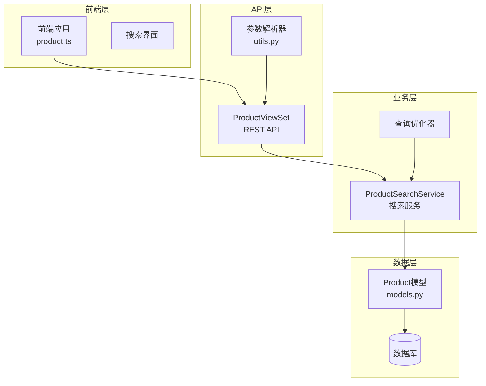

**图表来源**
- [views.py](file://backend/catalog/views.py#L29-L131)
- [search.py](file://backend/catalog/search.py#L19-L287)
- [models.py](file://backend/catalog/models.py#L43-L117)

## 核心组件分析

### ProductSearchService 类结构

`ProductSearchService`是搜索功能的核心服务类，提供了完整的搜索能力：

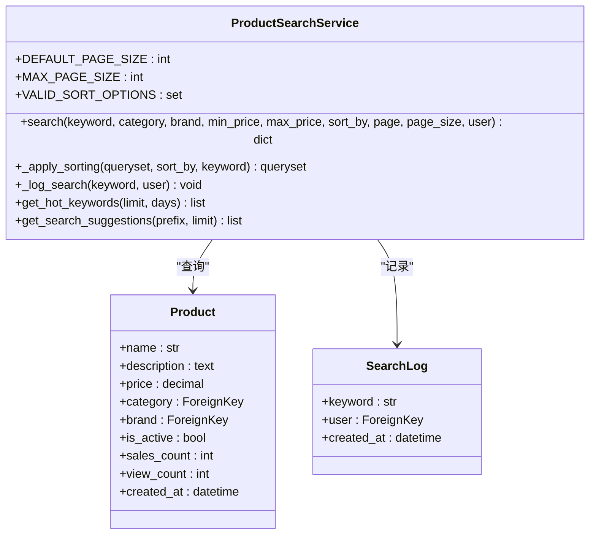

**图表来源**
- [search.py](file://backend/catalog/search.py#L19-L287)
- [models.py](file://backend/catalog/models.py#L43-L117)

**章节来源**
- [search.py](file://backend/catalog/search.py#L19-L287)

### ProductViewSet 视图结构

视图层负责接收HTTP请求并调用搜索服务：

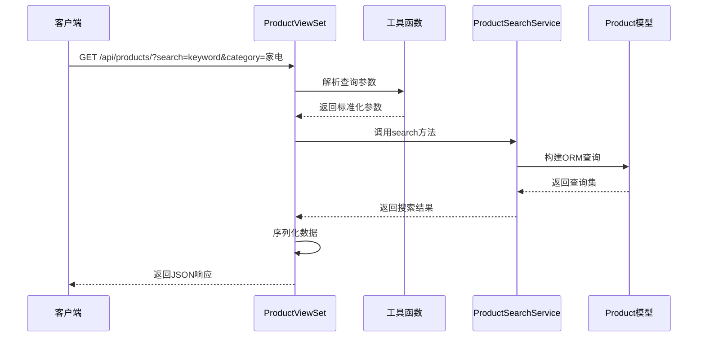

**图表来源**
- [views.py](file://backend/catalog/views.py#L83-L131)
- [utils.py](file://backend/common/utils.py#L15-L26)

**章节来源**
- [views.py](file://backend/catalog/views.py#L29-L131)

## 查询构建机制详解

### 多条件组合查询实现

`ProductSearchService.search`方法实现了复杂的多条件组合查询，支持关键词匹配、分类过滤、品牌筛选和价格区间查询：

#### 关键词匹配查询

关键词搜索采用模糊匹配策略，同时在产品名称和描述字段进行搜索：

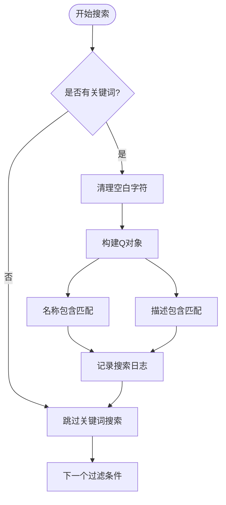

**图表来源**
- [search.py](file://backend/catalog/search.py#L100-L109)

#### 分类过滤查询

分类过滤使用精确匹配方式，确保只返回特定分类下的商品：

**图表来源**
- [search.py](file://backend/catalog/search.py#L111-L114)

#### 品牌筛选查询

品牌筛选同样采用精确匹配，支持按品牌名称过滤商品：

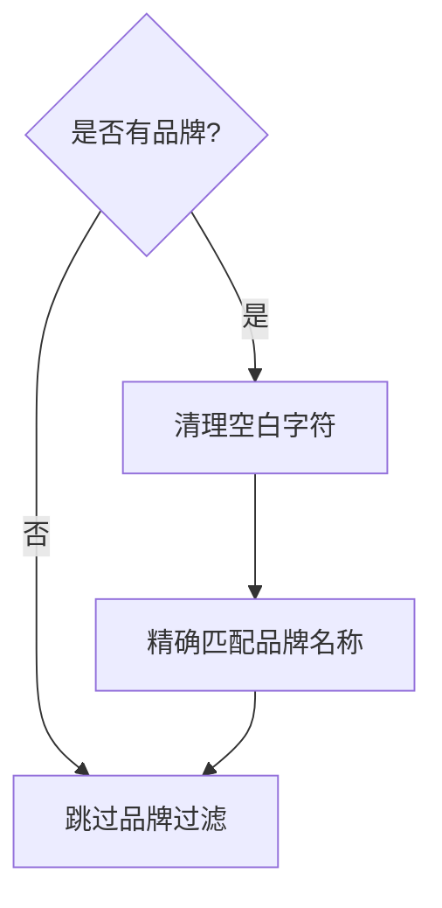

**图表来源**
- [search.py](file://backend/catalog/search.py#L115-L118)

#### 价格区间查询

价格区间查询支持最小值和最大值的双重限制：

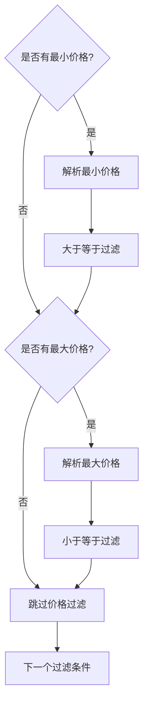

**图表来源**
- [search.py](file://backend/catalog/search.py#L119-L132)

**章节来源**
- [search.py](file://backend/catalog/search.py#L47-L158)

### 排序策略实现

系统提供了多种排序策略，每种策略都有特定的应用场景：

| 排序选项 | 描述 | 排序字段 | 使用场景 |
|---------|------|----------|----------|
| relevance | 相关性排序 | name_match, sales_count, created_at | 关键词搜索时优先匹配名称 |
| price_asc | 价格升序 | price | 价格敏感型用户 |
| price_desc | 价格降序 | price | 高端产品展示 |
| sales | 销量排序 | sales_count, created_at | 热销产品推荐 |
| views | 浏览量排序 | view_count, created_at | 流行产品展示 |
| created | 创建时间 | created_at | 新品展示 |

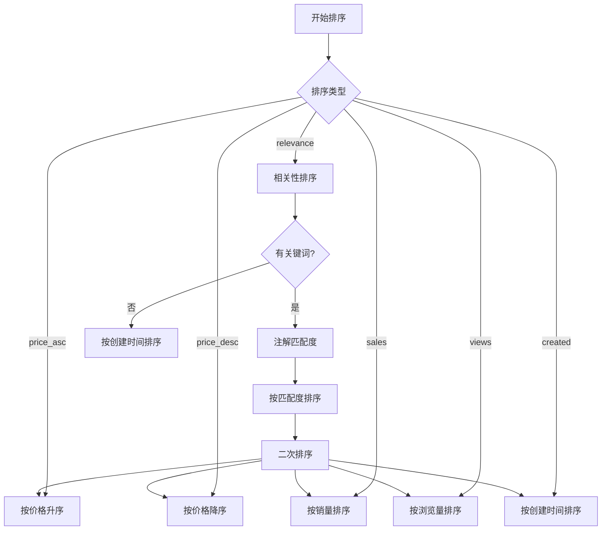

**图表来源**
- [search.py](file://backend/catalog/search.py#L160-L201)

**章节来源**
- [search.py](file://backend/catalog/search.py#L160-L201)

## 查询参数解析与传递

### 前端参数传递机制

前端通过REST API向后端传递查询参数，支持多种查询条件：

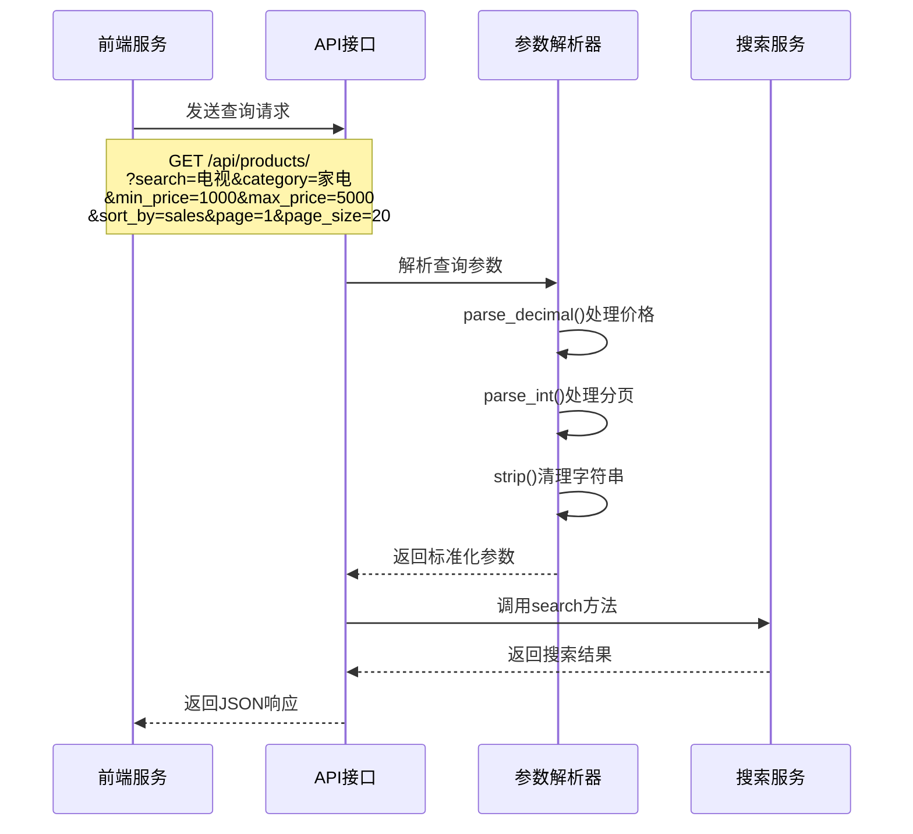

**图表来源**
- [views.py](file://backend/catalog/views.py#L90-L118)
- [utils.py](file://backend/common/utils.py#L15-L26)

### 参数验证与转换

系统提供了完善的参数验证和类型转换机制：

| 参数类型 | 验证函数 | 转换规则 | 异常处理 |
|---------|----------|----------|----------|
| keyword | strip() | 清理空白字符 | 自动过滤空值 |
| category | strip() | 清理空白字符 | 自动过滤空值 |
| brand | strip() | 清理空白字符 | 自动过滤空值 |
| min_price | parse_decimal() | 字符串转Decimal | 转换失败返回None |
| max_price | parse_decimal() | 字符串转Decimal | 转换失败返回None |
| page | parse_int() | 字符串转整数 | 转换失败返回默认值 |
| page_size | parse_int() | 字符串转整数 | 转换失败返回默认值 |

**章节来源**
- [views.py](file://backend/catalog/views.py#L90-L118)
- [utils.py](file://backend/common/utils.py#L15-L26)

## 查询优化策略

### 预加载策略

系统采用了多种查询优化策略来提升性能：

#### select_related 预加载

在视图层使用`select_related`预加载关联对象，避免N+1查询问题：

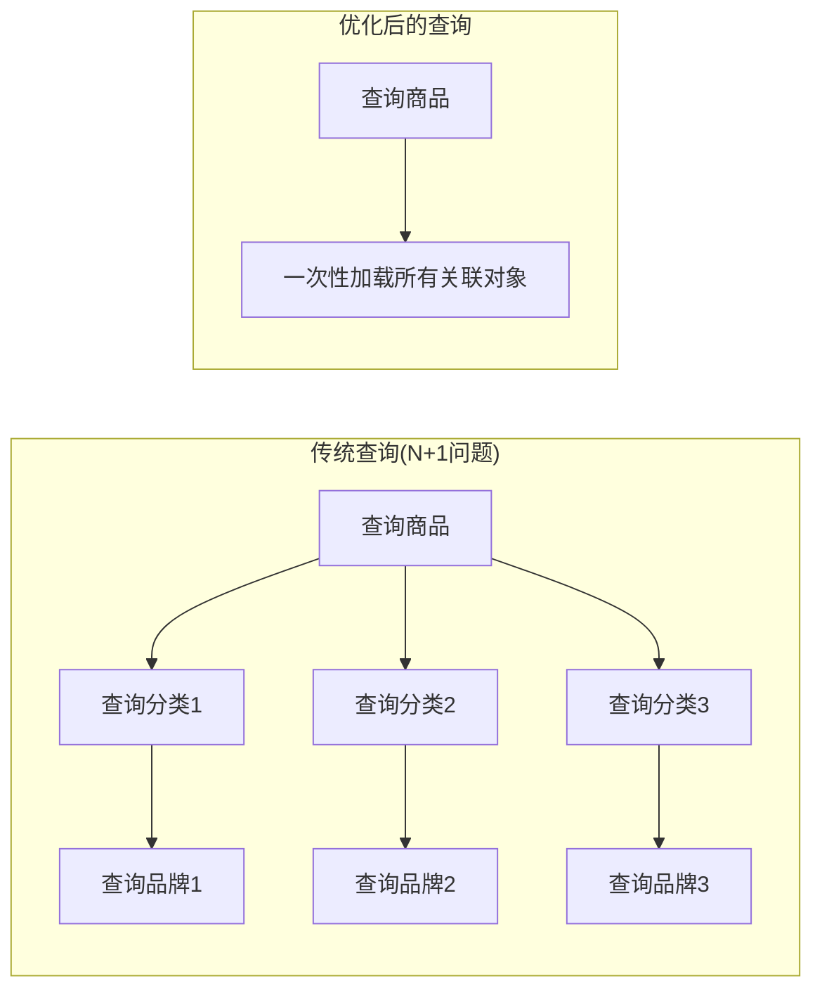

**图表来源**
- [views.py](file://backend/catalog/views.py#L56-L57)

#### 索引优化

数据库表设计中包含了多个复合索引，支持高效的查询：

| 索引字段 | 类型 | 用途 |
|---------|------|------|
| is_active, -sales_count | 复合索引 | 按状态和销量查询 |
| is_active, -view_count | 复合索引 | 按状态和浏览量查询 |
| category, is_active | 复合索引 | 按分类和状态查询 |
| brand, is_active | 复合索引 | 按品牌和状态查询 |
| -created_at | 单字段索引 | 按创建时间查询 |
| product_code | 单字段索引 | 按产品编码查询 |
| is_sales | 单字段索引 | 按销售状态查询 |

**章节来源**
- [views.py](file://backend/catalog/views.py#L56-L57)
- [models.py](file://backend/catalog/models.py#L105-L113)

### 查询缓存策略

系统实现了多层次的缓存策略：

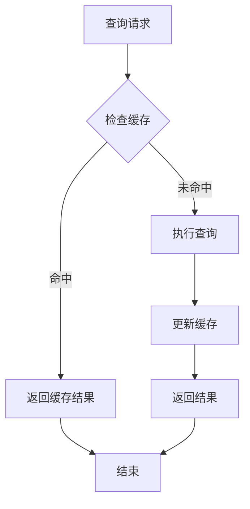

**章节来源**
- [search.py](file://backend/catalog/search.py#L223-L245)

## 常见查询场景

### 场景一：关键词搜索

用户输入关键词进行商品搜索：

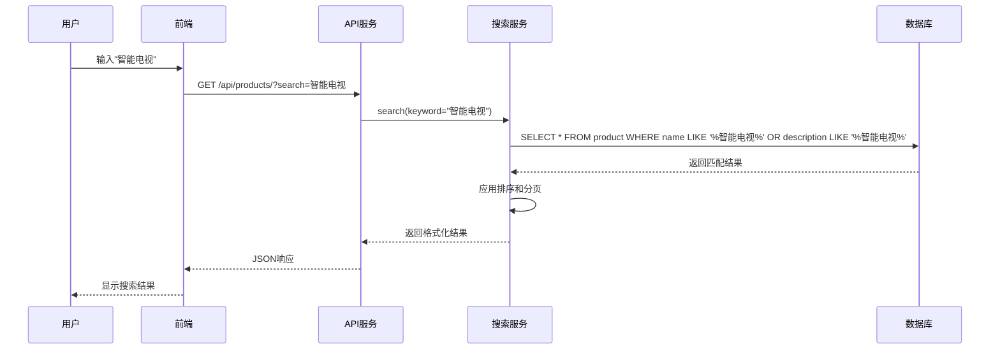

**图表来源**
- [views.py](file://backend/catalog/views.py#L90-L118)
- [search.py](file://backend/catalog/search.py#L100-L109)

### 场景二：综合筛选查询

用户进行多条件筛选：

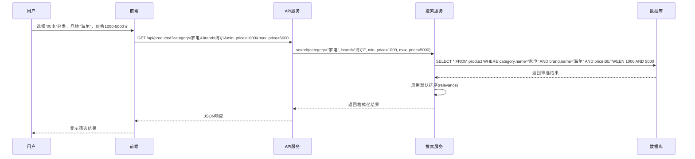

**图表来源**
- [views.py](file://backend/catalog/views.py#L90-L118)
- [search.py](file://backend/catalog/search.py#L111-L132)

### 场景三：热门搜索词分析

系统自动分析热门搜索词：

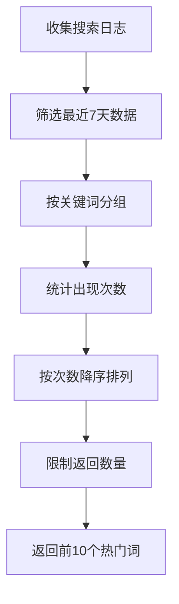

**图表来源**
- [search.py](file://backend/catalog/search.py#L223-L245)

**章节来源**
- [views.py](file://backend/catalog/views.py#L90-L118)
- [search.py](file://backend/catalog/search.py#L223-L283)

## 性能优化建议

### 查询性能优化

1. **合理使用索引**
   - 在经常查询的字段上建立索引
   - 使用复合索引优化多条件查询
   - 避免在小表上建立过多索引

2. **查询优化策略**
   - 优先使用精确匹配而非模糊查询
   - 合理设置分页大小，避免大数据量查询
   - 使用查询集切片减少内存占用

3. **缓存策略**
   - 缓存热门搜索词和推荐结果
   - 实现查询结果缓存机制
   - 使用Redis等外部缓存系统

### 前端优化建议

1. **请求优化**
   - 实现防抖机制避免频繁请求
   - 使用本地存储缓存搜索历史
   - 批量处理相似查询请求

2. **用户体验优化**
   - 提供搜索建议功能
   - 实现智能纠错和拼写修正
   - 支持搜索历史记录

### 监控和分析

1. **性能监控**
   - 监控查询执行时间
   - 分析慢查询日志
   - 设置查询超时阈值

2. **用户行为分析**
   - 跟踪搜索转化率
   - 分析热门搜索词
   - 优化搜索算法

## 总结

本文档详细分析了电商系统中商品搜索查询的构建机制，展示了如何通过分层架构设计实现高效、灵活的搜索功能。系统采用了多种优化策略，包括预加载、索引优化、缓存机制等，确保了查询性能的最优化。

关键特性包括：
- **多条件组合查询**：支持关键词、分类、品牌、价格等多维度筛选
- **智能排序策略**：根据搜索意图提供相关性排序
- **查询优化**：通过预加载和索引优化避免N+1问题
- **参数验证**：完善的参数解析和类型转换机制
- **性能监控**：实时跟踪查询性能和用户行为

这套搜索查询构建机制为电商平台提供了强大的商品发现能力，能够满足用户多样化的搜索需求，同时保证了系统的高性能和可扩展性。