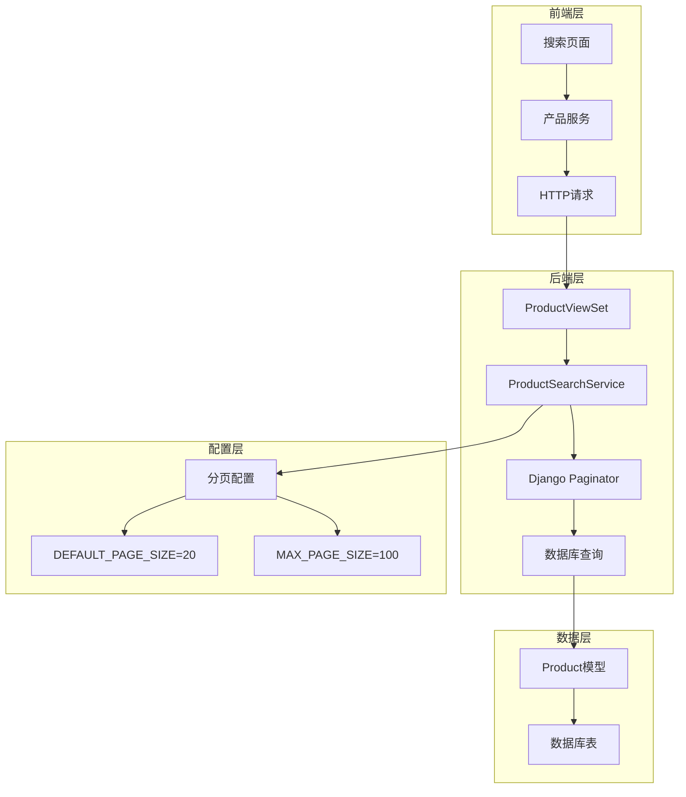
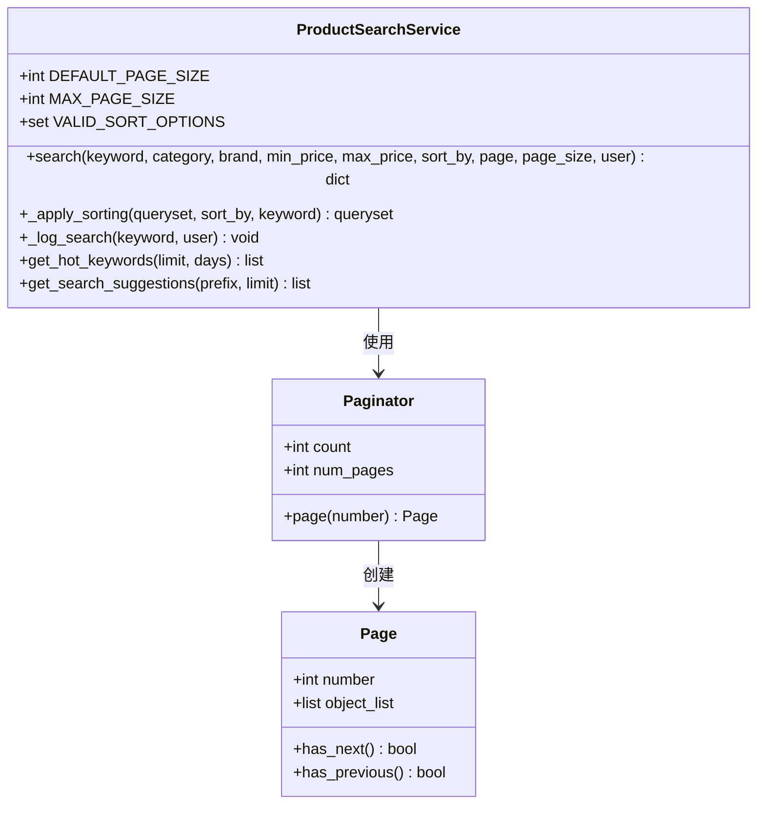
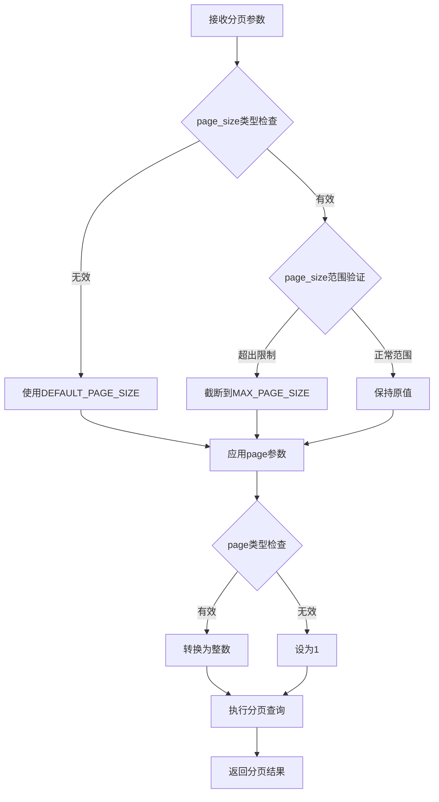
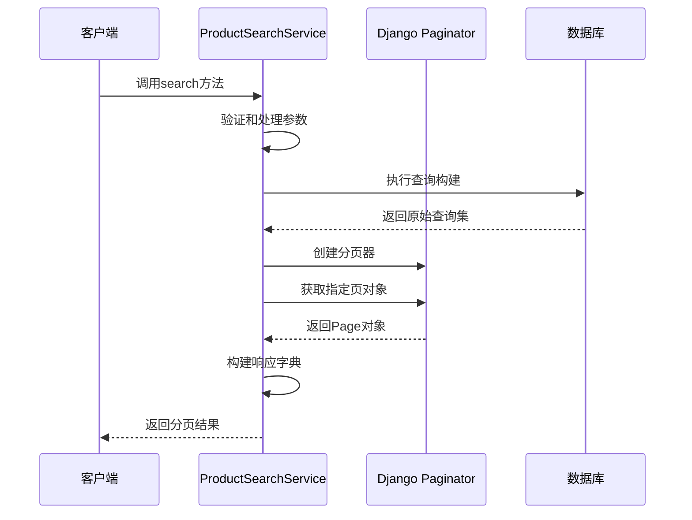
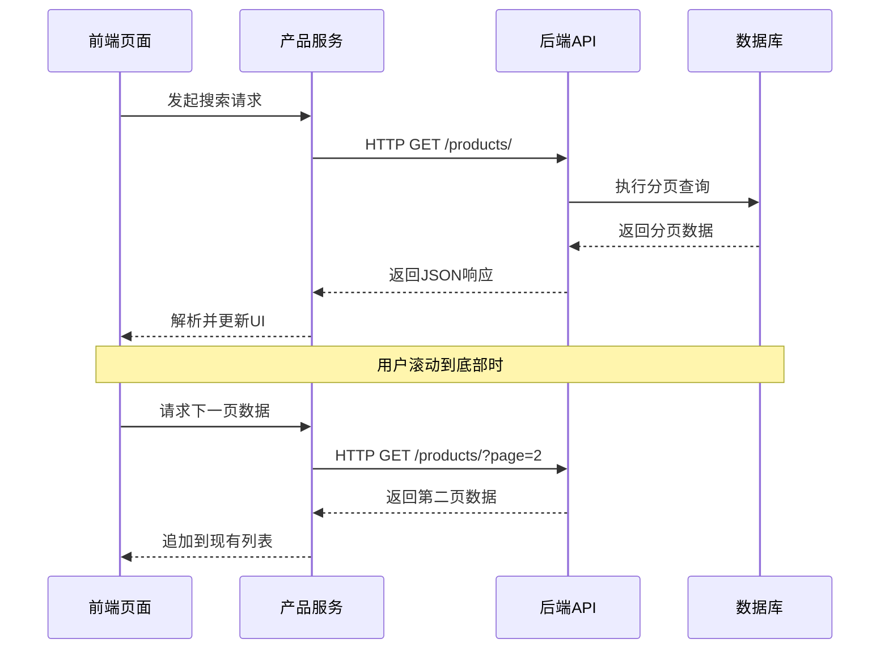

# 搜索结果分页处理机制全面解析

<cite>
**本文档引用的文件**
- [backend/catalog/search.py](file://backend/catalog/search.py)
- [backend/catalog/views.py](file://backend/catalog/views.py)
- [backend/common/pagination.py](file://backend/common/pagination.py)
- [backend/catalog/models.py](file://backend/catalog/models.py)
- [frontend/src/services/product.ts](file://frontend/src/services/product.ts)
- [frontend/src/pages/search/index.tsx](file://frontend/src/pages/search/index.tsx)
</cite>

## 目录
1. [概述](#概述)
2. [系统架构](#系统架构)
3. [核心组件分析](#核心组件分析)
4. [分页参数验证与处理](#分页参数验证与处理)
5. [分页元数据生成逻辑](#分页元数据生成逻辑)
6. [前后端分页数据交互](#前后端分页数据交互)
7. [性能优化策略](#性能优化策略)
8. [最佳实践与使用示例](#最佳实践与使用示例)
9. [故障排除指南](#故障排除指南)
10. [总结](#总结)

## 概述

本文档深入解析了电商小程序项目中商品搜索结果的分页处理机制。该系统采用Django的Paginator类实现分页功能，提供了灵活的参数验证、默认值设置和性能优化策略。整个分页系统包含后端服务层、视图层和前端交互层，形成了完整的分页解决方案。

## 系统架构



**图表来源**
- [backend/catalog/views.py](file://backend/catalog/views.py#L83-L131)
- [backend/catalog/search.py](file://backend/catalog/search.py#L46-L158)

## 核心组件分析

### ProductSearchService.search 方法

`ProductSearchService.search` 方法是整个分页系统的核心，负责执行商品搜索并返回分页结果。



**图表来源**
- [backend/catalog/search.py](file://backend/catalog/search.py#L19-L287)

### 分页常量配置

系统定义了两个关键的分页常量：

| 常量名 | 默认值 | 用途 | 限制 |
|--------|--------|------|------|
| DEFAULT_PAGE_SIZE | 20 | 默认每页显示的商品数量 | 无 |
| MAX_PAGE_SIZE | 100 | 单次请求的最大商品数量 | 防止资源滥用 |

**章节来源**
- [backend/catalog/search.py](file://backend/catalog/search.py#L30-L34)

## 分页参数验证与处理

### 参数验证流程



**图表来源**
- [backend/catalog/search.py](file://backend/catalog/search.py#L90-L148)

### 默认值设置逻辑

系统实现了智能的默认值设置机制：

1. **page_size参数处理**：
   - 尝试将输入转换为整数
   - 确保最小值为1，最大值不超过MAX_PAGE_SIZE
   - 处理异常情况时自动回退到DEFAULT_PAGE_SIZE

2. **page参数处理**：
   - 自动转换为整数类型
   - 异常情况下默认为第1页
   - 提供错误恢复机制

**章节来源**
- [backend/catalog/search.py](file://backend/catalog/search.py#L90-L148)

## 分页元数据生成逻辑

### 元数据结构设计

分页结果包含以下核心元数据：

| 字段名 | 类型 | 描述 | 来源 |
|--------|------|------|------|
| results | List | 当前页的商品数据 | Page.object_list |
| total | int | 总商品数量 | Paginator.count |
| page | int | 当前页码 | Page.number |
| page_size | int | 每页商品数量 | 输入参数 |
| total_pages | int | 总页数 | Paginator.num_pages |
| has_next | bool | 是否有下一页 | Page.has_next() |
| has_previous | bool | 是否有上一页 | Page.has_previous() |

### 元数据生成流程



**图表来源**
- [backend/catalog/search.py](file://backend/catalog/search.py#L137-L158)

**章节来源**
- [backend/catalog/search.py](file://backend/catalog/search.py#L150-L158)

## 前后端分页数据交互

### API响应格式

后端API返回的标准分页响应格式：

```typescript
interface ProductListResponse {
  results: Product[];
  total: number;
  page: number;
  total_pages: number;
  has_next: boolean;
  has_previous: boolean;
}
```

### 前端交互模式

前端通过以下方式与分页系统交互：

1. **初始加载**：发送基础搜索请求
2. **滚动加载**：检测到底部时自动加载下一页
3. **状态管理**：维护当前页码和加载状态



**图表来源**
- [frontend/src/pages/search/index.tsx](file://frontend/src/pages/search/index.tsx#L25-L56)
- [frontend/src/services/product.ts](file://frontend/src/services/product.ts#L6-L13)

**章节来源**
- [frontend/src/pages/search/index.tsx](file://frontend/src/pages/search/index.tsx#L34-L56)
- [backend/catalog/views.py](file://backend/catalog/views.py#L124-L131)

## 性能优化策略

### 数据库索引优化

系统在Product模型中实现了多个关键索引：

| 索引字段 | 类型 | 用途 | 性能影响 |
|----------|------|------|----------|
| is_active, -sales_count | 复合索引 | 快速筛选活跃商品和按销量排序 | 显著提升查询速度 |
| is_active, -view_count | 复合索引 | 按浏览量排序的快速检索 | 减少全表扫描 |
| category, is_active | 复合索引 | 按分类筛选的高效查询 | 优化分类搜索 |
| brand, is_active | 复合索引 | 按品牌筛选的快速匹配 | 提升品牌搜索效率 |
| -created_at | 单字段索引 | 按创建时间排序 | 支持最新商品排序 |

### 分页查询优化

1. **延迟加载**：只加载当前页的数据
2. **预取关联对象**：使用select_related减少数据库查询
3. **查询集缓存**：避免重复计算总数

### 内存使用优化

- **流式处理**：避免一次性加载大量数据到内存
- **合理分页大小**：平衡用户体验和服务器负载
- **连接池管理**：优化数据库连接使用

**章节来源**
- [backend/catalog/models.py](file://backend/catalog/models.py#L105-L113)

## 最佳实践与使用示例

### 正确的分页参数使用

#### 基础搜索分页
```bash
GET /api/products/?search=laptop&page=2&page_size=20
```

#### 高级过滤分页
```bash
GET /api/products/?category=electronics&min_price=1000&max_price=5000&page=1&page_size=50
```

#### 排序分页
```bash
GET /api/products/?sort_by=price_desc&page=1&page_size=20
```

### 错误处理示例

系统提供了完善的错误处理机制：

1. **无效页码处理**：自动重定向到第1页
2. **超大页码处理**：返回最后一页内容
3. **参数类型错误**：使用默认值而非中断请求

### 性能监控建议

1. **监控分页查询时间**：确保响应时间在合理范围内
2. **观察数据库负载**：防止过度查询导致性能问题
3. **跟踪用户行为**：分析分页使用模式

## 故障排除指南

### 常见问题及解决方案

#### 1. 分页结果不准确
**症状**：总数量与实际不符
**原因**：并发修改导致数据变化
**解决方案**：使用事务或乐观锁机制

#### 2. 性能下降
**症状**：分页查询响应缓慢
**原因**：缺少适当索引或查询复杂度高
**解决方案**：添加必要的数据库索引，优化查询条件

#### 3. 内存溢出
**症状**：处理大数据集时内存不足
**原因**：单次请求数据量过大
**解决方案**：调整MAX_PAGE_SIZE限制，实施更严格的分页策略

### 调试技巧

1. **启用查询日志**：监控SQL查询执行情况
2. **性能分析**：使用Django Debug Toolbar
3. **压力测试**：模拟高并发场景下的表现

## 总结

该电商小程序的搜索结果分页处理机制展现了现代Web应用的最佳实践：

1. **安全性**：通过参数验证和限制防止资源滥用
2. **性能**：合理的索引设计和查询优化确保良好性能
3. **用户体验**：流畅的分页交互和智能的加载策略
4. **可维护性**：清晰的代码结构和完善的错误处理

整个系统采用了标准化的分页模式，既满足了业务需求，又保证了系统的稳定性和可扩展性。通过前后端的紧密配合，为用户提供了优秀的搜索体验。