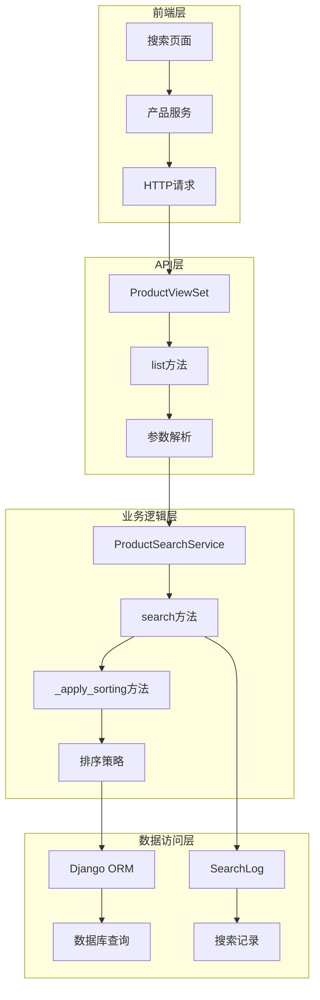
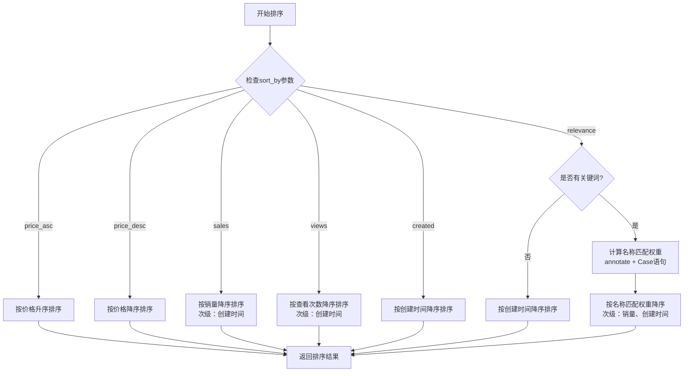
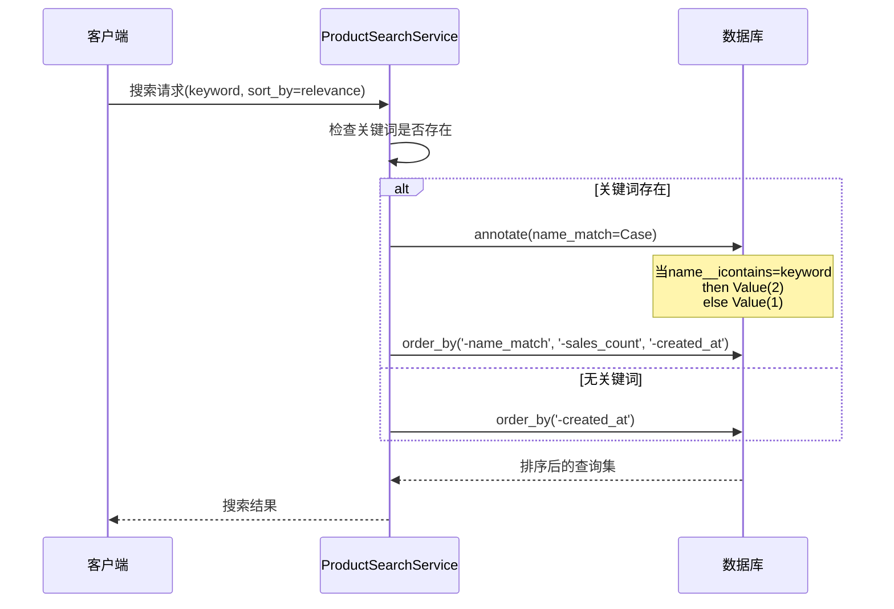
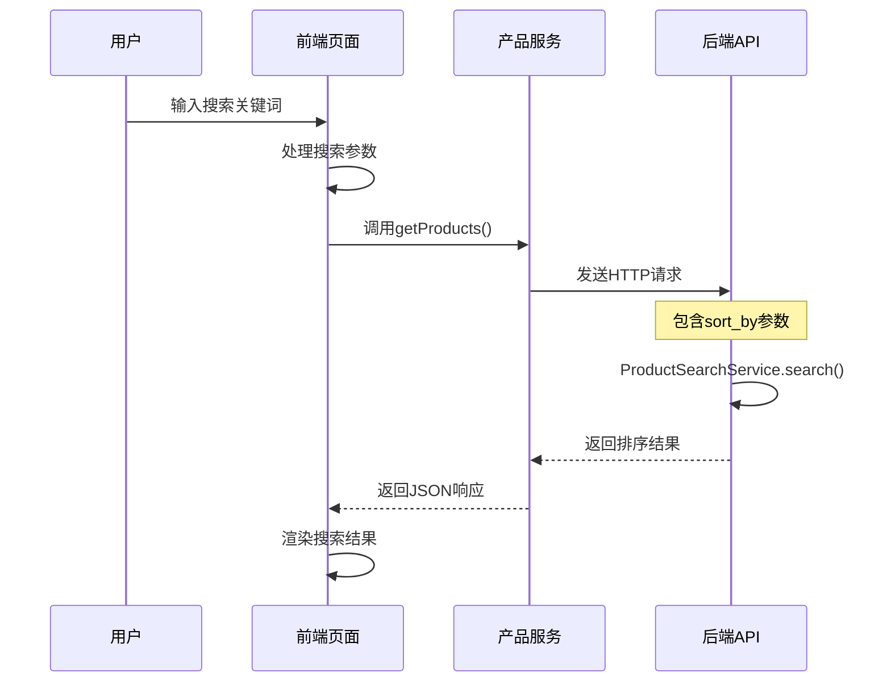

# 搜索结果排序策略实现详解

<cite>
**本文档引用的文件**
- [search.py](file://backend/catalog/search.py)
- [views.py](file://backend/catalog/views.py)
- [models.py](file://backend/catalog/models.py)
- [index.tsx](file://frontend/src/pages/search/index.tsx)
- [product.ts](file://frontend/src/services/product.ts)
- [index.tsx](file://merchant/src/pages/Products/index.tsx)
</cite>

## 目录
1. [概述](#概述)
2. [系统架构](#系统架构)
3. [排序策略概览](#排序策略概览)
4. [核心排序算法实现](#核心排序算法实现)
5. [前端请求处理流程](#前端请求处理流程)
6. [排序策略详细分析](#排序策略详细分析)
7. [性能考量与优化](#性能考量与优化)
8. [使用示例](#使用示例)
9. [故障排除指南](#故障排除指南)
10. [总结](#总结)

## 概述

本文档详细阐述了电动小程序项目中商品搜索结果的排序策略实现。系统提供了多种排序方式，包括价格排序、销量排序、创建时间排序以及基于关键词的相关性排序。核心排序逻辑由`ProductSearchService`类的`_apply_sorting`方法实现，支持灵活的排序组合和性能优化。

## 系统架构



**图表来源**
- [views.py](file://backend/catalog/views.py#L83-L131)
- [search.py](file://backend/catalog/search.py#L46-L158)

## 排序策略概览

系统支持以下六种排序策略：

| 排序类型 | 参数值 | 描述 | 主要字段 | 适用场景 |
|---------|--------|------|----------|----------|
| 相关性排序 | `relevance` | 基于关键词匹配度排序 | name_match, sales_count, created_at | 关键词搜索 |
| 价格升序 | `price_asc` | 按价格从小到大排序 | price | 性价比优先 |
| 价格降序 | `price_desc` | 按价格从大到小排序 | price | 高端商品筛选 |
| 销量优先 | `sales` | 按销售数量排序 | sales_count, created_at | 热销商品推荐 |
| 创建时间 | `created` | 按创建时间倒序 | created_at | 最新商品展示 |
| 查看次数 | `views` | 按浏览次数排序 | view_count, created_at | 热门商品识别 |

**章节来源**
- [search.py](file://backend/catalog/search.py#L36-L44)

## 核心排序算法实现

### ProductSearchService._apply_sorting 方法

`_apply_sorting`方法是排序逻辑的核心实现，根据不同的排序策略应用相应的数据库查询条件。



**图表来源**
- [search.py](file://backend/catalog/search.py#L161-L202)

### 相关性排序实现机制

相关性排序是最复杂的排序策略，通过Django的`annotate`和`Case`语句实现智能权重分配：



**图表来源**
- [search.py](file://backend/catalog/search.py#L191-L200)

**章节来源**
- [search.py](file://backend/catalog/search.py#L161-L202)

## 前端请求处理流程

### 前端搜索页面流程



**图表来源**
- [index.tsx](file://frontend/src/pages/search/index.tsx#L25-L51)
- [product.ts](file://frontend/src/services/product.ts#L6-L13)

### 参数传递与验证

前端通过`productService.getProducts`方法传递排序参数，后端在`ProductViewSet.list`方法中进行参数解析和验证。

**章节来源**
- [views.py](file://backend/catalog/views.py#L83-L131)
- [index.tsx](file://frontend/src/pages/search/index.tsx#L25-L51)

## 排序策略详细分析

### 价格排序策略

价格排序提供两种方向：
- **price_asc**: 按价格升序排列，适合性价比优先的用户
- **price_desc**: 按价格降序排列，适合高端商品筛选

### 销量优先策略

销量排序采用复合排序：
1. 主排序：按`sales_count`降序
2. 次级排序：按`created_at`降序（新品优先）

这种设计平衡了销售表现和时效性。

### 相关性排序深度解析

相关性排序是系统最智能的排序策略：

#### 权重分配机制
- **名称匹配**：完全匹配关键词的产品获得最高权重2分
- **描述匹配**：部分匹配的产品获得基础权重1分
- **无匹配**：不参与相关性排序

#### 排序优先级
1. **主要依据**：名称匹配权重（name_match）
2. **次要依据**：销售数量（sales_count）
3. **第三依据**：创建时间（created_at）

#### SQL实现原理
```sql
SELECT *, 
    CASE 
        WHEN name LIKE '%keyword%' THEN 2 
        ELSE 1 
    END AS name_match
FROM catalog_product
ORDER BY name_match DESC, sales_count DESC, created_at DESC
```

**章节来源**
- [search.py](file://backend/catalog/search.py#L189-L199)

### 创建时间排序

创建时间排序简单直接：
- 按`created_at`字段降序排列
- 最新的商品排在最前面
- 适用于新品推广和时间敏感的场景

### 查看次数排序

查看次数排序结合了用户行为数据：
1. 主排序：按`view_count`降序
2. 次级排序：按`created_at`降序

这种策略有助于发现热门商品和用户兴趣点。

**章节来源**
- [search.py](file://backend/catalog/search.py#L178-L186)

## 性能考量与优化

### 数据库索引优化

系统在多个字段上建立了复合索引以提升排序性能：

| 索引字段 | 类型 | 用途 |
|---------|------|------|
| `is_active, -sales_count` | 复合索引 | 销量排序优化 |
| `is_active, -view_count` | 复合索引 | 查看次数排序优化 |
| `-created_at` | 单字段索引 | 创建时间排序优化 |
| `keyword, created_at` | 复合索引 | 搜索日志分析 |

### 内存使用优化

- **批量查询**：使用`select_related`预加载关联对象
- **分页处理**：限制单页最大结果数（100条）
- **惰性求值**：Django ORM的惰性特性避免不必要的查询

### 缓存策略

- **搜索建议缓存**：热门关键词的搜索建议
- **热词统计缓存**：定期统计热门搜索词
- **排序结果缓存**：针对高频查询的排序结果缓存

### 查询复杂度分析

| 排序策略 | 时间复杂度 | 空间复杂度 | 优化建议 |
|---------|-----------|-----------|----------|
| 价格排序 | O(n log n) | O(1) | 使用数据库索引 |
| 销量排序 | O(n log n) | O(1) | 复合索引优化 |
| 相关性排序 | O(n log n) | O(n) | 添加name_match索引 |
| 创建时间排序 | O(n log n) | O(1) | 利用现有索引 |

## 使用示例

### 基础搜索示例

```typescript
// 基础搜索（默认相关性排序）
const products = await productService.getProducts({
    search: '冰箱',
    page: 1,
    page_size: 20
});

// 价格升序排序
const lowPriceProducts = await productService.getProducts({
    search: '电视',
    sort_by: 'price_asc',
    page: 1,
    page_size: 20
});
```

### 高级过滤排序示例

```typescript
// 销量优先的家电搜索
const applianceSales = await productService.getProducts({
    search: '空调',
    category: '家电',
    sort_by: 'sales',
    page: 1,
    page_size: 20
});

// 最新商品展示
const newProducts = await productService.getProducts({
    category: '手机',
    sort_by: 'created',
    page: 1,
    page_size: 10
});
```

### 分类特定排序

```typescript
// 按分类搜索并指定排序
const categoryResults = await productService.getProductsByCategory({
    category: '笔记本电脑',
    sort_by: 'price_desc',
    page: 1,
    page_size: 15
});
```

**章节来源**
- [product.ts](file://frontend/src/services/product.ts#L6-L32)
- [index.tsx](file://merchant/src/pages/Products/index.tsx#L313-L356)

## 故障排除指南

### 常见问题及解决方案

#### 1. 排序结果不符合预期

**症状**：搜索结果排序混乱
**原因**：sort_by参数值错误或数据库索引缺失
**解决方案**：
- 检查sort_by参数是否在有效选项内
- 验证数据库索引是否正确建立
- 清除查询缓存重新测试

#### 2. 相关性排序效果差

**症状**：关键词搜索结果质量不高
**原因**：权重分配不合理或索引缺失
**解决方案**：
- 优化name_match权重分配逻辑
- 添加name字段的全文索引
- 调整相关性计算公式

#### 3. 性能问题

**症状**：大搜索结果集排序缓慢
**原因**：未使用索引或查询过于复杂
**解决方案**：
- 使用数据库查询分析器定位瓶颈
- 添加适当的复合索引
- 实施分页和结果缓存

### 调试工具

#### 数据库查询分析
```python
# 在开发环境中启用SQL日志
import logging
logging.basicConfig(level=logging.DEBUG)
logger = logging.getLogger('django.db.backends')
logger.setLevel(logging.DEBUG)
```

#### 排序性能监控
```python
# 监控排序操作的执行时间
import time
from django.db import connection

start_time = time.time()
results = ProductSearchService.search(keyword='冰箱', sort_by='relevance')
execution_time = time.time() - start_time

print(f"排序执行时间: {execution_time:.3f}秒")
print(f"查询语句: {connection.queries[-1]['sql']}")
```

## 总结

电动小程序的商品搜索结果排序策略实现了全面而灵活的排序功能。通过`ProductSearchService`的`_apply_sorting`方法，系统能够根据不同场景需求提供定制化的排序方案。

### 核心优势

1. **多样化排序策略**：涵盖价格、销量、时间等多个维度
2. **智能相关性排序**：基于关键词匹配的权重分配
3. **高性能实现**：充分利用数据库索引和ORM优化
4. **前后端协作**：清晰的接口设计和参数传递机制

### 技术亮点

- **动态权重计算**：使用Django的`Case`语句实现智能权重分配
- **复合排序**：多字段排序确保结果的合理性和多样性
- **性能优化**：合理的索引设计和查询优化
- **扩展性强**：易于添加新的排序策略

### 未来改进方向

1. **机器学习集成**：基于用户行为的个性化排序
2. **实时性能监控**：动态调整排序策略以适应不同负载
3. **更复杂的相关性算法**：考虑更多上下文因素
4. **排序结果解释**：向用户提供排序依据的说明

这套排序系统为电动小程序提供了强大的商品搜索能力，能够满足不同用户群体的多样化需求，同时保持良好的性能表现。