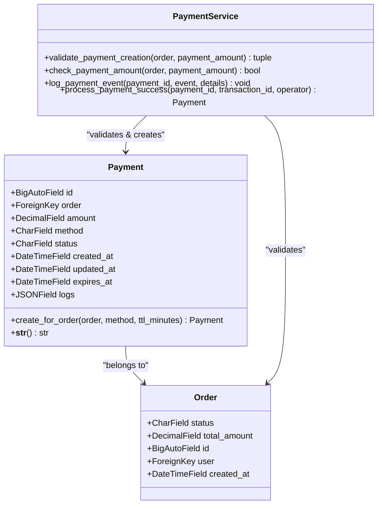
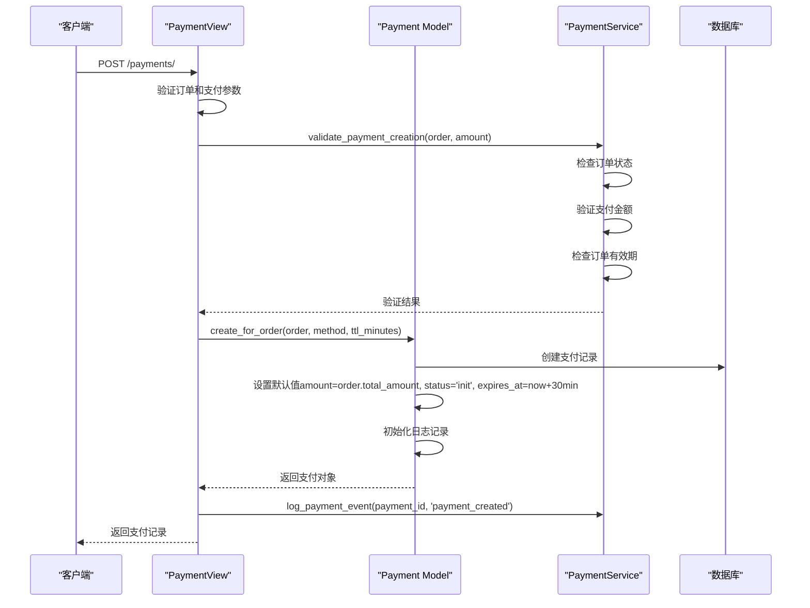
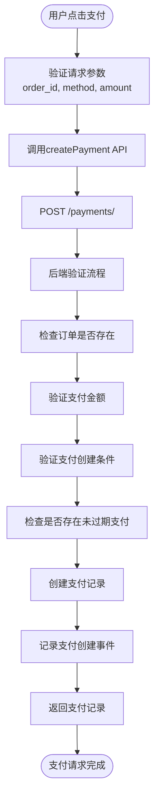
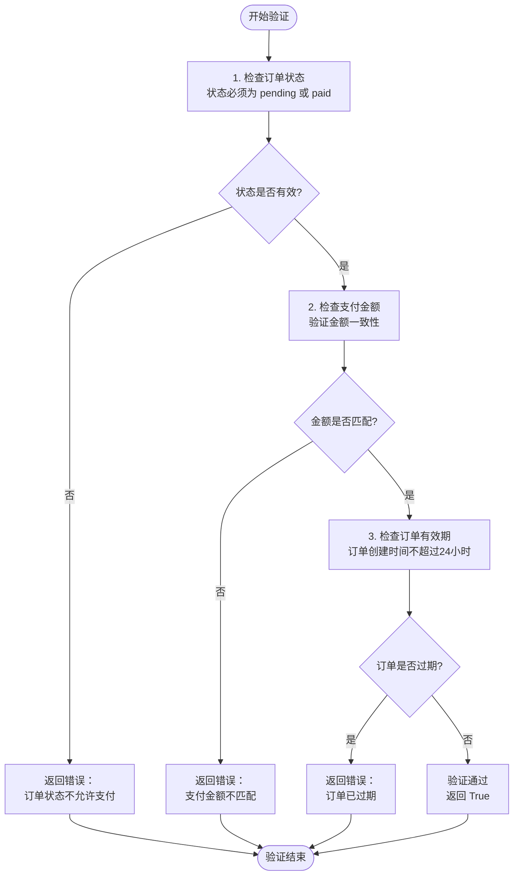
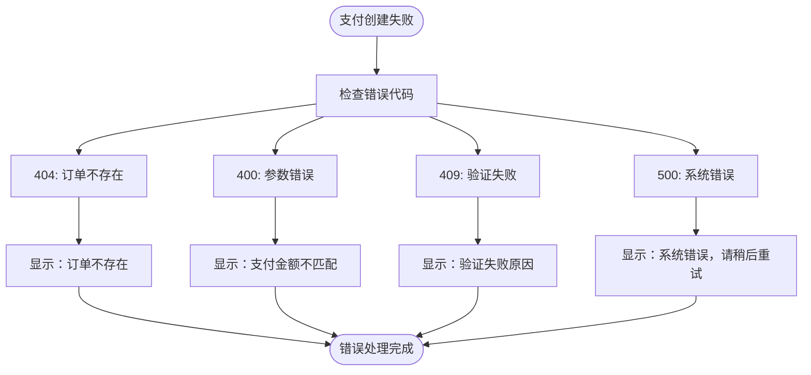

# 支付创建流程

<cite>
**本文档引用的文件**
- [models.py](file://backend/orders/models.py)
- [payment_service.py](file://backend/orders/payment_service.py)
- [views.py](file://backend/orders/views.py)
- [state_machine.py](file://backend/orders/state_machine.py)
- [utils.py](file://backend/common/utils.py)
- [payment.ts](file://frontend/src/services/payment.ts)
- [serializers.py](file://backend/orders/serializers.py)
- [urls.py](file://backend/orders/urls.py)
- [api.md](file://api.md)
</cite>

## 目录
1. [概述](#概述)
2. [支付模型结构](#支付模型结构)
3. [支付创建核心流程](#支付创建核心流程)
4. [前端支付请求流程](#前端支付请求流程)
5. [支付验证机制](#支付验证机制)
6. [支付创建失败场景](#支付创建失败场景)
7. [API请求与响应格式](#api请求与响应格式)
8. [错误处理策略](#错误处理策略)
9. [总结](#总结)

## 概述

支付创建流程是电商系统中的核心业务流程之一，负责为订单生成支付记录，确保支付过程的安全性和可靠性。本文档详细说明了从订单到支付记录创建的完整流程，包括Payment模型的create_for_order类方法的工作原理、前端调用/payment/接口的触发路径、支付创建的三重验证机制，以及各种失败场景的处理策略。

## 支付模型结构

Payment模型是支付系统的核心数据结构，包含了支付记录的所有必要信息：



**图表来源**
- [models.py](file://backend/orders/models.py#L186-L234)
- [payment_service.py](file://backend/orders/payment_service.py#L20-L242)

### 支付状态定义

支付系统定义了以下状态常量：

| 状态 | 描述 | 允许的操作 |
|------|------|------------|
| init | 待支付 | 创建支付记录 |
| processing | 支付中 | 开始支付、支付成功、支付失败 |
| succeeded | 支付成功 | 无 |
| failed | 支付失败 | 重新支付 |
| cancelled | 已取消 | 无 |
| expired | 已过期 | 重新支付 |

**节来源**
- [models.py](file://backend/orders/models.py#L187-L198)

## 支付创建核心流程

### create_for_order类方法详解

Payment模型的create_for_order类方法是支付创建的核心入口，它根据订单信息创建支付记录：



**图表来源**
- [views.py](file://backend/orders/views.py#L840-L939)
- [models.py](file://backend/orders/models.py#L223-L234)

### create_for_order方法实现细节

create_for_order方法的核心实现包含以下关键步骤：

1. **金额继承**：自动使用订单的total_amount作为支付金额
2. **过期时间计算**：默认设置30分钟的有效期（可通过ttl_minutes参数自定义）
3. **初始状态设置**：将支付状态初始化为'init'（待支付）
4. **日志记录**：创建初始日志条目，记录支付方式和创建时间

**节来源**
- [models.py](file://backend/orders/models.py#L223-L234)

## 前端支付请求流程

### 前端支付服务接口

前端通过paymentService发起支付请求：



**图表来源**
- [payment.ts](file://frontend/src/services/payment.ts#L15-L20)
- [views.py](file://backend/orders/views.py#L840-L939)

### 前端调用示例

前端调用createPayment方法的标准格式：

**节来源**
- [payment.ts](file://frontend/src/services/payment.ts#L15-L20)

## 支付验证机制

### validate_payment_creation三重校验

PaymentService.validate_payment_creation方法实现了严格的三重验证机制：



**图表来源**
- [payment_service.py](file://backend/orders/payment_service.py#L207-L242)

### 验证规则详解

1. **订单状态验证**：只允许状态为'pending'或'paid'的订单进行支付
2. **金额一致性验证**：使用check_payment_amount方法验证支付金额与订单金额的一致性，允许0.01元的误差
3. **订单有效期验证**：订单创建时间不能超过24小时

**节来源**
- [payment_service.py](file://backend/orders/payment_service.py#L207-L242)

## 支付创建失败场景

### 常见失败场景及错误信息

支付创建过程中可能遇到的失败场景：

| 场景 | 错误代码 | 错误信息 | 处理方式 |
|------|----------|----------|----------|
| 订单不存在 | 404 | Order not found | 提示用户订单不存在 |
| 支付方式不支持 | 400 | Unsupported payment method | 显示支持的支付方式 |
| 支付金额不匹配 | 400 | Payment amount does not match order amount | 显示正确的订单金额 |
| 订单状态不允许支付 | 409 | 订单状态为xxx，不允许支付 | 提示用户订单状态 |
| 订单已过期 | 409 | 订单已过期，请重新创建 | 引导用户重新下单 |
| 存在未过期支付记录 | 200 | An active payment record already exists | 显示现有支付记录 |

### 错误处理流程



**节来源**
- [views.py](file://backend/orders/views.py#L840-L939)

## API请求与响应格式

### 支付创建API规范

根据API文档，支付创建接口的详细规范如下：

| 属性 | 类型 | 必填 | 描述 |
|------|------|------|------|
| order_id | number | 是 | 订单ID |
| method | string | 否 | 支付方式，默认为'wechat' |
| amount | string | 否 | 支付金额（可选，如果不提供则使用订单总额） |

**支持的支付方式**：'wechat', 'alipay', 'bank'

### 请求示例

**成功请求**：
```json
POST /payments/
{
  "order_id": 123,
  "method": "wechat",
  "amount": "100.00"
}
```

**失败请求**：
```json
POST /payments/
{
  "order_id": 123,
  "method": "invalid_method"
}
```

### 响应格式

**成功响应**（HTTP 201 Created）：
```json
{
  "id": 456,
  "order": 123,
  "amount": "100.00",
  "method": "wechat",
  "status": "init",
  "created_at": "2024-01-01T10:00:00Z",
  "updated_at": "2024-01-01T10:00:00Z",
  "expires_at": "2024-01-01T10:30:00Z",
  "logs": [
    {
      "t": "2024-01-01T10:00:00Z",
      "event": "start",
      "detail": "start payment wechat"
    }
  ]
}
```

**错误响应**：
```json
{
  "detail": "Payment amount 100.00 does not match order amount 99.99",
  "order_amount": "99.99",
  "payment_amount": "100.00"
}
```

**节来源**
- [api.md](file://api.md#L299-L303)
- [views.py](file://backend/orders/views.py#L840-L939)

## 错误处理策略

### 分层错误处理

系统采用分层的错误处理策略：

1. **前端层**：捕获网络错误，提供友好的用户提示
2. **视图层**：处理业务逻辑错误，返回适当的HTTP状态码
3. **服务层**：执行核心业务逻辑，记录详细日志
4. **模型层**：确保数据完整性，抛出适当的异常

### 日志记录策略

系统在关键节点记录详细的日志信息：

- **警告级别**：订单状态异常、金额不匹配等情况
- **错误级别**：支付创建失败、数据库操作异常
- **信息级别**：支付记录创建成功、状态转换等

**节来源**
- [views.py](file://backend/orders/views.py#L875-L939)
- [payment_service.py](file://backend/orders/payment_service.py#L245-L292)

## 总结

支付创建流程是一个复杂而精密的业务流程，涉及多个层次的验证和处理。通过Payment模型的create_for_order方法，系统能够安全可靠地为订单创建支付记录。validate_payment_creation方法的三重验证机制确保了支付过程的正确性，而完善的错误处理策略则保证了系统的稳定性和用户体验。

整个流程从前端请求到后端处理，再到最终的支付记录创建，形成了一个完整的闭环，为后续的支付处理奠定了坚实的基础。理解这个流程对于维护系统稳定性和优化用户体验具有重要意义。