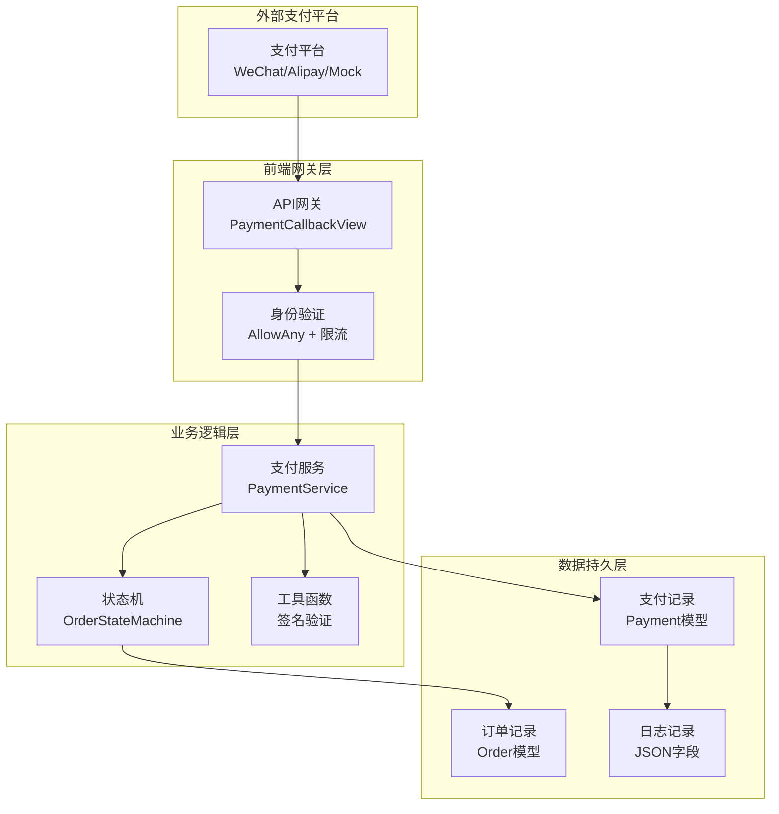
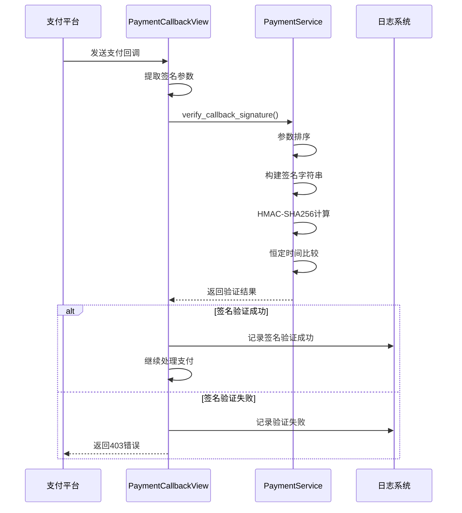
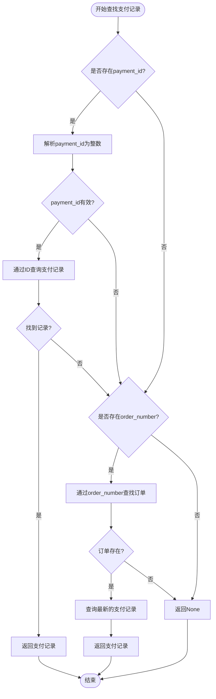
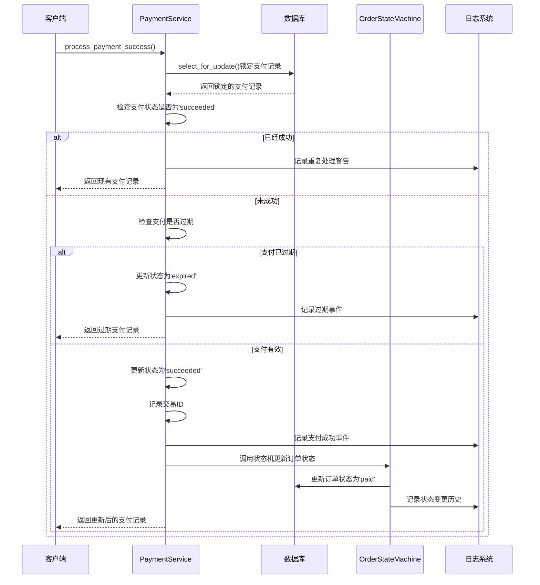
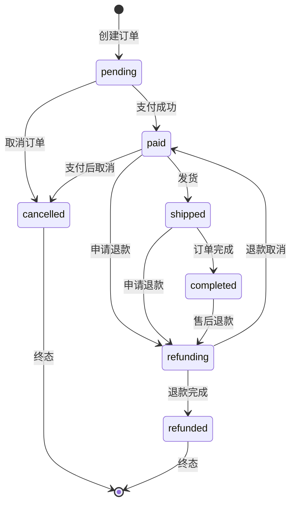
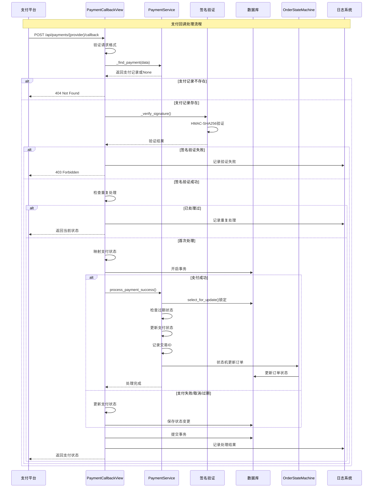

# 支付回调处理

<cite>
**本文档中引用的文件**
- [payment_service.py](file://backend/orders/payment_service.py)
- [views.py](file://backend/orders/views.py)
- [models.py](file://backend/orders/models.py)
- [state_machine.py](file://backend/orders/state_machine.py)
</cite>

## 目录
1. [概述](#概述)
2. [系统架构](#系统架构)
3. [签名验证机制](#签名验证机制)
4. [支付记录查找策略](#支付记录查找策略)
5. [支付成功处理流程](#支付成功处理流程)
6. [订单状态机管理](#订单状态机管理)
7. [安全防护措施](#安全防护措施)
8. [时序图分析](#时序图分析)
9. [故障处理与监控](#故障处理与监控)
10. [最佳实践建议](#最佳实践建议)

## 概述

支付回调处理是电商系统中的核心安全机制，负责验证第三方支付平台的支付结果通知，确保支付数据的真实性和完整性。本系统采用多层次的安全防护策略，包括HMAC-SHA256签名验证、防重放攻击、并发控制等机制，保障支付业务的安全可靠运行。

## 系统架构

支付回调处理系统采用分层架构设计，包含以下核心组件：

**图表来源**
- [views.py](file://backend/orders/views.py#L1133-L1367)
- [payment_service.py](file://backend/orders/payment_service.py#L20-L98)
- [state_machine.py](file://backend/orders/state_machine.py#L25-L57)

**章节来源**
- [views.py](file://backend/orders/views.py#L1133-L1150)
- [payment_service.py](file://backend/orders/payment_service.py#L20-L30)

## 签名验证机制

### HMAC-SHA256签名验证

系统采用HMAC-SHA256算法验证支付回调的签名真实性，防止恶意伪造支付通知。

**图表来源**
- [views.py](file://backend/orders/views.py#L1180-L1197)
- [payment_service.py](file://backend/orders/payment_service.py#L31-L68)

### 签名验证实现细节

签名验证的核心算法包含以下关键步骤：

1. **参数排序**：按字典序对回调数据参数进行排序
2. **字符串构建**：将排序后的参数拼接成`key=value`格式的字符串
3. **HMAC计算**：使用密钥和SHA256算法计算预期签名
4. **安全比较**：使用`hmac.compare_digest()`进行恒定时间比较，防止时序攻击

**章节来源**
- [payment_service.py](file://backend/orders/payment_service.py#L31-L68)

## 支付记录查找策略

### 容错机制设计

系统实现了智能的支付记录查找策略，优先使用更可靠的标识符，确保即使部分参数缺失也能准确定位支付记录。

**图表来源**
- [views.py](file://backend/orders/views.py#L1298-L1332)

### 查找优先级策略

系统采用双优先级查找策略：

1. **第一优先级**：通过`payment_id`直接定位支付记录
2. **第二优先级**：通过`order_number`反向查找关联的支付记录

这种设计考虑了以下场景：
- 支付平台直接返回支付记录ID
- 支付平台仅返回订单号，需要系统反向关联
- 部分参数缺失时的容错处理

**章节来源**
- [views.py](file://backend/orders/views.py#L1298-L1332)

## 支付成功处理流程

### 行级锁保护机制

系统使用`select_for_update()`数据库行级锁，防止并发场景下的重复支付处理。

**图表来源**
- [payment_service.py](file://backend/orders/payment_service.py#L107-L207)

### 关键处理步骤详解

支付成功处理包含以下核心步骤：

1. **并发控制**：使用数据库行级锁防止重复处理
2. **过期检查**：验证支付是否在有效期内
3. **状态更新**：原子性更新支付和订单状态
4. **交易记录**：保存第三方支付系统的交易ID
5. **日志记录**：完整记录整个处理过程

**章节来源**
- [payment_service.py](file://backend/orders/payment_service.py#L107-L207)

## 订单状态机管理

### 状态转换规则

系统采用状态机模式管理订单状态流转，确保状态转换的合法性和业务逻辑的正确性。

**图表来源**
- [state_machine.py](file://backend/orders/state_machine.py#L34-L57)

### 状态转换安全性

状态机提供以下安全保障：

1. **合法性检查**：严格验证状态转换的合法性
2. **事务一致性**：使用数据库事务确保状态变更原子性
3. **历史记录**：完整记录状态变更历史
4. **业务逻辑**：在状态转换前后执行相应的业务逻辑

**章节来源**
- [state_machine.py](file://backend/orders/state_machine.py#L59-L154)

## 安全防护措施

### 多层次安全防护

系统实施多层次的安全防护策略：

| 防护层级 | 实现方式 | 目标 |
|---------|---------|------|
| 网络层 | IP白名单、HTTPS加密 | 防止网络攻击 |
| 应用层 | 签名验证、参数校验 | 防止数据篡改 |
| 业务层 | 状态机、行级锁 | 防止业务逻辑漏洞 |
| 数据层 | 事务控制、审计日志 | 防止数据损坏 |

### 防重放攻击机制

1. **时间戳验证**：检查回调请求的时间戳
2. **幂等性设计**：确保重复处理不会产生副作用
3. **状态检查**：通过支付状态避免重复处理
4. **日志追踪**：记录所有处理事件便于审计

**章节来源**
- [views.py](file://backend/orders/views.py#L1180-L1207)

## 时序图分析

### 完整支付回调处理时序

**图表来源**
- [views.py](file://backend/orders/views.py#L1149-L1296)

## 故障处理与监控

### 异常处理机制

系统实现了完善的异常处理和监控机制：

1. **签名验证失败**：记录详细错误信息，拒绝处理
2. **支付记录不存在**：返回404错误，不泄露敏感信息
3. **并发冲突**：通过数据库锁解决，确保数据一致性
4. **状态转换失败**：记录错误但不中断整体流程

### 监控指标

| 监控指标 | 描述 | 告警阈值 |
|---------|------|---------|
| 回调成功率 | 成功处理的回调比例 | < 95% |
| 签名验证失败率 | 签名验证失败的比例 | > 5% |
| 并发处理延迟 | 支付处理的平均响应时间 | > 5秒 |
| 状态转换失败率 | 订单状态转换失败的比例 | > 1% |

**章节来源**
- [views.py](file://backend/orders/views.py#L1286-L1294)

## 最佳实践建议

### 开发阶段

1. **本地测试**：使用Mock支付进行本地开发测试
2. **签名密钥管理**：妥善保管各支付平台的签名密钥
3. **参数验证**：严格验证回调参数的完整性和格式
4. **日志记录**：记录详细的处理日志便于问题排查

### 生产部署

1. **环境隔离**：区分开发、测试、生产环境的配置
2. **监控告警**：建立完善的监控和告警机制
3. **容量规划**：根据业务量合理规划系统资源
4. **备份恢复**：定期备份支付数据，制定应急恢复方案

### 运维维护

1. **定期审计**：定期检查支付回调的安全性
2. **版本升级**：及时升级系统和依赖库
3. **性能优化**：监控系统性能，持续优化
4. **安全加固**：定期评估和加强安全防护措施

通过以上全面的安全防护机制和严谨的处理流程，系统能够可靠地处理各种支付回调场景，确保支付业务的安全稳定运行。