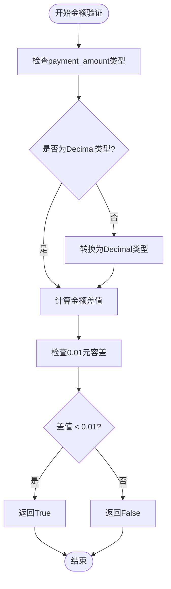
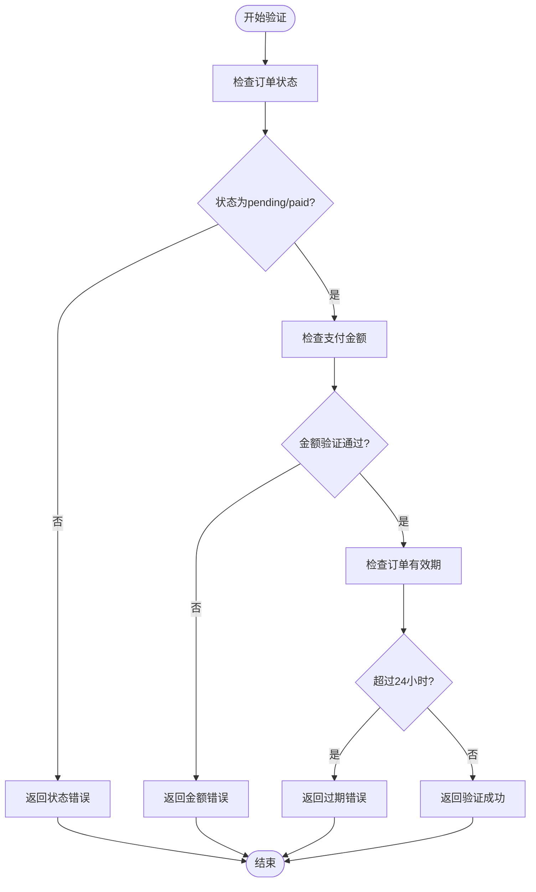
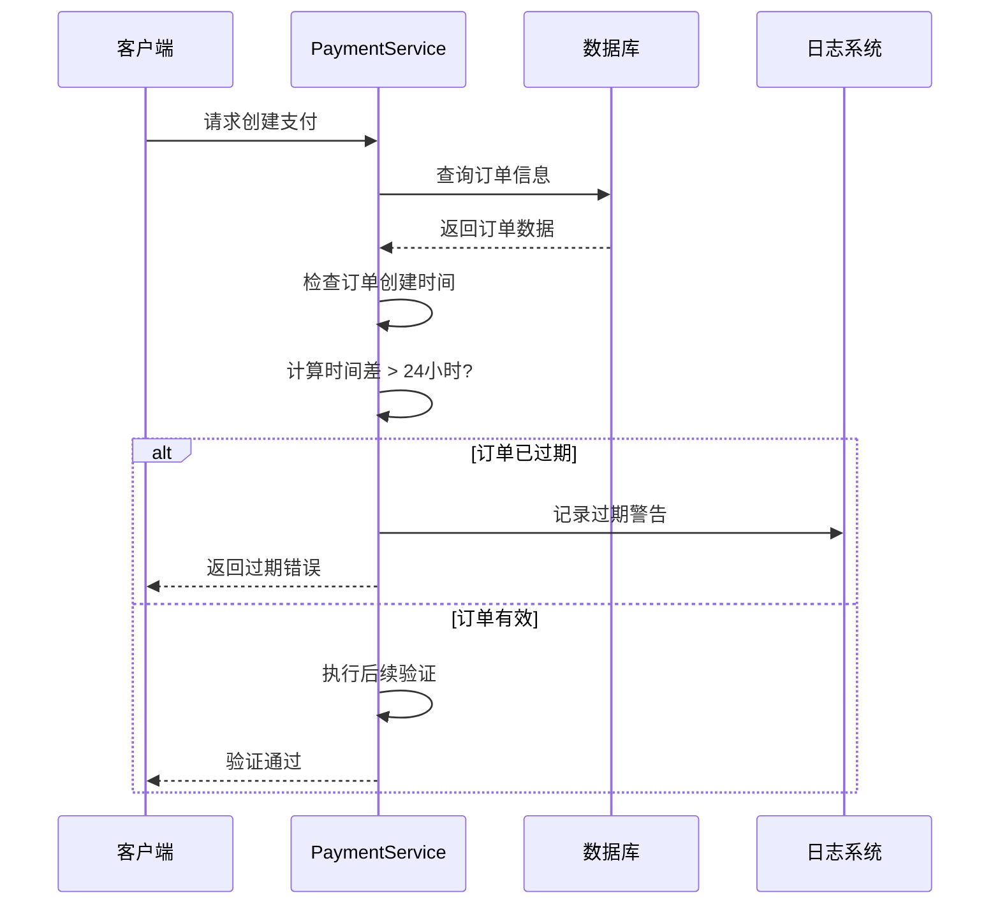
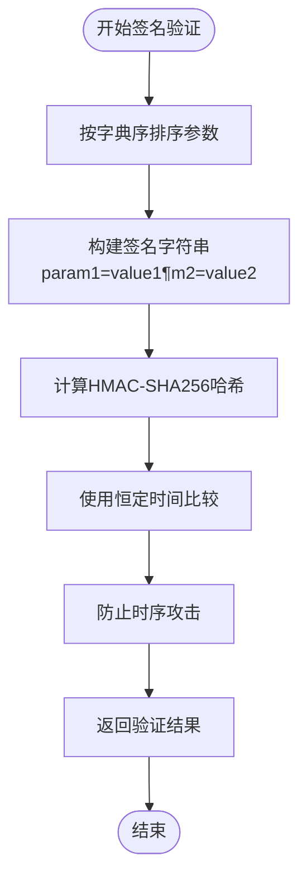
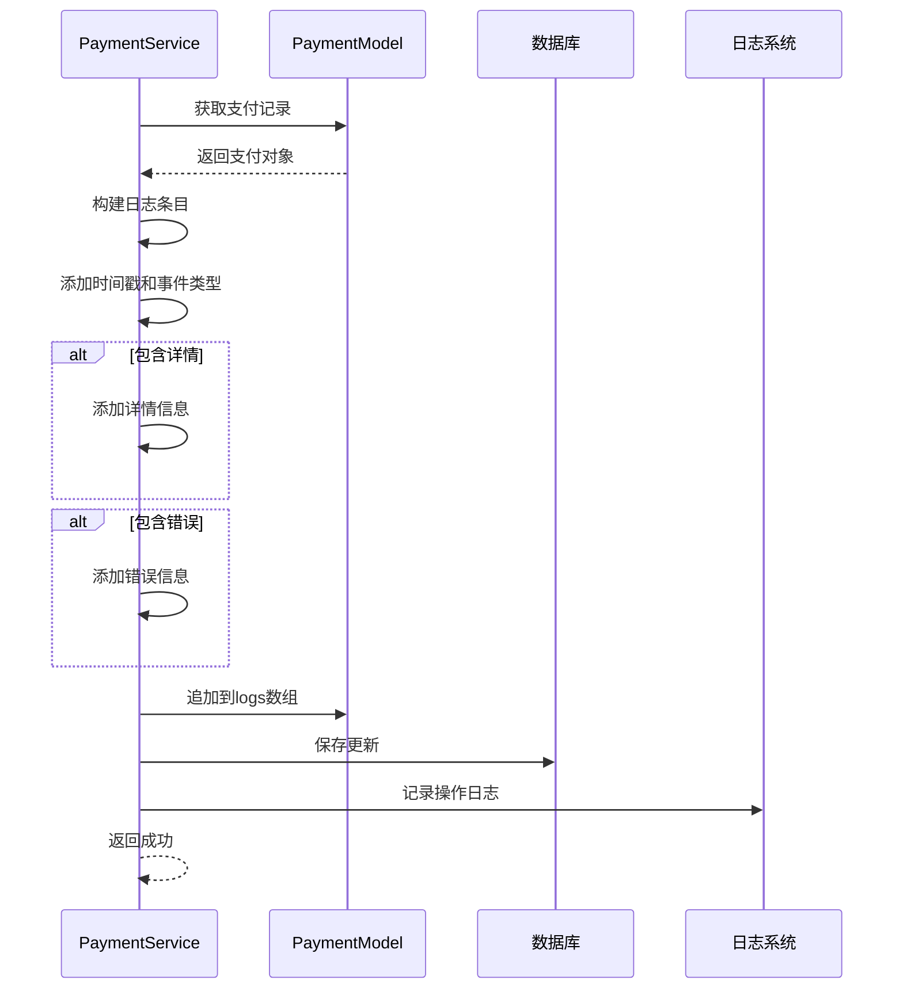
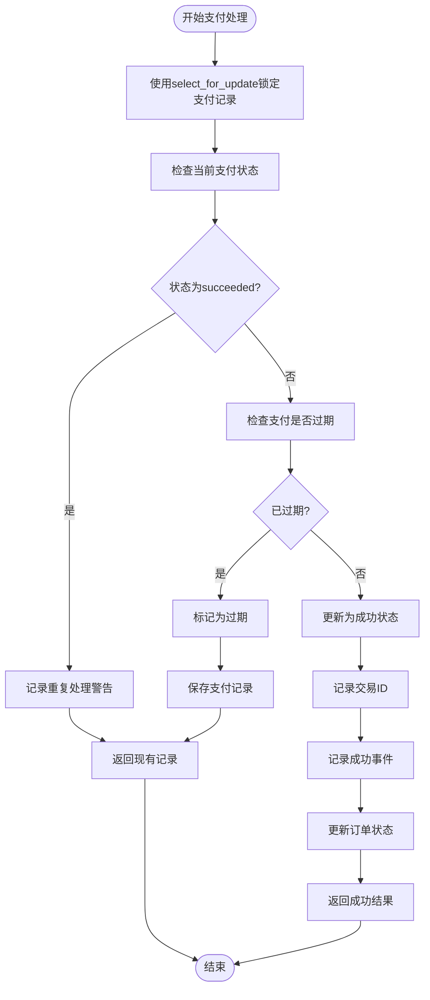

# 支付安全与金额校验

<cite>
**本文档引用的文件**
- [payment_service.py](file://backend/orders/payment_service.py)
- [models.py](file://backend/orders/models.py)
- [views.py](file://backend/orders/views.py)
- [audit_logger.py](file://backend/common/audit_logger.py)
- [logging_config.py](file://backend/common/logging_config.py)
- [payment.ts](file://frontend/src/services/payment.ts)
- [base.py](file://backend/backend/settings/base.py)
</cite>

## 目录
1. [概述](#概述)
2. [支付金额验证机制](#支付金额验证机制)
3. [订单状态与有效期校验](#订单状态与有效期校验)
4. [签名验证与防篡改保护](#签名验证与防篡改保护)
5. [操作日志与审计追踪](#操作日志与审计追踪)
6. [并发控制与重复支付防护](#并发控制与重复支付防护)
7. [安全配置与最佳实践](#安全配置与最佳实践)
8. [常见攻击防范策略](#常见攻击防范策略)
9. [总结](#总结)

## 概述

本系统实现了多层次的支付安全防护机制，确保支付过程的安全性和可靠性。核心安全特性包括：

- **精确的金额校验**：允许0.01元的浮点误差，处理货币计算精度问题
- **严格的订单状态检查**：只允许特定状态的订单进行支付
- **强大的签名验证**：使用HMAC-SHA256算法防止回调伪造
- **完整的审计日志**：记录所有关键操作事件，支持安全审计
- **并发控制机制**：防止重复支付和竞态条件

## 支付金额验证机制

### check_payment_amount方法详解

系统的核心金额验证功能由`check_payment_amount`方法实现，该方法专门处理支付金额与订单金额的一致性检查。



**图表来源**
- [payment_service.py](file://backend/orders/payment_service.py#L71-L103)

#### 关键安全特性

1. **类型安全性**：强制要求支付金额为Decimal类型，避免浮点数精度问题
2. **容差机制**：允许0.01元的误差，处理货币计算中的微小差异
3. **异常处理**：捕获并记录验证过程中的异常，确保系统稳定性

#### 实现细节

- **输入验证**：自动将非Decimal类型的金额转换为Decimal
- **精度控制**：使用Python的Decimal类型确保货币计算精度
- **容差标准**：设置0.01元作为合理的浮点误差范围
- **错误处理**：记录验证异常但不影响系统运行

**章节来源**
- [payment_service.py](file://backend/orders/payment_service.py#L71-L103)

### validate_payment_creation方法

该方法在创建支付记录前执行综合验证，确保支付条件的完整性。



**图表来源**
- [payment_service.py](file://backend/orders/payment_service.py#L207-L242)

**章节来源**
- [payment_service.py](file://backend/orders/payment_service.py#L207-L242)

## 订单状态与有效期校验

### 订单状态约束

系统严格限制只有以下状态的订单可以进行支付：
- `pending`：待支付状态
- `paid`：已支付状态（允许重新支付）

这种设计防止了重复支付和状态不一致的问题。

### 有效期检查机制



**图表来源**
- [payment_service.py](file://backend/orders/payment_service.py#L237-L241)

**章节来源**
- [payment_service.py](file://backend/orders/payment_service.py#L229-L241)

## 签名验证与防篡改保护

### verify_callback_signature方法

系统使用HMAC-SHA256算法验证第三方支付回调的签名真实性。



**图表来源**
- [payment_service.py](file://backend/orders/payment_service.py#L31-L68)

#### 安全特性

1. **HMAC-SHA256算法**：使用强加密算法确保签名安全性
2. **参数排序**：按字典序排列参数，确保签名计算的一致性
3. **恒定时间比较**：使用`hmac.compare_digest()`防止时序攻击
4. **异常处理**：捕获签名验证过程中的异常

#### 支付提供商支持

系统支持多种支付提供商的签名验证：
- **微信支付**：使用`WECHAT_PAY_SECRET`密钥
- **支付宝**：使用`ALIPAY_SECRET`密钥  
- **开发环境**：支持模拟支付，跳过签名验证

**章节来源**
- [payment_service.py](file://backend/orders/payment_service.py#L31-L68)

## 操作日志与审计追踪

### logs字段的JSON结构设计

每个支付记录都包含一个JSON格式的`logs`字段，用于记录关键事件和操作历史。

```mermaid
erDiagram
PAYMENT {
bigint id PK
decimal amount
char_method method
char_status status
datetime_expires_at
json_logs logs
}
LOG_ENTRY {
string t
string event
json_details details
string error
}
PAYMENT ||--o{ LOG_ENTRY : contains
```

**图表来源**
- [models.py](file://backend/orders/models.py#L201-L221)

### 关键事件记录

系统记录以下关键事件：

| 事件类型 | 描述 | 记录时机 |
|---------|------|----------|
| `payment_created` | 支付记录创建 | 创建支付时 |
| `signature_verified` | 签名验证成功 | 回调签名验证通过 |
| `signature_verification_failed` | 签名验证失败 | 回调签名验证失败 |
| `payment_succeeded` | 支付成功处理 | 支付处理完成 |
| `transaction_id_recorded` | 交易ID记录 | 接收第三方交易ID |
| `order_transition_failed` | 状态转换失败 | 订单状态更新失败 |
| `expired` | 支付过期 | 支付超时处理 |

### log_payment_event方法

该方法提供统一的日志记录接口，支持事件详情和错误信息的完整记录。



**图表来源**
- [payment_service.py](file://backend/orders/payment_service.py#L245-L292)

**章节来源**
- [payment_service.py](file://backend/orders/payment_service.py#L245-L292)

## 并发控制与重复支付防护

### process_payment_success方法

该方法实现了严格的并发控制和重复支付防护机制。



**图表来源**
- [payment_service.py](file://backend/orders/payment_service.py#L106-L204)

#### 并发控制机制

1. **数据库锁**：使用`select_for_update()`防止并发处理
2. **状态检查**：重复检查支付状态，避免重复处理
3. **过期检查**：验证支付是否仍在有效期内
4. **事务保证**：使用数据库事务确保操作原子性

#### 重复支付防护

- **状态验证**：检查支付状态是否为`succeeded`
- **幂等性设计**：多次调用同一处理函数不会产生副作用
- **错误恢复**：即使处理失败也能保持数据一致性

**章节来源**
- [payment_service.py](file://backend/orders/payment_service.py#L106-L204)

## 安全配置与最佳实践

### 速率限制配置

系统在REST框架中配置了支付相关的速率限制：

```python
# 支付API的速率限制配置
REST_FRAMEWORK = {
    'DEFAULT_THROTTLE_RATES': {
        'payment': '10/minute',  # 每分钟最多10次支付请求
    }
}
```

### 安全中间件配置

```python
# CSRF保护
MIDDLEWARE = [
    'django.middleware.csrf.CsrfViewMiddleware',  # 防止CSRF攻击
    # 其他中间件...
]

# CORS配置
CORS_ALLOW_HEADERS = [
    'accept',
    'accept-encoding',
    'authorization',  # 支持JWT认证
    'content-type',
    # 其他安全头部...
]
```

### 前端安全实践

前端支付服务提供了基本的安全保障：

```typescript
// 前端支付服务接口
const paymentService = {
  // 创建支付记录时会验证订单ID和用户权限
  async createPayment(data: {
    order_id: number      // 订单ID
    method?: 'wechat' | 'alipay' | 'bank'  // 支付方式
    amount?: string       // 支付金额（可选）
  }): Promise<Payment>
}
```

**章节来源**
- [base.py](file://backend/backend/settings/base.py#L48-L52)
- [payment.ts](file://frontend/src/services/payment.ts#L15-L19)

## 常见攻击防范策略

### 1. 重放攻击防护

**实现机制**：
- **支付过期时间**：每笔支付都有30分钟的有效期
- **订单有效期**：订单创建超过24小时自动失效
- **唯一交易ID**：记录第三方交易ID防止重复处理

### 2. 中间人攻击防护

**实现机制**：
- **HTTPS通信**：所有支付接口必须通过HTTPS访问
- **签名验证**：回调数据必须经过签名验证
- **密钥管理**：支付密钥定期轮换

### 3. 金额篡改攻击

**实现机制**：
- **金额精度控制**：使用Decimal类型确保金额精度
- **容差机制**：允许0.01元的合理误差
- **双重验证**：前端和后端都进行金额验证

### 4. 并发攻击防护

**实现机制**：
- **数据库锁**：使用select_for_update防止并发修改
- **状态机**：通过状态机确保状态转换的正确性
- **幂等性**：支付处理函数具有幂等性

### 5. 业务逻辑攻击

**实现机制**：
- **订单状态检查**：严格限制可支付的订单状态
- **金额一致性检查**：确保支付金额与订单金额一致
- **用户权限验证**：验证用户对订单的访问权限

## 总结

本系统通过多层次的安全防护机制，确保了支付过程的安全性和可靠性：

### 核心安全特性

1. **金额验证**：精确的金额校验，允许合理的浮点误差
2. **状态控制**：严格的订单状态和有效期检查
3. **签名验证**：强大的HMAC-SHA256签名验证机制
4. **审计追踪**：完整的操作日志和事件记录
5. **并发控制**：有效的重复支付防护和并发控制
6. **攻击防护**：全面的常见攻击防范策略

### 最佳实践建议

1. **定期安全审计**：定期审查日志和安全配置
2. **监控告警**：建立支付安全监控和告警机制
3. **密钥管理**：定期轮换支付密钥，加强密钥安全管理
4. **性能优化**：监控支付接口性能，及时发现异常
5. **合规检查**：确保支付流程符合相关法规要求

这套支付安全机制为电商业务提供了坚实的安全基础，能够有效防范各种支付安全威胁，保障用户资金安全和业务正常运营。