# 支付生命周期管理

<cite>
**本文档引用的文件**
- [payment_service.py](file://backend/orders/payment_service.py)
- [models.py](file://backend/orders/models.py)
- [cancel_unpaid_orders.py](file://backend/orders/management/commands/cancel_unpaid_orders.py)
- [state_machine.py](file://backend/orders/state_machine.py)
- [views.py](file://backend/orders/views.py)
- [serializers.py](file://backend/orders/serializers.py)
- [payment.ts](file://frontend/src/services/payment.ts)
</cite>

## 目录
1. [概述](#概述)
2. [支付模型状态设计](#支付模型状态设计)
3. [支付生命周期流程](#支付生命周期流程)
4. [支付服务核心功能](#支付服务核心功能)
5. [第三方支付网关集成](#第三方支付网关集成)
6. [支付超时自动取消机制](#支付超时自动取消机制)
7. [支付金额校验机制](#支付金额校验机制)
8. [支付流程时序图](#支付流程时序图)
9. [安全防护措施](#安全防护措施)
10. [故障处理与监控](#故障处理与监控)

## 概述

支付生命周期管理系统是电小二商城的核心业务组件，负责处理从订单创建到支付完成的完整支付流程。系统采用状态机模式管理支付状态，支持多种支付方式（微信支付、支付宝、银行卡），并实现了完善的防篡改、防重复支付和超时自动取消机制。

### 核心特性

- **状态驱动的支付流程**：基于状态机模式的支付状态管理
- **多支付方式支持**：微信支付、支付宝、银行卡等多种支付渠道
- **安全防护机制**：签名验证、金额校验、重复支付防护
- **自动化超时处理**：自动取消未支付订单，释放库存资源
- **完整的审计日志**：记录支付全流程的详细操作日志

## 支付模型状态设计

### 支付状态字段定义

Payment模型定义了完整的支付状态生命周期，每个状态都有明确的业务含义：

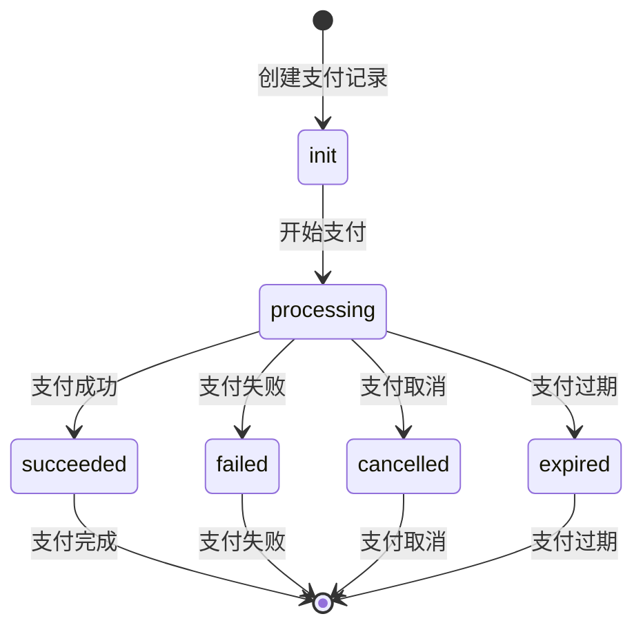

**图表来源**
- [models.py](file://backend/orders/models.py#L192-L199)

#### 状态字段详解

| 状态值 | 中文描述 | 业务含义 | 下一状态 |
|--------|----------|----------|----------|
| `init` | 待支付 | 支付记录已创建，等待用户发起支付 | `processing` |
| `processing` | 支付中 | 用户正在支付过程中 | `succeeded`/`failed`/`cancelled`/`expired` |
| `succeeded` | 支付成功 | 支付完成，订单状态更新为待发货 | 终态 |
| `failed` | 支付失败 | 支付过程出错或用户取消支付 | 终态 |
| `cancelled` | 已取消 | 支付被主动取消 | 终态 |
| `expired` | 已过期 | 支付超时未完成 | 终态 |

**节来源**
- [models.py](file://backend/orders/models.py#L192-L199)

### 订单状态关联

支付状态与订单状态紧密关联，通过状态机确保状态转换的合法性：

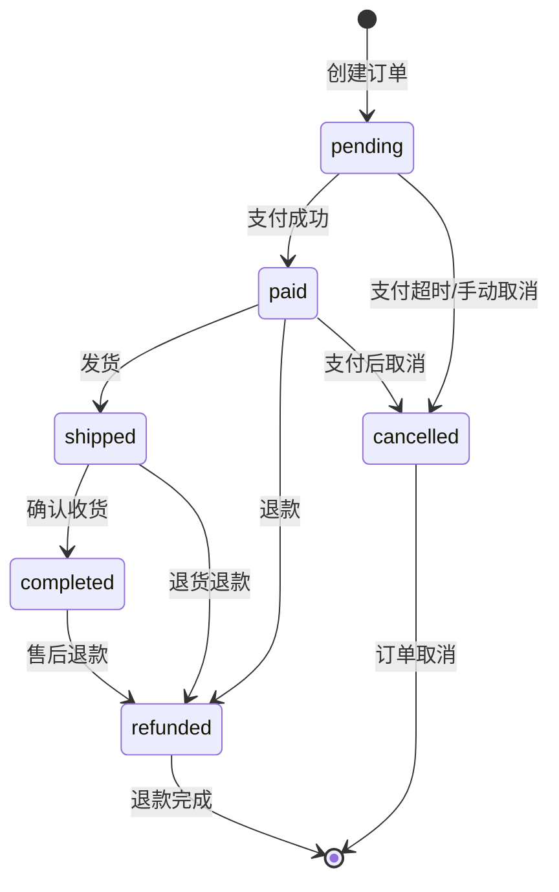

**图表来源**
- [state_machine.py](file://backend/orders/state_machine.py#L32-L57)

**节来源**
- [state_machine.py](file://backend/orders/state_machine.py#L14-L28)

## 支付生命周期流程

### 支付创建流程

支付创建是整个支付生命周期的起点，涉及订单验证、金额校验和支付记录创建：

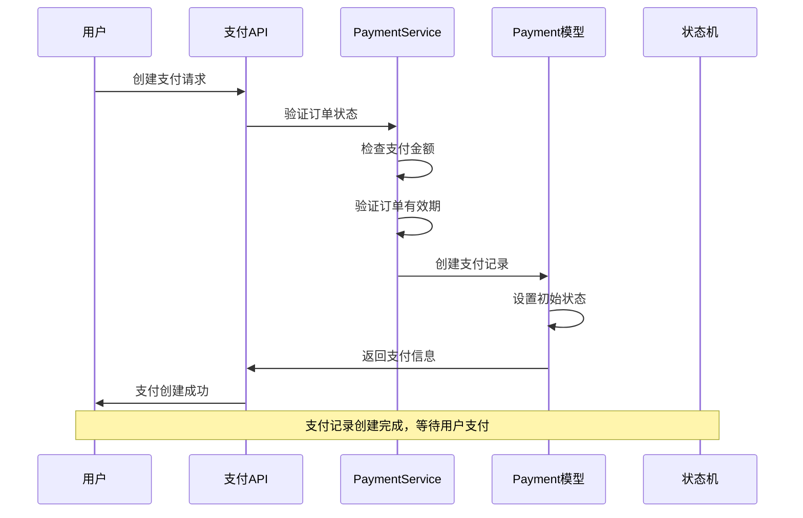

**图表来源**
- [views.py](file://backend/orders/views.py#L812-L932)
- [payment_service.py](file://backend/orders/payment_service.py#L207-L242)

### 支付状态更新流程

支付状态更新通过状态机确保业务逻辑的正确性：

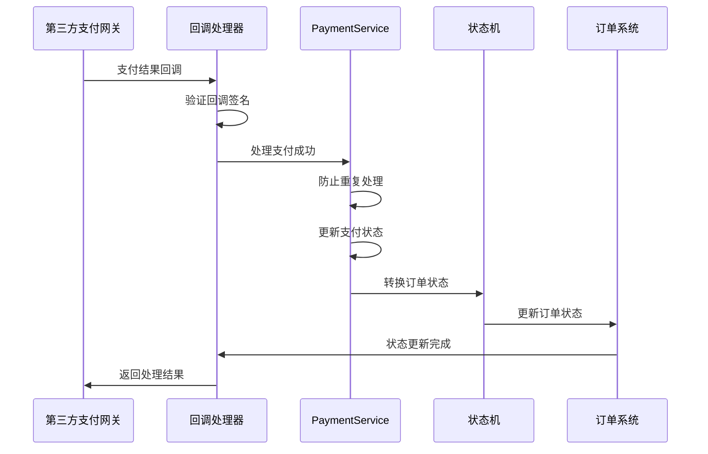

**图表来源**
- [views.py](file://backend/orders/views.py#L1133-L1296)
- [payment_service.py](file://backend/orders/payment_service.py#L106-L204)

**节来源**
- [views.py](file://backend/orders/views.py#L812-L932)
- [payment_service.py](file://backend/orders/payment_service.py#L106-L204)

## 支付服务核心功能

### 签名验证机制

支付服务提供了强大的签名验证功能，确保回调数据的真实性和完整性：

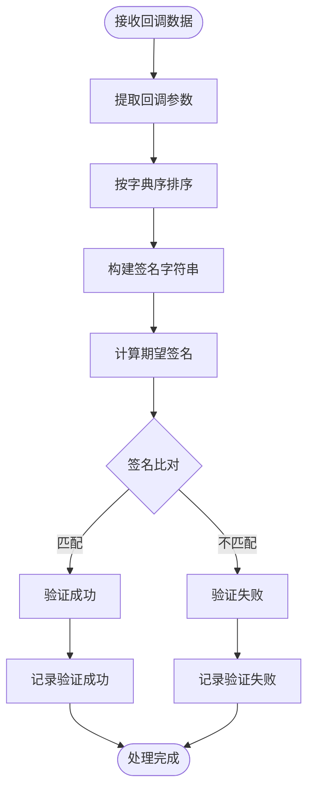

**图表来源**
- [payment_service.py](file://backend/orders/payment_service.py#L31-L68)

#### 签名验证实现要点

1. **HMAC-SHA256算法**：使用标准的安全哈希算法
2. **字典序排序**：确保签名计算的一致性
3. **恒定时间比较**：防止时序攻击
4. **多支付提供商支持**：微信支付、支付宝等

**节来源**
- [payment_service.py](file://backend/orders/payment_service.py#L31-L68)

### 支付金额校验

金额校验是防止支付金额篡改的重要安全措施：

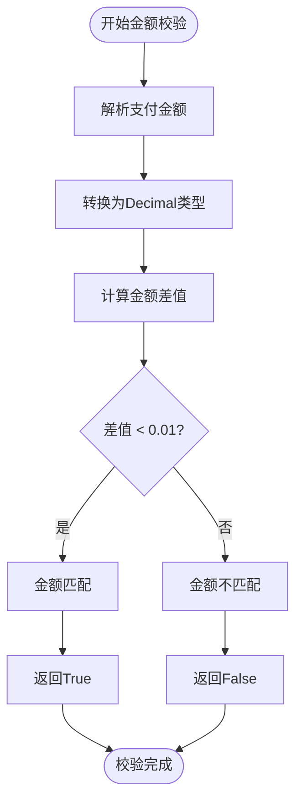

**图表来源**
- [payment_service.py](file://backend/orders/payment_service.py#L71-L103)

#### 校验规则

- **精度容差**：允许0.01元的误差范围
- **类型转换**：自动处理字符串到Decimal的转换
- **异常处理**：捕获并记录金额校验异常

**节来源**
- [payment_service.py](file://backend/orders/payment_service.py#L71-L103)

### 防重复支付处理

系统通过多种机制防止重复支付处理：

1. **状态检查**：防止对已成功的支付再次处理
2. **时间窗口**：检查支付记录的有效期
3. **事务锁定**：使用数据库锁防止并发处理

**节来源**
- [payment_service.py](file://backend/orders/payment_service.py#L143-L160)

## 第三方支付网关集成

### 支付回调处理架构

系统支持多种支付提供商的回调处理，通过统一的接口适配不同的支付网关：

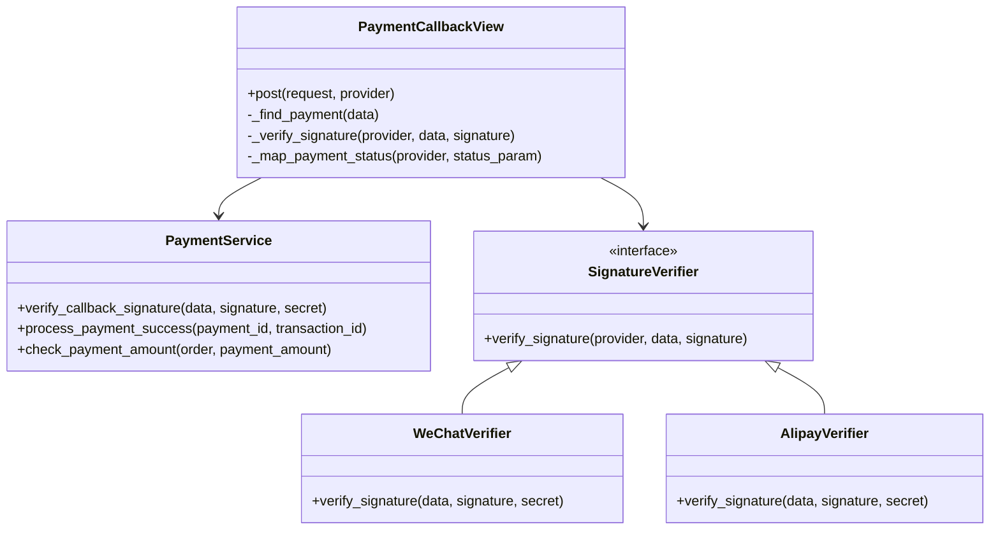

**图表来源**
- [views.py](file://backend/orders/views.py#L1133-L1408)
- [payment_service.py](file://backend/orders/payment_service.py#L30-L68)

### 支付状态映射

不同支付提供商的状态值需要映射到统一的支付状态：

| 支付提供商 | 原始状态 | 映射状态 | 说明 |
|------------|----------|----------|------|
| Mock | `succeeded` | `succeeded` | 模拟支付成功 |
| Mock | `failed` | `failed` | 模拟支付失败 |
| Mock | `cancelled` | `cancelled` | 模拟支付取消 |
| WeChat | `SUCCESS` | `succeeded` | 微信支付成功 |
| WeChat | 其他 | `failed` | 微信支付失败 |
| Alipay | `trade_success` | `succeeded` | 支付宝支付成功 |
| Alipay | `trade_closed` | `cancelled` | 支付宝支付关闭 |
| Alipay | 其他 | `failed` | 支付宝支付失败 |

**节来源**
- [views.py](file://backend/orders/views.py#L1369-L1407)

### 签名验证实现

不同支付提供商使用不同的签名验证方法：

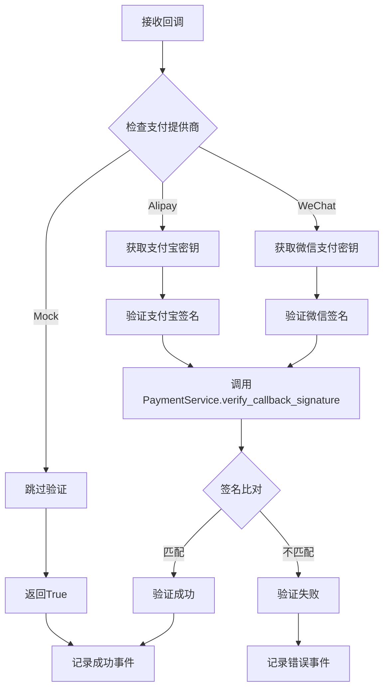

**图表来源**
- [views.py](file://backend/orders/views.py#L1334-L1367)

**节来源**
- [views.py](file://backend/orders/views.py#L1334-L1367)

## 支付超时自动取消机制

### 自动取消命令

系统提供了自动取消未支付订单的功能，通过定时任务定期清理超时订单：

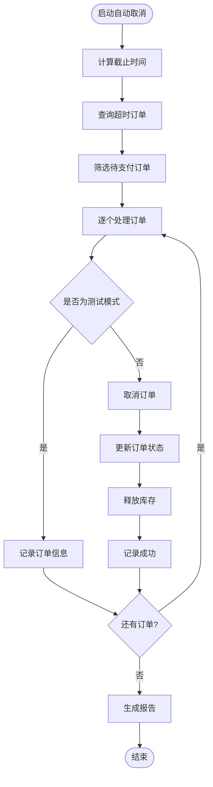

**图表来源**
- [cancel_unpaid_orders.py](file://backend/orders/management/commands/cancel_unpaid_orders.py#L41-L117)

### 超时配置

| 参数 | 默认值 | 说明 |
|------|--------|------|
| 超时时间 | 30分钟 | 支付超时时间阈值 |
| 批量处理 | 无限制 | 单次处理的订单数量 |
| 测试模式 | false | 是否启用测试模式 |
| 日志级别 | INFO | 记录的日志级别 |

**节来源**
- [cancel_unpaid_orders.py](file://backend/orders/management/commands/cancel_unpaid_orders.py#L28-L40)

### 状态转换处理

超时订单的取消会触发完整的状态转换流程：

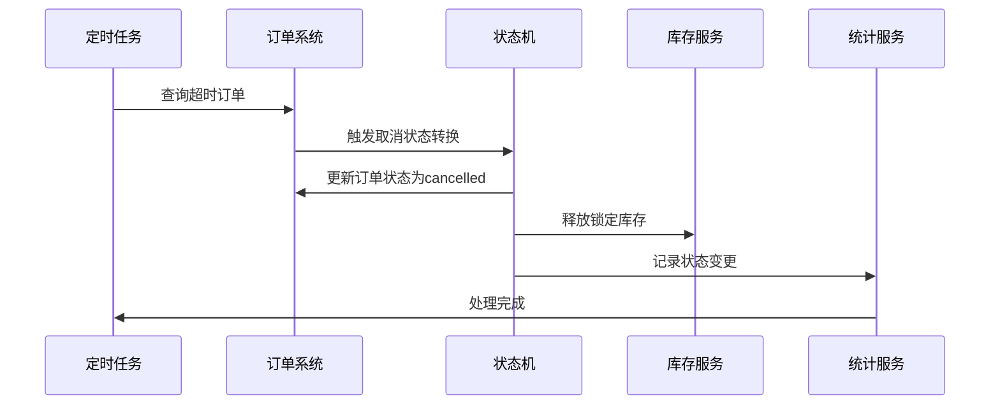

**图表来源**
- [cancel_unpaid_orders.py](file://backend/orders/management/commands/cancel_unpaid_orders.py#L99-L117)

**节来源**
- [cancel_unpaid_orders.py](file://backend/orders/management/commands/cancel_unpaid_orders.py#L41-L117)

## 支付金额校验机制

### 校验流程

支付金额校验是防止支付金额篡改的关键安全措施：

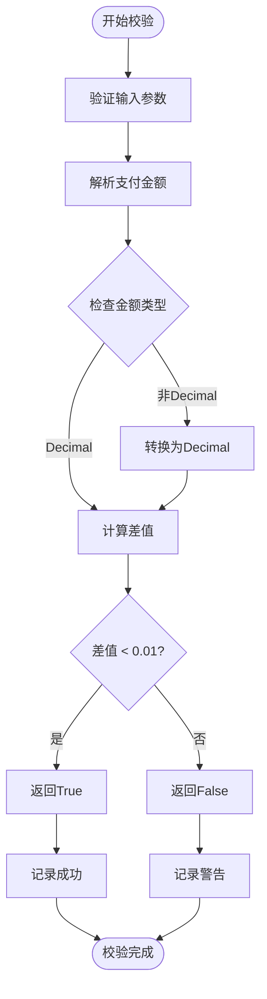

**图表来源**
- [payment_service.py](file://backend/orders/payment_service.py#L71-L103)

### 校验规则详解

1. **精度控制**：允许0.01元的浮点数误差
2. **类型安全**：确保金额为Decimal类型
3. **异常处理**：捕获并记录校验异常
4. **性能优化**：避免不必要的类型转换

**节来源**
- [payment_service.py](file://backend/orders/payment_service.py#L71-L103)

## 支付流程时序图

### 完整支付流程

以下是完整的支付生命周期时序图：

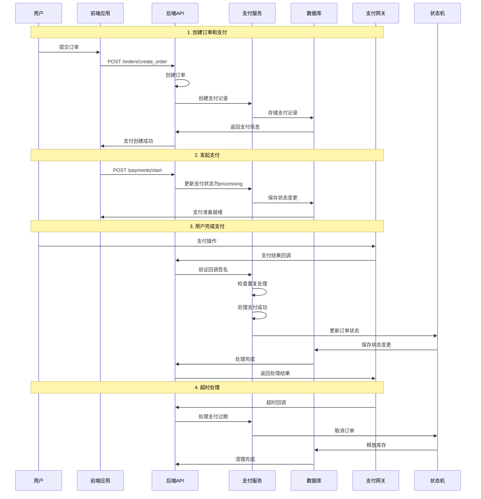

**图表来源**
- [views.py](file://backend/orders/views.py#L812-L932)
- [views.py](file://backend/orders/views.py#L1133-L1296)
- [payment_service.py](file://backend/orders/payment_service.py#L106-L204)

### 异常处理流程

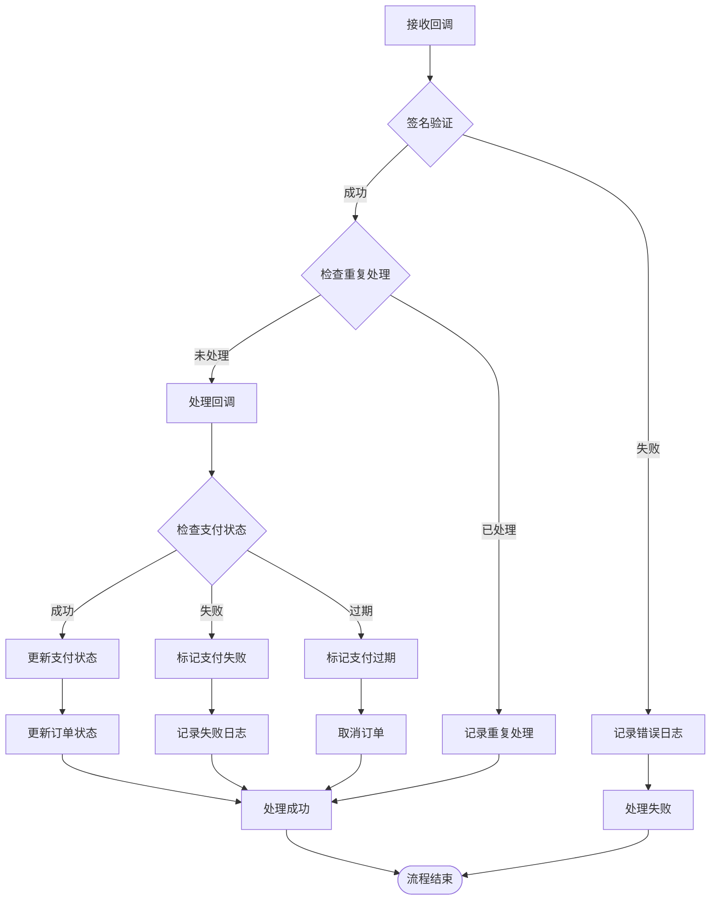

**图表来源**
- [views.py](file://backend/orders/views.py#L1180-L1296)

## 安全防护措施

### 签名验证安全

1. **HMAC-SHA256算法**：使用强加密算法确保签名安全性
2. **恒定时间比较**：防止时序攻击
3. **参数排序**：确保签名计算的一致性
4. **密钥管理**：敏感密钥存储在配置文件中

### 防重复支付

1. **状态检查**：防止对已成功的支付再次处理
2. **数据库锁**：使用select_for_update防止并发处理
3. **幂等性设计**：确保重复请求的安全处理
4. **事件日志**：记录重复处理尝试

### 支付金额保护

1. **金额校验**：防止支付金额篡改
2. **精度控制**：允许合理的浮点数误差
3. **类型安全**：确保金额为Decimal类型
4. **异常处理**：捕获并记录校验异常

### 超时安全保障

1. **自动清理**：定时清理超时订单
2. **库存释放**：及时释放锁定库存
3. **状态同步**：确保状态变更的一致性
4. **审计日志**：记录所有状态变更

**节来源**
- [payment_service.py](file://backend/orders/payment_service.py#L31-L103)
- [views.py](file://backend/orders/views.py#L1180-L1207)

## 故障处理与监控

### 日志记录策略

系统提供了完整的日志记录机制，涵盖支付全流程：

| 日志级别 | 记录内容 | 触发条件 |
|----------|----------|----------|
| DEBUG | 详细的操作步骤 | 开发环境 |
| INFO | 关键业务操作 | 正常业务流程 |
| WARNING | 异常情况提醒 | 重复处理、超时等 |
| ERROR | 错误异常 | 签名验证失败、状态转换失败等 |

### 监控指标

1. **支付成功率**：成功支付占总支付的比例
2. **支付超时率**：超时支付占总支付的比例
3. **回调成功率**：成功处理回调的比例
4. **异常频率**：各类异常的发生频率

### 故障恢复机制

1. **重试机制**：对临时性错误提供重试机会
2. **人工干预**：提供手动处理异常订单的接口
3. **数据修复**：提供数据一致性检查和修复工具
4. **告警通知**：异常情况及时通知相关人员

### 性能优化

1. **数据库索引**：为常用查询字段建立索引
2. **事务控制**：合理使用事务减少锁竞争
3. **缓存策略**：缓存频繁访问的数据
4. **批量处理**：对大量数据采用批量处理

**节来源**
- [payment_service.py](file://backend/orders/payment_service.py#L245-L292)
- [views.py](file://backend/orders/views.py#L1171-L1197)

## 总结

电小二商城的支付生命周期管理系统通过以下核心特性确保了支付流程的安全、可靠和高效：

### 核心优势

1. **完整的生命周期管理**：从支付创建到状态更新的全流程覆盖
2. **强大的安全防护**：多重验证机制防止各种安全威胁
3. **灵活的扩展性**：支持多种支付方式和未来扩展
4. **完善的监控体系**：全面的日志记录和异常处理机制

### 最佳实践

1. **状态机模式**：确保状态转换的合法性和一致性
2. **事务处理**：保证支付状态变更的原子性
3. **幂等设计**：支持重复请求的安全处理
4. **异步处理**：提高系统响应性能

### 未来改进方向

1. **支付方式扩展**：支持更多支付渠道
2. **智能风控**：引入机器学习进行风险识别
3. **实时对账**：与第三方支付平台实时对账
4. **用户体验优化**：简化支付流程，提升用户满意度

通过这套完整的支付生命周期管理系统，电小二商城能够为用户提供安全、便捷、可靠的支付体验，同时确保商家的交易安全和运营效率。