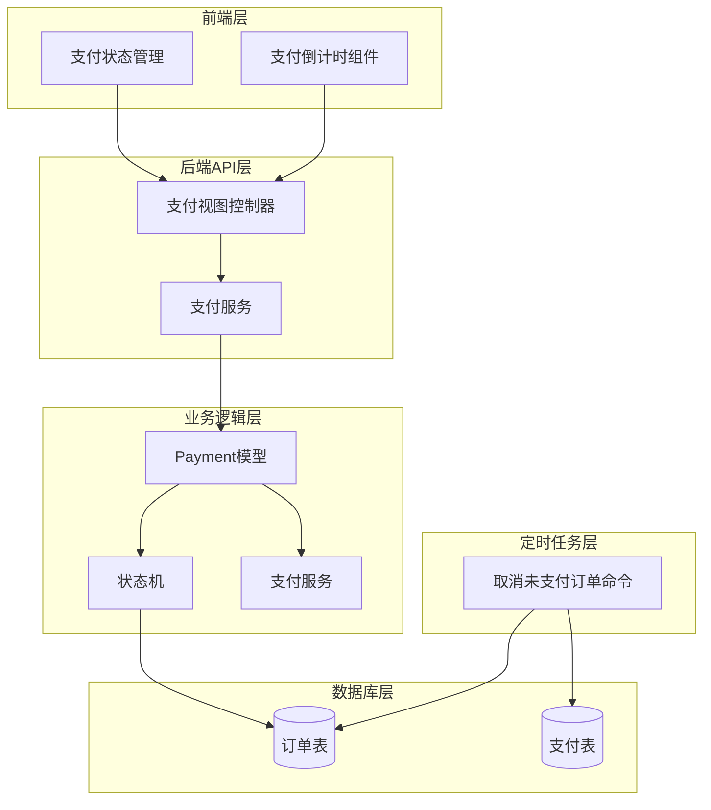
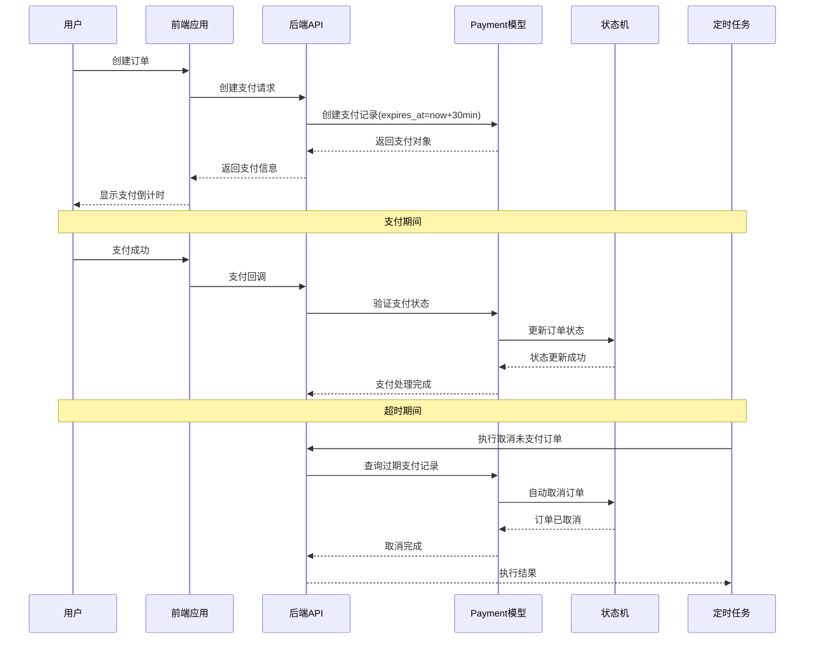
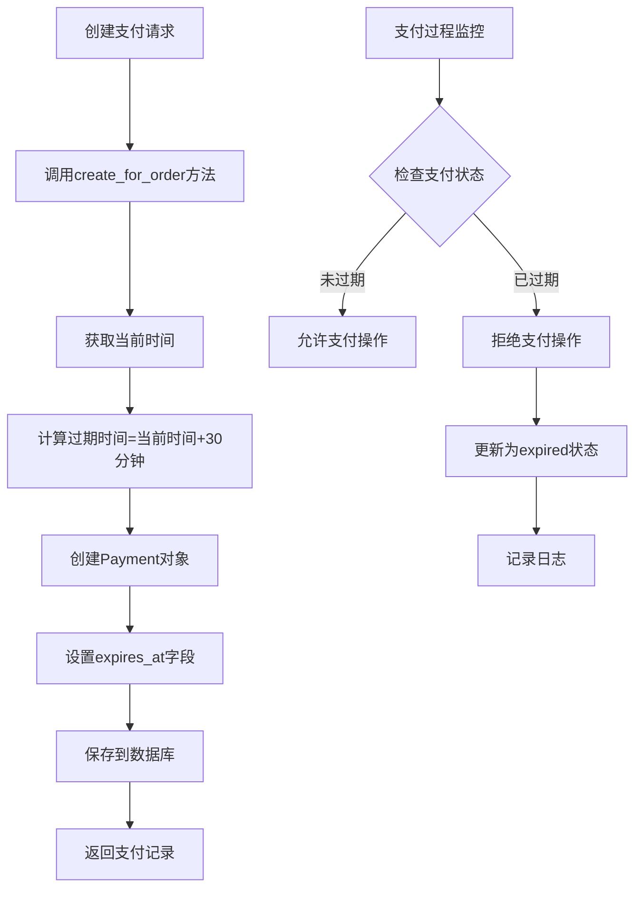
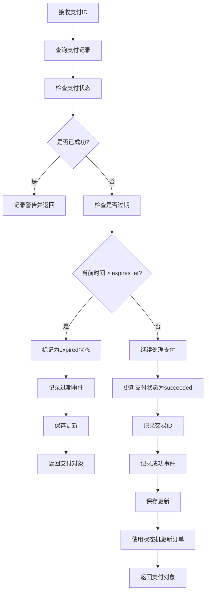
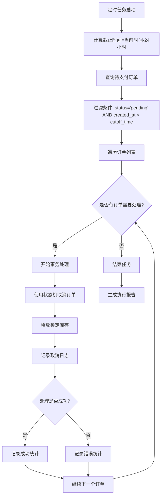
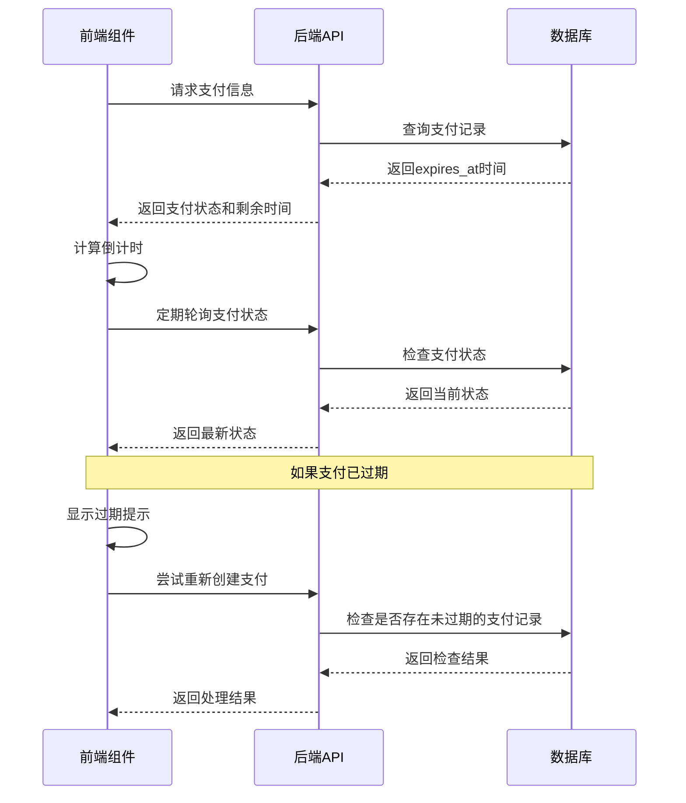
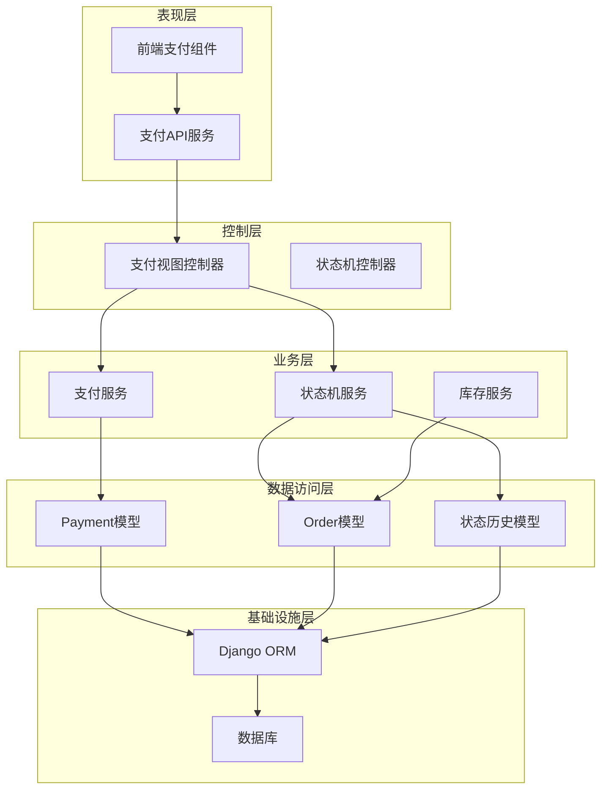

# 支付超时与自动取消

<cite>
**本文档中引用的文件**
- [backend/orders/models.py](file://backend/orders/models.py)
- [backend/orders/payment_service.py](file://backend/orders/payment_service.py)
- [backend/orders/management/commands/cancel_unpaid_orders.py](file://backend/orders/management/commands/cancel_unpaid_orders.py)
- [backend/orders/state_machine.py](file://backend/orders/state_machine.py)
- [backend/orders/views.py](file://backend/orders/views.py)
- [frontend/src/services/payment.ts](file://frontend/src/services/payment.ts)
</cite>

## 目录
1. [概述](#概述)
2. [项目结构](#项目结构)
3. [核心组件](#核心组件)
4. [架构概览](#架构概览)
5. [详细组件分析](#详细组件分析)
6. [依赖关系分析](#依赖关系分析)
7. [性能考虑](#性能考虑)
8. [故障排除指南](#故障排除指南)
9. [结论](#结论)

## 概述

支付超时管理机制是电商系统中的关键功能，确保未完成的订单能够及时清理，释放库存资源，并维护良好的用户体验。本系统实现了多层次的超时控制机制，包括前端倒计时、后端支付记录超时、以及定时任务自动取消等功能。

系统采用30分钟的支付有效期，通过Payment模型的expires_at字段精确控制，并结合状态机模式确保状态转换的合法性。同时，提供了24小时的订单有效期保护，防止长期未支付的订单占用系统资源。

## 项目结构

支付超时管理机制涉及多个模块的协作：

**图表来源**
- [backend/orders/views.py](file://backend/orders/views.py#L1-L50)
- [backend/orders/models.py](file://backend/orders/models.py#L186-L235)
- [backend/orders/state_machine.py](file://backend/orders/state_machine.py#L1-L50)

## 核心组件

### Payment模型 - 支付记录核心

Payment模型是支付超时管理的核心实体，包含以下关键字段：

- **expires_at**: 支付有效期截止时间，设置为创建时间加30分钟
- **status**: 支付状态，包括init、processing、succeeded、failed、cancelled、expired
- **logs**: 支付事件日志，记录整个支付生命周期的关键节点

### 支付服务 - 业务逻辑处理

PaymentService类提供支付相关的业务逻辑，包括：
- 支付回调签名验证
- 支付金额验证
- 支付成功处理（process_payment_success）
- 支付创建验证

### 状态机 - 状态转换控制

OrderStateMachine确保订单状态转换的合法性，防止非法状态跳转。

**章节来源**
- [backend/orders/models.py](file://backend/orders/models.py#L186-L235)
- [backend/orders/payment_service.py](file://backend/orders/payment_service.py#L20-L100)
- [backend/orders/state_machine.py](file://backend/orders/state_machine.py#L25-L100)

## 架构概览

支付超时管理系统采用分层架构设计，确保各层职责清晰，便于维护和扩展：

**图表来源**
- [backend/orders/views.py](file://backend/orders/views.py#L190-L195)
- [backend/orders/payment_service.py](file://backend/orders/payment_service.py#L106-L204)
- [backend/orders/management/commands/cancel_unpaid_orders.py](file://backend/orders/management/commands/cancel_unpaid_orders.py#L41-L97)

## 详细组件分析

### Payment模型的expires_at字段设置

Payment模型在创建支付记录时，通过create_for_order方法设置30分钟的有效期：

**图表来源**
- [backend/orders/models.py](file://backend/orders/models.py#L223-L234)

expires_at字段的设置逻辑确保了：
- **精确性**: 使用timezone.now()获取准确的时间戳
- **灵活性**: ttl_minutes参数允许动态调整有效期
- **持久化**: 存储在数据库中，确保跨会话的一致性

**章节来源**
- [backend/orders/models.py](file://backend/orders/models.py#L223-L234)

### process_payment_success方法的过期检查逻辑

process_payment_success方法实现了严格的过期检查机制：

**图表来源**
- [backend/orders/payment_service.py](file://backend/orders/payment_service.py#L106-L204)

过期检查的关键特性：
- **原子性**: 使用select_for_update()防止并发问题
- **完整性**: 检查支付状态和有效期双重保障
- **审计性**: 记录详细的过期日志

**章节来源**
- [backend/orders/payment_service.py](file://backend/orders/payment_service.py#L143-L161)

### cancel_unpaid_orders管理命令的自动取消机制

定时任务通过cancel_unpaid_orders命令实现自动取消未支付订单：

**图表来源**
- [backend/orders/management/commands/cancel_unpaid_orders.py](file://backend/orders/management/commands/cancel_unpaid_orders.py#L41-L97)

命令的配置选项：
- **timeout-minutes**: 支付超时时间，默认30分钟
- **dry-run**: 干运行模式，仅显示将要执行的操作

**章节来源**
- [backend/orders/management/commands/cancel_unpaid_orders.py](file://backend/orders/management/commands/cancel_unpaid_orders.py#L28-L40)

### 前端支付倒计时组件与后端超时机制的协同

前端组件通过轮询机制与后端保持同步：

**图表来源**
- [frontend/src/services/payment.ts](file://frontend/src/services/payment.ts#L1-L53)
- [backend/orders/views.py](file://backend/orders/views.py#L898-L913)

**章节来源**
- [frontend/src/services/payment.ts](file://frontend/src/services/payment.ts#L1-L53)
- [backend/orders/views.py](file://backend/orders/views.py#L898-L913)

## 依赖关系分析

支付超时管理系统的依赖关系呈现清晰的分层结构：

**图表来源**
- [backend/orders/views.py](file://backend/orders/views.py#L1-L50)
- [backend/orders/models.py](file://backend/orders/models.py#L186-L235)
- [backend/orders/state_machine.py](file://backend/orders/state_machine.py#L25-L100)

主要依赖关系：
- **视图层**依赖**服务层**提供业务逻辑
- **服务层**依赖**模型层**进行数据操作
- **状态机**确保**业务规则**的正确执行
- **定时任务**独立于**实时处理**，避免影响用户体验

**章节来源**
- [backend/orders/views.py](file://backend/orders/views.py#L1-L50)
- [backend/orders/models.py](file://backend/orders/models.py#L186-L235)
- [backend/orders/state_machine.py](file://backend/orders/state_machine.py#L25-L100)

## 性能考虑

支付超时管理系统的性能优化策略：

### 数据库查询优化
- **索引设计**: 在expires_at、status、created_at字段上建立复合索引
- **查询限制**: 使用select_for_update()减少锁竞争
- **批量处理**: 定时任务采用批量处理提高效率

### 缓存策略
- **支付状态缓存**: 缓存活跃支付记录的状态信息
- **订单状态缓存**: 缓存订单的最新状态以减少数据库查询

### 并发控制
- **乐观锁**: 使用版本号防止并发更新冲突
- **悲观锁**: 在关键业务流程中使用select_for_update()

## 故障排除指南

### 常见问题及解决方案

#### 支付超时处理异常
**问题描述**: 支付记录已过期但仍被处理
**排查步骤**:
1. 检查服务器时间同步
2. 验证expires_at字段的准确性
3. 确认process_payment_success方法的过期检查逻辑

**解决方案**: 
- 重新部署应用确保时间同步
- 手动更新过期支付记录的状态
- 检查日志确认过期检查触发时机

#### 定时任务执行失败
**问题描述**: cancel_unpaid_orders命令执行异常
**排查步骤**:
1. 检查数据库连接状态
2. 验证定时任务配置
3. 查看任务执行日志

**解决方案**:
- 重启定时任务服务
- 手动执行命令进行测试
- 检查数据库权限设置

#### 前端倒计时不同步
**问题描述**: 前端显示的倒计时与后端不一致
**排查步骤**:
1. 检查客户端时间设置
2. 验证API响应时间
3. 确认网络延迟影响

**解决方案**:
- 实现客户端时间校准机制
- 增加重试机制处理网络异常
- 提供手动刷新功能

**章节来源**
- [backend/orders/payment_service.py](file://backend/orders/payment_service.py#L143-L161)
- [backend/orders/management/commands/cancel_unpaid_orders.py](file://backend/orders/management/commands/cancel_unpaid_orders.py#L41-L97)

## 结论

支付超时管理机制是电商系统的重要组成部分，本系统通过多层次的设计实现了可靠的超时控制：

### 主要优势
- **可靠性**: 多重检查机制确保超时处理的准确性
- **可维护性**: 清晰的分层架构便于代码维护和扩展
- **可观测性**: 完整的日志记录支持问题追踪和性能分析
- **用户体验**: 前后端协同确保超时提醒的及时性和准确性

### 改进建议
- **监控告警**: 增加对超时处理的实时监控和告警
- **自动化测试**: 完善单元测试和集成测试覆盖
- **性能优化**: 考虑引入消息队列处理大量并发请求
- **容错机制**: 增强系统在异常情况下的恢复能力

通过持续的优化和改进，该支付超时管理机制能够为用户提供稳定可靠的支付体验，同时确保系统资源的高效利用。