# 地址CRUD操作

<cite>
**本文档引用的文件**
- [models.py](file://backend/users/models.py)
- [views.py](file://backend/users/views.py)
- [serializers.py](file://backend/users/serializers.py)
- [address.ts](file://frontend/src/services/address.ts)
- [address-parser.py](file://backend/common/address_parser.py)
- [address-list/index.tsx](file://frontend/src/pages/address-list/index.tsx)
- [address-edit/index.tsx](file://frontend/src/pages/address-edit/index.tsx)
- [urls.py](file://backend/users/urls.py)
</cite>

## 目录
1. [简介](#简介)
2. [项目结构](#项目结构)
3. [核心组件](#核心组件)
4. [架构概览](#架构概览)
5. [详细组件分析](#详细组件分析)
6. [依赖关系分析](#依赖关系分析)
7. [性能考虑](#性能考虑)
8. [故障排除指南](#故障排除指南)
9. [结论](#结论)

## 简介

本文档详细说明了电小二小程序项目中地址管理系统的CRUD（创建、读取、更新、删除）操作实现。该系统采用Django REST Framework构建，提供了完整的地址管理功能，包括智能地址解析、默认地址管理和前后端交互。

地址管理系统的核心特点：
- 基于用户的身份验证和授权控制
- 智能地址解析和验证
- 默认地址的自动管理
- 完整的RESTful API接口
- 前后端分离的架构设计

## 项目结构

地址管理系统的文件组织结构如下：

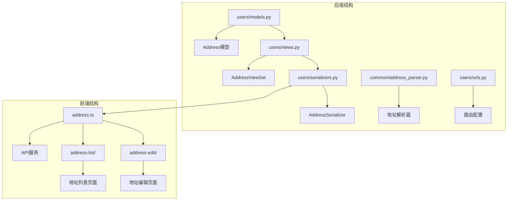

**图表来源**
- [models.py](file://backend/users/models.py#L77-L95)
- [views.py](file://backend/users/views.py#L287-L346)
- [serializers.py](file://backend/users/serializers.py#L56-L92)

**章节来源**
- [models.py](file://backend/users/models.py#L1-L95)
- [views.py](file://backend/users/views.py#L1-L460)
- [serializers.py](file://backend/users/serializers.py#L1-L92)

## 核心组件

### Address模型

Address模型定义了收货地址的数据结构，包含以下字段：

| 字段名 | 类型 | 约束 | 描述 |
|--------|------|------|------|
| id | BigAutoField | 主键 | 地址唯一标识符 |
| user | ForeignKey | 外键关联 | 关联到User模型，建立一对多关系 |
| contact_name | CharField | 最大长度50 | 联系人姓名 |
| phone | CharField | 最大长度20 | 联系电话号码 |
| province | CharField | 最大长度20 | 省份名称 |
| city | CharField | 最大长度20 | 城市名称 |
| district | CharField | 最大长度20 | 区县名称 |
| detail | CharField | 最大长度200 | 详细地址信息 |
| is_default | BooleanField | 默认False | 是否为默认地址 |
| created_at | DateTimeField | 自动生成 | 地址创建时间 |

### AddressViewSet

AddressViewSet继承自ModelViewSet，提供了标准的RESTful接口：

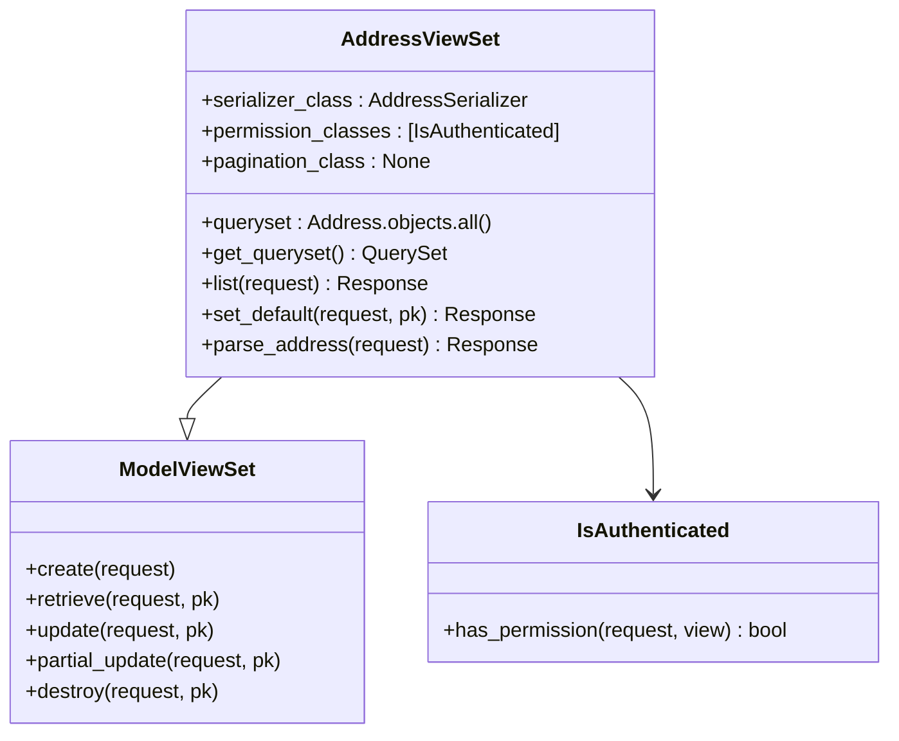

**图表来源**
- [views.py](file://backend/users/views.py#L287-L346)

**章节来源**
- [models.py](file://backend/users/models.py#L77-L95)
- [views.py](file://backend/users/views.py#L287-L346)

## 架构概览

地址管理系统的整体架构采用分层设计：

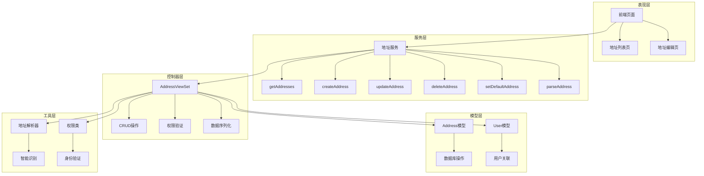

**图表来源**
- [address.ts](file://frontend/src/services/address.ts#L1-L44)
- [views.py](file://backend/users/views.py#L287-L346)
- [models.py](file://backend/users/models.py#L77-L95)

## 详细组件分析

### Address模型字段定义

Address模型的每个字段都有明确的用途和约束：

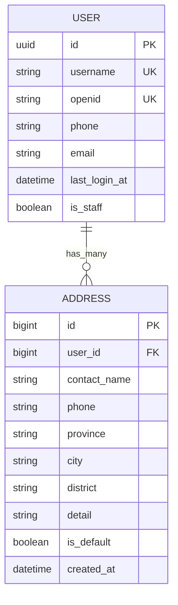

**图表来源**
- [models.py](file://backend/users/models.py#L31-L95)

### AddressSerializer序列化器

AddressSerializer负责数据的序列化和反序列化，包含特殊的字段处理逻辑：

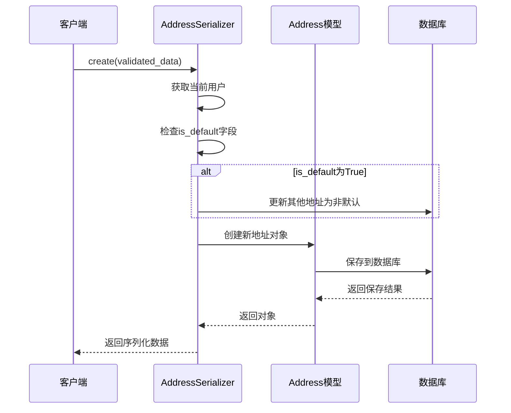

**图表来源**
- [serializers.py](file://backend/users/serializers.py#L78-L91)

### AddressViewSet权限控制

AddressViewSet使用IsAuthenticated权限类确保用户只能操作自己的地址数据：

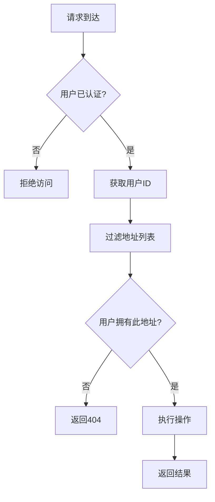

**图表来源**
- [views.py](file://backend/users/views.py#L302-L309)

### get_queryset方法排序逻辑

get_queryset方法实现了按默认地址优先的排序逻辑：

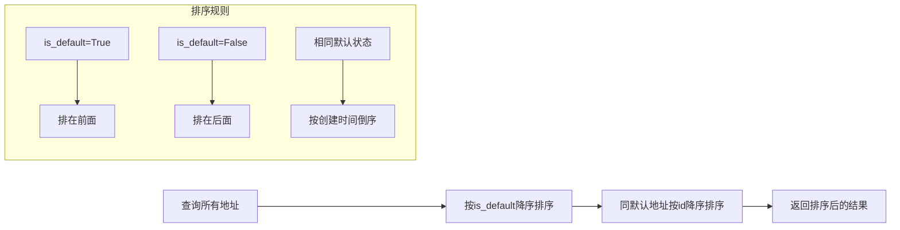

**图表来源**
- [views.py](file://backend/users/views.py#L302-L303)

### 前后端交互流程

#### 获取地址列表

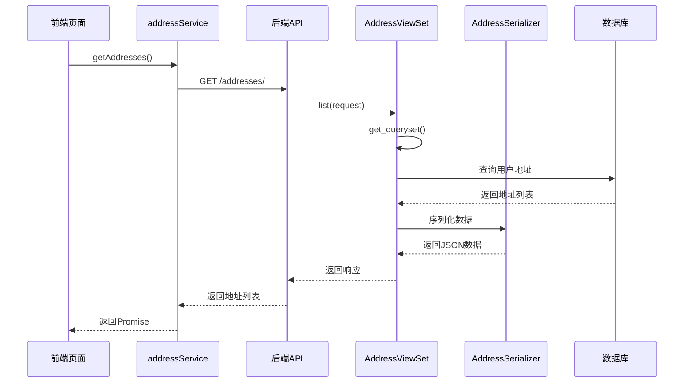

**图表来源**
- [address.ts](file://frontend/src/services/address.ts#L6-L8)
- [views.py](file://backend/users/views.py#L305-L309)

#### 创建新地址

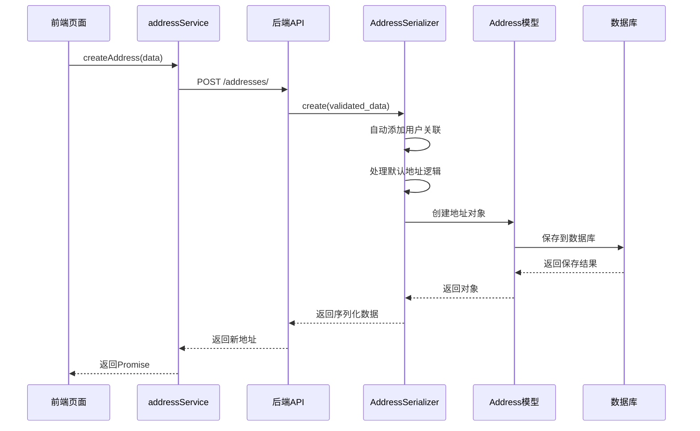

**图表来源**
- [address.ts](file://frontend/src/services/address.ts#L11-L13)
- [serializers.py](file://backend/users/serializers.py#L78-L84)

#### 更新地址

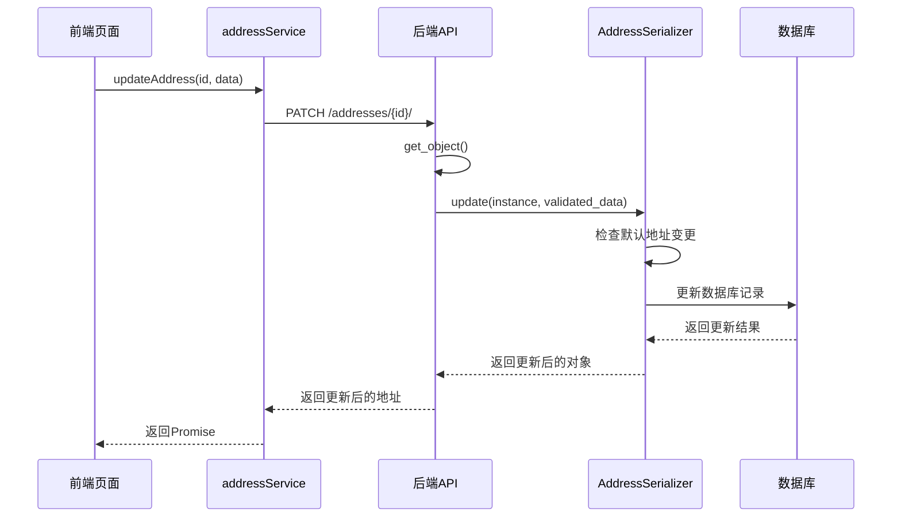

**图表来源**
- [address.ts](file://frontend/src/services/address.ts#L16-L18)
- [serializers.py](file://backend/users/serializers.py#L86-L91)

#### 删除地址

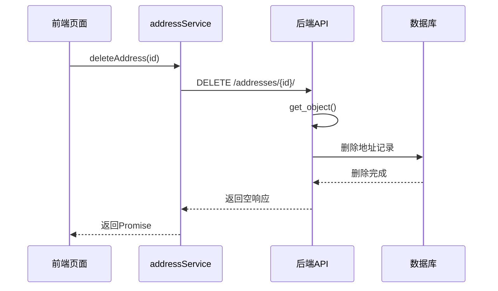

**图表来源**
- [address.ts](file://frontend/src/services/address.ts#L21-L23)

### 地址智能解析功能

地址智能解析功能通过address_parser模块实现：

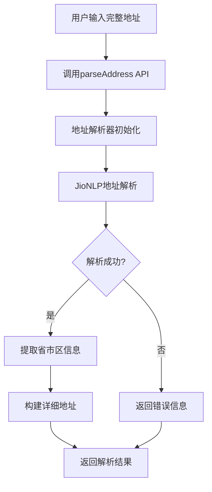

**图表来源**
- [address-parser.py](file://backend/common/address_parser.py#L25-L107)

**章节来源**
- [serializers.py](file://backend/users/serializers.py#L56-L92)
- [views.py](file://backend/users/views.py#L287-L346)
- [address-parser.py](file://backend/common/address_parser.py#L1-L175)

## 依赖关系分析

地址管理系统的依赖关系图：

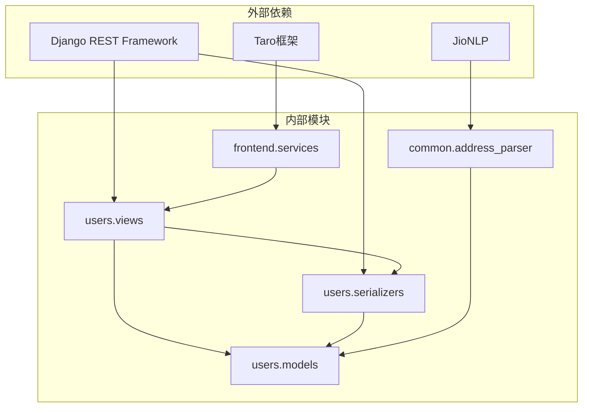

**图表来源**
- [models.py](file://backend/users/models.py#L1-L18)
- [views.py](file://backend/users/views.py#L1-L18)
- [serializers.py](file://backend/users/serializers.py#L1-L18)

**章节来源**
- [models.py](file://backend/users/models.py#L1-L95)
- [views.py](file://backend/users/views.py#L1-L460)
- [serializers.py](file://backend/users/serializers.py#L1-L92)

## 性能考虑

### 查询优化

1. **索引策略**：Address模型的user字段建立了外键索引，确保查询效率
2. **排序优化**：get_queryset方法使用复合索引（is_default, id）进行排序
3. **分页禁用**：由于地址数量通常较少，禁用了分页以简化前端处理

### 并发控制

1. **默认地址互斥**：通过数据库事务确保同一用户的默认地址唯一性
2. **原子操作**：创建和更新操作都是原子性的，避免数据不一致

### 缓存策略

虽然当前实现没有使用缓存，但可以考虑：
- 将常用地址信息缓存在Redis中
- 缓存地址解析结果以提高性能

## 故障排除指南

### 常见问题及解决方案

#### 1. 地址创建失败

**症状**：创建地址时返回400错误
**可能原因**：
- 必填字段缺失
- 手机号码格式不正确
- 省市区信息不完整

**解决方法**：
- 检查前端表单验证
- 查看后端序列化器验证错误
- 确保必填字段都已填写

#### 2. 默认地址设置冲突

**症状**：设置默认地址时出现异常
**可能原因**：
- 数据库并发更新导致的竞态条件
- 权限验证失败

**解决方法**：
- 使用数据库事务确保原子性
- 检查用户认证状态

#### 3. 地址解析失败

**症状**：智能识别功能返回错误
**可能原因**：
- JioNLP库初始化失败
- 输入地址格式不规范

**解决方法**：
- 检查JioNLP库是否正确安装
- 提供更规范的地址格式示例

**章节来源**
- [serializers.py](file://backend/users/serializers.py#L78-L91)
- [address-parser.py](file://backend/common/address_parser.py#L17-L23)

## 结论

电小二小程序的地址管理系统展现了现代Web应用的最佳实践：

### 技术亮点

1. **完整的CRUD实现**：基于Django REST Framework的标准实现
2. **智能地址解析**：集成JioNLP实现中文地址的自动识别
3. **严格的权限控制**：确保用户只能操作自己的数据
4. **前后端分离**：清晰的职责划分和接口设计
5. **用户体验优化**：智能解析和默认地址管理

### 架构优势

- **可扩展性**：模块化设计便于功能扩展
- **可维护性**：清晰的代码结构和文档
- **安全性**：完善的权限验证和数据验证
- **性能**：合理的查询优化和并发控制

### 改进建议

1. **添加单元测试**：为关键功能编写自动化测试
2. **引入缓存机制**：提高高频访问场景的性能
3. **增强错误处理**：提供更友好的错误提示
4. **完善日志记录**：便于问题排查和系统监控

该地址管理系统为电小二小程序提供了稳定可靠的地址管理基础，支撑了整个电商系统的正常运行。