# 收货地址管理逻辑

<cite>
**本文档引用的文件**
- [backend/users/models.py](file://backend/users/models.py)
- [backend/users/views.py](file://backend/users/views.py)
- [backend/users/serializers.py](file://backend/users/serializers.py)
- [backend/users/urls.py](file://backend/users/urls.py)
- [backend/common/address_parser.py](file://backend/common/address_parser.py)
- [frontend/src/services/address.ts](file://frontend/src/services/address.ts)
- [frontend/src/types/index.ts](file://frontend/src/types/index.ts)
- [frontend/src/pages/address-list/index.tsx](file://frontend/src/pages/address-list/index.tsx)
- [frontend/src/pages/address-edit/index.tsx](file://frontend/src/pages/address-edit/index.tsx)
</cite>

## 目录
1. [简介](#简介)
2. [项目架构概览](#项目架构概览)
3. [核心数据模型](#核心数据模型)
4. [地址视图集详解](#地址视图集详解)
5. [地址解析服务](#地址解析服务)
6. [序列化器设计](#序列化器设计)
7. [前端集成与最佳实践](#前端集成与最佳实践)
8. [权限控制与安全机制](#权限控制与安全机制)
9. [性能优化策略](#性能优化策略)
10. [故障排除指南](#故障排除指南)
11. [总结](#总结)

## 简介

收货地址管理系统是电商品台的核心功能模块之一，负责处理用户的收货地址信息管理。该系统采用前后端分离架构，后端基于Django REST framework构建，前端使用Taro框架开发跨平台小程序应用。系统提供了完整的地址管理功能，包括地址的创建、读取、更新、删除以及智能地址解析等核心业务逻辑。

## 项目架构概览

系统采用分层架构设计，主要包含以下层次：

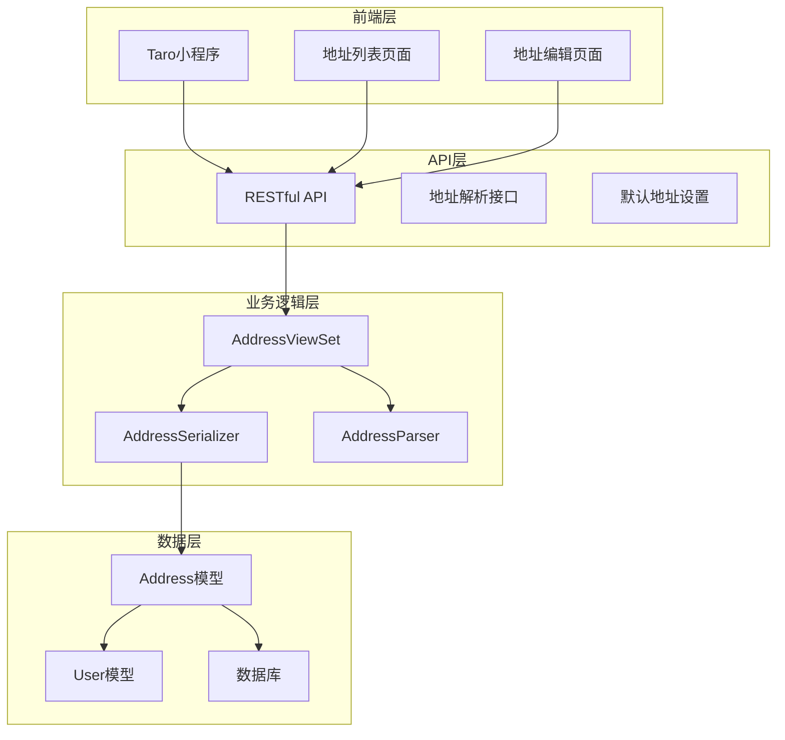
```mermaid
graph TB
subgraph "前端层"
A[Taro小程序]
B[地址列表页面]
C[地址编辑页面]
end
subgraph "API层"
D[RESTful API]
E[地址解析接口]
F[默认地址设置]
end
subgraph "业务逻辑层"
G[AddressViewSet]
H[AddressSerializer]
I[AddressParser]
end
subgraph "数据层"
J[Address模型]
K[User模型]
L[数据库]
end
A --> D
B --> D
C --> D
D --> G
G --> H
G --> I
H --> J
J --> K
J --> L
```

**图表来源**
- [backend/users/views.py](file://backend/users/views.py#L287-L386)
- [backend/users/models.py](file://backend/users/models.py#L77-L95)
- [frontend/src/pages/address-list/index.tsx](file://frontend/src/pages/address-list/index.tsx#L1-L135)

**章节来源**
- [backend/users/views.py](file://backend/users/views.py#L1-L460)
- [backend/users/models.py](file://backend/users/models.py#L1-L95)

## 核心数据模型

### Address模型设计

Address模型是地址管理的核心数据结构，采用了简洁而高效的字段设计：

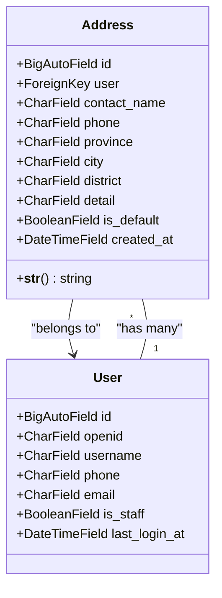
```mermaid
classDiagram
class Address {
+BigAutoField id
+ForeignKey user
+CharField contact_name
+CharField phone
+CharField province
+CharField city
+CharField district
+CharField detail
+BooleanField is_default
+DateTimeField created_at
+__str__() string
}
class User {
+BigAutoField id
+CharField openid
+CharField username
+CharField phone
+CharField email
+BooleanField is_staff
+DateTimeField last_login_at
}
Address --> User : "belongs to"
User "1" -- "*" Address : "has many"
```

**图表来源**
- [backend/users/models.py](file://backend/users/models.py#L77-L95)

#### 字段设计分析

| 字段名 | 类型 | 长度限制 | 描述 | 默认值 |
|--------|------|----------|------|--------|
| id | BigAutoField | - | 主键标识符 | 自增 |
| user | ForeignKey | - | 外键关联到User模型 | - |
| contact_name | CharField | 50 | 联系人姓名 | - |
| phone | CharField | 20 | 联系电话 | - |
| province | CharField | 20 | 省份名称 | - |
| city | CharField | 20 | 城市名称 | - |
| district | CharField | 20 | 区县名称 | - |
| detail | CharField | 200 | 详细地址 | - |
| is_default | BooleanField | - | 是否为默认地址 | False |
| created_at | DateTimeField | - | 创建时间 | 自动生成 |

#### 外键关联机制

Address模型通过`user`字段与User模型建立了一对多的关系，这种设计具有以下优势：

1. **数据完整性**：确保每个地址都明确归属于某个用户
2. **级联删除**：当用户被删除时，其所有地址也会自动清理
3. **查询效率**：外键索引提高了查询性能
4. **关系清晰**：便于维护用户与地址之间的业务关系

#### 默认地址标识机制

系统通过`is_default`字段实现默认地址管理，该字段具有以下特性：

- **唯一性约束**：同一用户只能有一个默认地址
- **自动转换**：设置新默认地址时，自动取消原有默认地址
- **查询优先级**：在地址列表中，默认地址排在首位

**章节来源**
- [backend/users/models.py](file://backend/users/models.py#L77-L95)

## 地址视图集详解

### AddressViewSet架构

AddressViewSet继承自Django REST framework的ModelViewSet，提供了完整的CRUD操作：

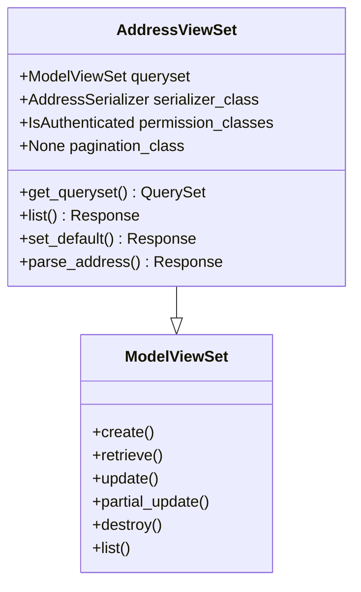
```mermaid
classDiagram
class AddressViewSet {
+ModelViewSet queryset
+AddressSerializer serializer_class
+IsAuthenticated permission_classes
+None pagination_class
+get_queryset() QuerySet
+list() Response
+set_default() Response
+parse_address() Response
}
class ModelViewSet {
+create()
+retrieve()
+update()
+partial_update()
+destroy()
+list()
}
AddressViewSet --|> ModelViewSet
```

**图表来源**
- [backend/users/views.py](file://backend/users/views.py#L287-L386)

### 标准RESTful操作

#### 1. 列表操作（GET /addresses/）

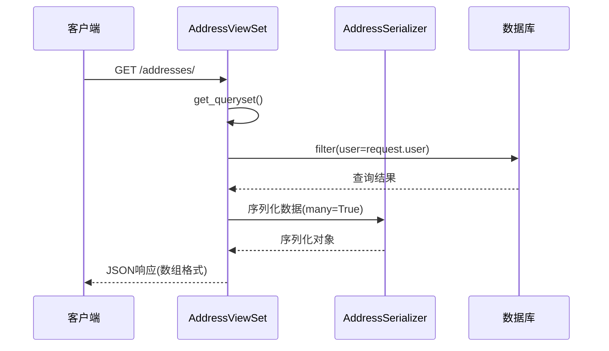
```mermaid
sequenceDiagram
participant Client as 客户端
participant ViewSet as AddressViewSet
participant Serializer as AddressSerializer
participant DB as 数据库
Client->>ViewSet : GET /addresses/
ViewSet->>ViewSet : get_queryset()
ViewSet->>DB : filter(user=request.user)
DB-->>ViewSet : 查询结果
ViewSet->>Serializer : 序列化数据(many=True)
Serializer-->>ViewSet : 序列化对象
ViewSet-->>Client : JSON响应(数组格式)
```

**图表来源**
- [backend/users/views.py](file://backend/users/views.py#L302-L309)

#### 2. 创建操作（POST /addresses/）

创建地址时，系统自动处理默认地址的逻辑：

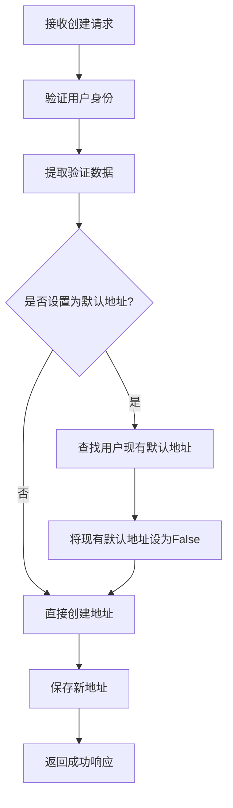
```mermaid
flowchart TD
A[接收创建请求] --> B[验证用户身份]
B --> C[提取验证数据]
C --> D{是否设置为默认地址?}
D --> |是| E[查找用户现有默认地址]
D --> |否| F[直接创建地址]
E --> G[将现有默认地址设为False]
G --> F
F --> H[保存新地址]
H --> I[返回成功响应]
```

**图表来源**
- [backend/users/views.py](file://backend/users/views.py#L302-L309)
- [backend/users/serializers.py](file://backend/users/serializers.py#L78-L91)

#### 3. 更新操作（PUT/PATCH /addresses/{id}/）

更新操作同样需要处理默认地址的逻辑：

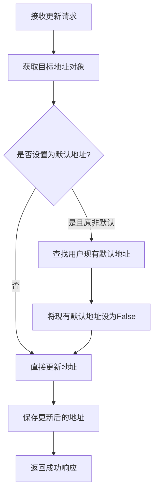
```mermaid
flowchart TD
A[接收更新请求] --> B[获取目标地址对象]
B --> C{是否设置为默认地址?}
C --> |是且原非默认| D[查找用户现有默认地址]
C --> |否| E[直接更新地址]
D --> F[将现有默认地址设为False]
F --> E
E --> G[保存更新后的地址]
G --> H[返回成功响应]
```

**图表来源**
- [backend/users/views.py](file://backend/users/views.py#L302-L309)
- [backend/users/serializers.py](file://backend/users/serializers.py#L86-L91)

### 自定义动作分析

#### set_default自定义动作

set_default动作实现了智能的默认地址设置逻辑：

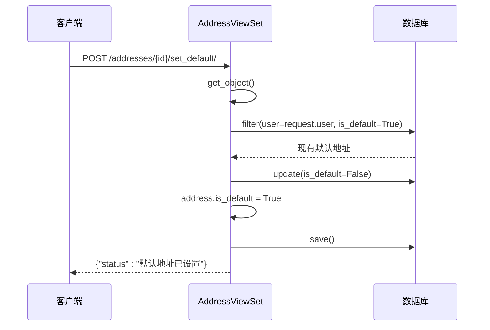
```mermaid
sequenceDiagram
participant Client as 客户端
participant ViewSet as AddressViewSet
participant DB as 数据库
Client->>ViewSet : POST /addresses/{id}/set_default/
ViewSet->>ViewSet : get_object()
ViewSet->>DB : filter(user=request.user, is_default=True)
DB-->>ViewSet : 现有默认地址
ViewSet->>DB : update(is_default=False)
ViewSet->>ViewSet : address.is_default = True
ViewSet->>DB : save()
ViewSet-->>Client : {"status" : "默认地址已设置"}
```

**图表来源**
- [backend/users/views.py](file://backend/users/views.py#L311-L319)

#### parse_address功能

parse_address动作提供了智能地址解析能力：

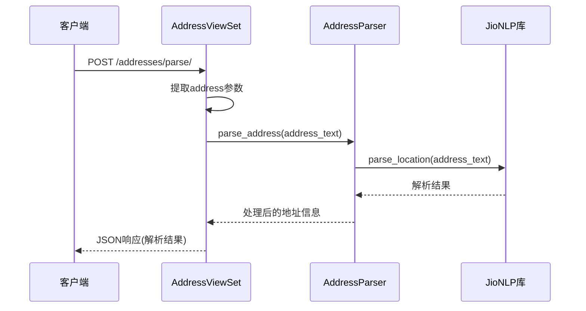
```mermaid
sequenceDiagram
participant Client as 客户端
participant ViewSet as AddressViewSet
participant Parser as AddressParser
participant JioNLP as JioNLP库
Client->>ViewSet : POST /addresses/parse/
ViewSet->>ViewSet : 提取address参数
ViewSet->>Parser : parse_address(address_text)
Parser->>JioNLP : parse_location(address_text)
JioNLP-->>Parser : 解析结果
Parser-->>ViewSet : 处理后的地址信息
ViewSet-->>Client : JSON响应(解析结果)
```

**图表来源**
- [backend/users/views.py](file://backend/users/views.py#L356-L385)
- [backend/common/address_parser.py](file://backend/common/address_parser.py#L25-L107)

**章节来源**
- [backend/users/views.py](file://backend/users/views.py#L287-L386)

## 地址解析服务

### AddressParser类设计

AddressParser类封装了复杂的地址解析逻辑，基于JioNLP自然语言处理库：

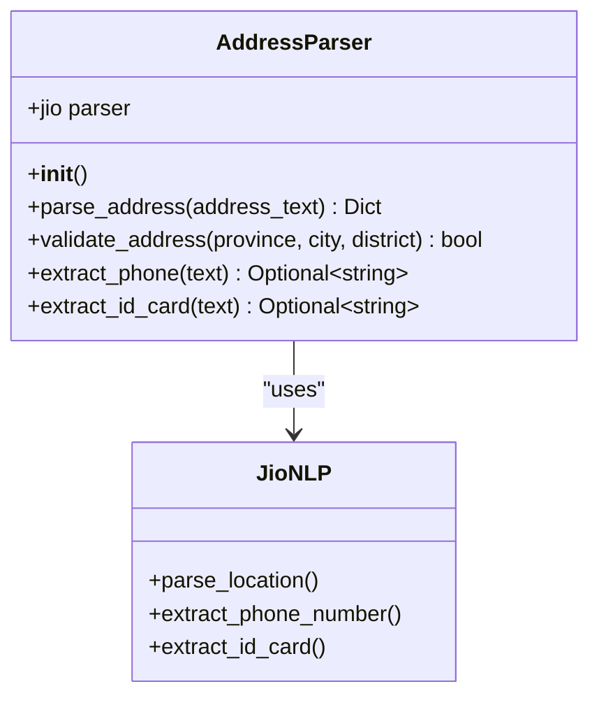
```mermaid
classDiagram
class AddressParser {
+jio parser
+__init__()
+parse_address(address_text) Dict
+validate_address(province, city, district) bool
+extract_phone(text) Optional~string~
+extract_id_card(text) Optional~string~
}
class JioNLP {
+parse_location()
+extract_phone_number()
+extract_id_card()
}
AddressParser --> JioNLP : "uses"
```

**图表来源**
- [backend/common/address_parser.py](file://backend/common/address_parser.py#L12-L175)

### 地址解析算法

parse_address方法实现了智能的地址拆分算法：

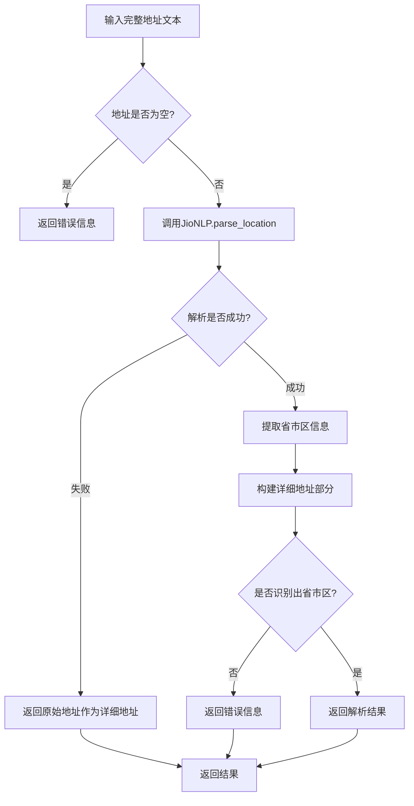
```mermaid
flowchart TD
A[输入完整地址文本] --> B{地址是否为空?}
B --> |是| C[返回错误信息]
B --> |否| D[调用JioNLP.parse_location]
D --> E{解析是否成功?}
E --> |失败| F[返回原始地址作为详细地址]
E --> |成功| G[提取省市区信息]
G --> H[构建详细地址部分]
H --> I{是否识别出省市区?}
I --> |否| J[返回错误信息]
I --> |是| K[返回解析结果]
F --> L[返回结果]
J --> L
K --> L
```

**图表来源**
- [backend/common/address_parser.py](file://backend/common/address_parser.py#L25-L107)

### 解析结果结构

地址解析返回标准化的结果结构：

| 字段名 | 类型 | 描述 |
|--------|------|------|
| success | boolean | 解析是否成功 |
| message | string | 状态消息 |
| province | string/null | 省份名称 |
| city | string/null | 城市名称 |
| district | string/null | 区县名称 |
| detail | string/null | 详细地址 |

**章节来源**
- [backend/common/address_parser.py](file://backend/common/address_parser.py#L1-L175)

## 序列化器设计

### AddressSerializer架构

AddressSerializer负责地址数据的序列化和反序列化：

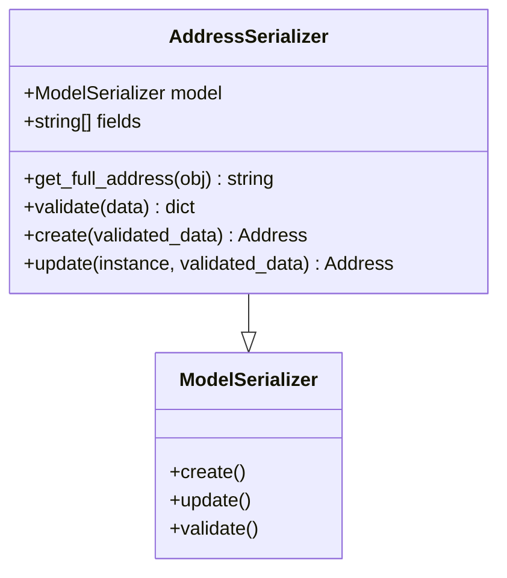
```mermaid
classDiagram
class AddressSerializer {
+ModelSerializer model
+string[] fields
+get_full_address(obj) string
+validate(data) dict
+create(validated_data) Address
+update(instance, validated_data) Address
}
class ModelSerializer {
+create()
+update()
+validate()
}
AddressSerializer --|> ModelSerializer
```

**图表来源**
- [backend/users/serializers.py](file://backend/users/serializers.py#L56-L92)

### 序列化器字段配置

AddressSerializer只暴露必要的字段，确保数据安全性和传输效率：

| 字段 | 方向 | 描述 |
|------|------|------|
| id | 只读 | 地址唯一标识符 |
| contact_name | 读写 | 联系人姓名 |
| phone | 读写 | 联系电话 |
| province | 读写 | 省份名称 |
| city | 读写 | 城市名称 |
| district | 读写 | 区县名称 |
| detail | 读写 | 详细地址 |
| is_default | 读写 | 是否默认地址 |

### 数据验证与处理

序列化器在创建和更新过程中自动处理默认地址逻辑：

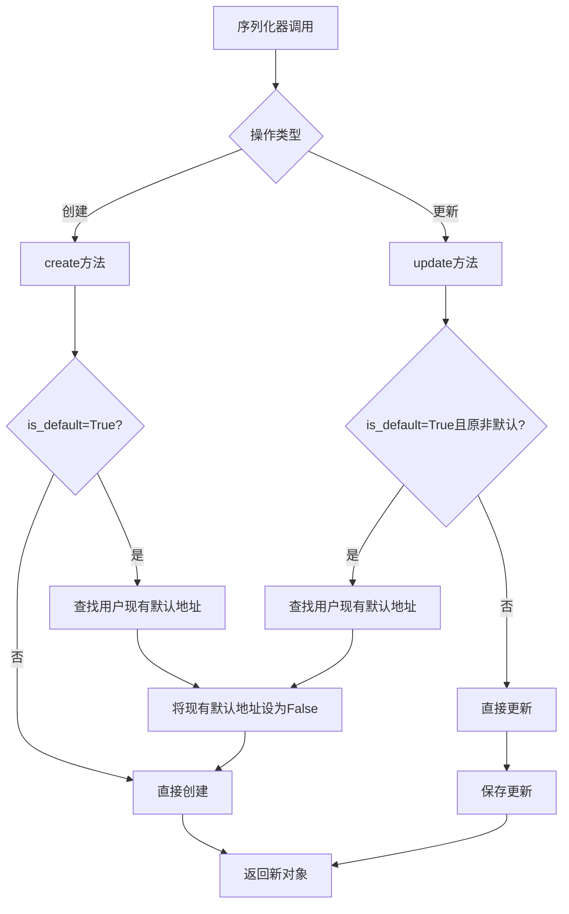
```mermaid
flowchart TD
A[序列化器调用] --> B{操作类型}
B --> |创建| C[create方法]
B --> |更新| D[update方法]
C --> E{is_default=True?}
D --> F{is_default=True且原非默认?}
E --> |是| G[查找用户现有默认地址]
E --> |否| H[直接创建]
F --> |是| I[查找用户现有默认地址]
F --> |否| J[直接更新]
G --> K[将现有默认地址设为False]
I --> K
K --> H
J --> L[保存更新]
H --> M[返回新对象]
L --> M
```

**图表来源**
- [backend/users/serializers.py](file://backend/users/serializers.py#L78-L91)

**章节来源**
- [backend/users/serializers.py](file://backend/users/serializers.py#L1-L92)

## 前端集成与最佳实践

### 前端服务层设计

前端通过addressService提供统一的API调用接口：

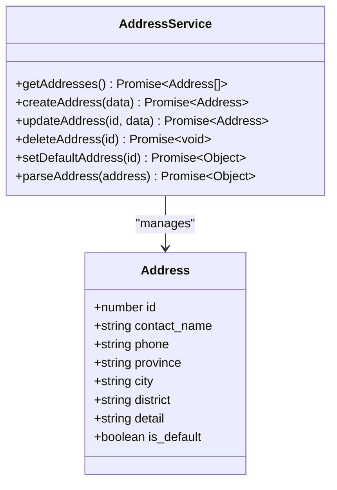
```mermaid
classDiagram
class AddressService {
+getAddresses() Promise~Address[]~
+createAddress(data) Promise~Address~
+updateAddress(id, data) Promise~Address~
+deleteAddress(id) Promise~void~
+setDefaultAddress(id) Promise~Object~
+parseAddress(address) Promise~Object~
}
class Address {
+number id
+string contact_name
+string phone
+string province
+string city
+string district
+string detail
+boolean is_default
}
AddressService --> Address : "manages"
```

**图表来源**
- [frontend/src/services/address.ts](file://frontend/src/services/address.ts#L1-L44)
- [frontend/src/types/index.ts](file://frontend/src/types/index.ts#L84-L93)

### 地址列表页面实现

地址列表页面展示了完整的地址管理界面：

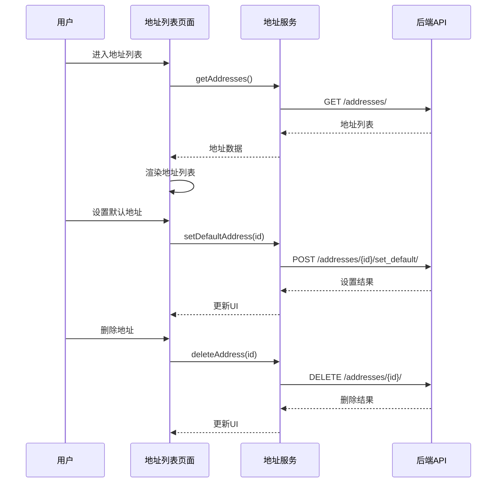
```mermaid
sequenceDiagram
participant User as 用户
participant Page as 地址列表页面
participant Service as 地址服务
participant API as 后端API
User->>Page : 进入地址列表
Page->>Service : getAddresses()
Service->>API : GET /addresses/
API-->>Service : 地址列表
Service-->>Page : 地址数据
Page->>Page : 渲染地址列表
User->>Page : 设置默认地址
Page->>Service : setDefaultAddress(id)
Service->>API : POST /addresses/{id}/set_default/
API-->>Service : 设置结果
Service-->>Page : 更新UI
User->>Page : 删除地址
Page->>Service : deleteAddress(id)
Service->>API : DELETE /addresses/{id}/
API-->>Service : 删除结果
Service-->>Page : 更新UI
```

**图表来源**
- [frontend/src/pages/address-list/index.tsx](file://frontend/src/pages/address-list/index.tsx#L1-L135)

### 地址编辑页面功能

地址编辑页面提供了智能地址解析功能：

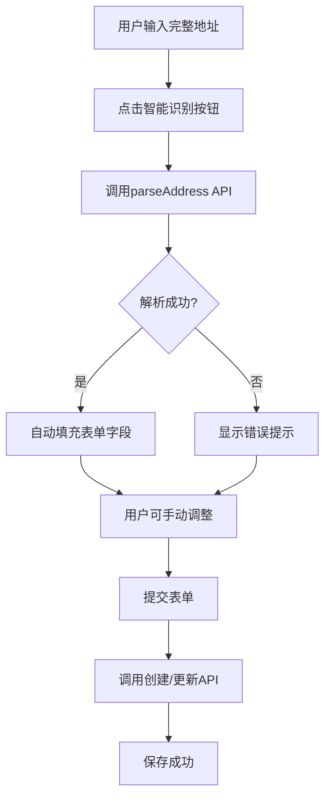
```mermaid
flowchart TD
A[用户输入完整地址] --> B[点击智能识别按钮]
B --> C[调用parseAddress API]
C --> D{解析成功?}
D --> |是| E[自动填充表单字段]
D --> |否| F[显示错误提示]
E --> G[用户可手动调整]
F --> G
G --> H[提交表单]
H --> I[调用创建/更新API]
I --> J[保存成功]
```

**图表来源**
- [frontend/src/pages/address-edit/index.tsx](file://frontend/src/pages/address-edit/index.tsx#L61-L98)

### 最佳实践建议

#### 1. 前端验证策略

- **实时验证**：在用户输入时进行基本格式验证
- **智能提示**：利用地址解析服务提供智能填充
- **用户体验**：提供清晰的错误提示和成功反馈

#### 2. 性能优化建议

- **缓存策略**：合理使用浏览器缓存和本地存储
- **懒加载**：地址列表采用虚拟滚动技术
- **批量操作**：支持批量设置默认地址和删除

#### 3. 错误处理机制

- **网络异常**：提供重试机制和离线支持
- **数据验证**：前端和后端双重验证
- **用户友好**：提供清晰的错误信息和解决建议

**章节来源**
- [frontend/src/services/address.ts](file://frontend/src/services/address.ts#L1-L44)
- [frontend/src/pages/address-list/index.tsx](file://frontend/src/pages/address-list/index.tsx#L1-L135)
- [frontend/src/pages/address-edit/index.tsx](file://frontend/src/pages/address-edit/index.tsx#L1-L237)

## 权限控制与安全机制

### 权限体系设计

系统采用多层次的权限控制机制：

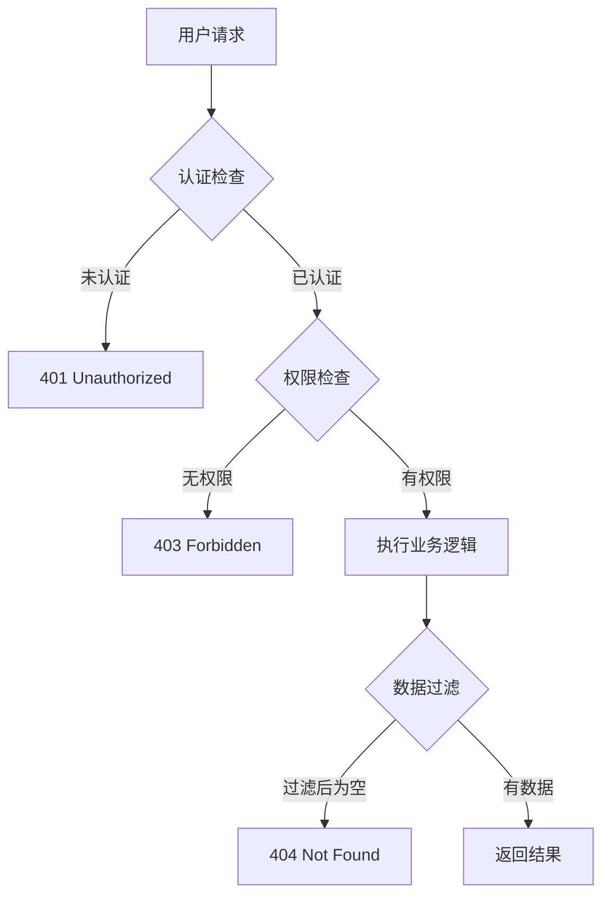
```mermaid
graph TD
A[用户请求] --> B{认证检查}
B --> |未认证| C[401 Unauthorized]
B --> |已认证| D{权限检查}
D --> |无权限| E[403 Forbidden]
D --> |有权限| F[执行业务逻辑]
F --> G{数据过滤}
G --> |过滤后为空| H[404 Not Found]
G --> |有数据| I[返回结果]
```

**图表来源**
- [backend/users/views.py](file://backend/users/views.py#L289-L300)

### 数据隔离机制

AddressViewSet通过get_queryset方法实现严格的数据隔离：

```python
def get_queryset(self):
    return Address.objects.filter(user=self.request.user).order_by('-is_default', '-id')
```

这种设计确保：
- 用户只能访问自己的地址数据
- 防止数据泄露和越权访问
- 支持高效的查询优化

### 安全防护措施

#### 1. 输入验证
- **序列化器验证**：自动验证字段格式和长度
- **自定义验证**：实现业务规则验证
- **SQL注入防护**：ORM自动防护

#### 2. 默认地址保护
- **唯一性保证**：确保同一用户只有一个默认地址
- **原子操作**：设置默认地址时使用事务
- **并发控制**：防止并发设置多个默认地址

#### 3. 敏感信息保护
- **字段脱敏**：不在API响应中暴露敏感字段
- **日志记录**：记录关键操作但不记录敏感数据
- **访问审计**：跟踪地址相关的关键操作

**章节来源**
- [backend/users/views.py](file://backend/users/views.py#L289-L300)
- [backend/users/serializers.py](file://backend/users/serializers.py#L78-L91)

## 性能优化策略

### 数据库优化

#### 1. 索引设计
- **外键索引**：为user_id字段建立索引
- **复合索引**：为(user, is_default)建立复合索引
- **查询优化**：使用select_related减少查询次数

#### 2. 查询优化
```python
# 优化前：多次查询
addresses = Address.objects.filter(user=user)
for addr in addresses:
    print(addr.is_default)

# 优化后：单次查询
addresses = Address.objects.filter(user=user).values('id', 'is_default')
```

### 缓存策略

#### 1. 内存缓存
- **地址列表缓存**：缓存用户地址列表5分钟
- **用户统计缓存**：缓存用户订单统计信息
- **地址解析缓存**：缓存常用地址的解析结果

#### 2. 分布式缓存
- **Redis集成**：使用Redis作为分布式缓存
- **缓存失效**：地址变更时及时清除相关缓存
- **缓存预热**：预加载热点数据

### 前端优化

#### 1. 数据传输优化
- **字段过滤**：只传输必要的字段
- **压缩传输**：启用GZIP压缩
- **CDN加速**：静态资源使用CDN

#### 2. 用户体验优化
- **虚拟滚动**：大量地址时使用虚拟滚动
- **懒加载**：按需加载地址详情
- **离线支持**：提供离线地址缓存

### 监控与告警

#### 1. 性能监控
- **响应时间**：监控API响应时间
- **错误率**：监控API错误率
- **并发量**：监控系统并发处理能力

#### 2. 资源监控
- **数据库连接**：监控数据库连接池使用情况
- **内存使用**：监控服务器内存使用
- **磁盘空间**：监控磁盘空间使用

## 故障排除指南

### 常见问题诊断

#### 1. 地址解析失败

**症状**：地址解析接口返回失败或结果不准确

**排查步骤**：
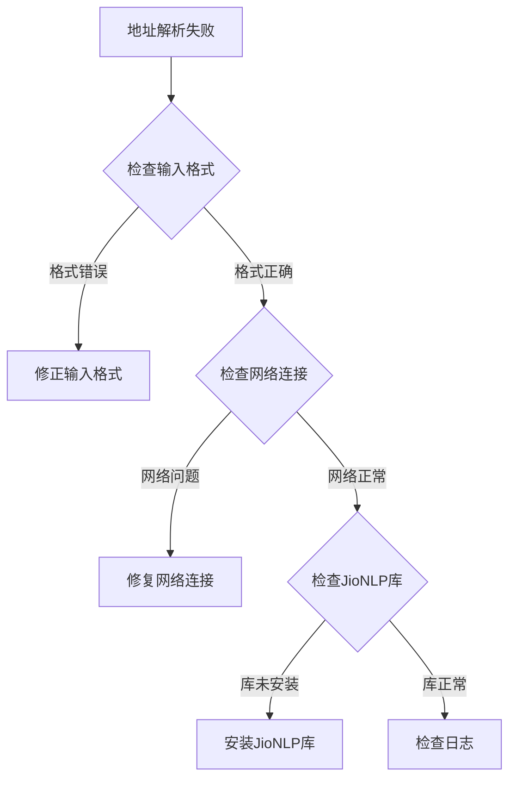
```mermaid
flowchart TD
A[地址解析失败] --> B{检查输入格式}
B --> |格式错误| C[修正输入格式]
B --> |格式正确| D{检查网络连接}
D --> |网络问题| E[修复网络连接]
D --> |网络正常| F{检查JioNLP库}
F --> |库未安装| G[安装JioNLP库]
F --> |库正常| H[检查日志]
```

**解决方案**：
- 确保输入地址格式规范
- 检查JioNLP库是否正确安装
- 查看服务器日志获取详细错误信息

#### 2. 默认地址设置冲突

**症状**：设置默认地址时出现重复默认地址

**排查步骤**：
1. 检查数据库中是否存在多个is_default=True的记录
2. 验证事务处理是否完整
3. 检查并发设置默认地址的情况

**解决方案**：
- 使用数据库唯一约束
- 实现乐观锁机制
- 添加适当的错误处理

#### 3. 权限访问错误

**症状**：用户无法访问自己的地址数据

**排查步骤**：
1. 检查用户认证状态
2. 验证用户ID与请求匹配
3. 检查权限配置

**解决方案**：
- 确保认证中间件正确配置
- 验证权限检查逻辑
- 检查用户数据完整性

### 性能问题排查

#### 1. 查询性能慢

**诊断工具**：
- Django Debug Toolbar
- 数据库查询分析器
- 慢查询日志

**优化方案**：
- 添加适当的数据库索引
- 优化查询语句
- 使用缓存减少数据库访问

#### 2. 内存占用过高

**诊断方法**：
- 监控服务器内存使用
- 分析内存泄漏
- 检查缓存配置

**优化方案**：
- 调整缓存大小限制
- 优化缓存策略
- 定期清理过期缓存

### 日志分析

#### 1. 关键日志位置
- **应用日志**：`logs/app.log`
- **错误日志**：`logs/error.log`
- **访问日志**：`logs/access.log`

#### 2. 日志分析要点
- **错误频率**：监控错误发生频率
- **响应时间**：分析API响应时间趋势
- **用户行为**：分析用户操作模式

**章节来源**
- [backend/common/address_parser.py](file://backend/common/address_parser.py#L25-L107)
- [backend/users/views.py](file://backend/users/views.py#L311-L319)

## 总结

收货地址管理系统是一个设计精良、功能完备的业务模块，具有以下特点：

### 技术优势

1. **架构清晰**：采用分层架构，职责分明
2. **扩展性强**：模块化设计便于功能扩展
3. **性能优秀**：合理的缓存策略和数据库优化
4. **安全可靠**：完善的权限控制和数据保护

### 业务价值

1. **用户体验**：提供直观易用的地址管理界面
2. **智能辅助**：地址解析功能提升用户效率
3. **数据质量**：智能验证确保地址数据准确性
4. **业务支撑**：为订单处理提供可靠的数据基础

### 发展方向

1. **AI增强**：引入更先进的地址解析算法
2. **多语言支持**：支持国际化地址格式
3. **移动端优化**：进一步优化移动端用户体验
4. **数据分析**：提供地址使用情况分析功能

该系统为电商品台提供了坚实的地址管理基础，支撑着整个业务流程的顺畅运行。通过持续的优化和改进，将为用户提供更加优质的服务体验。