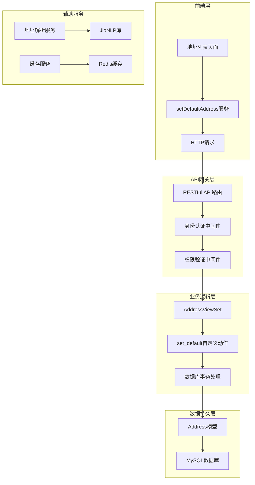
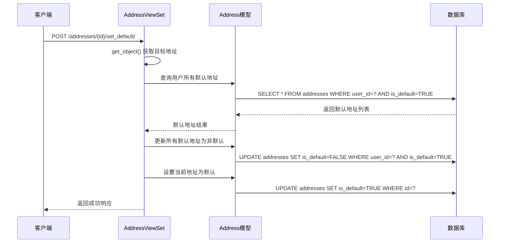
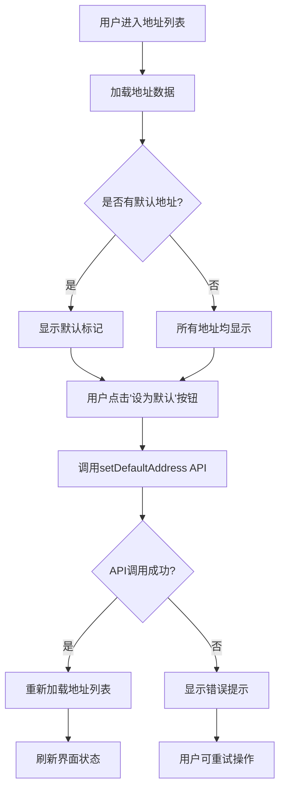
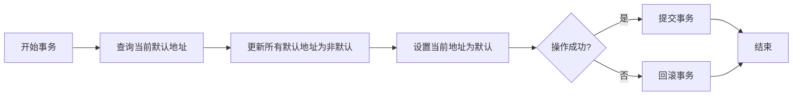
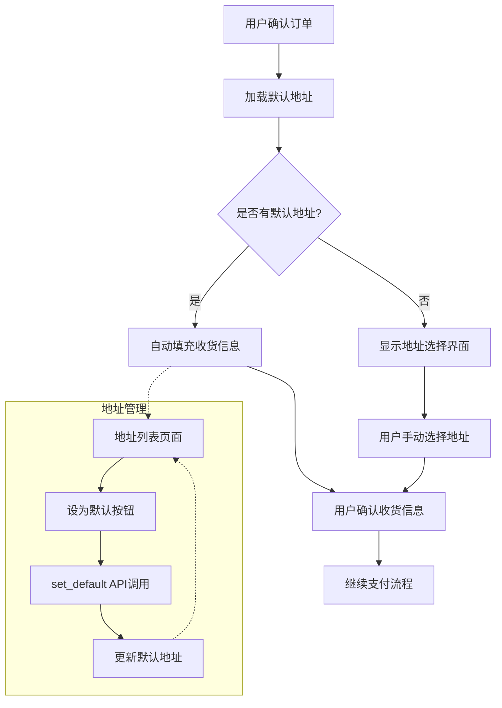

# 默认收货地址设置功能深度解析

<cite>
**本文档引用的文件**
- [views.py](file://backend/users/views.py)
- [address.ts](file://frontend/src/services/address.ts)
- [address-list/index.tsx](file://frontend/src/pages/address-list/index.tsx)
- [models.py](file://backend/users/models.py)
- [serializers.py](file://backend/users/serializers.py)
- [address-parser.py](file://backend/common/address_parser.py)
- [urls.py](file://backend/users/urls.py)
</cite>

## 目录
1. [功能概述](#功能概述)
2. [系统架构](#系统架构)
3. [后端核心实现](#后端核心实现)
4. [前端交互流程](#前端交互流程)
5. [并发安全性分析](#并发安全性分析)
6. [异常处理机制](#异常处理机制)
7. [性能优化策略](#性能优化策略)
8. [购物结算流程中的应用](#购物结算流程中的应用)
9. [最佳实践建议](#最佳实践建议)

## 功能概述

默认收货地址设置功能是电商系统中的核心业务组件，它确保用户在下单时能够快速使用最常用的配送地址。该功能通过将用户指定的地址标记为默认状态，简化了购物结算流程中的地址选择操作。

### 核心特性
- **原子性操作**：确保地址设置的完整性
- **并发安全保障**：防止多用户同时设置默认地址导致的数据不一致
- **用户体验优化**：提供直观的"设为默认"按钮
- **业务逻辑完整性**：自动取消其他默认地址

## 系统架构



**图表来源**
- [views.py](file://backend/users/views.py#L287-L320)
- [address.ts](file://frontend/src/services/address.ts#L25-L28)

## 后端核心实现

### AddressViewSet中的set_default方法

AddressViewSet是Django REST framework中的视图集，专门负责用户地址的管理操作。其中的`set_default`方法实现了默认地址设置的核心逻辑。



**图表来源**
- [views.py](file://backend/users/views.py#L312-L319)

#### 方法执行流程详解

1. **目标地址获取** (`get_object()`方法)
   - 通过REST framework的内置方法获取指定ID的地址对象
   - 自动进行权限验证，确保用户只能操作自己的地址
   - 如果地址不存在或用户无权限，抛出404或403错误

2. **取消现有默认地址**
   ```python
   Address.objects.filter(user=request.user, is_default=True).update(is_default=False)
   ```
   - 使用批量更新操作，效率高于逐条更新
   - 确保同一用户在同一时间只有一个默认地址
   - 原子性操作，保证数据一致性

3. **设置当前地址为默认**
   ```python
   address.is_default = True
   address.save()
   ```
   - 单独更新当前地址的默认标志
   - 使用ORM的save方法确保数据持久化
   - 触发模型的信号和验证钩子

**章节来源**
- [views.py](file://backend/users/views.py#L312-L319)

### 序列化器中的默认地址处理

除了视图集中的自定义动作，序列化器也在创建和更新地址时提供了默认地址的自动处理逻辑。

#### 创建地址时的默认处理
```python
def create(self, validated_data):
    user = self.context["request"].user
    is_default = validated_data.get("is_default", False)
    if is_default:
        Address.objects.filter(user=user, is_default=True).update(is_default=False)
    validated_data["user"] = user
    return super().create(validated_data)
```

#### 更新地址时的默认处理
```python
def update(self, instance, validated_data):
    if validated_data.get("is_default", False) and not instance.is_default:
        Address.objects.filter(user=instance.user, is_default=True).update(is_default=False)
    return super().update(instance, validated_data)
```

**章节来源**
- [serializers.py](file://backend/users/serializers.py#L78-L91)

## 前端交互流程

### 用户界面设计

前端采用React + Taro框架构建，提供直观的地址管理界面。地址列表页面展示了用户的全部收货地址，并为每个非默认地址提供"设为默认"按钮。



**图表来源**
- [address-list/index.tsx](file://frontend/src/pages/address-list/index.tsx#L30-L37)

### 前端服务调用

前端通过addressService提供的setDefaultAddress方法发起API请求：

```typescript
async setDefaultAddress(id: number): Promise<{ status: string }> {
    return http.post<{ status: string }>(`/addresses/${id}/set_default/`)
}
```

#### 请求-响应处理流程

1. **事件触发**：用户点击"设为默认"按钮
2. **事件阻止**：调用`e.stopPropagation()`防止事件冒泡
3. **API调用**：调用`addressService.setDefaultAddress(id)`
4. **错误处理**：捕获并处理可能的网络错误
5. **UI反馈**：根据结果展示成功或失败提示
6. **数据刷新**：重新加载地址列表以反映最新状态

**章节来源**
- [address.ts](file://frontend/src/services/address.ts#L25-L28)
- [address-list/index.tsx](file://frontend/src/pages/address-list/index.tsx#L30-L37)

## 并发安全性分析

### 数据库层面的安全保障

当前实现主要依赖于数据库的原子性操作来保证并发安全：

1. **批量更新操作** (`update()`方法)
   - 使用单条SQL语句完成多个记录的更新
   - 数据库层面保证操作的原子性
   - 避免了多次数据库往返的开销

2. **ORM save方法**
   - 单个记录的更新操作
   - 利用数据库事务保证一致性

### 并发问题场景分析

尽管当前实现已经具备基本的并发安全保障，但在高并发场景下仍可能存在以下风险：

1. **竞态条件**：两个用户同时尝试设置同一个地址为默认
2. **数据不一致**：在网络延迟情况下可能出现状态不一致
3. **性能瓶颈**：大量并发请求可能导致数据库压力

### 原子性保障机制



**图表来源**
- [views.py](file://backend/users/views.py#L312-L319)

## 异常处理机制

### 后端异常处理

#### 1. 目标地址不存在
- **HTTP状态码**：404 Not Found
- **错误信息**：目标地址ID不存在
- **处理方式**：REST framework自动处理，返回标准错误响应

#### 2. 权限不足
- **HTTP状态码**：403 Forbidden
- **错误信息**：用户无权操作该地址
- **处理方式**：IsAuthenticated和权限验证中间件拦截

#### 3. 数据库操作失败
- **HTTP状态码**：500 Internal Server Error
- **错误信息**：数据库操作异常
- **处理方式**：Django ORM自动捕获异常并记录日志

### 前端异常处理

前端通过统一的错误处理机制提供用户友好的反馈：

```typescript
const handleSetDefault = async (id: number) => {
    try {
        await addressService.setDefaultAddress(id)
        loadAddresses()
        Taro.showToast({ title: '设置成功', icon: 'success' })
    } catch (error) {
        Taro.showToast({ title: '设置失败', icon: 'none' })
    }
}
```

**章节来源**
- [address-list/index.tsx](file://frontend/src/pages/address-list/index.tsx#L30-L37)

## 性能优化策略

### 高并发场景下的优化建议

#### 1. 使用select_for_update锁定记录

在高并发场景下，建议使用数据库的行级锁来确保操作的原子性：

```python
from django.db import transaction

@action(detail=True, methods=["post"])
def set_default(self, request, pk=None):
    with transaction.atomic():
        # 获取目标地址并加锁
        address = Address.objects.select_for_update().get(pk=pk, user=request.user)
        
        # 取消其他默认地址
        Address.objects.filter(user=request.user, is_default=True).update(is_default=False)
        
        # 设置当前地址为默认
        address.is_default = True
        address.save()
    
    return Response({"status": "默认地址已设置"})
```

#### 2. 数据库索引优化

确保以下字段建立适当的索引：

| 字段 | 类型 | 索引类型 | 用途 |
|------|------|----------|------|
| user_id | ForeignKey | 复合索引 | 快速定位用户地址 |
| is_default | Boolean | 独立索引 | 快速查找默认地址 |
| user_id + is_default | 复合索引 | 复合索引 | 最优查询性能 |

#### 3. 缓存策略

对于频繁访问的默认地址信息，可以引入缓存机制：

```python
from django.core.cache import cache

@action(detail=True, methods=["post"])
def set_default(self, request, pk=None):
    address = self.get_object()
    
    # 取消其他默认地址
    Address.objects.filter(user=request.user, is_default=True).update(is_default=False)
    
    # 设置当前地址为默认
    address.is_default = True
    address.save()
    
    # 更新缓存
    cache.delete(f'user_default_address_{request.user.id}')
    
    return Response({"status": "默认地址已设置"})
```

#### 4. 批量操作优化

对于需要批量更新的场景，使用更高效的批量操作：

```python
# 更高效的批量更新
Address.objects.filter(user=request.user).exclude(id=target_address_id).update(is_default=False)
```

**章节来源**
- [views.py](file://backend/users/views.py#L312-L319)

## 购物结算流程中的应用

### 默认地址在结算流程中的作用

默认收货地址是电商系统结算流程中的关键环节，直接影响用户体验和转化率。



### 业务价值分析

1. **提升转化率**：减少用户在结算步骤的操作复杂度
2. **改善用户体验**：提供个性化的一键使用体验
3. **降低客服成本**：减少因地址选择问题产生的咨询
4. **提高订单成功率**：避免因地址问题导致的订单放弃

## 最佳实践建议

### 开发建议

1. **严格权限控制**
   - 确保用户只能操作自己的地址
   - 实施细粒度的权限验证

2. **完善的错误处理**
   - 前后端都要有充分的错误处理
   - 提供清晰的错误信息和解决建议

3. **性能监控**
   - 监控API响应时间和成功率
   - 关注数据库查询性能

4. **用户体验优化**
   - 提供即时的操作反馈
   - 在界面上明确标识默认地址

### 运维建议

1. **数据库监控**
   - 监控地址表的查询性能
   - 关注并发操作的冲突率

2. **缓存策略**
   - 合理设置缓存过期时间
   - 监控缓存命中率

3. **日志记录**
   - 记录重要的地址变更操作
   - 监控异常操作的频率

### 安全考虑

1. **输入验证**
   - 对地址数据进行严格的格式验证
   - 防止恶意数据注入

2. **审计跟踪**
   - 记录所有地址变更操作
   - 支持追溯和审计需求

3. **数据备份**
   - 定期备份地址数据
   - 确保数据恢复能力

通过以上全面的分析和优化建议，可以确保默认收货地址设置功能在各种场景下都能稳定、高效地运行，为用户提供优质的购物体验。