# 用户管理逻辑

<cite>
**本文档引用的文件**
- [backend/users/views.py](file://backend/users/views.py)
- [backend/users/models.py](file://backend/users/models.py)
- [backend/users/serializers.py](file://backend/users/serializers.py)
- [backend/users/services.py](file://backend/users/services.py)
- [backend/users/management/commands/reset_admin.py](file://backend/users/management/commands/reset_admin.py)
- [backend/users/urls.py](file://backend/users/urls.py)
- [backend/common/permissions.py](file://backend/common/permissions.py)
- [backend/common/throttles.py](file://backend/common/throttles.py)
- [backend/common/utils.py](file://backend/common/utils.py)
- [backend/common/address_parser.py](file://backend/common/address_parser.py)
- [frontend/src/services/auth.ts](file://frontend/src/services/auth.ts)
- [frontend/src/services/user.ts](file://frontend/src/services/user.ts)
- [frontend/src/utils/request.ts](file://frontend/src/utils/request.ts)
</cite>

## 目录
1. [简介](#简介)
2. [项目结构](#项目结构)
3. [核心组件](#核心组件)
4. [架构概览](#架构概览)
5. [详细组件分析](#详细组件分析)
6. [依赖关系分析](#依赖关系分析)
7. [性能考虑](#性能考虑)
8. [故障排除指南](#故障排除指南)
9. [结论](#结论)

## 简介

本文档全面解析了电动小商城用户管理系统的核心业务逻辑，重点关注用户认证流程、JWT令牌管理、用户资料更新、收货地址管理和管理员账户重置功能。该系统采用Django REST Framework构建，支持微信小程序登录和传统用户名密码登录两种认证方式，提供了完整的用户生命周期管理功能。

## 项目结构

用户管理系统位于`backend/users/`目录下，包含以下核心模块：

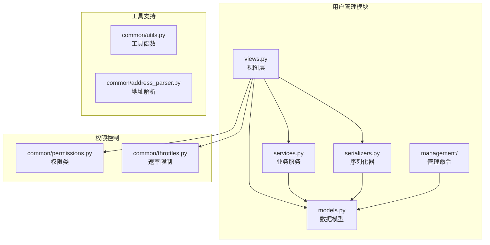

**图表来源**
- [backend/users/views.py](file://backend/users/views.py#L1-L460)
- [backend/users/models.py](file://backend/users/models.py#L1-L95)
- [backend/users/serializers.py](file://backend/users/serializers.py#L1-L92)

**章节来源**
- [backend/users/views.py](file://backend/users/views.py#L1-L50)
- [backend/users/models.py](file://backend/users/models.py#L1-L30)

## 核心组件

### 用户模型设计

系统采用自定义User模型，继承自Django的AbstractUser，支持双认证方式：

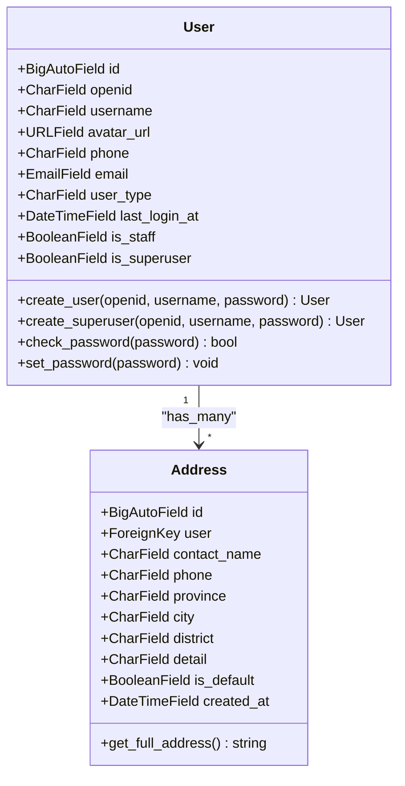

**图表来源**
- [backend/users/models.py](file://backend/users/models.py#L31-L95)

### 认证服务架构

系统提供多种认证方式，通过统一的服务层处理：

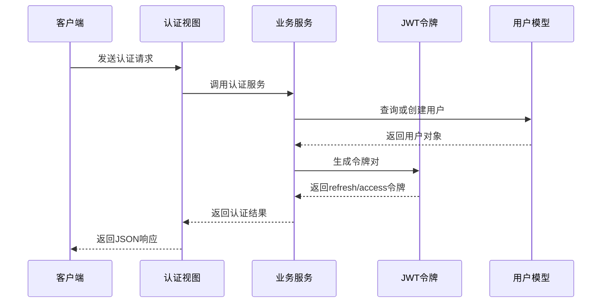

**图表来源**
- [backend/users/views.py](file://backend/users/views.py#L23-L154)
- [backend/users/services.py](file://backend/users/services.py#L1-L55)

**章节来源**
- [backend/users/models.py](file://backend/users/models.py#L31-L95)
- [backend/users/services.py](file://backend/users/services.py#L1-L55)

## 架构概览

### 系统整体架构

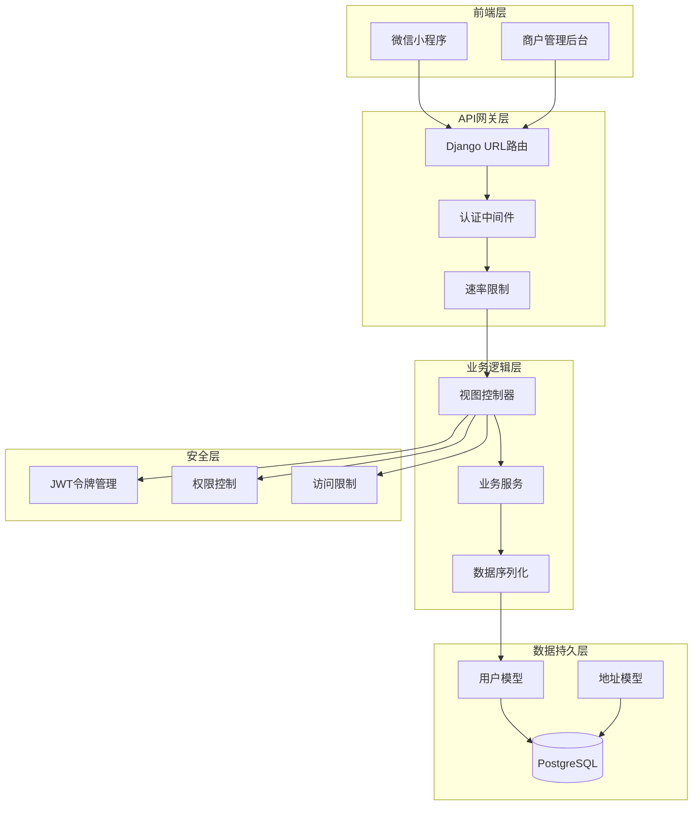

**图表来源**
- [backend/users/views.py](file://backend/users/views.py#L1-L460)
- [backend/users/urls.py](file://backend/users/urls.py#L1-L18)

## 详细组件分析

### 用户认证流程

#### 微信小程序登录

微信登录是系统的主要认证方式，支持真实微信API和模拟登录两种模式：

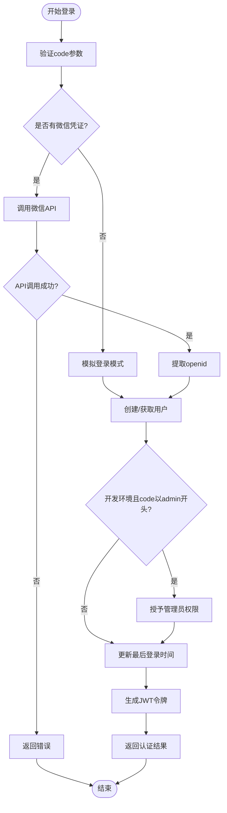

**图表来源**
- [backend/users/views.py](file://backend/users/views.py#L49-L233)
- [backend/users/services.py](file://backend/users/services.py#L1-L55)

#### 管理员密码登录

管理员登录提供传统的用户名密码认证方式：

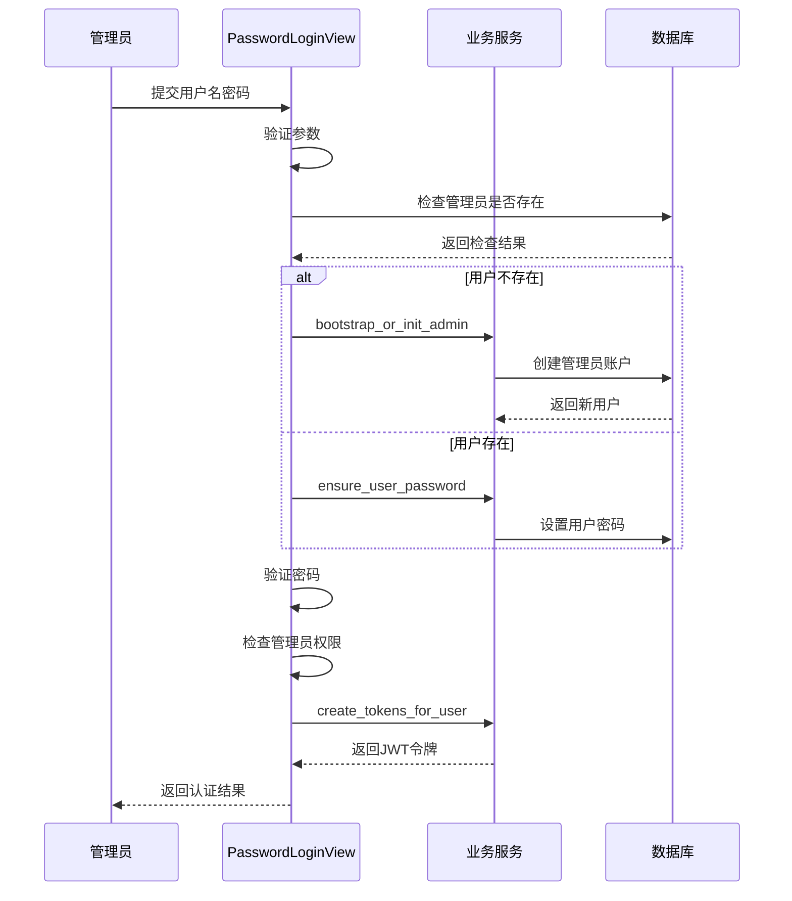

**图表来源**
- [backend/users/views.py](file://backend/users/views.py#L162-L233)
- [backend/users/services.py](file://backend/users/services.py#L26-L55)

**章节来源**
- [backend/users/views.py](file://backend/users/views.py#L23-L233)
- [backend/users/services.py](file://backend/users/services.py#L1-L55)

### JWT令牌管理

#### 令牌生成与验证机制

系统使用Django REST Framework SimpleJWT实现JWT令牌管理：

| 令牌类型 | 有效期 | 用途 | 刷新机制 |
|---------|--------|------|----------|
| Access Token | 15分钟 | API请求认证 | 自动刷新 |
| Refresh Token | 7天 | 令牌刷新 | 手动刷新 |
| Session Token | 会话期间 | 微信登录会话 | 服务器端管理 |

#### 令牌刷新流程

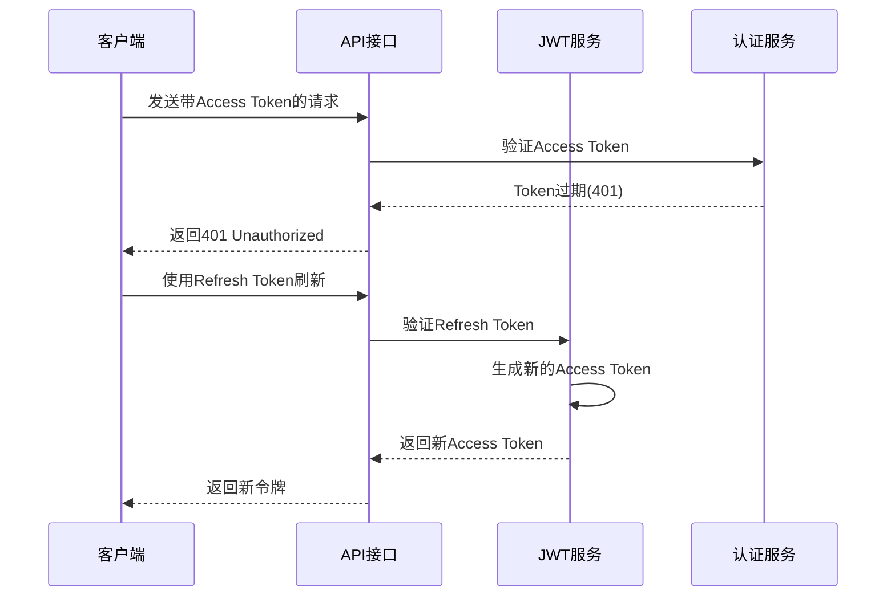

**图表来源**
- [backend/users/services.py](file://backend/users/services.py#L22-L24)
- [frontend/src/utils/request.ts](file://frontend/src/utils/request.ts#L39-L57)

**章节来源**
- [backend/users/services.py](file://backend/users/services.py#L22-L24)
- [frontend/src/utils/request.ts](file://frontend/src/utils/request.ts#L39-L57)

### 用户资料更新与数据验证

#### 用户资料序列化器

用户资料更新通过专门的序列化器实现数据验证和安全处理：

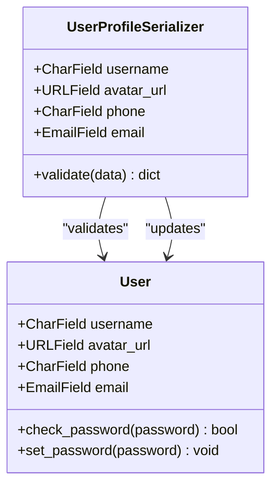

**图表来源**
- [backend/users/serializers.py](file://backend/users/serializers.py#L43-L56)

#### 敏感信息处理策略

系统采用多层次的安全策略保护用户敏感信息：

| 保护层级 | 实施策略 | 技术手段 | 应用场景 |
|---------|----------|----------|----------|
| 传输层 | HTTPS加密 | TLS 1.2+ | 所有网络通信 |
| 存储层 | 密码哈希 | PBKDF2-SHA256 | 用户密码存储 |
| 序列化层 | 字段过滤 | ModelSerializer | API响应数据 |
| 前端层 | 内存保护 | sessionStorage | 令牌存储 |
| 日志层 | 敏感信息脱敏 | 日志级别控制 | 系统日志记录 |

**章节来源**
- [backend/users/serializers.py](file://backend/users/serializers.py#L43-L56)

### 收货地址管理功能

#### 地址模型设计

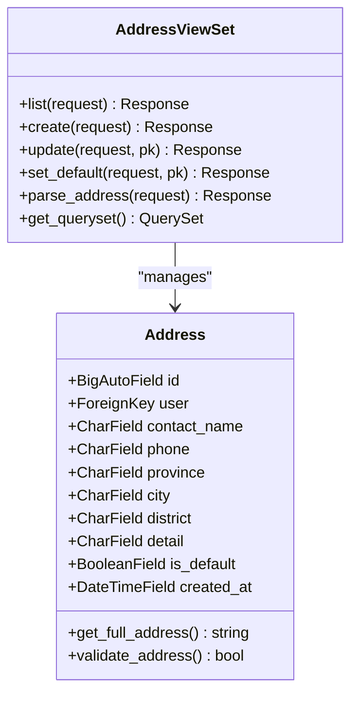

**图表来源**
- [backend/users/models.py](file://backend/users/models.py#L77-L95)
- [backend/users/views.py](file://backend/users/views.py#L288-L385)

#### 地址解析与验证

系统集成JioNLP实现智能地址解析：

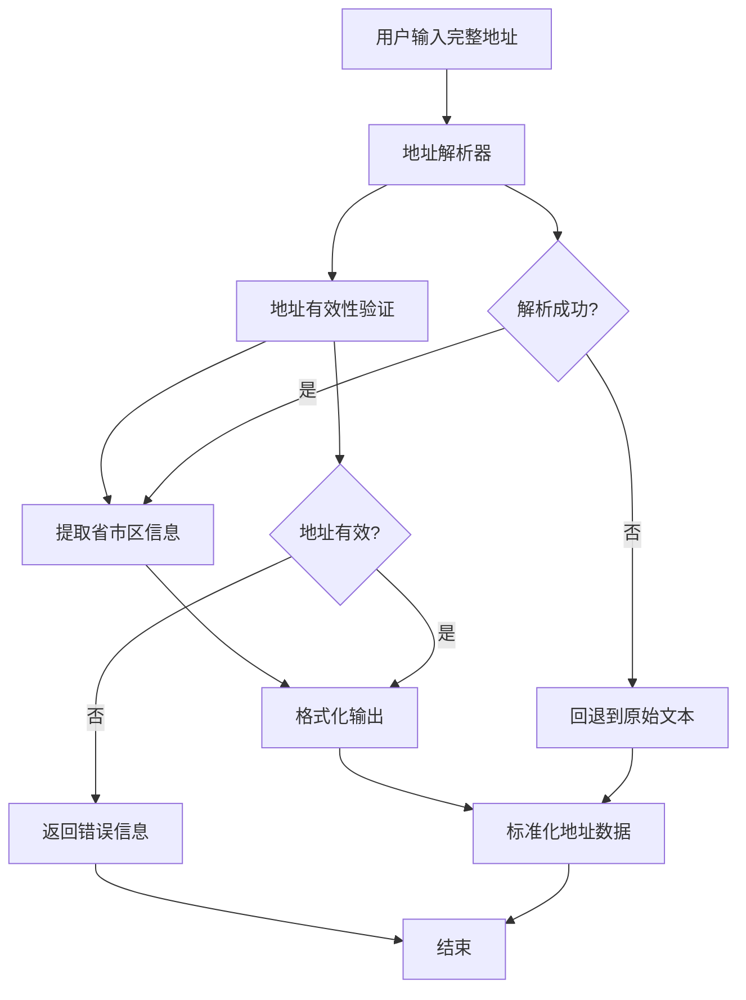

**图表来源**
- [backend/common/address_parser.py](file://backend/common/address_parser.py#L25-L107)

#### 默认地址设置机制

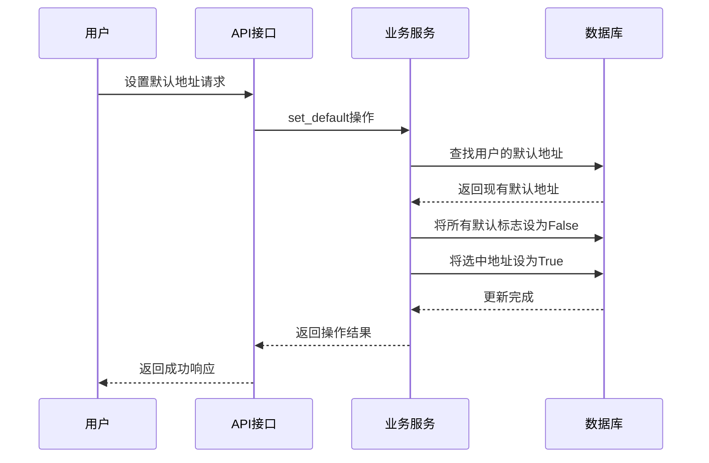

**图表来源**
- [backend/users/views.py](file://backend/users/views.py#L311-L319)

**章节来源**
- [backend/users/models.py](file://backend/users/models.py#L77-L95)
- [backend/users/views.py](file://backend/users/views.py#L288-L385)
- [backend/common/address_parser.py](file://backend/common/address_parser.py#L25-L107)

### reset_admin命令实现

#### 命令执行流程

reset_admin命令提供安全的管理员账户重置功能：

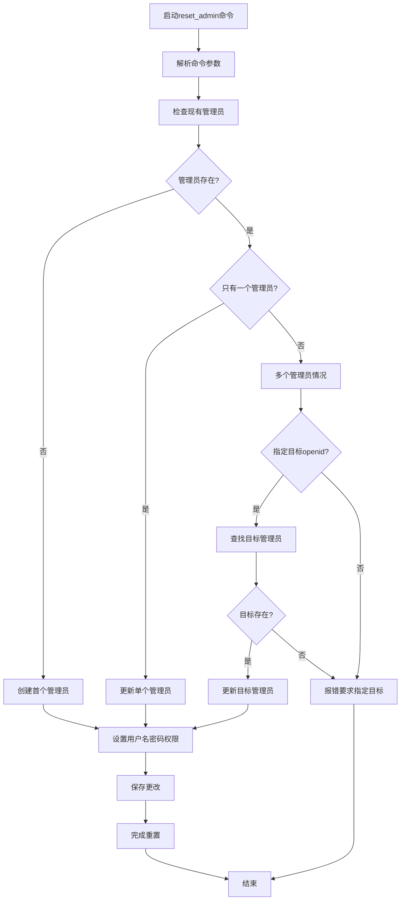

**图表来源**
- [backend/users/management/commands/reset_admin.py](file://backend/users/management/commands/reset_admin.py#L21-L67)

#### 安全考虑

reset_admin命令实现了多层安全保护：

| 安全特性 | 实现方式 | 目的 |
|---------|----------|------|
| 参数验证 | 必需参数检查 | 防止空参数注入 |
| 权限控制 | 多管理员检测 | 避免意外覆盖 |
| 目标选择 | 显式openid指定 | 精确控制目标 |
| 密码安全 | 强制哈希存储 | 保护密码安全 |
| 操作审计 | 成功状态输出 | 记录操作历史 |

**章节来源**
- [backend/users/management/commands/reset_admin.py](file://backend/users/management/commands/reset_admin.py#L1-L67)

### API接口安全防护

#### CSRF保护机制

系统采用CSRF保护防止跨站请求伪造攻击：

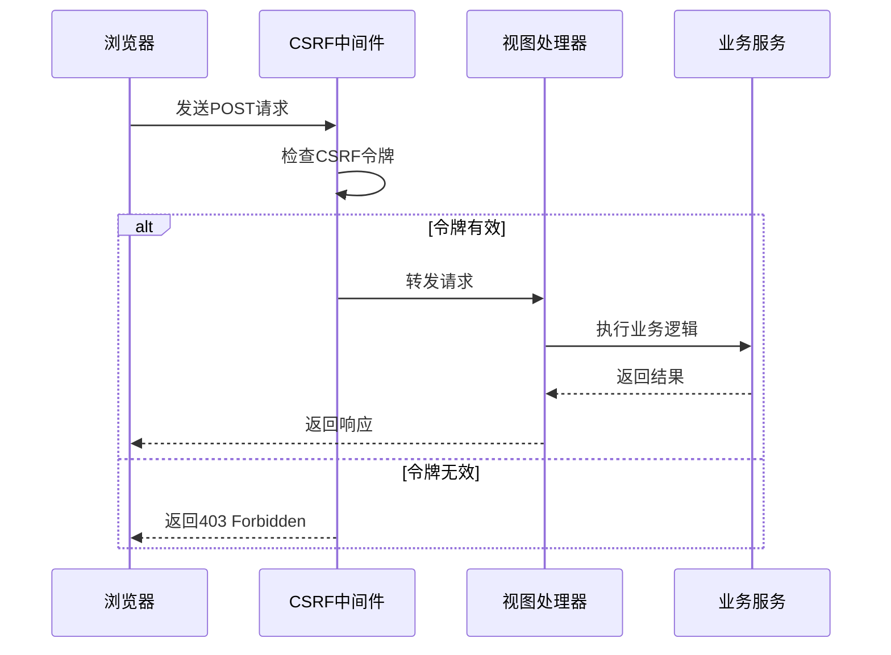

**图表来源**
- [backend/users/views.py](file://backend/users/views.py#L158-L161)

#### 权限控制体系

系统实现了分级权限控制：

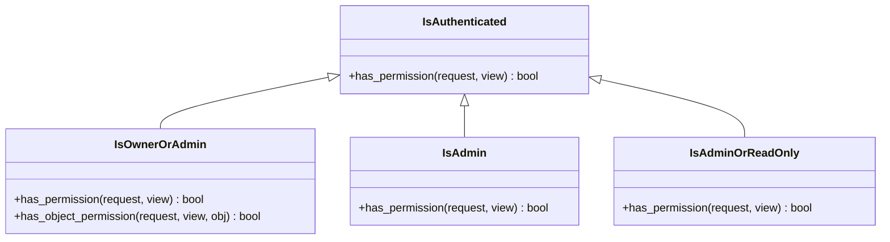

**图表来源**
- [backend/common/permissions.py](file://backend/common/permissions.py#L12-L189)

**章节来源**
- [backend/users/views.py](file://backend/users/views.py#L158-L161)
- [backend/common/permissions.py](file://backend/common/permissions.py#L12-L189)

## 依赖关系分析

### 模块间依赖关系

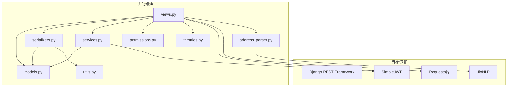

**图表来源**
- [backend/users/views.py](file://backend/users/views.py#L1-L10)
- [backend/common/address_parser.py](file://backend/common/address_parser.py#L1-L10)

### 数据流分析

系统中的数据流向遵循清晰的层次结构：

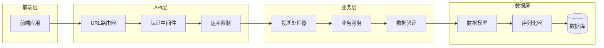

**图表来源**
- [backend/users/views.py](file://backend/users/views.py#L1-L460)
- [backend/users/models.py](file://backend/users/models.py#L1-L95)

**章节来源**
- [backend/users/views.py](file://backend/users/views.py#L1-L460)
- [backend/users/models.py](file://backend/users/models.py#L1-L95)

## 性能考虑

### 缓存策略

系统采用多级缓存优化性能：

| 缓存类型 | 缓存键 | 过期时间 | 缓存内容 |
|---------|--------|----------|----------|
| 用户统计缓存 | `user_stats_{user_id}` | 5分钟 | 订单数量和消费金额 |
| 订单计数缓存 | `user_orders_count_{user_id}` | 5分钟 | 用户订单总数 |
| 完成订单缓存 | `user_completed_orders_count_{user_id}` | 5分钟 | 已完成订单数 |

### 速率限制

系统实施细粒度的速率限制：

| 限制类型 | 限制规则 | 目的 |
|---------|----------|------|
| 登录接口 | 5次/分钟 | 防止暴力破解 |
| 支付接口 | 10次/分钟 | 防止重复支付 |
| 匿名访问 | 更严格限制 | 保护系统安全 |

### 数据库优化

- 使用索引优化查询性能
- 实施数据库连接池
- 采用异步任务处理耗时操作
- 实施数据分区策略

## 故障排除指南

### 常见问题及解决方案

#### 认证失败问题

**问题症状**：用户登录失败，返回401错误

**可能原因**：
1. 微信API配置错误
2. 网络连接问题
3. 用户密码错误
4. 令牌过期

**解决步骤**：
1. 检查微信小程序配置
2. 验证网络连接
3. 确认用户凭据正确性
4. 实施令牌刷新机制

#### 地址解析失败

**问题症状**：地址解析返回错误

**可能原因**：
1. JioNLP库未正确安装
2. 地址格式不符合规范
3. 网络连接问题

**解决步骤**：
1. 检查JioNLP依赖安装
2. 验证地址格式
3. 检查网络连接

#### 权限访问被拒绝

**问题症状**：API请求返回403错误

**可能原因**：
1. 用户权限不足
2. 令牌无效
3. 跨域请求问题

**解决步骤**：
1. 检查用户角色权限
2. 验证令牌有效性
3. 配置CORS策略

**章节来源**
- [backend/users/views.py](file://backend/users/views.py#L49-L233)
- [backend/common/address_parser.py](file://backend/common/address_parser.py#L25-L107)
- [backend/common/permissions.py](file://backend/common/permissions.py#L12-L189)

## 结论

电动小商城用户管理系统通过精心设计的架构和完善的业务逻辑，实现了安全、高效、可扩展的用户管理功能。系统的核心优势包括：

### 技术亮点

1. **双认证机制**：支持微信小程序和传统用户名密码登录
2. **JWT令牌管理**：提供安全的令牌生成、验证和刷新机制
3. **智能地址解析**：集成JioNLP实现中文地址的自动识别和拆分
4. **分级权限控制**：实现细粒度的访问权限管理
5. **安全防护措施**：多层安全保护防止常见攻击

### 最佳实践

1. **数据安全**：采用密码哈希、HTTPS传输、敏感信息脱敏等多重保护
2. **性能优化**：实施缓存策略、速率限制、数据库优化
3. **可维护性**：模块化设计、清晰的代码结构、完善的文档
4. **用户体验**：自动令牌刷新、友好的错误提示、流畅的操作流程

### 安全建议

1. **定期更新**：及时更新依赖库和框架版本
2. **监控告警**：建立完善的监控和告警机制
3. **备份恢复**：制定数据备份和灾难恢复计划
4. **安全审计**：定期进行安全漏洞扫描和代码审计

该系统为电动小商城提供了坚实的用户管理基础，能够满足当前业务需求并具备良好的扩展性，为未来的功能增强和业务发展奠定了良好基础。