# 密码登录系统详细实现机制

<cite>
**本文档中引用的文件**
- [views.py](file://backend/users/views.py)
- [services.py](file://backend/users/services.py)
- [models.py](file://backend/users/models.py)
- [serializers.py](file://backend/users/serializers.py)
- [throttles.py](file://backend/common/throttles.py)
- [reset_admin.py](file://backend/users/management/commands/reset_admin.py)
- [index.tsx](file://merchant/src/pages/Login/index.tsx)
- [auth.ts](file://merchant/src/utils/auth.ts)
- [urls.py](file://backend/users/urls.py)
- [env_config.py](file://backend/backend/settings/env_config.py)
- [development.py](file://backend/backend/settings/development.py)
- [production.py](file://backend/backend/settings/production.py)
</cite>

## 目录
1. [系统概述](#系统概述)
2. [核心组件架构](#核心组件架构)
3. [PasswordLoginView视图详解](#passwordloginview视图详解)
4. [管理员账户初始化机制](#管理员账户初始化机制)
5. [密码验证与权限控制](#密码验证与权限控制)
6. [JWT令牌生成机制](#jwt令牌生成机制)
7. [安全策略与防护措施](#安全策略与防护措施)
8. [前端登录实现](#前端登录实现)
9. [环境配置与部署](#环境配置与部署)
10. [故障排除指南](#故障排除指南)

## 系统概述

密码登录系统是商户管理后台的核心认证模块，采用基于用户名和密码的传统认证方式，同时支持管理员账户的自动初始化和权限提升机制。该系统设计遵循最小权限原则，确保只有在必要时才提升用户权限。

### 主要特性

- **管理员专用登录**：专门针对商户管理后台的管理员用户设计
- **自动账户初始化**：系统无管理员时自动创建首个管理员账户
- **权限智能提升**：仅在系统无管理员时允许普通用户提升为管理员
- **多重安全防护**：CSRF豁免、速率限制、密码验证等安全措施
- **环境感知行为**：开发环境支持快速调试，生产环境严格安全控制

## 核心组件架构

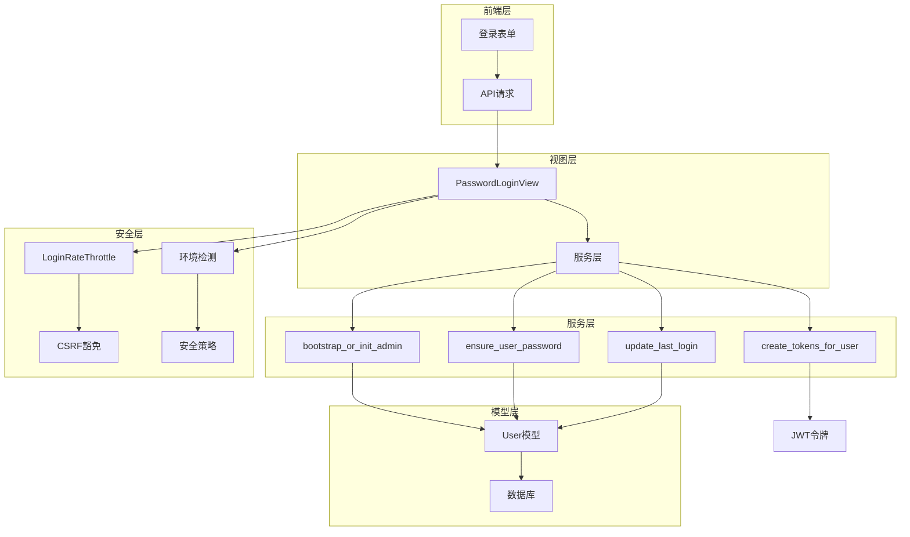

**图表来源**
- [views.py](file://backend/users/views.py#L162-L233)
- [services.py](file://backend/users/services.py#L22-L54)
- [models.py](file://backend/users/models.py#L31-L71)

## PasswordLoginView视图详解

PasswordLoginView是密码登录的核心视图类，继承自APIView，专门处理管理员用户的用户名密码认证。

### 视图配置

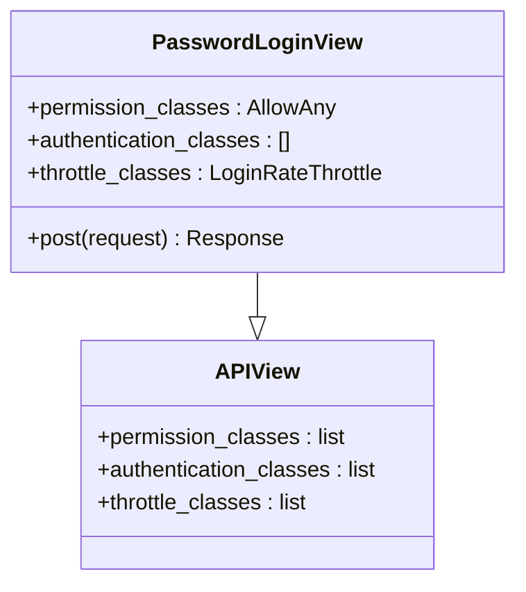

**图表来源**
- [views.py](file://backend/users/views.py#L162-L171)

### 请求处理流程

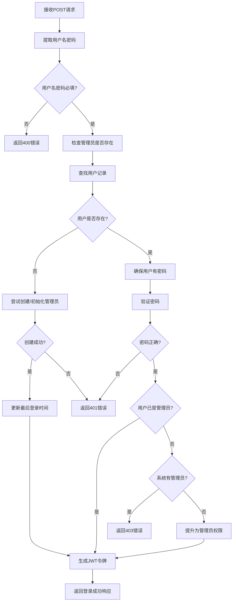

**图表来源**
- [views.py](file://backend/users/views.py#L177-L233)

### 关键实现细节

1. **CSRF豁免**：通过`@method_decorator(csrf_exempt)`装饰器实现
2. **匿名访问**：允许未认证用户访问登录接口
3. **速率限制**：应用LoginRateThrottle防止暴力破解
4. **环境感知**：开发环境下支持快速管理员创建

**章节来源**
- [views.py](file://backend/users/views.py#L157-L233)

## 管理员账户初始化机制

### bootstrap_or_init_admin函数

bootstrap_or_init_admin函数是系统初始化管理员账户的核心逻辑，负责在系统无管理员时自动创建首个管理员账户。

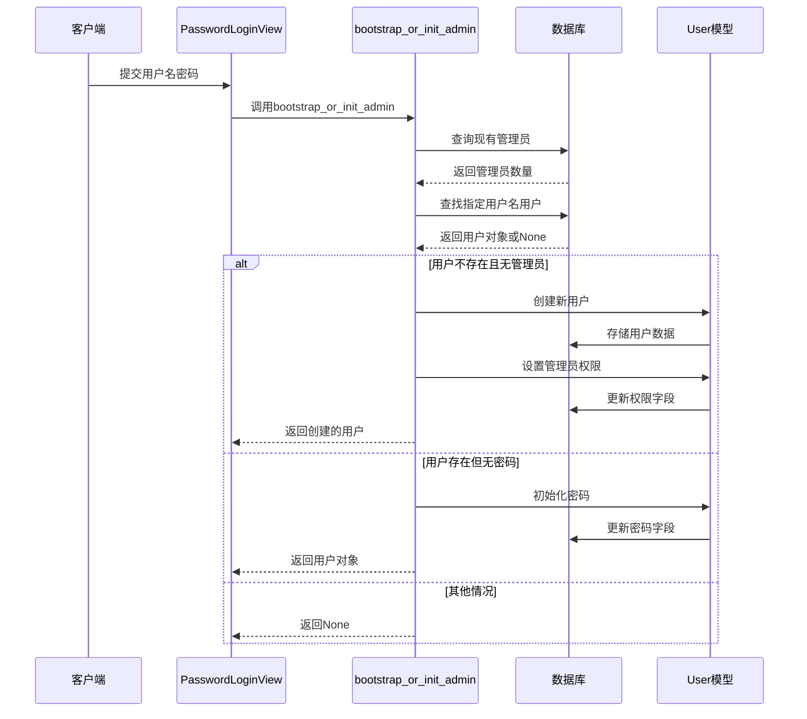

**图表来源**
- [services.py](file://backend/users/services.py#L26-L49)

### 初始化逻辑详解

| 场景 | 处理逻辑 | 结果 |
|------|----------|------|
| 用户不存在且无管理员 | 创建新管理员用户，设置所有权限 | 成功创建首个管理员 |
| 用户存在但无可用密码 | 使用提交的密码初始化用户 | 密码初始化完成 |
| 用户存在且有密码 | 不做任何操作 | 返回现有用户 |
| 用户不存在但已有管理员 | 不创建新用户 | 返回None |

### reset_admin命令

reset_admin命令提供了手动重置管理员账户的功能，支持以下场景：

- **首次创建**：当系统中没有管理员时创建首个管理员
- **多管理员选择**：当存在多个管理员时需要明确指定目标
- **密码重置**：修改现有管理员的用户名和密码

**章节来源**
- [services.py](file://backend/users/services.py#L26-L49)
- [reset_admin.py](file://backend/users/management/commands/reset_admin.py#L1-L67)

## 密码验证与权限控制

### ensure_user_password函数

ensure_user_password函数负责确保用户具有可用的密码，这是系统安全的重要保障。

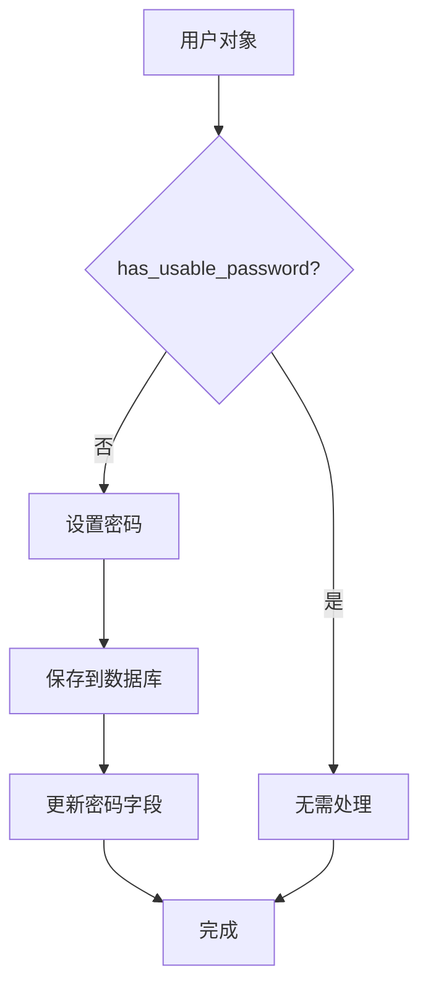

**图表来源**
- [services.py](file://backend/users/services.py#L51-L54)

### 权限提升规则

系统采用严格的权限提升策略：

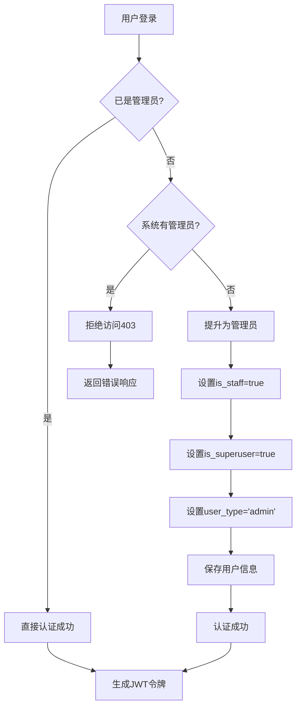

**图表来源**
- [views.py](file://backend/users/views.py#L213-L221)

### 权限控制策略

| 条件 | 行为 | HTTP状态码 |
|------|------|------------|
| 用户不存在 | 尝试创建管理员账户 | 200/401 |
| 用户存在但无密码 | 初始化密码 | 200 |
| 用户存在且有密码 | 验证密码 | 200/401 |
| 用户非管理员且系统有管理员 | 拒绝访问 | 403 |
| 用户非管理员且系统无管理员 | 提升为管理员 | 200 |

**章节来源**
- [views.py](file://backend/users/views.py#L192-L221)
- [services.py](file://backend/users/services.py#L51-L54)

## JWT令牌生成机制

### create_tokens_for_user函数

create_tokens_for_user函数负责生成JWT访问令牌和刷新令牌，使用Django REST Framework SimpleJWT库实现。

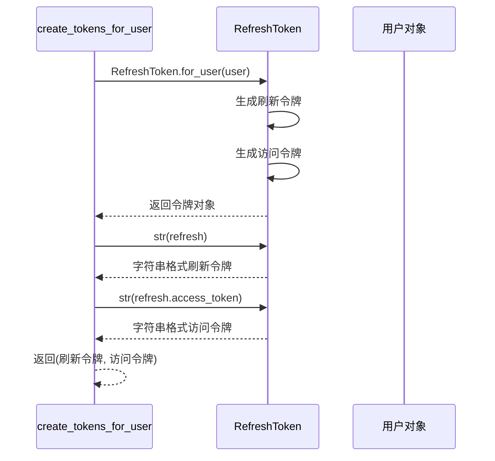

**图表来源**
- [services.py](file://backend/users/services.py#L22-L24)

### 令牌结构

JWT令牌包含以下关键信息：

- **刷新令牌（Refresh Token）**：长期有效的令牌，用于获取新的访问令牌
- **访问令牌（Access Token）**：短期有效的令牌，用于API认证
- **用户标识**：包含用户ID和其他认证信息
- **过期时间**：访问令牌通常设置较短的有效期（如15分钟）

### 令牌安全特性

- **短期有效**：访问令牌设置较短有效期，降低泄露风险
- **可刷新**：通过刷新令牌获取新的访问令牌
- **签名验证**：使用密钥签名确保令牌完整性
- **自动轮换**：定期刷新令牌提高安全性

**章节来源**
- [services.py](file://backend/users/services.py#L22-L24)

## 安全策略与防护措施

### LoginRateThrottle速率限制

LoginRateThrottle提供了严格的登录速率限制，防止暴力破解攻击。

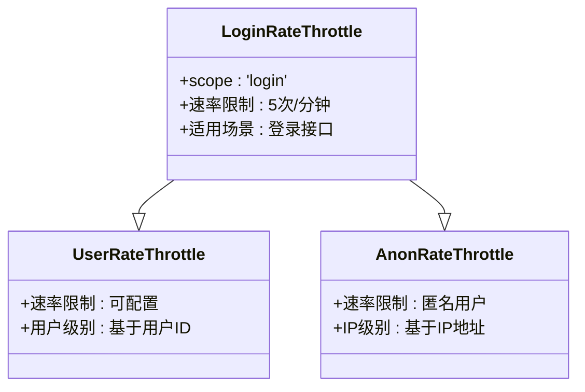

**图表来源**
- [throttles.py](file://backend/common/throttles.py#L11-L30)

### 速率限制配置

| 用户类型 | 速率限制 | 时间窗口 |
|----------|----------|----------|
| 已认证用户 | 5次/分钟 | 1分钟 |
| 匿名用户 | 5次/分钟 | 1分钟 |
| 支付操作 | 10次/分钟 | 1分钟 |

### CSRF豁免策略

密码登录接口采用CSRF豁免策略：

- **豁免原因**：登录接口需要跨域访问，CSRF保护可能影响用户体验
- **安全替代**：依赖HTTPS传输和速率限制提供安全保障
- **环境差异**：仅在特定场景下豁免，确保整体安全

### 生产环境安全建议

1. **强制HTTPS**：生产环境必须启用SSL/TLS加密
2. **严格CORS**：限制允许的域名范围
3. **环境变量**：敏感配置通过环境变量管理
4. **日志监控**：记录登录尝试和失败事件
5. **定期审计**：定期检查用户权限和访问日志

**章节来源**
- [throttles.py](file://backend/common/throttles.py#L11-L30)
- [views.py](file://backend/users/views.py#L158-L159)

## 前端登录实现

### 登录表单组件

前端登录页面使用Ant Design组件库构建，提供简洁直观的用户界面。

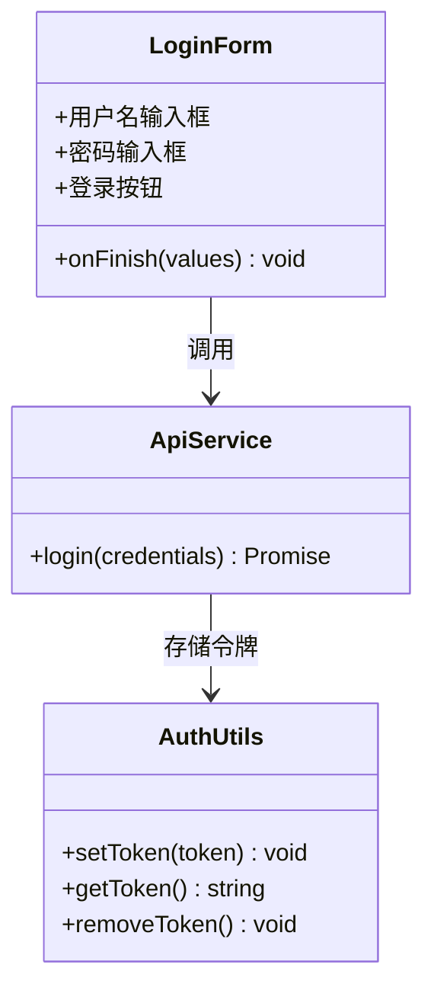

**图表来源**
- [index.tsx](file://merchant/src/pages/Login/index.tsx#L8-L20)
- [auth.ts](file://merchant/src/utils/auth.ts#L1-L13)

### 认证流程

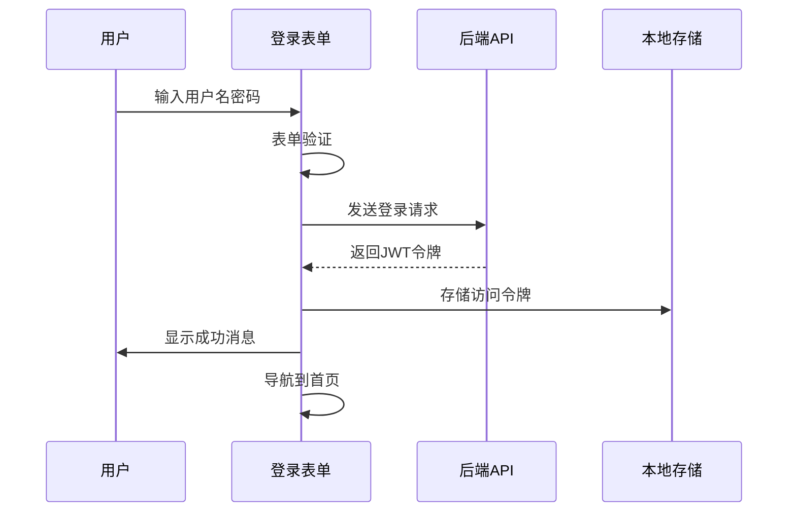

**图表来源**
- [index.tsx](file://merchant/src/pages/Login/index.tsx#L11-L20)

### 错误处理机制

前端实现了完善的错误处理：

- **表单验证**：客户端验证必填字段
- **网络错误**：捕获API调用异常
- **认证失败**：显示友好错误消息
- **状态管理**：使用全局状态管理认证状态

**章节来源**
- [index.tsx](file://merchant/src/pages/Login/index.tsx#L1-L42)
- [auth.ts](file://merchant/src/utils/auth.ts#L1-L13)

## 环境配置与部署

### 开发环境配置

开发环境采用宽松的安全策略，便于开发者调试：

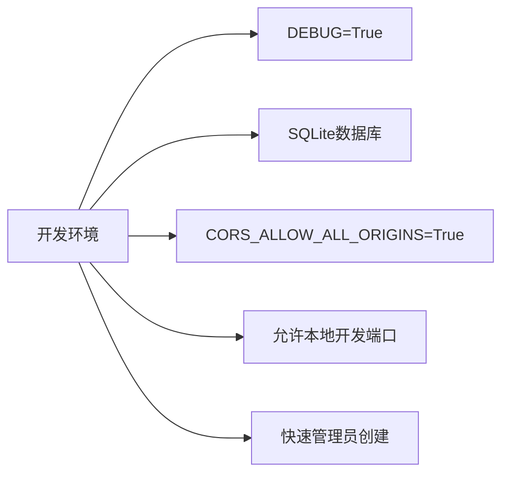

**图表来源**
- [development.py](file://backend/backend/settings/development.py#L1-L20)

### 生产环境配置

生产环境采用严格的安全配置：

| 配置项 | 开发环境 | 生产环境 | 安全考虑 |
|--------|----------|----------|----------|
| DEBUG | True | False | 避免泄露敏感信息 |
| 数据库 | SQLite | PostgreSQL | 性能和可靠性 |
| CORS | 允许所有 | 严格限制 | 防止跨域攻击 |
| SSL | 可选 | 必须 | 数据传输加密 |
| 密钥 | 默认值 | 环境变量 | 密钥安全性 |

### 环境检测机制

系统通过EnvironmentConfig类自动检测运行环境：

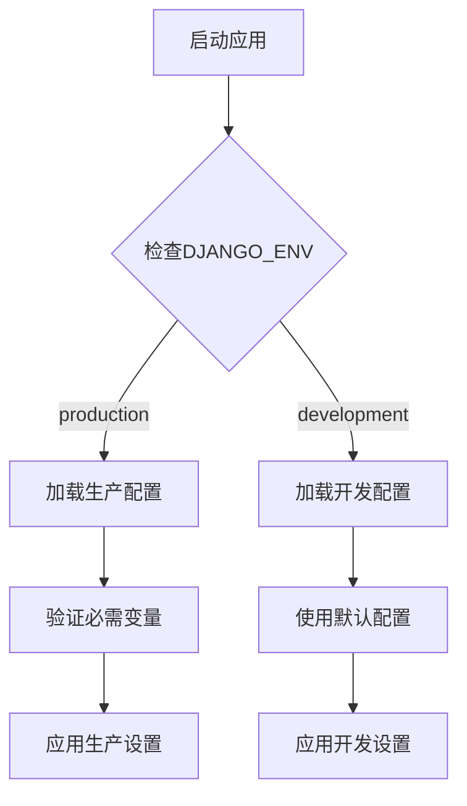

**图表来源**
- [env_config.py](file://backend/backend/settings/env_config.py#L37-L94)

**章节来源**
- [development.py](file://backend/backend/settings/development.py#L1-L20)
- [production.py](file://backend/backend/settings/production.py#L1-L35)
- [env_config.py](file://backend/backend/settings/env_config.py#L37-L94)

## 故障排除指南

### 常见登录问题

| 问题描述 | 可能原因 | 解决方案 |
|----------|----------|----------|
| 用户名或密码错误 | 凭据输入错误 | 检查用户名密码是否正确 |
| 无管理员权限 | 系统已有管理员 | 联系现有管理员提升权限 |
| 无法创建管理员 | 系统已有管理员 | 使用现有管理员账户登录 |
| 速率限制错误 | 登录尝试过于频繁 | 等待一段时间后重试 |
| CSRF错误 | 跨域请求问题 | 检查CORS配置和请求头 |

### 调试技巧

1. **检查环境变量**：确认生产环境配置正确
2. **查看日志**：分析服务器端错误日志
3. **网络抓包**：检查API请求和响应
4. **浏览器控制台**：查看前端JavaScript错误
5. **数据库查询**：验证用户数据状态

### 性能优化建议

- **缓存策略**：合理使用Redis缓存用户信息
- **数据库索引**：为username字段添加索引
- **连接池**：配置数据库连接池
- **CDN加速**：静态资源使用CDN分发
- **负载均衡**：多实例部署分散压力

**章节来源**
- [views.py](file://backend/users/views.py#L186-L203)
- [throttles.py](file://backend/common/throttles.py#L11-L30)

## 总结

密码登录系统通过精心设计的架构和安全策略，为商户管理后台提供了可靠的身份认证机制。系统的核心优势包括：

1. **智能初始化**：自动创建首个管理员账户，简化部署流程
2. **权限控制**：严格的权限提升策略，确保系统安全
3. **安全防护**：多重安全措施，有效防范各种攻击
4. **环境适配**：灵活的环境配置，适应不同部署需求
5. **开发友好**：完善的开发工具和调试支持

通过遵循本文档的指导和最佳实践，可以确保密码登录系统的稳定运行和高安全性。