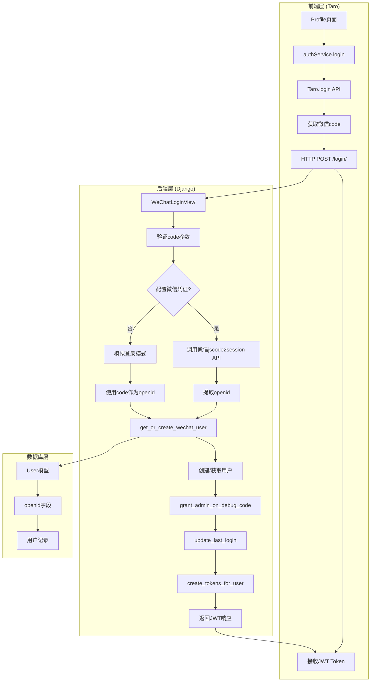
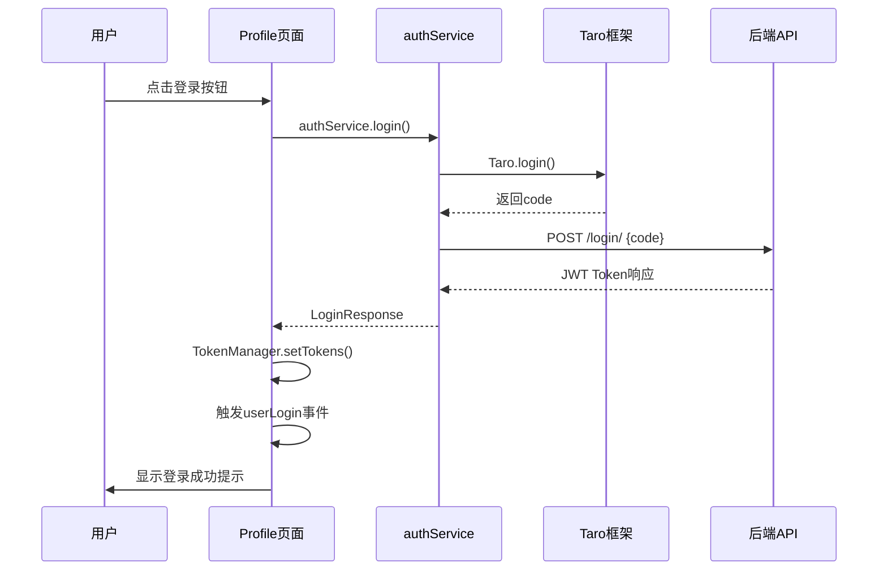
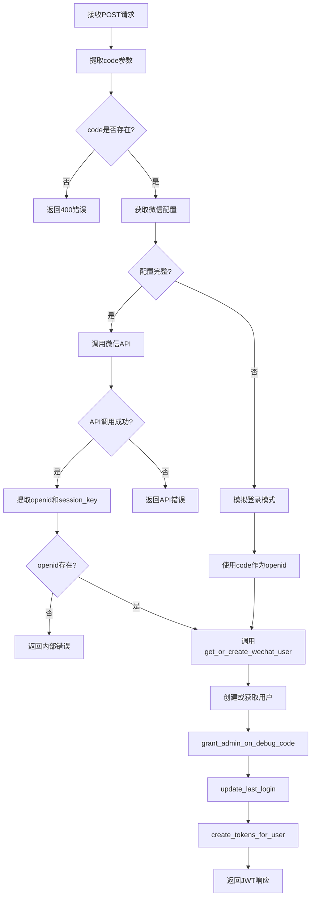
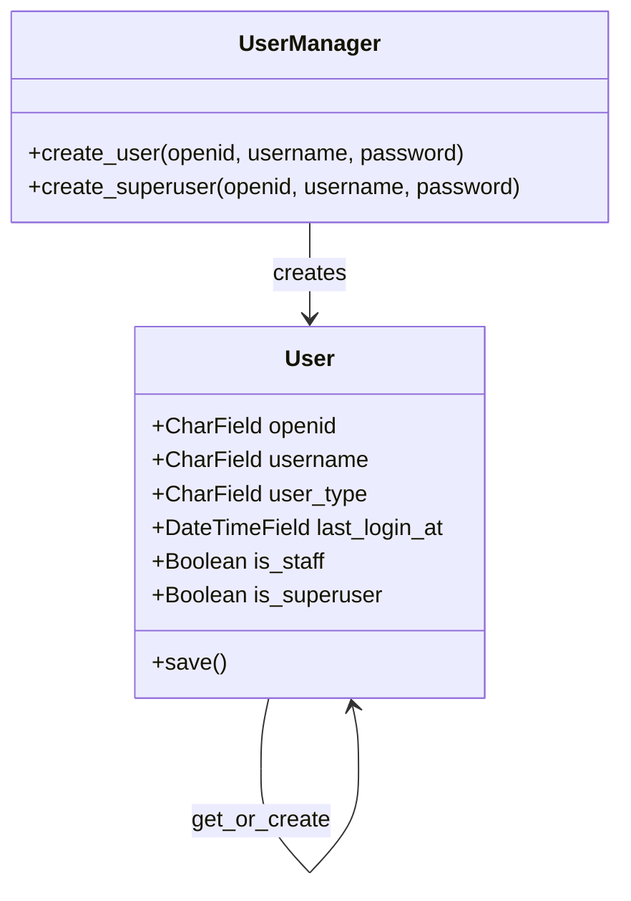
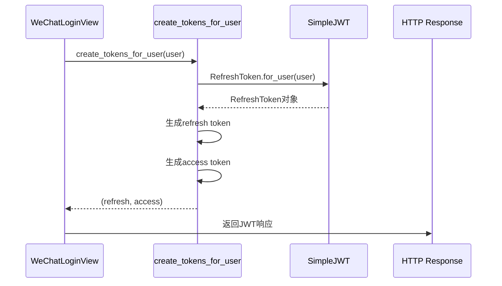

# 微信小程序登录流程完整实现分析

<cite>
**本文档引用的文件**
- [auth.ts](file://frontend/src/services/auth.ts)
- [request.ts](file://frontend/src/utils/request.ts)
- [profile/index.tsx](file://frontend/src/pages/profile/index.tsx)
- [users/views.py](file://backend/users/views.py)
- [users/services.py](file://backend/users/services.py)
- [users/models.py](file://backend/users/models.py)
- [users/urls.py](file://backend/users/urls.py)
- [development.py](file://backend/backend/settings/development.py)
- [production.py](file://backend/backend/settings/production.py)
- [base.py](file://backend/backend/settings/base.py)
- [env_config.py](file://backend/backend/settings/env_config.py)
- [index.ts](file://frontend/src/types/index.ts)
</cite>

## 目录
1. [系统架构概览](#系统架构概览)
2. [前端登录实现](#前端登录实现)
3. [后端登录处理](#后端登录处理)
4. [用户身份验证流程](#用户身份验证流程)
5. [Token管理机制](#token管理机制)
6. [开发环境配置](#开发环境配置)
7. [安全注意事项](#安全注意事项)
8. [故障排除指南](#故障排除指南)
9. [总结](#总结)

## 系统架构概览

微信小程序登录系统采用前后端分离架构，通过Taro框架构建前端应用，Django REST framework提供后端API服务。整个登录流程涉及微信小程序SDK、后端服务器、数据库等多个组件的协同工作。

**图表来源**
- [auth.ts](file://frontend/src/services/auth.ts#L7-L10)
- [users/views.py](file://backend/users/views.py#L21-L158)
- [users/services.py](file://backend/users/services.py#L5-L24)

## 前端登录实现

### authService.login() 方法

前端登录的核心实现在 `authService.login()` 函数中，该函数负责调用Taro框架的登录API并处理响应。

**图表来源**
- [auth.ts](file://frontend/src/services/auth.ts#L7-L10)
- [profile/index.tsx](file://frontend/src/pages/profile/index.tsx#L28-L45)

### Profile页面登录逻辑

Profile页面实现了完整的登录状态管理和用户界面交互逻辑：

1. **登录状态检测**: 使用 `useDidShow` 生命周期钩子在页面显示时检查Token
2. **登录触发**: `handleLogin()` 方法处理用户点击登录的操作
3. **Token存储**: 成功登录后调用 `TokenManager.setTokens()` 存储JWT令牌
4. **事件通知**: 触发 `userLogin` 事件通知其他页面更新状态

**章节来源**
- [profile/index.tsx](file://frontend/src/pages/profile/index.tsx#L13-L45)

### Token管理机制

前端通过 `TokenManager` 类实现完整的Token生命周期管理：

- **获取Token**: `getAccessToken()` 和 `getRefreshToken()` 方法
- **存储Token**: `setTokens()` 方法持久化存储
- **清理Token**: `clearTokens()` 方法清除过期令牌
- **自动刷新**: `refreshAccessToken()` 方法实现Token自动续期

**章节来源**
- [request.ts](file://frontend/src/utils/request.ts#L19-L58)

## 后端登录处理

### WeChatLoginView 核心逻辑

后端登录处理的核心在 `WeChatLoginView` 类中，该视图负责验证微信code并返回JWT令牌。

**图表来源**
- [users/views.py](file://backend/users/views.py#L49-L154)

### 微信API调用流程

当配置了微信AppID和Secret时，系统会调用微信官方的 `jscode2session` 接口：

1. **构建API请求**: 使用标准的微信API URL格式
2. **超时控制**: 设置10秒超时防止长时间等待
3. **错误处理**: 处理网络异常和微信API返回的错误码
4. **数据验证**: 确保返回数据包含必要的openid字段

**章节来源**
- [users/views.py](file://backend/users/views.py#L72-L118)

### 模拟登录模式

在开发环境中，如果未配置微信凭证，系统会启用模拟登录模式：

- **简化流程**: 直接使用传入的code作为openid
- **调试便利**: 方便开发者在无微信配置的情况下进行功能测试
- **安全限制**: 仅在DEBUG模式下可用，确保生产环境的安全性

**章节来源**
- [users/views.py](file://backend/users/views.py#L65-L70)

## 用户身份验证流程

### get_or_create_wechat_user 函数

该函数负责根据微信openid创建或获取用户记录：

**图表来源**
- [users/models.py](file://backend/users/models.py#L31-L74)
- [users/services.py](file://backend/users/services.py#L5-L7)

### 用户类型管理

系统支持两种用户类型：

1. **微信用户**: 通过微信小程序登录，`user_type='wechat'`
2. **管理员**: 通过密码登录或模拟登录获得，`user_type='admin'`

管理员权限通过 `grant_admin_on_debug_code` 函数在特定条件下授予。

**章节来源**
- [users/services.py](file://backend/users/services.py#L8-L16)

### 最后登录时间更新

每次用户登录时，系统都会更新用户的最后登录时间，便于后续的用户活跃度分析和账户管理。

**章节来源**
- [users/services.py](file://backend/users/services.py#L18-L21)

## Token管理机制

### JWT Token生成

系统使用Django REST framework SimpleJWT库生成JWT令牌：

**图表来源**
- [users/services.py](file://backend/users/services.py#L22-L24)
- [users/views.py](file://backend/users/views.py#L144-L145)

### Token刷新机制

前端实现了自动Token刷新机制：

1. **请求拦截**: 每次API请求都会检查Access Token的有效性
2. **自动刷新**: 当Access Token过期时，自动使用Refresh Token获取新Token
3. **失败处理**: 如果Refresh Token也过期，则要求用户重新登录

**章节来源**
- [request.ts](file://frontend/src/utils/request.ts#L39-L58)

## 开发环境配置

### 环境变量设置

开发环境的微信登录配置相对简单，主要关注以下几点：

1. **环境检测**: 通过 `DEBUG` 变量判断当前环境
2. **模拟登录**: 在未配置微信凭证时自动启用模拟模式
3. **快速调试**: 支持特殊的 `admin` code前缀实现快速管理员登录

### 模拟登录的特殊功能

在开发环境中，系统提供了便捷的管理员登录功能：

- **Admin Code**: 任何以 `admin` 开头的code都会被识别为管理员登录
- **自动授权**: 自动将用户设置为超级管理员权限
- **类型变更**: 将用户类型从 `wechat` 改为 `admin`

**章节来源**
- [users/services.py](file://backend/users/services.py#L8-L16)

### 生产环境配置要求

生产环境需要严格的安全配置：

1. **微信凭证**: 必须正确配置 `WECHAT_APPID` 和 `WECHAT_SECRET`
2. **SSL加密**: 强制HTTPS连接
3. **严格的CORS策略**: 限制允许的域名范围
4. **强密钥**: 使用足够强度的 `SECRET_KEY`

**章节来源**
- [production.py](file://backend/backend/settings/production.py#L1-L35)
- [base.py](file://backend/backend/settings/base.py#L227-L233)

## 安全注意事项

### 微信凭证保护

1. **敏感信息**: 微信AppID和Secret属于敏感信息，不能硬编码在代码中
2. **环境隔离**: 开发和生产环境的凭证应该完全隔离
3. **定期轮换**: 生产环境的凭证应该定期轮换

### Token安全

1. **传输安全**: 所有Token都应该通过HTTPS传输
2. **存储安全**: 前端应该安全地存储Token，避免XSS攻击
3. **过期机制**: 实现合理的Token过期和刷新机制
4. **权限控制**: 不同类型的用户应该有不同的权限边界

### 开发环境限制

1. **模拟登录限制**: 模拟登录功能仅在开发环境可用
2. **Admin权限限制**: 管理员权限授予应该有明确的边界
3. **日志记录**: 所有的登录尝试都应该被记录以便审计

## 故障排除指南

### 常见问题及解决方案

#### 1. 微信登录失败

**症状**: 前端调用 `Taro.login()` 失败或后端返回微信API错误

**可能原因**:
- 微信AppID或Secret配置错误
- 网络连接问题
- 微信服务器暂时不可用

**解决方法**:
- 检查环境变量配置
- 验证网络连接
- 查看后端日志获取详细错误信息

#### 2. Token获取失败

**症状**: 登录成功但无法获取有效的JWT Token

**可能原因**:
- 用户创建失败
- Token生成配置错误
- 数据库连接问题

**解决方法**:
- 检查用户模型定义
- 验证JWT配置
- 确认数据库连接状态

#### 3. 开发环境模拟登录问题

**症状**: 在开发环境中无法使用模拟登录功能

**可能原因**:
- DEBUG模式未启用
- 环境变量配置错误
- 特殊code格式不正确

**解决方法**:
- 确认 `DEBUG=True`
- 检查环境变量设置
- 使用正确的code格式（如 `admin123`）

### 调试技巧

1. **查看后端日志**: 关键的日志信息可以帮助定位问题
2. **检查网络请求**: 使用浏览器开发者工具查看API请求和响应
3. **验证Token**: 使用JWT解码工具查看Token内容
4. **数据库检查**: 直接查询数据库确认用户记录状态

## 总结

微信小程序登录系统通过前后端协作实现了完整的身份验证流程。前端使用Taro框架的登录API获取微信code，后端通过微信官方API验证code并创建用户记录，最终返回JWT令牌供客户端使用。

### 主要特点

1. **双模式支持**: 支持真实的微信登录和开发环境的模拟登录
2. **灵活的权限管理**: 支持普通用户和管理员的不同权限级别
3. **完善的Token机制**: 包含自动刷新和过期处理
4. **安全的环境区分**: 开发和生产环境采用不同的处理策略
5. **详细的错误处理**: 提供完整的错误信息和日志记录

### 最佳实践建议

1. **生产环境配置**: 严格按照生产环境要求配置所有安全参数
2. **监控和日志**: 建立完善的监控和日志系统
3. **定期安全审计**: 定期检查和更新安全配置
4. **用户体验优化**: 提供清晰的错误提示和加载状态

这个登录系统为微信小程序应用提供了稳定、安全、易用的身份验证解决方案，能够满足从小型项目到大型商业应用的各种需求。