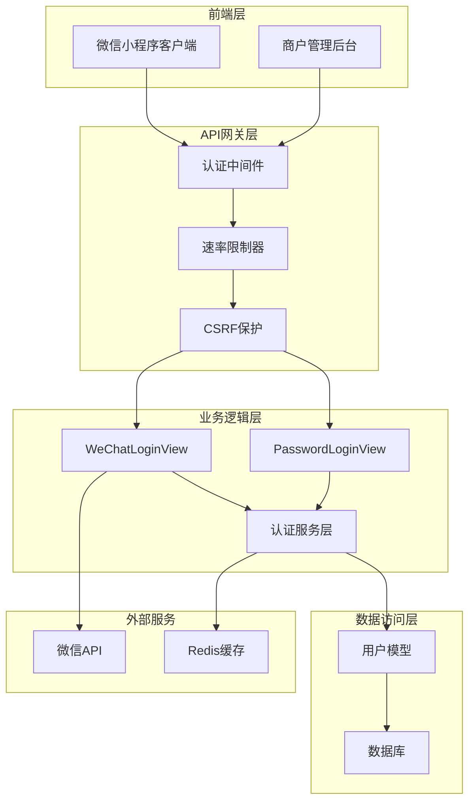
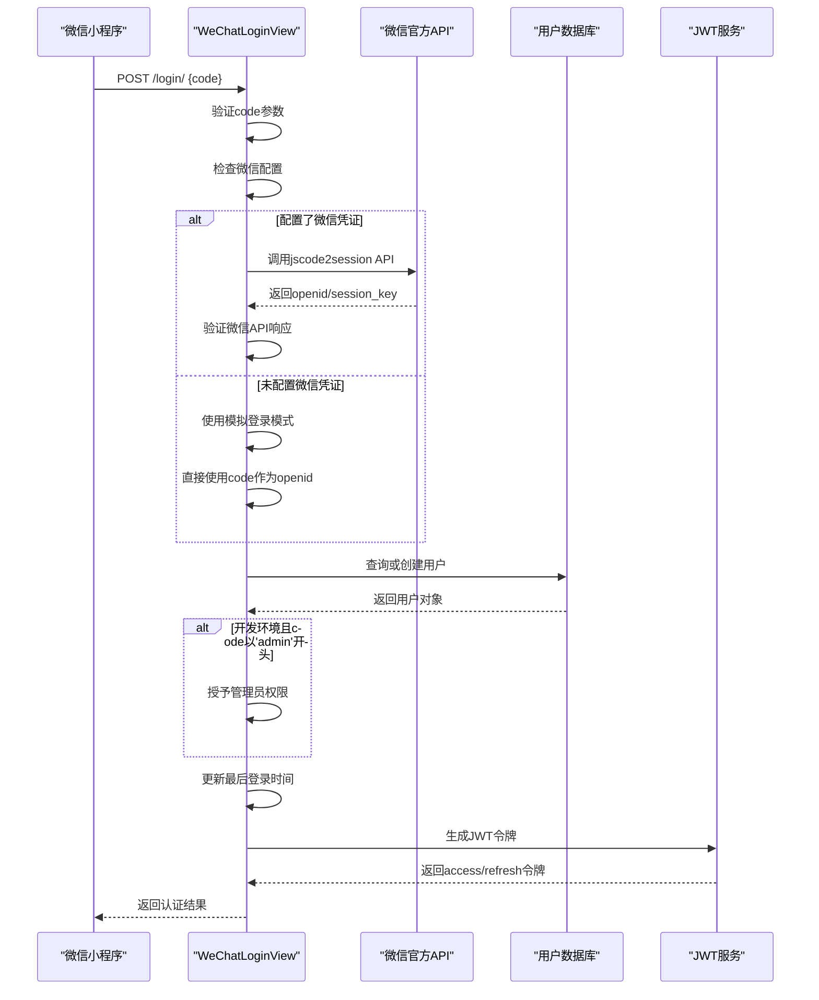
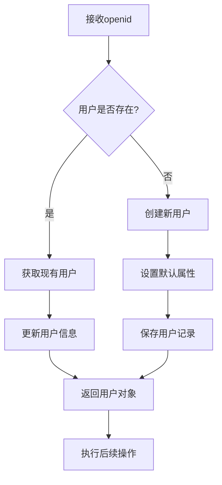
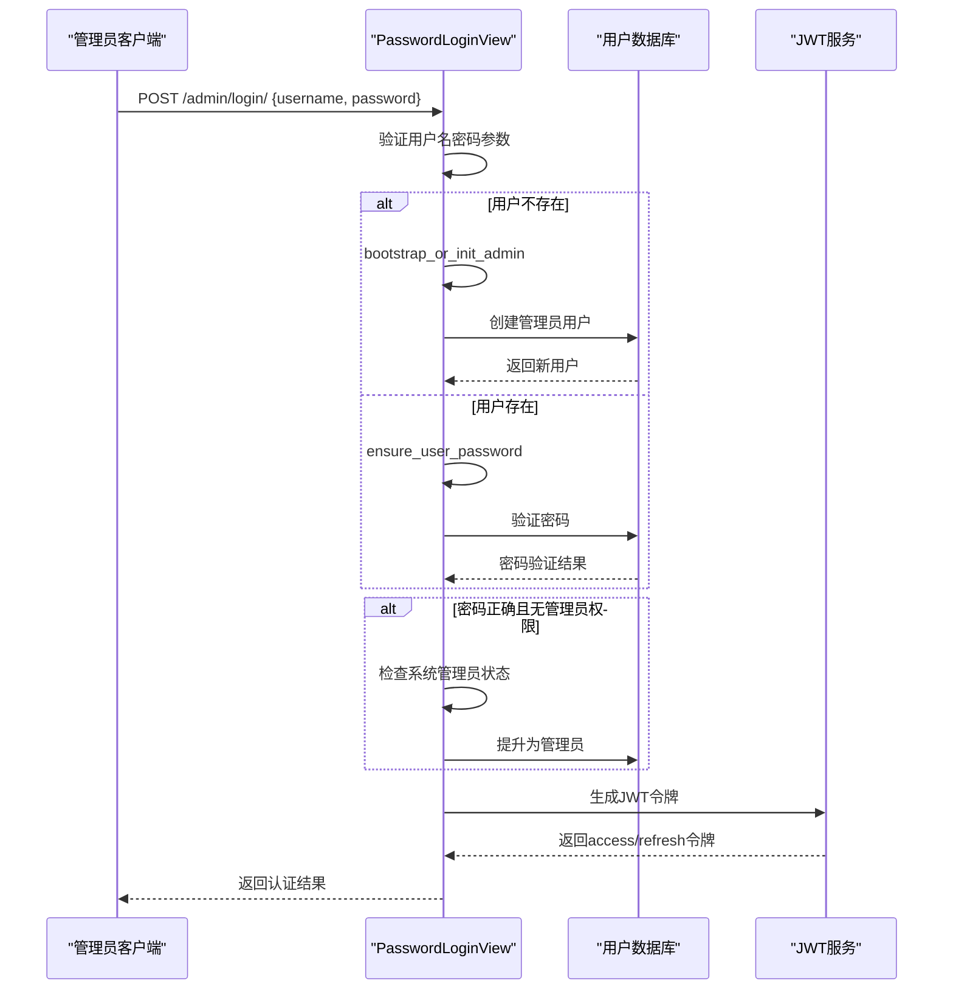
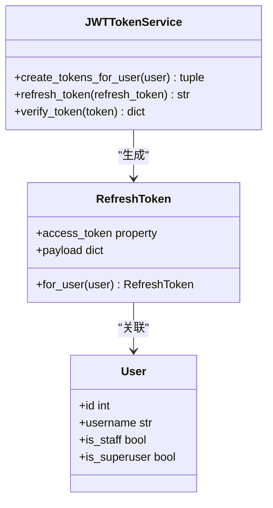
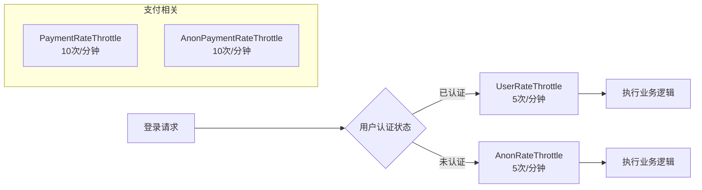
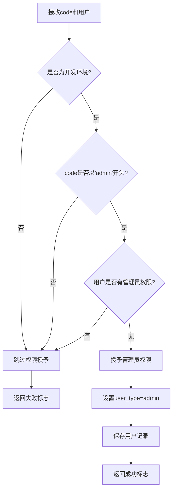

# 认证逻辑

<cite>
**本文档中引用的文件**
- [backend/users/views.py](file://backend/users/views.py)
- [backend/users/services.py](file://backend/users/services.py)
- [backend/users/models.py](file://backend/users/models.py)
- [backend/users/urls.py](file://backend/users/urls.py)
- [backend/users/management/commands/reset_admin.py](file://backend/users/management/commands/reset_admin.py)
- [backend/common/throttles.py](file://backend/common/throttles.py)
- [backend/backend/settings/env_config.py](file://backend/backend/settings/env_config.py)
- [backend/backend/settings/base.py](file://backend/backend/settings/base.py)
- [frontend/src/services/auth.ts](file://frontend/src/services/auth.ts)
- [merchant/src/services/api.ts](file://merchant/src/services/api.ts)
- [merchant/src/utils/auth.ts](file://merchant/src/utils/auth.ts)
- [api.md](file://api.md)
</cite>

## 目录
1. [简介](#简介)
2. [项目架构概览](#项目架构概览)
3. [微信小程序登录流程](#微信小程序登录流程)
4. [密码登录机制](#密码登录机制)
5. [JWT令牌系统](#jwt令牌系统)
6. [安全防护措施](#安全防护措施)
7. [系统初始化与管理员创建](#系统初始化与管理员创建)
8. [认证接口设计](#认证接口设计)
9. [前端认证集成](#前端认证集成)
10. [安全最佳实践](#安全最佳实践)
11. [故障排除指南](#故障排除指南)

## 简介

本系统采用双模式认证架构，支持微信小程序用户和管理员用户的双重认证方式。系统基于Django REST framework构建，使用JWT（JSON Web Token）作为认证令牌，实现了完整的用户身份验证、授权管理和会话控制机制。

核心特性包括：
- **微信小程序登录**：基于微信官方API的标准化登录流程
- **管理员密码登录**：支持用户名密码认证的管理后台登录
- **JWT令牌管理**：完整的令牌生成、刷新和过期处理机制
- **速率限制保护**：针对登录接口的防暴力破解保护
- **开发环境特权**：特殊code授予管理员权限的开发便利功能

## 项目架构概览

系统采用分层架构设计，认证相关组件分布在以下层次：

**图表来源**
- [backend/users/views.py](file://backend/users/views.py#L23-L158)
- [backend/users/services.py](file://backend/users/services.py#L1-L54)
- [backend/common/throttles.py](file://backend/common/throttles.py#L11-L78)

**章节来源**
- [backend/users/views.py](file://backend/users/views.py#L1-L158)
- [backend/users/services.py](file://backend/users/services.py#L1-L54)

## 微信小程序登录流程

### 核心登录机制

微信小程序登录是系统的主要认证入口，采用标准的OAuth 2.0授权码模式：

**图表来源**
- [backend/users/views.py](file://backend/users/views.py#L49-L154)
- [backend/users/services.py](file://backend/users/services.py#L5-L25)

### Code验证与OpenID获取

系统实现了灵活的微信API调用机制，支持两种运行模式：

1. **生产/开发环境**：调用微信官方API验证code
2. **开发环境**：使用模拟登录模式简化调试

**章节来源**
- [backend/users/views.py](file://backend/users/views.py#L49-L154)
- [backend/users/services.py](file://backend/users/services.py#L5-L25)

### 用户创建与检索机制

系统采用"查询-创建-更新"的原子性操作模式：

**图表来源**
- [backend/users/services.py](file://backend/users/services.py#L5-L7)

**章节来源**
- [backend/users/services.py](file://backend/users/services.py#L5-L7)

## 密码登录机制

### 管理员登录流程

管理员密码登录提供了传统Web应用的认证体验：

**图表来源**
- [backend/users/views.py](file://backend/users/views.py#L162-L221)
- [backend/users/services.py](file://backend/users/services.py#L26-L54)

### bootstrap_or_init_admin实现

该函数负责系统初始化阶段的管理员账户创建：

**章节来源**
- [backend/users/views.py](file://backend/users/views.py#L162-L221)
- [backend/users/services.py](file://backend/users/services.py#L26-L54)

## JWT令牌系统

### 令牌生成机制

系统使用Django REST framework SimpleJWT实现JWT令牌管理：

**图表来源**
- [backend/users/services.py](file://backend/users/services.py#L22-L25)

### 令牌生命周期管理

| 令牌类型 | 有效期限 | 刷新策略 | 安全级别 |
|---------|---------|---------|---------|
| Access Token | 15分钟 | 自动刷新 | 中等 |
| Refresh Token | 7天 | 手动刷新 | 高 |
| Session Key | 2小时 | 微信API管理 | 高 |

**章节来源**
- [backend/users/services.py](file://backend/users/services.py#L22-L25)

## 安全防护措施

### 速率限制机制

系统实现了多层次的速率限制保护：

**图表来源**
- [backend/common/throttles.py](file://backend/common/throttles.py#L11-L78)

### CSRF豁免策略

认证接口采用CSRF豁免设计，因为JWT令牌本身提供了足够的安全性：

**章节来源**
- [backend/users/views.py](file://backend/users/views.py#L157-L161)
- [backend/common/throttles.py](file://backend/common/throttles.py#L11-L78)

### 敏感信息处理

系统在多个层面确保敏感信息的安全：

1. **传输安全**：强制HTTPS加密传输
2. **存储安全**：密码使用Django内置哈希算法
3. **内存安全**：敏感数据及时清理
4. **日志安全**：过滤敏感信息输出

**章节来源**
- [backend/common/throttles.py](file://backend/common/throttles.py#L11-L78)

## 系统初始化与管理员创建

### grant_admin_on_debug_code机制

开发环境下的特殊权限授予机制：

**图表来源**
- [backend/users/services.py](file://backend/users/services.py#L8-L16)

### bootstrap_or_init_admin实现

系统启动时的管理员账户初始化逻辑：

**章节来源**
- [backend/users/services.py](file://backend/users/services.py#L26-L54)
- [backend/users/management/commands/reset_admin.py](file://backend/users/management/commands/reset_admin.py#L1-L67)

## 认证接口设计

### 接口路由结构

系统提供了清晰的认证接口路由设计：

| URL路径 | 方法 | 功能描述 | 权限要求 |
|---------|------|----------|----------|
| `/login/` | POST | 微信小程序登录 | 匿名 |
| `/password_login/` | POST | 管理员密码登录 | 匿名 |
| `/admin/login/` | POST | 管理员登录别名 | 匿名 |
| `/token/refresh/` | POST | JWT令牌刷新 | 已认证 |

**章节来源**
- [backend/users/urls.py](file://backend/users/urls.py#L1-L18)

### 接口安全设计

每个认证接口都采用了相应的安全措施：

1. **WeChatLoginView**：CSRF豁免，速率限制，微信API验证
2. **PasswordLoginView**：CSRF豁免，速率限制，密码验证
3. **TokenRefreshView**：标准JWT认证机制

**章节来源**
- [backend/users/views.py](file://backend/users/views.py#L23-L158)

## 前端认证集成

### 小程序端认证流程

微信小程序的认证流程封装在专门的服务模块中：

**章节来源**
- [frontend/src/services/auth.ts](file://frontend/src/services/auth.ts#L1-L22)

### 商户管理后台认证

商户管理后台使用类似的认证模式：

**章节来源**
- [merchant/src/services/api.ts](file://merchant/src/services/api.ts#L1-L66)
- [merchant/src/utils/auth.ts](file://merchant/src/utils/auth.ts#L1-L13)

## 安全最佳实践

### 配置管理

系统采用环境变量驱动的配置管理模式：

1. **生产环境**：严格的安全配置要求
2. **开发环境**：便利性优先的配置
3. **配置验证**：启动时的完整性检查

**章节来源**
- [backend/backend/settings/env_config.py](file://backend/backend/settings/env_config.py#L1-L252)
- [backend/backend/settings/development.py](file://backend/backend/settings/development.py#L1-L20)
- [backend/backend/settings/production.py](file://backend/backend/settings/production.py#L1-L35)

### 错误处理策略

系统实现了完善的错误处理机制：

1. **参数验证**：严格的输入验证
2. **异常捕获**：全面的异常处理
3. **日志记录**：详细的审计日志
4. **安全响应**：避免信息泄露的错误响应

**章节来源**
- [backend/users/views.py](file://backend/users/views.py#L49-L154)

## 故障排除指南

### 常见问题诊断

| 问题类型 | 症状描述 | 可能原因 | 解决方案 |
|---------|---------|---------|---------|
| 微信登录失败 | 返回errcode错误 | 微信凭证配置错误 | 检查WECHAT_APPID和WECHAT_SECRET |
| 令牌刷新失败 | 401 Unauthorized | Refresh Token过期 | 重新登录获取新令牌 |
| 速率限制 | 429 Too Many Requests | 登录频率过高 | 等待或调整客户端重试策略 |
| 权限拒绝 | 403 Forbidden | 用户无管理员权限 | 检查用户角色和权限设置 |

### 调试技巧

1. **启用调试模式**：设置DEBUG=True查看详细错误信息
2. **检查环境变量**：确认所有必需的环境变量已正确设置
3. **验证网络连接**：确保能够访问微信API和其他外部服务
4. **查看日志文件**：分析详细的错误日志信息

**章节来源**
- [backend/backend/settings/env_config.py](file://backend/backend/settings/env_config.py#L223-L252)

## 总结

本系统的认证逻辑设计体现了现代Web应用的安全性和可用性平衡。通过双模式认证、JWT令牌管理、多重安全防护和灵活的配置机制，系统能够满足微信小程序和管理后台的不同认证需求，同时保证了高安全性、高可用性和良好的开发体验。

关键优势包括：
- **多渠道认证**：支持微信小程序和传统Web应用
- **安全可靠**：完善的令牌管理和安全防护机制
- **开发友好**：灵活的开发环境配置和调试支持
- **易于扩展**：模块化的设计便于功能扩展和维护