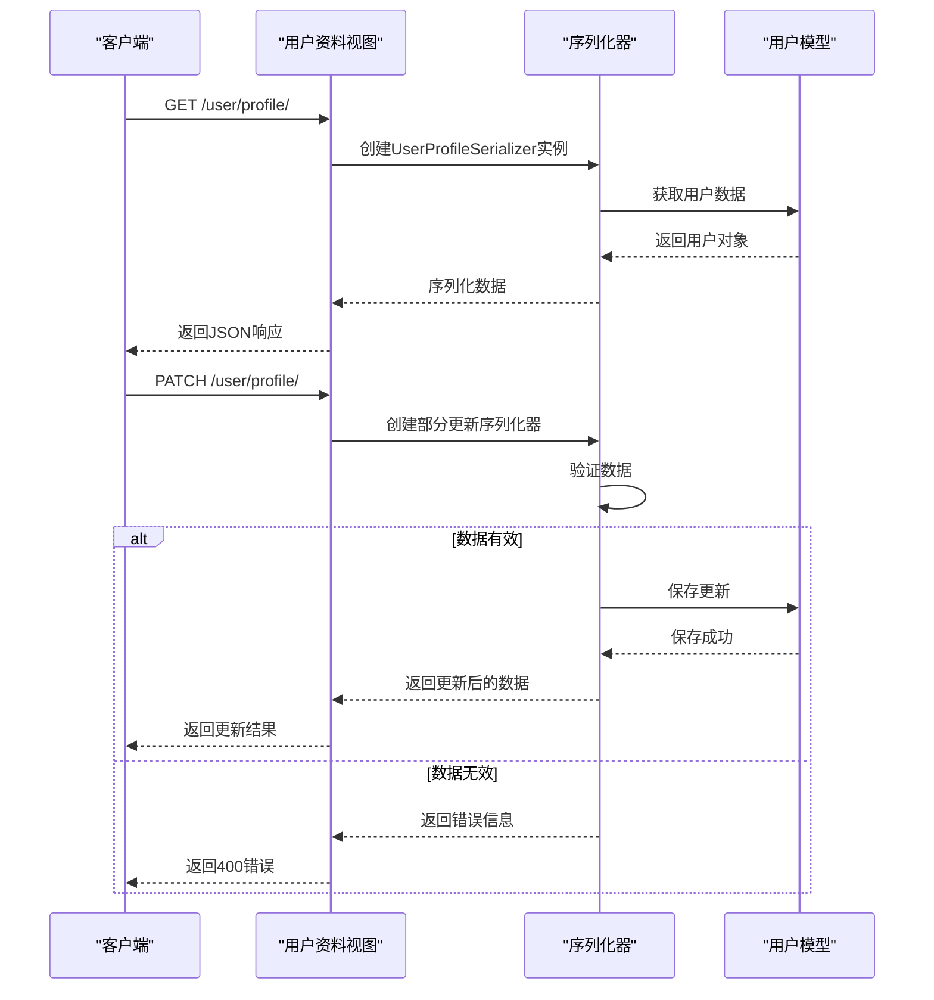

# 资料管理逻辑

<cite>
**本文档引用的文件**
- [backend/users/models.py](file://backend/users/models.py)
- [backend/users/serializers.py](file://backend/users/serializers.py)
- [backend/users/views.py](file://backend/users/views.py)
- [backend/users/services.py](file://backend/users/services.py)
- [backend/users/migrations/0004_user_avatar_url_user_phone_alter_user_email.py](file://backend/users/migrations/0004_user_avatar_url_user_phone_alter_user_email.py)
- [backend/users/migrations/0009_user_last_login_at_user_user_type_alter_user_openid.py](file://backend/users/migrations/0009_user_last_login_at_user_user_type_alter_user_openid.py)
- [backend/users/migrations/0003_address.py](file://backend/users/migrations/0003_address.py)
- [frontend/src/pages/profile-edit/index.tsx](file://frontend/src/pages/profile-edit/index.tsx)
- [frontend/src/services/auth.ts](file://frontend/src/services/auth.ts)
- [frontend/src/types/index.ts](file://frontend/src/types/index.ts)
</cite>

## 目录
1. [项目概述](#项目概述)
2. [核心数据模型](#核心数据模型)
3. [用户资料序列化器](#用户资料序列化器)
4. [用户资料更新服务](#用户资料更新服务)
5. [用户登录与认证](#用户登录与认证)
6. [用户资料管理视图](#用户资料管理视图)
7. [默认用户名生成策略](#默认用户名生成策略)
8. [安全考虑与最佳实践](#安全考虑与最佳实践)
9. [常见问题解决方案](#常见问题解决方案)
10. [总结](#总结)

## 项目概述

本项目是一个基于Django和React的小程序电商系统，用户资料管理是其核心功能之一。系统支持微信小程序登录和传统用户名密码登录两种认证方式，提供了完整的用户资料管理功能，包括头像、手机号、邮箱等敏感信息的更新。

### 主要特性

- **双认证支持**：同时支持微信小程序和传统用户名密码登录
- **灵活的用户资料管理**：支持部分字段更新和全量更新
- **安全的敏感信息处理**：对头像、手机号、邮箱等信息进行专门的安全考虑
- **智能缓存机制**：通过Redis缓存提高用户统计信息的查询效率
- **完善的权限控制**：基于角色的访问控制和操作权限管理

## 核心数据模型

### User模型结构


**图表来源**
- [backend/users/models.py](file://backend/users/models.py#L31-L71)

### 关键字段说明

| 字段名 | 类型 | 描述 | 默认值 | 约束 |
|--------|------|------|--------|------|
| `id` | BigAutoField | 主键标识 | 自增 | 主键 |
| `openid` | CharField | 微信用户唯一标识 | null | 唯一，可空 |
| `username` | CharField | 用户名 | 自动生成 | 唯一，可空，默认值 |
| `avatar_url` | URLField | 头像链接 | 默认Gravatar | 可空 |
| `phone` | CharField | 手机号码 | null | 可空，最大长度20 |
| `email` | EmailField | 电子邮箱 | null | 可空 |
| `user_type` | CharField | 用户类型 | 'wechat' | 枚举：wechat/admin |
| `last_login_at` | DateTimeField | 最后登录时间 | null | 可空 |

**章节来源**
- [backend/users/models.py](file://backend/users/models.py#L31-L64)

## 用户资料序列化器

### UserProfileSerializer设计

UserProfileSerializer是用户资料管理的核心序列化器，负责处理用户资料的验证和序列化。


**图表来源**
- [backend/users/serializers.py](file://backend/users/serializers.py#L43-L54)

### 序列化器字段配置

UserProfileSerializer只包含以下四个核心字段：

| 字段 | 类型 | 验证规则 | 安全考虑 |
|------|------|----------|----------|
| `username` | CharField | 必填，唯一性验证 | 防止重复用户名 |
| `avatar_url` | URLField | URL格式验证 | 防止恶意链接 |
| `phone` | CharField | 可选，长度限制 | 保护隐私信息 |
| `email` | EmailField | 可选，邮箱格式验证 | 验证有效性 |

### 数据验证机制

虽然当前的`validate`方法没有实现复杂的验证逻辑，但序列化器本身提供了基础的验证功能：

- **字段类型验证**：确保数据类型正确
- **长度限制验证**：防止过长的数据存储
- **格式验证**：如邮箱格式、URL格式等
- **唯一性验证**：用户名字段的唯一性约束

**章节来源**
- [backend/users/serializers.py](file://backend/users/serializers.py#L43-L54)

## 用户资料更新服务

### update_last_login服务函数

update_last_login函数是用户登录后更新最后登录时间的核心服务。


**图表来源**
- [backend/users/services.py](file://backend/users/services.py#L18-L20)
- [backend/users/views.py](file://backend/users/views.py#L122-L123)

### 更新机制详解

update_last_login函数的实现非常简洁但功能明确：

1. **时间戳更新**：使用`timezone.now()`获取当前时间
2. **选择性保存**：通过`update_fields=['last_login_at']`优化数据库写入
3. **原子性操作**：确保时间更新的原子性

### 性能优化考虑

- **批量更新**：只更新特定字段，减少不必要的数据库操作
- **时区处理**：使用Django的时区支持，确保时间准确性
- **异步处理**：可以在高并发场景下考虑异步更新

**章节来源**
- [backend/users/services.py](file://backend/users/services.py#L18-L20)

## 用户登录与认证

### 双重认证体系

系统实现了双重认证机制，支持微信小程序和传统用户名密码两种登录方式。


**图表来源**
- [backend/users/views.py](file://backend/users/views.py#L22-L154)

### 微信登录流程

微信登录是系统的主要认证方式，支持小程序端的无缝登录体验：

1. **code获取**：从小程序端获取授权code
2. **API调用**：调用微信官方API验证code
3. **用户创建**：根据openid创建或获取用户记录
4. **权限检查**：验证用户权限级别
5. **时间更新**：记录最后登录时间
6. **令牌生成**：生成JWT访问令牌

### 密码登录流程

密码登录主要用于后台管理和管理员操作：

1. **凭据验证**：验证用户名和密码
2. **权限检查**：确认管理员权限
3. **用户初始化**：首次登录时初始化管理员账户
4. **安全检查**：确保密码安全性

**章节来源**
- [backend/users/views.py](file://backend/users/views.py#L22-L235)

## 用户资料管理视图

### user_profile视图函数

user_profile是用户资料管理的核心视图函数，支持GET和PATCH两种HTTP方法。



**图表来源**
- [backend/users/views.py](file://backend/users/views.py#L235-L247)

### PATCH请求处理机制

PATCH请求处理是用户资料部分更新的核心逻辑：

#### 请求处理流程

1. **身份验证**：确保用户已登录
2. **数据准备**：从请求体中提取更新数据
3. **序列化器初始化**：创建带有部分更新标志的序列化器
4. **数据验证**：执行字段验证和业务规则检查
5. **数据保存**：保存验证通过的数据
6. **响应返回**：返回更新后的用户数据或错误信息

#### 部分更新特性

- **选择性更新**：只更新指定的字段
- **数据完整性**：保持未更新字段的原始值
- **验证隔离**：只验证被更新的字段
- **性能优化**：减少不必要的数据库操作

### 前端交互示例

前端通过profile-edit页面实现用户资料的编辑功能：


**图表来源**
- [frontend/src/pages/profile-edit/index.tsx](file://frontend/src/pages/profile-edit/index.tsx#L21-L91)
- [frontend/src/services/auth.ts](file://frontend/src/services/auth.ts#L12-L19)

**章节来源**
- [backend/users/views.py](file://backend/users/views.py#L235-L247)
- [frontend/src/pages/profile-edit/index.tsx](file://frontend/src/pages/profile-edit/index.tsx#L21-L91)

## 默认用户名生成策略

### generate_unique_username函数

generate_unique_username函数是系统自动生成用户名的核心算法。


**图表来源**
- [backend/users/models.py](file://backend/users/models.py#L25-L28)

### 生成策略详解

#### UUID生成机制

1. **UUID版本**：使用UUID4（随机生成）
2. **字符串截取**：只保留前16个字符，平衡唯一性和可读性
3. **前缀添加**：添加"用户_"前缀，便于识别和管理
4. **编码方式**：使用十六进制编码，确保ASCII兼容性

#### 唯一性保证

- **概率极低冲突**：UUID4的122位随机空间确保冲突概率极低
- **系统级保证**：Django的唯一性约束进一步保证
- **可预测性**：前缀和格式便于系统识别和处理

#### 性能考虑

- **计算成本**：UUID生成是CPU密集型操作，但频率较低
- **存储效率**：固定长度的字符串便于数据库索引
- **查询优化**：前缀可以用于快速查找和过滤

### 迁移历史

从迁移文件可以看出用户名生成策略的演进过程：

| 迁移版本 | 时间 | 变更内容 | 设计意图 |
|----------|------|----------|----------|
| 0005 | 2025-11-03 | 添加username字段，默认值 | 支持传统登录 |
| 0006 | 2025-11-03 | 修改default值 | 简化生成逻辑 |
| 0007 | 2025-11-03 | 移除blank=False | 放宽输入要求 |
| 0010 | 2025-11-15 | 再次添加blank=True | 平衡灵活性和约束 |

**章节来源**
- [backend/users/models.py](file://backend/users/models.py#L25-L28)
- [backend/users/migrations/0005_alter_user_username.py](file://backend/users/migrations/0005_alter_user_username.py#L14-L18)

## 安全考虑与最佳实践

### 敏感信息保护

#### 头像链接安全

头像URL字段的设计考虑了多方面的安全因素：

1. **默认值保护**：使用Gravatar默认头像，避免裸露用户信息
2. **URL验证**：通过URLField确保链接格式正确
3. **外部资源**：支持CDN和第三方头像服务
4. **大小限制**：URL长度限制防止注入攻击

#### 手机号和邮箱保护

- **可选字段**：手机号和邮箱都是可选的，尊重用户隐私
- **格式验证**：严格的格式验证防止恶意输入
- **唯一性约束**：防止重复注册
- **传输加密**：HTTPS确保数据传输安全

### 权限控制机制

#### 角色基础访问控制

系统实现了细粒度的权限控制：


#### 数据访问控制

- **个人信息保护**：用户只能访问和修改自己的资料
- **管理员特权**：管理员可以访问所有用户信息
- **审计日志**：记录所有敏感操作
- **最小权限原则**：只授予必要的权限

### 性能优化策略

#### 缓存机制

系统实现了多层次的缓存策略：

1. **用户统计缓存**：缓存订单统计信息，减少数据库查询
2. **用户资料缓存**：缓存用户基本信息，提高响应速度
3. **权限缓存**：缓存用户权限信息，减少权限检查开销

#### 数据库优化

- **索引策略**：为常用查询字段建立索引
- **查询优化**：使用select_related和prefetch_related
- **批量操作**：减少数据库连接次数

### 错误处理与监控

#### 异常处理机制

- **统一错误响应**：标准化的错误响应格式
- **详细错误信息**：提供具体的错误原因
- **用户友好提示**：避免暴露技术细节

#### 监控指标

- **登录成功率**：监控不同认证方式的成功率
- **响应时间**：跟踪API响应时间
- **错误率统计**：监控各类错误的发生频率

**章节来源**
- [backend/users/models.py](file://backend/users/models.py#L42-L51)
- [backend/users/views.py](file://backend/users/views.py#L250-L285)

## 常见问题解决方案

### 用户名冲突问题

#### 问题描述
在高并发场景下，可能会出现用户名生成冲突的情况。

#### 解决方案

1. **UUID去重检查**：
   ```python
   # 在生成用户名后进行检查
   while User.objects.filter(username=new_username).exists():
       new_username = "用户_" + str(uuid.uuid4())[:16]
   ```

2. **乐观锁机制**：
   ```python
   # 使用数据库事务确保唯一性
   with transaction.atomic():
       user = User.objects.create(username=generate_unique_username())
   ```

3. **重试机制**：
   ```python
   # 实现指数退避重试
   max_retries = 3
   for attempt in range(max_retries):
       try:
           user = User.objects.create(username=generate_unique_username())
           break
       except IntegrityError:
           if attempt == max_retries - 1:
               raise
           time.sleep(2 ** attempt)  # 指数退避
   ```

### 头像上传问题

#### 问题描述
用户上传头像时可能遇到格式不支持或文件过大等问题。

#### 解决方案

1. **文件类型验证**：
   ```python
   ALLOWED_IMAGE_TYPES = ['image/jpeg', 'image/png', 'image/gif']
   MAX_FILE_SIZE = 5 * 1024 * 1024  # 5MB
   
   def validate_image(file):
       if file.content_type not in ALLOWED_IMAGE_TYPES:
           raise ValidationError("不支持的文件类型")
       if file.size > MAX_FILE_SIZE:
           raise ValidationError("文件大小超过限制")
   ```

2. **缩略图生成**：
   ```python
   from PIL import Image
   import io
   
   def generate_thumbnail(image_file):
       img = Image.open(image_file)
       img.thumbnail((200, 200))
       thumbnail_io = io.BytesIO()
       img.save(thumbnail_io, format='JPEG', quality=85)
       return thumbnail_io.getvalue()
   ```

### 手机号和邮箱验证

#### 问题描述
用户输入的手机号或邮箱格式不正确。

#### 解决方案

1. **前端验证**：
   ```javascript
   // 前端正则表达式验证
   const phoneRegex = /^1[3-9]\d{9}$/;
   const emailRegex = /^[^\s@]+@[^\s@]+\.[^\s@]+$/;
   
   if (!phoneRegex.test(phone)) {
       showError("请输入有效的手机号");
   }
   ```

2. **后端验证**：
   ```python
   from django.core.validators import validate_email
   from django.core.exceptions import ValidationError
   
   def validate_phone(phone):
       if not re.match(r'^1[3-9]\d{9}$', phone):
           raise ValidationError("手机号格式不正确")
   
   def validate_email_format(email):
       try:
           validate_email(email)
       except ValidationError:
           raise ValidationError("邮箱格式不正确")
   ```

### 登录安全问题

#### 问题描述
防止暴力破解和恶意登录尝试。

#### 解决方案

1. **频率限制**：
   ```python
   from django_ratelimit.decorators import ratelimit
   
   @ratelimit(key='ip', rate='5/m', block=True)
   def wechat_login(request):
       # 登录逻辑
       pass
   ```

2. **验证码机制**：
   ```python
   def send_verification_code(phone):
       code = generate_random_code(6)
       cache.set(f'verify_code:{phone}', code, 300)  # 5分钟有效期
       send_sms(phone, f"您的验证码是：{code}")
   
   def verify_code(phone, code):
       stored_code = cache.get(f'verify_code:{phone}')
       if stored_code != code:
           raise ValidationError("验证码不正确")
   ```

### 数据一致性问题

#### 问题描述
在并发更新场景下可能出现数据不一致。

#### 解决方案

1. **乐观锁**：
   ```python
   class UserWithOptimisticLock(models.Model):
       username = models.CharField(max_length=150, unique=True)
       avatar_url = models.URLField()
       phone = models.CharField(max_length=20, blank=True, null=True)
       email = models.EmailField(blank=True, null=True)
       version = models.IntegerField(default=0)
       
       def save(self, *args, **kwargs):
           self.version += 1
           super().save(*args, **kwargs)
   ```

2. **悲观锁**：
   ```python
   def update_user_profile(user_id, data):
       with transaction.atomic():
           user = User.objects.select_for_update().get(id=user_id)
           # 执行更新操作
           user.save()
   ```

### 性能优化问题

#### 问题描述
大量用户同时访问导致性能下降。

#### 解决方案

1. **数据库连接池**：
   ```python
   DATABASES = {
       'default': {
           'ENGINE': 'django.db.backends.postgresql',
           'CONN_MAX_AGE': 60,
           'OPTIONS': {
               'max_connections': 100,
               'keepalives_idle': 30,
           }
       }
   }
   ```

2. **缓存策略**：
   ```python
   @cache_response(300)  # 缓存5分钟
   def get_user_profile(user_id):
       return User.objects.get(id=user_id)
   ```

3. **异步处理**：
   ```python
   from celery import shared_task
   
   @shared_task
   def update_user_statistics(user_id):
       # 异步更新用户统计信息
       pass
   ```

## 总结

用户资料管理系统是电商业务的核心组件，本系统通过以下关键特性实现了高效、安全、可扩展的用户资料管理：

### 核心优势

1. **双重认证支持**：微信小程序和传统登录方式的完美结合
2. **灵活的数据管理**：支持部分字段更新和全量更新
3. **强大的安全机制**：多层次的权限控制和数据保护
4. **优秀的性能表现**：缓存机制和数据库优化
5. **完善的错误处理**：详细的错误信息和用户友好的提示

### 技术亮点

- **智能用户名生成**：基于UUID的唯一用户名生成算法
- **高效的登录机制**：自动化的最后登录时间更新
- **安全的敏感信息处理**：头像、手机号、邮箱的专门保护
- **RESTful API设计**：符合REST规范的接口设计
- **前后端分离架构**：清晰的职责划分和数据流

### 最佳实践建议

1. **持续监控**：建立完善的监控体系，及时发现和解决问题
2. **定期备份**：重要用户数据的定期备份和恢复测试
3. **安全审计**：定期进行安全审计和漏洞扫描
4. **性能优化**：持续关注系统性能，及时优化瓶颈
5. **用户体验**：不断改进用户界面和交互体验

这个用户资料管理系统为电商业务提供了坚实的基础，支持了系统的日常运营和未来发展需求。通过合理的架构设计和严格的安全措施，确保了系统的稳定性和可靠性。