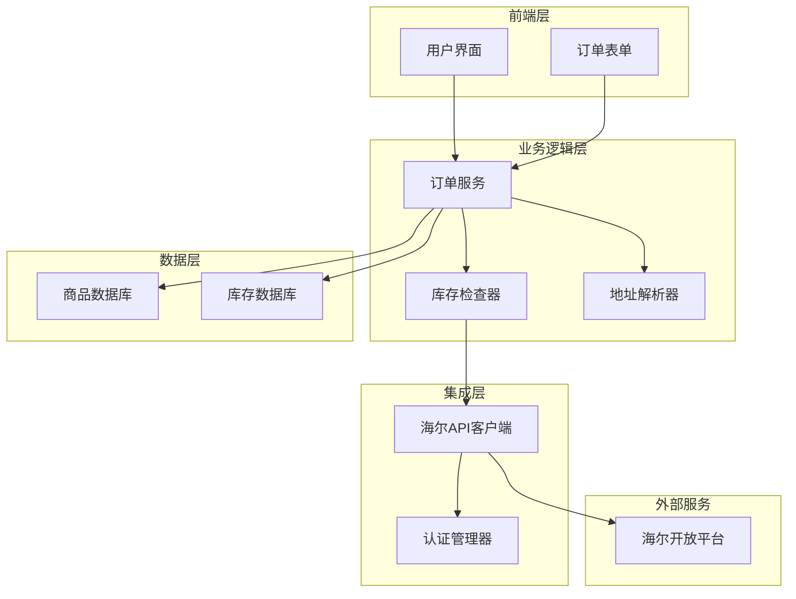
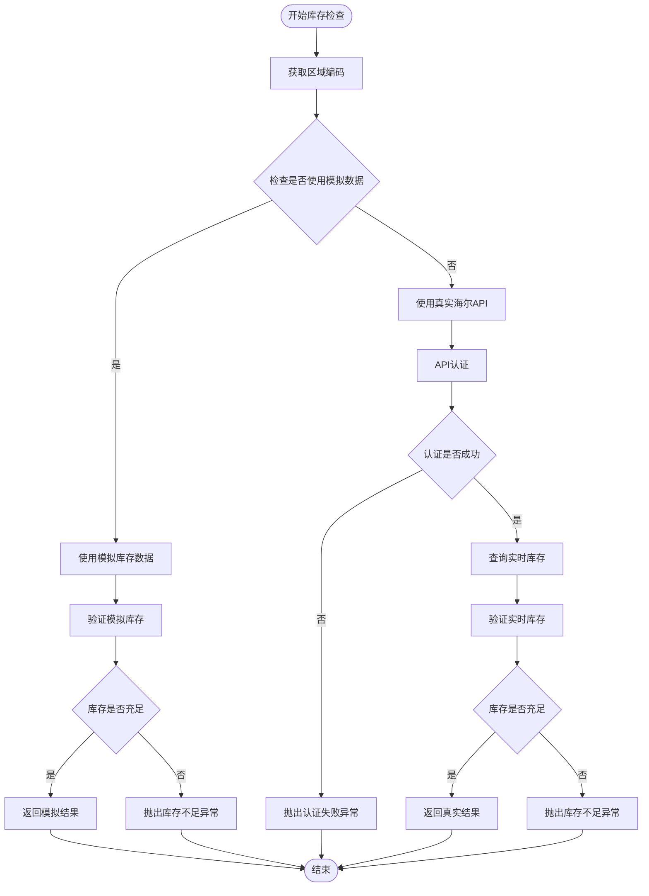
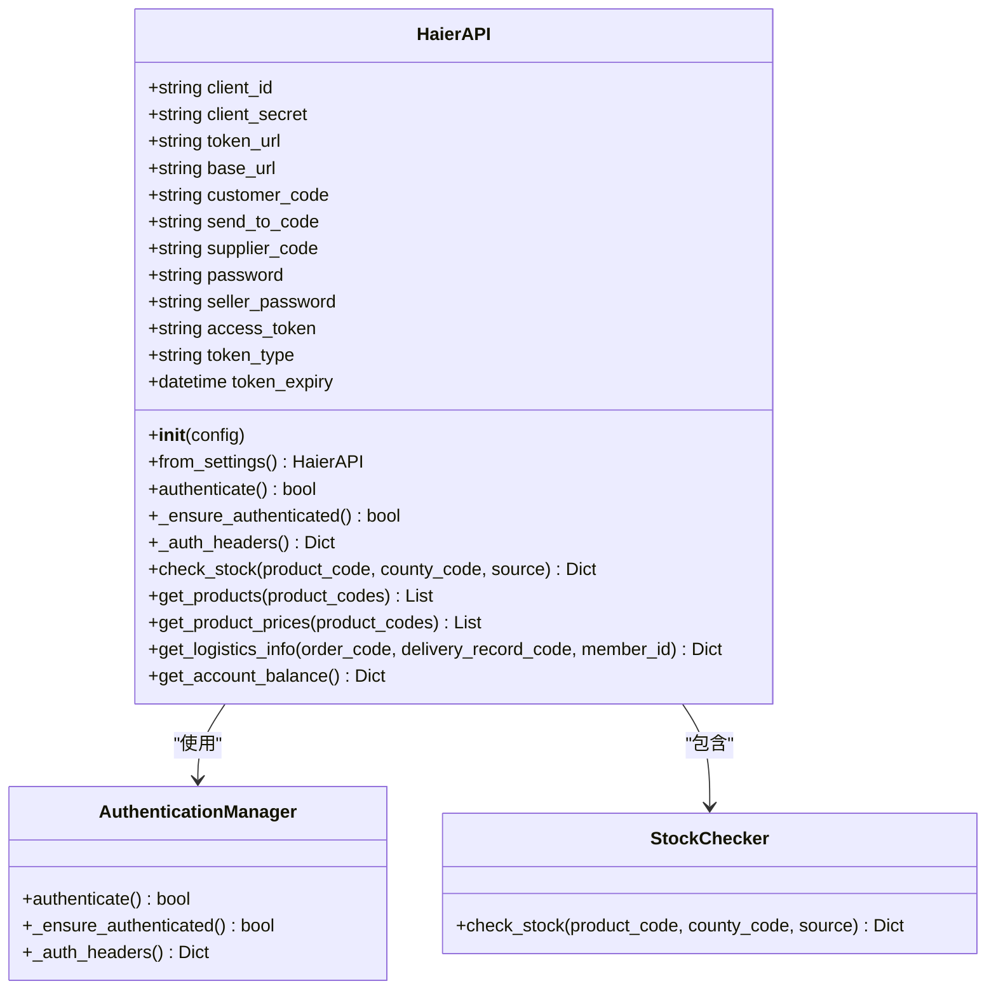
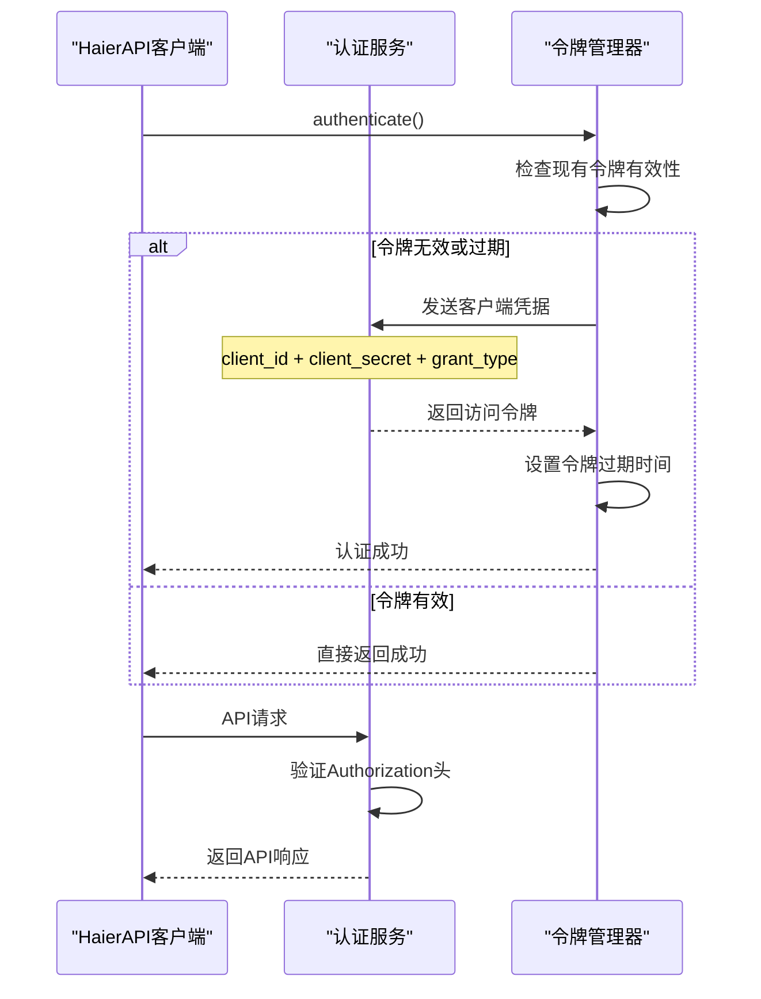
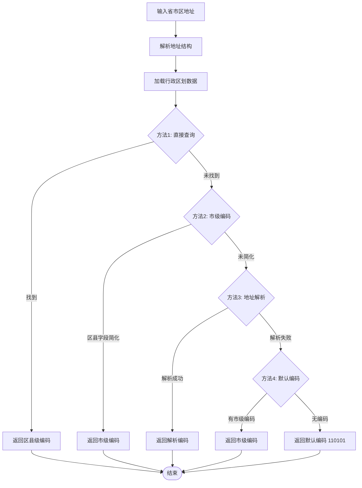
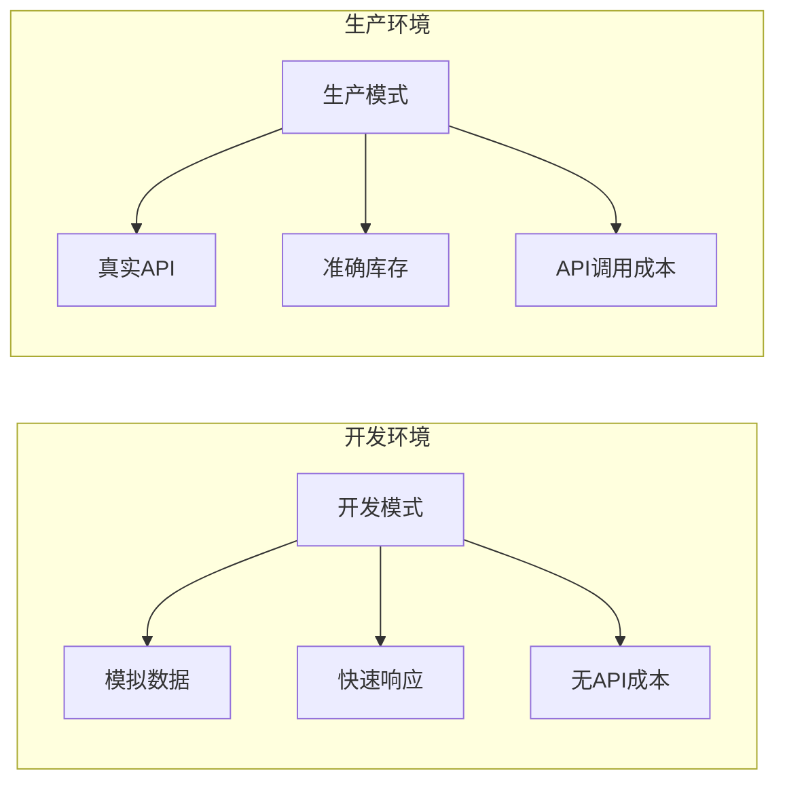
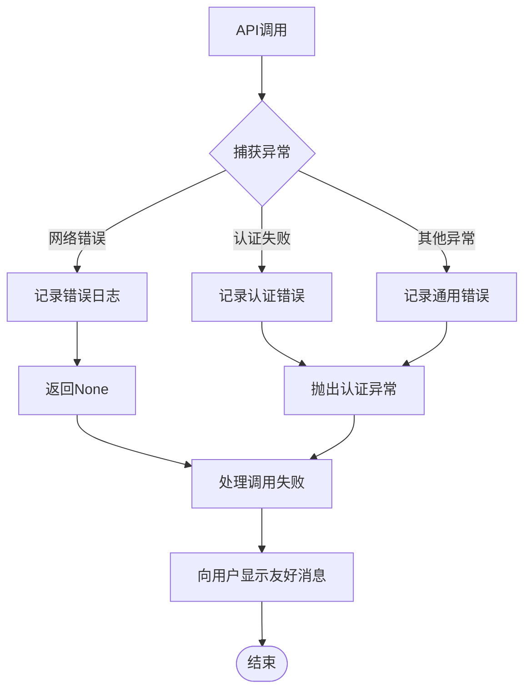
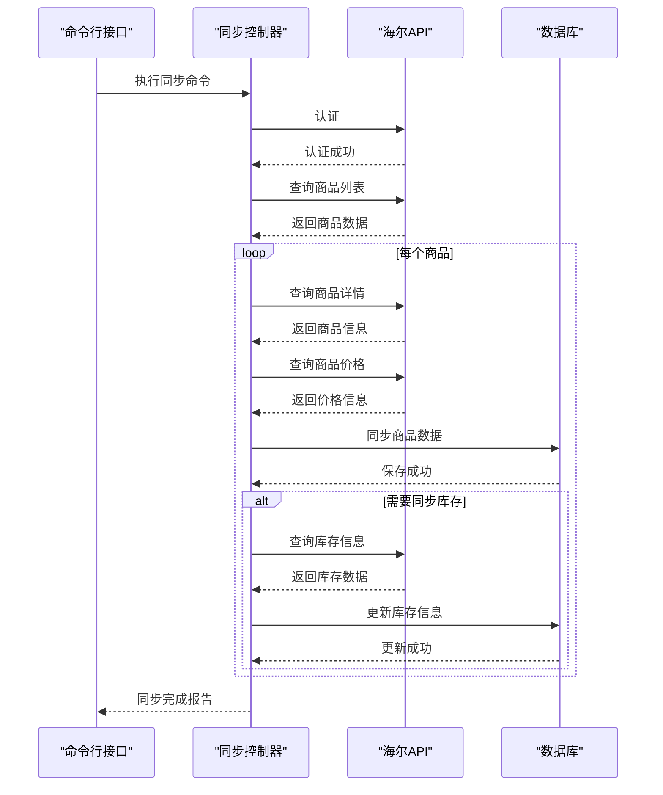
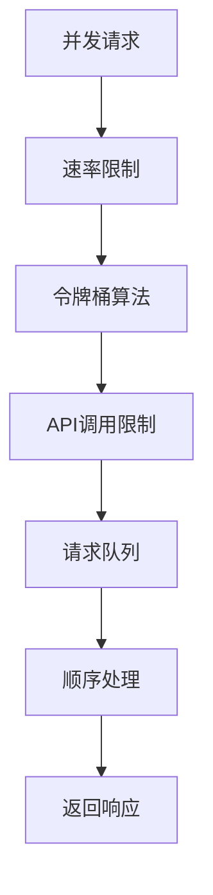

# 库存验证机制

<cite>
**本文档中引用的文件**
- [haierapi.py](file://backend/integrations/haierapi.py)
- [services.py](file://backend/orders/services.py)
- [sync_haier_products.py](file://backend/catalog/management/commands/sync_haier_products.py)
- [models.py](file://backend/catalog/models.py)
- [address_parser.py](file://backend/common/address_parser.py)
- [base.py](file://backend/backend/settings/base.py)
- [development.py](file://backend/backend/settings/development.py)
- [production.py](file://backend/backend/settings/production.py)
</cite>

## 目录
1. [概述](#概述)
2. [系统架构](#系统架构)
3. [核心组件分析](#核心组件分析)
4. [库存验证流程](#库存验证流程)
5. [开发环境与生产环境差异](#开发环境与生产环境差异)
6. [异常处理机制](#异常处理机制)
7. [商品与库存同步策略](#商品与库存同步策略)
8. [性能优化建议](#性能优化建议)
9. [故障排除指南](#故障排除指南)
10. [总结](#总结)

## 概述

该系统实现了基于海尔API的实时库存验证机制，专门用于处理海尔商品的订单库存检查。系统采用双模式设计：开发环境使用模拟数据进行快速测试，生产环境则通过真实的海尔API进行库存查询。这种设计确保了开发效率的同时保证了生产环境的准确性。

## 系统架构



**图表来源**
- [services.py](file://backend/orders/services.py#L123-L216)
- [haierapi.py](file://backend/integrations/haierapi.py#L10-L214)

## 核心组件分析

### check_haier_stock 函数

`check_haier_stock` 函数是库存验证的核心入口，负责根据商品、地址和数量信息执行完整的库存检查流程。



**图表来源**
- [services.py](file://backend/orders/services.py#L123-L216)

**节来源**
- [services.py](file://backend/orders/services.py#L123-L216)

### HaierAPI 类

HaierAPI 类封装了与海尔开放平台的所有交互逻辑，包括认证、库存查询、商品信息获取等功能。



**图表来源**
- [haierapi.py](file://backend/integrations/haierapi.py#L10-L214)

**节来源**
- [haierapi.py](file://backend/integrations/haierapi.py#L10-L214)

### 认证机制（authenticate 方法）

HaierAPI 的认证机制采用了 OAuth2.0 客户端凭据模式，确保每次 API 调用都能获得有效的访问令牌。



**图表来源**
- [haierapi.py](file://backend/integrations/haierapi.py#L41-L64)

**节来源**
- [haierapi.py](file://backend/integrations/haierapi.py#L41-L64)

## 库存验证流程

### 区域编码获取机制

系统通过 `get_county_code` 函数将用户的省市区地址转换为6位国标区域编码，这是海尔API库存查询的关键参数。



**图表来源**
- [services.py](file://backend/orders/services.py#L44-L120)

**节来源**
- [services.py](file://backend/orders/services.py#L44-L120)

### 库存查询参数

海尔API库存查询需要以下关键参数：

| 参数名 | 类型 | 描述 | 示例值 |
|--------|------|------|--------|
| salesCode | string | 销售商编码 | 8800633175 |
| senderCode | string | 发货方编码 | 8800633175 |
| productCode | string | 商品编码 | GA0SZC00U |
| countyCode | string | 区域编码 | 110101 |
| source | string | 来源标识 | JSH-B |
| sellerPassword | string | 卖家密码 | 密码 |

**节来源**
- [haierapi.py](file://backend/integrations/haierapi.py#L124-L132)

## 开发环境与生产环境差异

### 配置差异

系统通过 `HAIER_USE_MOCK_DATA` 配置项控制使用模拟数据还是真实API：

| 环境 | 配置值 | 行为描述 |
|------|--------|----------|
| 开发环境 | True | 使用模拟库存数据，无需API调用 |
| 测试环境 | True | 使用模拟库存数据，支持API测试 |
| 生产环境 | False | 使用真实海尔API，确保库存准确性 |

**节来源**
- [base.py](file://backend/backend/settings/base.py#L261-L262)
- [development.py](file://backend/backend/settings/development.py#L1-L20)
- [production.py](file://backend/backend/settings/production.py#L1-L35)

### 模拟数据 vs 真实API



**节来源**
- [services.py](file://backend/orders/services.py#L147-L216)

## 异常处理机制

### 超时处理

系统在多个层面实现了超时保护：

| 组件 | 超时设置 | 处理策略 |
|------|----------|----------|
| 认证请求 | 10秒 | 记录日志，返回认证失败 |
| 库存查询 | 30秒 | 记录日志，返回库存查询失败 |
| 商品查询 | 30秒 | 记录日志，返回商品查询失败 |

### 网络错误处理



**图表来源**
- [haierapi.py](file://backend/integrations/haierapi.py#L133-L142)

**节来源**
- [haierapi.py](file://backend/integrations/haierapi.py#L133-L142)

### 库存不足处理

当库存不足以满足订单需求时，系统会抛出明确的异常信息：

```python
# 异常示例
raise ValueError(f'海尔产品库存不足，当前库存: {available_stock}，需要: {quantity}')
```

**节来源**
- [services.py](file://backend/orders/services.py#L171-L172)
- [services.py](file://backend/orders/services.py#L207-L208)

## 商品与库存同步策略

### sync_haier_products 命令

该命令提供了批量同步海尔商品数据的功能，支持商品信息、价格和库存的同步。



**图表来源**
- [sync_haier_products.py](file://backend/catalog/management/commands/sync_haier_products.py#L50-L156)

**节来源**
- [sync_haier_products.py](file://backend/catalog/management/commands/sync_haier_products.py#L50-L156)

### 库存更新机制

系统提供了两种库存更新方式：

1. **主动同步**：通过 `sync_haier_products` 命令定期更新
2. **被动更新**：在订单创建时实时查询

**节来源**
- [models.py](file://backend/catalog/models.py#L181-L195)

## 性能优化建议

### 缓存策略

为了减少API调用频率，建议实施以下缓存策略：

1. **令牌缓存**：缓存OAuth2.0访问令牌，避免重复认证
2. **库存缓存**：对高频查询的库存信息进行短期缓存
3. **商品信息缓存**：缓存商品基础信息，减少API调用

### 并发控制



### 连接池优化

对于高并发场景，建议使用连接池管理HTTP连接：

```python
# 推荐的连接池配置
session = requests.Session()
adapter = requests.adapters.HTTPAdapter(
    pool_connections=20,
    pool_maxsize=20,
    max_retries=3
)
session.mount('https://', adapter)
```

## 故障排除指南

### 常见问题及解决方案

| 问题类型 | 症状 | 可能原因 | 解决方案 |
|----------|------|----------|----------|
| 认证失败 | "海尔库存查询失败：认证失败" | 凭据配置错误 | 检查HAIER_CLIENT_ID和HAIER_CLIENT_SECRET |
| API调用超时 | 请求长时间无响应 | 网络延迟或API服务器问题 | 增加超时时间或检查网络连接 |
| 库存查询失败 | "无法获取库存信息" | 区域编码或商品编码错误 | 验证county_code和product_code |
| 库存不足 | "库存不足" | 实际库存低于订单数量 | 检查库存数据或增加库存 |

### 日志分析

系统提供了详细的日志记录，便于问题诊断：

```python
# 关键日志点
logger.info(f'使用区域编码: {county_code} ({address.province} {address.city} {address.district})')
logger.info(f'使用真实海尔API查询库存: product_code={product.product_code}')
logger.error(f'haier stock failed: {res.status_code} {res.text}')
```

### 监控指标

建议监控以下关键指标：

1. **API响应时间**：监控海尔API的响应性能
2. **认证成功率**：跟踪OAuth2.0认证的成功率
3. **库存查询成功率**：监控库存查询的可用性
4. **错误率**：跟踪各类错误的发生频率

## 总结

该库存验证机制通过精心设计的架构实现了高效、可靠的海尔商品库存管理。系统的核心优势包括：

1. **双模式设计**：开发环境使用模拟数据提高开发效率，生产环境使用真实API确保准确性
2. **完善的异常处理**：多层次的错误处理机制确保系统的稳定性
3. **灵活的配置管理**：通过配置项控制不同环境的行为
4. **高效的同步策略**：支持批量同步和实时查询两种模式

通过合理使用这些功能和遵循最佳实践，可以构建一个稳定可靠的订单库存管理系统，为用户提供优质的购物体验。