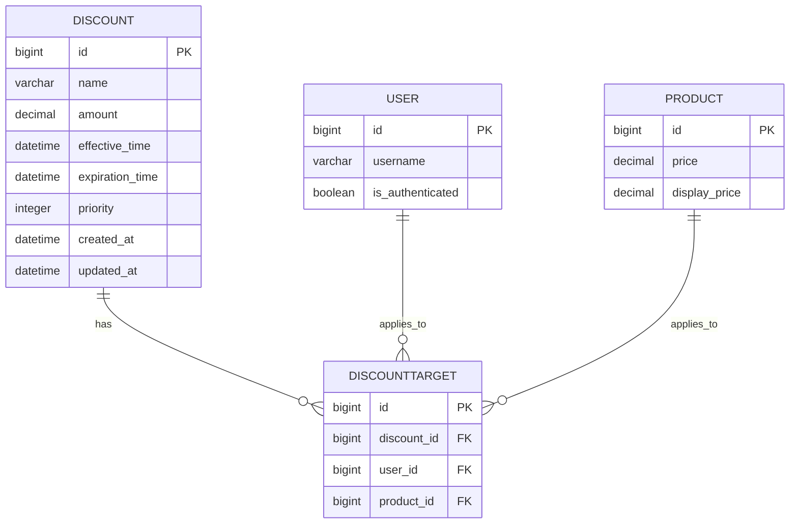
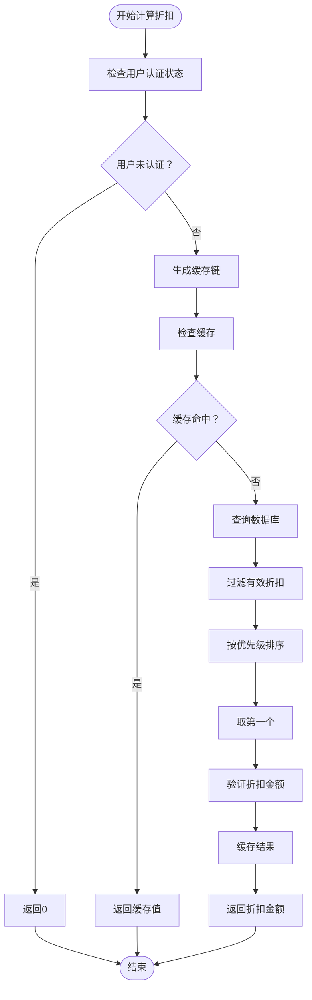
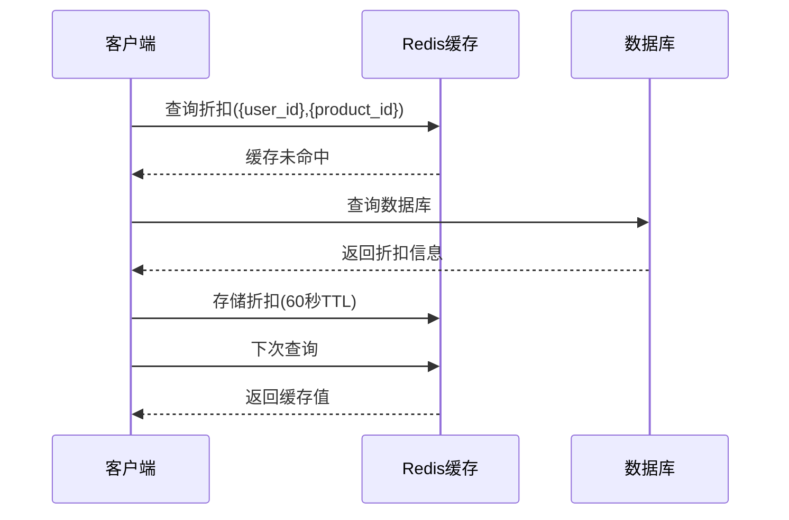
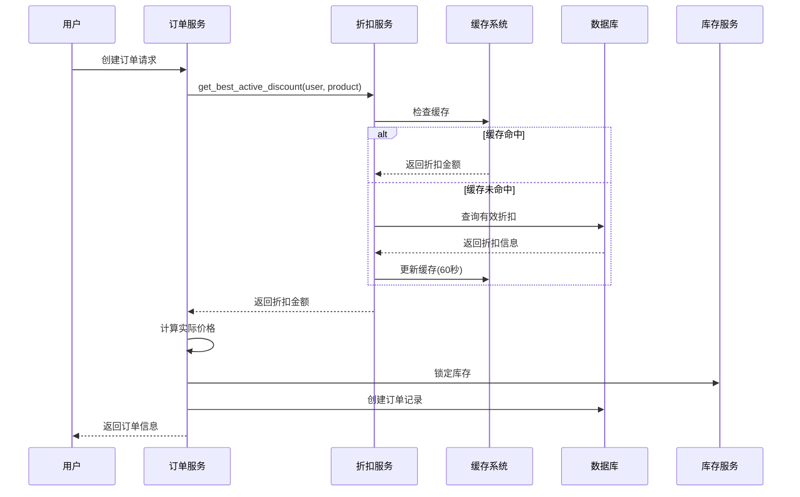
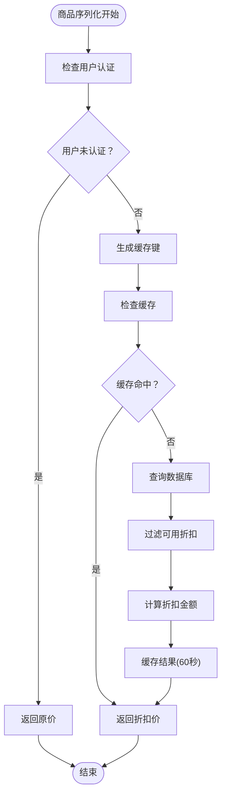
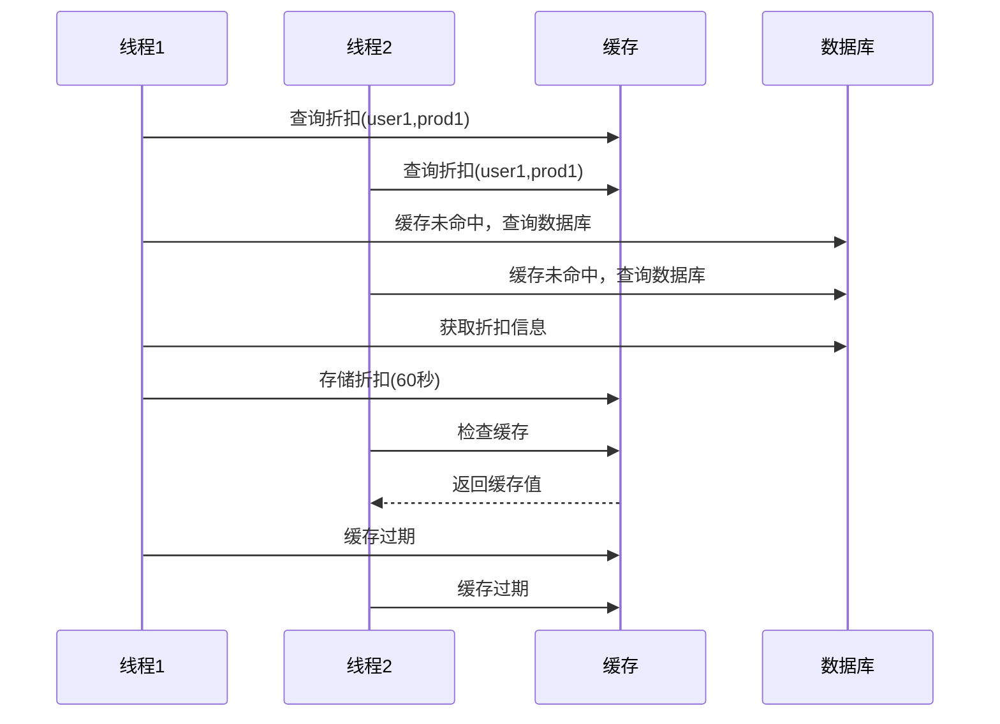

# 折扣计算逻辑

<cite>
**本文档引用的文件**
- [services.py](file://backend/orders/services.py)
- [models.py](file://backend/orders/models.py)
- [serializers.py](file://backend/catalog/serializers.py)
- [views.py](file://backend/orders/views.py)
- [analytics.py](file://backend/orders/analytics.py)
- [health.py](file://backend/common/health.py)
- [Discounts/index.tsx](file://merchant/src/pages/Discounts/index.tsx)
</cite>

## 目录
1. [简介](#简介)
2. [核心数据模型](#核心数据模型)
3. [折扣计算机制](#折扣计算机制)
4. [Redis缓存策略](#redis缓存策略)
5. [订单创建流程中的折扣计算](#订单创建流程中的折扣计算)
6. [商品列表页折扣计算](#商品列表页折扣计算)
7. [性能优化与缓存穿透处理](#性能优化与缓存穿透处理)
8. [故障排除指南](#故障排除指南)
9. [总结](#总结)

## 简介

本系统实现了基于用户身份和商品匹配的智能折扣计算机制，通过多层次的缓存策略和优先级排序规则，为用户提供个性化的优惠体验。折扣系统采用动态计算模式，支持实时更新和高效缓存，确保在高并发场景下的稳定性和性能。

## 核心数据模型

### Discount模型（折扣规则）

Discount模型定义了折扣的基本属性和有效性规则：



**图表来源**
- [models.py](file://backend/orders/models.py#L238-L271)

### DiscountTarget模型（折扣适用范围）

DiscountTarget模型建立了折扣与用户、商品之间的多对多关系，支持精细化的折扣控制：

| 字段 | 类型 | 描述 | 约束 |
|------|------|------|------|
| id | BigAutoField | 主键标识符 | 自增 |
| discount | ForeignKey | 关联的折扣规则 | 必填 |
| user | ForeignKey | 适用的用户 | 必填 |
| product | ForeignKey | 适用的商品 | 必填 |

**节来源**
- [models.py](file://backend/orders/models.py#L273-L288)

## 折扣计算机制

### get_best_active_discount函数详解

系统的核心折扣计算逻辑集中在`get_best_active_discount`函数中，该函数负责为特定用户和商品选择最优的活动折扣：



**图表来源**
- [services.py](file://backend/orders/services.py#L11-L41)

### 优先级排序规则

折扣选择遵循严格的优先级排序规则：

1. **优先级降序**：`-discount__priority`（数值越大优先级越高）
2. **更新时间降序**：`-discount__updated_at`（最后更新时间较新的优先）
3. **时间有效性**：必须在生效时间和过期时间范围内

### 时间有效性过滤条件

系统通过以下条件确保折扣的时间有效性：
- `discount__effective_time__lte=now`：生效时间小于等于当前时间
- `discount__expiration_time__gt=now`：过期时间大于当前时间

**节来源**
- [services.py](file://backend/orders/services.py#L22-L33)

## Redis缓存策略

### 缓存键结构

系统采用简洁而高效的缓存键命名规范：

```
discount:{user_id}:{product_id}
```

例如：`discount:123:456`表示用户ID为123的用户对商品ID为456的折扣计算结果。

### TTL设置策略

缓存采用短期生存时间（TTL）策略：

- **缓存时长**：60秒
- **设计目的**：快速反映管理员的折扣规则更新
- **平衡考虑**：在性能和数据新鲜度之间取得平衡

### 缓存命中率优化

系统实现了智能的缓存预热和命中检测机制：



**图表来源**
- [services.py](file://backend/orders/services.py#L17-L40)

**节来源**
- [services.py](file://backend/orders/services.py#L17-L40)

## 订单创建流程中的折扣计算

### 订单创建时的折扣处理

在订单创建过程中，系统会执行完整的折扣计算流程：



**图表来源**
- [services.py](file://backend/orders/services.py#L258-L263)

### 实际金额计算公式

订单的实际支付金额按照以下公式计算：

```
unit_price = product.price - discount_amount
total_amount = unit_price * quantity
```

其中：
- `unit_price`：单价（商品原价减去折扣）
- `total_amount`：总价（单价乘以数量）
- `discount_amount`：通过`get_best_active_discount`计算得出

**节来源**
- [services.py](file://backend/orders/services.py#L258-L263)

## 商品列表页折扣计算

### 商品序列化器中的折扣计算

在商品列表页，系统同样实现了折扣计算逻辑，但采用了简化的缓存策略：



**图表来源**
- [serializers.py](file://backend/catalog/serializers.py#L211-L251)

### 折扣价计算逻辑

商品序列化器中的折扣价计算遵循以下步骤：

1. **基础价格确定**：使用`display_price`作为基础价格
2. **折扣计算**：调用相同的`get_best_active_discount`函数
3. **边界值处理**：
   - 折扣金额不能为负数
   - 折扣金额不能超过商品原价
4. **最终价格**：`discounted_price = base_price - amount`

**节来源**
- [serializers.py](file://backend/catalog/serializers.py#L211-L251)

## 性能优化与缓存穿透处理

### 缓存穿透防护

系统通过多重机制防止缓存穿透问题：

| 防护措施 | 实现方式 | 效果 |
|----------|----------|------|
| 用户认证检查 | `if not user or not getattr(user, 'is_authenticated', False)` | 过滤匿名用户请求 |
| 缓存预热 | 短期缓存存储计算结果 | 减少数据库查询 |
| 时间窗口控制 | 60秒TTL设置 | 平衡性能与数据新鲜度 |
| 异常处理 | 严格的边界值验证 | 防止计算异常传播 |

### 查询优化策略

系统采用多种查询优化技术：

1. **选择性查询**：使用`select_related('discount')`减少查询次数
2. **索引利用**：在`user`、`product`字段上建立复合索引
3. **数据库连接池**：通过Django ORM的连接管理机制
4. **事务控制**：使用原子事务确保数据一致性

### 并发安全性

系统通过以下机制确保并发安全：



**图表来源**
- [health.py](file://backend/common/health.py#L134-L181)

**节来源**
- [services.py](file://backend/orders/services.py#L24-L33)

## 故障排除指南

### 常见问题诊断

#### 1. 折扣计算结果不正确

**症状**：用户看到的折扣金额与预期不符

**排查步骤**：
1. 检查用户认证状态
2. 验证折扣规则的有效性
3. 确认缓存键的正确性
4. 检查数据库中的折扣数据

**解决方案**：
- 清除相关缓存键：`discount:{user_id}:{product_id}`
- 验证折扣规则的时间有效性
- 检查用户和商品的关联关系

#### 2. 性能问题

**症状**：折扣计算响应时间过长

**排查步骤**：
1. 检查Redis连接状态
2. 监控数据库查询性能
3. 分析缓存命中率
4. 检查索引使用情况

**解决方案**：
- 优化数据库索引
- 调整缓存TTL设置
- 实施查询优化

#### 3. 缓存一致性问题

**症状**：折扣更新后仍显示旧值

**排查步骤**：
1. 检查缓存过期时间
2. 验证缓存清理机制
3. 检查缓存键生成逻辑

**解决方案**：
- 立即清除相关缓存
- 调整缓存刷新策略
- 实施主动缓存失效

### 监控指标

建议监控以下关键指标：

| 指标类型 | 监控项目 | 正常范围 | 告警阈值 |
|----------|----------|----------|----------|
| 性能指标 | 折扣计算响应时间 | < 100ms | > 500ms |
| 缓存指标 | 缓存命中率 | > 80% | < 60% |
| 数据指标 | 有效折扣比例 | > 50% | < 30% |
| 错误指标 | 计算异常率 | < 1% | > 5% |

**节来源**
- [health.py](file://backend/common/health.py#L134-L181)

## 总结

本系统的折扣计算机制通过精心设计的多层架构，实现了高效、准确、可扩展的个性化折扣服务。主要特点包括：

### 核心优势

1. **智能优先级排序**：基于优先级和更新时间的双重排序机制
2. **高效缓存策略**：60秒TTL的短期缓存平衡性能与数据新鲜度
3. **严格边界控制**：防止折扣金额超出合理范围
4. **并发安全保障**：通过事务和缓存机制确保数据一致性

### 技术亮点

- **统一计算逻辑**：订单创建和商品列表页共享相同的折扣计算函数
- **灵活配置机制**：支持管理员动态调整折扣规则
- **性能优化**：多层次缓存和查询优化
- **故障容错**：完善的异常处理和缓存穿透防护

### 未来优化方向

1. **缓存预热机制**：实施主动缓存预热策略
2. **分布式缓存**：考虑使用分布式缓存提高可用性
3. **机器学习集成**：基于用户行为的个性化折扣推荐
4. **实时监控**：增强的性能监控和告警机制

这套折扣计算系统为电商平台提供了强大的营销工具，通过智能化的折扣策略提升用户体验和转化率，同时保持系统的高性能和稳定性。