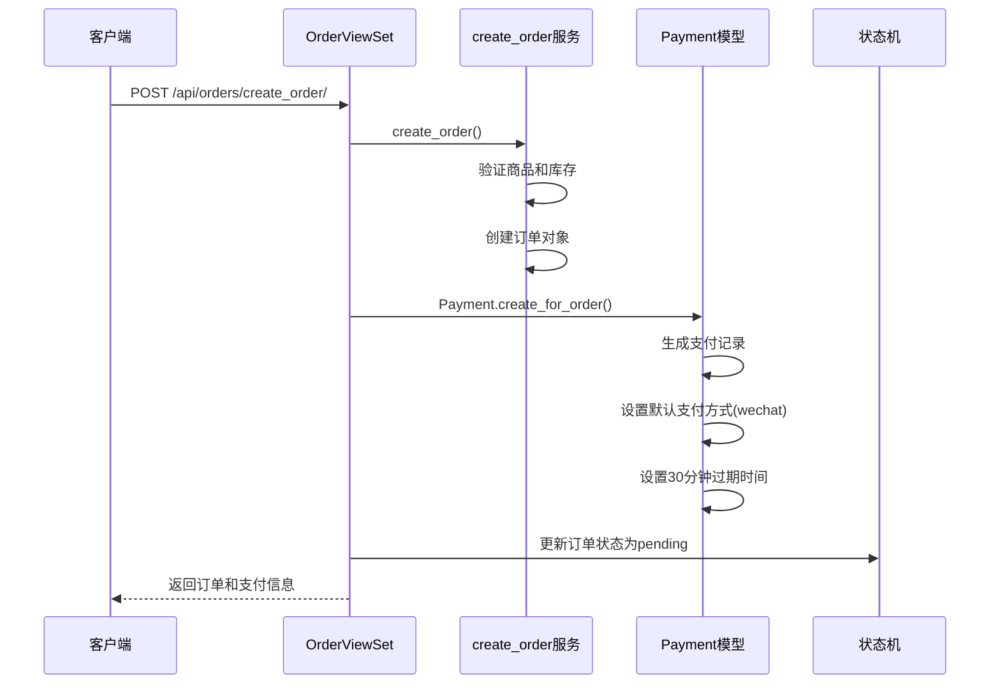
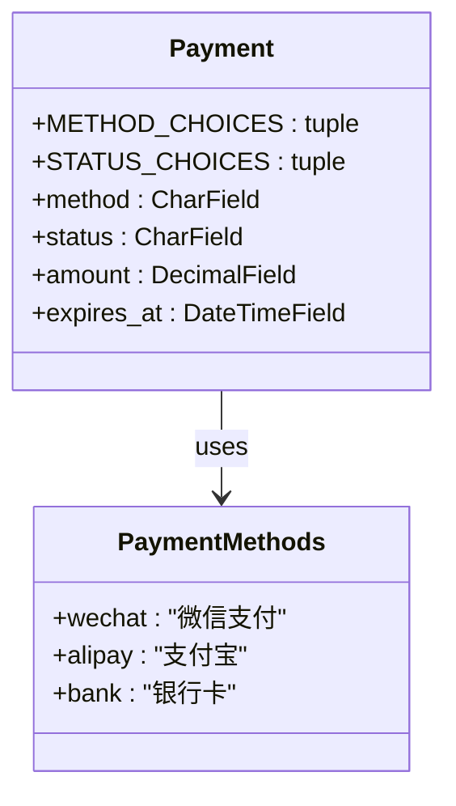
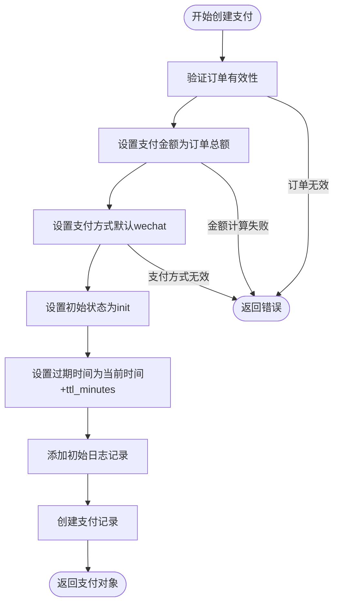
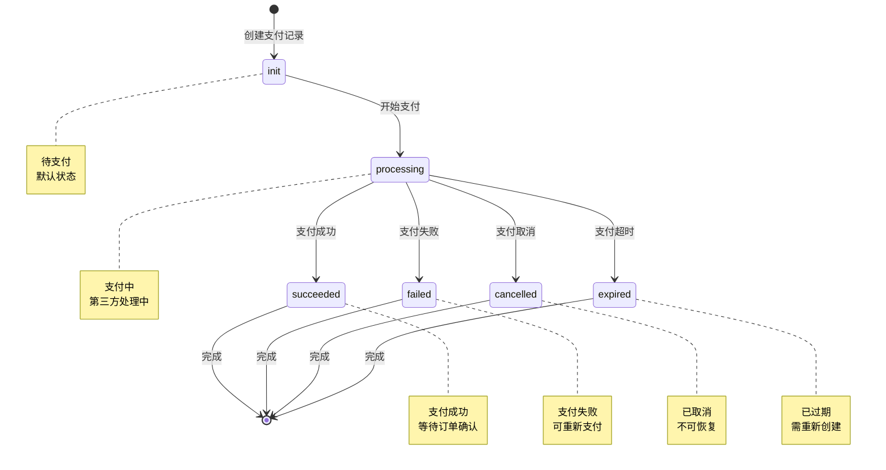
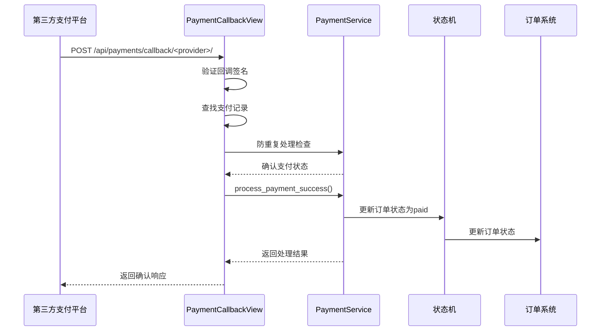
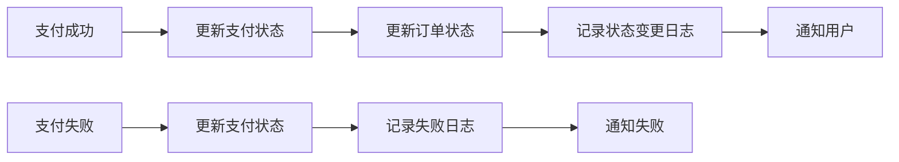
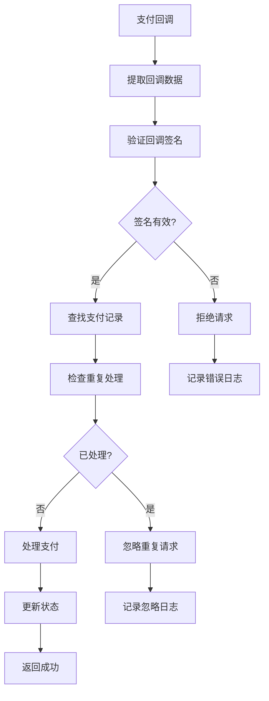
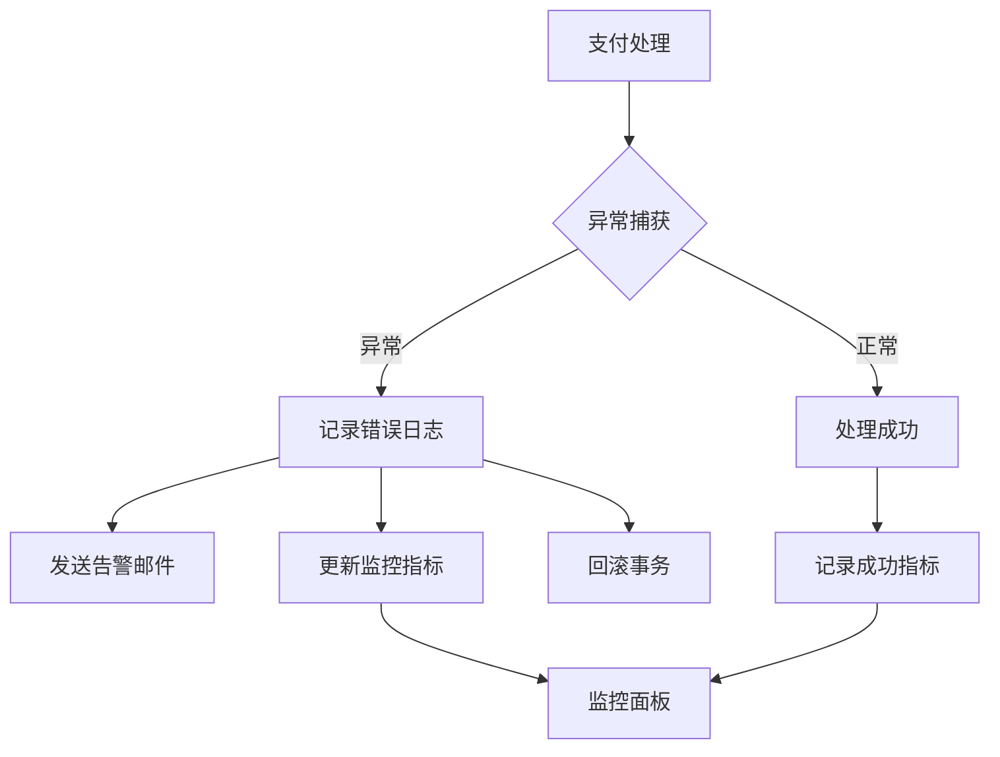

# 支付集成流程

<cite>
**本文档中引用的文件**
- [views.py](file://backend/orders/views.py)
- [models.py](file://backend/orders/models.py)
- [payment_service.py](file://backend/orders/payment_service.py)
- [services.py](file://backend/orders/services.py)
- [state_machine.py](file://backend/orders/state_machine.py)
- [urls.py](file://backend/orders/urls.py)
- [serializers.py](file://backend/orders/serializers.py)
- [payment.ts](file://frontend/src/services/payment.ts)
</cite>

## 目录
1. [概述](#概述)
2. [订单创建与支付初始化](#订单创建与支付初始化)
3. [支付方式选择机制](#支付方式选择机制)
4. [支付记录创建流程](#支付记录创建流程)
5. [支付状态管理](#支付状态管理)
6. [支付回调处理](#支付回调处理)
7. [订单状态同步](#订单状态同步)
8. [支付URL生成与过期控制](#支付url生成与过期控制)
9. [安全机制与防重复支付](#安全机制与防重复支付)
10. [故障处理与监控](#故障处理与监控)

## 概述

本文档详细说明了电小二电商平台中订单创建后支付流程的完整衔接机制。该系统采用状态机模式管理订单状态流转，并通过专门的支付服务模块处理支付相关的业务逻辑，确保支付流程的安全性和可靠性。

支付集成流程主要包括以下几个关键环节：
- 订单创建时自动生成支付记录
- 支付方式的选择与默认值处理
- 支付状态的实时跟踪与更新
- 第三方支付平台的回调处理
- 订单状态与支付状态的同步机制

## 订单创建与支付初始化

### create_order视图中的支付创建

在订单创建过程中，系统会自动为新创建的订单生成相应的支付记录。这是支付流程的第一个关键步骤。

**图表来源**
- [views.py](file://backend/orders/views.py#L136-L217)
- [models.py](file://backend/orders/models.py#L223-L234)
- [services.py](file://backend/orders/services.py#L219-L297)

### 支付记录生成的关键参数

当调用 `Payment.create_for_order` 方法时，系统会自动设置以下关键参数：

| 参数 | 类型 | 默认值 | 描述 |
|------|------|--------|------|
| method | String | 'wechat' | 支付方式，支持wechat、alipay、bank |
| ttl_minutes | Integer | 30 | 支付超时时间（分钟） |
| status | String | 'init' | 初始支付状态 |
| amount | Decimal | 订单总金额 | 自动继承订单金额 |

**章节来源**
- [views.py](file://backend/orders/views.py#L188-L194)
- [models.py](file://backend/orders/models.py#L223-L234)

## 支付方式选择机制

### 支付方式常量定义

系统在Payment模型中定义了三种标准支付方式：

**图表来源**
- [models.py](file://backend/orders/models.py#L187-L191)

### 默认值处理逻辑

支付方式的默认值处理遵循以下规则：

1. **客户端指定优先**：如果客户端在创建订单时指定了支付方式，则使用指定的方式
2. **系统默认**：如果未指定支付方式，默认使用微信支付（wechat）
3. **批量订单处理**：在批量创建订单时，所有订单使用相同的支付方式

**章节来源**
- [views.py](file://backend/orders/views.py#L189)
- [views.py](file://backend/orders/views.py#L246)

## 支付记录创建流程

### Payment.create_for_order方法详解

支付记录的创建过程是一个原子性的数据库操作，确保数据一致性：

**图表来源**
- [models.py](file://backend/orders/models.py#L223-L234)

### 支付记录的数据结构

支付记录包含以下核心字段：

| 字段名 | 数据类型 | 约束 | 描述 |
|--------|----------|------|------|
| id | BigAutoField | 主键 | 支付记录唯一标识 |
| order | ForeignKey | 外键关联 | 关联的订单对象 |
| amount | DecimalField | 金额字段 | 支付金额 |
| method | CharField | 枚举选择 | 支付方式 |
| status | CharField | 枚举选择 | 支付状态 |
| created_at | DateTimeField | 自动添加 | 创建时间 |
| updated_at | DateTimeField | 自动更新 | 更新时间 |
| expires_at | DateTimeField | 必填 | 支付过期时间 |
| logs | JSONField | JSON格式 | 支付操作日志 |

**章节来源**
- [models.py](file://backend/orders/models.py#L201-L221)

## 支付状态管理

### 支付状态流转图

支付状态在整个生命周期中遵循严格的流转规则：

**图表来源**
- [models.py](file://backend/orders/models.py#L192-L198)

### 状态转换的安全机制

系统通过状态机确保支付状态转换的合法性，防止非法状态跳转。

**章节来源**
- [state_machine.py](file://backend/orders/state_machine.py#L33-L56)

## 支付回调处理

### handle_payment_callback视图

支付回调处理是整个支付流程的关键环节，负责处理第三方支付平台的异步通知：

**图表来源**
- [views.py](file://backend/orders/views.py#L1134-L1294)
- [payment_service.py](file://backend/orders/payment_service.py#L106-L204)

### 回调处理的关键步骤

1. **签名验证**：确保回调数据的真实性和完整性
2. **支付记录查找**：根据回调数据定位对应的支付记录
3. **重复处理防护**：防止同一笔支付被多次处理
4. **状态映射**：将第三方支付状态映射为系统内部状态
5. **事务处理**：确保支付状态更新的原子性

**章节来源**
- [views.py](file://backend/orders/views.py#L1174-L1294)

## 订单状态同步

### 订单状态与支付状态的关联

支付成功后，系统会自动更新订单状态，实现两个系统状态的同步：

**图表来源**
- [state_machine.py](file://backend/orders/state_machine.py#L96-L154)
- [payment_service.py](file://backend/orders/payment_service.py#L106-L204)

### 状态同步的具体实现

系统通过 `OrderStateMachine.transition` 方法实现状态同步：

| 触发条件 | 支付状态 | 订单状态 | 操作 |
|----------|----------|----------|------|
| 支付成功 | succeeded | paid | 自动确认订单 |
| 支付失败 | failed | pending | 保持待支付状态 |
| 支付取消 | cancelled | pending | 保持待支付状态 |
| 支付超时 | expired | pending | 保持待支付状态 |

**章节来源**
- [state_machine.py](file://backend/orders/state_machine.py#L180-L210)

## 支付URL生成与过期控制

### TTL（生存时间）机制

系统为每笔支付设置了生存时间控制，防止支付记录长期占用资源：

```mermaid
gantt
title 支付生命周期管理
dateFormat X
axisFormat %M分钟
section 支付创建
支付记录创建 :milestone, m1, 0, 0
设置TTL :active, m2, 0, 30
section 支付处理
待支付状态 :crit, active, 0, 30
支付中状态 :crit, active, 30, 60
支付成功 :done, 60, 60
section 过期处理
支付超时 :crit, 30, 60
清理过期记录 :milestone, 60, 60
```

**图表来源**
- [models.py](file://backend/orders/models.py#L231)
- [payment_service.py](file://backend/orders/payment_service.py#L151-L161)

### 过期时间控制策略

1. **默认TTL**：30分钟，适用于大多数支付场景
2. **动态调整**：可根据业务需求调整TTL值
3. **自动清理**：系统定期清理过期的支付记录
4. **提醒机制**：在接近过期时向用户发送提醒

**章节来源**
- [models.py](file://backend/orders/models.py#L231)
- [payment_service.py](file://backend/orders/payment_service.py#L151-L161)

## 安全机制与防重复支付

### 签名验证机制

系统实现了多层次的安全验证机制：

**图表来源**
- [payment_service.py](file://backend/orders/payment_service.py#L30-L69)
- [views.py](file://backend/orders/views.py#L1180-L1191)

### 防重复支付策略

1. **数据库锁**：使用 `select_for_update()` 防止并发处理
2. **状态检查**：检查支付记录是否已经是最终状态
3. **幂等性设计**：确保相同请求多次处理结果一致
4. **日志追踪**：记录所有支付操作的详细日志

**章节来源**
- [payment_service.py](file://backend/orders/payment_service.py#L143-L149)
- [payment_service.py](file://backend/orders/payment_service.py#L245-L292)

## 故障处理与监控

### 异常处理机制

系统建立了完善的异常处理和监控体系：

**图表来源**
- [payment_service.py](file://backend/orders/payment_service.py#L245-L292)
- [views.py](file://backend/orders/views.py#L1286-L1294)

### 监控指标

系统监控以下关键指标：

| 指标类别 | 具体指标 | 监控目的 |
|----------|----------|----------|
| 支付成功率 | 成功/总支付数 | 评估支付系统健康度 |
| 平均处理时间 | 支付回调响应时间 | 优化系统性能 |
| 错误率 | 签名验证失败率 | 安全监控 |
| 超时率 | 支付超时比例 | 优化TTL配置 |
| 并发处理 | 同时处理的支付请求数 | 系统容量评估 |

**章节来源**
- [payment_service.py](file://backend/orders/payment_service.py#L245-L292)

## 总结

电小二电商平台的支付集成流程通过精心设计的状态机模式、安全验证机制和自动化处理流程，确保了支付过程的可靠性和用户体验。整个流程从订单创建开始，经过支付初始化、状态跟踪、回调处理到最终的状态同步，形成了一个完整的闭环。

关键特性包括：
- **自动化支付创建**：订单创建时自动关联支付记录
- **灵活的支付方式**：支持多种支付渠道，提供良好的用户体验
- **严格的安全控制**：多重签名验证和防重复支付机制
- **完善的监控体系**：实时监控支付状态和系统健康度
- **优雅的错误处理**：提供清晰的错误反馈和恢复机制

这套支付集成流程为电小二电商平台提供了稳定可靠的支付基础设施，支撑着整个电商业务的正常运转。