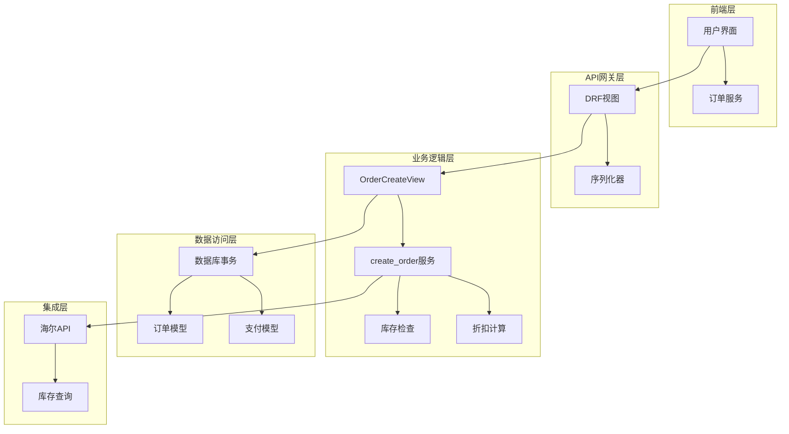
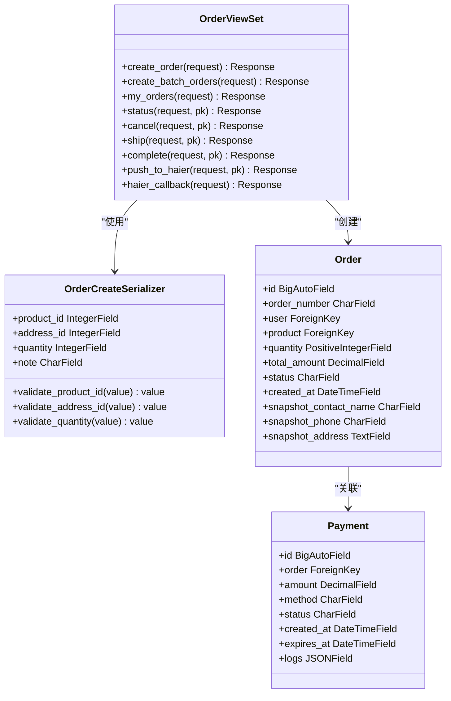
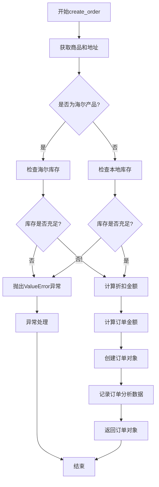
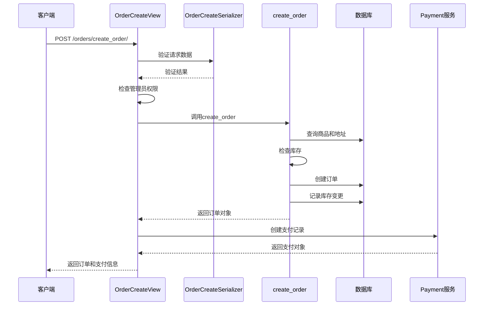
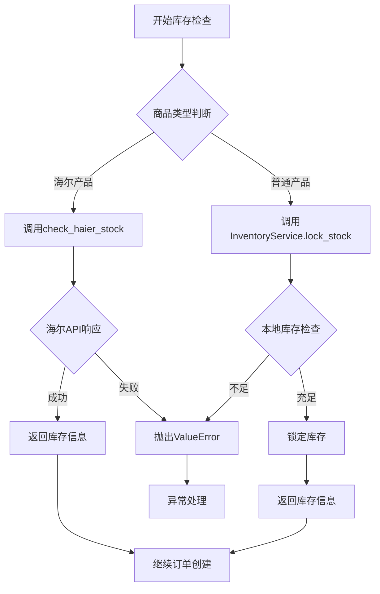
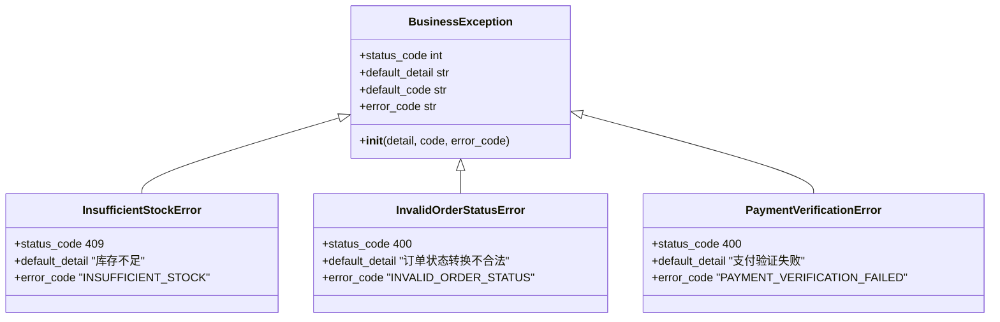
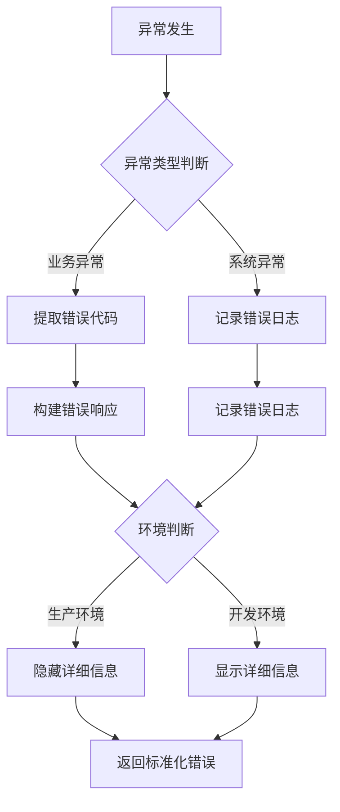
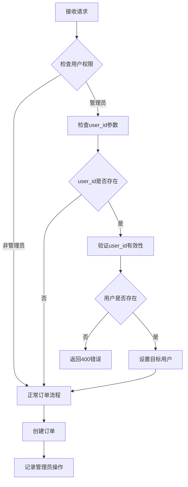

# 订单创建流程

<cite>
**本文档引用的文件**
- [backend/orders/views.py](file://backend/orders/views.py)
- [backend/orders/services.py](file://backend/orders/services.py)
- [backend/orders/models.py](file://backend/orders/models.py)
- [backend/orders/serializers.py](file://backend/orders/serializers.py)
- [backend/common/exceptions.py](file://backend/common/exceptions.py)
- [backend/common/responses.py](file://backend/common/responses.py)
- [frontend/src/services/order.ts](file://frontend/src/services/order.ts)
</cite>

## 目录
1. [概述](#概述)
2. [系统架构](#系统架构)
3. [核心组件分析](#核心组件分析)
4. [订单创建流程详解](#订单创建流程详解)
5. [数据库事务处理](#数据库事务处理)
6. [异常处理机制](#异常处理机制)
7. [管理员代下单功能](#管理员代下单功能)
8. [日志记录与监控](#日志记录与监控)
9. [性能优化策略](#性能优化策略)
10. [总结](#总结)

## 概述

订单创建流程是电商品台的核心业务流程之一，负责处理用户从提交订单到订单对象生成的完整过程。该流程涉及多个层次的处理：前端请求处理、数据验证、业务逻辑执行、数据库操作以及支付创建等环节。

本文档详细解析了OrderCreateView中create_order方法的工作原理，重点说明了DRF框架下的请求处理机制、transaction.atomic如何确保数据库操作的原子性，以及从用户提交订单到订单对象生成的完整路径。

## 系统架构

订单创建系统采用分层架构设计，主要包含以下几个层次：



**图表来源**
- [backend/orders/views.py](file://backend/orders/views.py#L136-L216)
- [backend/orders/services.py](file://backend/orders/services.py#L218-L296)

## 核心组件分析

### OrderCreateView类结构

OrderCreateView是订单创建功能的主要入口点，继承自Django REST Framework的ViewSet类，提供了RESTful接口规范。



**图表来源**
- [backend/orders/views.py](file://backend/orders/views.py#L23-L304)
- [backend/orders/serializers.py](file://backend/orders/serializers.py#L99-L133)
- [backend/orders/models.py](file://backend/orders/models.py#L13-L80)

**章节来源**
- [backend/orders/views.py](file://backend/orders/views.py#L23-L304)
- [backend/orders/serializers.py](file://backend/orders/serializers.py#L99-L133)
- [backend/orders/models.py](file://backend/orders/models.py#L13-L80)

### create_order服务函数

create_order函数是订单创建的核心业务逻辑实现，负责处理订单创建的完整流程。



**图表来源**
- [backend/orders/services.py](file://backend/orders/services.py#L218-L296)

**章节来源**
- [backend/orders/services.py](file://backend/orders/services.py#L218-L296)

## 订单创建流程详解

### 请求处理流程

订单创建的请求处理遵循标准的DRF工作流程：



**图表来源**
- [backend/orders/views.py](file://backend/orders/views.py#L136-L216)
- [backend/orders/services.py](file://backend/orders/services.py#L218-L296)

### 数据验证机制

OrderCreateSerializer提供了完整的数据验证逻辑：

| 字段 | 验证规则 | 错误处理 |
|------|----------|----------|
| product_id | 存在性验证，商品必须存在 | Product.DoesNotExist异常 |
| address_id | 存在性验证，地址属于当前用户 | Address.DoesNotExist异常 |
| quantity | 正整数验证，默认值1 | ValueError异常 |
| note | 可选，最大长度500字符 | 长度验证 |

**章节来源**
- [backend/orders/serializers.py](file://backend/orders/serializers.py#L99-L133)

### 库存检查逻辑

系统支持两种库存管理模式：

1. **本地库存管理**：适用于普通商品，使用InventoryService.lock_stock方法
2. **海尔库存管理**：适用于海尔产品，通过check_haier_stock方法调用海尔API



**图表来源**
- [backend/orders/services.py](file://backend/orders/services.py#L240-L253)
- [backend/orders/services.py](file://backend/orders/services.py#L123-L216)

**章节来源**
- [backend/orders/services.py](file://backend/orders/services.py#L240-L253)
- [backend/orders/services.py](file://backend/orders/services.py#L123-L216)

## 数据库事务处理

### transaction.atomic的应用

数据库事务处理是确保数据一致性的关键机制。在订单创建过程中，transaction.atomic被广泛应用于以下场景：

```python
# 在OrderCreateView中
with transaction.atomic():
    order = create_order(...)
    payment = Payment.create_for_order(order, method=payment_method)
    # 如果任何一步失败，整个事务回滚

# 在create_order服务中
with transaction.atomic():
    # 库存锁定
    # 订单创建
    # 订单分析记录
```

### 事务隔离级别

系统使用默认的数据库事务隔离级别，确保：

1. **原子性**：订单创建和支付记录必须同时成功或同时失败
2. **一致性**：库存数量与订单数量保持一致
3. **隔离性**：并发订单创建不会导致库存超卖
4. **持久性**：一旦提交，数据永久保存

**章节来源**
- [backend/orders/views.py](file://backend/orders/views.py#L176-L196)
- [backend/orders/services.py](file://backend/orders/services.py#L264-L296)

## 异常处理机制

### 异常分类与处理

系统定义了多层次的异常处理机制：



**图表来源**
- [backend/common/exceptions.py](file://backend/common/exceptions.py#L26-L230)

### 异常处理流程



**图表来源**
- [backend/common/exceptions.py](file://backend/common/exceptions.py#L251-L440)

### 常见异常场景

| 异常类型 | 触发条件 | HTTP状态码 | 错误代码 |
|----------|----------|------------|----------|
| InsufficientStockError | 库存不足 | 409 | INSUFFICIENT_STOCK |
| Product.DoesNotExist | 商品不存在 | 400 | INVALID_PRODUCT_ID |
| Address.DoesNotExist | 地址无效 | 400 | INVALID_ADDRESS_ID |
| ValueError | 业务逻辑错误 | 400 | BUSINESS_ERROR |
| Exception | 系统未知错误 | 500 | INTERNAL_ERROR |

**章节来源**
- [backend/common/exceptions.py](file://backend/common/exceptions.py#L26-L230)
- [backend/orders/views.py](file://backend/orders/views.py#L198-L207)

## 管理员代下单功能

### 功能特性

管理员代下单功能允许管理员为其他用户创建订单，主要用于客服场景和特殊业务需求。



**图表来源**
- [backend/orders/views.py](file://backend/orders/views.py#L163-L173)

### 权限控制

管理员代下单功能实现了严格的权限控制：

1. **身份验证**：只有登录用户才能使用此功能
2. **权限检查**：只有具有staff权限的用户才能使用
3. **用户验证**：确保提供的user_id对应的有效用户
4. **操作记录**：记录管理员的操作日志

**章节来源**
- [backend/orders/views.py](file://backend/orders/views.py#L163-L173)

## 日志记录与监控

### 日志级别与内容

系统采用分级日志记录机制：

| 日志级别 | 触发条件 | 记录内容 |
|----------|----------|----------|
| DEBUG | 详细调试信息 | 请求参数、中间变量 |
| INFO | 关键业务操作 | 订单创建成功、支付创建成功 |
| WARNING | 业务警告 | 库存不足、无效user_id |
| ERROR | 系统错误 | 数据库异常、API调用失败 |

### 日志格式标准化

所有日志采用统一的格式，包含以下信息：

```python
{
    "timestamp": "2024-01-01T12:00:00Z",
    "level": "INFO",
    "message": "订单创建成功: order_id=123, user_id=456",
    "request_path": "/orders/create_order/",
    "request_method": "POST",
    "view_name": "OrderViewSet",
    "status_code": 201
}
```

**章节来源**
- [backend/common/exceptions.py](file://backend/common/exceptions.py#L399-L435)

## 性能优化策略

### 查询优化

1. **预加载关联对象**：使用select_related和prefetch_related减少数据库查询
2. **索引优化**：为常用查询字段添加数据库索引
3. **缓存策略**：缓存折扣信息和库存信息

### 并发控制

1. **数据库行锁**：InventoryService使用select_for_update确保库存一致性
2. **事务隔离**：transaction.atomic防止并发修改
3. **乐观锁**：版本控制防止数据竞争

### 批量操作

对于批量订单创建，系统支持合并相同商品的订单，减少数据库操作次数。

**章节来源**
- [backend/orders/views.py](file://backend/orders/views.py#L240-L304)
- [backend/orders/services.py](file://backend/orders/services.py#L332-L372)

## 总结

订单创建流程是一个复杂但设计精良的业务流程，体现了现代Web应用的最佳实践：

1. **分层架构**：清晰的职责分离，便于维护和扩展
2. **事务处理**：确保数据一致性，防止数据不一致
3. **异常处理**：完善的错误处理机制，提升用户体验
4. **权限控制**：严格的安全措施，保护系统安全
5. **日志记录**：全面的审计跟踪，便于问题排查
6. **性能优化**：多种优化策略，保证系统性能

该流程不仅满足了基本的订单创建需求，还考虑了各种边界情况和异常场景，为电商业务的稳定运行提供了坚实保障。