# 订单处理

<cite>
**本文档中引用的文件**
- [backend/orders/services.py](file://backend/orders/services.py)
- [backend/orders/views.py](file://backend/orders/views.py)
- [backend/orders/models.py](file://backend/orders/models.py)
- [backend/orders/state_machine.py](file://backend/orders/state_machine.py)
- [backend/integrations/haierapi.py](file://backend/integrations/haierapi.py)
- [backend/users/models.py](file://backend/users/models.py)
- [backend/catalog/models.py](file://backend/catalog/models.py)
</cite>

## 目录
1. [概述](#概述)
2. [项目架构](#项目架构)
3. [核心组件分析](#核心组件分析)
4. [订单创建流程详解](#订单创建流程详解)
5. [原子性操作与事务管理](#原子性操作与事务管理)
6. [海尔API集成](#海尔api集成)
7. [折扣计算与缓存机制](#折扣计算与缓存机制)
8. [订单快照数据生成](#订单快照数据生成)
9. [API视图层处理](#api视图层处理)
10. [异常处理与错误场景](#异常处理与错误场景)
11. [性能优化考虑](#性能优化考虑)
12. [总结](#总结)

## 概述

本文档深入分析了电动小程序项目的订单创建流程实现细节。该系统采用Django框架构建，实现了完整的订单生命周期管理，包括订单创建、库存检查、折扣计算、支付处理等功能。特别关注了`create_order`函数中的原子性操作实现，以及与海尔API的深度集成。

## 项目架构

订单处理模块采用分层架构设计，主要包含以下层次：

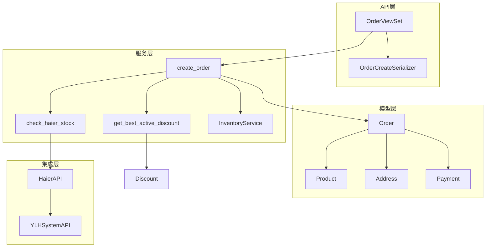

**图表来源**
- [backend/orders/views.py](file://backend/orders/views.py#L136-L205)
- [backend/orders/services.py](file://backend/orders/services.py#L219-L297)
- [backend/orders/models.py](file://backend/orders/models.py#L13-L67)

## 核心组件分析

### 订单模型(Order)

订单模型包含了完整的订单信息，支持多种状态和扩展功能：

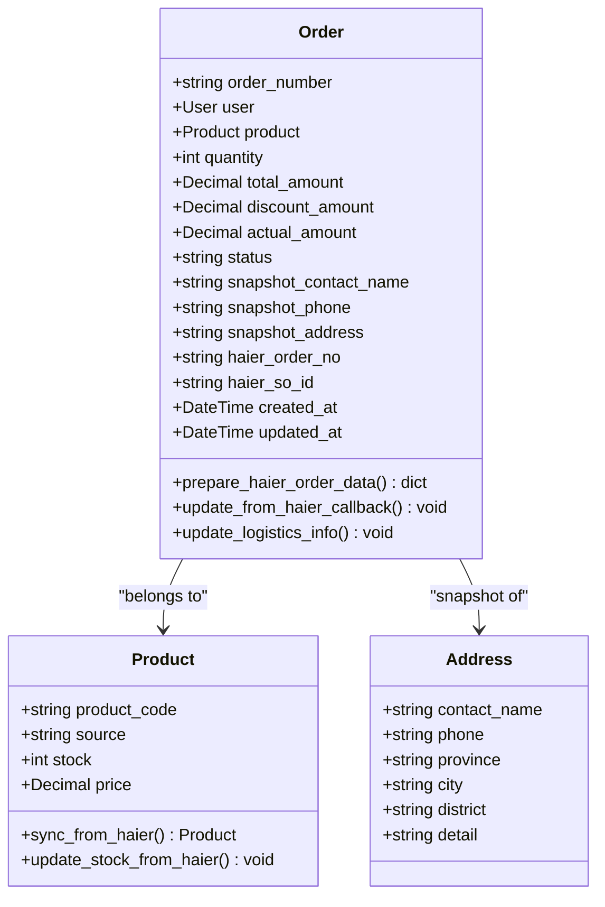

**图表来源**
- [backend/orders/models.py](file://backend/orders/models.py#L13-L67)
- [backend/catalog/models.py](file://backend/catalog/models.py#L43-L95)
- [backend/users/models.py](file://backend/users/models.py#L77-L95)

**章节来源**
- [backend/orders/models.py](file://backend/orders/models.py#L1-L322)
- [backend/catalog/models.py](file://backend/catalog/models.py#L1-L312)
- [backend/users/models.py](file://backend/users/models.py#L77-L95)

### 状态机(OrderStateMachine)

订单状态机确保了订单状态转换的合法性：

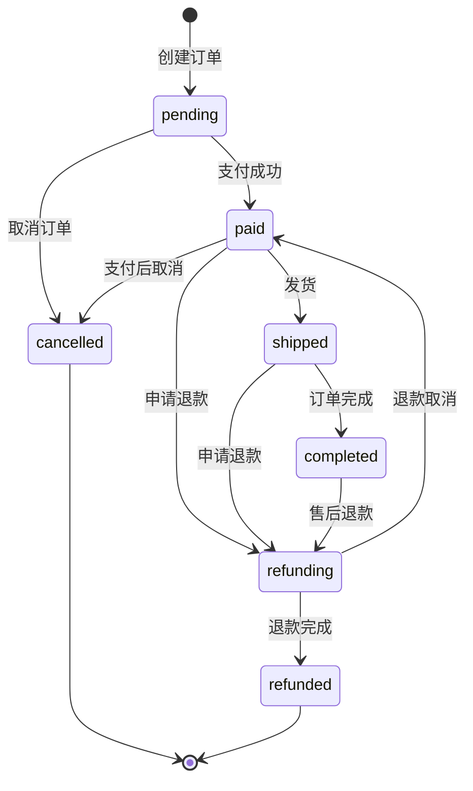

**图表来源**
- [backend/orders/state_machine.py](file://backend/orders/state_machine.py#L33-L56)

**章节来源**
- [backend/orders/state_machine.py](file://backend/orders/state_machine.py#L1-L289)

## 订单创建流程详解

### create_order函数核心逻辑

`create_order`函数是订单创建的核心入口，实现了完整的业务流程：

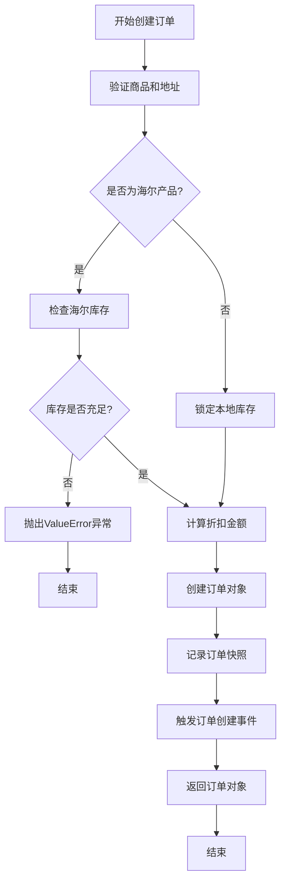

**图表来源**
- [backend/orders/services.py](file://backend/orders/services.py#L219-L297)

### 关键业务逻辑

1. **商品和地址验证**：确保商品存在且地址属于当前用户
2. **海尔产品特殊处理**：识别海尔产品并调用专门的库存检查
3. **折扣计算**：调用`get_best_active_discount`获取最优折扣
4. **库存锁定**：对于非海尔产品，使用`InventoryService.lock_stock`
5. **订单创建**：在事务中创建订单并保存快照数据

**章节来源**
- [backend/orders/services.py](file://backend/orders/services.py#L219-L297)

## 原子性操作与事务管理

### transaction.atomic的应用

系统在多个关键位置使用`transaction.atomic()`确保数据一致性：

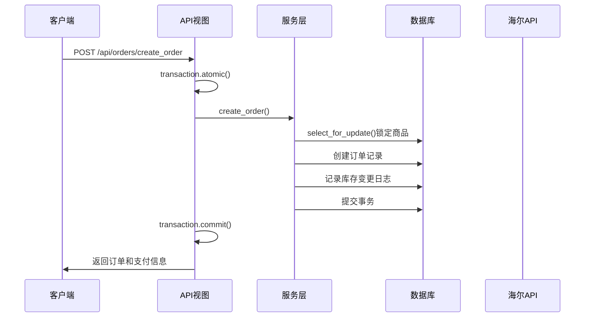

**图表来源**
- [backend/orders/views.py](file://backend/orders/views.py#L176-L197)
- [backend/orders/services.py](file://backend/orders/services.py#L264-L297)

### InventoryService的原子性保证

库存服务提供了完整的原子性操作：

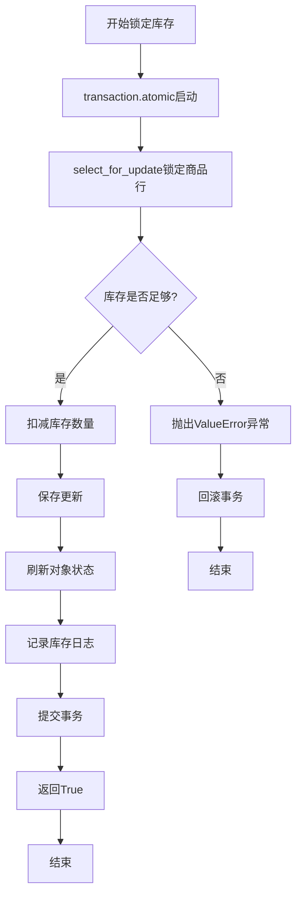

**图表来源**
- [backend/orders/services.py](file://backend/orders/services.py#L332-L372)

**章节来源**
- [backend/orders/services.py](file://backend/orders/services.py#L332-L372)
- [backend/orders/views.py](file://backend/orders/views.py#L176-L197)

## 海尔API集成

### check_haier_stock函数实现

海尔库存检查是订单流程的关键环节：

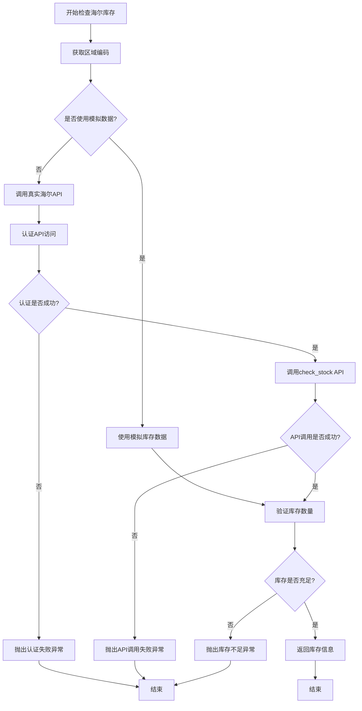

**图表来源**
- [backend/orders/services.py](file://backend/orders/services.py#L123-L216)

### 区域编码获取机制

系统使用`get_county_code`函数智能获取区域编码：

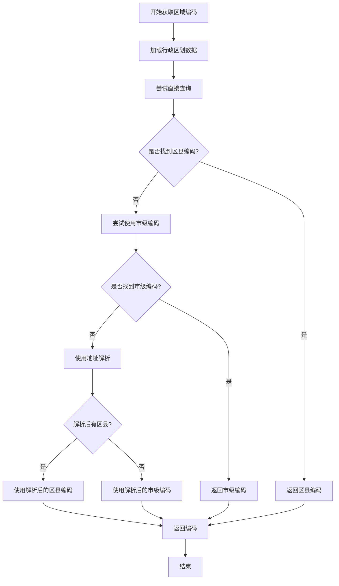

**图表来源**
- [backend/orders/services.py](file://backend/orders/services.py#L44-L121)

**章节来源**
- [backend/orders/services.py](file://backend/orders/services.py#L123-L216)
- [backend/integrations/haierapi.py](file://backend/integrations/haierapi.py#L121-L139)

## 折扣计算与缓存机制

### get_best_active_discount算法

折扣计算采用缓存机制优化性能：

```mermaid
flowchart TD
A[开始计算折扣] --> B{用户是否已认证?}
B --> |否| C[返回0]
B --> |是| D[生成缓存键]
D --> E[检查缓存]
E --> F{缓存中是否有值?}
F --> |是| G[返回缓存值]
F --> |否| H[查询有效的折扣]
H --> I[按优先级排序]
I --> J[获取最高优先级折扣]
J --> K{折扣金额是否有效?}
K --> |否| L[设置为0]
K --> |是| M[确保不超过商品价格]
L --> M
M --> N[设置缓存(60秒)]
N --> O[返回折扣金额]
C --> P[结束]
G --> P
O --> P
```

**图表来源**
- [backend/orders/services.py](file://backend/orders/services.py#L11-L41)

### 折扣系统架构

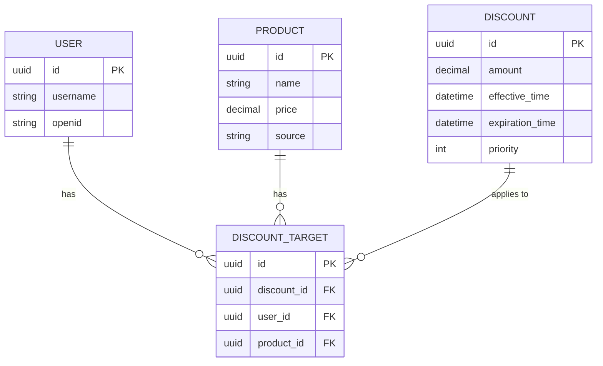

**图表来源**
- [backend/orders/models.py](file://backend/orders/models.py#L238-L322)

**章节来源**
- [backend/orders/services.py](file://backend/orders/services.py#L11-L41)
- [backend/orders/models.py](file://backend/orders/models.py#L238-L322)

## 订单快照数据生成

### 快照数据结构

订单创建时会生成完整的快照数据，确保历史数据的完整性：

| 快照字段 | 类型 | 描述 | 来源 |
|---------|------|------|------|
| snapshot_contact_name | string | 联系人姓名 | Address.contact_name |
| snapshot_phone | string | 联系电话 | Address.phone |
| snapshot_address | string | 完整地址 | province + city + district + detail |
| snapshot_province | string | 省份 | Address.province |
| snapshot_city | string | 城市 | Address.city |
| snapshot_district | string | 区县 | Address.district |
| snapshot_town | string | 乡镇街道 | Address.town |

### 地址拼接逻辑

系统使用`full_address`变量生成完整的地址字符串：

```python
full_address = f"{address.province} {address.city} {address.district} {address.detail}"
```

这种设计确保了即使地址信息发生变化，订单历史仍然保留原始的收货信息。

**章节来源**
- [backend/orders/services.py](file://backend/orders/services.py#L255-L257)
- [backend/orders/models.py](file://backend/orders/models.py#L35-L42)

## API视图层处理

### OrderViewSet.create_order方法

API视图层负责处理HTTP请求并协调服务层：

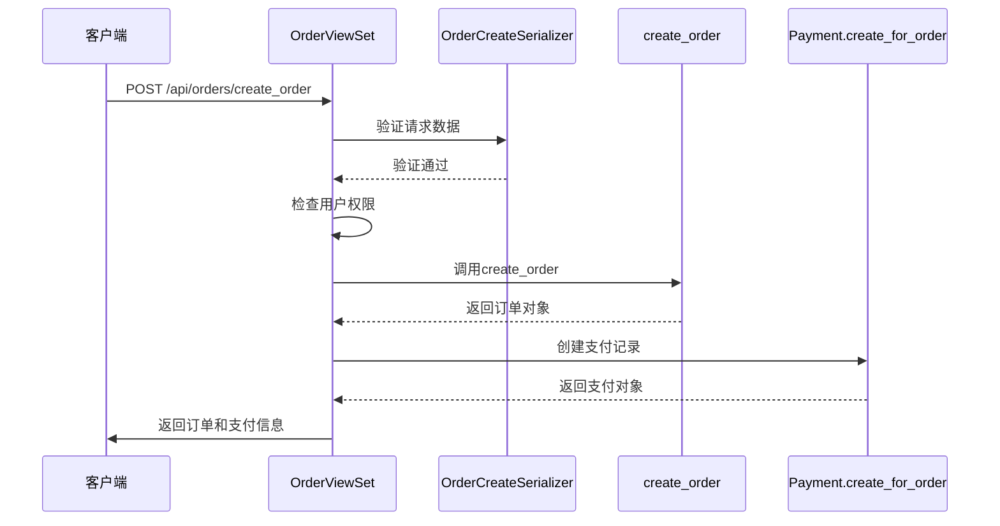

**图表来源**
- [backend/orders/views.py](file://backend/orders/views.py#L136-L205)

### 异常处理策略

API视图实现了分层的异常处理：

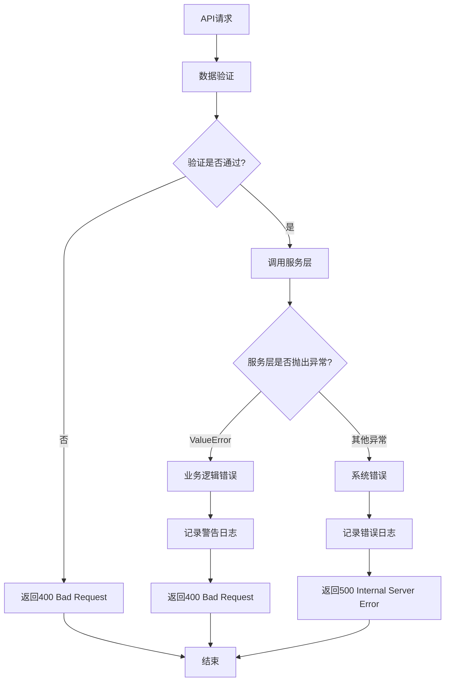

**图表来源**
- [backend/orders/views.py](file://backend/orders/views.py#L198-L208)

**章节来源**
- [backend/orders/views.py](file://backend/orders/views.py#L136-L205)

## 异常处理与错误场景

### 库存不足场景

当库存不足时，系统会抛出`ValueError`异常：

```python
# 海尔库存不足
raise ValueError(f'海尔产品库存不足，当前库存: {available_stock}，需要: {quantity}')

# 本地库存不足  
raise ValueError(f'库存不足，当前库存: {product.stock}，需要: {quantity}')
```

### 订单创建失败的处理流程

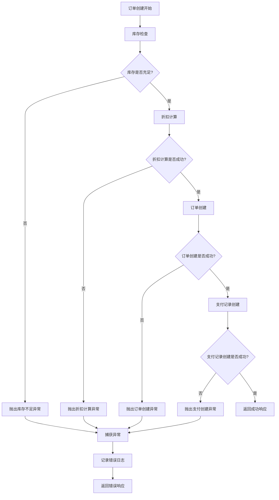

**图表来源**
- [backend/orders/views.py](file://backend/orders/views.py#L198-L208)

### 常见错误场景及处理

| 错误类型 | HTTP状态码 | 异常信息 | 处理方式 |
|---------|-----------|----------|----------|
| 库存不足 | 400 | "海尔产品库存不足..." | 返回具体库存信息 |
| 商品不存在 | 404 | "商品不存在" | 提示用户重新选择商品 |
| 地址不存在 | 404 | "地址不存在" | 提示用户添加新地址 |
| 权限不足 | 403 | "Not allowed" | 检查用户权限 |
| 系统异常 | 500 | "创建订单失败: ..." | 记录详细错误日志 |

**章节来源**
- [backend/orders/views.py](file://backend/orders/views.py#L198-L208)
- [backend/orders/services.py](file://backend/orders/services.py#L251-L253)

## 性能优化考虑

### 缓存策略

系统在多个层面实施缓存优化：

1. **折扣缓存**：`get_best_active_discount`使用60秒TTL缓存
2. **库存缓存**：海尔库存信息可以考虑短期缓存
3. **地址解析缓存**：区域编码解析结果可缓存

### 数据库优化

1. **索引优化**：订单表包含多个复合索引
2. **预取查询**：使用`select_related`和`prefetch_related`减少查询
3. **批量操作**：批量创建订单时使用事务

### 并发控制

1. **行级锁**：`select_for_update()`确保库存操作的原子性
2. **乐观锁**：版本控制防止并发修改冲突
3. **队列处理**：高并发场景下使用消息队列异步处理

## 总结

电动小程序的订单处理系统展现了现代电商系统的设计精髓：

1. **完整的业务流程**：从商品选择到支付完成的全流程覆盖
2. **强一致性的保障**：通过事务和行级锁确保数据一致性
3. **高效的性能优化**：缓存机制和数据库优化提升系统性能
4. **灵活的扩展能力**：模块化设计支持未来功能扩展
5. **健壮的异常处理**：多层次的异常处理确保系统稳定性

该系统特别在海尔API集成方面表现出色，实现了与外部系统的无缝对接，同时保持了内部业务逻辑的清晰和稳定。通过合理的架构设计和最佳实践的应用，为用户提供了一个可靠、高效的订单处理平台。