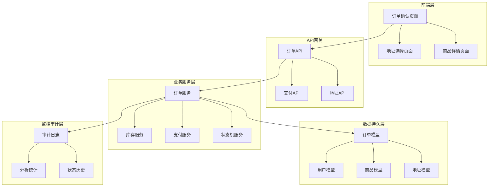
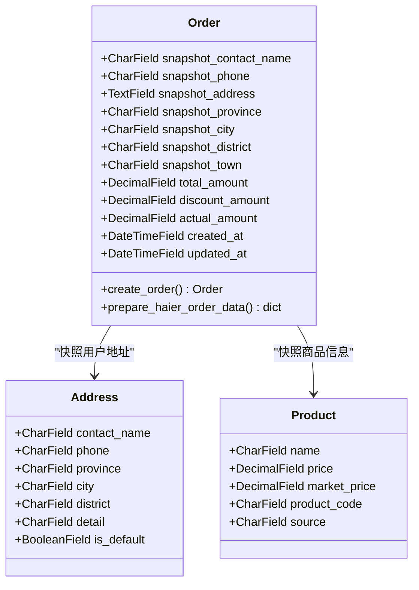
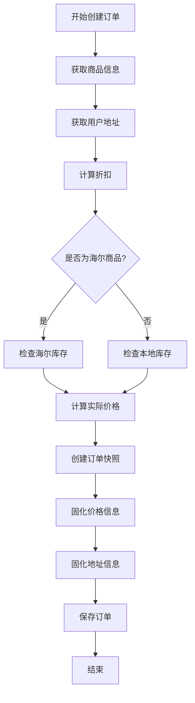
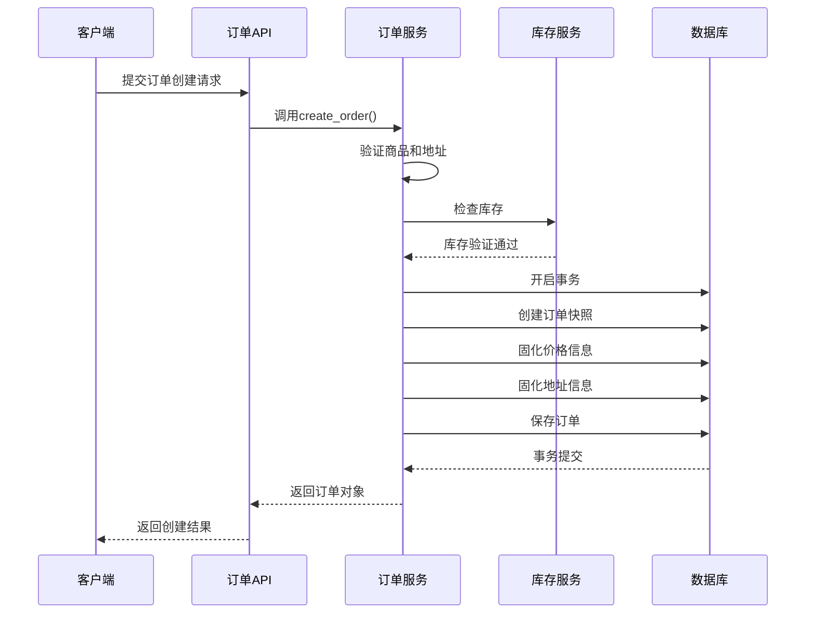
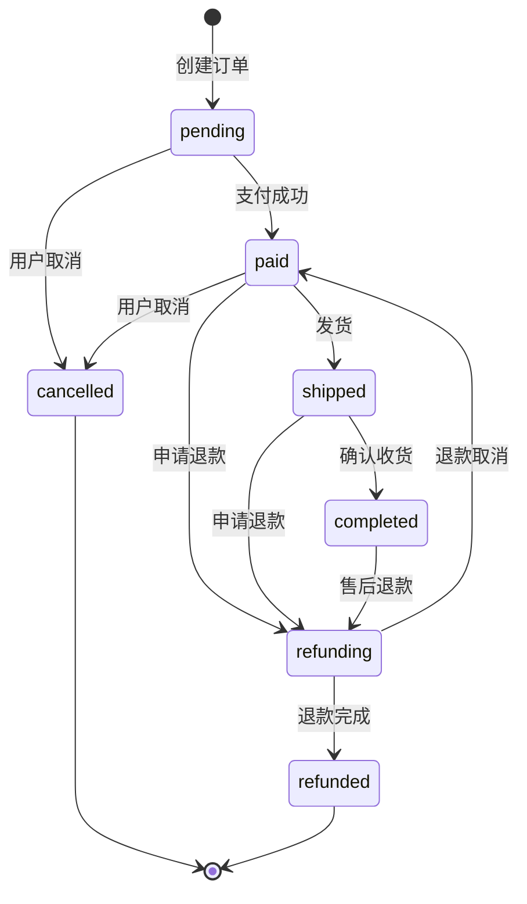

# 订单快照生成

<cite>
**本文档引用的文件**
- [backend/orders/models.py](file://backend/orders/models.py)
- [backend/orders/services.py](file://backend/orders/services.py)
- [backend/orders/serializers.py](file://backend/orders/serializers.py)
- [backend/orders/views.py](file://backend/orders/views.py)
- [backend/orders/state_machine.py](file://backend/orders/state_machine.py)
- [backend/orders/analytics.py](file://backend/orders/analytics.py)
- [backend/users/models.py](file://backend/users/models.py)
- [backend/catalog/models.py](file://backend/catalog/models.py)
- [backend/common/audit_logger.py](file://backend/common/audit_logger.py)
- [backend/orders/migrations/0003_remove_order_address_order_snapshot_address_and_more.py](file://backend/orders/migrations/0003_remove_order_address_order_snapshot_address_and_more.py)
- [frontend/src/pages/order-confirm/index.tsx](file://frontend/src/pages/order-confirm/index.tsx)
- [frontend/src/services/order.ts](file://frontend/src/services/order.ts)
</cite>

## 目录
1. [引言](#引言)
2. [项目架构概览](#项目架构概览)
3. [订单快照核心设计](#订单快照核心设计)
4. [快照数据来源与提取](#快照数据来源与提取)
5. [快照字段存储方式](#快照字段存储方式)
6. [快照生成流程](#快照生成流程)
7. [快照在业务流程中的应用](#快照在业务流程中的应用)
8. [快照对系统价值](#快照对系统价值)
9. [扩展与优化建议](#扩展与优化建议)
10. [总结](#总结)

## 引言

订单快照是电商系统中至关重要的数据保护机制，它在订单创建时将用户地址、商品价格等关键信息固化下来，确保后续的订单追踪、财务对账和售后服务能够基于稳定的原始数据进行。本文档深入分析了Electric小程序项目的订单快照设计与实现，探讨了其架构理念、技术实现和业务价值。

## 项目架构概览

该项目采用前后端分离的微服务架构，后端基于Django框架构建，前端使用Taro跨平台框架开发。订单系统作为核心业务模块，包含了完整的订单生命周期管理功能。

**图表来源**
- [frontend/src/pages/order-confirm/index.tsx](file://frontend/src/pages/order-confirm/index.tsx#L1-L240)
- [backend/orders/views.py](file://backend/orders/views.py#L1-L200)
- [backend/orders/models.py](file://backend/orders/models.py#L1-L322)

## 订单快照核心设计

### 设计理念

订单快照的核心设计理念是在订单创建的关键时刻，将所有影响交易的重要信息固化下来，形成一个不可变的数据快照。这种设计解决了以下关键问题：

1. **数据一致性保障**：防止后续的商品价格变动、地址修改等影响订单的准确性
2. **审计追溯需求**：为财务对账、纠纷处理提供可靠的原始数据依据
3. **业务流程稳定性**：确保订单在整个生命周期内的数据稳定性和可预测性

### 核心字段设计

系统在Order模型中定义了专门的快照字段，这些字段在订单创建时被初始化，并在整个订单生命周期内保持不变：

**图表来源**
- [backend/orders/models.py](file://backend/orders/models.py#L36-L42)
- [backend/users/models.py](file://backend/users/models.py#L77-L95)
- [backend/catalog/models.py](file://backend/catalog/models.py#L43-L200)

**章节来源**
- [backend/orders/models.py](file://backend/orders/models.py#L36-L42)
- [backend/orders/services.py](file://backend/orders/services.py#L258-L290)

## 快照数据来源与提取

### 用户地址快照

用户地址信息从Address模型中提取，包括联系人姓名、电话号码、完整的省市区地址信息。这些信息在订单创建时被固化，即使用户后续修改了地址，也不会影响订单中的快照数据。

### 商品信息快照

商品信息快照涵盖了商品的核心属性：
- **基础价格信息**：商品的市场价、零售价
- **商品标识**：商品编码、型号等唯一标识
- **来源信息**：区分本地商品和海尔商品的来源标记

### 价格计算与快照

系统在订单创建过程中会进行复杂的折扣计算，然后将最终的价格信息固化到快照中：

**图表来源**
- [backend/orders/services.py](file://backend/orders/services.py#L258-L297)

**章节来源**
- [backend/orders/services.py](file://backend/orders/services.py#L258-L297)
- [backend/users/models.py](file://backend/users/models.py#L77-L95)
- [backend/catalog/models.py](file://backend/catalog/models.py#L43-L200)

## 快照字段存储方式

### 独立字段存储

系统采用独立字段的方式存储快照数据，每个快照字段都有明确的用途和语义：

| 字段名称 | 数据类型 | 描述 | 存储位置 |
|---------|---------|------|----------|
| snapshot_contact_name | CharField(50) | 联系人姓名 | 独立字段 |
| snapshot_phone | CharField(20) | 手机号码 | 独立字段 |
| snapshot_address | TextField | 完整地址 | 独立字段 |
| snapshot_province | CharField(50) | 省份 | 独立字段 |
| snapshot_city | CharField(50) | 城市 | 独立字段 |
| snapshot_district | CharField(50) | 区县 | 独立字段 |
| snapshot_town | CharField(50) | 乡镇街道 | 独立字段 |

### JSON字段存储

对于某些复杂的数据结构，系统使用JSON字段进行存储，如配送安装照片等多媒体信息。

**章节来源**
- [backend/orders/models.py](file://backend/orders/models.py#L36-L62)

## 快照生成流程

### 订单创建时的快照生成

订单创建过程中的快照生成是一个严格控制的事务性操作：

**图表来源**
- [backend/orders/views.py](file://backend/orders/views.py#L175-L205)
- [backend/orders/services.py](file://backend/orders/services.py#L258-L297)

### 快照数据的完整性保证

系统通过多种机制确保快照数据的完整性：

1. **事务控制**：整个快照生成过程在一个数据库事务中完成
2. **数据验证**：在快照生成前进行严格的输入验证
3. **原子操作**：确保快照数据的一致性

**章节来源**
- [backend/orders/views.py](file://backend/orders/views.py#L175-L205)
- [backend/orders/services.py](file://backend/orders/services.py#L258-L297)

## 快照在业务流程中的应用

### 订单状态流转

订单快照在状态流转过程中发挥重要作用：

**图表来源**
- [backend/orders/state_machine.py](file://backend/orders/state_machine.py#L33-L56)

### 海尔订单集成

对于海尔商品，系统会生成特殊的快照数据，用于与海尔系统的对接：

**章节来源**
- [backend/orders/models.py](file://backend/orders/models.py#L86-L118)
- [backend/orders/state_machine.py](file://backend/orders/state_machine.py#L1-L289)

## 快照对系统价值

### 订单追踪价值

快照数据为订单追踪提供了可靠的基础：

1. **地址追踪**：即使用户修改地址，也能追溯到下单时的实际收货地址
2. **价格追踪**：确保每个订单都能准确追溯到当时的定价策略
3. **商品信息追踪**：保留商品的完整历史信息

### 财务对账价值

快照数据在财务对账中发挥关键作用：

1. **收入确认**：基于快照价格确认收入
2. **成本核算**：追溯采购成本
3. **税务合规**：提供准确的交易凭证

### 售后服务价值

快照数据为售后服务提供了重要支撑：

1. **争议解决**：提供交易发生时的准确证据
2. **退换货处理**：确保退换货基于原始交易条件
3. **质量追溯**：追踪商品的质量问题源头

**章节来源**
- [backend/orders/analytics.py](file://backend/orders/analytics.py#L1-L322)
- [backend/common/audit_logger.py](file://backend/common/audit_logger.py#L1-L348)

## 扩展与优化建议

### 快照字段扩展

1. **商品规格快照**：除了基本信息，还可以快照商品的规格参数
2. **促销活动快照**：记录参与的促销活动信息
3. **物流模板快照**：记录使用的物流模板配置

### 审计日志集成

建议增强审计日志功能：

1. **快照变更追踪**：记录快照字段的任何变更
2. **权限控制审计**：记录谁访问了哪些快照数据
3. **时间戳精确化**：使用更高精度的时间戳

### 性能优化

1. **快照数据压缩**：对大型快照数据进行压缩存储
2. **索引优化**：为快照查询创建合适的索引
3. **缓存策略**：对频繁查询的快照数据进行缓存

### 数据治理

1. **快照生命周期管理**：制定快照数据的保留和清理策略
2. **数据质量监控**：监控快照数据的完整性和准确性
3. **合规性检查**：确保快照数据符合相关法规要求

**章节来源**
- [backend/common/audit_logger.py](file://backend/common/audit_logger.py#L1-L348)

## 总结

订单快照设计是Electric小程序项目中的一个精心设计的架构决策，它体现了系统对数据完整性、业务连续性和审计追溯性的高度重视。通过将用户地址、商品价格等关键信息在订单创建时固化，系统确保了订单数据的稳定性和可靠性。

这种设计不仅满足了当前的业务需求，还为未来的扩展和优化奠定了坚实的基础。随着业务的发展，这套快照机制可以进一步扩展和完善，为企业的数字化转型提供强有力的支持。

快照机制的成功实施证明了良好的架构设计能够为企业带来显著的竞争优势，特别是在电商领域，数据的准确性和可追溯性是赢得客户信任的关键因素。