# 状态变更后业务逻辑

<cite>
**本文档引用的文件**
- [orders/state_machine.py](file://backend/orders/state_machine.py)
- [orders/management/commands/cancel_unpaid_orders.py](file://backend/orders/management/commands/cancel_unpaid_orders.py)
- [orders/services.py](file://backend/orders/services.py)
- [orders/models.py](file://backend/orders/models.py)
- [catalog/models.py](file://backend/catalog/models.py)
- [orders/migrations/0008_add_order_status_history.py](file://backend/orders/migrations/0008_add_order_status_history.py)
</cite>

## 目录
1. [概述](#概述)
2. [_handle_post_transition方法详解](#_handle_post_transition方法详解)
3. [状态变更业务逻辑架构](#状态变更业务逻辑架构)
4. [具体状态变更处理流程](#具体状态变更处理流程)
5. [事务性操作与异常处理](#事务性操作与异常处理)
6. [自动化订单取消机制](#自动化订单取消机制)
7. [数据一致性保障](#数据一致性保障)
8. [总结](#总结)

## 概述

在电商系统中，订单状态的变更不仅仅是简单的状态更新，更涉及复杂的业务逻辑处理。本文档深入分析 `_handle_post_transition` 方法中实现的状态变更后业务逻辑，重点说明订单状态在不同场景下的业务处理机制，包括库存管理、销量统计、异常处理等核心功能。

该系统采用状态机模式管理订单状态流转，确保状态转换的合法性，并在状态变更后自动触发相应的业务逻辑，保证系统的数据一致性和业务完整性。

## _handle_post_transition方法详解

### 方法核心功能

`_handle_post_transition` 方法是订单状态机的核心组件，负责在状态转换完成后执行相应的业务逻辑。该方法根据新的订单状态执行不同的业务处理，主要包括：

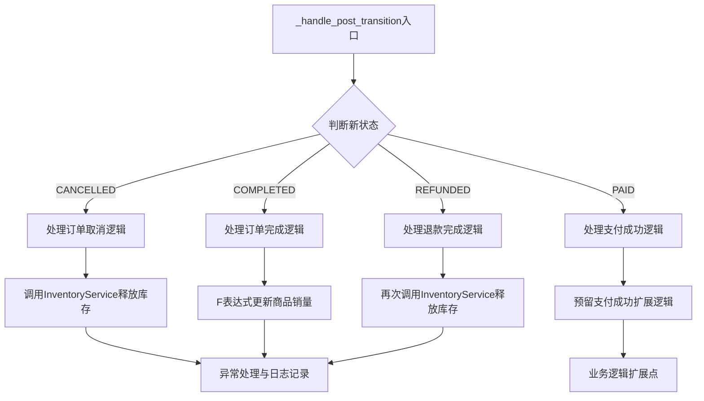

**图表来源**
- [orders/state_machine.py](file://backend/orders/state_machine.py#L178-L210)

### 状态转换触发机制

状态转换通过 `OrderStateMachine.transition` 方法触发，该方法包含完整的事务控制和异常处理：

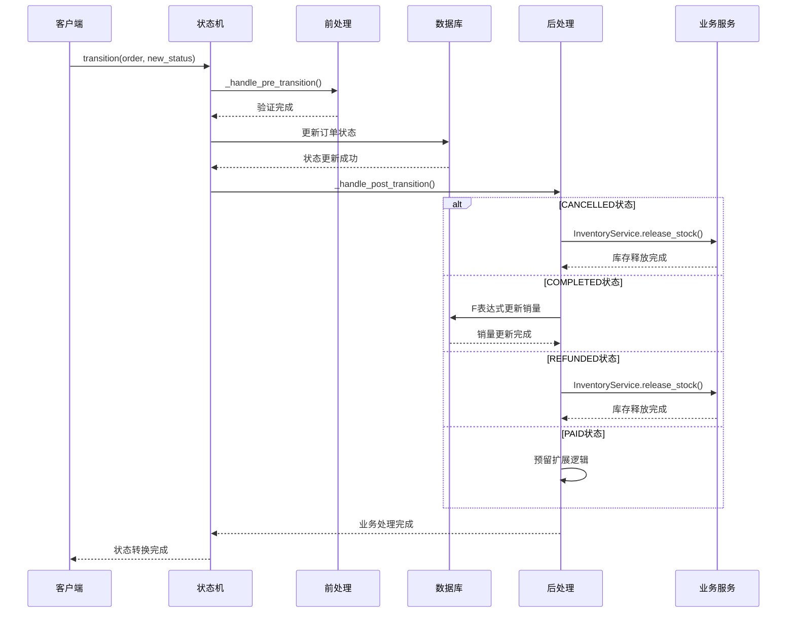

**图表来源**
- [orders/state_machine.py](file://backend/orders/state_machine.py#L96-L154)

**章节来源**
- [orders/state_machine.py](file://backend/orders/state_machine.py#L178-L210)

## 状态变更业务逻辑架构

### 状态机设计模式

系统采用状态机模式管理订单状态，定义了明确的状态转换规则：

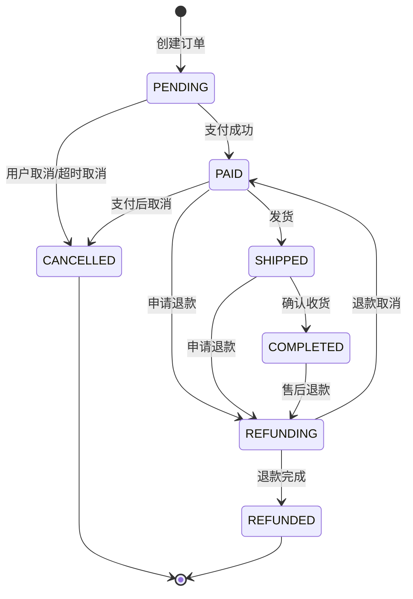

**图表来源**
- [orders/state_machine.py](file://backend/orders/state_machine.py#L34-L56)

### 业务逻辑分层架构

系统采用分层架构设计，确保业务逻辑的清晰分离：

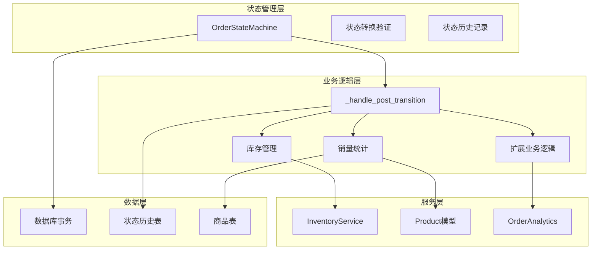

**图表来源**
- [orders/state_machine.py](file://backend/orders/state_machine.py#L25-L154)

**章节来源**
- [orders/state_machine.py](file://backend/orders/state_machine.py#L25-L154)

## 具体状态变更处理流程

### CANCELLED状态处理流程

当订单状态变为 `CANCELLED` 时，系统会自动调用库存释放逻辑：

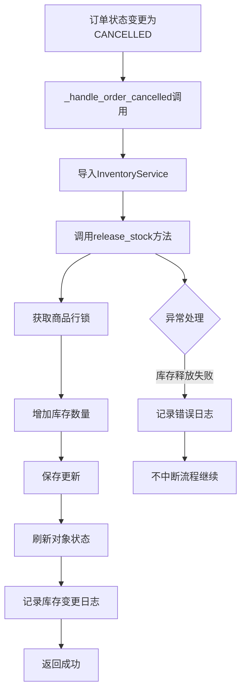

**图表来源**
- [orders/state_machine.py](file://backend/orders/state_machine.py#L212-L232)
- [orders/services.py](file://backend/orders/services.py#L374-L408)

#### 库存释放实现细节

库存释放通过 `InventoryService.release_stock` 方法实现，采用数据库行锁确保并发安全：

- **行锁机制**：使用 `select_for_update()` 获取商品行锁，防止并发修改导致的库存不一致
- **原子性操作**：通过 F 表达式实现库存数量的原子性增加
- **事务控制**：整个操作在数据库事务中执行，确保数据一致性
- **日志记录**：记录库存变更的详细信息，便于审计和追踪

**章节来源**
- [orders/state_machine.py](file://backend/orders/state_machine.py#L212-L232)
- [orders/services.py](file://backend/orders/services.py#L374-L408)

### COMPLETED状态处理流程

订单状态变为 `COMPLETED` 时，系统会更新商品的销量统计：

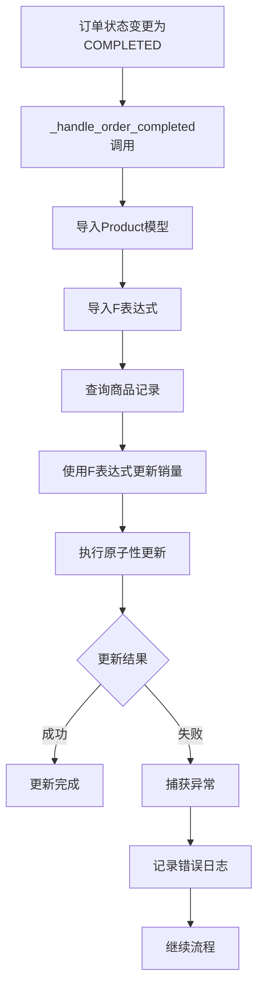

**图表来源**
- [orders/state_machine.py](file://backend/orders/state_machine.py#L235-L252)

#### F表达式原子性更新机制

销量更新采用 Django 的 F 表达式实现原子性操作：

- **原子性保证**：F 表达式确保在数据库层面完成销量累加，避免竞态条件
- **性能优化**：直接在数据库层面执行更新，减少数据传输和内存操作
- **并发安全**：多个并发请求同时更新同一件商品的销量时，最终结果正确

**章节来源**
- [orders/state_machine.py](file://backend/orders/state_machine.py#L235-L252)

### REFUNDED状态处理流程

订单状态变为 `REFUNDED` 时，系统会再次释放库存：

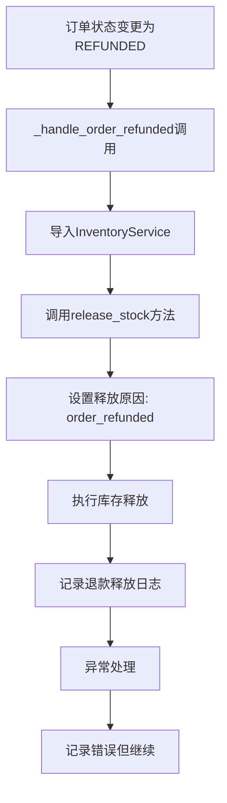

**图表来源**
- [orders/state_machine.py](file://backend/orders/state_machine.py#L255-L275)

#### 退款释放与取消释放的区别

虽然都调用 `release_stock` 方法，但两者有细微差别：

- **释放原因不同**：取消订单释放为 `order_cancelled`，退款释放为 `order_refunded`
- **业务语义不同**：反映不同的业务场景和处理目的
- **日志追踪不同**：便于区分不同的库存变动原因

**章节来源**
- [orders/state_machine.py](file://backend/orders/state_machine.py#L255-L275)

### PAID状态预留扩展逻辑

对于 `PAID` 状态，系统预留了扩展业务逻辑的位置：

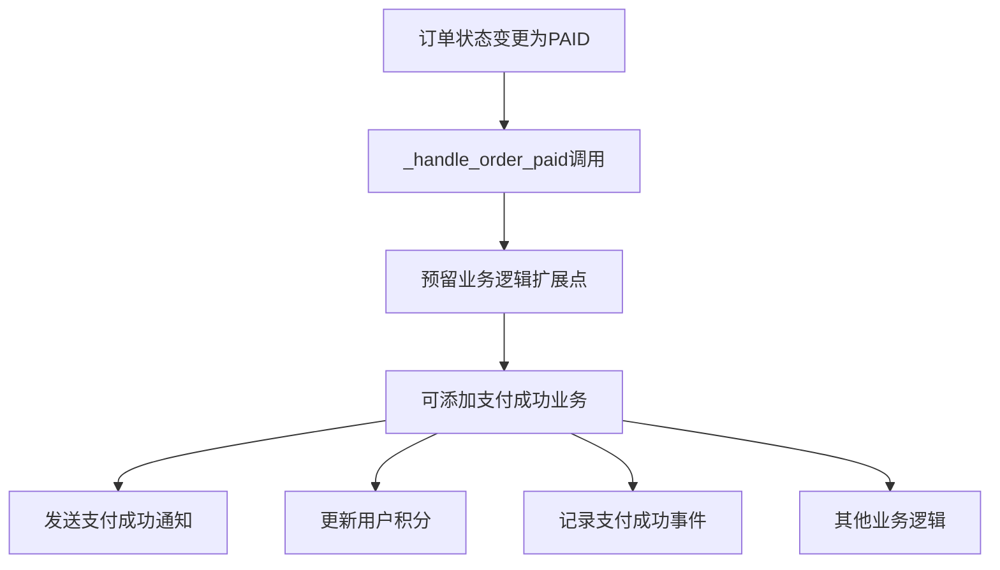

**图表来源**
- [orders/state_machine.py](file://backend/orders/state_machine.py#L278-L288)

#### 扩展逻辑的设计原则

PAID状态的扩展逻辑遵循以下设计原则：

- **预留接口**：保持方法存在但不执行任何操作，为未来扩展提供空间
- **向后兼容**：现有功能不受影响，新增功能可逐步添加
- **业务解耦**：将具体的业务逻辑留给专门的服务类处理

**章节来源**
- [orders/state_machine.py](file://backend/orders/state_machine.py#L278-L288)

## 事务性操作与异常处理

### 事务控制机制

系统在多个层面实现了事务控制，确保数据一致性：

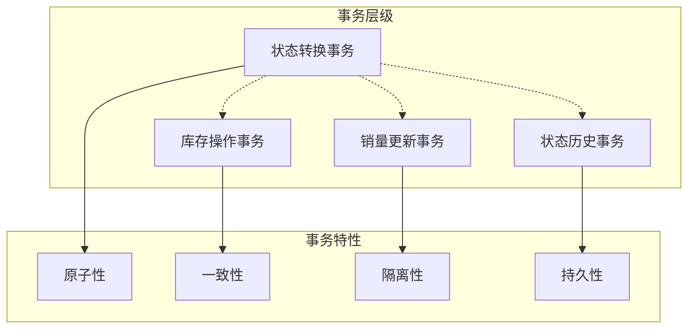

**图表来源**
- [orders/state_machine.py](file://backend/orders/state_machine.py#L96-L154)
- [orders/services.py](file://backend/orders/services.py#L333-L451)

### 异常处理策略

系统采用多层次的异常处理策略：

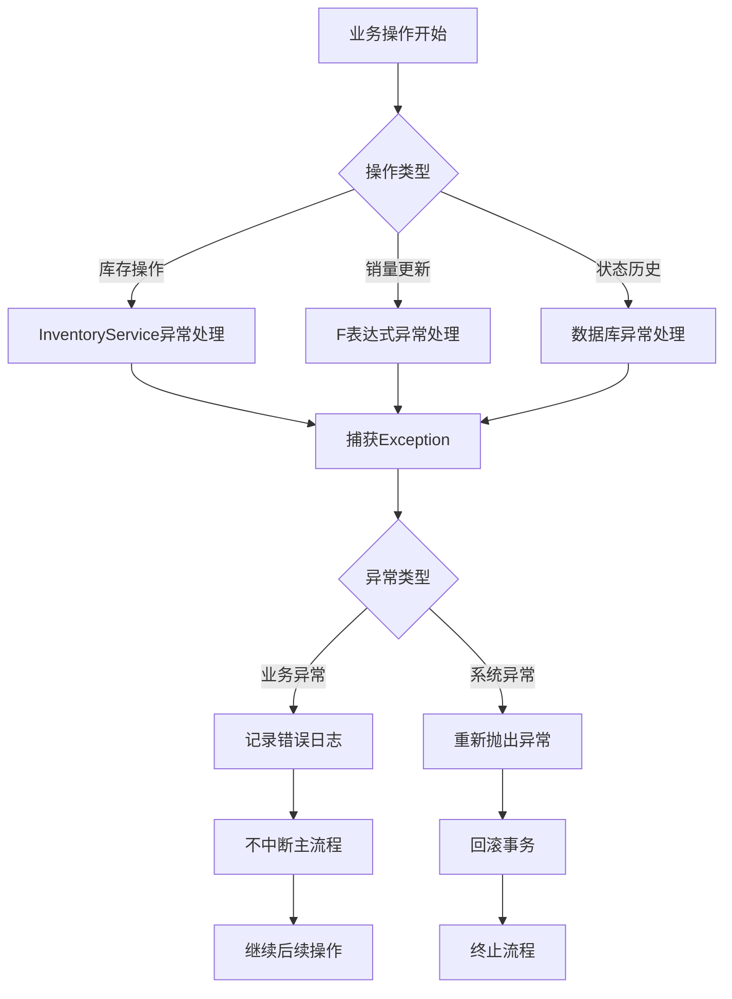

**图表来源**
- [orders/state_machine.py](file://backend/orders/state_machine.py#L231-L232)
- [orders/state_machine.py](file://backend/orders/state_machine.py#L251-L252)

#### 异常处理的具体实现

- **库存操作异常**：捕获所有异常，记录错误信息但不中断状态转换流程
- **销量更新异常**：同样采用忽略异常的方式，确保状态转换的完整性
- **状态历史异常**：由于状态历史记录不是核心业务，也采用宽松的异常处理

**章节来源**
- [orders/state_machine.py](file://backend/orders/state_machine.py#L231-L232)
- [orders/state_machine.py](file://backend/orders/state_machine.py#L251-L252)

## 自动化订单取消机制

### cancel_unpaid_orders命令

系统提供了自动化取消未支付订单的功能，通过 `cancel_unpaid_orders` 命令实现：

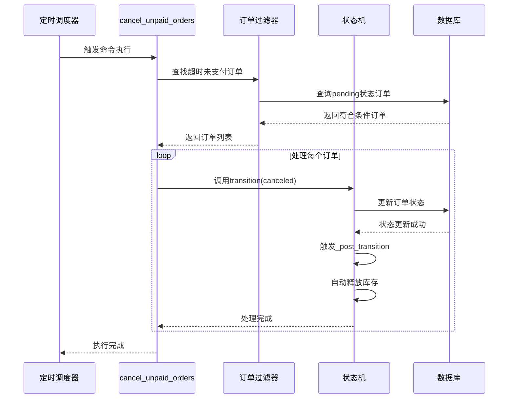

**图表来源**
- [orders/management/commands/cancel_unpaid_orders.py](file://backend/orders/management/commands/cancel_unpaid_orders.py#L99-L116)

### 自动化取消的工作流程

自动化取消订单的过程体现了状态机驱动的核心业务流程：

1. **订单筛选**：查找超过支付超时时间的待支付订单
2. **状态转换**：通过状态机将订单状态从 `pending` 转换为 `cancelled`
3. **库存释放**：状态转换触发 `_handle_post_transition`，自动释放库存
4. **日志记录**：记录取消操作的详细信息
5. **批量处理**：支持批量处理多个超时订单

**章节来源**
- [orders/management/commands/cancel_unpaid_orders.py](file://backend/orders/management/commands/cancel_unpaid_orders.py#L99-L116)

### 支持的配置选项

`cancel_unpaid_orders` 命令提供了灵活的配置选项：

| 参数 | 默认值 | 描述 |
|------|--------|------|
| `--timeout-minutes` | 30 | 支付超时时间（分钟） |
| `--dry-run` | False | 仅显示将要取消的订单，不实际执行 |

这种设计使得系统管理员可以根据业务需求灵活调整超时时间，同时提供安全的测试模式。

**章节来源**
- [orders/management/commands/cancel_unpaid_orders.py](file://backend/orders/management/commands/cancel_unpaid_orders.py#L28-L40)

## 数据一致性保障

### 多层次的一致性保证

系统通过多种机制确保数据一致性：

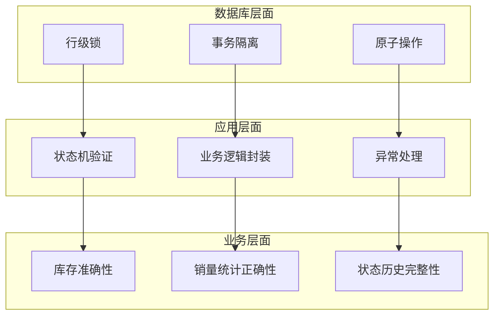

### 关键一致性保证机制

#### 1. 库存一致性保证

- **行锁机制**：库存操作使用 `select_for_update()` 防止并发修改
- **F表达式更新**：销量统计使用原子性更新避免竞态条件
- **事务边界**：库存释放和状态更新在同一事务中完成

#### 2. 状态历史一致性

- **原子性记录**：状态历史记录与状态更新在同一事务中完成
- **完整追溯**：记录每次状态变更的详细信息，包括操作人和备注
- **索引优化**：为状态历史查询建立合适的索引

#### 3. 业务数据一致性

- **异常容忍**：业务逻辑异常不影响核心状态转换
- **补偿机制**：通过状态历史记录支持后续的数据校验和修复
- **审计追踪**：完整的操作日志便于问题排查和审计

**章节来源**
- [orders/state_machine.py](file://backend/orders/state_machine.py#L96-L154)
- [orders/services.py](file://backend/orders/services.py#L333-L451)

## 总结

本文档详细分析了电商系统中订单状态变更后业务逻辑的实现机制。通过 `_handle_post_transition` 方法，系统实现了：

1. **状态机驱动的业务流程**：通过状态机模式确保状态转换的合法性和业务逻辑的完整性
2. **精细化的库存管理**：在不同状态变更时精确控制库存的锁定和释放
3. **原子性的销量统计**：使用 F 表达式确保销量统计的准确性和并发安全性
4. **完善的异常处理**：多层次的异常处理策略保证系统的稳定性和数据一致性
5. **自动化运维支持**：通过管理命令实现订单的自动化管理和清理

这套状态变更后业务逻辑体系不仅保证了核心业务功能的正确性，还为未来的功能扩展提供了良好的架构基础。通过事务性操作和异常处理机制，系统能够在各种复杂场景下保持数据的一致性和业务的连续性。