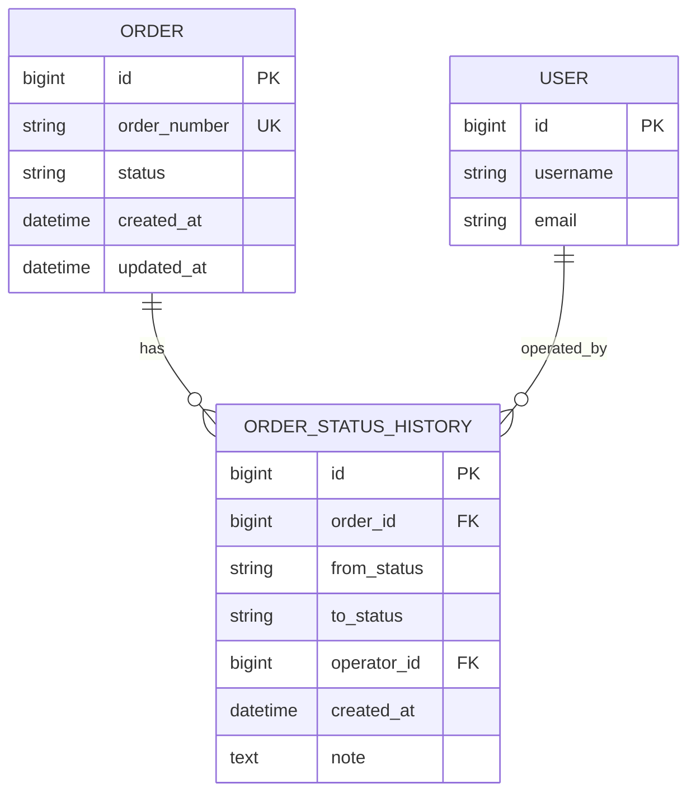
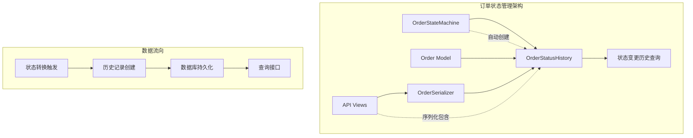
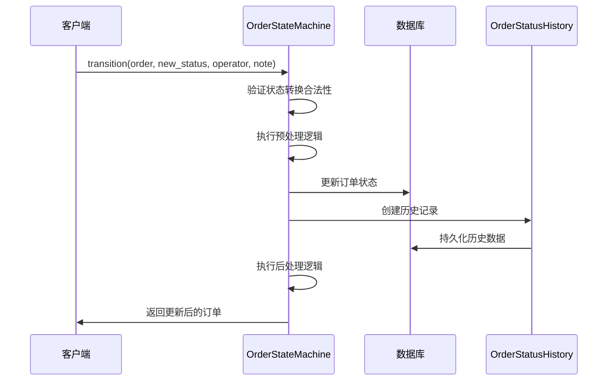
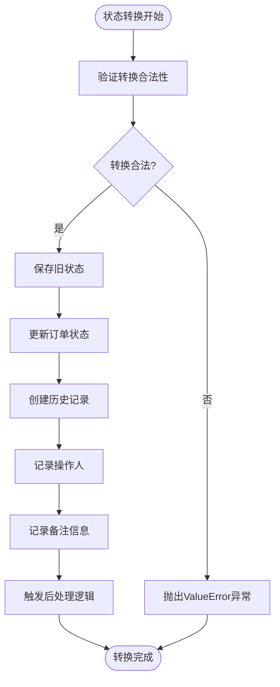
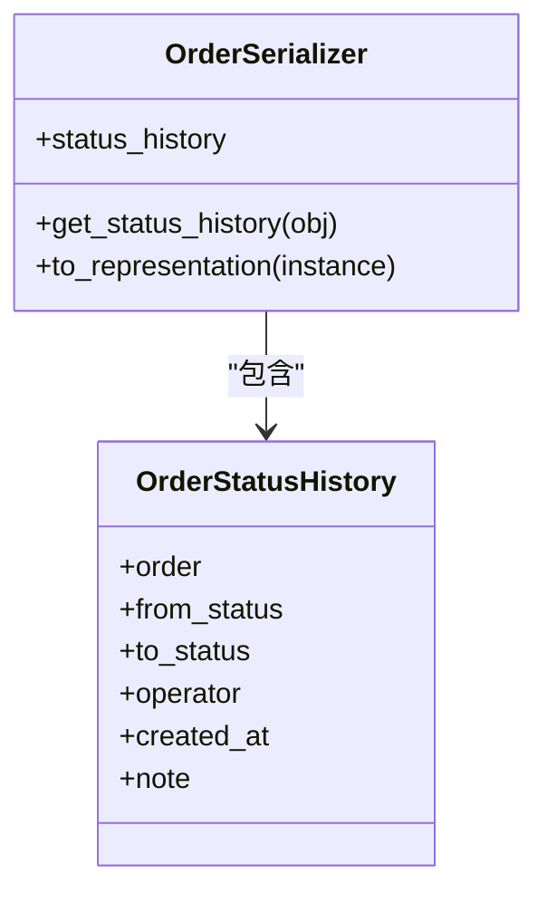
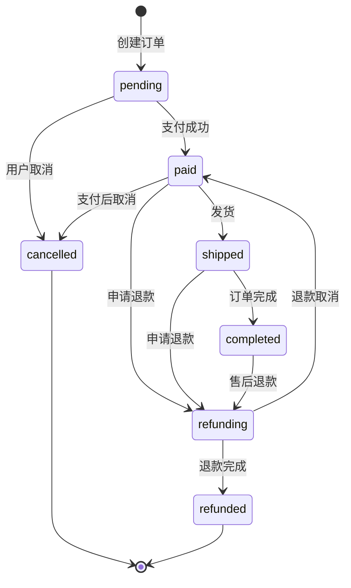
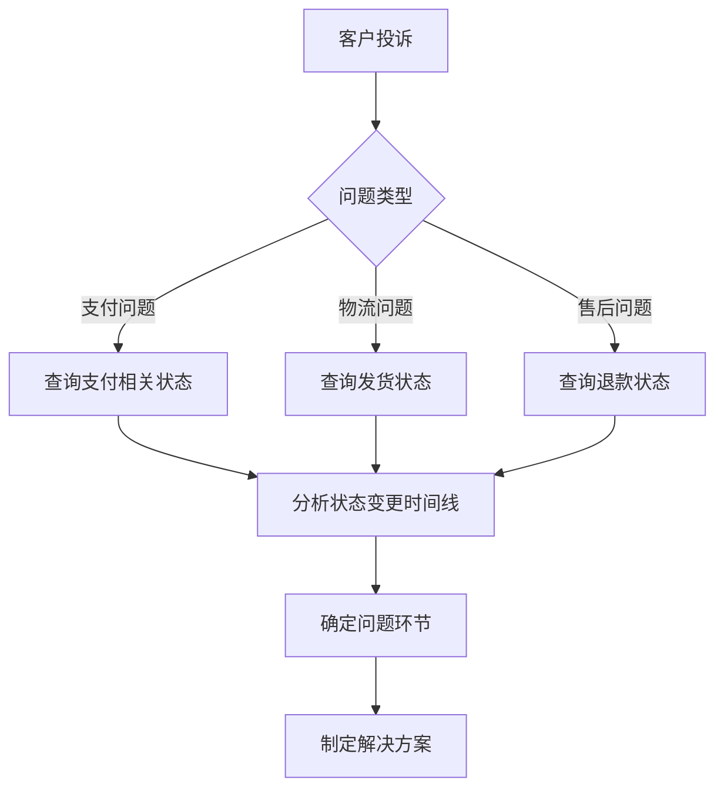

# 订单状态变更历史

<cite>
**本文档引用的文件**
- [0008_add_order_status_history.py](file://backend/orders/migrations/0008_add_order_status_history.py)
- [models.py](file://backend/orders/models.py)
- [state_machine.py](file://backend/orders/state_machine.py)
- [views.py](file://backend/orders/views.py)
- [serializers.py](file://backend/orders/serializers.py)
- [urls.py](file://backend/orders/urls.py)
</cite>

## 目录
1. [简介](#简介)
2. [模型设计](#模型设计)
3. [架构概述](#架构概述)
4. [详细组件分析](#详细组件分析)
5. [状态机集成](#状态机集成)
6. [API使用示例](#api使用示例)
7. [应用场景](#应用场景)
8. [性能考虑](#性能考虑)
9. [故障排除指南](#故障排除指南)
10. [总结](#总结)

## 简介

OrderStatusHistory模型是电小满商城订单管理系统中的核心审计组件，专门用于记录订单状态变更的完整历史轨迹。该模型通过自动化的状态变更追踪机制，确保所有订单状态转换都具有可追溯性，为审计、客服排查和用户行为分析提供了重要的数据支撑。

该模型的设计遵循了数据库规范化原则，采用外键关联的方式与订单主表建立一对多关系，同时通过复合索引优化查询性能。在OrderStateMachine的transition方法中实现了自动化的历史记录创建，确保每次状态变更都能被完整记录。

## 模型设计

### 数据结构定义

OrderStatusHistory模型包含以下关键字段：

| 字段名 | 类型 | 约束 | 描述 |
|--------|------|------|------|
| id | BigAutoField | 主键 | 历史记录唯一标识符 |
| order | ForeignKey | 外键约束 | 关联的订单对象，级联删除 |
| from_status | CharField | 最大长度20字符 | 状态变更前的原始状态 |
| to_status | CharField | 最大长度20字符 | 状态变更后的目标状态 |
| operator | ForeignKey | 可为空 | 操作人用户对象，SET_NULL删除策略 |
| created_at | DateTimeField | auto_now_add | 自动记录创建时间 |
| note | TextField | 可为空 | 状态变更备注信息 |

### 关系映射



**图表来源**
- [models.py](file://backend/orders/models.py#L292-L322)

### 索引优化

模型定义了两个复合索引以优化查询性能：

1. **订单时间索引**: `order, created_at` - 用于按订单查询状态变更历史
2. **状态转换索引**: `from_status, to_status` - 用于分析特定状态转换模式

**章节来源**
- [0008_add_order_status_history.py](file://backend/orders/migrations/0008_add_order_status_history.py#L27-L31)
- [models.py](file://backend/orders/models.py#L316-L319)

## 架构概述

OrderStatusHistory模型在整个订单管理系统中扮演着审计和追踪的角色，其架构设计体现了以下核心原则：



**图表来源**
- [state_machine.py](file://backend/orders/state_machine.py#L96-L144)
- [views.py](file://backend/orders/views.py#L39-L41)

## 详细组件分析

### 状态变更历史记录机制

OrderStateMachine的transition方法是状态变更历史记录的核心入口点：



**图表来源**
- [state_machine.py](file://backend/orders/state_machine.py#L96-L144)

### 自动化历史记录创建

在状态转换过程中，OrderStateMachine自动创建历史记录的实现逻辑：



**图表来源**
- [state_machine.py](file://backend/orders/state_machine.py#L136-L144)

### 序列化器集成

OrderSerializer通过预取相关对象的方式，在订单详情查询时自动包含状态变更历史：



**图表来源**
- [views.py](file://backend/orders/views.py#L39-L41)
- [serializers.py](file://backend/orders/serializers.py#L8-L49)

**章节来源**
- [state_machine.py](file://backend/orders/state_machine.py#L96-L144)
- [views.py](file://backend/orders/views.py#L39-L41)

## 状态机集成

### 状态转换规则

OrderStateMachine定义了严格的订单状态转换规则，确保业务逻辑的正确性：



**图表来源**
- [state_machine.py](file://backend/orders/state_machine.py#L34-L56)

### 异常处理机制

当状态转换不合法时，系统会提供详细的错误信息：

| 错误场景 | 异常信息 | 示例 |
|----------|----------|------|
| 无效状态转换 | "不允许从状态 '{from}' 转换到 '{to}'" | "不允许从状态 'completed' 转换到 'pending'" |
| 非法状态值 | "无效的状态值" | "无效的状态值: 'invalid_status'" |
| 权限不足 | "无权进行此操作" | "Only admins can complete orders" |

**章节来源**
- [state_machine.py](file://backend/orders/state_machine.py#L60-L76)

## API使用示例

### 查询订单状态变更历史

虽然系统没有专门的OrderStatusHistoryViewSet，但可以通过OrderSerializer查询包含状态历史的订单详情：

#### 获取订单详情（包含状态历史）

```bash
GET /api/orders/{order_id}/
```

响应示例：
```json
{
    "id": 123,
    "order_number": "20251115123456789",
    "status": "completed",
    "status_label": "已完成",
    "created_at": "2025-11-15T10:30:00Z",
    "updated_at": "2025-11-15T14:45:00Z",
    "status_history": [
        {
            "id": 1,
            "from_status": "pending",
            "to_status": "paid",
            "operator": null,
            "created_at": "2025-11-15T10:35:00Z",
            "note": "用户支付成功"
        },
        {
            "id": 2,
            "from_status": "paid",
            "to_status": "shipped",
            "operator": 1,
            "created_at": "2025-11-15T11:00:00Z",
            "note": "管理员发货"
        },
        {
            "id": 3,
            "from_status": "shipped",
            "to_status": "completed",
            "operator": 1,
            "created_at": "2025-11-15T14:45:00Z",
            "note": "订单完成"
        }
    ]
}
```

#### 查询特定时间段的状态变更

```bash
GET /api/orders/?created_after=2025-11-15T00:00:00Z&created_before=2025-11-16T00:00:00Z
```

#### 按状态筛选订单

```bash
GET /api/orders/?status=paid
```

### 管理员专用API

#### 手动更新订单状态

```bash
PATCH /api/orders/{order_id}/status/
Content-Type: application/json

{
    "status": "shipped",
    "note": "管理员手动标记为已发货"
}
```

#### 批量操作API

系统提供了多个批量操作API，这些操作都会自动记录状态变更历史：

- `/api/orders/create_order/` - 创建订单
- `/api/orders/cancel/` - 取消订单  
- `/api/orders/ship/` - 发货
- `/api/orders/complete/` - 完成订单

**章节来源**
- [views.py](file://backend/orders/views.py#L39-L111)
- [views.py](file://backend/orders/views.py#L136-L217)

## 应用场景

### 审计跟踪

OrderStatusHistory模型为系统审计提供了完整的证据链：

| 审计需求 | 实现方式 | 查询示例 |
|----------|----------|----------|
| 订单状态变更时间线 | 按created_at排序查询 | `GET /api/orders/{id}/?expand=status_history` |
| 操作人员追踪 | operator字段关联 | `SELECT * FROM order_status_history WHERE operator_id = 1` |
| 状态转换频率分析 | from_status, to_status索引 | `GROUP BY from_status, to_status` |
| 异常状态转换检测 | 时间间隔分析 | `WHERE created_at < NOW() - INTERVAL 24 HOUR` |

### 客服排查

客服人员可以利用状态历史快速定位问题：



### 用户行为分析

通过分析状态变更模式，可以洞察用户行为特征：

| 分析维度 | SQL查询示例 | 业务价值 |
|----------|-------------|----------|
| 转换路径分析 | `SELECT from_status, to_status, COUNT(*) FROM history GROUP BY 1,2` | 识别常见状态转换模式 |
| 转换时间分布 | `SELECT HOUR(created_at), COUNT(*) FROM history GROUP BY 1` | 了解用户活跃时段 |
| 转换成功率 | `SELECT to_status, COUNT(*)/SUM(total) FROM history GROUP BY 1` | 评估业务流程效率 |
| 异常状态停留 | `SELECT from_status, AVG(TIMESTAMPDIFF(MINUTE, created_at, LEAD(created_at) OVER (PARTITION BY order_id ORDER BY created_at))) FROM history` | 发现流程瓶颈 |

### 性能监控

系统可以基于状态历史数据进行性能监控：

```sql
-- 监控各状态平均处理时间
SELECT 
    from_status,
    to_status,
    AVG(TIMESTAMPDIFF(MINUTE, h1.created_at, h2.created_at)) AS avg_duration
FROM 
    order_status_history h1
JOIN 
    order_status_history h2 ON h1.order_id = h2.order_id AND h2.created_at > h1.created_at
GROUP BY 
    h1.from_status, h2.to_status;
```

## 性能考虑

### 查询优化策略

1. **预取关联数据**: 使用`prefetch_related('status_history')`避免N+1查询问题
2. **复合索引利用**: 查询条件应包含索引字段以提高查询效率
3. **分页处理**: 对于大量历史记录的查询，实施分页策略

### 存储优化

1. **数据归档**: 对历史超过一定期限的数据进行归档处理
2. **压缩存储**: 利用数据库的压缩功能减少存储空间
3. **分区策略**: 按时间对历史表进行分区

### 内存使用

1. **懒加载**: 状态历史数据采用懒加载策略
2. **缓存机制**: 对频繁查询的状态历史进行缓存
3. **批量操作**: 批量创建历史记录时使用事务优化

## 故障排除指南

### 常见问题及解决方案

#### 状态历史记录缺失

**问题现象**: 订单状态变更后，状态历史记录为空

**可能原因**:
1. 状态转换未通过OrderStateMachine的transition方法
2. 数据库事务回滚导致历史记录未保存
3. 操作人权限不足

**解决步骤**:
```python
# 检查是否通过正确的状态机方法
from orders.state_machine import OrderStateMachine
try:
    OrderStateMachine.transition(order, 'new_status', operator, 'note')
except ValueError as e:
    print(f"状态转换失败: {e}")
```

#### 查询性能问题

**问题现象**: 查询状态历史时响应缓慢

**优化方案**:
1. 确保查询条件包含索引字段
2. 使用适当的分页参数
3. 避免一次性查询过多历史记录

#### 数据一致性问题

**问题现象**: 状态历史记录与订单状态不一致

**排查步骤**:
```python
# 检查最后一条历史记录
last_history = order.status_history.order_by('-created_at').first()
print(f"最后状态: {last_history.to_status}")
print(f"订单状态: {order.status}")
```

**章节来源**
- [state_machine.py](file://backend/orders/state_machine.py#L96-L144)
- [views.py](file://backend/orders/views.py#L39-L41)

## 总结

OrderStatusHistory模型作为电小满商城订单管理系统的重要组成部分，实现了订单状态变更的完整追踪和审计功能。通过与OrderStateMachine的深度集成，该模型确保了所有状态变更都能被自动、准确地记录。

### 核心优势

1. **完整性**: 自动记录所有状态变更，不留遗漏
2. **可追溯性**: 提供清晰的时间线和操作人信息
3. **性能优化**: 通过复合索引和预取策略保证查询效率
4. **业务价值**: 支持审计、客服、分析等多种业务场景

### 设计亮点

- **自动化记录**: 状态变更时自动创建历史记录，无需额外代码
- **灵活查询**: 支持多种查询条件和聚合分析
- **扩展性强**: 易于添加新的状态转换规则和分析维度
- **维护成本低**: 基于Django ORM的标准实现，易于维护

该模型为电小满商城提供了可靠的状态变更追踪能力，是构建可信、透明的电商系统的重要基础设施。