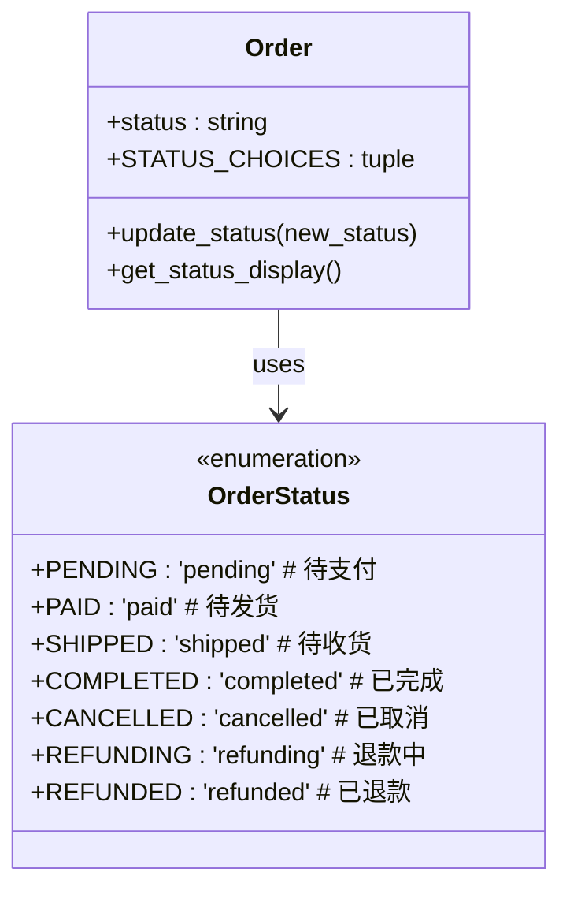
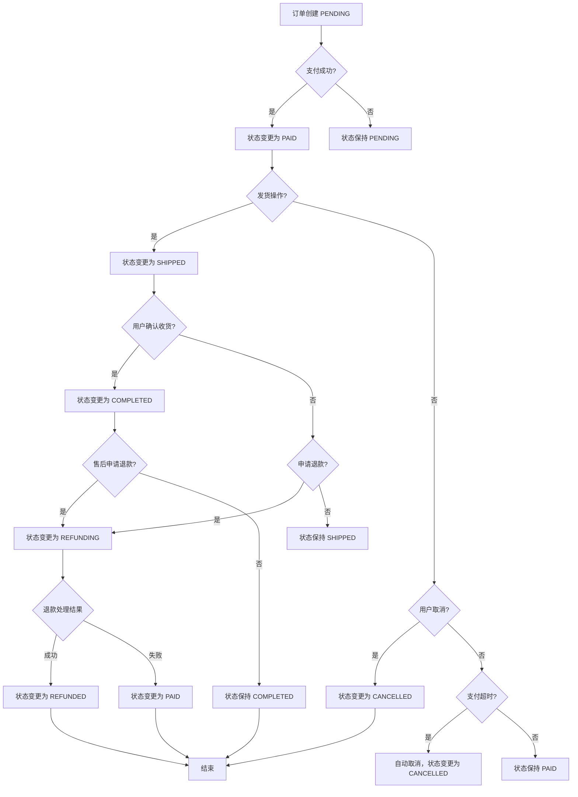
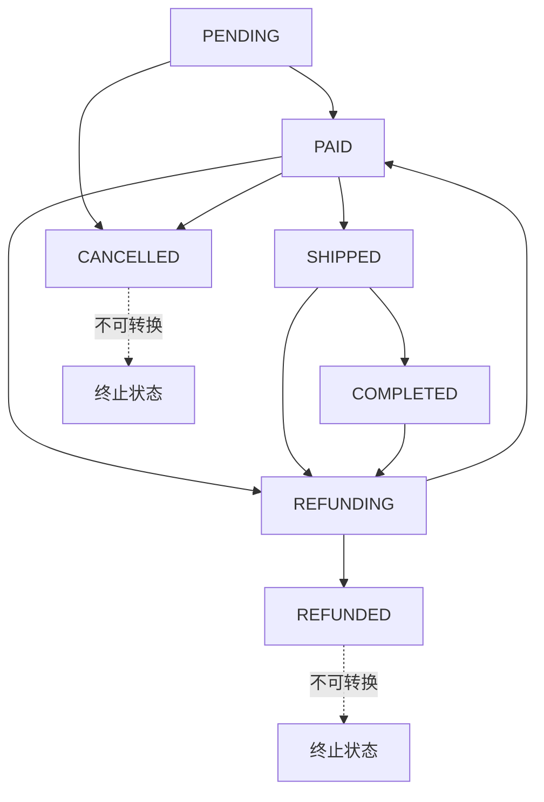
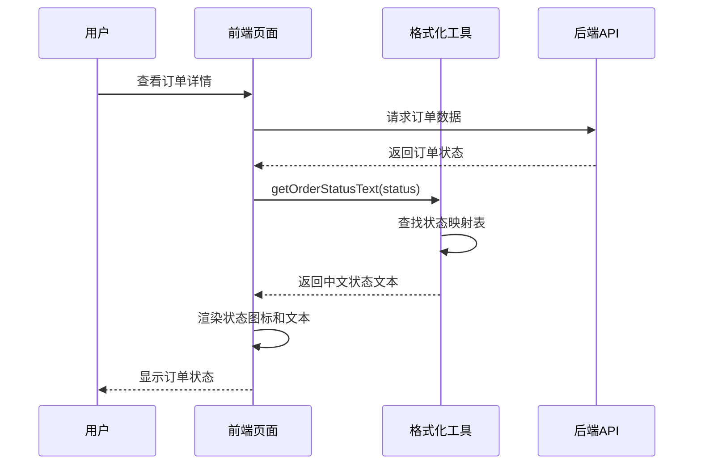
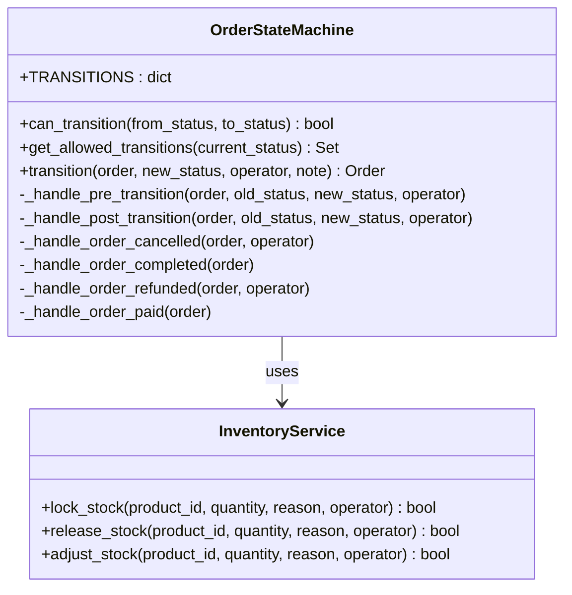
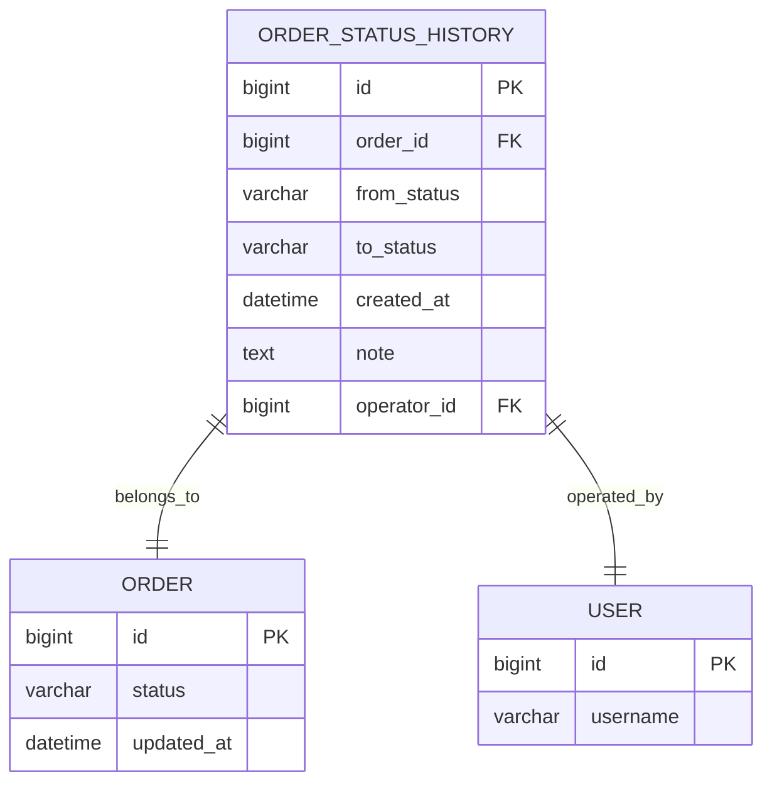

# 订单状态定义

<cite>
**本文档引用的文件**
- [backend/orders/state_machine.py](file://backend/orders/state_machine.py)
- [backend/orders/models.py](file://backend/orders/models.py)
- [frontend/src/pages/order-detail/index.tsx](file://frontend/src/pages/order-detail/index.tsx)
- [merchant/src/pages/Orders/index.tsx](file://merchant/src/pages/Orders/index.tsx)
- [frontend/src/utils/format.ts](file://frontend/src/utils/format.ts)
- [backend/orders/services.py](file://backend/orders/services.py)
- [backend/orders/views.py](file://backend/orders/views.py)
- [frontend/src/services/order.ts](file://frontend/src/services/order.ts)
</cite>

## 目录
1. [概述](#概述)
2. [订单状态枚举定义](#订单状态枚举定义)
3. [状态生命周期详解](#状态生命周期详解)
4. [状态转换规则](#状态转换规则)
5. [前端状态展示](#前端状态展示)
6. [商户后台状态管理](#商户后台状态管理)
7. [状态转换业务逻辑](#状态转换业务逻辑)
8. [状态历史追踪](#状态历史追踪)
9. [最佳实践建议](#最佳实践建议)

## 概述

本文档详细介绍了Electric小程序项目中订单状态系统的完整定义和实现。订单状态系统采用状态机模式，确保订单状态流转的合法性和一致性。系统定义了七个核心状态，覆盖了从订单创建到最终完结的完整业务流程。

## 订单状态枚举定义

### 状态常量定义

系统在后端使用Python枚举类定义订单状态，每个状态包含英文标识符和对应的中文描述：



**图表来源**
- [backend/orders/state_machine.py](file://backend/orders/state_machine.py#L14-L22)
- [backend/orders/models.py](file://backend/orders/models.py#L13-L22)

### 状态映射表

| 英文状态标识 | 中文状态描述 | 数据库存储值 | 状态含义 |
|-------------|-------------|-------------|----------|
| PENDING | 待支付 | 'pending' | 订单已创建，等待用户支付 |
| PAID | 待发货 | 'paid' | 支付成功，等待商家发货 |
| SHIPPED | 待收货 | 'shipped' | 已发货，等待用户确认收货 |
| COMPLETED | 已完成 | 'completed' | 用户确认收货，交易完成 |
| CANCELLED | 已取消 | 'cancelled' | 订单被取消，不可再修改 |
| REFUNDING | 退款中 | 'refunding' | 用户申请退款，处理中 |
| REFUNDED | 已退款 | 'refunded' | 退款已完成，不可再修改 |

**节来源**
- [backend/orders/state_machine.py](file://backend/orders/state_machine.py#L14-L22)
- [backend/orders/models.py](file://backend/orders/models.py#L13-L22)

## 状态生命周期详解

### 订单完整生命周期流程



**图表来源**
- [backend/orders/state_machine.py](file://backend/orders/state_machine.py#L34-L56)

### 各状态业务含义

#### PENDING（待支付）
- **业务场景**：用户下单后进入此状态
- **触发条件**：
  - 用户成功创建订单
  - 系统分配订单号
  - 锁定商品库存
- **用户行为**：用户需在规定时间内完成支付
- **超时处理**：支付超时自动取消订单

#### PAID（待发货）
- **业务场景**：支付成功后进入此状态
- **触发条件**：
  - 支付平台确认支付成功
  - 订单状态从PENDING变更为PAID
- **商家操作**：商家准备发货
- **用户行为**：等待商品发货

#### SHIPPED（待收货）
- **业务场景**：商品已发货，等待用户确认
- **触发条件**：
  - 商家完成发货操作
  - 填写物流信息
- **用户行为**：查看物流信息，确认收货
- **自动确认**：超过一定时间自动确认收货

#### COMPLETED（已完成）
- **业务场景**：用户确认收货，交易完成
- **触发条件**：
  - 用户主动确认收货
  - 或系统自动确认收货
- **业务影响**：
  - 商品销量统计更新
  - 用户积分奖励发放
  - 库存释放

#### CANCELLED（已取消）
- **业务场景**：订单被取消
- **触发条件**：
  - 用户主动取消订单
  - 支付超时自动取消
  - 商家拒绝订单
- **业务影响**：
  - 库存释放
  - 退款处理
  - 订单归档

#### REFUNDING（退款中）
- **业务场景**：用户申请退款，处理中
- **触发条件**：
  - 用户发起退款申请
  - 商家同意退款
- **处理流程**：等待支付平台处理退款

#### REFUNDED（已退款）
- **业务场景**：退款已完成
- **触发条件**：
  - 支付平台确认退款成功
  - 订单状态从REFUNDING变更为REFUNDED
- **业务影响**：
  - 库存释放
  - 财务结算完成

**节来源**
- [backend/orders/state_machine.py](file://backend/orders/state_machine.py#L34-L56)
- [backend/orders/models.py](file://backend/orders/models.py#L13-L22)

## 状态转换规则

### 合法转换矩阵



**图表来源**
- [backend/orders/state_machine.py](file://backend/orders/state_machine.py#L34-L56)

### 转换规则详解

#### 允许的转换路径

1. **PENDING → PAID**：支付成功
2. **PENDING → CANCELLED**：用户取消订单
3. **PAID → SHIPPED**：商家发货
4. **PAID → REFUNDING**：用户申请退款
5. **PAID → CANCELLED**：支付后取消（可选）
6. **SHIPPED → COMPLETED**：用户确认收货
7. **SHIPPED → REFUNDING**：用户申请退款
8. **REFUNDING → REFUNDED**：退款成功
9. **REFUNDING → PAID**：退款取消

#### 不允许的转换

- **CANCELLED** 和 **REFUNDED** 状态不允许任何状态转换
- **COMPLETED** 状态只能转换为 **REFUNDING**（售后退款）

**节来源**
- [backend/orders/state_machine.py](file://backend/orders/state_machine.py#L34-L56)

## 前端状态展示

### 订单详情页面状态展示

前端通过统一的状态文本映射函数提供用户友好的状态显示：



**图表来源**
- [frontend/src/pages/order-detail/index.tsx](file://frontend/src/pages/order-detail/index.tsx#L126-L134)
- [frontend/src/utils/format.ts](file://frontend/src/utils/format.ts#L41-L52)

### 状态图标和样式

前端为不同状态提供了对应的视觉标识：

| 状态 | 图标 | CSS类 | 视觉效果 |
|------|------|-------|----------|
| PENDING | ⏰ | status-pending | 橙色背景，等待图标 |
| PAID | ✅ | status-paid | 蓝色背景，勾选图标 |
| SHIPPED | 🚚 | status-shipped | 青色背景，卡车图标 |
| COMPLETED | ✨ | status-completed | 绿色背景，星星图标 |
| CANCELLED | ❌ | status-cancelled | 红色背景，叉号图标 |

### 实际用例展示

在订单详情页面中，状态展示组件会根据订单当前状态动态渲染：

- **待支付状态**：显示支付按钮和取消订单选项
- **待发货状态**：显示订单信息和物流跟踪
- **待收货状态**：显示确认收货按钮
- **已完成状态**：显示评价入口
- **已取消状态**：显示订单已取消提示
- **退款中状态**：显示退款进度
- **已退款状态**：显示退款完成信息

**节来源**
- [frontend/src/pages/order-detail/index.tsx](file://frontend/src/pages/order-detail/index.tsx#L126-L134)
- [frontend/src/utils/format.ts](file://frontend/src/utils/format.ts#L41-L52)

## 商户后台状态管理

### 商户订单列表状态显示

商户后台使用Ant Design的Tag组件展示订单状态，并提供相应的操作按钮：

```mermaid
classDiagram
class MerchantOrderList {
+statusMap : object
+handleShip(orderId)
+handleComplete(orderId)
+handleCancel(orderId)
+renderStatusTag(status)
}
class StatusMapping {
+pending : {text, color}
+paid : {text, color}
+shipped : {text, color}
+completed : {text, color}
+cancelled : {text, color}
+refunding : {text, color}
+refunded : {text, color}
}
MerchantOrderList --> StatusMapping : uses
```

**图表来源**
- [merchant/src/pages/Orders/index.tsx](file://merchant/src/pages/Orders/index.tsx#L9-L16)

### 状态颜色映射

商户系统为每个状态定义了对应的颜色方案：

| 状态 | 显示文本 | 颜色 | 用途 |
|------|----------|------|------|
| pending | 待支付 | orange | 标识待支付订单 |
| paid | 已支付 | blue | 标识已支付待发货 |
| shipped | 已发货 | cyan | 标识已发货待收货 |
| completed | 已完成 | green | 标识已完成订单 |
| cancelled | 已取消 | red | 标识已取消订单 |
| refunding | 退款中 | purple | 标识退款处理中 |
| refunded | 已退款 | magenta | 标识已退款订单 |

### 商户操作权限

不同状态下商户可执行的操作：

- **待支付**：发货、取消订单
- **已支付**：发货、取消订单
- **已发货**：确认完成、取消订单
- **已完成**：售后退款
- **已取消**：无操作
- **退款中**：无操作
- **已退款**：无操作

**节来源**
- [merchant/src/pages/Orders/index.tsx](file://merchant/src/pages/Orders/index.tsx#L9-L16)
- [merchant/src/pages/Orders/index.tsx](file://merchant/src/pages/Orders/index.tsx#L273-L326)

## 状态转换业务逻辑

### 状态机实现

系统使用专门的状态机类管理订单状态转换，确保业务逻辑的一致性：



**图表来源**
- [backend/orders/state_machine.py](file://backend/orders/state_machine.py#L25-L289)

### 自动化处理逻辑

#### 订单取消处理
当订单状态变为CANCELLED时，系统自动执行以下操作：
- 释放锁定的商品库存
- 记录库存变更日志
- 更新商品销量统计（如果是已完成状态）

#### 订单完成处理
当订单状态变为COMPLETED时，系统自动执行：
- 更新商品销量统计
- 触发相关业务事件
- 清理临时数据

#### 退款处理
当订单状态变为REFUNDED时，系统自动执行：
- 释放锁定的库存
- 更新财务记录
- 发送退款完成通知

**节来源**
- [backend/orders/state_machine.py](file://backend/orders/state_machine.py#L156-L289)
- [backend/orders/services.py](file://backend/orders/services.py#L470-L500)

## 状态历史追踪

### 状态变更记录

系统自动记录每次状态变更的历史信息，便于审计和问题追踪：



**图表来源**
- [backend/orders/models.py](file://backend/orders/models.py#L292-L322)

### 历史记录字段说明

| 字段名 | 类型 | 描述 |
|--------|------|------|
| id | 主键 | 历史记录唯一标识 |
| order_id | 外键 | 关联的订单ID |
| from_status | 字符串 | 原始状态 |
| to_status | 字符串 | 目标状态 |
| created_at | 时间戳 | 变更时间 |
| note | 文本 | 变更备注 |
| operator_id | 外键 | 操作人ID（可为空） |

### 追踪功能价值

- **业务审计**：记录所有状态变更，便于业务分析
- **问题排查**：快速定位订单状态异常的原因
- **性能监控**：分析各状态的停留时间和转换频率
- **合规要求**：满足电商系统的审计要求

**节来源**
- [backend/orders/models.py](file://backend/orders/models.py#L292-L322)

## 最佳实践建议

### 开发建议

1. **状态转换验证**
   - 始终使用状态机进行状态转换
   - 检查转换合法性，避免非法状态变更
   - 提供清晰的错误信息

2. **业务逻辑分离**
   - 状态转换逻辑与业务逻辑分离
   - 使用钩子函数处理特殊业务需求
   - 保持状态机的纯净性

3. **异常处理**
   - 状态转换失败时提供回滚机制
   - 记录详细的错误日志
   - 用户友好的错误提示

### 运维建议

1. **监控告警**
   - 监控各状态的转换频率
   - 设置异常状态的告警阈值
   - 定期检查状态历史数据

2. **性能优化**
   - 缓存常用的状态映射
   - 优化状态查询的索引
   - 定期清理历史状态记录

3. **数据备份**
   - 定期备份状态历史数据
   - 确保状态变更的完整性
   - 建立数据恢复机制

### 用户体验建议

1. **状态提示**
   - 提供清晰的状态说明
   - 显示预计处理时间
   - 及时的状态更新通知

2. **操作引导**
   - 在合适的位置提供操作指引
   - 显示可用的操作按钮
   - 避免歧义的状态描述

3. **错误处理**
   - 友好的错误提示信息
   - 提供重试或替代方案
   - 记录用户操作轨迹

通过遵循这些最佳实践，可以确保订单状态系统的稳定运行，提升用户体验，并为业务发展提供可靠的技术支撑。