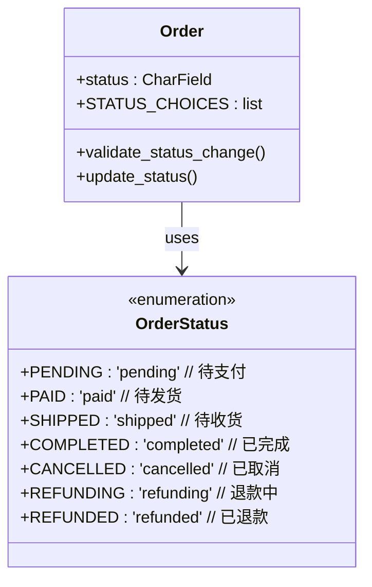
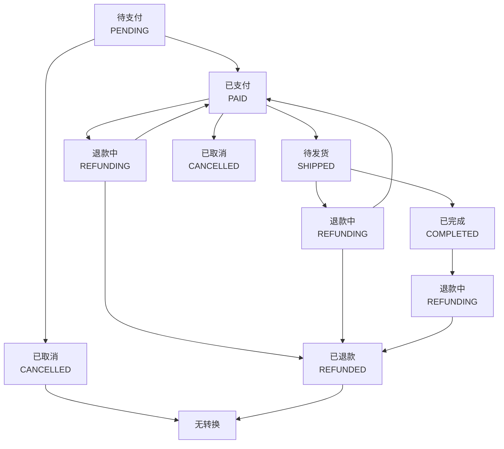
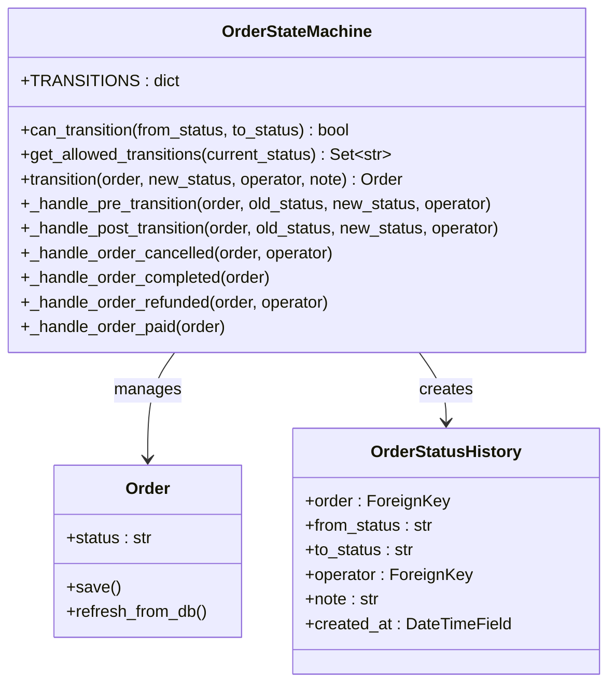
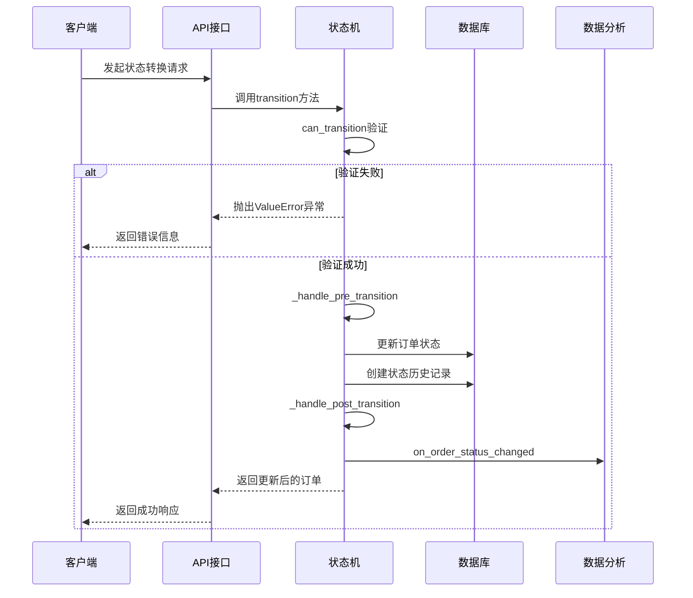
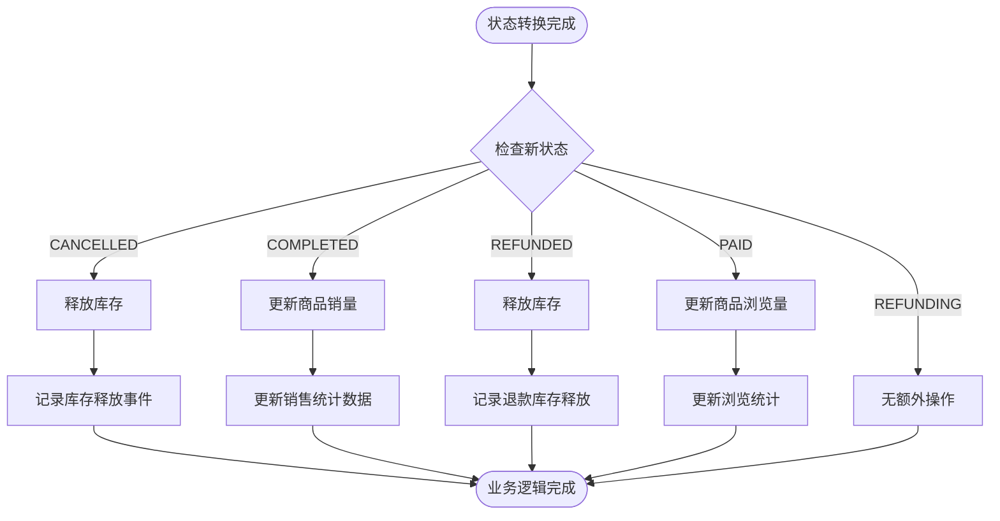
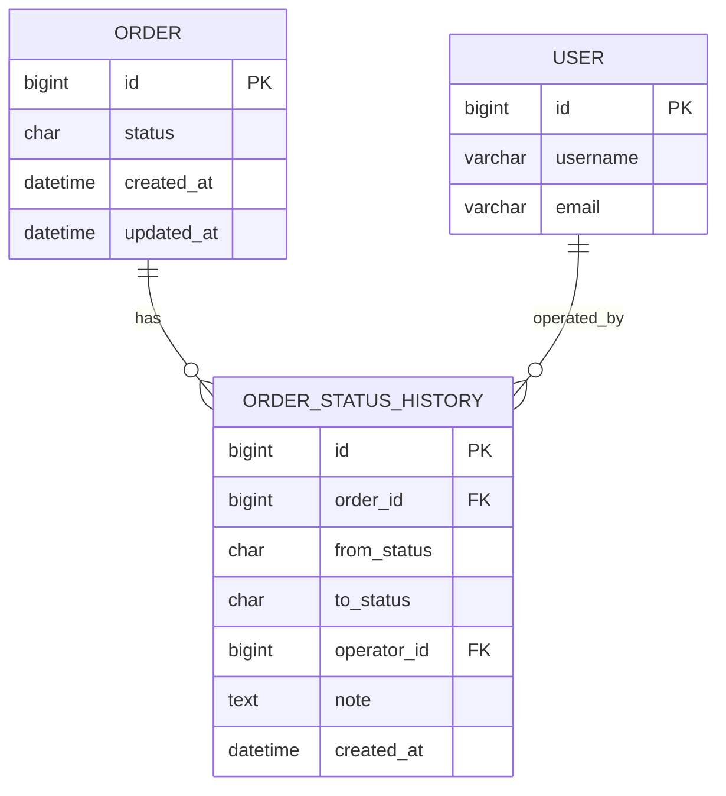
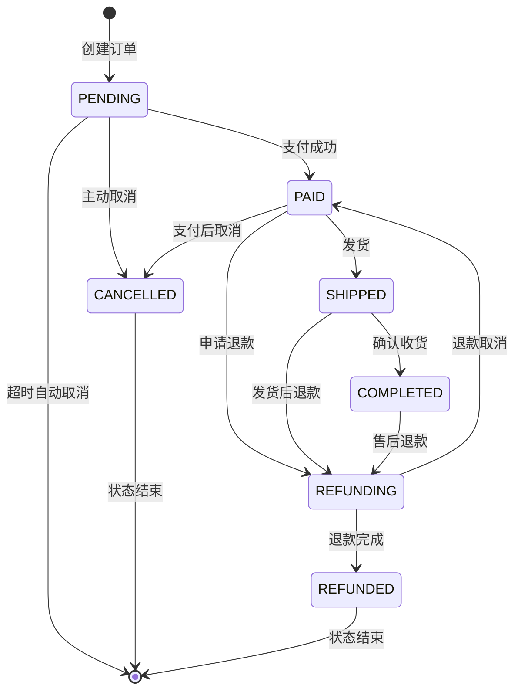

# 订单状态管理

<cite>
**本文档引用的文件**
- [state_machine.py](file://backend/orders/state_machine.py)
- [models.py](file://backend/orders/models.py)
- [services.py](file://backend/orders/services.py)
- [analytics.py](file://backend/orders/analytics.py)
- [views.py](file://backend/orders/views.py)
- [payment_service.py](file://backend/orders/payment_service.py)
- [cancel_unpaid_orders.py](file://backend/orders/management/commands/cancel_unpaid_orders.py)
- [OrderStatusHistory模型](file://backend/orders/models.py#L292-L322)
</cite>

## 目录
1. [概述](#概述)
2. [订单状态枚举定义](#订单状态枚举定义)
3. [状态转换规则](#状态转换规则)
4. [状态机核心实现](#状态机核心实现)
5. [状态转换验证机制](#状态转换验证机制)
6. [状态变更后的业务逻辑](#状态变更后的业务逻辑)
7. [状态变更历史记录](#状态变更历史记录)
8. [实际应用场景](#实际应用场景)
9. [状态转换图](#状态转换图)
10. [总结](#总结)

## 概述

订单状态管理系统是电商系统中的核心组件，负责维护订单在整个生命周期中的状态流转。该系统采用状态机模式，通过严格的规则控制订单状态的转换，确保业务逻辑的正确性和数据的一致性。

系统的主要特点包括：
- **严格的状态转换规则**：通过TRANSITIONS字典定义合法的状态转换路径
- **自动化业务逻辑**：状态变更时自动触发相应的业务处理
- **完整的审计追踪**：记录所有状态变更的历史信息
- **并发安全保障**：使用数据库事务确保状态转换的原子性

## 订单状态枚举定义

系统定义了完整的订单状态枚举，涵盖了订单生命周期中的各个阶段：



**图表来源**
- [state_machine.py](file://backend/orders/state_machine.py#L14-L22)
- [models.py](file://backend/orders/models.py#L14-L22)

### 状态含义详解

| 状态 | 英文值 | 中文描述 | 业务含义 |
|------|--------|----------|----------|
| PENDING | pending | 待支付 | 订单已创建，等待用户完成支付 |
| PAID | paid | 待发货 | 支付成功，等待商家发货 |
| SHIPPED | shipped | 待收货 | 商品已发货，等待用户确认收货 |
| COMPLETED | completed | 已完成 | 用户确认收货，交易完成 |
| CANCELLED | cancelled | 已取消 | 订单被取消，交易终止 |
| REFUNDING | refunding | 退款中 | 用户申请退款，处理中 |
| REFUNDED | refunded | 已退款 | 退款已完成，资金退回用户 |

**节来源**
- [state_machine.py](file://backend/orders/state_machine.py#L14-L22)
- [models.py](file://backend/orders/models.py#L14-L22)

## 状态转换规则

系统通过TRANSITIONS字典定义了严格的状态转换规则，确保订单状态只能按照预定义的路径流转：



**图表来源**
- [state_machine.py](file://backend/orders/state_machine.py#L34-L56)

### 转换规则分析

#### 允许的转换路径

1. **正常流程转换**
   - `PENDING` → `PAID`：支付成功
   - `PAID` → `SHIPPED`：发货
   - `SHIPPED` → `COMPLETED`：确认收货
   - `COMPLETED` → `REFUNDING`：售后退款

2. **异常处理转换**
   - `PENDING` → `CANCELLED`：主动取消
   - `PAID` → `CANCELLED`：支付后取消
   - `PAID` → `REFUNDING`：申请退款
   - `SHIPPED` → `REFUNDING`：发货后退款

3. **退款流程转换**
   - `REFUNDING` → `REFUNDED`：退款完成
   - `REFUNDING` → `PAID`：退款取消

#### 禁止的转换

某些状态转换被明确禁止，以保护业务逻辑的完整性：
- `CANCELLED` 和 `REFUNDED` 状态不允许再次转换
- 从已完成状态直接转换到其他状态（除了退款）

**节来源**
- [state_machine.py](file://backend/orders/state_machine.py#L34-L56)

## 状态机核心实现

OrderStateMachine类是状态机的核心实现，提供了完整的状态转换功能：



**图表来源**
- [state_machine.py](file://backend/orders/state_machine.py#L25-L289)

### 核心方法说明

#### can_transition方法
验证状态转换是否合法，通过比较目标状态是否在允许的转换集合中实现。

#### get_allowed_transitions方法
获取当前状态下所有允许的转换目标，为前端界面提供状态选择建议。

#### transition方法
执行完整的状态转换流程，包括：
1. 验证转换合法性
2. 执行转换前的业务逻辑
3. 更新订单状态
4. 记录状态变更历史
5. 执行转换后的业务逻辑
6. 触发数据分析更新

**节来源**
- [state_machine.py](file://backend/orders/state_machine.py#L59-L154)

## 状态转换验证机制

系统实现了多层次的状态转换验证机制，确保状态变更的合法性：



**图表来源**
- [state_machine.py](file://backend/orders/state_machine.py#L104-L154)
- [views.py](file://backend/orders/views.py#L308-L326)

### 验证流程详解

1. **输入参数验证**
   - 检查状态值的有效性
   - 验证操作人的权限

2. **状态转换验证**
   - 使用can_transition方法检查转换合法性
   - 获取允许的转换目标作为错误提示

3. **业务逻辑验证**
   - 检查订单状态是否符合转换要求
   - 验证操作权限（如发货必须是管理员）

**节来源**
- [state_machine.py](file://backend/orders/state_machine.py#L118-L124)

## 状态变更后的业务逻辑

状态机在状态转换完成后会自动执行相应的业务逻辑，确保系统的业务规则得到正确执行：



**图表来源**
- [state_machine.py](file://backend/orders/state_machine.py#L178-L288)

### 具体业务逻辑实现

#### 订单取消处理
当订单状态变为`CANCELLED`时，系统会自动释放锁定的库存，确保商品可以重新上架销售。

#### 订单完成处理  
当订单状态变为`COMPLETED`时，系统会更新商品的销售统计，增加商品的销量计数。

#### 退款处理
无论是订单取消还是正常退款，系统都会释放相应的库存，保证库存数据的准确性。

#### 支付成功处理
当订单支付成功时，系统可以执行额外的业务逻辑，如发送支付成功通知等。

**节来源**
- [state_machine.py](file://backend/orders/state_machine.py#L212-L288)

## 状态变更历史记录

系统通过OrderStatusHistory模型完整记录每次状态变更的信息，为业务审计和问题排查提供重要依据：



**图表来源**
- [models.py](file://backend/orders/models.py#L292-L322)

### 历史记录字段说明

| 字段名 | 类型 | 描述 | 用途 |
|--------|------|------|------|
| order | ForeignKey | 关联的订单 | 建立订单与历史记录的关联 |
| from_status | CharField | 原状态 | 记录转换前的状态 |
| to_status | CharField | 新状态 | 记录转换后的状态 |
| operator | ForeignKey | 操作人 | 记录谁执行了状态转换 |
| note | TextField | 备注 | 记录转换的原因或说明 |
| created_at | DateTimeField | 创建时间 | 记录转换发生的时间 |

### 查询和分析功能

系统提供了多种基于状态历史的查询和分析功能：
- **状态分布统计**：分析各状态下订单的数量分布
- **流转效率分析**：计算不同状态间的平均转换时间
- **异常检测**：识别异常的状态转换模式

**节来源**
- [models.py](file://backend/orders/models.py#L292-L322)
- [analytics.py](file://backend/orders/analytics.py#L210-L255)

## 实际应用场景

### 支付成功后的状态转换

当用户完成支付后，系统会自动将订单状态从`PENDING`转换为`PAID`：

```python
# 支付成功后的状态转换示例
OrderStateMachine.transition(
    payment.order,
    'paid',
    operator=operator,
    note=f'Payment succeeded with transaction_id: {transaction_id}'
)
```

### 订单取消场景

用户或管理员可以取消订单，系统会自动释放库存：

```python
# 订单取消示例
order = OrderStateMachine.transition(
    order,
    'cancelled',
    operator=user,
    note=cancel_reason
)
```

### 自动取消超时订单

系统定期检查超时未支付的订单，并自动取消：

```python
# 自动取消超时订单示例
OrderStateMachine.transition(
    order=order,
    new_status='cancelled',
    operator=None,
    note='Automatically cancelled due to payment timeout'
)
```

### 发货和确认收货

管理员可以执行发货操作，用户可以确认收货：

```python
# 发货操作
order = OrderStateMachine.transition(
    order,
    'shipped',
    operator=admin_user,
    note='Order shipped via express delivery'
)

# 确认收货
order = OrderStateMachine.transition(
    order,
    'completed',
    operator=user,
    note='Customer confirmed receipt of goods'
)
```

**节来源**
- [payment_service.py](file://backend/orders/payment_service.py#L185-L196)
- [views.py](file://backend/orders/views.py#L317-L323)
- [cancel_unpaid_orders.py](file://backend/orders/management/commands/cancel_unpaid_orders.py#L110-L116)

## 状态转换图

以下是完整的订单状态转换图，展示了所有可能的状态流转路径：



**图表来源**
- [state_machine.py](file://backend/orders/state_machine.py#L34-L56)

### 关键转换节点说明

1. **支付节点**：`PENDING` → `PAID` 是订单进入正式流程的关键节点
2. **发货节点**：`PAID` → `SHIPPED` 标志着物流环节开始
3. **完成节点**：`SHIPPED` → `COMPLETED` 表示交易最终完成
4. **退款节点**：多个状态都可以转换到`REFUNDING`，体现了灵活的退款机制
5. **终止节点**：`CANCELLED`和`REFUNDED`状态不允许再次转换，表示交易终止

## 总结

订单状态管理系统是电商系统的核心基础设施，具有以下关键特性：

### 设计优势

1. **严格的规则控制**：通过状态转换规则确保业务逻辑的正确性
2. **自动化业务处理**：状态变更时自动执行相应的业务逻辑
3. **完整的审计追踪**：记录所有状态变更的历史信息
4. **并发安全保障**：使用数据库事务确保状态转换的原子性
5. **灵活的扩展性**：可以通过修改状态转换规则轻松适应业务变化

### 业务价值

- **提高运营效率**：自动化的状态管理和业务逻辑处理
- **保障数据一致性**：严格的转换规则防止非法状态变更
- **增强用户体验**：清晰的状态展示和及时的通知机制
- **支持业务分析**：完整的状态历史为数据分析提供基础

### 技术特点

- **状态机模式**：采用经典的有限状态机设计模式
- **事务安全**：使用数据库事务确保状态转换的原子性
- **缓存优化**：通过缓存提升统计查询的性能
- **异常处理**：完善的异常处理机制保证系统稳定性

该状态管理系统为整个电商系统提供了稳定可靠的状态管理基础，是构建高质量电商应用的重要组成部分。