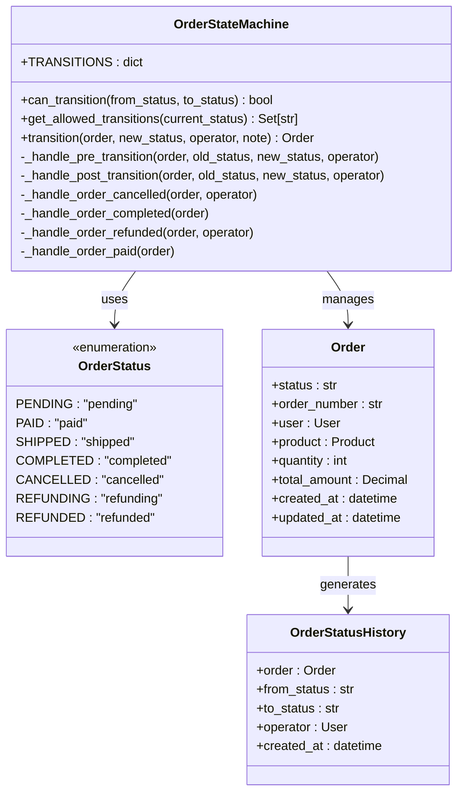
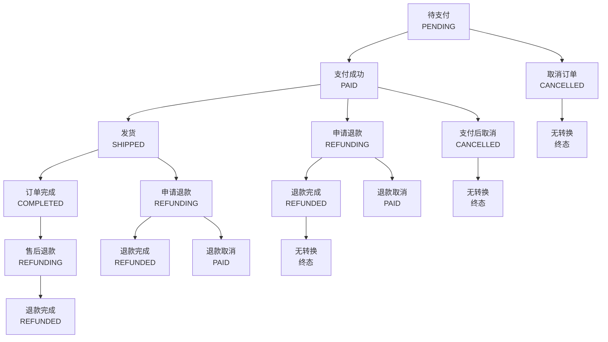
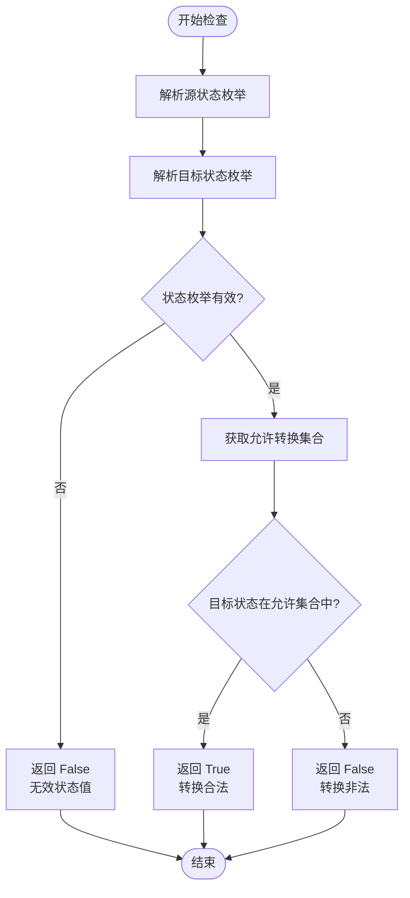
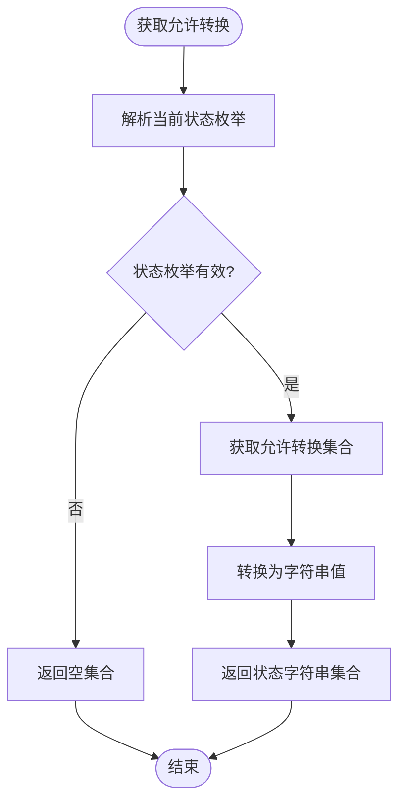
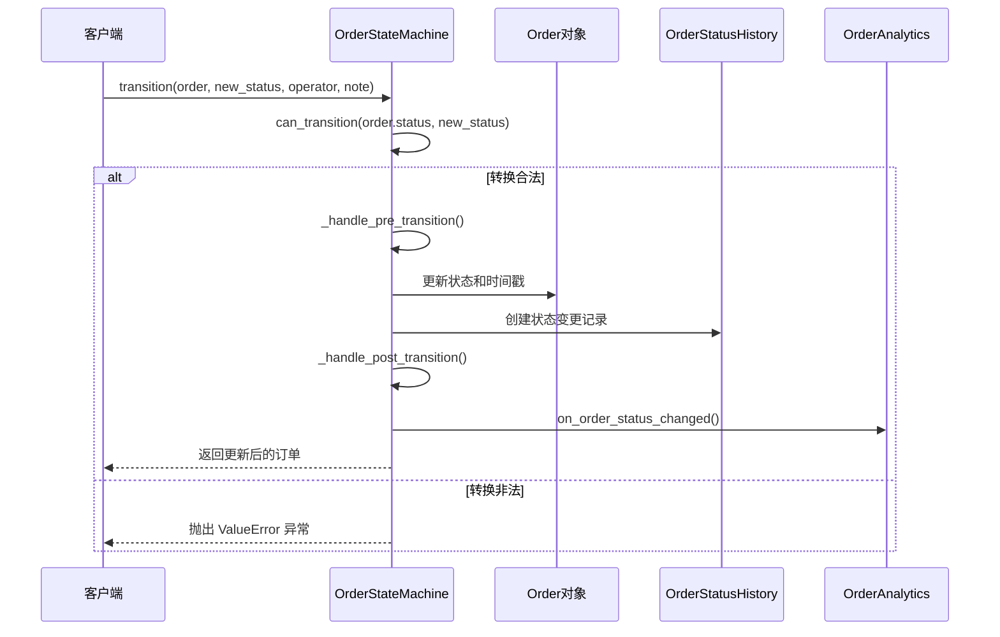
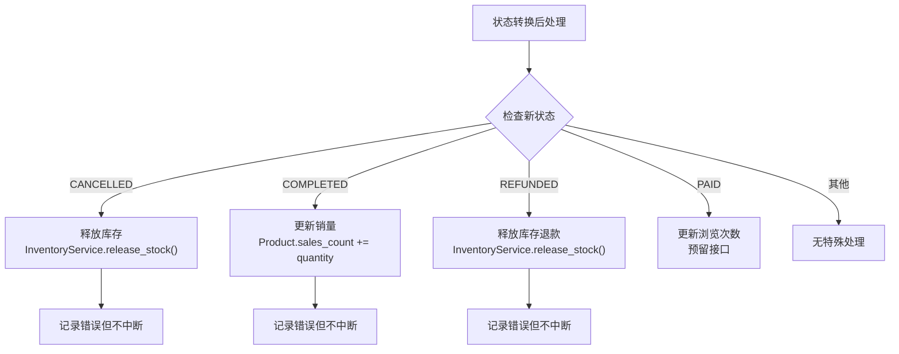
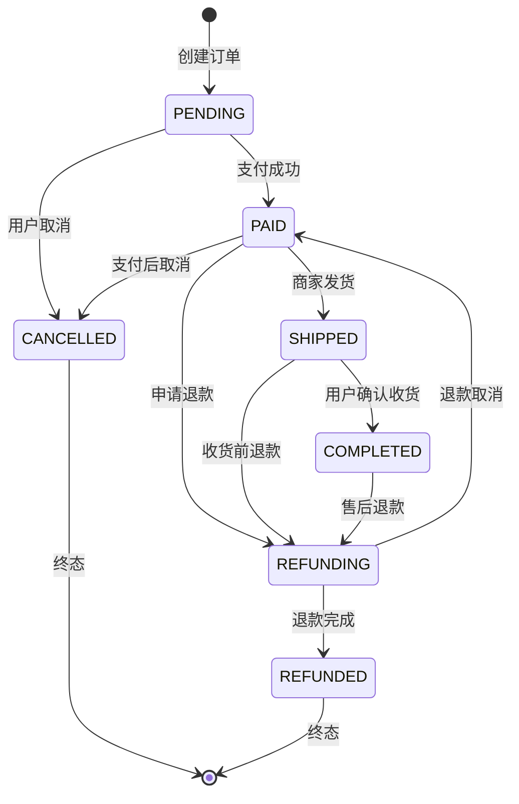

# 订单状态转换规则

<cite>
**本文档中引用的文件**
- [state_machine.py](file://backend/orders/state_machine.py)
- [models.py](file://backend/orders/models.py)
- [serializers.py](file://backend/orders/serializers.py)
- [OrderStatusHistory](file://backend/orders/models.py#L291-L321)
</cite>

## 目录
1. [概述](#概述)
2. [状态机架构](#状态机架构)
3. [状态定义与转换规则](#状态定义与转换规则)
4. [核心方法详解](#核心方法详解)
5. [状态转换验证机制](#状态转换验证机制)
6. [业务逻辑处理](#业务逻辑处理)
7. [状态转换图](#状态转换图)
8. [实际应用示例](#实际应用示例)
9. [总结](#总结)

## 概述

订单状态机是电商系统中核心的业务逻辑组件，负责管理订单在整个生命周期中的状态流转。通过严格的转换规则，确保订单状态的合法性，防止非法状态跳转，维护系统的数据一致性。

本文档深入分析 `OrderStateMachine` 类中 `TRANSITIONS` 字典定义的状态转换规则，详细说明每个状态的转换目标及其业务逻辑依据，并展示系统如何通过 `can_transition` 和 `get_allowed_transitions` 方法实现状态转换的验证和获取功能。

## 状态机架构



**图表来源**
- [state_machine.py](file://backend/orders/state_machine.py#L13-L21)
- [state_machine.py](file://backend/orders/state_machine.py#L24-L287)
- [models.py](file://backend/orders/models.py#L12-L162)
- [models.py](file://backend/orders/models.py#L291-L321)

**章节来源**
- [state_machine.py](file://backend/orders/state_machine.py#L24-L287)
- [models.py](file://backend/orders/models.py#L12-L162)

## 状态定义与转换规则

### 状态枚举定义

系统定义了七个主要订单状态，每个状态都有明确的业务含义：

| 状态 | 值 | 中文描述 | 终态标志 |
|------|----|-----|---------|
| PENDING | pending | 待支付 | 否 |
| PAID | paid | 待发货 | 否 |
| SHIPPED | shipped | 待收货 | 否 |
| COMPLETED | completed | 已完成 | 是 |
| CANCELLED | cancelled | 已取消 | 是 |
| REFUNDING | refunding | 退款中 | 否 |
| REFUNDED | refunded | 已退款 | 是 |

### TRANSITIONS 字典结构

`TRANSITIONS` 字典定义了所有合法的状态转换关系：



**图表来源**
- [state_machine.py](file://backend/orders/state_machine.py#L33-L56)

### 状态转换业务逻辑分析

#### 1. PENDING → PAID 或 CANCELLED
- **PENDING → PAID**: 用户完成支付后，订单进入待发货状态
- **PENDING → CANCELLED**: 用户在支付前主动取消订单

#### 2. PAID → SHIPPED、REFUNDING 或 CANCELLED
- **PAID → SHIPPED**: 商家发货后，订单进入待收货状态
- **PAID → REFUNDING**: 用户申请退款，进入退款处理阶段
- **PAID → CANCELLED**: 支付完成后仍可取消订单（商家政策）

#### 3. SHIPPED → COMPLETED 或 REFUNDING
- **SHIPPED → COMPLETED**: 用户确认收货，订单完成
- **SHIPPED → REFUNDING**: 用户在收货前申请退款

#### 4. COMPLETED → REFUNDING
- **COMPLETED → REFUNDING**: 售后服务场景下的退款申请

#### 5. REFUNDING → REFUNDED 或 PAID
- **REFUNDING → REFUNDED**: 退款流程完成
- **REFUNDING → PAID**: 退款被拒绝，恢复支付状态

#### 6. 终态状态
- **CANCELLED**: 已取消订单，不允许任何转换
- **REFUNDED**: 已退款订单，不允许任何转换

**章节来源**
- [state_machine.py](file://backend/orders/state_machine.py#L33-L56)

## 核心方法详解

### can_transition 方法

该方法用于检查两个状态之间的转换是否合法：



**图表来源**
- [state_machine.py](file://backend/orders/state_machine.py#L59-L75)

### get_allowed_transitions 方法

该方法返回当前状态下所有允许的转换目标：



**图表来源**
- [state_machine.py](file://backend/orders/state_machine.py#L78-L92)

### transition 方法

这是状态转换的核心方法，实现了完整的状态转换流程：



**图表来源**
- [state_machine.py](file://backend/orders/state_machine.py#L95-L153)

**章节来源**
- [state_machine.py](file://backend/orders/state_machine.py#L59-L153)

## 状态转换验证机制

### 验证流程设计

系统通过多层验证确保状态转换的合法性：

1. **类型验证**: 检查状态值是否为有效的 OrderStatus 枚举
2. **规则验证**: 检查目标状态是否在允许的转换集合中
3. **业务验证**: 在转换前后执行特定的业务逻辑检查

### 错误处理机制

当状态转换不合法时，系统会：
- 抛出详细的 ValueError 异常
- 包含当前状态和允许的转换列表
- 提供清晰的错误信息帮助调试

### 并发控制

通过 Django 的事务装饰器 `@transaction.atomic` 确保：
- 状态转换的原子性
- 防止并发修改导致的数据不一致
- 保证状态变更历史的一致性

**章节来源**
- [state_machine.py](file://backend/orders/state_machine.py#L118-L124)

## 业务逻辑处理

### 状态转换后的业务处理

系统在状态转换完成后会自动执行相应的业务逻辑：



**图表来源**
- [state_machine.py](file://backend/orders/state_machine.py#L177-L208)

### 具体业务逻辑实现

#### 1. 订单取消处理
- 释放锁定的库存
- 记录取消原因和时间
- 触发相关的业务通知

#### 2. 订单完成处理  
- 更新商品销量统计
- 触发销售数据分析
- 可能触发售后服务流程

#### 3. 退款处理
- 释放已锁定的库存
- 记录退款相关信息
- 支持退款取消恢复

#### 4. 支付成功处理
- 预留扩展接口
- 可添加支付成功通知
- 可更新用户积分等

**章节来源**
- [state_machine.py](file://backend/orders/state_machine.py#L211-L287)

## 状态转换图

### 完整状态转换流程图



### 关键转换节点说明

1. **PENDING 状态**
   - 初始状态，订单刚创建
   - 可直接取消，无需支付
   - 支付成功后进入 PAID 状态

2. **PAID 状态**
   - 支付完成，等待发货
   - 可能出现多种后续状态
   - 包含支付后取消选项

3. **SHIPPED 状态**
   - 商品已发货
   - 用户确认收货后完成订单
   - 可能提前申请退款

4. **终态状态**
   - CANCELLED 和 REFUNDED 不允许任何转换
   - 确保数据一致性
   - 避免状态混乱

## 实际应用示例

### 场景一：正常订单流程

```python
# 用户下单
order = Order.objects.create(...)
assert order.status == 'pending'

# 用户支付
OrderStateMachine.transition(order, 'paid', operator=user)
assert order.status == 'paid'

# 商家发货
OrderStateMachine.transition(order, 'shipped', operator=admin)
assert order.status == 'shipped'

# 用户确认收货
OrderStateMachine.transition(order, 'completed', operator=user)
assert order.status == 'completed'
```

### 场景二：退款流程

```python
# 用户申请退款
OrderStateMachine.transition(order, 'refunding', operator=user)
assert order.status == 'refunding'

# 退款成功
OrderStateMachine.transition(order, 'refunded', operator=admin)
assert order.status == 'refunded'

# 尝试非法转换（会抛出异常）
try:
    OrderStateMachine.transition(order, 'paid', operator=admin)
except ValueError as e:
    print(e)  # 显示不允许的转换信息
```

### 场景三：状态查询

```python
# 查询当前状态允许的转换
allowed = OrderStateMachine.get_allowed_transitions('paid')
print(allowed)  # {'shipped', 'refunding', 'cancelled'}

# 检查特定转换是否合法
can_move = OrderStateMachine.can_transition('pending', 'completed')
print(can_move)  # False
```

## 总结

订单状态机通过以下机制确保系统的稳定性和数据一致性：

### 核心优势

1. **严格的转换规则**: 通过 TRANSITIONS 字典定义明确的转换路径
2. **完善的验证机制**: 多层次的状态验证和错误处理
3. **自动化的业务处理**: 状态转换后自动执行相关业务逻辑
4. **完整的审计追踪**: 记录所有状态变更历史
5. **灵活的扩展性**: 支持业务逻辑的动态扩展

### 设计原则

1. **单一职责**: 每个状态只允许特定的转换
2. **终态保护**: 终态状态不允许任何转换
3. **业务一致性**: 状态转换与业务逻辑紧密绑定
4. **错误友好**: 提供清晰的错误信息和恢复机制

### 最佳实践建议

1. **状态转换前验证**: 始终使用 `can_transition` 方法验证转换合法性
2. **完整的错误处理**: 捕获并处理状态转换过程中的异常
3. **适当的业务逻辑**: 在状态转换前后执行必要的业务处理
4. **审计日志记录**: 确保所有状态变更都被完整记录
5. **性能优化**: 对频繁的状态查询进行缓存优化

通过这套完善的状态转换机制，系统能够可靠地管理订单的整个生命周期，为用户提供稳定可靠的电商体验。