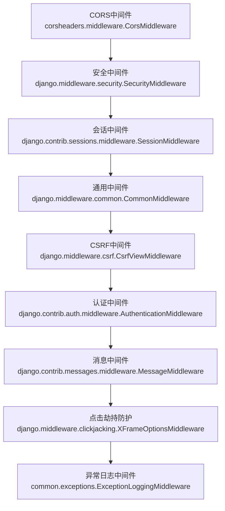
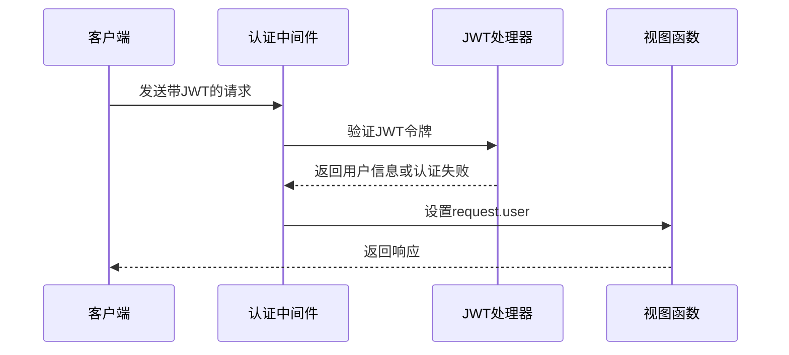
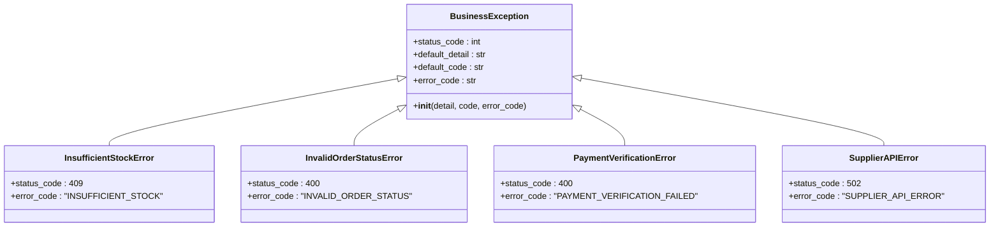
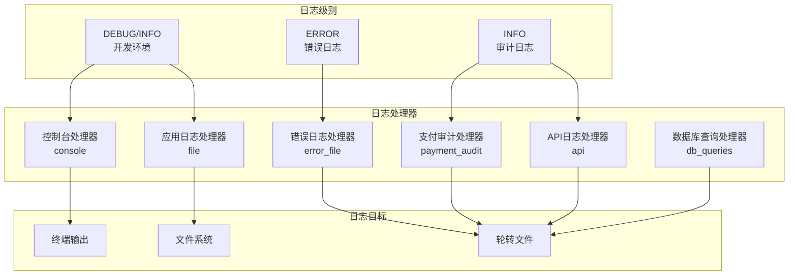
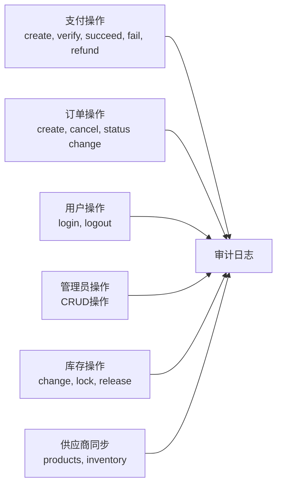
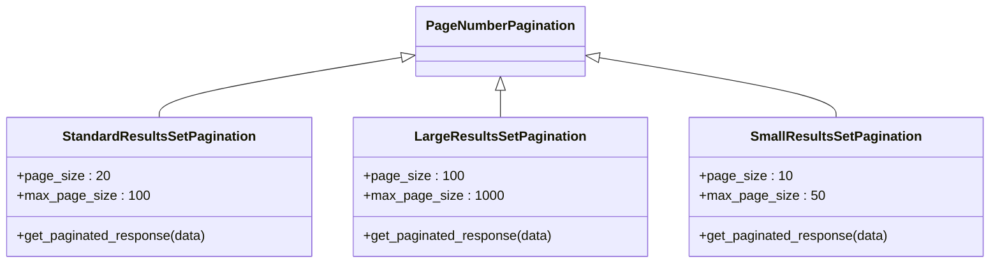
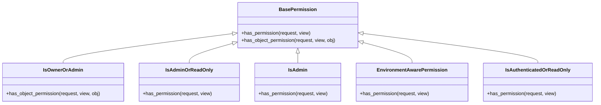
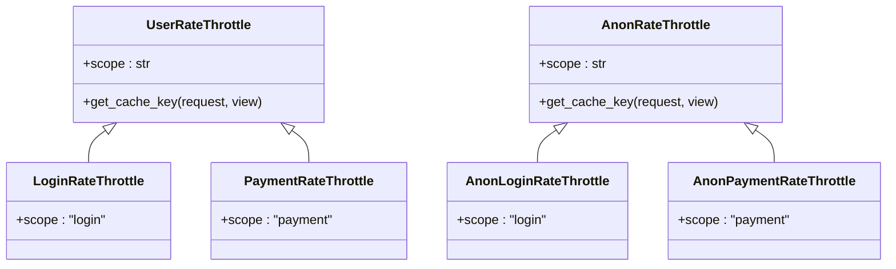
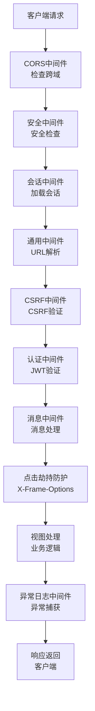

# 中间件与基础设施

<cite>
**本文档中引用的文件**
- [base.py](file://backend/backend/settings/base.py)
- [development.py](file://backend/backend/settings/development.py)
- [production.py](file://backend/backend/settings/production.py)
- [exceptions.py](file://backend/common/exceptions.py)
- [responses.py](file://backend/common/responses.py)
- [pagination.py](file://backend/common/pagination.py)
- [permissions.py](file://backend/common/permissions.py)
- [throttles.py](file://backend/common/throttles.py)
- [logging_config.py](file://backend/common/logging_config.py)
- [audit_logger.py](file://backend/common/audit_logger.py)
</cite>

## 目录
1. [概述](#概述)
2. [中间件架构](#中间件架构)
3. [CORS配置](#cors配置)
4. [JWT认证中间件](#jwt认证中间件)
5. [异常处理系统](#异常处理系统)
6. [统一响应格式](#统一响应格式)
7. [日志系统](#日志系统)
8. [审计日志](#审计日志)
9. [分页机制](#分页机制)
10. [权限控制](#权限控制)
11. [限流器](#限流器)
12. [中间件执行顺序](#中间件执行顺序)
13. [总结](#总结)

## 概述

本项目采用了一套完整的中间件和基础设施组件体系，为Django REST Framework提供了统一的异常处理、响应格式化、权限控制、限流保护和日志审计功能。这套基础设施确保了API的一致性、安全性和可维护性。

## 中间件架构

### 核心中间件配置

项目在`settings/base.py`中定义了标准的中间件栈，按照特定顺序执行：



**图表来源**
- [base.py](file://backend/backend/settings/base.py#L162-L172)

### 中间件执行顺序说明

1. **CORS中间件**：处理跨域请求，必须最先执行
2. **安全中间件**：提供基本的安全保护
3. **会话中间件**：管理用户会话
4. **通用中间件**：处理URL解析等基础功能
5. **CSRF中间件**：防止跨站请求伪造攻击
6. **认证中间件**：处理用户身份验证
7. **消息中间件**：处理临时消息
8. **点击劫持防护**：防止页面被iframe嵌入
9. **异常日志中间件**：捕获未处理的异常

**节来源**
- [base.py](file://backend/backend/settings/base.py#L162-L172)

## CORS配置

### 开发环境配置

开发环境中使用宽松的CORS策略，允许所有来源访问：

```python
# development.py
CORS_ALLOW_ALL_ORIGINS = True
CORS_ALLOW_HEADERS = list(default_headers) + ['authorization']
CORS_ALLOW_CREDENTIALS = True
ALLOWED_HOSTS = ['*']
```

### 生产环境配置

生产环境中采用严格的CORS策略，基于白名单控制：

```python
# production.py
CORS_ALLOW_ALL_ORIGINS = False
CORS_ALLOWED_ORIGINS = EnvironmentConfig.get_cors_allowed_origins()
CORS_ALLOW_CREDENTIALS = True
```

### 支持的HTTP头部

系统支持以下HTTP头部：
- 基础头部：`accept`, `accept-encoding`, `content-type`
- 安全头部：`authorization`, `dnt`, `origin`
- 用户代理头部：`user-agent`, `x-csrftoken`, `x-requested-with`

**节来源**
- [development.py](file://backend/backend/settings/development.py#L12-L20)
- [production.py](file://backend/backend/settings/production.py#L23-L27)
- [base.py](file://backend/backend/settings/base.py#L148-L160)

## JWT认证中间件

### 配置详情

JWT认证通过`rest_framework_simplejwt`实现，配置如下：

```python
REST_FRAMEWORK = {
    'DEFAULT_AUTHENTICATION_CLASSES': [
        'rest_framework_simplejwt.authentication.JWTAuthentication',
    ],
}

SIMPLE_JWT = {
    'ACCESS_TOKEN_LIFETIME': timedelta(days=7),
    'REFRESH_TOKEN_LIFETIME': timedelta(days=30),
}
```

### 认证流程



**图表来源**
- [base.py](file://backend/backend/settings/base.py#L33-L40)
- [base.py](file://backend/backend/settings/base.py#L142-L146)

**节来源**
- [base.py](file://backend/backend/settings/base.py#L33-L40)
- [base.py](file://backend/backend/settings/base.py#L142-L146)

## 异常处理系统

### 自定义异常类层次结构

系统定义了丰富的业务异常类型：



**图表来源**
- [exceptions.py](file://backend/common/exceptions.py#L26-L57)
- [exceptions.py](file://backend/common/exceptions.py#L59-L75)

### 统一异常处理机制

异常处理流程包括：

1. **标准DRF异常处理**：使用Django REST Framework的标准异常处理器
2. **环境感知错误信息**：生产环境隐藏详细错误信息
3. **全面的日志记录**：记录异常的详细信息
4. **结构化错误响应**：返回一致的错误格式

### 异常日志中间件

专门的中间件用于捕获未处理的异常：

```python
class ExceptionLoggingMiddleware:
    def __call__(self, request):
        try:
            response = self.get_response(request)
        except Exception as exc:
            # 记录异常并返回标准化错误响应
            pass
        return response
```

**节来源**
- [exceptions.py](file://backend/common/exceptions.py#L251-L313)
- [exceptions.py](file://backend/common/exceptions.py#L442-L503)

## 统一响应格式

### 成功响应格式

所有成功的API响应都遵循统一格式：

```json
{
    "success": true,
    "code": 200,
    "message": "操作成功",
    "data": {...},
    "pagination": {...}
}
```

### 错误响应格式

所有错误响应也遵循统一格式：

```json
{
    "success": false,
    "code": 400,
    "message": "错误信息",
    "error_code": "ERROR_CODE",
    "errors": {...}
}
```

### 响应类设计

系统提供了两个主要的响应类：

1. **StandardResponse**：用于成功响应
2. **ErrorResponse**：用于错误响应

**节来源**
- [responses.py](file://backend/common/responses.py#L15-L99)
- [responses.py](file://backend/common/responses.py#L102-L322)

## 日志系统

### 日志配置架构



**图表来源**
- [logging_config.py](file://backend/common/logging_config.py#L30-L285)

### 日志处理器配置

系统配置了多种类型的日志处理器：

1. **控制台处理器**：实时输出到终端
2. **应用日志处理器**：记录应用运行日志
3. **错误日志处理器**：专门记录错误信息
4. **支付审计处理器**：记录支付相关操作
5. **API日志处理器**：记录API请求响应
6. **数据库查询处理器**：开发环境记录SQL查询

### 环境差异

- **开发环境**：详细日志，包含调试信息
- **生产环境**：精简日志，避免敏感信息泄露

**节来源**
- [logging_config.py](file://backend/common/logging_config.py#L30-L285)

## 审计日志

### 审计日志系统

审计日志专门记录关键业务操作，确保系统的可追溯性：



**图表来源**
- [audit_logger.py](file://backend/common/audit_logger.py#L22-L348)

### 审计日志类型

系统支持以下审计事件：

1. **支付审计事件**：创建、验证、成功、失败、退款
2. **订单审计事件**：创建、取消、状态变更
3. **用户审计事件**：登录、登出
4. **管理员审计事件**：各种CRUD操作
5. **库存审计事件**：库存变更
6. **供应商审计事件**：数据同步

### 审计日志格式

每个审计事件都包含：
- 事件类型
- 关键参数
- 时间戳
- 用户标识
- 操作上下文

**节来源**
- [audit_logger.py](file://backend/common/audit_logger.py#L22-L348)

## 分页机制

### 分页类设计

系统提供了三种分页策略：



**图表来源**
- [pagination.py](file://backend/common/pagination.py#L8-L99)

### 分页响应格式

分页响应包含以下元数据：

```json
{
    "results": [...],
    "total": 100,
    "page": 1,
    "total_pages": 5,
    "has_next": true,
    "has_previous": false,
    "count": 100,
    "next": "/api/?page=2",
    "previous": null
}
```

### 分页策略

1. **标准分页**：适用于大多数场景，默认20条/页
2. **大结果集分页**：适用于列表页面，默认100条/页
3. **小结果集分页**：适用于移动端，默认10条/页

**节来源**
- [pagination.py](file://backend/common/pagination.py#L8-L99)

## 权限控制

### 权限类层次结构



**图表来源**
- [permissions.py](file://backend/common/permissions.py#L12-L189)

### 权限策略

1. **IsOwnerOrAdmin**：对象所有者或管理员可访问
2. **IsAdminOrReadOnly**：只读操作对所有人开放
3. **IsAdmin**：仅管理员可访问
4. **EnvironmentAwarePermission**：环境感知权限控制
5. **IsAuthenticatedOrReadOnly**：只读操作对所有人开放

### 环境差异

- **开发环境**：更宽松的权限控制
- **生产环境**：严格的权限验证

**节来源**
- [permissions.py](file://backend/common/permissions.py#L12-L189)

## 限流器

### 限流类设计



**图表来源**
- [throttles.py](file://backend/common/throttles.py#L8-L78)

### 限流策略

| 限流器 | 用户限制 | 匿名限制 | 用途 |
|--------|----------|----------|------|
| LoginRateThrottle | 5/min | 5/min | 登录接口 |
| PaymentRateThrottle | 10/min | 不适用 | 支付接口 |
| AnonLoginRateThrottle | 不适用 | 5/min | 匿名登录 |
| AnonPaymentRateThrottle | 不适用 | 10/min | 匿名支付 |

### 默认限流

系统还配置了默认的限流策略：

```python
REST_FRAMEWORK = {
    'DEFAULT_THROTTLE_CLASSES': [
        'rest_framework.throttling.AnonRateThrottle',
        'rest_framework.throttling.UserRateThrottle',
    ] if EnvironmentConfig.is_production() else [],
    'DEFAULT_THROTTLE_RATES': {
        'anon': '20/minute',
        'user': '100/minute',
        'login': '5/minute',
        'payment': '10/minute',
    },
}
```

**节来源**
- [throttles.py](file://backend/common/throttles.py#L8-L78)
- [base.py](file://backend/backend/settings/base.py#L44-L53)

## 中间件执行顺序

### 执行流程图



**图表来源**
- [base.py](file://backend/backend/settings/base.py#L162-L172)

### 关键注意事项

1. **CORS中间件必须最先**：处理跨域预检请求
2. **认证中间件依赖会话**：需要会话中间件先执行
3. **异常日志中间件最后**：确保捕获所有异常

**节来源**
- [base.py](file://backend/backend/settings/base.py#L162-L172)

## 总结

这套中间件和基础设施组件体系为项目提供了：

1. **安全性**：通过CORS、JWT认证、CSRF防护等多重安全措施
2. **一致性**：统一的异常处理、响应格式和权限控制
3. **可观测性**：完善的日志系统和审计日志
4. **可扩展性**：模块化的组件设计，便于扩展和维护
5. **环境适应性**：开发和生产环境的不同配置策略

这套基础设施确保了项目的稳定运行和良好的开发体验，是构建企业级Web应用的重要基础。