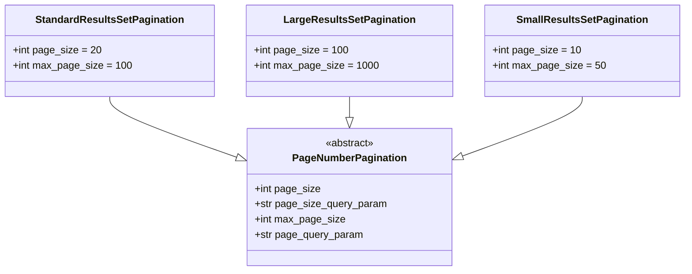
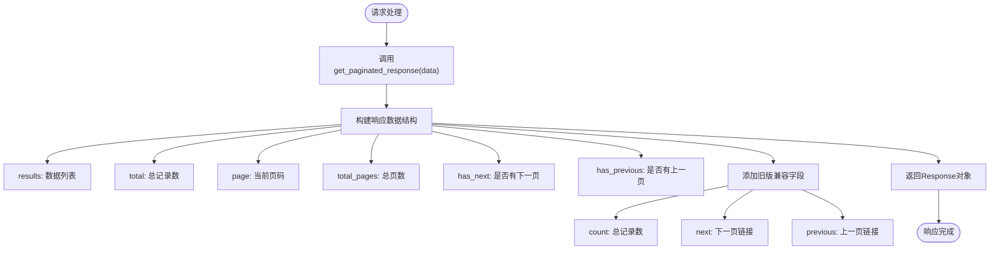
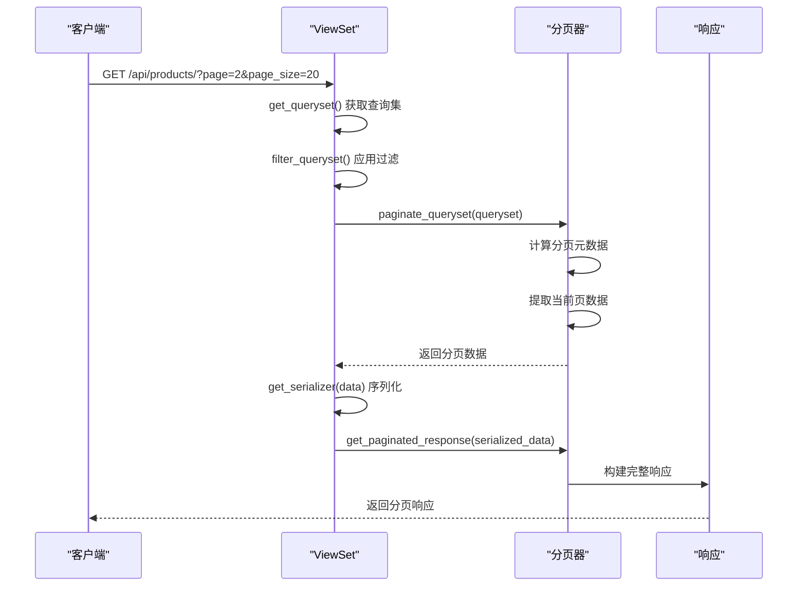
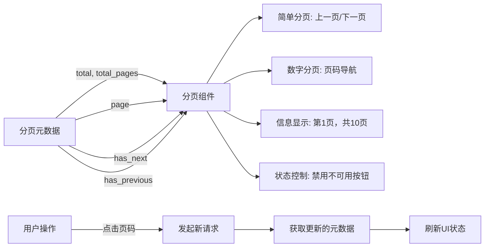

# 分页类

<cite>
**本文档引用的文件**
- [pagination.py](file://backend/common/pagination.py)
- [base.py](file://backend/backend/settings/base.py)
- [views.py](file://backend/catalog/views.py)
- [views.py](file://backend/orders/views.py)
</cite>

## 目录
1. [简介](#简介)
2. [分页类配置差异](#分页类配置差异)
3. [分页响应结构](#分页响应结构)
4. [DRF集成机制](#drf集成机制)
5. [前端分页UI实现](#前端分页ui实现)
6. [最佳实践](#最佳实践)

## 简介
本项目实现了三种自定义分页类：`StandardResultsSetPagination`、`LargeResultsSetPagination`和`SmallResultsSetPagination`，均继承自Django REST Framework的`PageNumberPagination`。这些分页类为API响应提供了统一的分页元数据格式，同时保持了与旧版字段的向后兼容性。分页配置在项目设置中定义，可在不同场景下灵活使用。

**Section sources**
- [pagination.py](file://backend/common/pagination.py#L1-L99)
- [base.py](file://backend/backend/settings/base.py#L53-L55)

## 分页类配置差异
项目中的三种分页类针对不同场景进行了优化配置，主要差异体现在`page_size`和`max_page_size`参数上：



**Diagram sources**
- [pagination.py](file://backend/common/pagination.py#L8-L81)

### StandardResultsSetPagination
标准分页类，适用于大多数API端点，提供平衡的性能和用户体验：
- `page_size`: 20（每页默认返回20条记录）
- `max_page_size`: 100（每页最大可请求100条记录）
- `page_size_query_param`: 'page_size'（客户端可通过此参数自定义页面大小）
- `page_query_param`: 'page'（客户端可通过此参数指定页码）

### LargeResultsSetPagination
大结果集分页类，适用于需要返回大量数据的场景：
- `page_size`: 100（每页默认返回100条记录）
- `max_page_size`: 1000（每页最大可请求1000条记录）
- 适用于产品目录、订单历史等数据量较大的端点

### SmallResultsSetPagination
小结果集分页类，适用于移动端或数据量较小的场景：
- `page_size`: 10（每页默认返回10条记录）
- `max_page_size`: 50（每页最大可请求50条记录）
- 适用于推荐商品、热门搜索等轻量级数据展示

**Section sources**
- [pagination.py](file://backend/common/pagination.py#L8-L81)

## 分页响应结构
所有分页类通过重写`get_paginated_response`方法生成统一的分页响应，包含丰富的元数据字段：



**Diagram sources**
- [pagination.py](file://backend/common/pagination.py#L27-L42)

### 响应字段说明
分页响应包含以下字段，为前端提供了完整的分页控制信息：

| 字段名 | 类型 | 描述 | 使用场景 |
|--------|------|------|----------|
| results | 数组 | 当前页的数据列表 | 渲染数据列表 |
| total | 整数 | 数据集的总记录数 | 显示总条数、计算总页数 |
| page | 整数 | 当前页码（从1开始） | 高亮当前页码 |
| total_pages | 整数 | 总页数 | 生成页码导航 |
| has_next | 布尔值 | 是否存在下一页 | 控制"下一页"按钮状态 |
| has_previous | 布尔值 | 是否存在上一页 | 控制"上一页"按钮状态 |
| count | 整数 | 总记录数（旧版兼容） | 兼容旧版前端代码 |
| next | 字符串 | 下一页的完整URL链接（旧版兼容） | 旧版分页逻辑 |
| previous | 字符符 | 上一页的完整URL链接（旧版兼容） | 旧版分页逻辑 |

### 向后兼容性设计
为了确保与旧版前端代码的兼容性，分页响应同时包含了新旧两套字段：
- 新字段（`total`, `page`, `total_pages`, `has_next`, `has_previous`）提供了更直观的分页状态
- 旧字段（`count`, `next`, `previous`）保留了DRF默认的分页格式
这种设计允许前端逐步迁移到新的分页逻辑，而不会影响现有功能。

**Section sources**
- [pagination.py](file://backend/common/pagination.py#L27-L42)

## DRF集成机制
分页类通过DRF的内置机制与视图系统无缝集成，实现方式如下：



**Diagram sources**
- [pagination.py](file://backend/common/pagination.py#L27-L42)
- [views.py](file://backend/orders/views.py#L127-L131)

### 全局默认配置
在`settings/base.py`中，`StandardResultsSetPagination`被设置为全局默认分页类：
```python
'DEFAULT_PAGINATION_CLASS': 'common.pagination.StandardResultsSetPagination',
'PAGE_SIZE': 20,
```
这意味着所有未显式指定分页类的视图都将使用标准分页配置。

### 视图级配置
开发者可以在特定视图中指定不同的分页类。例如，在订单视图中：
```python
class OrderViewSet(viewsets.ModelViewSet):
    queryset = Order.objects.all()
    serializer_class = OrderSerializer
    permission_classes = [IsOwnerOrAdmin]
    # 使用默认分页配置
```
通过`self.paginate_queryset(queryset)`和`self.get_paginated_response(serializer.data)`方法，视图可以轻松实现分页功能。

### 自定义分页应用
在`catalog/views.py`的`ProductViewSet`中，虽然使用了自定义搜索服务，但仍保持了与分页类相同的响应格式，确保了API的一致性。

**Section sources**
- [base.py](file://backend/backend/settings/base.py#L53-L55)
- [views.py](file://backend/orders/views.py#L23-L33)
- [views.py](file://backend/catalog/views.py#L29-L30)

## 前端分页UI实现
前端利用分页响应中的元数据字段，可以轻松实现各种分页UI组件：



**Diagram sources**
- [pagination.py](file://backend/common/pagination.py#L27-L42)

### 分页UI组件设计
前端可以基于分页元数据实现以下功能：
- **页码导航**：使用`page`和`total_pages`生成页码列表
- **状态指示**：使用`has_previous`和`has_next`控制"上一页"/"下一页"按钮的启用状态
- **信息显示**：使用`total`和`page`显示"第X页，共Y条记录"的信息
- **性能优化**：通过`max_page_size`限制，防止用户请求过多数据

### 响应式分页策略
前端可以根据设备类型选择合适的分页策略：
- **桌面端**：使用`StandardResultsSetPagination`的配置，每页显示20条
- **移动端**：使用`SmallResultsSetPagination`的配置，每页显示10条
- **数据导出**：使用`LargeResultsSetPagination`的配置，每页显示100条

**Section sources**
- [pagination.py](file://backend/common/pagination.py#L8-L81)

## 最佳实践
在使用这些分页类时，建议遵循以下最佳实践：

1. **合理选择分页类**：根据数据量和使用场景选择合适的分页类
2. **保持API一致性**：确保所有分页端点返回相同的元数据结构
3. **性能考虑**：避免设置过大的`max_page_size`，防止数据库性能问题
4. **用户体验**：在前端提供清晰的分页状态指示和导航控件
5. **渐进式迁移**：利用向后兼容性设计，逐步将旧版前端迁移到新分页逻辑

通过这些分页类的设计，项目实现了灵活、高效且用户友好的分页功能，同时确保了系统的可维护性和扩展性。

**Section sources**
- [pagination.py](file://backend/common/pagination.py#L1-L99)