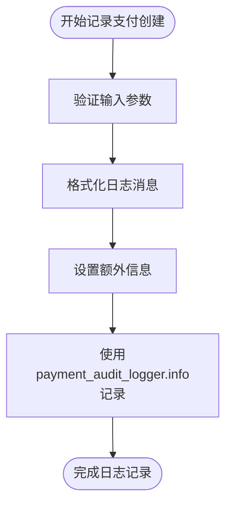
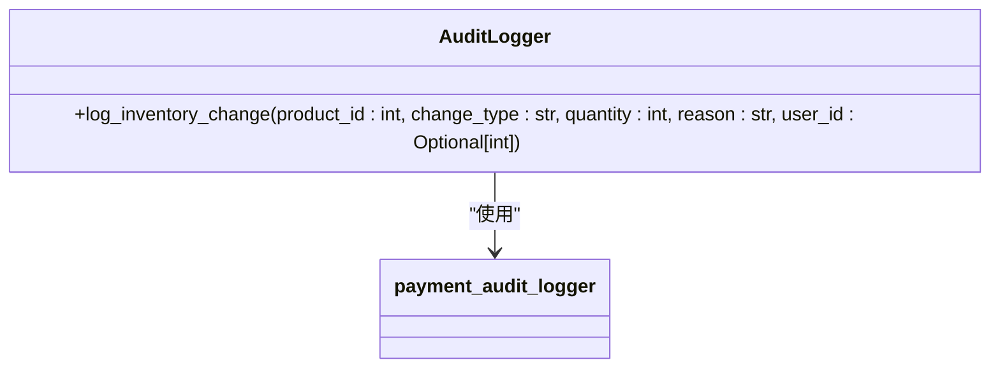
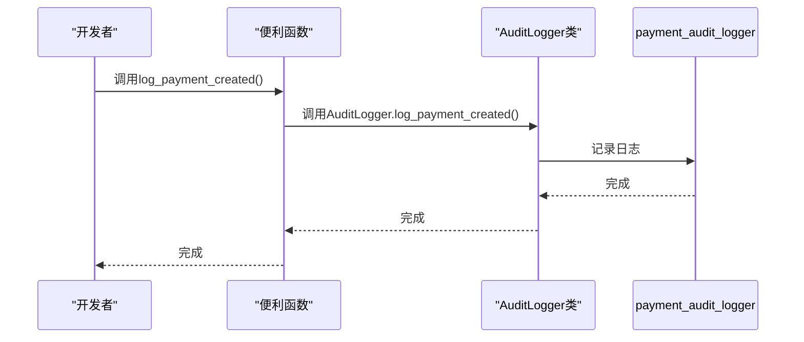

# 审计日志记录

<cite>
**本文档引用的文件**   
- [audit_logger.py](file://backend/common/audit_logger.py)
- [logging_config.py](file://backend/common/logging_config.py)
- [payment_service.py](file://backend/orders/payment_service.py)
- [api.md](file://api.md)
</cite>

## 目录
1. [审计日志系统概述](#审计日志系统概述)
2. [AuditLogger类方法详解](#auditlogger类方法详解)
3. [日志事件类型与命名规范](#日志事件类型与命名规范)
4. [特定业务场景日志方法](#特定业务场景日志方法)
5. [便利函数与类方法关系](#便利函数与类方法关系)
6. [日志记录器配置](#日志记录器配置)

## 审计日志系统概述

审计日志系统是本项目中用于跟踪关键业务操作的核心组件。该系统通过`AuditLogger`类提供集中化的审计日志功能，确保所有重要操作都有可追溯的记录。系统主要记录以下四类操作：

- **支付操作**：包括支付创建、验证、处理和退款
- **订单操作**：包括订单创建、取消和状态变更
- **用户认证**：包括用户登录和登出
- **管理员操作**：包括创建、更新和删除资源

审计日志系统使用两个主要的日志记录器：`payment_audit_logger`用于记录支付相关操作，`api_logger`用于记录API错误。这些日志记录器在`logging_config.py`中配置，确保日志信息被正确地输出到相应的日志文件中。

**Section sources**
- [audit_logger.py](file://backend/common/audit_logger.py#L1-L28)
- [logging_config.py](file://backend/common/logging_config.py#L242-L247)

## AuditLogger类方法详解

`AuditLogger`类提供了多个静态方法来记录不同类型的业务操作。这些方法确保了日志记录的一致性和结构化。

### 支付相关日志方法

#### log_payment_created方法
该方法用于记录支付创建事件。当系统为订单创建新的支付记录时调用此方法。它记录支付ID、关联的订单ID、支付金额和用户ID（可选）等关键信息。

**Diagram sources**
- [audit_logger.py](file://backend/common/audit_logger.py#L30-L49)

**Section sources**
- [audit_logger.py](file://backend/common/audit_logger.py#L30-L49)

#### log_payment_succeeded方法
该方法用于记录支付成功处理事件。当支付流程顺利完成时调用此方法。它记录支付ID、订单ID、支付金额和用户ID（可选）等信息。

**Section sources**
- [audit_logger.py](file://backend/common/audit_logger.py#L72-L91)

#### log_payment_failed方法
该方法用于记录支付失败事件。与成功日志不同，此方法使用`warning`级别记录，因为支付失败属于需要关注的异常情况。它记录支付ID、失败原因和用户ID（可选）。

**Section sources**
- [audit_logger.py](file://backend/common/audit_logger.py#L94-L111)

### 订单相关日志方法

#### log_order_created方法
该方法用于记录订单创建事件。当用户成功创建新订单时调用此方法。它记录订单ID、用户ID、订单总金额和商品数量等关键信息。

**Section sources**
- [audit_logger.py](file://backend/common/audit_logger.py#L138-L157)

#### log_order_cancelled方法
该方法用于记录订单取消事件。当订单被取消时调用此方法。它记录订单ID、取消原因和用户ID（可选）。

**Section sources**
- [audit_logger.py](file://backend/common/audit_logger.py#L160-L177)

### 用户认证日志方法

#### log_user_login方法
该方法用于记录用户登录事件。当用户成功登录系统时调用此方法。它记录用户ID、登录类型（如微信、管理员等）和IP地址（可选）。

**Section sources**
- [audit_logger.py](file://backend/common/audit_logger.py#L202-L219)

## 日志事件类型与命名规范

审计日志系统使用统一的事件类型命名规范，确保日志信息的一致性和可读性。所有事件类型都采用小写字母和下划线分隔的格式。

### 事件类型命名规则

| 事件类型 | 用途 | 示例 |
|---------|------|------|
| payment_created | 支付创建 | payment_created |
| payment_succeeded | 支付成功 | payment_succeeded |
| payment_failed | 支付失败 | payment_failed |
| order_created | 订单创建 | order_created |
| order_cancelled | 订单取消 | order_cancelled |
| user_login | 用户登录 | user_login |
| admin_action | 管理员操作 | admin_action |
| api_error | API错误 | api_error |

**Section sources**
- [audit_logger.py](file://backend/common/audit_logger.py#L44-L262)

### 事件类型用途说明

- **payment_** 前缀：用于所有支付相关操作，包括创建、验证、成功、失败和退款
- **order_** 前缀：用于订单相关操作，包括创建、取消和状态变更
- **user_** 前缀：用于用户认证相关操作
- **admin_** 前缀：用于管理员操作
- **api_** 前缀：用于API相关错误

## 特定业务场景日志方法

除了基本的业务操作日志外，系统还提供了针对特定业务场景的日志方法。

### log_inventory_change方法

该方法用于记录库存变更事件。当商品库存发生变化时调用此方法，如库存锁定、释放或调整。它记录商品ID、变更类型、变更数量、变更原因和用户ID（可选）。

**Diagram sources**
- [audit_logger.py](file://backend/common/audit_logger.py#L272-L292)

**Section sources**
- [audit_logger.py](file://backend/common/audit_logger.py#L272-L292)

### log_supplier_sync方法

该方法用于记录供应商数据同步事件。当与供应商系统进行数据同步时调用此方法。它记录供应商名称、同步类型（如产品、库存等）、同步状态和附加消息。

**Section sources**
- [audit_logger.py](file://backend/common/audit_logger.py#L296-L314)

### 其他重要日志方法

#### log_admin_action方法
该方法用于记录管理员操作。当管理员执行创建、更新或删除等操作时调用此方法。它记录操作类型、资源类型、资源ID、管理员ID和详细信息（可选）。

**Section sources**
- [audit_logger.py](file://backend/common/audit_logger.py#L223-L244)

#### log_api_error方法
该方法用于记录API错误。当API请求发生错误时调用此方法。与其它日志不同，此方法使用`api_logger`而不是`payment_audit_logger`，并将日志级别设置为`error`。

**Section sources**
- [audit_logger.py](file://backend/common/audit_logger.py#L248-L268)

## 便利函数与类方法关系

为了简化常用日志操作的调用，系统提供了多个便利函数。这些函数本质上是`AuditLogger`类方法的包装器。

### 便利函数列表

| 便利函数 | 对应的类方法 | 用途 |
|---------|------------|------|
| log_payment_created | AuditLogger.log_payment_created | 记录支付创建 |
| log_payment_succeeded | AuditLogger.log_payment_succeeded | 记录支付成功 |
| log_payment_failed | AuditLogger.log_payment_failed | 记录支付失败 |
| log_order_created | AuditLogger.log_order_created | 记录订单创建 |
| log_order_cancelled | AuditLogger.log_order_cancelled | 记录订单取消 |
| log_user_login | AuditLogger.log_user_login | 记录用户登录 |

### 使用场景分析

便利函数的主要优势在于简化了调用语法。开发者可以直接导入和调用这些函数，而不需要每次都引用`AuditLogger`类。

**Diagram sources**
- [audit_logger.py](file://backend/common/audit_logger.py#L319-L346)

**Section sources**
- [audit_logger.py](file://backend/common/audit_logger.py#L319-L346)

## 日志记录器配置

审计日志系统的底层配置在`logging_config.py`文件中定义。系统配置了多个日志记录器，每个都有特定的用途。

### 主要日志记录器

- **payment_audit**：用于记录支付相关的审计日志，日志级别为INFO
- **api**：用于记录API相关的错误日志，日志级别为INFO
- **django**：Django框架的根日志记录器
- **django.request**：Django请求日志记录器

### 日志文件配置

日志文件根据运行环境（开发或生产）有不同的配置。在生产环境中，日志级别设置为INFO，而在开发环境中设置为DEBUG。日志文件会自动轮转，确保不会占用过多磁盘空间。

**Section sources**
- [logging_config.py](file://backend/common/logging_config.py#L242-L247)
- [logging_config.py](file://backend/common/logging_config.py#L136-L156)