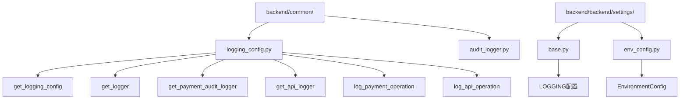
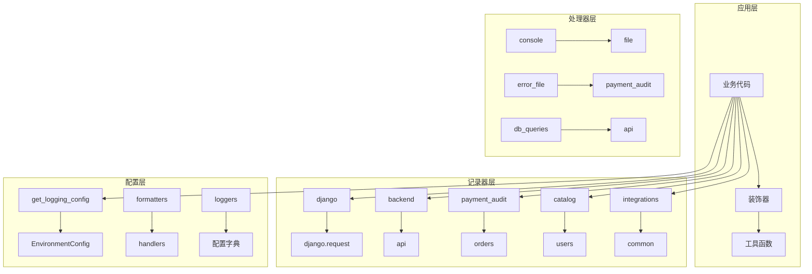
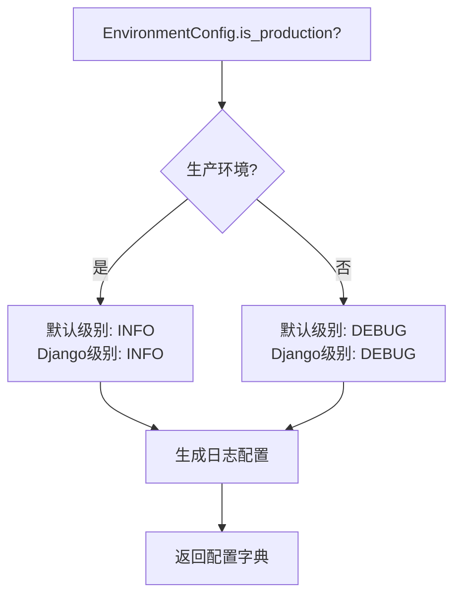
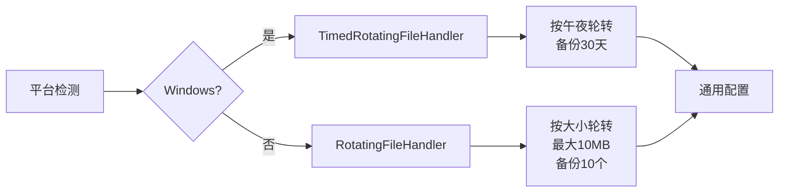
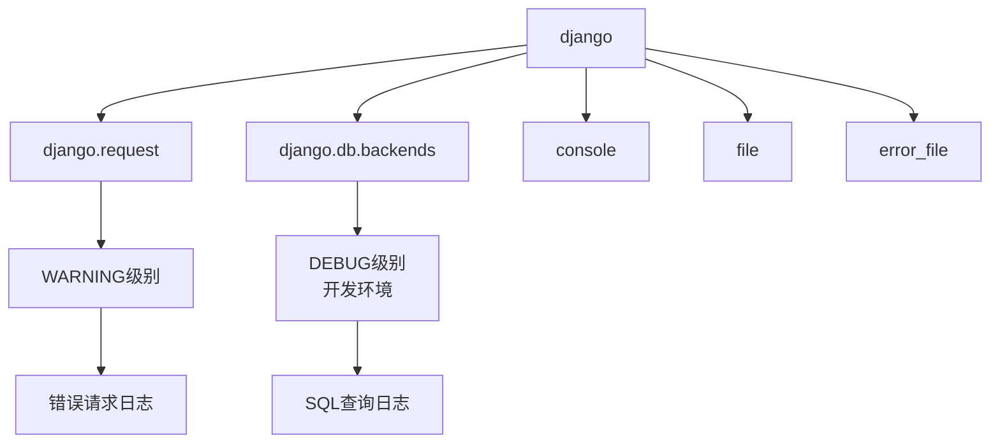
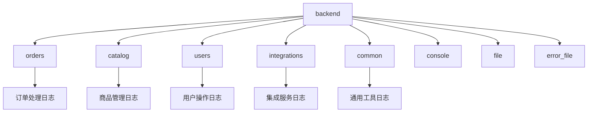
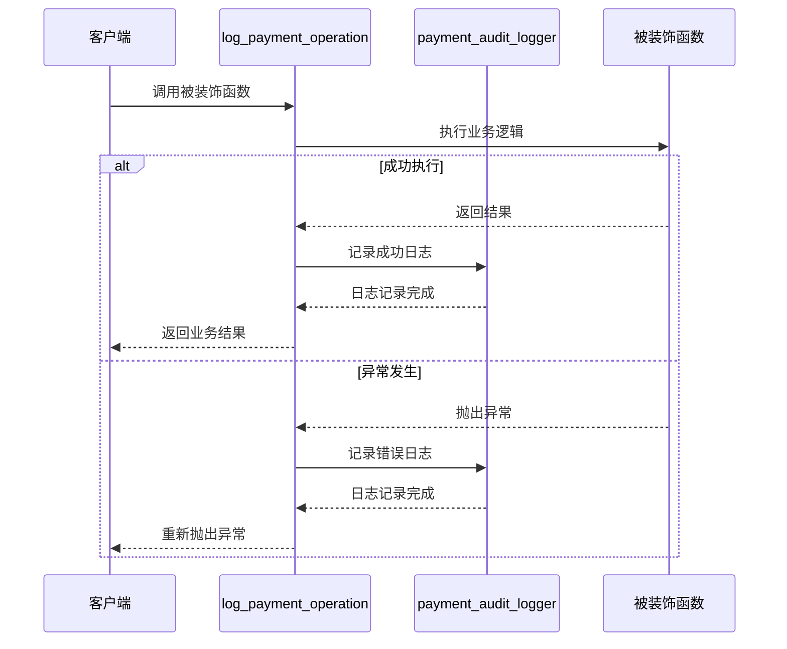
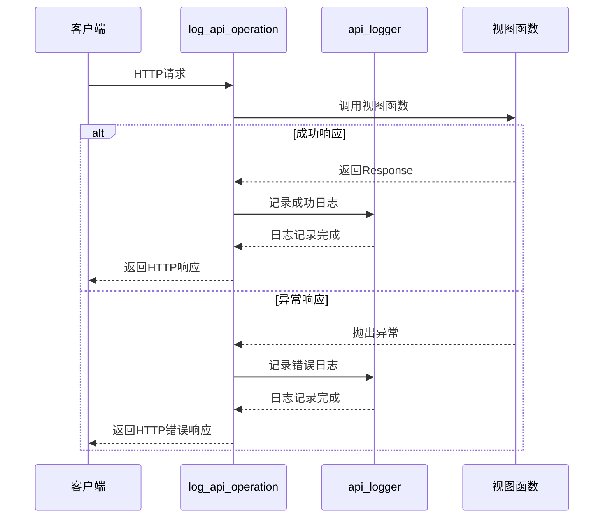
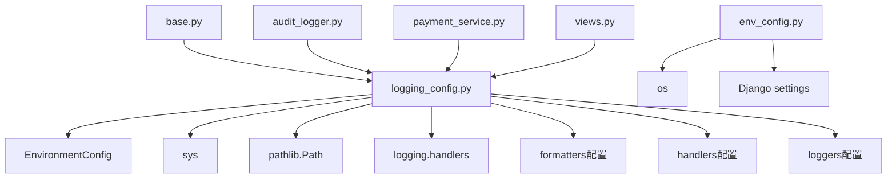

# 日志系统配置

<cite>
**本文档中引用的文件**
- [logging_config.py](file://backend/common/logging_config.py)
- [base.py](file://backend/backend/settings/base.py)
- [env_config.py](file://backend/backend/settings/env_config.py)
- [payment_service.py](file://backend/orders/payment_service.py)
- [views.py](file://backend/orders/views.py)
- [audit_logger.py](file://backend/common/audit_logger.py)
</cite>

## 目录
1. [简介](#简介)
2. [项目结构](#项目结构)
3. [核心组件](#核心组件)
4. [架构概览](#架构概览)
5. [详细组件分析](#详细组件分析)
6. [依赖关系分析](#依赖关系分析)
7. [性能考虑](#性能考虑)
8. [故障排除指南](#故障排除指南)
9. [结论](#结论)

## 简介

该日志系统是一个专为Django应用程序设计的集中式日志配置解决方案，提供了环境感知的日志级别、跨平台兼容的文件处理器、专门的审计日志功能以及便捷的装饰器工具。系统支持Windows和非Windows平台的不同文件轮转策略，为不同的业务模块提供专门的日志记录器。

## 项目结构

日志系统的核心文件位于`backend/common/`目录下，主要包括：



**图表来源**
- [logging_config.py](file://backend/common/logging_config.py#L1-L428)
- [base.py](file://backend/backend/settings/base.py#L224-L225)

**章节来源**
- [logging_config.py](file://backend/common/logging_config.py#L1-L50)
- [base.py](file://backend/backend/settings/base.py#L224-L225)

## 核心组件

### get_logging_config() 函数

这是日志系统的核心配置函数，负责根据环境动态生成Django日志配置：

- **环境检测**：自动识别开发和生产环境
- **日志级别管理**：开发环境使用DEBUG级别，生产环境使用INFO级别
- **跨平台适配**：Windows平台使用TimedRotatingFileHandler，其他平台使用RotatingFileHandler
- **多格式化器**：提供详细、简单和审计三种格式化器

### 工具函数

系统提供三个主要的工具函数：

- **get_logger()**：获取通用日志记录器
- **get_payment_audit_logger()**：获取支付审计专用日志记录器  
- **get_api_logger()**：获取API操作专用日志记录器

### 装饰器系统

提供两个专门的操作日志装饰器：

- **log_payment_operation()**：用于支付相关操作的自动化日志记录
- **log_api_operation()**：用于API接口操作的自动化日志记录

**章节来源**
- [logging_config.py](file://backend/common/logging_config.py#L30-L285)

## 架构概览

日志系统采用分层架构设计，包含配置层、处理器层、记录器层和应用层：



**图表来源**
- [logging_config.py](file://backend/common/logging_config.py#L204-L283)
- [base.py](file://backend/backend/settings/base.py#L224-L225)

## 详细组件分析

### get_logging_config() 函数详解

#### 环境配置策略

系统通过EnvironmentConfig类检测运行环境，并据此调整日志级别：



**图表来源**
- [logging_config.py](file://backend/common/logging_config.py#L44-L50)
- [env_config.py](file://backend/backend/settings/env_config.py#L66-L73)

#### 平台差异化处理器

系统根据操作系统平台选择不同的文件处理器：



**图表来源**
- [logging_config.py](file://backend/common/logging_config.py#L90-L110)
- [logging_config.py](file://backend/common/logging_config.py#L101-L130)

#### 日志处理器配置表

| 处理器类型 | Windows配置 | 非Windows配置 | 备注 |
|-----------|------------|--------------|------|
| 应用日志 | TimedRotatingFileHandler<br/>午夜轮转 | RotatingFileHandler<br/>10MB大小限制 | 保留30天备份 |
| 错误日志 | TimedRotatingFileHandler<br/>ERROR级别 | RotatingFileHandler<br/>ERROR级别 | 保留30天备份 |
| 支付审计 | TimedRotatingFileHandler<br/>90天备份 | RotatingFileHandler<br/>50MB大小限制<br/>20个备份 | 审计专用格式 |
| 数据库查询 | TimedRotatingFileHandler<br/>7天备份 | RotatingFileHandler<br/>10MB大小限制<br/>5个备份 | 仅开发环境启用 |
| API日志 | TimedRotatingFileHandler<br/>30天备份 | RotatingFileHandler<br/>10MB大小限制<br/>10个备份 | 保留30天备份 |

**章节来源**
- [logging_config.py](file://backend/common/logging_config.py#L82-L202)

### 日志记录器层级关系

#### Django框架日志记录器



**图表来源**
- [logging_config.py](file://backend/common/logging_config.py#L207-L226)

#### 应用模块日志记录器

系统为每个主要应用模块配置了独立的日志记录器：



**图表来源**
- [logging_config.py](file://backend/common/logging_config.py#L228-L282)

**章节来源**
- [logging_config.py](file://backend/common/logging_config.py#L204-L283)

### 工具函数使用详解

#### get_logger() 函数

通用日志记录器获取函数，支持Python标准库的logging模块：

```python
# 使用示例
from common.logging_config import get_logger

logger = get_logger(__name__)
logger.info('应用启动完成')
logger.error('发生错误', exc_info=True)
```

#### get_payment_audit_logger() 函数

专门用于支付审计操作的日志记录器：

```python
# 使用示例  
from common.logging_config import get_payment_audit_logger

audit_logger = get_payment_audit_logger()
audit_logger.info('支付创建成功', extra={
    'payment_id': 123,
    'order_id': 456,
    'amount': 100.00
})
```

#### get_api_logger() 函数

专门用于API操作记录的日志记录器：

```python
# 使用示例
from common.logging_config import get_api_logger

api_logger = get_api_logger()
api_logger.info('API请求处理完成', extra={
    'operation': 'create',
    'function': 'create_product',
    'endpoint': '/api/products/'
})
```

**章节来源**
- [logging_config.py](file://backend/common/logging_config.py#L292-L336)

### 装饰器系统详解

#### log_payment_operation 装饰器

支付操作自动化日志装饰器，提供统一的成功/失败日志记录：



**图表来源**
- [logging_config.py](file://backend/common/logging_config.py#L356-L384)

#### log_api_operation 装饰器

API操作自动化日志装饰器，提供统一的API调用日志记录：



**图表来源**
- [logging_config.py](file://backend/common/logging_config.py#L400-L426)

#### 装饰器配置参数表

| 装饰器类型 | 参数 | 用途 | 示例 |
|-----------|------|------|------|
| log_payment_operation | operation_type | 操作类型标识 | 'create', 'verify', 'process' |
| log_api_operation | operation_type | API操作类型 | 'list', 'create', 'update' |
| 日志级别 | 自动 | 基于环境自动设置 | DEBUG/PRODUCTION |
| 异常处理 | exc_info=True | 记录完整堆栈信息 | 自动捕获异常详情 |

**章节来源**
- [logging_config.py](file://backend/common/logging_config.py#L344-L427)

## 依赖关系分析

### 模块依赖图



**图表来源**
- [logging_config.py](file://backend/common/logging_config.py#L12-L18)
- [base.py](file://backend/backend/settings/base.py#L224-L225)

### 外部依赖

系统依赖以下外部模块和配置：

- **Python标准库**：logging, os, sys, pathlib
- **Django框架**：settings配置系统
- **环境变量**：DJANGO_ENV, LOGS_DIR等
- **操作系统特性**：sys.platform判断

**章节来源**
- [logging_config.py](file://backend/common/logging_config.py#L12-L18)
- [env_config.py](file://backend/backend/settings/env_config.py#L37-L73)

## 性能考虑

### 文件处理器性能优化

1. **Windows平台**：使用TimedRotatingFileHandler，按时间轮转减少I/O开销
2. **非Windows平台**：使用RotatingFileHandler，按大小轮转避免频繁磁盘操作
3. **编码设置**：统一使用UTF-8编码，确保字符集一致性
4. **缓冲机制**：利用Python logging模块的内置缓冲机制

### 内存使用优化

1. **日志级别过滤**：通过配置不同级别的日志记录，减少内存占用
2. **备份数量控制**：合理设置备份文件数量，平衡存储需求和历史保留
3. **消息长度限制**：装饰器中对args和kwargs进行长度截断，避免大对象占用内存

### 并发处理考虑

1. **线程安全**：使用Python logging模块的线程安全特性
2. **原子写入**：文件处理器确保单次写入的原子性
3. **锁机制**：在高并发场景下，文件处理器内部实现适当的锁机制

## 故障排除指南

### 常见问题及解决方案

#### 日志文件无法创建

**问题描述**：日志文件路径不存在或权限不足

**解决方案**：
1. 检查LOGS_DIR路径是否存在
2. 确认应用程序有写入权限
3. 在代码中添加路径创建逻辑（已在系统中实现）

#### Windows平台文件锁定

**问题描述**：Windows系统下日志文件被其他进程锁定

**解决方案**：
1. 使用TimedRotatingFileHandler的轮转机制
2. 确保日志文件关闭后再读取
3. 避免同时多个进程访问同一日志文件

#### 日志级别配置错误

**问题描述**：日志级别设置不当导致过多或过少的日志输出

**解决方案**：
1. 开发环境使用DEBUG级别获取详细信息
2. 生产环境使用INFO级别保持适度输出
3. 特殊模块可根据需要单独调整级别

#### 装饰器使用问题

**问题描述**：装饰器未能正确记录日志

**解决方案**：
1. 确保被装饰函数正确返回结果
2. 检查extra参数格式是否正确
3. 验证日志记录器配置是否正确

**章节来源**
- [logging_config.py](file://backend/common/logging_config.py#L26-L28)
- [logging_config.py](file://backend/common/logging_config.py#L356-L384)

## 结论

该日志系统配置方案提供了全面而灵活的日志记录解决方案，具有以下优势：

1. **环境感知**：自动适应开发和生产环境的不同需求
2. **跨平台兼容**：针对不同操作系统优化文件处理器
3. **模块化设计**：清晰的职责分离和模块化架构
4. **自动化程度高**：通过装饰器减少手动日志记录的工作量
5. **审计友好**：专门的支付审计日志支持合规要求
6. **易于扩展**：清晰的接口设计便于添加新的日志记录器

该系统能够满足现代Web应用对日志记录的各种需求，为应用程序的监控、调试和审计提供了坚实的基础。通过合理的配置和使用，可以显著提高应用程序的可观测性和维护效率。