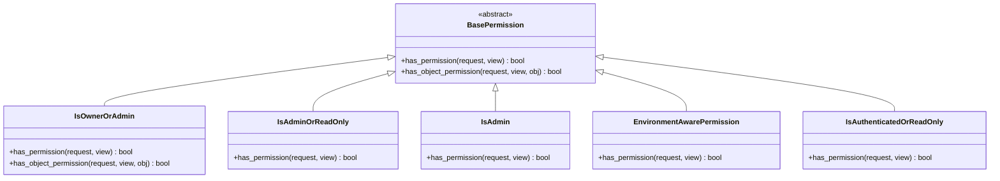
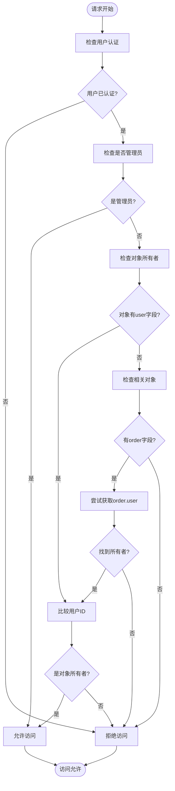
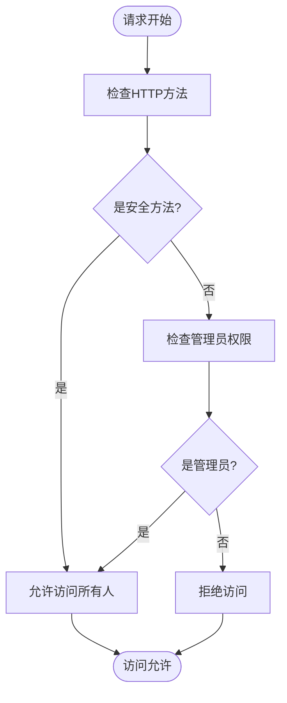
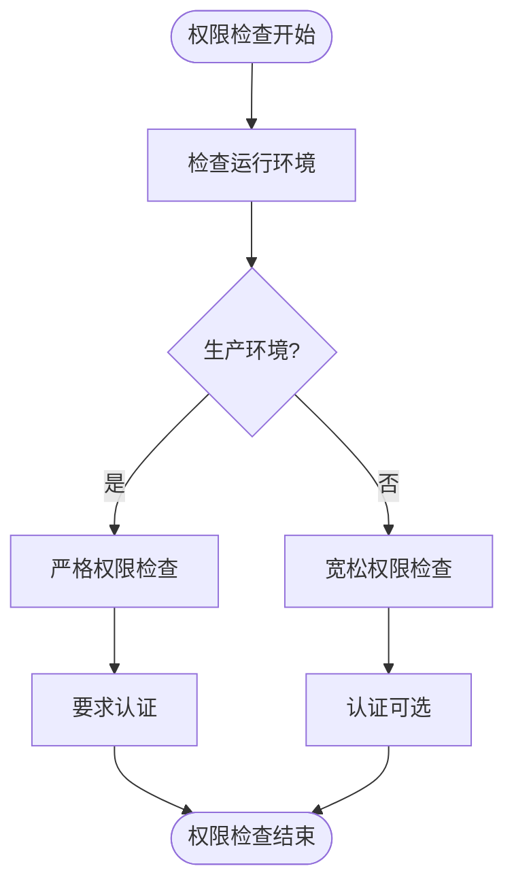

# 权限类

<cite>
**本文档引用的文件**
- [permissions.py](file://backend/common/permissions.py)
- [orders/views.py](file://backend/orders/views.py)
- [catalog/views.py](file://backend/catalog/views.py)
- [users/views.py](file://backend/users/views.py)
- [env_config.py](file://backend/backend/settings/env_config.py)
</cite>

## 目录
1. [简介](#简介)
2. [权限类架构概览](#权限类架构概览)
3. [核心权限类详解](#核心权限类详解)
4. [环境感知权限](#环境感知权限)
5. [权限类在视图中的应用](#权限类在视图中的应用)
6. [最佳实践与使用建议](#最佳实践与使用建议)
7. [总结](#总结)

## 简介

本文档详细介绍了电商业务小程序项目中使用的自定义权限类系统。该项目采用Django REST Framework的权限机制，提供了五种核心权限类：`IsOwnerOrAdmin`、`IsAdminOrReadOnly`、`IsAdmin`、`EnvironmentAwarePermission`和`IsAuthenticatedOrReadOnly`。这些权限类针对不同的业务场景和安全需求，提供了灵活而强大的访问控制机制。

## 权限类架构概览



**图表来源**
- [permissions.py](file://backend/common/permissions.py#L12-L188)

## 核心权限类详解

### IsOwnerOrAdmin 权限类

`IsOwnerOrAdmin`是最常用的权限类，实现了基于所有权的访问控制机制。

#### 实现逻辑



**图表来源**
- [permissions.py](file://backend/common/permissions.py#L40-L67)

#### 关键特性

1. **双重检查机制**：首先验证用户认证，然后判断是否为管理员或对象所有者
2. **间接关系处理**：对于像`Payment`这样的相关对象，能够通过`obj.order.user`获取所有者信息
3. **安全性设计**：确保只有经过身份验证的用户才能进行权限检查

#### 使用场景

- **订单管理**：用户只能查看和修改自己的订单
- **支付记录**：用户只能访问自己订单的支付信息
- **地址管理**：用户只能管理自己的地址信息

**章节来源**
- [permissions.py](file://backend/common/permissions.py#L12-L67)
- [orders/views.py](file://backend/orders/views.py#L23-L33)

### IsAdminOrReadOnly 权限类

该权限类实现了读写分离的安全策略，对不同类型的HTTP请求采用不同的权限要求。

#### 实现逻辑



**图表来源**
- [permissions.py](file://backend/common/permissions.py#L70-L98)

#### 安全策略

| HTTP方法 | 权限要求 | 使用场景 |
|---------|---------|---------|
| GET, HEAD, OPTIONS | 所有人（包括未认证用户） | 公开数据查询 |
| POST, PUT, PATCH, DELETE | 管理员权限 | 数据修改操作 |

#### 应用示例

- **商品管理**：普通用户可以浏览商品，只有管理员可以创建、修改或删除商品
- **分类管理**：公开分类列表，管理员维护分类结构
- **品牌管理**：品牌信息公开，管理员管理品牌数据

**章节来源**
- [permissions.py](file://backend/common/permissions.py#L70-L98)
- [catalog/views.py](file://backend/catalog/views.py#L49-L50)

### IsAdmin 权限类

最严格的权限类，仅允许具有管理员权限的用户访问资源。

#### 实现特点

- **单一权限要求**：只需要`is_staff=True`即可
- **无匿名访问**：必须经过身份验证
- **最高安全级别**：适用于敏感管理操作

#### 使用场景

- **用户管理**：管理员账户的创建、编辑和删除
- **系统配置**：后台管理系统的核心功能
- **数据迁移**：数据库维护和数据导入导出

**章节来源**
- [permissions.py](file://backend/common/permissions.py#L101-L123)
- [users/views.py](file://backend/users/views.py#L400-L400)

### IsAuthenticatedOrReadOnly 权限类

折衷型权限类，在开放性和安全性之间取得平衡。

#### 权限矩阵

| HTTP方法 | 匿名用户 | 已认证用户 | 管理员 |
|---------|---------|-----------|-------|
| GET, HEAD, OPTIONS | ✅ 允许 | ✅ 允许 | ✅ 允许 |
| POST, PUT, PATCH, DELETE | ❌ 拒绝 | ✅ 允许 | ✅ 允许 |

#### 设计理念

- **开放性**：允许匿名用户访问公开数据
- **保护性**：防止未授权的恶意修改
- **灵活性**：为公共评论等功能提供支持

**章节来源**
- [permissions.py](file://backend/common/permissions.py#L160-L188)

## 环境感知权限

### EnvironmentAwarePermission

这是项目特有的环境感知权限类，根据运行环境动态调整安全策略。

#### 环境策略对比

| 权限类型 | 开发环境 | 生产环境 |
|---------|---------|---------|
| 匿名访问 | ✅ 允许 | ❌ 严格限制 |
| 权限检查 | 较宽松 | 最严格 |
| 调试支持 | ✅ 提供 | ❌ 禁用 |
| 错误处理 | ✅ 详细信息 | ✅ 简化信息 |

#### 实现细节



**图表来源**
- [permissions.py](file://backend/common/permissions.py#L126-L157)

#### 环境配置

- **开发环境**：`DJANGO_ENV=development`
- **生产环境**：`DJANGO_ENV=production`

**章节来源**
- [permissions.py](file://backend/common/permissions.py#L126-L157)
- [env_config.py](file://backend/backend/settings/env_config.py#L45-L73)

## 权限类在视图中的应用

### 视图级权限配置

权限类通过`permission_classes`属性应用于视图集：

```python
# 订单视图集 - 基于所有权的权限
class OrderViewSet(viewsets.ModelViewSet):
    permission_classes = [IsOwnerOrAdmin]

# 商品视图集 - 只读权限
class ProductViewSet(viewsets.ModelViewSet):
    permission_classes = [IsAdminOrReadOnly]

# 管理员专用视图
class AdminUserViewSet(viewsets.ModelViewSet):
    permission_classes = [IsAuthenticated, IsAdmin]
```

### 方法级权限覆盖

某些特定方法可能需要更严格的权限控制：

```python
@action(detail=True, methods=['patch'], permission_classes=[IsOwnerOrAdmin])
def status(self, request, pk=None):
    """订单状态更新 - 基于所有权"""
    
@action(detail=False, methods=["post"], permission_classes=[IsAuthenticated])
def create_order(self, request):
    """创建订单 - 身份验证要求"""
```

### 权限组合使用

多个权限类可以组合使用，形成更复杂的权限策略：

```python
# 同时要求身份验证和管理员权限
permission_classes = [IsAuthenticated, IsAdmin]

# 环境感知权限 - 开发环境宽松，生产环境严格
permission_classes = [EnvironmentAwarePermission]
```

**章节来源**
- [orders/views.py](file://backend/orders/views.py#L23-L33)
- [catalog/views.py](file://backend/catalog/views.py#L49-L50)
- [users/views.py](file://backend/users/views.py#L400-L400)

## 最佳实践与使用建议

### 权限选择指南

1. **数据隐私保护**：优先使用`IsOwnerOrAdmin`保护用户数据
2. **内容管理**：使用`IsAdminOrReadOnly`平衡开放性和安全性
3. **系统管理**：始终使用`IsAdmin`确保关键功能的安全
4. **开发调试**：利用`EnvironmentAwarePermission`简化开发过程
5. **公共接口**：考虑使用`IsAuthenticatedOrReadOnly`提供更好的用户体验

### 性能优化建议

1. **权限缓存**：在用户模型中缓存权限信息
2. **查询优化**：在视图中直接过滤相关数据
3. **权限预检查**：在复杂业务逻辑前进行快速权限验证

### 安全注意事项

1. **最小权限原则**：只授予完成任务所需的最低权限
2. **环境隔离**：确保开发和生产环境的权限策略一致
3. **审计日志**：记录权限相关的访问和操作
4. **定期审查**：定期检查权限配置的合理性和安全性

## 总结

该项目的权限系统设计体现了以下核心理念：

1. **分层安全**：从简单到复杂的权限层次，适应不同场景需求
2. **环境适配**：智能的环境感知机制，兼顾开发效率和生产安全
3. **业务导向**：紧密贴合电商业务的实际需求和使用场景
4. **易于扩展**：清晰的继承结构，便于添加新的权限类型

通过合理使用这些权限类，项目能够在保证安全性的同时，提供良好的开发体验和用户体验。这种设计模式值得在类似的Web应用项目中借鉴和应用。