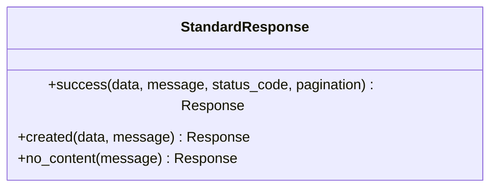
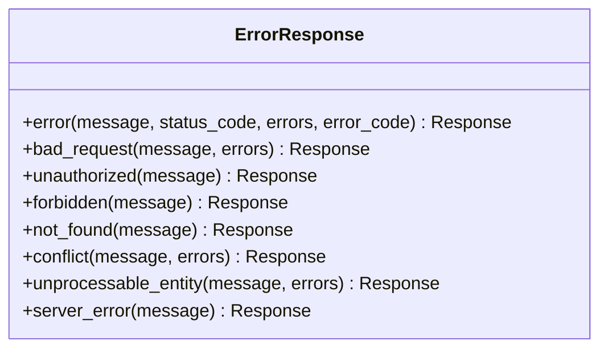
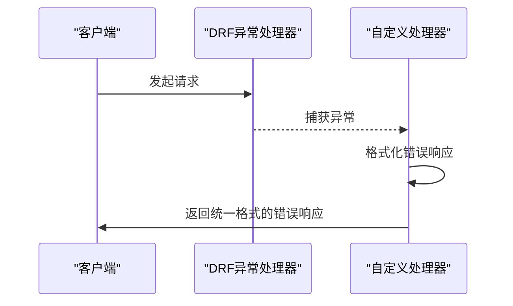
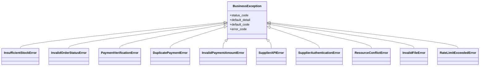
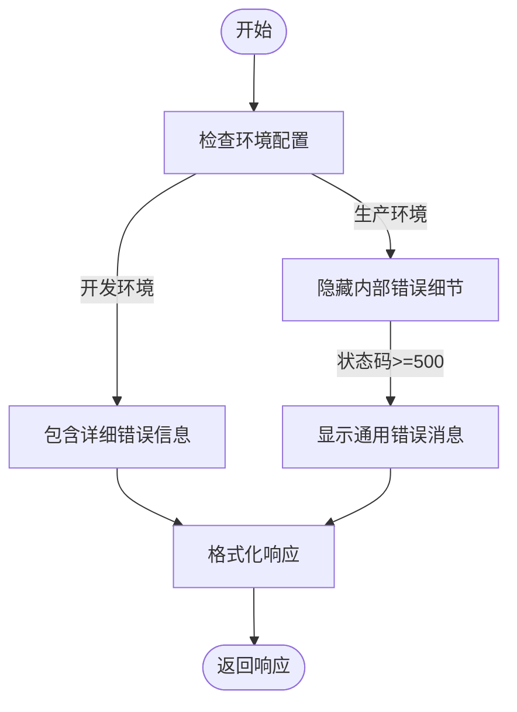

# 统一响应格式

<cite>
**本文档引用的文件**  
- [responses.py](file://backend/common/responses.py)
- [exceptions.py](file://backend/common/exceptions.py)
- [pagination.py](file://backend/common/pagination.py)
- [users/views.py](file://backend/users/views.py)
- [orders/views.py](file://backend/orders/views.py)
</cite>

## 目录
1. [简介](#简介)
2. [标准成功响应](#标准成功响应)
3. [结构化错误响应](#结构化错误响应)
4. [异常处理机制](#异常处理机制)
5. [分页支持](#分页支持)
6. [错误详情处理](#错误详情处理)

## 简介
本项目采用统一的API响应格式，确保所有端点返回一致的响应结构。该机制通过`StandardResponse`和`ErrorResponse`类实现，配合自定义异常处理器，为成功和错误响应提供标准化的JSON格式。这种设计简化了前端处理逻辑，提高了API的可预测性和可维护性。

## 标准成功响应

`StandardResponse`类为所有成功的API响应提供了统一的包装器。其响应格式包含`success`、`code`、`message`、`data`和可选的`pagination`字段，确保前端可以一致地处理成功响应。



**Diagram sources**  
- [responses.py](file://backend/common/responses.py#L14-L99)

### success方法
`success`是核心方法，用于创建包含数据的成功响应。它接受数据、消息、状态码和分页元数据作为参数，生成符合统一格式的响应。

```json
{
    "success": true,
    "code": 200,
    "message": "操作成功",
    "data": {...}
}
```

**Section sources**  
- [responses.py](file://backend/common/responses.py#L29-L58)

### created方法
`created`方法是`success`的便捷封装，专门用于创建201 Created响应，通常在资源创建成功后使用。

```json
{
    "success": true,
    "code": 201,
    "message": "资源创建成功",
    "data": {...}
}
```

**Section sources**  
- [responses.py](file://backend/common/responses.py#L60-L79)

### no_content方法
`no_content`方法用于创建204 No Content响应，当操作成功但无需返回数据时使用。

```json
{
    "success": true,
    "code": 204,
    "message": "操作成功"
}
```

**Section sources**  
- [responses.py](file://backend/common/responses.py#L81-L98)

## 结构化错误响应

`ErrorResponse`类为所有错误响应提供了统一的包装器。其响应格式包含`success`、`code`、`message`、可选的`error_code`和`errors`字段，确保前端可以一致地处理各种错误情况。



**Diagram sources**  
- [responses.py](file://backend/common/responses.py#L102-L273)

### error方法
`error`是核心方法，用于创建包含错误信息的响应。它接受消息、状态码、详细错误和错误代码作为参数，生成结构化的错误响应。

```json
{
    "success": false,
    "code": 400,
    "message": "错误消息",
    "error_code": "ERROR_CODE",
    "errors": {...}
}
```

**Section sources**  
- [responses.py](file://backend/common/responses.py#L115-L146)

### 特定错误方法
`ErrorResponse`提供了多个便捷方法来创建特定类型的错误响应：

- `bad_request`: 创建400 Bad Request响应
- `unauthorized`: 创建401 Unauthorized响应
- `forbidden`: 创建403 Forbidden响应
- `not_found`: 创建404 Not Found响应
- `conflict`: 创建409 Conflict响应
- `unprocessable_entity`: 创建422 Unprocessable Entity响应
- `server_error`: 创建500 Internal Server Error响应

这些方法简化了常见错误响应的创建过程。

**Section sources**  
- [responses.py](file://backend/common/responses.py#L148-L273)

## 异常处理机制

`custom_exception_handler`函数拦截DRF异常并将其转换为统一的响应格式。该处理器处理验证错误、字段错误等，并确保所有异常都以一致的格式返回。



**Diagram sources**  
- [exceptions.py](file://backend/common/exceptions.py#L251-L313)

### 验证错误处理
当发生验证错误时，处理器会提取详细的错误信息并包含在响应中，帮助前端定位具体的问题字段。

```json
{
    "success": false,
    "code": 400,
    "message": "验证错误",
    "errors": {
        "field_name": ["错误消息"]
    }
}
```

**Section sources**  
- [exceptions.py](file://backend/common/exceptions.py#L294-L308)

### 自定义业务异常
系统定义了多种业务逻辑异常，如`InsufficientStockError`、`InvalidOrderStatusError`等，这些异常都继承自`BusinessException`，具有特定的HTTP状态码和错误代码。



**Diagram sources**  
- [exceptions.py](file://backend/common/exceptions.py#L26-L245)

## 分页支持

响应格式通过`pagination`字段支持分页元数据。系统提供了多种分页类，如`StandardResultsSetPagination`、`LargeResultsSetPagination`和`SmallResultsSetPagination`，以满足不同场景的需求。

```json
{
    "success": true,
    "code": 200,
    "message": "操作成功",
    "data": [...],
    "pagination": {
        "results": [...],
        "total": 100,
        "page": 1,
        "total_pages": 5,
        "has_next": true,
        "has_previous": false
    }
}
```

**Section sources**  
- [pagination.py](file://backend/common/pagination.py#L8-L98)

## 错误详情处理

系统根据环境配置智能处理错误详情。在开发环境中，详细的错误信息会被包含在响应中，便于调试；而在生产环境中，敏感的内部错误细节会被隐藏，以保护系统安全。



**Diagram sources**  
- [exceptions.py](file://backend/common/exceptions.py#L298-L307)

当5xx错误发生在生产环境时，系统会返回通用的错误消息，避免暴露内部实现细节。

```json
{
    "success": false,
    "code": 500,
    "message": "服务器内部错误，请稍后重试"
}
```

**Section sources**  
- [exceptions.py](file://backend/common/exceptions.py#L303-L306)