# 自定义异常处理

<cite>
**本文档引用的文件**
- [exceptions.py](file://backend/common/exceptions.py)
- [base.py](file://backend/backend/settings/base.py)
- [api.md](file://api.md)
</cite>

## 目录
1. [简介](#简介)
2. [业务异常设计](#业务异常设计)
3. [统一异常处理器](#统一异常处理器)
4. [未处理异常处理](#未处理异常处理)
5. [异常日志中间件](#异常日志中间件)
6. [错误响应格式](#错误响应格式)
7. [最佳实践](#最佳实践)

## 简介
本系统实现了完整的自定义异常处理机制，包括业务异常类、统一异常处理器、未处理异常处理器和异常日志中间件。该机制确保了API响应的一致性，提供了详细的错误信息用于开发调试，并在生产环境中保护了敏感信息。异常处理系统与Django REST Framework集成，能够处理各种业务场景下的错误情况。

**Section sources**
- [exceptions.py](file://backend/common/exceptions.py#L1-L504)

## 业务异常设计
系统定义了`BusinessException`作为所有业务异常的基类，并在此基础上创建了多个具体的业务异常子类，每个异常都有明确的HTTP状态码、错误代码和使用场景。

### BusinessException基类
`BusinessException`是所有业务异常的基类，继承自DRF的`APIException`。它提供了统一的异常处理框架，包含错误代码、HTTP状态码和错误消息等属性。

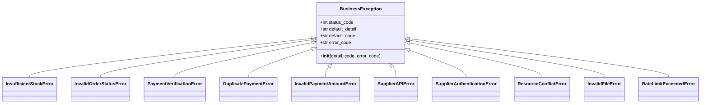

**Diagram sources**
- [exceptions.py](file://backend/common/exceptions.py#L26-L57)

**Section sources**
- [exceptions.py](file://backend/common/exceptions.py#L26-L57)

### 具体业务异常类
系统定义了多个具体的业务异常类，每个异常都针对特定的业务场景。

#### 库存相关异常
`InsufficientStockError`用于处理库存不足的情况，当用户尝试购买的数量超过可用库存时抛出此异常。

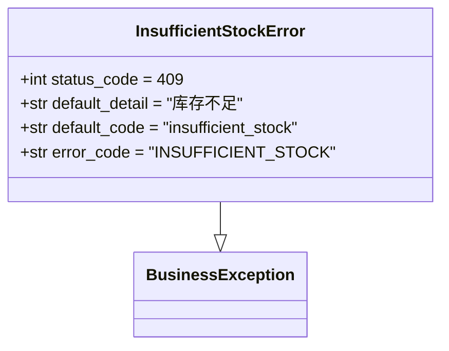

**Diagram sources**
- [exceptions.py](file://backend/common/exceptions.py#L59-L75)

#### 订单状态异常
`InvalidOrderStatusError`用于处理无效的订单状态转换，当尝试对订单执行不合法的状态变更时抛出此异常。

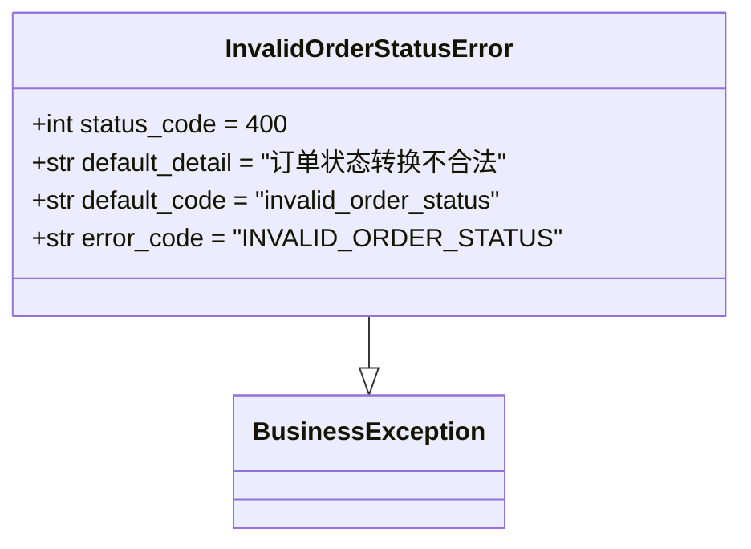

**Diagram sources**
- [exceptions.py](file://backend/common/exceptions.py#L78-L94)

#### 支付相关异常
系统定义了多个支付相关的异常，用于处理各种支付场景下的错误。

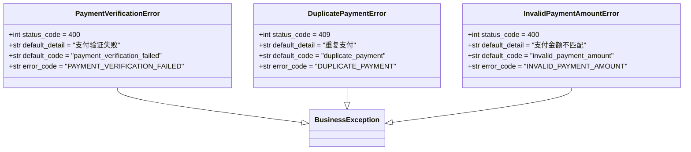

**Diagram sources**
- [exceptions.py](file://backend/common/exceptions.py#L97-L152)

#### 供应商集成异常
当与供应商API交互出现问题时，系统会抛出相应的异常。

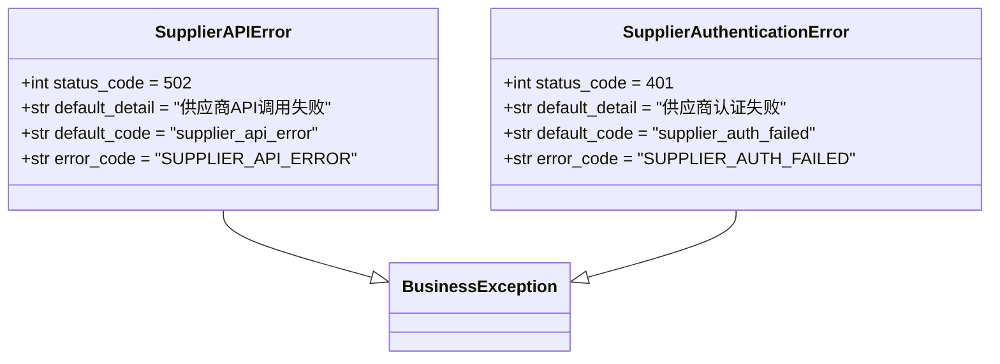

**Diagram sources**
- [exceptions.py](file://backend/common/exceptions.py#L154-L191)

## 统一异常处理器
`custom_exception_handler`是系统的统一异常处理器，负责格式化所有异常响应，确保API返回一致的错误格式。

### 处理流程
统一异常处理器的处理流程如下：

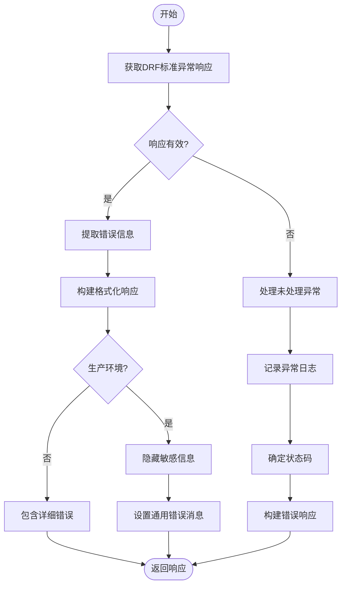

**Diagram sources**
- [exceptions.py](file://backend/common/exceptions.py#L251-L313)

### 错误信息提取
`_extract_error_info`函数负责从异常数据中提取关键信息，包括错误消息、详细错误和错误代码。

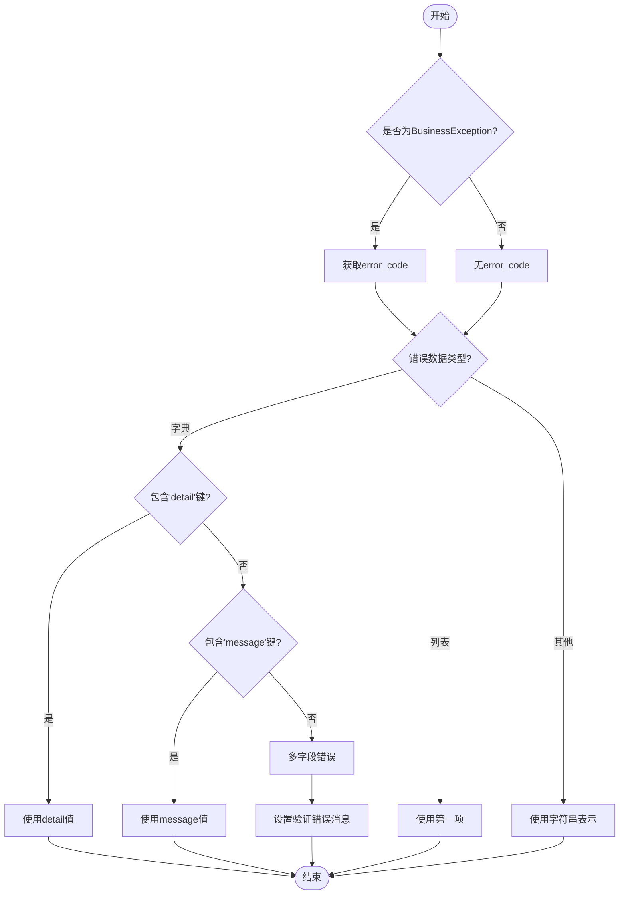

**Diagram sources**
- [exceptions.py](file://backend/common/exceptions.py#L316-L350)

**Section sources**
- [exceptions.py](file://backend/common/exceptions.py#L251-L350)

## 未处理异常处理
`_handle_unhandled_exception`函数负责处理DRF未捕获的异常，确保所有异常都能被妥善处理并返回安全的错误响应。

### 处理逻辑
未处理异常处理器的逻辑如下：

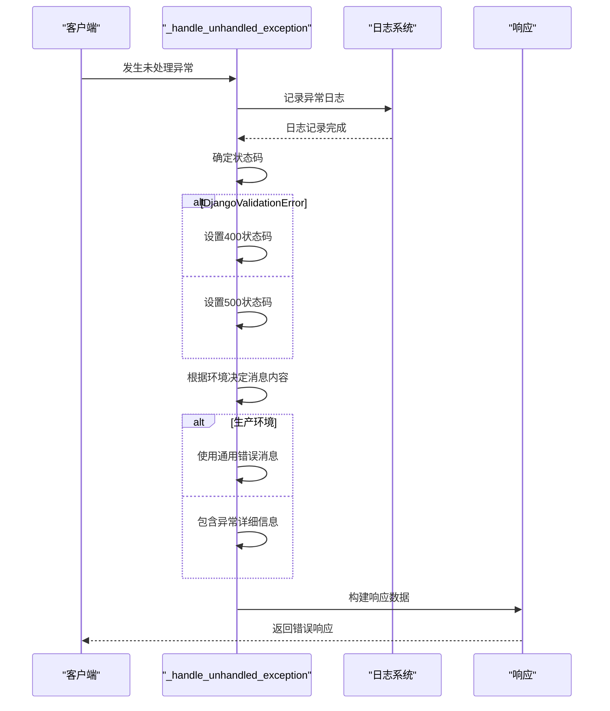

**Diagram sources**
- [exceptions.py](file://backend/common/exceptions.py#L353-L396)

### 环境感知错误响应
系统根据运行环境决定是否暴露详细的错误信息，保护生产环境的安全性。

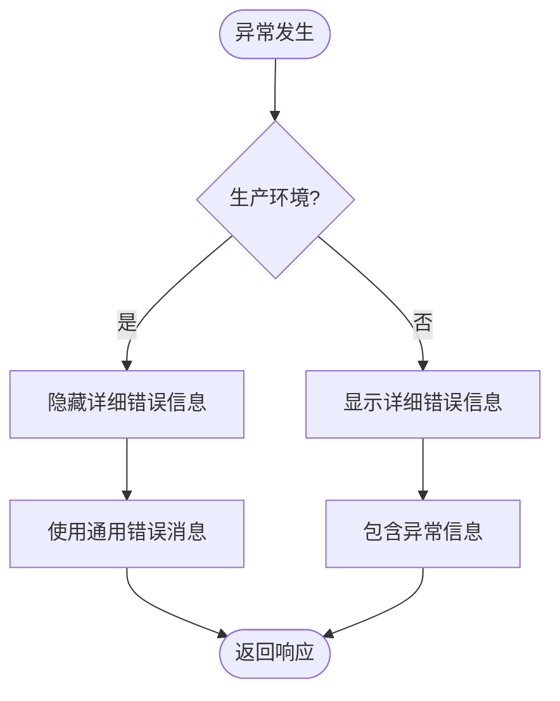

**Diagram sources**
- [exceptions.py](file://backend/common/exceptions.py#L384-L388)

**Section sources**
- [exceptions.py](file://backend/common/exceptions.py#L353-L396)

## 异常日志中间件
`ExceptionLoggingMiddleware`是Django中间件，用于捕获视图层未处理的异常，记录日志并返回500错误响应，确保服务器不会因未捕获异常而崩溃。

### 中间件工作流程
异常日志中间件的工作流程如下：

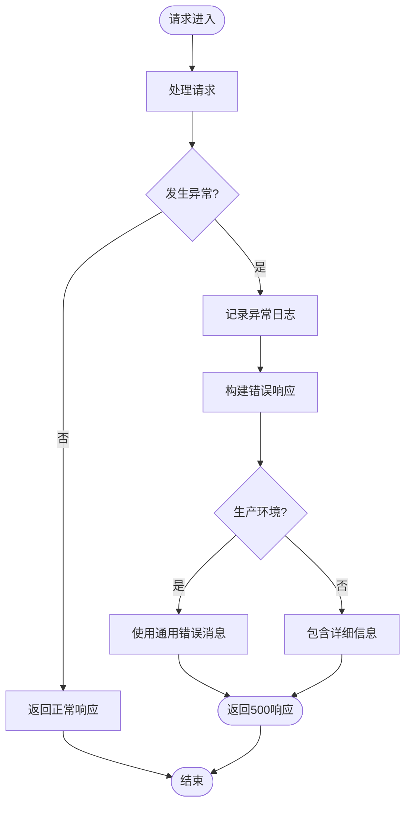

**Diagram sources**
- [exceptions.py](file://backend/common/exceptions.py#L442-L504)

### 配置与集成
异常日志中间件需要在Django设置中正确配置才能生效。

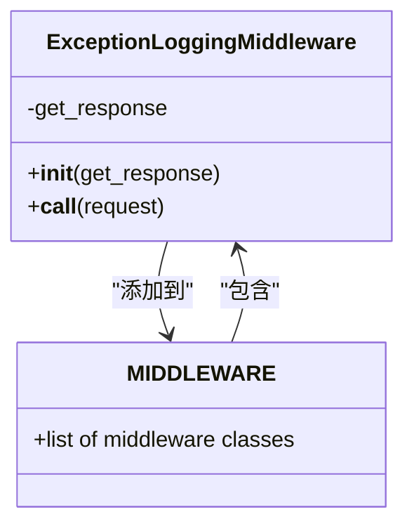

**Diagram sources**
- [base.py](file://backend/backend/settings/base.py#L162-L172)
- [exceptions.py](file://backend/common/exceptions.py#L442-L453)

**Section sources**
- [exceptions.py](file://backend/common/exceptions.py#L442-L504)
- [base.py](file://backend/backend/settings/base.py#L162-L172)

## 错误响应格式
系统返回的错误响应具有统一的格式，便于前端处理和用户理解。

### 响应结构
错误响应的基本结构如下：

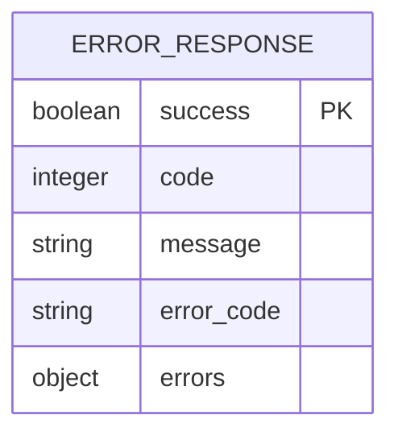

### 示例响应
不同类型的错误返回相应的响应格式。

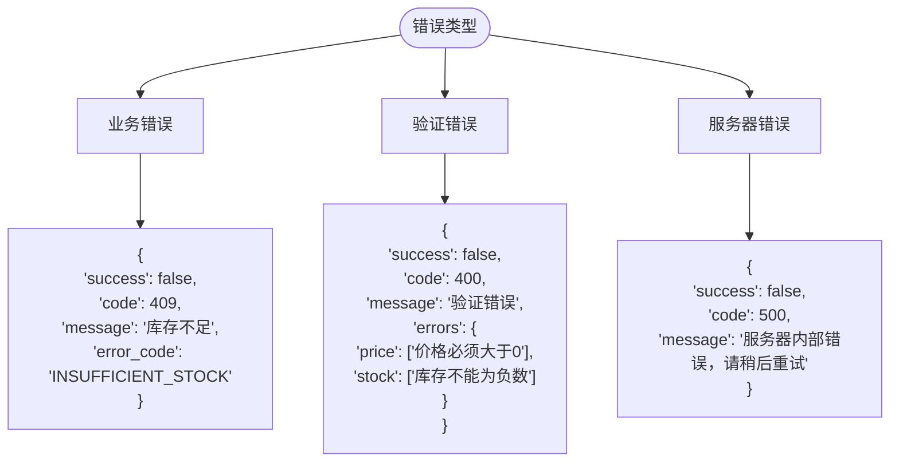

**Diagram sources**
- [api.md](file://api.md#L736-L787)

**Section sources**
- [api.md](file://api.md#L736-L808)

## 最佳实践
系统在异常处理方面遵循了多项最佳实践，确保了代码的健壮性和可维护性。

### 异常使用指南
使用自定义异常的最佳实践包括：

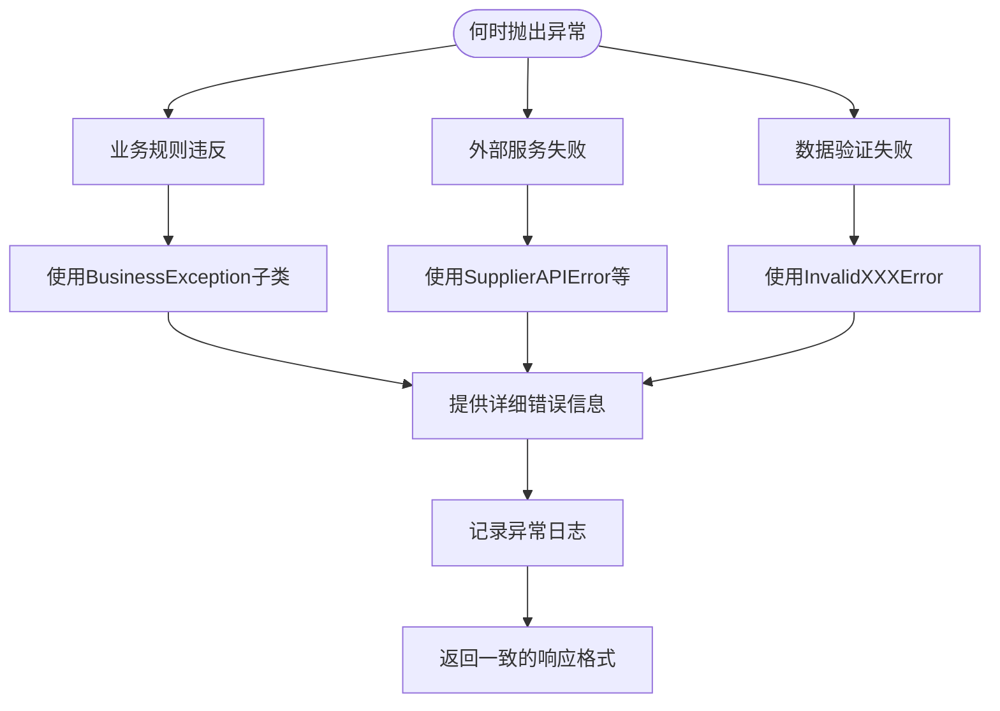

### 环境感知处理
系统根据运行环境调整错误处理策略：

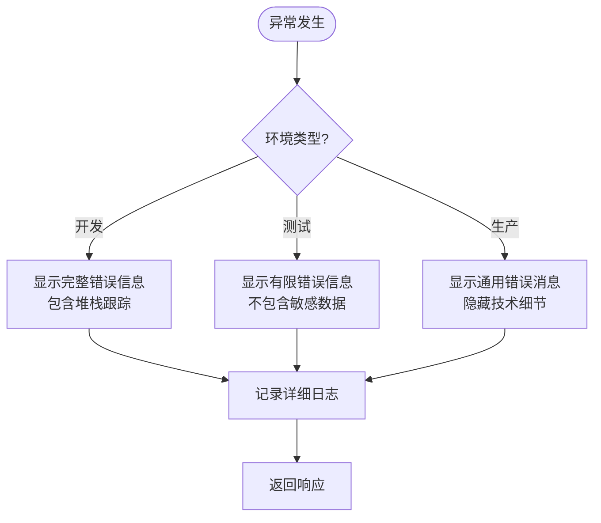

**Section sources**
- [exceptions.py](file://backend/common/exceptions.py#L251-L313)
- [api.md](file://api.md#L791-L805)