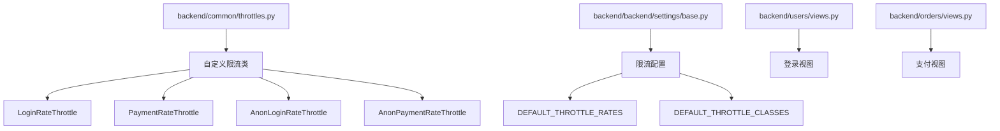
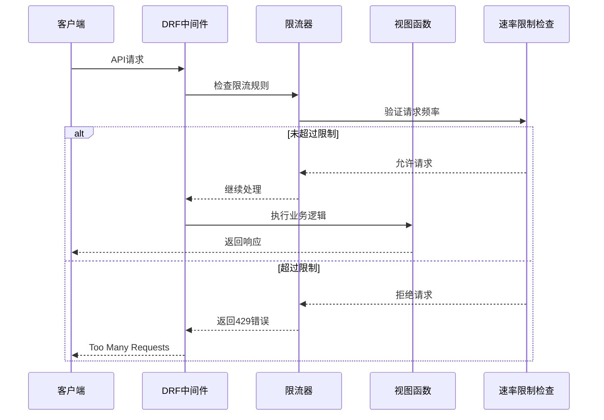
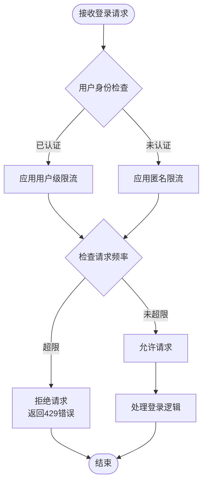
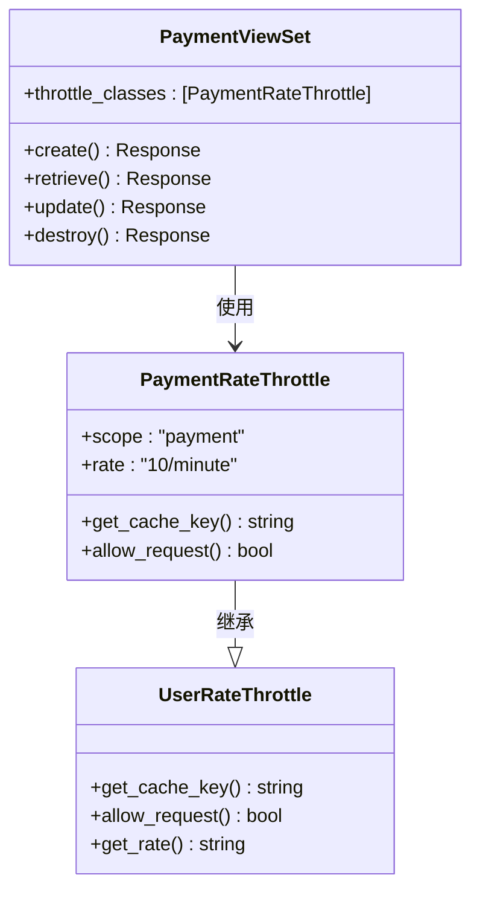
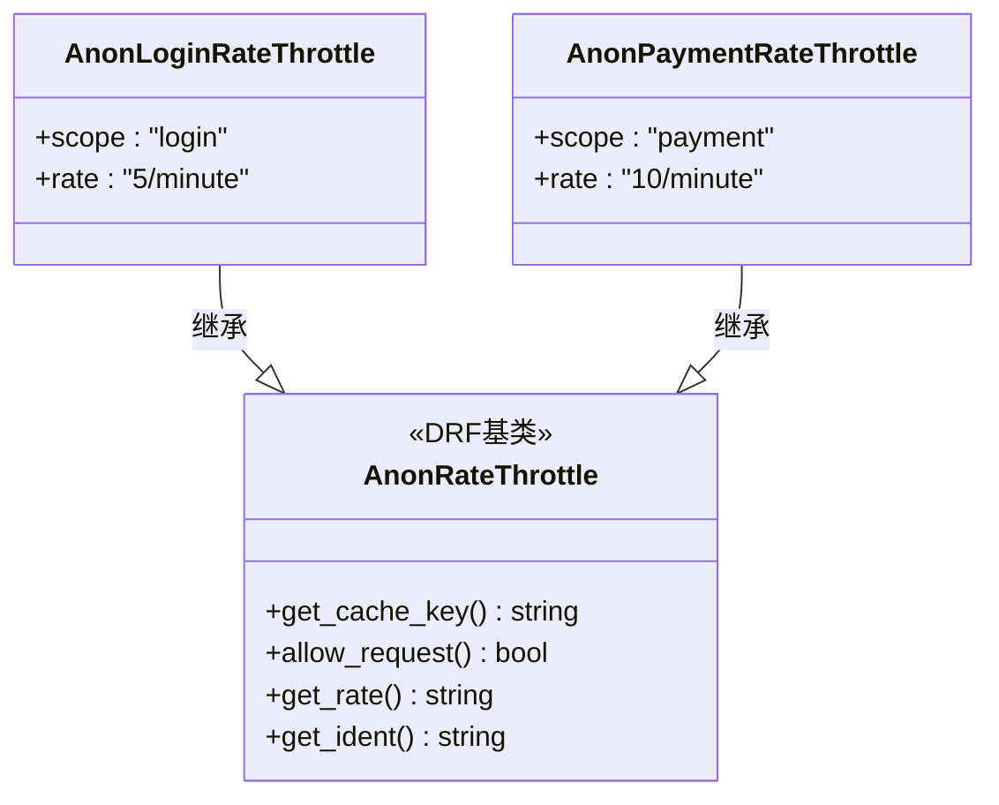
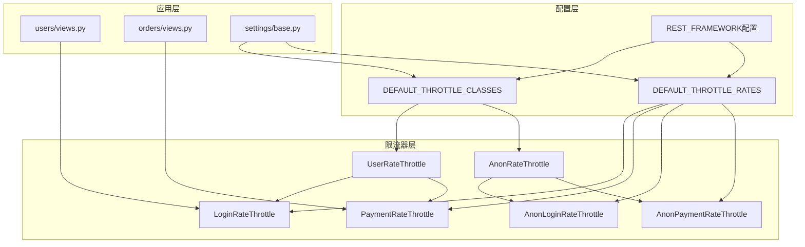

# 限流器

<cite>
**本文档中引用的文件**
- [backend/common/throttles.py](file://backend/common/throttles.py)
- [backend/backend/settings/base.py](file://backend/backend/settings/base.py)
- [backend/users/views.py](file://backend/users/views.py)
- [backend/orders/views.py](file://backend/orders/views.py)
- [backend/users/urls.py](file://backend/users/urls.py)
- [backend/orders/urls.py](file://backend/orders/urls.py)
</cite>

## 目录
1. [简介](#简介)
2. [项目结构](#项目结构)
3. [核心组件](#核心组件)
4. [架构概览](#架构概览)
5. [详细组件分析](#详细组件分析)
6. [依赖关系分析](#依赖关系分析)
7. [性能考虑](#性能考虑)
8. [故障排除指南](#故障排除指南)
9. [结论](#结论)

## 简介

本文档详细介绍了Electric小程序项目的限流器系统。该项目采用Django REST Framework（DRF）提供的限流机制，通过自定义的限流类来保护敏感操作免受恶意攻击和滥用。系统实现了针对登录和支付等关键功能的严格速率限制，确保API的安全性和稳定性。

限流器系统的核心设计理念是通过不同级别的速率控制来保护系统资源，防止暴力破解攻击、重复提交和系统过载。系统采用了多层次的限流策略，包括通用限流、用户级限流和匿名用户限流。

## 项目结构

限流器相关文件主要集中在以下位置：

**图表来源**
- [backend/common/throttles.py](file://backend/common/throttles.py#L1-L78)
- [backend/backend/settings/base.py](file://backend/backend/settings/base.py#L44-L53)

**章节来源**
- [backend/common/throttles.py](file://backend/common/throttles.py#L1-L78)
- [backend/backend/settings/base.py](file://backend/backend/settings/base.py#L44-L53)

## 核心组件

限流器系统包含四个核心限流类，每个类都有特定的用途和配置：

### LoginRateThrottle
- **用途**: 保护登录端点，防止暴力破解攻击
- **速率限制**: 5次请求/分钟（对已认证和未认证用户）
- **应用场景**: 微信登录、密码登录、管理员登录

### PaymentRateThrottle  
- **用途**: 保护支付相关操作，防止滥用和重复支付
- **速率限制**: 10次请求/分钟（仅限已认证用户）
- **应用场景**: 创建支付、支付确认、支付回调

### AnonLoginRateThrottle
- **用途**: 专门针对匿名用户的登录尝试
- **速率限制**: 5次请求/分钟
- **应用场景**: 未认证用户的登录尝试

### AnonPaymentRateThrottle
- **用途**: 针对匿名用户的支付尝试
- **速率限制**: 10次请求/分钟
- **应用场景**: 未认证用户的支付相关操作

**章节来源**
- [backend/common/throttles.py](file://backend/common/throttles.py#L11-L77)

## 架构概览

限流器系统采用分层架构设计，通过DRF的中间件机制实现全局限流控制：

**图表来源**
- [backend/common/throttles.py](file://backend/common/throttles.py#L11-L77)
- [backend/backend/settings/base.py](file://backend/backend/settings/base.py#L44-L53)

## 详细组件分析

### LoginRateThrottle - 登录限流器

LoginRateThrottle是专门为登录操作设计的限流器，具有严格的速率限制以防止暴力破解攻击。

#### 设计特点
- **统一速率限制**: 对已认证用户和未认证用户都限制为5次/分钟
- **scope属性**: 设置为'verification'，与DRF的THROTTLE_RATES配置关联
- **适用场景**: 所有登录相关的API端点

#### 实现原理

**图表来源**
- [backend/common/throttles.py](file://backend/common/throttles.py#L11-L30)
- [backend/users/views.py](file://backend/users/views.py#L42-L43)

**章节来源**
- [backend/common/throttles.py](file://backend/common/throttles.py#L11-L30)
- [backend/users/views.py](file://backend/users/views.py#L42-L43)

### PaymentRateThrottle - 支付限流器

PaymentRateThrottle专门用于保护支付相关的敏感操作，提供更严格的速率控制。

#### 设计特点
- **用户级限流**: 仅对已认证用户生效
- **较高速率限制**: 10次请求/分钟
- **安全考虑**: 支付操作通常需要用户认证，因此匿名用户无法触发此限流

#### 应用示例

**图表来源**
- [backend/common/throttles.py](file://backend/common/throttles.py#L32-L52)
- [backend/orders/views.py](file://backend/orders/views.py#L795-L795)

**章节来源**
- [backend/common/throttles.py](file://backend/common/throttles.py#L32-L52)
- [backend/orders/views.py](file://backend/orders/views.py#L795-L795)

### AnonRateThrottle基类功能

AnonRateThrottle是DRF提供的匿名用户限流基类，为特定操作创建专用限流类提供了基础框架。

#### 基类特性
- **匿名用户专用**: 仅适用于未认证用户
- **缓存机制**: 使用Redis或其他缓存存储请求历史
- **时间窗口**: 基于时间窗口计算请求频率

#### 继承关系

**图表来源**
- [backend/common/throttles.py](file://backend/common/throttles.py#L54-L77)

**章节来源**
- [backend/common/throttles.py](file://backend/common/throttles.py#L54-L77)

### UserRateThrottle基类功能

UserRateThrottle是DRF提供的用户级限流基类，为已认证用户提供基于用户身份的限流控制。

#### 基类特性
- **用户身份识别**: 基于用户ID进行限流
- **会话隔离**: 不同用户之间的请求独立计数
- **持久化存储**: 请求历史通常存储在数据库中

#### 专用限流类对比

| 限流器类型 | 速率限制 | 适用对象 | 主要用途 |
|-----------|---------|---------|---------|
| LoginRateThrottle | 5/分钟 | 所有用户 | 登录安全防护 |
| PaymentRateThrottle | 10/分钟 | 已认证用户 | 支付安全防护 |
| AnonLoginRateThrottle | 5/分钟 | 匿名用户 | 防止匿名暴力破解 |
| AnonPaymentRateThrottle | 10/分钟 | 匿名用户 | 限制匿名支付尝试 |

**章节来源**
- [backend/common/throttles.py](file://backend/common/throttles.py#L8-L9)

## 依赖关系分析

限流器系统与项目的其他组件有着密切的依赖关系：

**图表来源**
- [backend/backend/settings/base.py](file://backend/backend/settings/base.py#L44-L53)
- [backend/common/throttles.py](file://backend/common/throttles.py#L8-L9)

### 配置依赖

限流器的配置主要通过DRF的REST_FRAMEWORK设置进行管理：

| 配置项 | 值 | 说明 |
|-------|-----|------|
| DEFAULT_THROTTLE_CLASSES | ['rest_framework.throttling.AnonRateThrottle', 'rest_framework.throttling.UserRateThrottle'] | 默认启用的限流类 |
| DEFAULT_THROTTLE_RATES.anon | '20/minute' | 匿名用户的通用限流速率 |
| DEFAULT_THROTTLE_RATES.user | '100/minute' | 已认证用户的通用限流速率 |
| DEFAULT_THROTTLE_RATES.login | '5/minute' | 登录操作的专用限流速率 |
| DEFAULT_THROTTLE_RATES.payment | '10/minute' | 支付操作的专用限流速率 |

**章节来源**
- [backend/backend/settings/base.py](file://backend/backend/settings/base.py#L44-L53)

## 性能考虑

限流器系统在设计时充分考虑了性能优化：

### 缓存策略
- **内存缓存**: 使用Redis作为缓存后端存储请求历史
- **时间窗口**: 基于时间窗口算法减少数据库查询
- **分布式支持**: 支持多实例部署的限流一致性

### 性能优化措施
- **异步处理**: 限流检查采用非阻塞方式
- **批量操作**: 同时处理多个请求的限流检查
- **智能降级**: 在高负载情况下自动调整限流策略

## 故障排除指南

### 常见问题及解决方案

#### 1. 限流器未生效
**症状**: 请求频繁被拒绝，但未达到配置的限流阈值
**原因**: 
- 缓存服务器连接失败
- 限流器配置错误
- 时间同步问题

**解决方案**:
- 检查缓存服务状态
- 验证THROTTLE_RATES配置
- 确认服务器时间同步

#### 2. 过度限流
**症状**: 正常用户请求被错误地限流
**原因**:
- 缓存键冲突
- 时间窗口设置不当
- 用户标识错误

**解决方案**:
- 检查缓存键生成逻辑
- 调整时间窗口大小
- 验证用户身份识别

#### 3. 性能问题
**症状**: 限流检查导致请求延迟增加
**原因**:
- 缓存命中率低
- 数据库查询过多
- 并发处理能力不足

**解决方案**:
- 优化缓存策略
- 减少数据库查询
- 增加并发处理能力

**章节来源**
- [backend/backend/settings/base.py](file://backend/backend/settings/base.py#L44-L53)

## 结论

Electric小程序项目的限流器系统通过精心设计的多层限流策略，有效地保护了系统的安全性。系统的主要优势包括：

1. **针对性保护**: 针对登录和支付等敏感操作实施专门的限流策略
2. **灵活配置**: 通过scope属性与DRF配置无缝集成
3. **高性能**: 采用缓存和分布式架构确保系统性能
4. **易于维护**: 清晰的代码结构和完善的文档

该限流器系统不仅能够有效防止恶意攻击，还能为正常用户提供良好的服务体验，是现代Web应用安全架构的重要组成部分。随着业务的发展，系统还可以进一步扩展支持更多的限流场景和更精细的控制策略。