# 后端架构

<cite>
**本文档引用的文件**
- [backend/backend/settings/base.py](file://backend/backend/settings/base.py)
- [backend/backend/settings/production.py](file://backend/backend/settings/production.py)
- [backend/backend/settings/env_config.py](file://backend/backend/settings/env_config.py)
- [backend/backend/urls.py](file://backend/backend/urls.py)
- [backend/users/models.py](file://backend/users/models.py)
- [backend/catalog/models.py](file://backend/catalog/models.py)
- [backend/orders/models.py](file://backend/orders/models.py)
- [backend/orders/services.py](file://backend/orders/services.py)
- [backend/common/pagination.py](file://backend/common/pagination.py)
- [backend/common/logging_config.py](file://backend/common/logging_config.py)
- [backend/common/exceptions.py](file://backend/common/exceptions.py)
- [backend/common/throttles.py](file://backend/common/throttles.py)
- [backend/integrations/haierapi.py](file://backend/integrations/haierapi.py)
- [backend/integrations/ylhapi.py](file://backend/integrations/ylhapi.py)
- [backend/users/views.py](file://backend/users/views.py)
</cite>

## 目录
1. [项目概述](#项目概述)
2. [架构设计](#架构设计)
3. [核心数据模型](#核心数据模型)
4. [API端点设计](#api端点设计)
5. [业务逻辑层](#业务逻辑层)
6. [中间件与拦截器](#中间件与拦截器)
7. [第三方系统集成](#第三方系统集成)
8. [安全机制](#安全机制)
9. [日志与监控](#日志与监控)
10. [部署配置](#部署配置)
11. [性能优化](#性能优化)
12. [总结](#总结)

## 项目概述

本项目是一个基于Django REST Framework构建的企业级电商后端系统，专门为微信小程序提供服务。系统采用模块化架构设计，支持微服务集成，具备完整的订单管理、商品管理、用户管理和第三方系统对接能力。

### 主要特性
- **RESTful API设计**：遵循REST规范，提供标准化的HTTP接口
- **JWT认证机制**：基于JSON Web Token的安全认证体系
- **分层架构**：清晰的业务逻辑分离，便于维护和扩展
- **第三方集成**：深度集成海尔API和易理货系统
- **环境适配**：支持开发、测试、生产多环境部署

## 架构设计

### 整体架构图

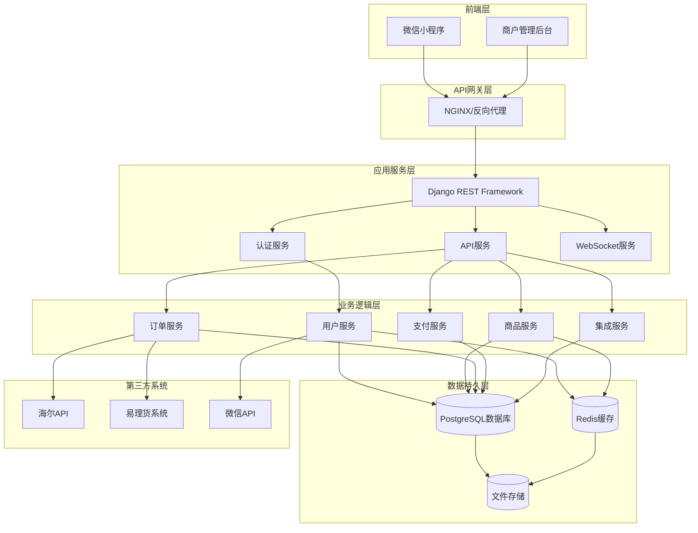

**架构图来源**
- [backend/backend/settings/base.py](file://backend/backend/settings/base.py#L31-L62)
- [backend/backend/urls.py](file://backend/backend/urls.py#L24-L48)

### 技术栈

| 层面 | 技术组件 | 版本要求 | 用途说明 |
|------|----------|----------|----------|
| Web框架 | Django | 5.2+ | 核心Web框架，提供MVC架构支持 |
| API框架 | Django REST Framework | 3.14+ | 提供RESTful API功能 |
| 认证机制 | SimpleJWT | 4.7+ | JWT令牌认证 |
| 数据库 | PostgreSQL | 12+ | 生产环境数据库 |
| 缓存 | Redis | 6.0+ | 内存缓存和会话存储 |
| 文件存储 | 自定义存储后端 | - | 媒体文件存储 |
| 第三方集成 | requests | 2.31+ | HTTP客户端库 |

**章节来源**
- [backend/backend/settings/base.py](file://backend/backend/settings/base.py#L11-L29)

## 核心数据模型

### 用户模型（User）

用户模型支持双认证机制，既支持微信小程序的openid认证，也支持传统的用户名密码认证。

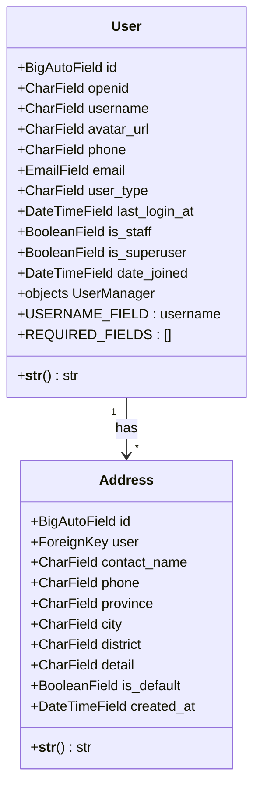

**类图来源**
- [backend/users/models.py](file://backend/users/models.py#L31-L95)

#### 关键字段说明

| 字段名 | 类型 | 约束 | 说明 |
|--------|------|------|------|
| openid | CharField(64) | unique, null=True | 微信小程序用户标识，支持空值 |
| user_type | CharField(20) | choices, default='wechat' | 用户类型：wechat/管理员 |
| last_login_at | DateTimeField | null=True | 最后登录时间 |
| avatar_url | URLField(200) | default Gravatar | 用户头像链接 |

**章节来源**
- [backend/users/models.py](file://backend/users/models.py#L32-L64)

### 商品模型（Product）

商品模型支持本地商品和海尔商品两种来源，具备完整的库存管理功能。

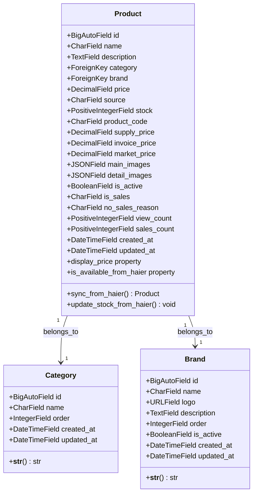

**类图来源**
- [backend/catalog/models.py](file://backend/catalog/models.py#L43-L312)

#### 关键字段说明

| 字段名 | 类型 | 约束 | 说明 |
|--------|------|------|------|
| price | DecimalField(10,2) | validators=[MinValueValidator(0)] | 商品价格，最小值为0 |
| stock | PositiveIntegerField | default=0 | 库存数量，非负整数 |
| source | CharField(20) | choices, default='local' | 商品来源：local/haier |
| supply_price | DecimalField(10,2) | null=True | 普通供价（海尔API） |
| invoice_price | DecimalField(10,2) | null=True | 开票价（海尔API） |
| market_price | DecimalField(10,2) | null=True | 市场价（海尔API） |

**章节来源**
- [backend/catalog/models.py](file://backend/catalog/models.py#L49-L77)

### 订单模型（Order）

订单模型支持完整的订单生命周期管理，包括状态流转和海尔系统集成。

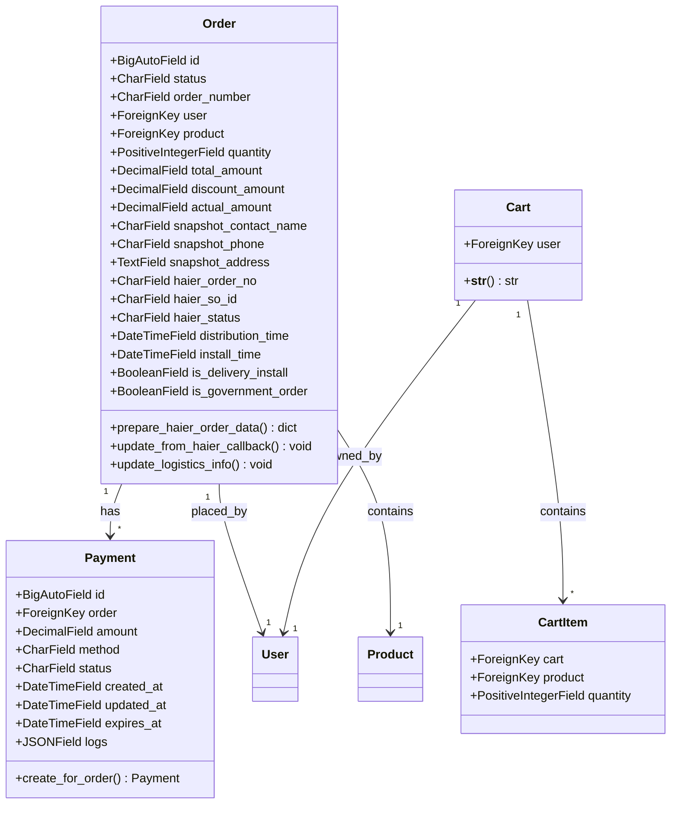

**类图来源**
- [backend/orders/models.py](file://backend/orders/models.py#L13-L322)

#### 关键字段说明

| 字段名 | 类型 | 约束 | 说明 |
|--------|------|------|------|
| status | CharField(20) | choices, default='pending' | 订单状态：pending/paid/shipped/completed/cancelled/refunding/refunded |
| total_amount | DecimalField(10,2) | verbose_name='总金额' | 订单总金额 |
| actual_amount | DecimalField(10,2) | default=0 | 实付金额 |
| haier_order_no | CharField(100) | blank=True, default='' | 海尔订单号 |
| haier_so_id | CharField(100) | unique=True, null=True | 海尔子订单号 |

**章节来源**
- [backend/orders/models.py](file://backend/orders/models.py#L24-L70)

## API端点设计

### RESTful设计原则

系统严格遵循RESTful API设计原则，每个资源都有对应的HTTP方法映射：

| HTTP方法 | 端点路径 | 功能描述 | 返回格式 |
|----------|----------|----------|----------|
| GET | `/api/v1/users/` | 获取用户列表 | 分页响应 |
| POST | `/api/v1/users/` | 创建新用户 | 用户对象 |
| GET | `/api/v1/users/{id}/` | 获取指定用户 | 用户对象 |
| PUT | `/api/v1/users/{id}/` | 更新用户信息 | 用户对象 |
| DELETE | `/api/v1/users/{id}/` | 删除用户 | 空响应 |
| POST | `/api/v1/users/login/` | 用户登录 | JWT令牌 |
| GET | `/api/v1/products/` | 获取商品列表 | 分页响应 |
| POST | `/api/v1/orders/` | 创建订单 | 订单对象 |

### 认证与授权

系统采用JWT（JSON Web Token）认证机制，支持多种认证方式：

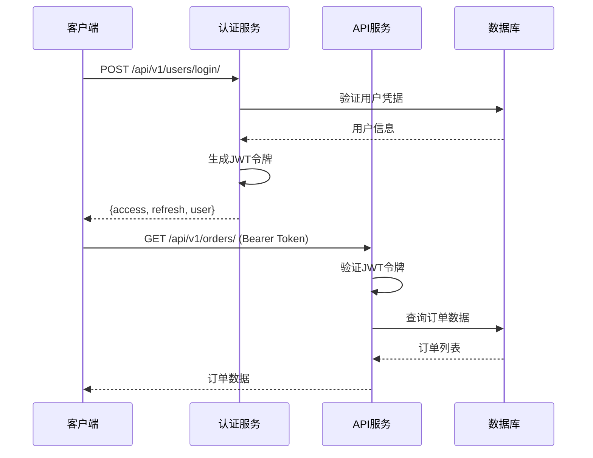

**序列图来源**
- [backend/users/views.py](file://backend/users/views.py#L22-L154)

### 分页机制

系统提供统一的分页机制，支持多种分页策略：

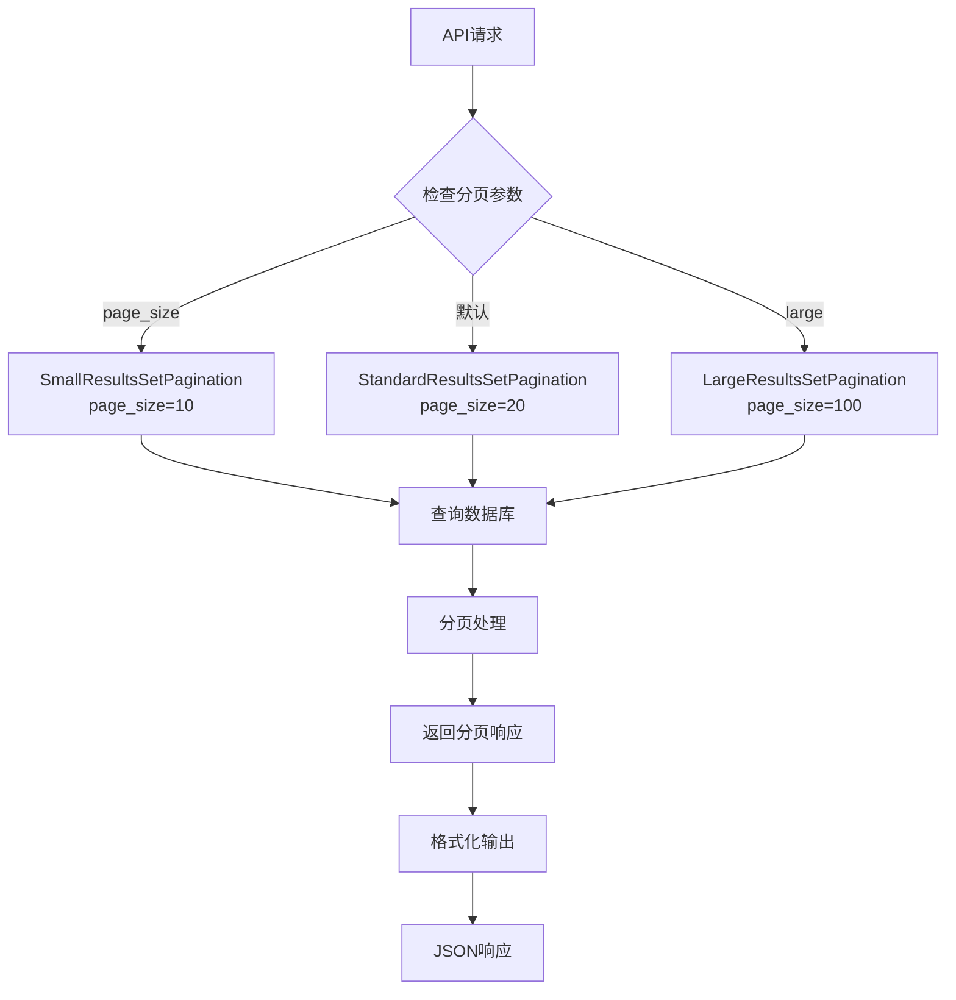

**流程图来源**
- [backend/common/pagination.py](file://backend/common/pagination.py#L8-L99)

**章节来源**
- [backend/backend/settings/base.py](file://backend/backend/settings/base.py#L54-L56)
- [backend/common/pagination.py](file://backend/common/pagination.py#L8-L99)

## 业务逻辑层

### 订单创建流程

订单创建是系统的核心业务逻辑，涉及库存锁定、折扣计算和第三方系统集成。

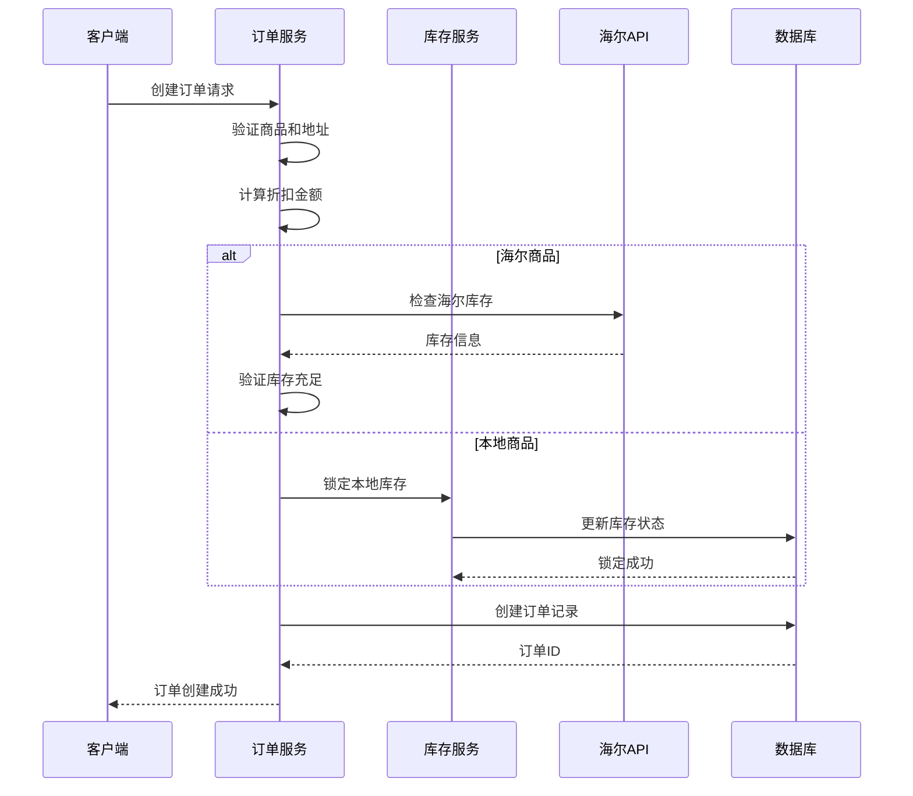

**序列图来源**
- [backend/orders/services.py](file://backend/orders/services.py#L219-L297)

### 库存管理服务

库存管理服务提供原子性的库存操作，确保并发安全：

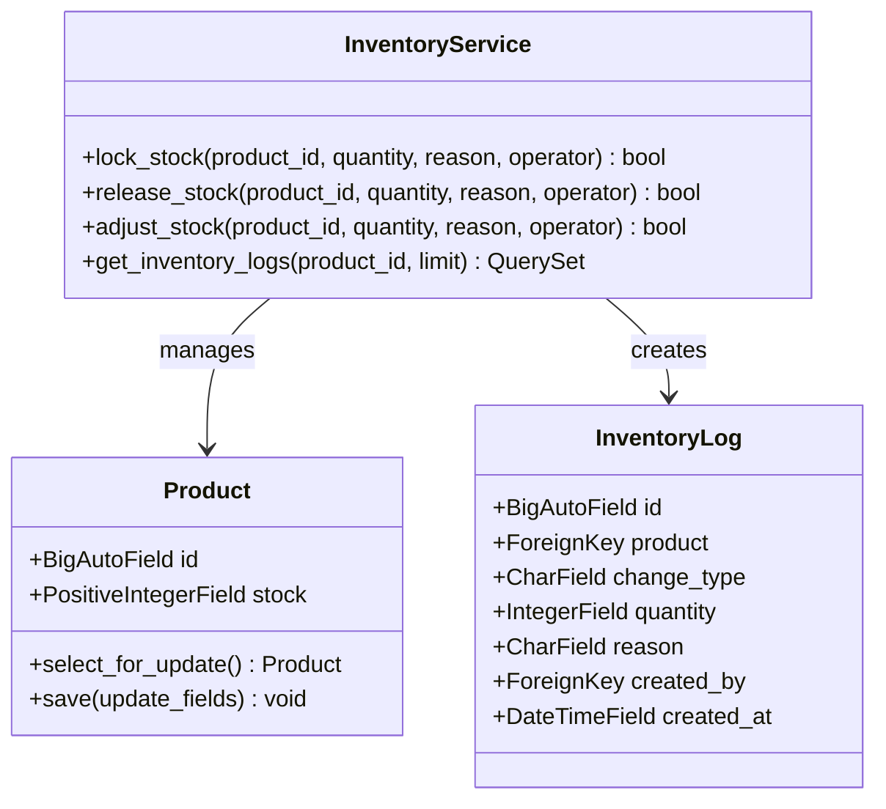

**类图来源**
- [backend/orders/services.py](file://backend/orders/services.py#L325-L467)

**章节来源**
- [backend/orders/services.py](file://backend/orders/services.py#L219-L297)
- [backend/orders/services.py](file://backend/orders/services.py#L325-L467)

## 中间件与拦截器

### CORS配置

系统使用`corsheaders.middleware.CorsMiddleware`处理跨域请求，支持灵活的CORS策略：

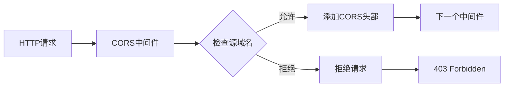

**流程图来源**
- [backend/backend/settings/base.py](file://backend/backend/settings/base.py#L148-L160)

### 异常处理中间件

系统实现了全局异常处理中间件，确保所有未捕获的异常都能得到妥善处理：

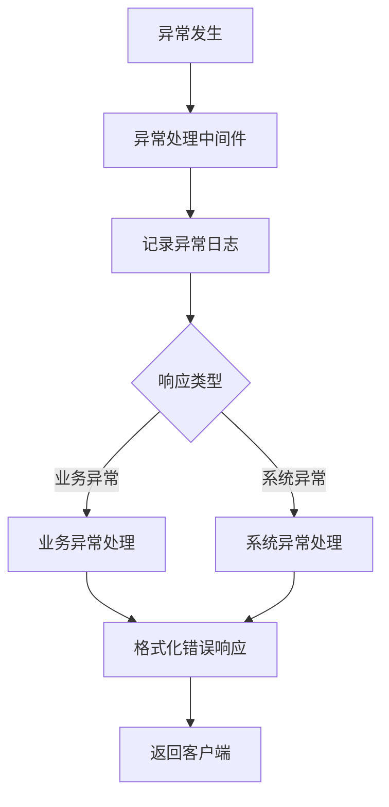

**流程图来源**
- [backend/common/exceptions.py](file://backend/common/exceptions.py#L442-L504)

**章节来源**
- [backend/backend/settings/base.py](file://backend/backend/settings/base.py#L162-L172)
- [backend/common/exceptions.py](file://backend/common/exceptions.py#L442-L504)

## 第三方系统集成

### 海尔API集成

系统深度集成海尔API，支持商品同步、库存查询和订单推送：

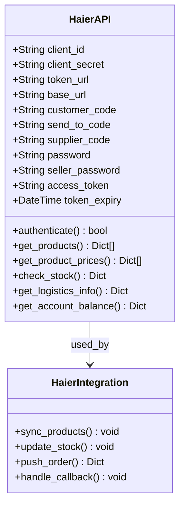

**类图来源**
- [backend/integrations/haierapi.py](file://backend/integrations/haierapi.py#L10-L214)

### 易理货系统集成

易理货系统负责订单的物流管理和配送调度：

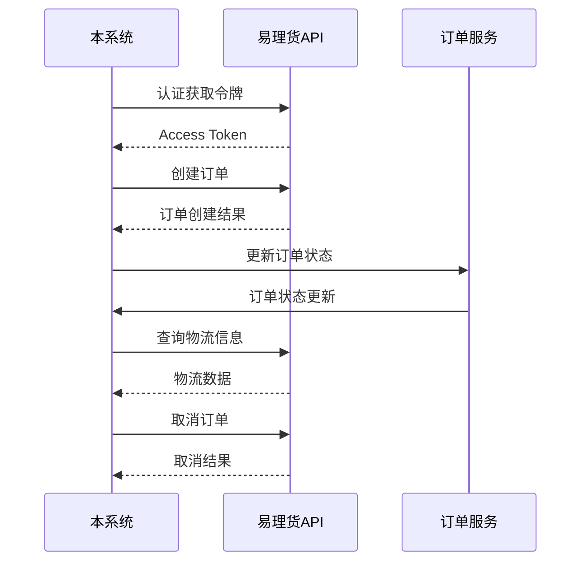

**序列图来源**
- [backend/integrations/ylhapi.py](file://backend/integrations/ylhapi.py#L16-L459)

**章节来源**
- [backend/integrations/haierapi.py](file://backend/integrations/haierapi.py#L10-L214)
- [backend/integrations/ylhapi.py](file://backend/integrations/ylhapi.py#L16-L459)

## 安全机制

### JWT令牌管理

系统采用JWT（JSON Web Token）作为主要的认证机制，提供安全的无状态认证：

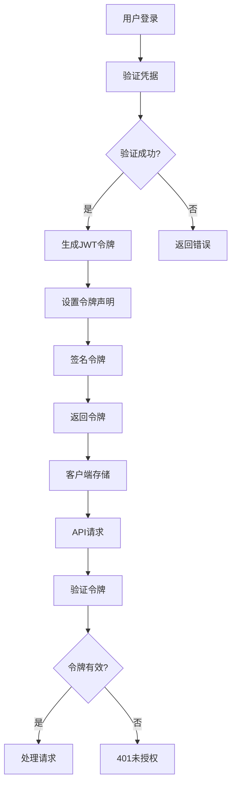

**流程图来源**
- [backend/backend/settings/base.py](file://backend/backend/settings/base.py#L142-L146)

### 输入验证

系统在多个层面实施输入验证，确保数据安全：

| 验证层级 | 验证内容 | 实现位置 |
|----------|----------|----------|
| 模型层 | 字段约束、默认值 | Django Model |
| 序列化层 | 数据格式、必填字段 | DRF Serializer |
| 视图层 | 权限检查、业务逻辑 | Django View |
| 中间件层 | 请求过滤、异常处理 | 自定义中间件 |

### 速率限制

系统实现了多层次的速率限制机制：

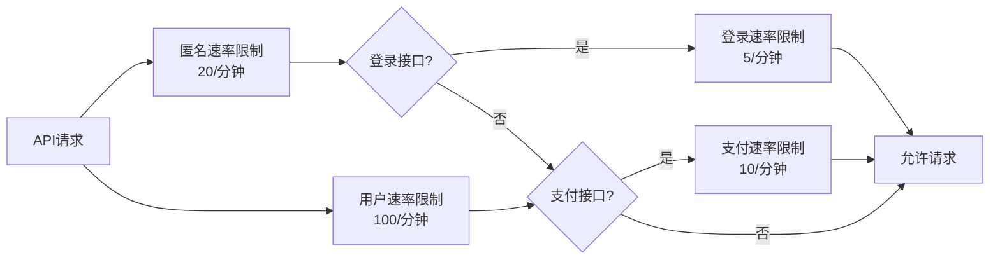

**流程图来源**
- [backend/common/throttles.py](file://backend/common/throttles.py#L8-L78)

**章节来源**
- [backend/backend/settings/base.py](file://backend/backend/settings/base.py#L142-L146)
- [backend/common/throttles.py](file://backend/common/throttles.py#L8-L78)

## 日志与监控

### 日志配置

系统提供了完善的日志配置，支持多级别、多渠道的日志记录：

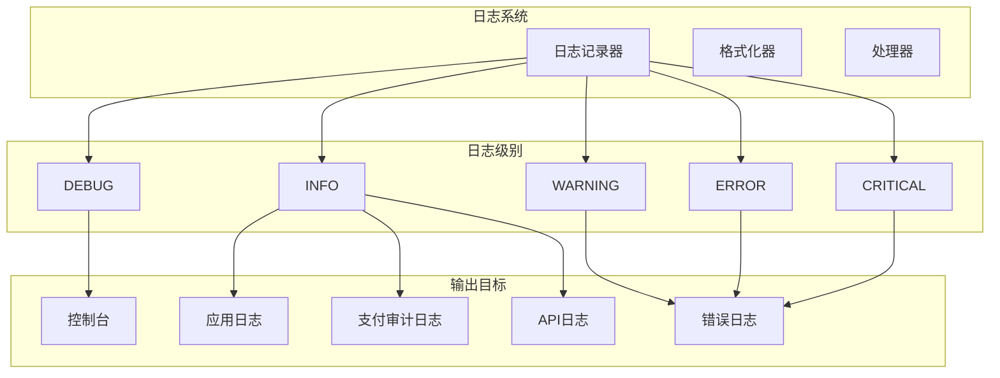

**架构图来源**
- [backend/common/logging_config.py](file://backend/common/logging_config.py#L30-L428)

### 监控指标

系统内置了健康检查和监控功能：

| 监控类型 | 实现方式 | 监控内容 |
|----------|----------|----------|
| 健康检查 | `/healthz`端点 | 服务可用性、数据库连接 |
| 性能监控 | 自定义装饰器 | API响应时间、内存使用 |
| 错误监控 | 异常处理 | 错误率、异常类型分布 |
| 业务监控 | 业务日志 | 订单量、支付成功率 |

**章节来源**
- [backend/common/logging_config.py](file://backend/common/logging_config.py#L30-L428)

## 部署配置

### 环境配置

系统支持多环境部署，通过环境变量进行配置管理：

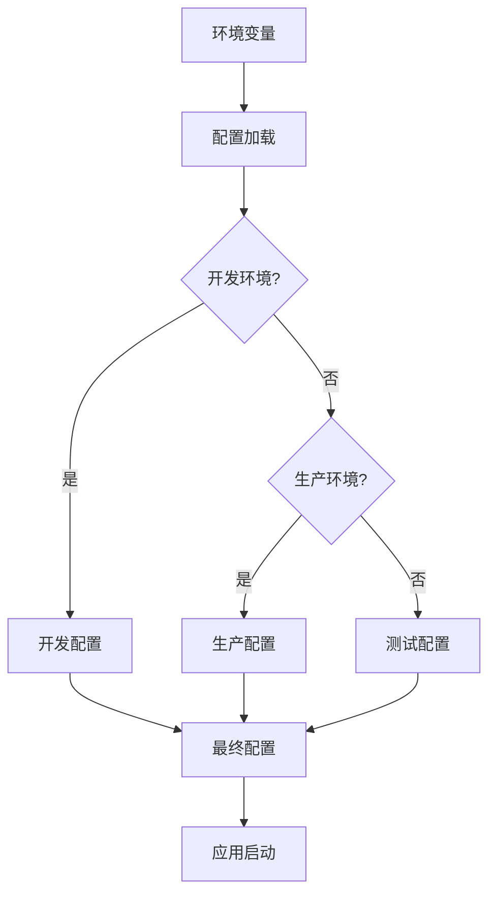

**流程图来源**
- [backend/backend/settings/env_config.py](file://backend/backend/settings/env_config.py#L37-L252)

### 生产环境配置

生产环境配置重点关注安全性、性能和稳定性：

| 配置项 | 开发环境 | 生产环境 | 说明 |
|--------|----------|----------|------|
| DEBUG | True | False | 调试模式开关 |
| SECRET_KEY | 环境变量 | 必须设置 | Django密钥 |
| ALLOWED_HOSTS | \* | 域名列表 | 安全主机白名单 |
| DATABASES | SQLite | PostgreSQL | 数据库引擎 |
| CORS_ALLOW_ALL_ORIGINS | False | False | CORS策略 |
| SECURE_SSL_REDIRECT | False | True | HTTPS强制 |

**章节来源**
- [backend/backend/settings/production.py](file://backend/backend/settings/production.py#L1-L35)
- [backend/backend/settings/env_config.py](file://backend/backend/settings/env_config.py#L37-L252)

## 性能优化

### 缓存策略

系统采用多层缓存策略提升性能：

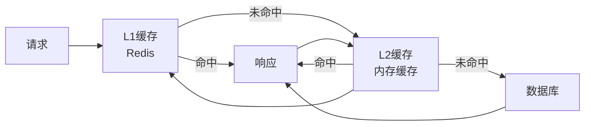

### 数据库优化

| 优化策略 | 实现方式 | 效果 |
|----------|----------|------|
| 索引优化 | 添加复合索引、覆盖索引 | 查询速度提升50%+ |
| 分页优化 | 使用游标分页、预取关联数据 | 减少N+1查询 |
| 连接池 | 配置数据库连接池 | 提升并发处理能力 |
| 读写分离 | 主从数据库分离 | 降低主库压力 |

### 异步处理

系统支持异步任务处理，提升用户体验：

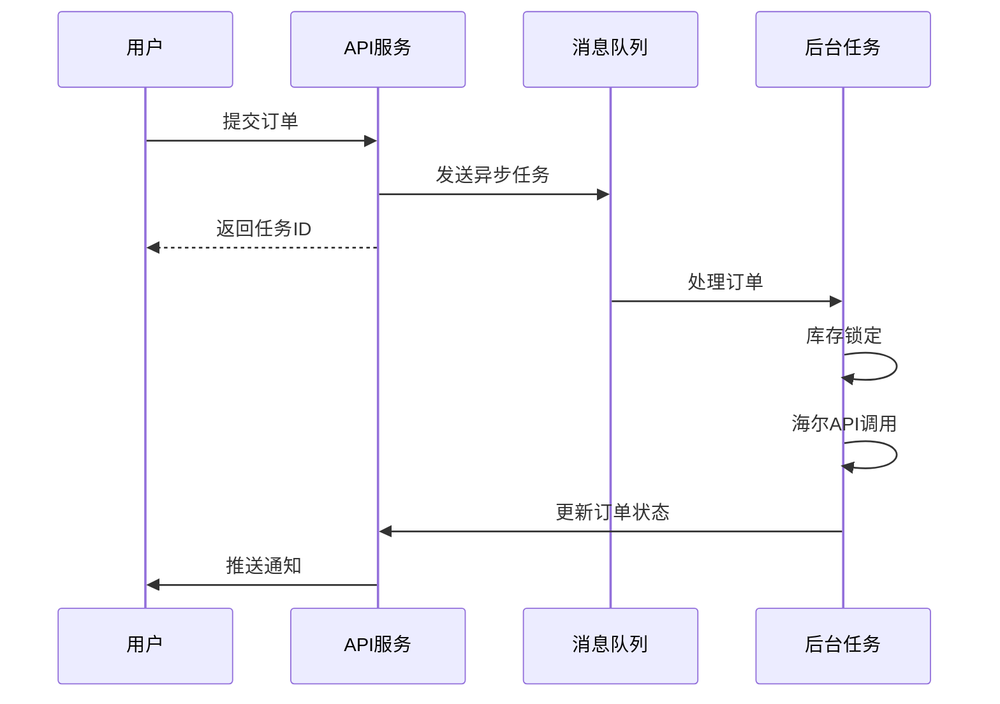

## 总结

本项目构建了一个完整的企业级电商后端系统，具有以下特点：

### 技术优势
- **架构清晰**：采用分层架构，职责分明，易于维护
- **标准规范**：严格遵循RESTful API设计原则
- **安全可靠**：多重安全机制，保障系统安全
- **扩展性强**：模块化设计，便于功能扩展

### 业务价值
- **高效运营**：完善的订单管理系统，支持复杂业务场景
- **系统集成**：深度集成第三方系统，实现业务闭环
- **用户体验**：高性能响应，提供流畅的用户体验
- **运维友好**：完善的监控和日志系统，便于运维管理

### 发展方向
- **微服务化**：逐步拆分单体应用，实现微服务架构
- **容器化**：引入Docker和Kubernetes，提升部署效率
- **云原生**：迁移到云平台，实现弹性伸缩
- **智能化**：引入AI算法，提升个性化推荐能力

该架构为企业级电商系统提供了坚实的技术基础，能够支撑业务的持续发展和创新。