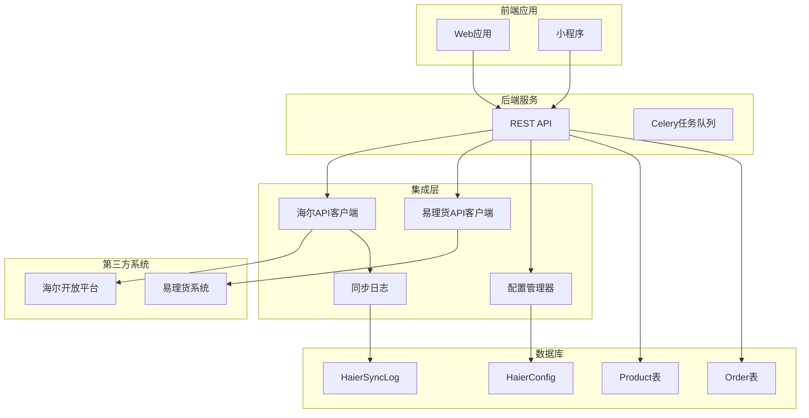
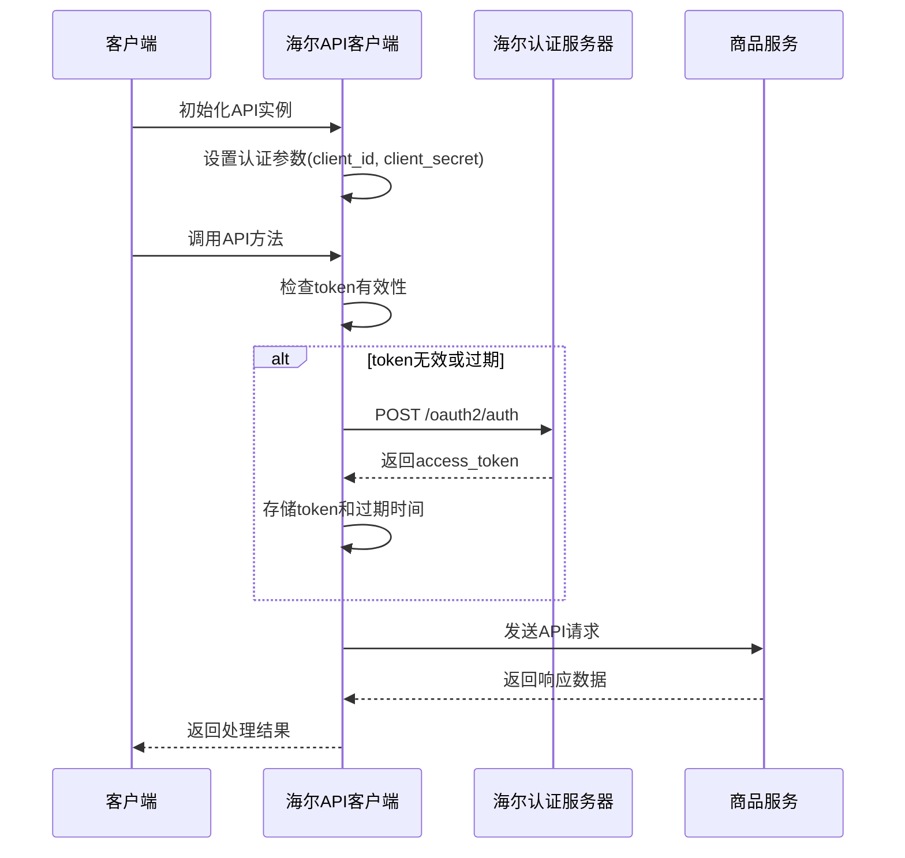
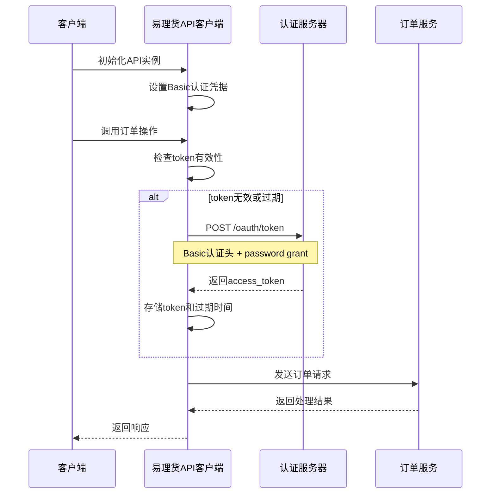
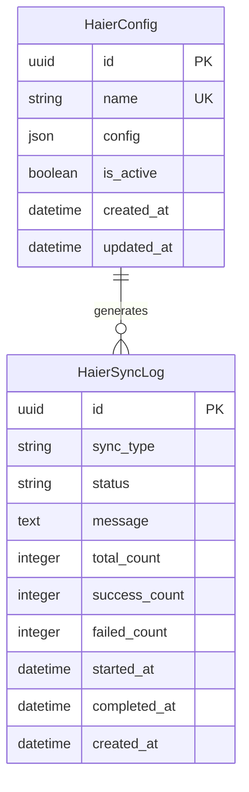
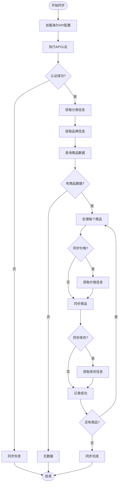
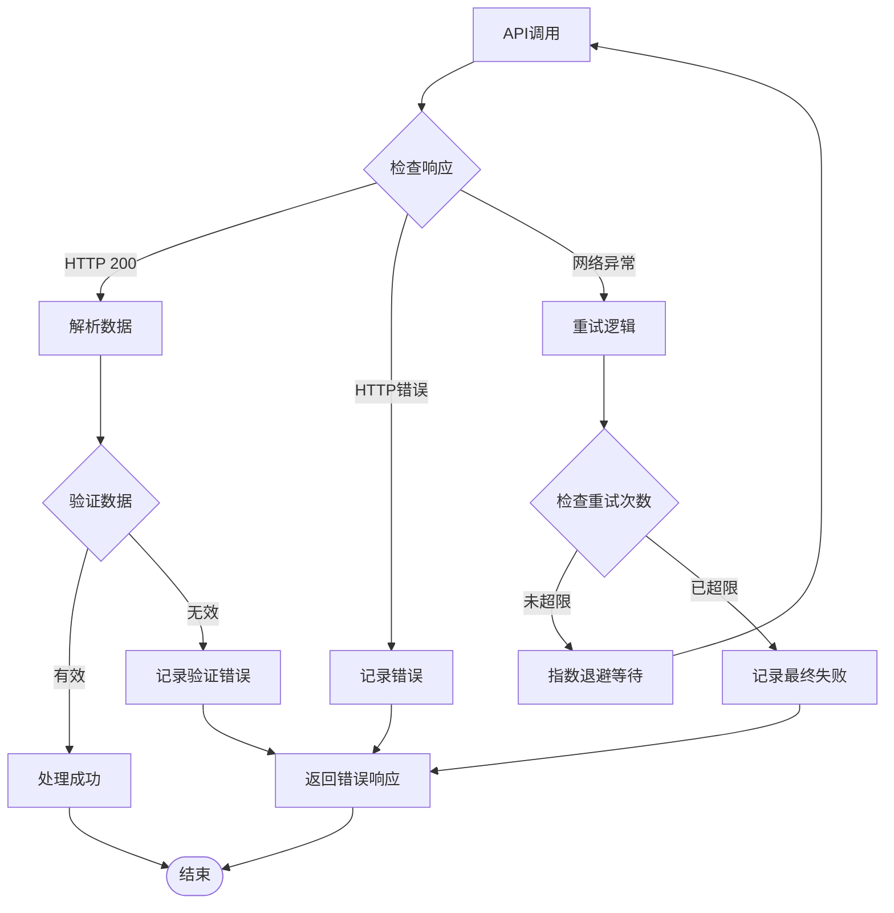
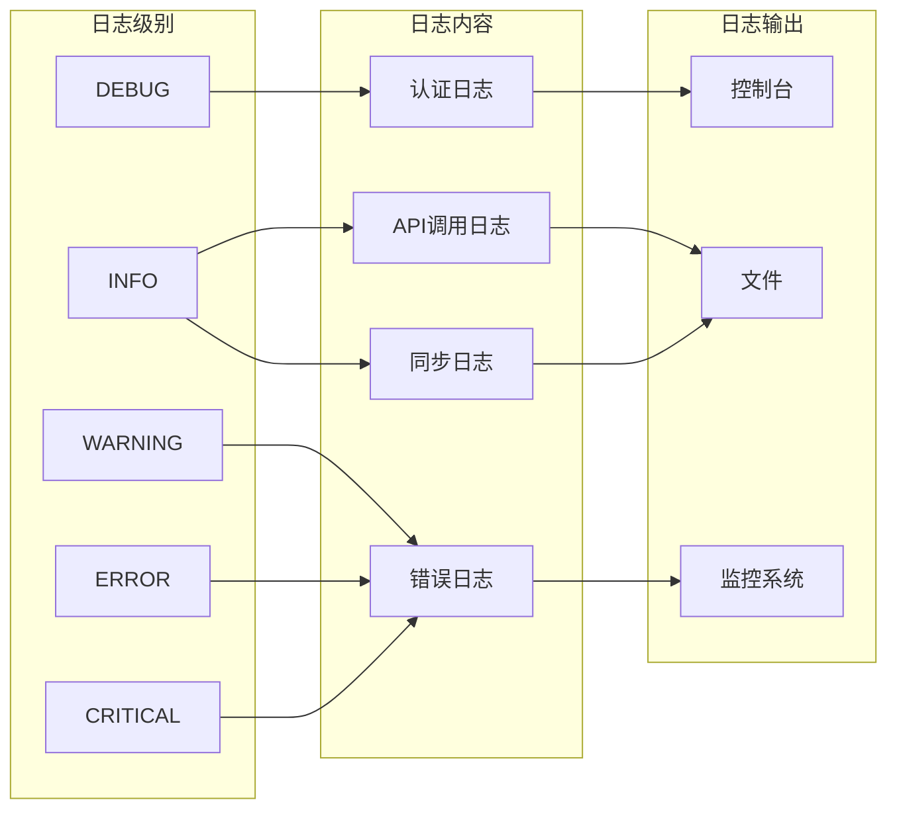

# 外部集成

<cite>
**本文档中引用的文件**
- [haierapi.py](file://backend/integrations/haierapi.py)
- [ylhapi.py](file://backend/integrations/ylhapi.py)
- [models.py](file://backend/integrations/models.py)
- [sync_haier_products.py](file://backend/catalog/management/commands/sync_haier_products.py)
- [views.py](file://backend/integrations/views.py)
- [admin.py](file://backend/integrations/admin.py)
- [serializers.py](file://backend/integrations/serializers.py)
- [0002_haierconfig_haiersynclog_delete_supplierconfig_and_more.py](file://backend/integrations/migrations/0002_haierconfig_haiersynclog_delete_supplierconfig_and_more.py)
</cite>

## 目录
1. [概述](#概述)
2. [系统架构](#系统架构)
3. [海尔API集成](#海尔api集成)
4. [易理货系统集成](#易理货系统集成)
5. [配置管理](#配置管理)
6. [同步机制](#同步机制)
7. [错误处理与重试](#错误处理与重试)
8. [监控与日志](#监控与日志)
9. [最佳实践](#最佳实践)
10. [故障排除](#故障排除)

## 概述

该系统实现了与第三方系统的深度集成，主要包括两个核心外部系统：

1. **海尔API系统**：负责商品数据同步、库存查询、价格信息获取和物流跟踪
2. **易理货系统(YLH)**：处理订单生命周期管理，包括订单创建、取消、改约和物流信息查询

集成层采用模块化设计，提供了统一的接口管理和错误处理机制，确保系统的稳定性和可维护性。

## 系统架构

**图表来源**
- [haierapi.py](file://backend/integrations/haierapi.py#L10-L214)
- [ylhapi.py](file://backend/integrations/ylhapi.py#L16-L459)
- [models.py](file://backend/integrations/models.py#L4-L150)

## 海尔API集成

### 认证流程

海尔API采用OAuth 2.0客户端凭据模式进行认证：

**图表来源**
- [haierapi.py](file://backend/integrations/haierapi.py#L41-L64)
- [haierapi.py](file://backend/integrations/haierapi.py#L66-L72)

### 核心功能模块

#### 商品同步
- **功能描述**：从海尔平台获取可采购商品信息
- **API端点**：`/yilihuo/jsh-service-goods-mall-search/api/product-info/procurable-products-out/check-procurable-products`
- **支持参数**：
  - `product_codes`：指定商品编码列表（最多20个）
  - `customerCode`：客户编码
  - `supplierCode`：供应商编码
  - `passWord`：访问密码

#### 价格查询
- **功能描述**：获取商品每日销售价格信息
- **API端点**：`/yilihuo/jsh-service-goods-price/api/goods-price/price-daily-sales/price-query/pt-out-list-price`
- **支持参数**：
  - `productCodes`：商品编码列表
  - `priceType`：价格类型（PT）

#### 库存查询
- **功能描述**：查询指定区域的商品可用库存
- **API端点**：`/yilihuo/jsh-service-stock-mall/api/page/stock/get-available-stock-open`
- **支持参数**：
  - `countyCode`：区域编码
  - `productCode`：商品编码
  - `source`：数据来源（默认JSH-B）

#### 物流查询
- **功能描述**：获取订单物流信息
- **API端点**：`/yilihuo/ylh-cloud-service-stock/api/page/stock/logistics/sass/get-thirdparty-logistics-info-by-order-code-auth`

**章节来源**
- [haierapi.py](file://backend/integrations/haierapi.py#L74-L208)

## 易理货系统集成

### 认证机制

YLH系统采用基于Basic认证的OAuth 2.0密码模式：

**图表来源**
- [ylhapi.py](file://backend/integrations/ylhapi.py#L60-L115)

### 核心业务功能

#### 订单创建
- **功能描述**：接收来自水联网的零售订单
- **支持字段**：
  - `sourceSystem`：订单来源系统
  - `shopName`：店铺名称
  - `consigneeName`：收货人姓名
  - `onlineNo`：平台订单号
  - `itemList`：商品明细列表

#### 订单取消
- **功能描述**：取消指定订单
- **支持参数**：
  - `so_id`：子订单号
  - `cancel_reason`：取消原因
  - `source_system`：订单来源系统

#### 订单改约
- **功能描述**：更新配送和安装时间
- **支持参数**：
  - `retail_order_no`：巨商汇订单号
  - `distribution_time`：配送时间（时间戳）
  - `install_time`：安装时间（时间戳）

#### 物流信息查询
- **功能描述**：获取订单物流单号和SN码信息
- **支持参数**：
  - `order_codes`：订单编码列表（最多100个）

**章节来源**
- [ylhapi.py](file://backend/integrations/ylhapi.py#L174-L407)

## 配置管理

### HaierConfig模型

配置管理系统提供了灵活的第三方系统配置存储和管理功能：

**图表来源**
- [models.py](file://backend/integrations/models.py#L4-L150)

### 配置参数详解

| 参数名称 | 类型 | 必填 | 描述 | 示例值 |
|---------|------|------|------|--------|
| client_id | String | 是 | OAuth客户端ID | your_client_id |
| client_secret | String | 是 | OAuth客户端密钥 | your_client_secret |
| token_url | String | 是 | 认证服务器地址 | https://openplat-test.haier.net/oauth2/auth |
| base_url | String | 是 | API基础URL | https://openplat-test.haier.net |
| customer_code | String | 是 | 客户编码 | 8800633175 |
| send_to_code | String | 是 | 发送到编码 | 8800633175 |
| supplier_code | String | 否 | 供应商编码 | 1001 |
| password | String | 是 | 访问密码 | your_password |
| seller_password | String | 是 | 卖家密码 | your_password |

**章节来源**
- [models.py](file://backend/integrations/models.py#L4-L47)

## 同步机制

### 定时同步命令

系统提供了专门的管理命令来触发海尔商品数据的定时同步：

**图表来源**
- [sync_haier_products.py](file://backend/catalog/management/commands/sync_haier_products.py#L50-L156)

### 同步类型定义

系统支持多种类型的同步操作：

| 同步类型 | 描述 | 触发条件 |
|---------|------|----------|
| products | 商品同步 | 手动触发或定时任务 |
| prices | 价格同步 | 配置启用价格同步时 |
| stock | 库存同步 | 配置启用库存同步时 |
| order | 订单推送 | 订单状态变更时 |
| logistics | 物流查询 | 物流状态更新时 |
| manual | 手动操作 | 管理员手动操作 |

**章节来源**
- [models.py](file://backend/integrations/models.py#L57-L64)

## 错误处理与重试

### 错误处理策略

系统实现了多层次的错误处理机制：

**图表来源**
- [haierapi.py](file://backend/integrations/haierapi.py#L41-L64)
- [ylhapi.py](file://backend/integrations/ylhapi.py#L142-L172)

### 重试机制

#### 指数退避算法
- **初始延迟**：0.5秒
- **退避因子**：2
- **最大重试次数**：1次
- **最大延迟**：30秒

#### 重试场景
1. **网络连接超时**：请求超时自动重试
2. **认证失败**：token过期时重新认证
3. **API限流**：遇到429状态码时等待重试
4. **临时服务不可用**：遇到5xx状态码时重试

**章节来源**
- [ylhapi.py](file://backend/integrations/ylhapi.py#L142-L172)

### 数据一致性保障

#### 原子性操作
- **事务管理**：数据库操作使用事务确保原子性
- **幂等性设计**：API调用支持幂等性，避免重复处理
- **状态校验**：操作前后状态对比验证

#### 冲突解决
- **乐观锁**：使用版本号检测并发冲突
- **回滚机制**：失败时自动回滚已执行的操作
- **补偿事务**：部分成功时执行补偿操作

## 监控与日志

### 日志记录体系

系统建立了完整的日志记录体系：

**图表来源**
- [models.py](file://backend/integrations/models.py#L50-L150)

### 监控指标

#### 关键性能指标(KPI)
- **API响应时间**：平均响应时间、95%分位数
- **成功率**：各API调用的成功率
- **错误率**：各类错误的发生频率
- **吞吐量**：每分钟处理的请求数量

#### 运维监控
- **健康检查**：定期检查API连接状态
- **告警机制**：异常情况自动告警
- **性能监控**：资源使用情况监控
- **容量规划**：基于历史数据预测需求

**章节来源**
- [views.py](file://backend/integrations/views.py#L285-L326)

## 最佳实践

### 配置管理最佳实践

1. **环境隔离**：开发、测试、生产环境使用不同的配置
2. **敏感信息保护**：使用环境变量存储敏感配置
3. **配置验证**：启动时验证配置完整性
4. **配置备份**：定期备份配置数据

### API调用最佳实践

1. **连接池管理**：复用HTTP连接减少开销
2. **超时设置**：合理设置请求超时时间
3. **缓存策略**：对静态数据实施缓存
4. **批量处理**：支持批量API调用提高效率

### 错误处理最佳实践

1. **优雅降级**：部分功能失败时不影响整体服务
2. **重试策略**：智能重试避免系统过载
3. **错误分类**：区分临时错误和永久错误
4. **用户友好**：向用户提供清晰的错误信息

## 故障排除

### 常见问题及解决方案

#### 认证失败
**症状**：API调用返回401未授权
**可能原因**：
- client_id或client_secret错误
- token已过期
- 网络连接问题

**解决方案**：
1. 验证配置参数正确性
2. 检查网络连接
3. 查看认证日志

#### API调用超时
**症状**：请求长时间无响应
**可能原因**：
- 网络延迟过高
- 服务器负载过高
- 请求参数过大

**解决方案**：
1. 增加超时时间
2. 减少请求数据量
3. 检查服务器状态

#### 数据同步失败
**症状**：商品数据未能正确同步
**可能原因**：
- 第三方API返回格式变化
- 数据转换规则错误
- 数据库约束冲突

**解决方案**：
1. 检查API响应格式
2. 验证数据转换逻辑
3. 查看同步日志详情

### 调试工具

#### 日志分析
- **关键词搜索**：使用关键字快速定位问题
- **时间范围过滤**：按时间范围筛选日志
- **错误分类统计**：统计各类错误发生频率

#### 性能分析
- **响应时间监控**：跟踪API响应时间趋势
- **并发性能测试**：测试系统并发处理能力
- **资源使用监控**：监控CPU、内存使用情况

**章节来源**
- [views.py](file://backend/integrations/views.py#L285-L326)