# 易理货系统集成

<cite>
**本文档引用的文件**
- [ylhapi.py](file://backend/integrations/ylhapi.py)
- [models.py](file://backend/integrations/models.py)
- [orders/models.py](file://backend/orders/models.py)
- [orders/state_machine.py](file://backend/orders/state_machine.py)
- [orders/services.py](file://backend/orders/services.py)
- [orders/views.py](file://backend/orders/views.py)
- [base.py](file://backend/backend/settings/base.py)
</cite>

## 目录
1. [简介](#简介)
2. [系统架构概览](#系统架构概览)
3. [YLHSystemAPI类详解](#ylhsystemapi类详解)
4. [认证机制](#认证机制)
5. [核心功能实现](#核心功能实现)
6. [订单生命周期集成](#订单生命周期集成)
7. [错误处理与重试机制](#错误处理与重试机制)
8. [配置管理](#配置管理)
9. [最佳实践](#最佳实践)
10. [故障排除指南](#故障排除指南)

## 简介

易理货系统集成是电小二商城与易理货（YLH）系统之间的关键桥梁，负责处理海尔产品的订单推送、状态同步和物流信息管理。该集成采用现代化的API设计模式，实现了完整的订单生命周期管理，确保海尔产品能够顺利进入易理货系统的供应链体系。

## 系统架构概览

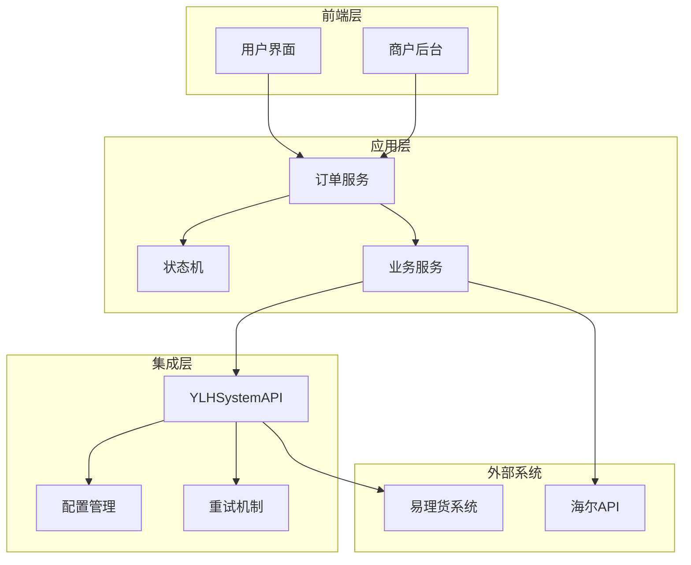

**图表来源**
- [ylhapi.py](file://backend/integrations/ylhapi.py#L16-L459)
- [orders/state_machine.py](file://backend/orders/state_machine.py#L25-L289)

## YLHSystemAPI类详解

YLHSystemAPI类是易理货系统集成的核心组件，提供了完整的API交互能力。

### 类结构设计

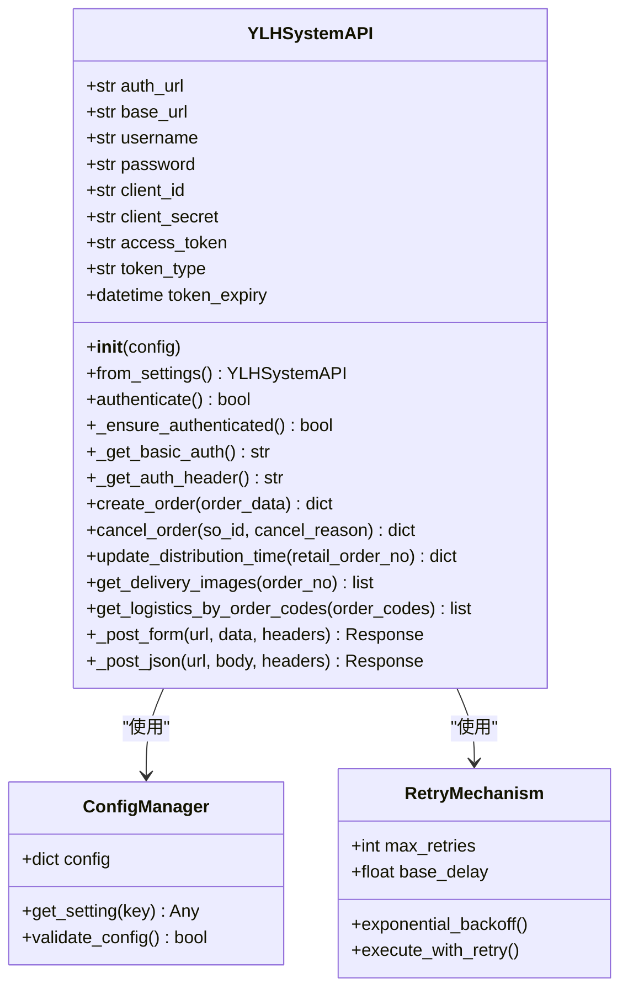

**图表来源**
- [ylhapi.py](file://backend/integrations/ylhapi.py#L16-L459)

### 核心属性说明

| 属性 | 类型 | 描述 | 默认值 |
|------|------|------|--------|
| auth_url | str | 鉴权服务URL | 开发环境默认值 |
| base_url | str | API基础服务URL | 开发环境默认值 |
| username | str | 认证用户名 | 空字符串 |
| password | str | 认证密码 | 空字符串 |
| client_id | str | 客户端ID | open_api_erp |
| client_secret | str | 客户端密钥 | 12345678 |
| access_token | str | 访问令牌 | None |
| token_type | str | 令牌类型 | Bearer |
| token_expiry | datetime | 令牌过期时间 | None |

**节来源**
- [ylhapi.py](file://backend/integrations/ylhapi.py#L23-L46)

## 认证机制

易理货系统采用双重认证机制，确保API调用的安全性和可靠性。

### 双重认证流程

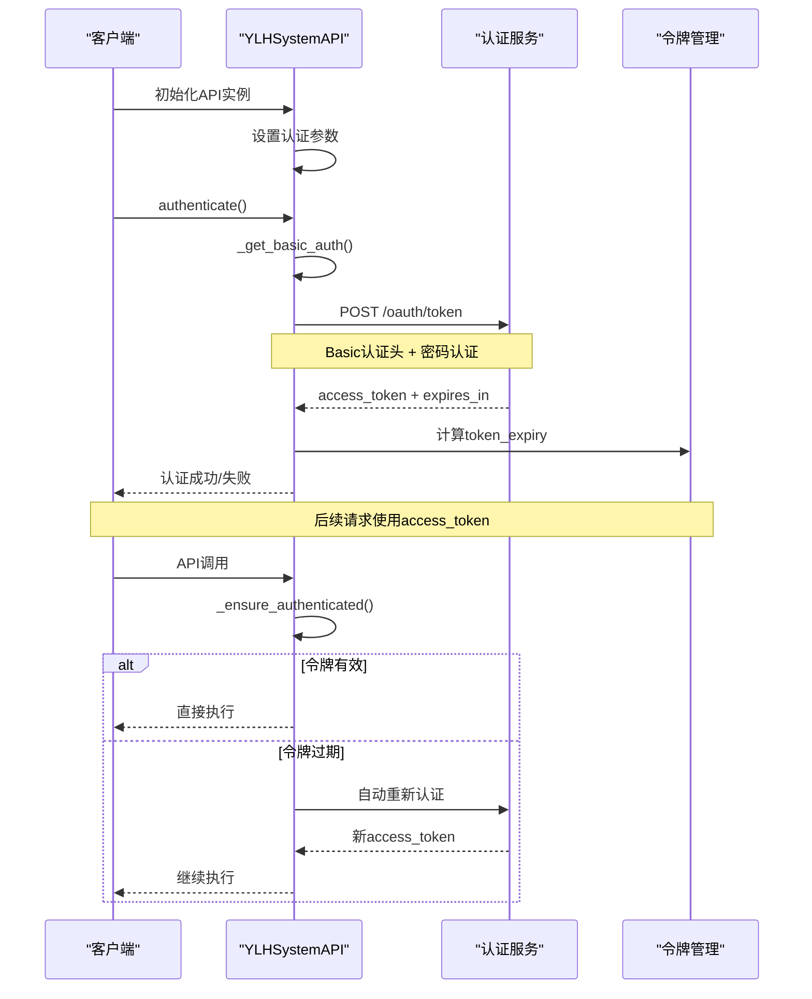

**图表来源**
- [ylhapi.py](file://backend/integrations/ylhapi.py#L71-L131)

### Basic认证头生成

Basic认证头的生成遵循RFC 7617标准，使用Base64编码的客户端凭证：

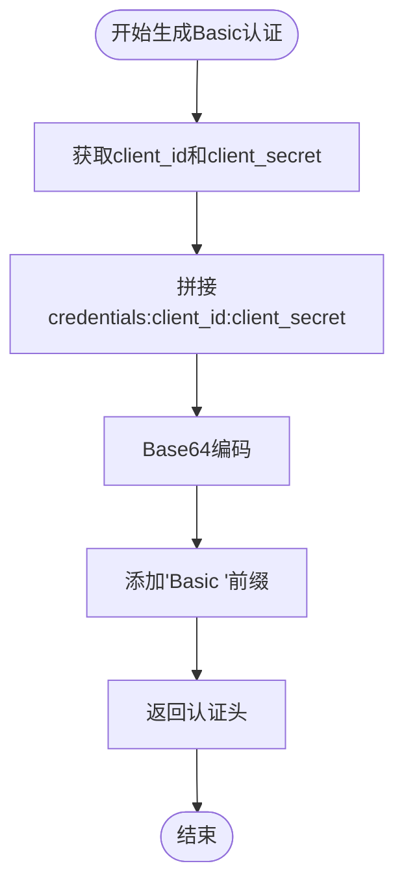

**图表来源**
- [ylhapi.py](file://backend/integrations/ylhapi.py#L60-L70)

### 访问令牌管理

令牌管理系统实现了智能的过期检测和自动刷新机制：

| 功能特性 | 实现细节 | 优势 |
|----------|----------|------|
| 过期时间计算 | 提前10分钟刷新（expires_in - 600秒） | 避免网络延迟导致的认证失败 |
| 自动刷新 | _ensure_authenticated()方法 | 透明的令牌管理 |
| 异常处理 | 详细的错误日志记录 | 便于问题诊断 |
| 重试机制 | 指数退避算法 | 提高系统稳定性 |

**节来源**
- [ylhapi.py](file://backend/integrations/ylhapi.py#L71-L131)

## 核心功能实现

### create_order方法

create_order方法负责将本地订单数据映射为易理货系统所需的订单格式，并执行订单创建操作。

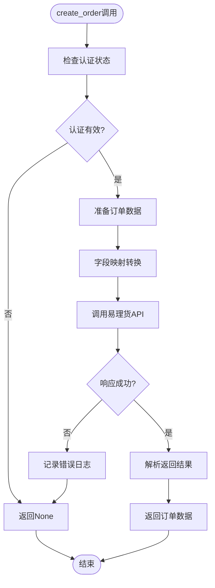

**图表来源**
- [ylhapi.py](file://backend/integrations/ylhapi.py#L174-L231)

#### 订单数据映射

订单数据从本地格式转换为易理货系统格式的关键字段映射：

| 本地字段 | 易理货字段 | 数据类型 | 必填 | 描述 |
|----------|------------|----------|------|------|
| order_number | onlineNo | str | ✓ | 平台订单号 |
| haier_so_id | soId | str | ✓ | 子订单号 |
| snapshot_contact_name | consigneeName | str | ✓ | 收货人姓名 |
| snapshot_phone | consigneeMobile | str | ✓ | 收货人电话 |
| total_amount | totalAmt | float | ✓ | 订单总金额 |
| created_at | createTime | int | ✓ | 创建时间戳 |
| distribution_time | distributionTime | int | ✗ | 配送时间戳 |
| install_time | installTime | int | ✗ | 安装时间戳 |
| itemList | itemList | list | ✓ | 商品明细列表 |

**节来源**
- [ylhapi.py](file://backend/integrations/ylhapi.py#L174-L231)

### cancel_order方法

订单取消功能提供了完整的取消流程管理：

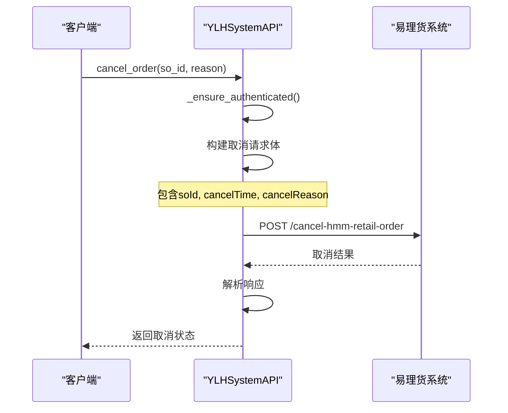

**图表来源**
- [ylhapi.py](file://backend/integrations/ylhapi.py#L232-L279)

### update_distribution_time方法

配送时间改约功能支持灵活的时间调整：

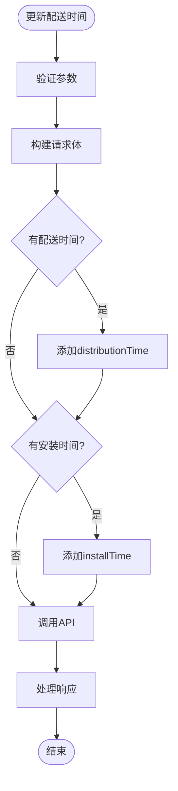

**图表来源**
- [ylhapi.py](file://backend/integrations/ylhapi.py#L280-L329)

### get_delivery_images和get_logistics_by_order_codes方法

这两个方法分别负责获取配送凭证和物流信息：

| 方法 | 功能 | 输入参数 | 返回格式 | 用途 |
|------|------|----------|----------|------|
| get_delivery_images | 获取配送照片 | order_no | List[Dict] | 安装验收凭证 |
| get_logistics_by_order_codes | 查询物流信息 | order_codes | List[Dict] | 物流跟踪 |

**节来源**
- [ylhapi.py](file://backend/integrations/ylhapi.py#L330-L407)

## 订单生命周期集成

易理货系统集成与订单状态机紧密协作，确保订单生命周期的一致性。

### 状态转换流程

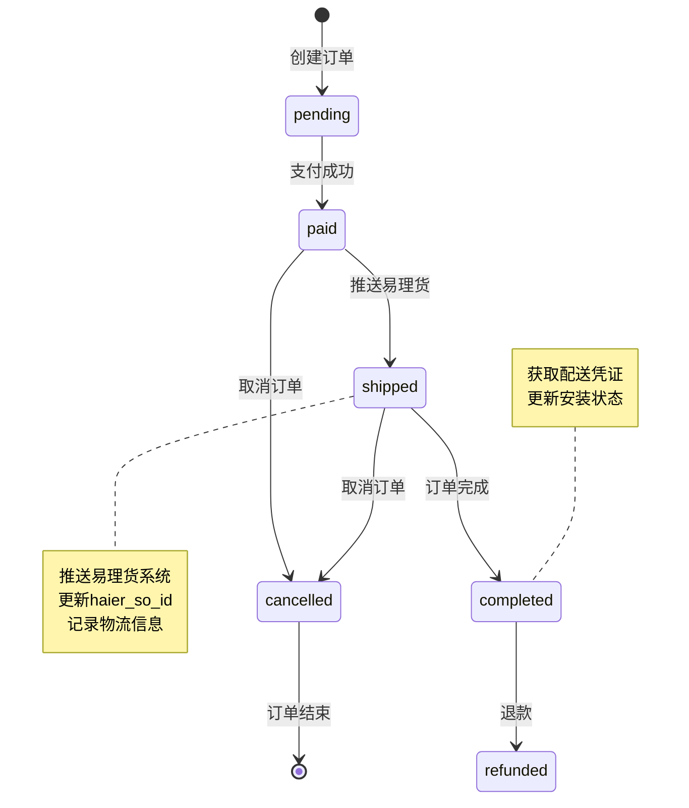

**图表来源**
- [orders/state_machine.py](file://backend/orders/state_machine.py#L25-L57)

### 订单推送触发点

订单推送在特定状态下自动触发：

```mermaid
flowchart TD
OrderCreated[订单创建] --> CheckProduct{"是海尔产品?"}
CheckProduct --> |否| SkipPush[跳过推送]
CheckProduct --> |是| CheckStatus{"状态=paid?"}
CheckStatus --> |否| WaitStatus[等待状态变化]
CheckStatus --> |是| CheckPushed{"已推送?"}
CheckPushed --> |是| SkipPush
CheckPushed --> |否| PushToYLH[推送至易理货]
PushToYLH --> UpdateOrder[更新订单状态]
UpdateOrder --> LogSuccess[记录成功日志]
WaitStatus --> CheckStatus
LogSuccess --> [*]
SkipPush --> [*]
```

**图表来源**
- [orders/views.py](file://backend/orders/views.py#L393-L489)

### 与本地订单状态机的协同

系统通过以下机制确保状态一致性：

| 协同机制 | 实现方式 | 作用 |
|----------|----------|------|
| 状态验证 | 检查订单状态和产品类型 | 确保推送时机正确 |
| 原子操作 | 数据库事务保证 | 避免状态不一致 |
| 日志记录 | 详细的操作日志 | 便于问题追踪 |
| 回滚机制 | 失败时的状态恢复 | 保证系统稳定性 |

**节来源**
- [orders/services.py](file://backend/orders/services.py#L219-L298)

## 错误处理与重试机制

### 指数退避算法

系统采用指数退避算法处理API调用失败：

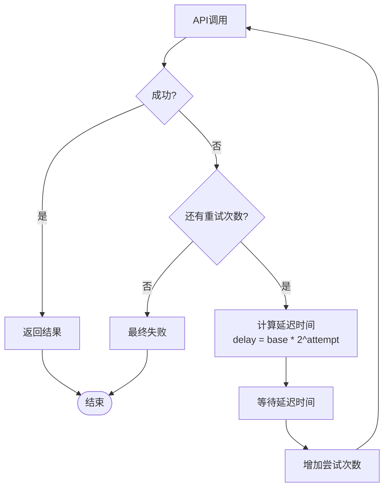

**图表来源**
- [ylhapi.py](file://backend/integrations/ylhapi.py#L142-L172)

### 错误分类与处理策略

| 错误类型 | 处理策略 | 示例场景 |
|----------|----------|----------|
| 网络超时 | 指数退避重试 | 网络不稳定 |
| 认证失败 | 立即重试认证 | 令牌过期 |
| 参数错误 | 记录日志，不重试 | 数据格式错误 |
| 服务器错误 | 指数退避重试 | 易理货系统故障 |
| 业务逻辑错误 | 记录日志，人工介入 | 订单状态冲突 |

### 日志记录机制

系统提供详细的日志记录，包括：

- **认证日志**：令牌获取和刷新过程
- **API调用日志**：请求和响应详情  
- **错误日志**：异常堆栈和上下文信息
- **性能日志**：响应时间和重试次数

**节来源**
- [ylhapi.py](file://backend/integrations/ylhapi.py#L71-L131)

## 配置管理

### 安全存储机制

易理货系统凭证通过Django的配置管理系统安全存储：

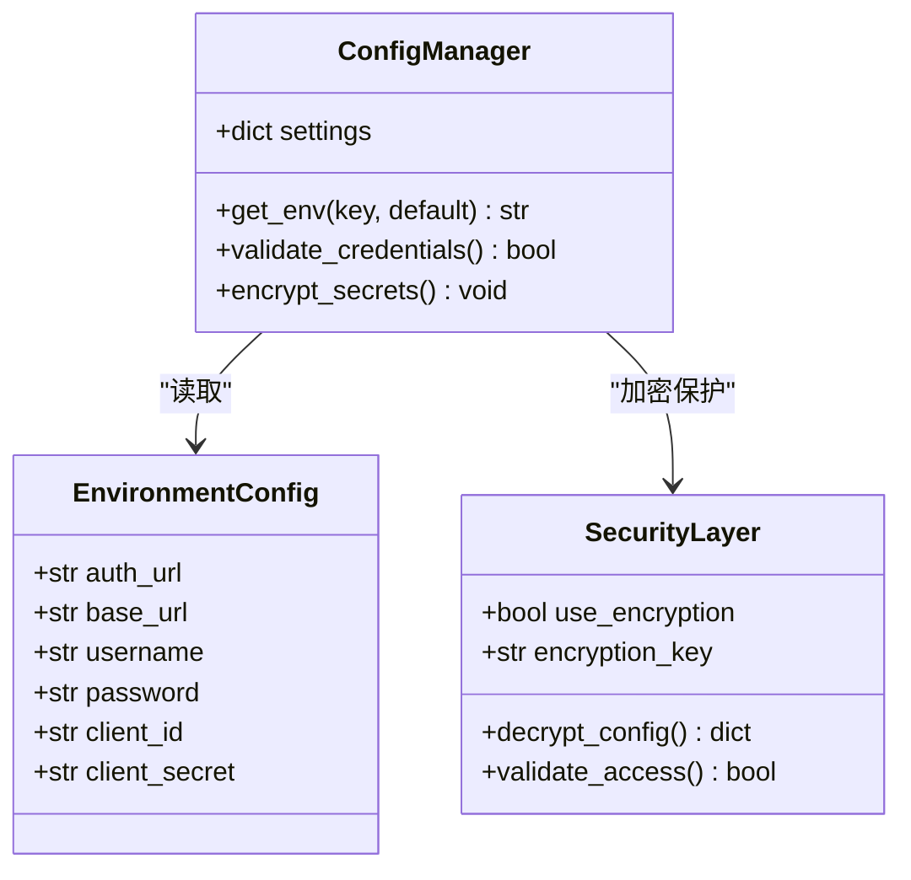

**图表来源**
- [base.py](file://backend/backend/settings/base.py#L249-L256)

### 配置参数说明

| 配置项 | 环境变量 | 默认值 | 安全级别 |
|--------|----------|--------|----------|
| YLH_AUTH_URL | YLH_AUTH_URL | 开发环境URL | 中等 |
| YLH_BASE_URL | YLH_BASE_URL | 开发环境URL | 中等 |
| YLH_USERNAME | YLH_USERNAME | 空 | 高 |
| YLH_PASSWORD | YLH_PASSWORD | 空 | 高 |
| YLH_CLIENT_ID | YLH_CLIENT_ID | open_api_erp | 低 |
| YLH_CLIENT_SECRET | YLH_CLIENT_SECRET | 12345678 | 高 |

**节来源**
- [base.py](file://backend/backend/settings/base.py#L249-L256)

### 配置验证

系统提供配置验证机制：

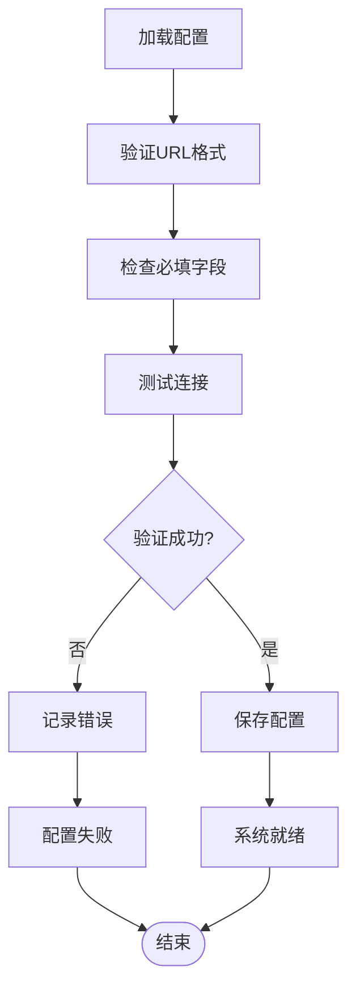

## 最佳实践

### 订单推送最佳实践

1. **幂等性保证**：确保重复推送不会产生副作用
2. **状态同步**：及时更新订单状态以反映易理货系统状态
3. **错误隔离**：易理货系统故障不影响本地订单处理
4. **监控告警**：建立完善的监控和告警机制

### 性能优化建议

| 优化策略 | 实现方式 | 效果 |
|----------|----------|------|
| 连接池 | 复用HTTP连接 | 减少连接开销 |
| 缓存机制 | 缓存认证令牌 | 减少认证频率 |
| 批量操作 | 批量查询物流信息 | 提高效率 |
| 异步处理 | 异步推送订单 | 提升用户体验 |

### 安全考虑

- **凭证保护**：敏感信息加密存储
- **访问控制**：严格的API访问权限
- **审计日志**：完整的操作审计记录
- **网络隔离**：生产环境网络隔离

## 故障排除指南

### 常见问题及解决方案

| 问题类型 | 症状 | 可能原因 | 解决方案 |
|----------|------|----------|----------|
| 认证失败 | 401错误 | 凭证错误或过期 | 检查用户名密码 |
| 推送失败 | 订单状态卡住 | 易理货系统故障 | 重试或人工介入 |
| 数据不一致 | 状态不同步 | 网络中断 | 手动同步 |
| 性能问题 | 响应缓慢 | 网络或系统负载 | 优化配置 |

### 调试工具和技巧

1. **日志分析**：查看详细的API调用日志
2. **状态检查**：验证订单状态和易理货状态
3. **网络诊断**：测试网络连通性
4. **配置验证**：确认配置参数正确性

### 监控指标

- **可用性指标**：API调用成功率
- **性能指标**：响应时间和吞吐量
- **业务指标**：订单推送成功率
- **错误指标**：各类错误发生频率

通过本文档的详细说明，开发者可以全面理解易理货系统集成的设计理念、实现细节和最佳实践，确保系统的稳定运行和高效维护。