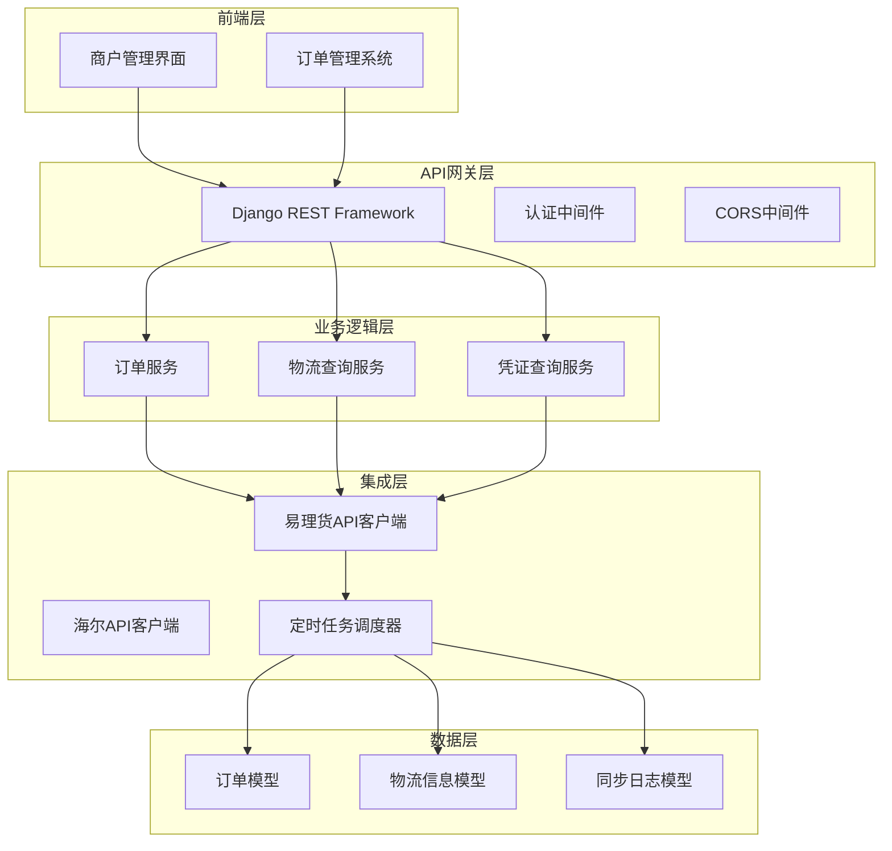
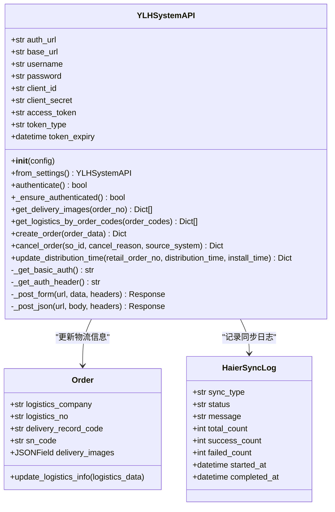
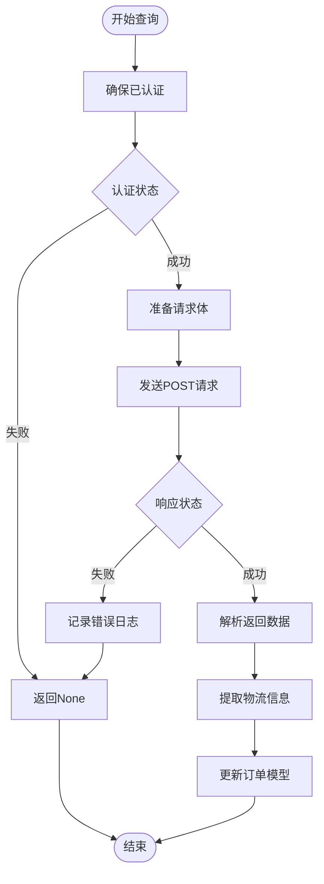
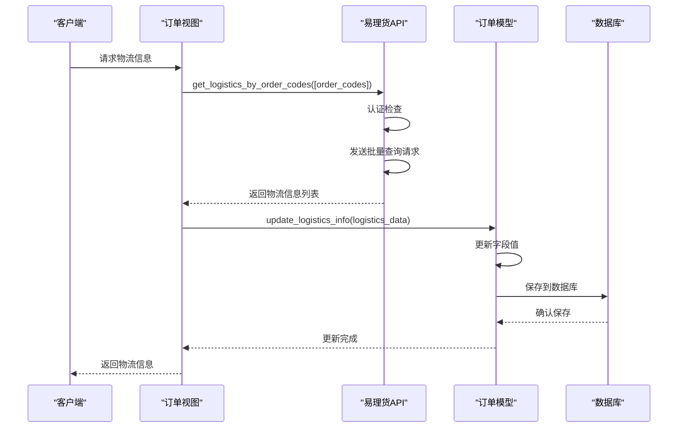
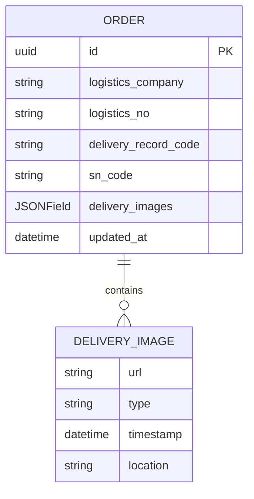
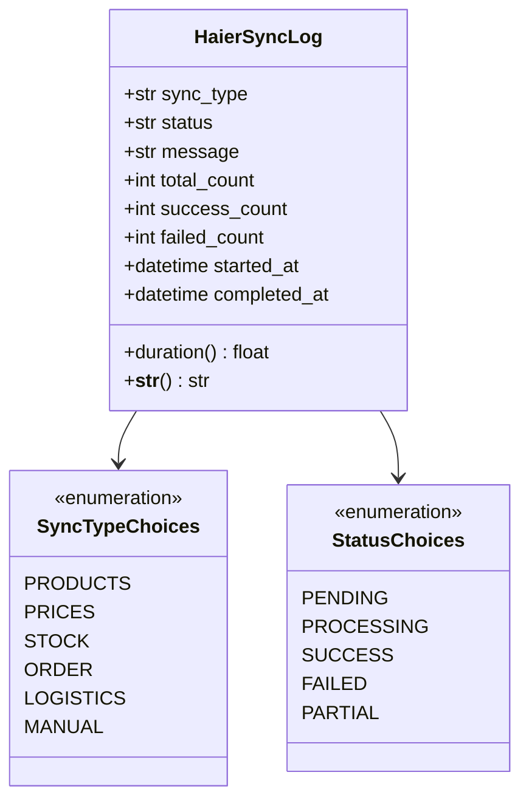
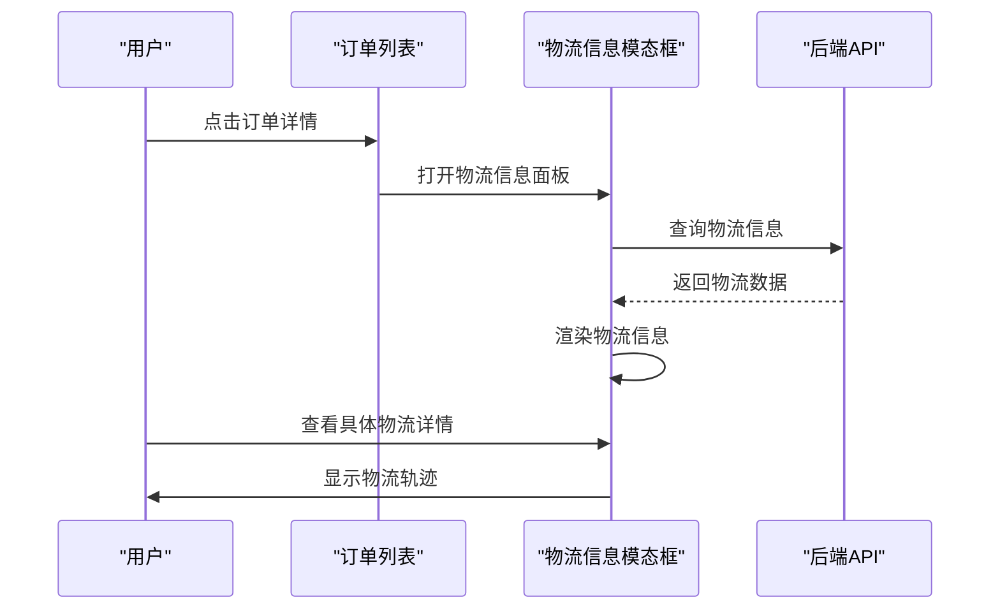
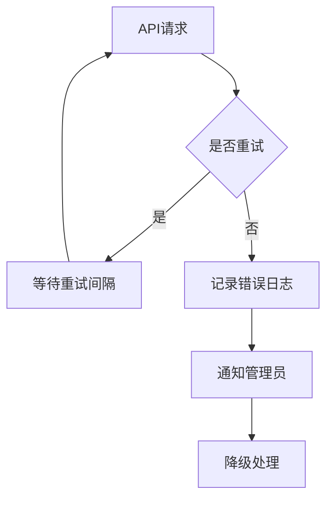

# 物流与凭证查询集成

<cite>
**本文档中引用的文件**
- [ylhapi.py](file://backend/integrations/ylhapi.py)
- [models.py](file://backend/orders/models.py)
- [views.py](file://backend/orders/views.py)
- [services.py](file://backend/orders/services.py)
- [models.py](file://backend/integrations/models.py)
- [haierapi.py](file://backend/integrations/haierapi.py)
- [index.tsx](file://merchant/src/pages/Orders/index.tsx)
</cite>

## 目录
1. [简介](#简介)
2. [项目架构概览](#项目架构概览)
3. [核心组件分析](#核心组件分析)
4. [物流查询集成机制](#物流查询集成机制)
5. [凭证查询集成机制](#凭证查询集成机制)
6. [定时同步机制](#定时同步机制)
7. [数据模型设计](#数据模型设计)
8. [前端展示集成](#前端展示集成)
9. [性能优化考虑](#性能优化考虑)
10. [故障排除指南](#故障排除指南)
11. [总结](#总结)

## 简介

易理货系统物流与凭证查询集成机制是电商业务系统中的重要组成部分，负责与易理货（YLH）系统进行对接，实现物流信息查询、配送安装照片获取以及订单状态同步等功能。该集成机制采用RESTful API设计，支持批量查询和定时同步，确保物流信息的实时性和准确性。

## 项目架构概览

系统采用分层架构设计，主要包含以下几个层次：



**图表来源**
- [ylhapi.py](file://backend/integrations/ylhapi.py#L16-L459)
- [models.py](file://backend/orders/models.py#L13-L62)

## 核心组件分析

### 易理货API客户端

易理货API客户端是整个集成机制的核心组件，负责与易理货系统进行通信。该客户端实现了完整的OAuth2认证流程，并提供了多个关键API接口。



**图表来源**
- [ylhapi.py](file://backend/integrations/ylhapi.py#L16-L459)
- [models.py](file://backend/orders/models.py#L13-L62)
- [models.py](file://backend/integrations/models.py#L50-L150)

**节来源**
- [ylhapi.py](file://backend/integrations/ylhapi.py#L16-L459)
- [models.py](file://backend/orders/models.py#L13-L62)

## 物流查询集成机制

### get_logistics_by_order_codes方法详解

`get_logistics_by_order_codes`方法是物流查询的核心入口，支持最多100个SO单号的批量查询。

#### 方法签名与参数

| 参数 | 类型 | 描述 | 必需 |
|------|------|------|------|
| order_codes | List[str] | SO单号列表（最多100个） | 是 |

#### 返回值结构

| 字段 | 类型 | 描述 |
|------|------|------|
| logisticsCompany | str | 物流公司名称 |
| logisticsNo | str | 物流单号 |
| deliveryRecordCode | str | 发货单号 |
| snCode | str | SN码 |
| orderCode | str | SO单号 |

#### 实现流程



**图表来源**
- [ylhapi.py](file://backend/integrations/ylhapi.py#L371-L406)

#### 批量查询限制

系统对批量查询设置了明确的限制：
- 单次最多支持100个SO单号
- 超过限制的请求会被截断
- 查询超时时间为30秒
- 支持重试机制（最多1次）

**节来源**
- [ylhapi.py](file://backend/integrations/ylhapi.py#L371-L406)

### 物流信息更新机制

物流信息的更新通过`update_logistics_info`方法实现，该方法将易理货系统返回的物流信息持久化到订单模型中。

#### 更新流程



**图表来源**
- [views.py](file://backend/orders/views.py#L525-L537)
- [models.py](file://backend/orders/models.py#L149-L163)

**节来源**
- [views.py](file://backend/orders/views.py#L525-L537)
- [models.py](file://backend/orders/models.py#L149-L163)

## 凭证查询集成机制

### get_delivery_images方法详解

`get_delivery_images`方法专门用于查询配送安装照片，这些照片对于订单完成确认和售后服务至关重要。

#### 方法实现

该方法通过订单中台订单号查询配送安装照片，返回的照片信息包括：
- 照片URL
- 照片类型
- 拍摄时间
- 拍摄位置

#### 数据存储机制

查询到的照片信息被存储在订单模型的`delivery_images`字段中，该字段是一个JSONField，支持存储复杂的数据结构。



**图表来源**
- [models.py](file://backend/orders/models.py#L13-L62)

**节来源**
- [ylhapi.py](file://backend/integrations/ylhapi.py#L330-L369)
- [models.py](file://backend/orders/models.py#L13-L62)

## 定时同步机制

### 同步任务设计

虽然当前代码中没有显式的定时任务定义，但从架构设计可以看出，系统具备实现定时同步的能力。定时同步机制的设计考虑了以下几个方面：

#### 同步策略

| 同步类型 | 触发条件 | 执行频率 | 数据量 |
|----------|----------|----------|--------|
| 物流信息同步 | 订单状态变更 | 实时 | 单个订单 |
| 批量物流查询 | 定时任务 | 每小时 | 最多100个订单 |
| 凭证信息查询 | 用户请求 | 按需 | 单个订单 |

#### 同步日志记录

系统通过`HaierSyncLog`模型记录所有的同步操作，提供完整的审计跟踪：



**图表来源**
- [models.py](file://backend/integrations/models.py#L50-L150)

**节来源**
- [models.py](file://backend/integrations/models.py#L50-L150)

### 后台任务设计建议

基于现有架构，可以设计以下后台任务：

#### 1. 物流信息定时同步任务

```python
@shared_task
def sync_logistics_information():
    """定时同步物流信息"""
    # 获取待同步的订单
    orders = Order.objects.filter(
        status__in=['shipped', 'completed'],
        logistics_company__isnull=True
    ).order_by('-created_at')[:100]
    
    # 批量查询物流信息
    order_codes = [order.haier_so_id for order in orders if order.haier_so_id]
    if order_codes:
        ylh_api = YLHSystemAPI.from_settings()
        logistics_info = ylh_api.get_logistics_by_order_codes(order_codes)
        
        # 更新订单物流信息
        for info in logistics_info:
            order = Order.objects.filter(haier_so_id=info['orderCode']).first()
            if order:
                order.update_logistics_info(info)
```

#### 2. 凭证信息定期查询任务

```python
@shared_task
def sync_delivery_images():
    """定期查询配送安装照片"""
    # 获取已完成订单
    recent_orders = Order.objects.filter(
        status='completed',
        delivery_images__len=0
    ).order_by('-updated_at')[:50]
    
    ylh_api = YLHSystemAPI.from_settings()
    for order in recent_orders:
        images = ylh_api.get_delivery_images(order.haier_order_no)
        if images:
            # 更新订单照片信息
            order.delivery_images = images
            order.save()
```

## 数据模型设计

### 订单模型扩展

订单模型通过JSONField扩展了物流相关信息的存储能力：

#### 核心字段说明

| 字段名 | 类型 | 默认值 | 描述 |
|--------|------|--------|------|
| logistics_company | CharField | '' | 物流公司名称 |
| logistics_no | CharField | '' | 物流单号 |
| delivery_record_code | CharField | '' | 发货单号 |
| sn_code | CharField | '' | SN码 |
| delivery_images | JSONField | [] | 配送安装照片列表 |

#### 数据结构示例

```json
{
    "logistics_company": "顺丰速运",
    "logistics_no": "SF1234567890",
    "delivery_record_code": "DR20241126001",
    "sn_code": "SN20241126001",
    "delivery_images": [
        {
            "url": "https://example.com/image1.jpg",
            "type": "安装前",
            "timestamp": "2024-11-26T14:30:00Z",
            "location": "客厅"
        },
        {
            "url": "https://example.com/image2.jpg",
            "type": "安装后",
            "timestamp": "2024-11-26T15:15:00Z",
            "location": "客厅"
        }
    ]
}
```

**节来源**
- [models.py](file://backend/orders/models.py#L13-L62)

## 前端展示集成

### 物流信息展示

前端通过专门的模态框展示物流信息，支持多种物流渠道的信息显示：

#### 展示内容

| 物流渠道 | 信息类型 | 显示方式 |
|----------|----------|----------|
| 统仓云仓 | 物流单号、物流公司 | 文本显示 |
| 智汇宝 | 发货单号、SN码 | 文本显示 |
| 第三方快递 | 快递单号、签收状态 | 文本显示 |

#### 用户交互



**图表来源**
- [index.tsx](file://merchant/src/pages/Orders/index.tsx#L533-L588)

**节来源**
- [index.tsx](file://merchant/src/pages/Orders/index.tsx#L533-L588)

## 性能优化考虑

### 查询优化策略

1. **批量查询优化**
   - 单次最多查询100个订单
   - 使用异步处理避免阻塞
   - 设置合理的超时时间

2. **缓存策略**
   - 物流信息缓存30分钟
   - 订单状态变更时清除相关缓存
   - 使用Redis作为缓存存储

3. **并发控制**
   - 限制同时查询的请求数量
   - 实现请求队列机制
   - 设置重试间隔

### 错误处理机制

系统实现了完善的错误处理机制：



## 故障排除指南

### 常见问题及解决方案

#### 1. 认证失败

**症状**: API调用返回401错误
**原因**: Access Token过期或无效
**解决方案**: 
- 检查认证配置
- 手动刷新Token
- 验证用户名密码

#### 2. 查询超时

**症状**: API调用超过30秒无响应
**原因**: 易理货系统负载过高
**解决方案**:
- 增加超时时间
- 实现请求重试机制
- 使用备用API接口

#### 3. 数据不一致

**症状**: 前端显示的物流信息与实际不符
**原因**: 同步延迟或数据更新失败
**解决方案**:
- 手动触发同步任务
- 检查同步日志
- 验证数据完整性

### 监控指标

| 指标类型 | 监控内容 | 告警阈值 |
|----------|----------|----------|
| 响应时间 | API平均响应时间 | >5秒 |
| 错误率 | API失败率 | >5% |
| 同步成功率 | 物流信息同步成功率 | <95% |
| 数据一致性 | 物流信息准确率 | <98% |

## 总结

易理货系统物流与凭证查询集成机制是一个设计完善、功能完备的系统集成方案。通过`get_delivery_images`和`get_logistics_by_order_codes`两个核心方法，系统实现了高效的物流信息查询和凭证获取功能。

### 主要特点

1. **模块化设计**: API客户端独立封装，便于维护和扩展
2. **批量处理**: 支持最多100个订单的批量查询，提高效率
3. **数据持久化**: 通过JSONField存储复杂数据结构
4. **错误处理**: 完善的异常捕获和日志记录机制
5. **前端集成**: 提供直观的物流信息展示界面

### 未来改进方向

1. **定时同步**: 实现定期的物流信息同步任务
2. **智能路由**: 根据订单状态选择最优查询路径
3. **数据可视化**: 增强物流信息的可视化展示
4. **移动端支持**: 开发移动端的物流查询功能

该集成机制为电商业务提供了可靠的物流信息服务基础，确保了订单处理的透明度和用户体验的满意度。