# 订单创建集成

<cite>
**本文档中引用的文件**
- [ylhapi.py](file://backend/integrations/ylhapi.py)
- [orders/models.py](file://backend/orders/models.py)
- [orders/views.py](file://backend/orders/views.py)
- [catalog/models.py](file://backend/catalog/models.py)
- [base.py](file://backend/backend/settings/base.py)
</cite>

## 目录
1. [概述](#概述)
2. [系统架构](#系统架构)
3. [核心组件分析](#核心组件分析)
4. [订单数据映射机制](#订单数据映射机制)
5. [错误处理策略](#错误处理策略)
6. [日志记录与监控](#日志记录与监控)
7. [重试机制](#重试机制)
8. [配置管理](#配置管理)
9. [最佳实践](#最佳实践)
10. [故障排除指南](#故障排除指南)

## 概述

易理货系统订单创建集成机制是一个复杂的企业级订单管理系统的核心组件，负责将本地订单数据转换为水联网订单格式并推送至易理货系统。该系统采用模块化设计，通过严格的验证机制确保数据完整性和系统稳定性。

### 主要功能特性

- **智能订单映射**：自动将本地订单模型转换为水联网订单格式
- **多层验证机制**：确保订单数据的准确性和完整性
- **灵活的错误处理**：提供完善的错误捕获和恢复机制
- **实时日志记录**：全面的系统活动跟踪和审计
- **可配置的重试策略**：智能的失败重试和降级处理

## 系统架构

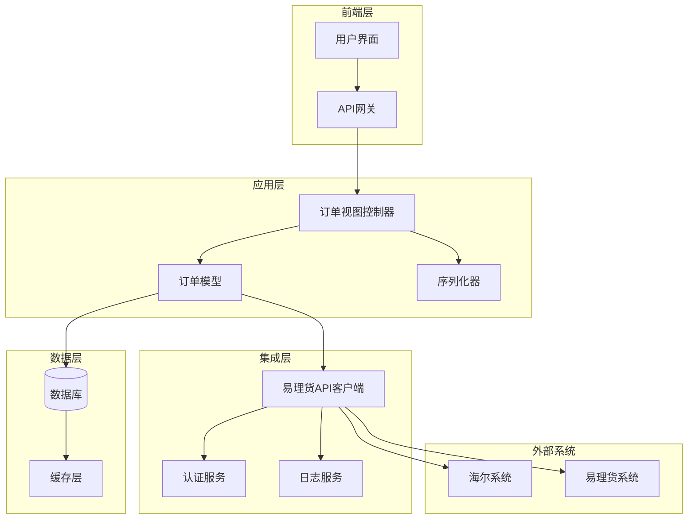

**图表来源**
- [orders/views.py](file://backend/orders/views.py#L390-L480)
- [ylhapi.py](file://backend/integrations/ylhapi.py#L16-L58)

## 核心组件分析

### YLHSystemAPI 类

YLHSystemAPI 是易理货系统API的核心实现类，负责与易理货系统进行所有交互操作。

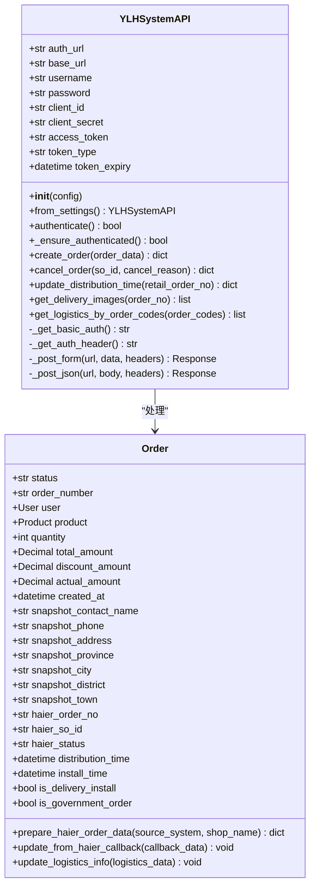

**图表来源**
- [ylhapi.py](file://backend/integrations/ylhapi.py#L16-L58)
- [orders/models.py](file://backend/orders/models.py#L13-L128)

**章节来源**
- [ylhapi.py](file://backend/integrations/ylhapi.py#L16-L459)
- [orders/models.py](file://backend/orders/models.py#L13-L128)

### 订单模型设计

订单模型采用面向对象的设计模式，封装了完整的订单生命周期管理和数据转换逻辑。

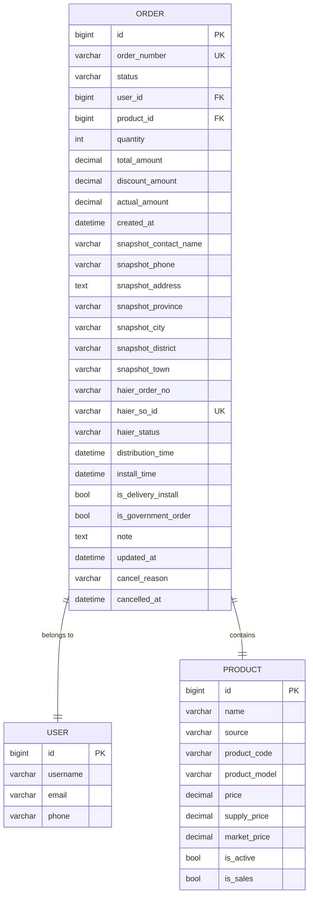

**图表来源**
- [orders/models.py](file://backend/orders/models.py#L13-L82)
- [catalog/models.py](file://backend/catalog/models.py#L43-L116)

**章节来源**
- [orders/models.py](file://backend/orders/models.py#L13-L322)

## 订单数据映射机制

### create_order 方法实现

create_order 方法是订单创建集成的核心入口点，负责将本地订单数据转换为水联网订单格式并推送。

#### 方法签名和参数

| 参数名称 | 类型 | 描述 | 必需 |
|---------|------|------|------|
| order_data | Dict[str, Any] | 订单数据字典 | 是 |
| sourceSystem | str | 订单来源系统标识 | 是 |
| shopName | str | 店铺名称 | 是 |
| sellerCode | str | 客户八码 | 是 |
| consigneeName | str | 收货人姓名 | 是 |
| consigneeMobile | str | 收货人手机号 | 是 |
| onlineNo | str | 平台订单号 | 是 |
| soId | str | 子订单号（唯一） | 是 |
| remark | str | 备注信息 | 否 |
| totalQty | int | 订单总数量 | 是 |
| totalAmt | float | 订单总金额 | 是 |
| createTime | int | 订单创建时间戳（毫秒） | 是 |
| province | str | 省份 | 是 |
| city | str | 城市 | 是 |
| area | str | 区县 | 是 |
| town | str | 乡镇 | 否 |
| detailAddress | str | 详细地址 | 是 |
| distributionTime | int | 配送时间戳（毫秒） | 否 |
| installTime | int | 安装时间戳（毫秒） | 否 |
| governmentOrder | bool | 是否国补订单 | 否 |
| deliveryInstall | bool | 是否送装一体 | 是 |
| itemList | List[Dict] | 订单明细列表 | 是 |

#### 数据转换流程

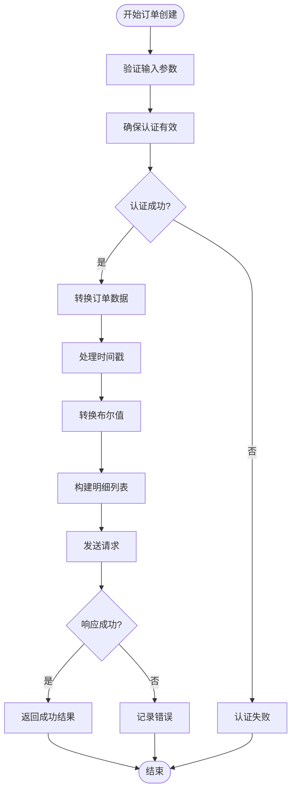

**图表来源**
- [ylhapi.py](file://backend/integrations/ylhapi.py#L174-L230)

**章节来源**
- [ylhapi.py](file://backend/integrations/ylhapi.py#L174-L230)

### prepare_haier_order_data 方法详解

prepare_haier_order_data 方法实现了本地订单模型到YLH系统订单数据结构的精确转换。

#### 字段映射表

| 本地字段 | YLH字段 | 类型转换 | 特殊处理 |
|---------|---------|----------|----------|
| source_system | sourceSystem | str | 默认值 |
| shop_name | shopName | str | 默认值 |
| settings.HAIER_CUSTOMER_CODE | sellerCode | str | 系统配置 |
| snapshot_contact_name | consigneeName | str | 用户信息 |
| snapshot_phone | consigneeMobile | str | 用户信息 |
| order_number | onlineNo | str | 订单编号 |
| haier_so_id 或 order_number-id | soId | str | 唯一标识 |
| note | remark | str | 备注信息 |
| quantity | totalQty | int | 数量字段 |
| total_amount | totalAmt | float | 金额转换 |
| created_at.timestamp() * 1000 | createTime | int | 时间戳 |
| snapshot_province | province | str | 地址信息 |
| snapshot_city | city | str | 地址信息 |
| snapshot_district | area | str | 地址信息 |
| snapshot_town | town | str | 地址信息 |
| snapshot_address | detailAddress | str | 地址信息 |
| distribution_time.timestamp() * 1000 | distributionTime | int | 条件转换 |
| install_time.timestamp() * 1000 | installTime | int | 条件转换 |
| is_government_order | governmentOrder | bool | 布尔值 |
| str(is_delivery_install).lower() | deliveryInstall | str | 字符串转换 |
| itemList | itemList | List[Dict] | 明细构建 |

#### 时间戳处理机制

时间戳转换遵循严格的毫秒级精度要求：

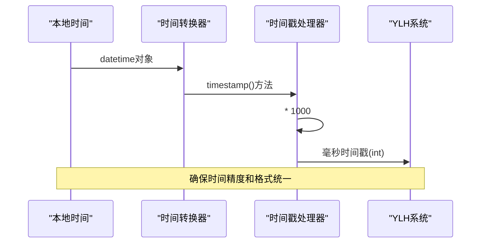

**图表来源**
- [orders/models.py](file://backend/orders/models.py#L114-L115)

#### deliveryInstall 布尔值转换

deliveryInstall 字段需要特殊的字符串转换处理：

```python
# 布尔值转换示例
is_delivery_install = True
delivery_install_str = str(is_delivery_install).lower()  # "true"
```

这种转换确保了与YLH系统期望的字符串格式完全兼容。

**章节来源**
- [orders/models.py](file://backend/orders/models.py#L86-L128)

### itemList 明细构建

itemList 是订单明细的核心数据结构，包含了每个商品的详细信息。

#### 明细字段映射

| 本地字段 | 明细字段 | 类型 | 描述 |
|---------|---------|------|------|
| product.product_code | productCode | str | 商品编码 |
| quantity | itemQty | int | 商品数量 |
| product.market_price 或 product.price | retailPrice | float | 零售价 |
| discount_amount | discountAmount | float | 折扣金额 |
| actual_amount | actualPrice | float | 实际价格 |
| False | isGift | bool | 是否赠品 |

#### 明细构建流程

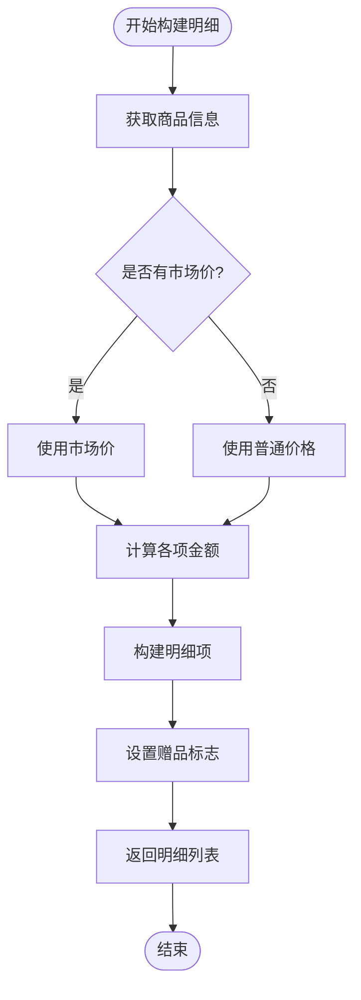

**图表来源**
- [orders/models.py](file://backend/orders/models.py#L118-L127)

**章节来源**
- [orders/models.py](file://backend/orders/models.py#L118-L127)

## 错误处理策略

### 分层错误处理机制

系统采用多层错误处理策略，确保在各种异常情况下都能提供适当的反馈和恢复机制。

#### 认证错误处理

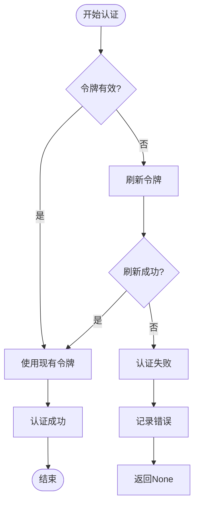

**图表来源**
- [ylhapi.py](file://backend/integrations/ylhapi.py#L117-L131)

#### 请求错误处理

对于API请求失败的情况，系统提供了详细的错误信息记录：

| 错误类型 | 处理策略 | 日志级别 | 返回值 |
|---------|---------|----------|--------|
| 认证失败 | 记录错误并返回None | ERROR | None |
| 网络超时 | 重试机制 | WARNING | None |
| HTTP错误 | 记录状态码和响应 | ERROR | None |
| JSON解析错误 | 记录异常信息 | ERROR | None |
| 系统异常 | 记录堆栈信息 | ERROR | None |

#### 订单创建失败处理

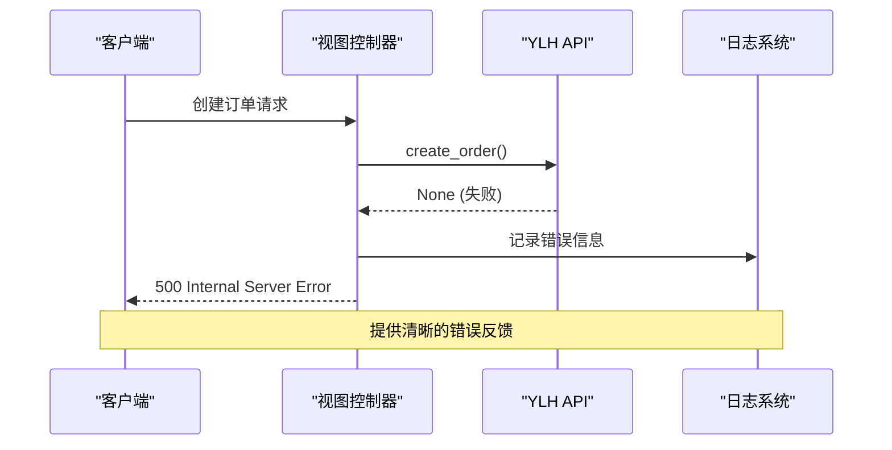

**图表来源**
- [orders/views.py](file://backend/orders/views.py#L458-L462)

**章节来源**
- [ylhapi.py](file://backend/integrations/ylhapi.py#L91-L115)
- [orders/views.py](file://backend/orders/views.py#L458-L462)

### 异常捕获和恢复

系统在多个层面实现了异常捕获和恢复机制：

1. **网络层异常**：处理连接超时、DNS解析失败等网络问题
2. **认证层异常**：处理令牌过期、认证失败等情况
3. **业务层异常**：处理订单数据验证、状态检查等业务逻辑错误
4. **系统层异常**：处理内存不足、磁盘空间等系统资源问题

## 日志记录与监控

### 日志记录策略

系统采用分级日志记录策略，确保关键操作都有详细的审计跟踪。

#### 日志级别定义

| 级别 | 用途 | 示例场景 |
|------|------|----------|
| DEBUG | 详细调试信息 | 方法进入/退出、变量值 |
| INFO | 一般信息记录 | 订单创建成功、认证成功 |
| WARNING | 警告信息 | 认证即将过期、重试操作 |
| ERROR | 错误信息 | 认证失败、API调用失败 |
| CRITICAL | 严重错误 | 系统崩溃、数据丢失 |

#### 关键操作日志

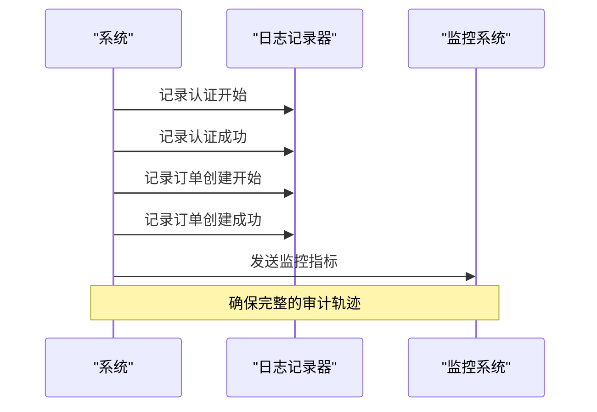

**图表来源**
- [ylhapi.py](file://backend/integrations/ylhapi.py#L99-L111)
- [orders/views.py](file://backend/orders/views.py#L423-L437)

**章节来源**
- [ylhapi.py](file://backend/integrations/ylhapi.py#L99-L111)
- [orders/views.py](file://backend/orders/views.py#L423-L437)

### 监控指标

系统监控以下关键指标：

- **认证成功率**：认证请求的成功率统计
- **API响应时间**：各API接口的平均响应时间
- **订单创建成功率**：订单创建操作的成功率
- **错误分布**：各类错误的发生频率和类型
- **系统可用性**：整体系统的可用性指标

## 重试机制

### 指数退避算法

系统采用指数退避算法实现智能重试机制：

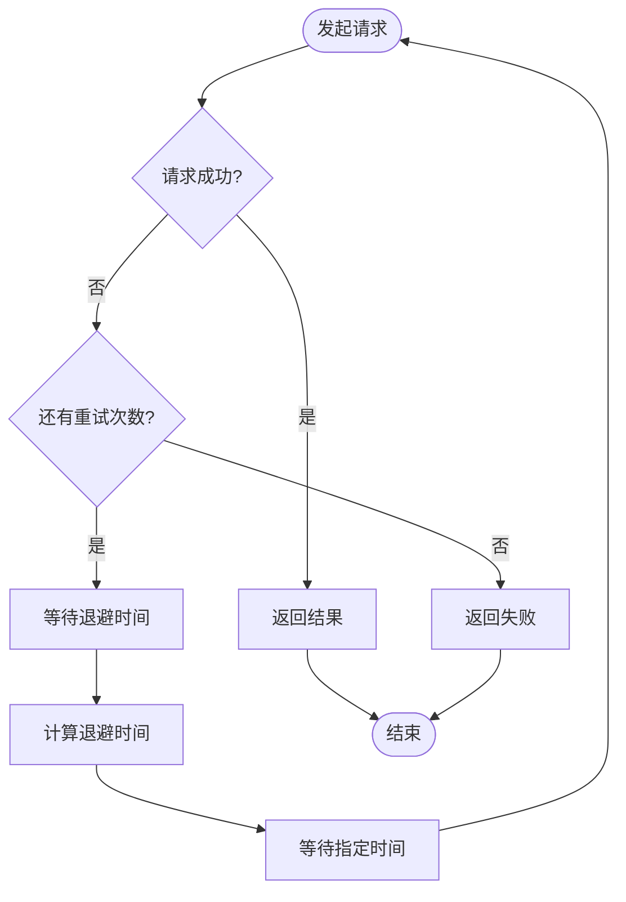

**图表来源**
- [ylhapi.py](file://backend/integrations/ylhapi.py#L142-L172)

#### 退避时间计算

退避时间遵循以下公式：
- 初始延迟：0.5秒
- 最大延迟：30秒
- 退避倍数：2^尝试次数 × 初始延迟

### 重试策略配置

| 场景 | 重试次数 | 最大延迟 | 退避策略 |
|------|---------|----------|----------|
| 认证失败 | 1次 | 10秒 | 立即重试 |
| 订单创建 | 1次 | 30秒 | 指数退避 |
| 取消订单 | 1次 | 30秒 | 指数退避 |
| 物流查询 | 1次 | 30秒 | 指数退避 |

**章节来源**
- [ylhapi.py](file://backend/integrations/ylhapi.py#L142-L172)

## 配置管理

### 环境配置

系统支持多环境配置，通过环境变量管理不同部署环境的设置。

#### 核心配置项

| 配置项 | 默认值 | 描述 |
|-------|--------|------|
| YLH_AUTH_URL | http://dev.ylhtest.com/ylh-cloud-mgt-auth-dev/oauth/token | 认证服务URL |
| YLH_BASE_URL | http://dev.ylhtest.com/ylh-cloud-service-jst-order-dev | API基础URL |
| YLH_USERNAME | "" | 认证用户名 |
| YLH_PASSWORD | "" | 认证密码 |
| YLH_CLIENT_ID | open_api_erp | 客户端ID |
| YLH_CLIENT_SECRET | 12345678 | 客户端密钥 |
| HAIER_USE_MOCK_DATA | True | 是否使用模拟数据 |

#### 配置加载机制

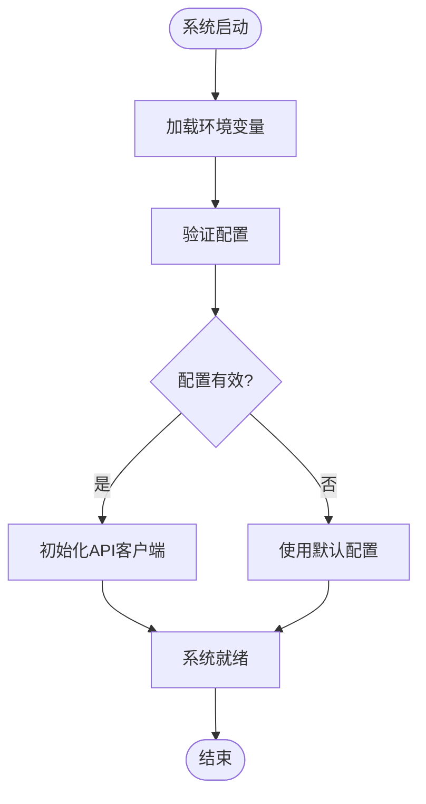

**图表来源**
- [base.py](file://backend/backend/settings/base.py#L248-L262)

**章节来源**
- [base.py](file://backend/backend/settings/base.py#L248-L262)

### 动态配置更新

系统支持运行时配置更新，允许在不停机的情况下调整系统行为：

- **认证配置**：支持动态更新认证凭据
- **API端点**：支持切换不同的API环境
- **功能开关**：支持动态启用/禁用特定功能
- **日志级别**：支持动态调整日志输出级别

## 最佳实践

### 订单创建流程优化

1. **预验证机制**：在调用API前验证订单数据的完整性
2. **批量处理**：对于大量订单，考虑使用批量处理机制
3. **异步处理**：对于非关键路径的操作，使用异步处理提高性能
4. **缓存策略**：缓存频繁访问的配置和认证信息

### 性能优化建议

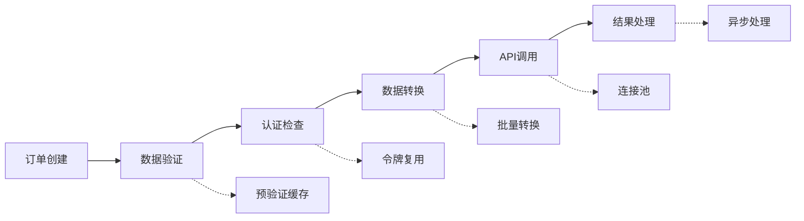

### 安全最佳实践

1. **敏感信息保护**：加密存储认证凭据和敏感配置
2. **访问控制**：实施严格的API访问权限控制
3. **数据脱敏**：在日志中脱敏处理敏感信息
4. **审计跟踪**：记录所有关键操作的审计日志

## 故障排除指南

### 常见问题诊断

#### 认证失败

**症状**：系统返回认证失败错误
**可能原因**：
- 认证凭据错误
- 网络连接问题
- 令牌过期

**解决方案**：
1. 检查配置文件中的认证信息
2. 验证网络连接状态
3. 查看令牌过期时间

#### 订单创建失败

**症状**：订单创建API调用失败
**可能原因**：
- 订单数据格式错误
- 网络超时
- 系统负载过高

**解决方案**：
1. 验证订单数据格式
2. 检查网络连接质量
3. 查看系统资源使用情况

#### 数据映射错误

**症状**：订单数据转换过程中出现错误
**可能原因**：
- 字段类型不匹配
- 时间戳格式错误
- 缺少必填字段

**解决方案**：
1. 检查字段类型定义
2. 验证时间戳格式
3. 确认必填字段完整性

### 监控和告警

建立完善的监控和告警机制：

- **实时监控**：监控API响应时间和成功率
- **异常告警**：设置关键指标的告警阈值
- **趋势分析**：分析系统性能的趋势变化
- **容量规划**：基于历史数据进行容量规划

**章节来源**
- [ylhapi.py](file://backend/integrations/ylhapi.py#L91-L115)
- [orders/views.py](file://backend/orders/views.py#L458-L462)