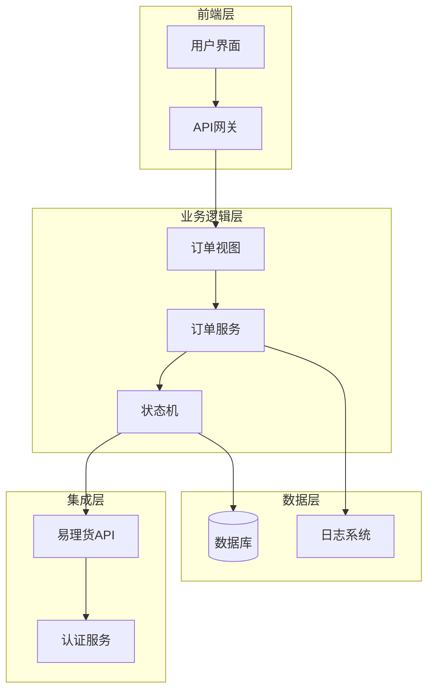
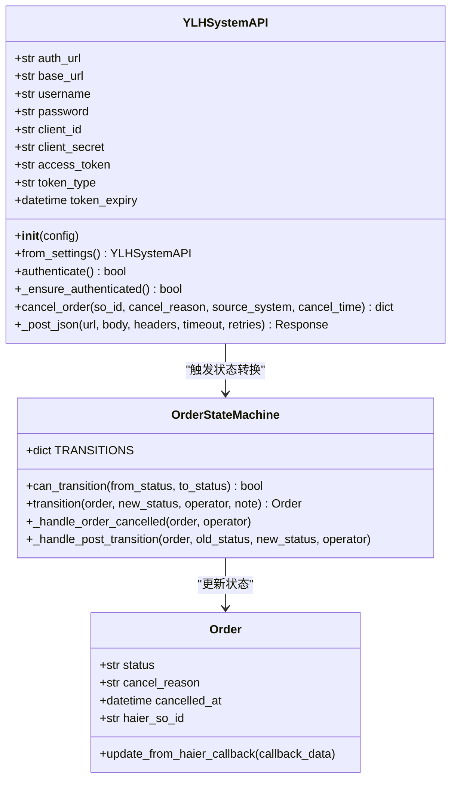
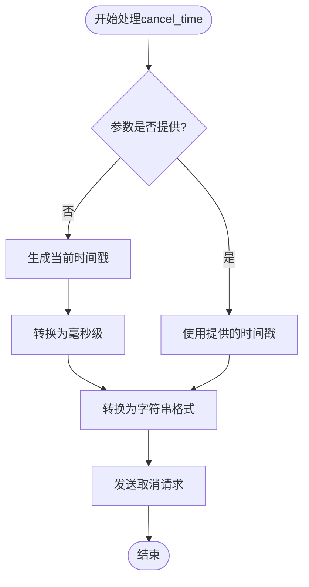
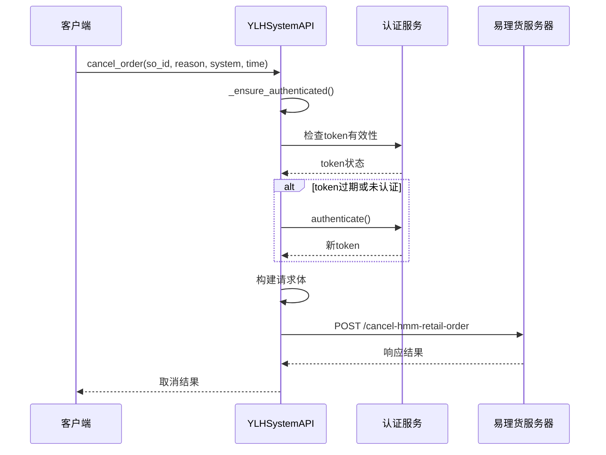
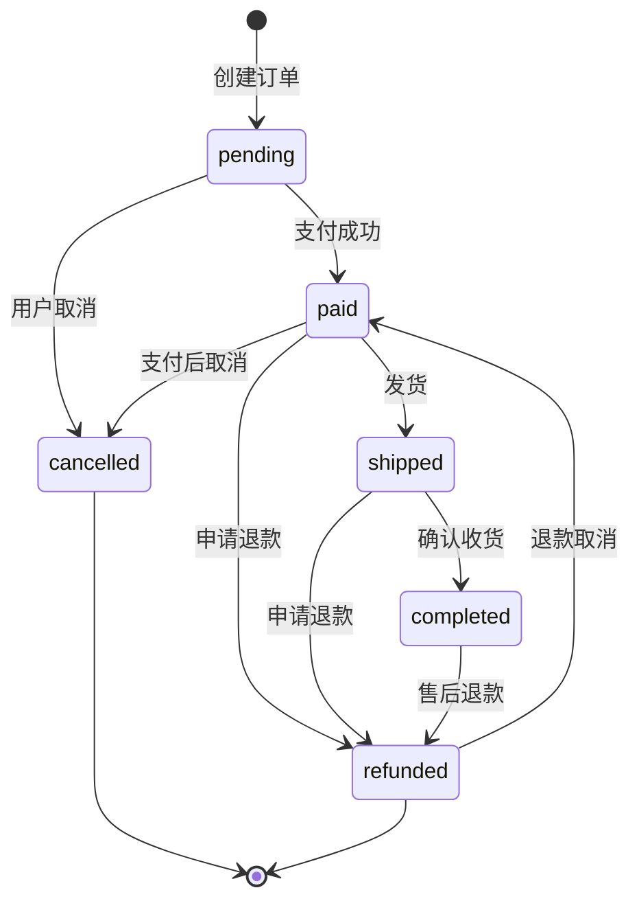
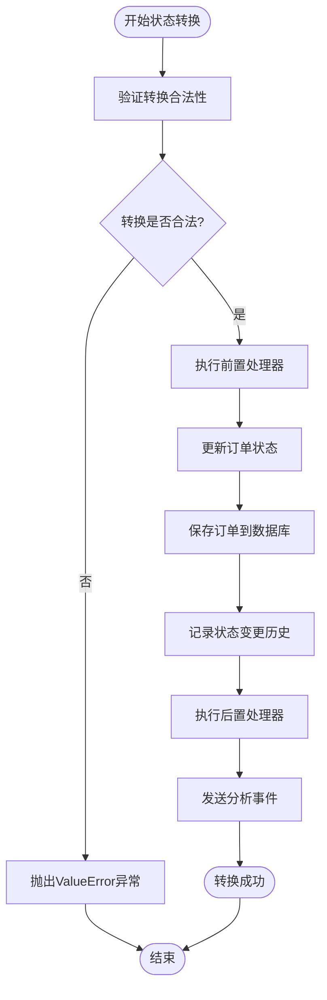
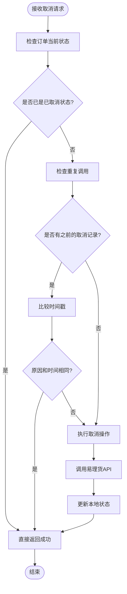
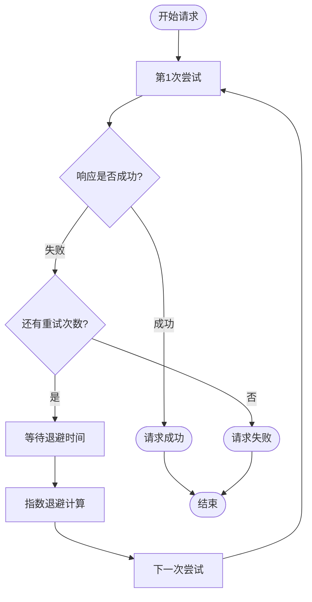
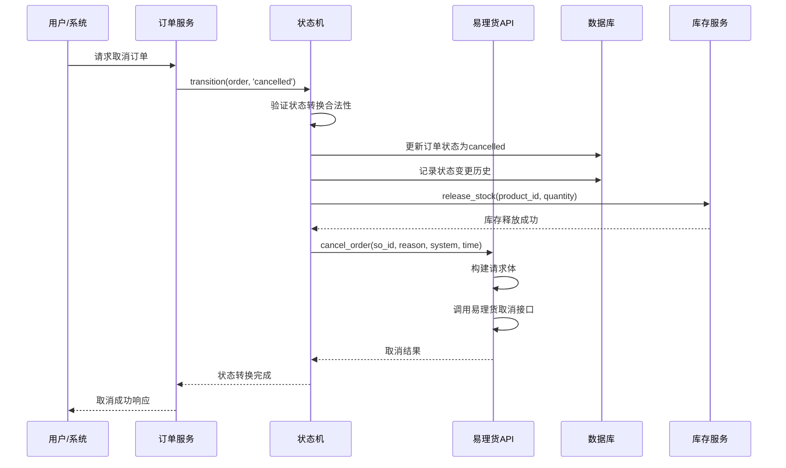
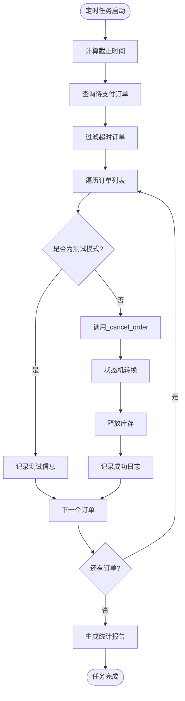

# 易理货系统订单取消集成机制详细文档

<cite>
**本文档引用的文件**
- [ylhapi.py](file://backend/integrations/ylhapi.py)
- [models.py](file://backend/orders/models.py)
- [state_machine.py](file://backend/orders/state_machine.py)
- [services.py](file://backend/orders/services.py)
- [cancel_unpaid_orders.py](file://backend/orders/management/commands/cancel_unpaid_orders.py)
- [views.py](file://backend/orders/views.py)
- [haier_api.md](file://haier_api.md)
</cite>

## 目录
1. [概述](#概述)
2. [系统架构](#系统架构)
3. [核心组件分析](#核心组件分析)
4. [cancel_order方法实现](#cancel_order方法实现)
5. [订单状态管理](#订单状态管理)
6. [幂等性处理](#幂等性处理)
7. [失败重试策略](#失败重试策略)
8. [集成流程详解](#集成流程详解)
9. [最佳实践](#最佳实践)
10. [故障排除](#故障排除)

## 概述

易理货系统订单取消集成机制是一个完整的订单取消解决方案，通过易理货API实现订单状态的同步更新。该机制涵盖了从参数传递、接口调用到状态更新的完整流程，确保本地订单状态与易理货系统保持一致。

### 主要特性

- **参数标准化**：支持so_id、cancel_reason、source_system、cancel_time等标准参数
- **时间戳处理**：自动处理毫秒级时间戳，默认使用当前时间
- **状态机驱动**：基于状态机模式确保状态转换的合法性
- **幂等性保障**：提供重复调用的安全保护
- **失败重试**：内置重试机制提高系统可靠性

## 系统架构



**架构图源文件**
- [views.py](file://backend/orders/views.py#L1-L50)
- [ylhapi.py](file://backend/integrations/ylhapi.py#L16-L50)
- [state_machine.py](file://backend/orders/state_machine.py#L25-L60)

## 核心组件分析

### 易理货API客户端

YLHSystemAPI类是易理货系统的核心集成组件，负责与易理货服务器进行通信。



**类图源文件**
- [ylhapi.py](file://backend/integrations/ylhapi.py#L16-L100)
- [state_machine.py](file://backend/orders/state_machine.py#L25-L150)
- [models.py](file://backend/orders/models.py#L13-L80)

**节源文件**
- [ylhapi.py](file://backend/integrations/ylhapi.py#L16-L459)
- [state_machine.py](file://backend/orders/state_machine.py#L25-L289)

## cancel_order方法实现

### 方法签名与参数

cancel_order方法是易理货系统订单取消的核心入口，其完整签名如下：

```python
def cancel_order(self, so_id: str, cancel_reason: str, source_system: str, 
                cancel_time: int = None) -> Optional[Dict[str, Any]]:
```

### 参数详细说明

| 参数名 | 类型 | 必需 | 默认值 | 描述 | 数据来源 |
|--------|------|------|--------|------|----------|
| so_id | str | 是 | - | 子订单号，对应创建订单的sold字段 | 订单模型中的haier_so_id |
| cancel_reason | str | 是 | - | 订单取消原因，如"客户要求取消" | 用户输入或系统生成 |
| source_system | str | 是 | - | 订单来源系统标识 | 系统配置或调用方标识 |
| cancel_time | int | 否 | 当前时间 | 毫秒级时间戳，取消时间 | 自动生成或传入 |

### 时间戳生成逻辑

cancel_time参数的处理逻辑体现了系统的智能设计：



**流程图源文件**
- [ylhapi.py](file://backend/integrations/ylhapi.py#L251-L252)

### 接口调用流程



**序列图源文件**
- [ylhapi.py](file://backend/integrations/ylhapi.py#L232-L278)

**节源文件**
- [ylhapi.py](file://backend/integrations/ylhapi.py#L232-L278)

## 订单状态管理

### 状态机架构

系统采用状态机模式管理订单状态转换，确保状态变化的合法性。



**状态图源文件**
- [state_machine.py](file://backend/orders/state_machine.py#L33-L56)

### 状态转换规则

| 当前状态 | 允许转换到的状态 | 转换条件 | 业务影响 |
|----------|------------------|----------|----------|
| pending | paid, cancelled | 支付成功或用户主动取消 | 库存锁定/释放 |
| paid | shipped, refunded, cancelled | 发货、退款申请、支付后取消 | 物流准备/库存释放 |
| shipped | completed, refunded | 确认收货、退款申请 | 交易完成/库存释放 |
| completed | refunded | 售后退款 | 退款处理 |
| cancelled | - | 终态，不可再转换 | 库存释放、记录取消原因 |

### 状态转换实现



**流程图源文件**
- [state_machine.py](file://backend/orders/state_machine.py#L96-L154)

**节源文件**
- [state_machine.py](file://backend/orders/state_machine.py#L96-L154)

## 幂等性处理

### 幂等性设计原则

系统在多个层面实现了幂等性保障：

1. **API层面**：易理货API本身支持幂等性操作
2. **状态机层面**：状态转换检查避免重复操作
3. **业务逻辑层面**：订单状态检查防止重复取消

### 幂等性验证流程



**流程图源文件**
- [state_machine.py](file://backend/orders/state_machine.py#L118-L124)

## 失败重试策略

### 重试机制设计

系统采用指数退避算法实现智能重试：



**流程图源文件**
- [ylhapi.py](file://backend/integrations/ylhapi.py#L142-L172)

### 重试参数配置

| 参数 | 默认值 | 说明 | 调整建议 |
|------|--------|------|----------|
| 初始重试间隔 | 0.5秒 | 第一次重试等待时间 | 根据网络状况调整 |
| 退避倍数 | 2.0 | 每次重试间隔翻倍 | 保守网络可适当增加 |
| 最大重试次数 | 1 | 总共最多重试次数 | 生产环境建议2-3次 |
| 超时时间 | 30秒 | 单次请求超时限制 | 根据API响应时间调整 |

**节源文件**
- [ylhapi.py](file://backend/integrations/ylhapi.py#L142-L172)

## 集成流程详解

### 完整取消流程



**序列图源文件**
- [state_machine.py](file://backend/orders/state_machine.py#L96-L154)
- [ylhapi.py](file://backend/integrations/ylhapi.py#L232-L278)

### 自动取消机制

系统提供了自动取消未支付订单的功能：



**流程图源文件**
- [cancel_unpaid_orders.py](file://backend/orders/management/commands/cancel_unpaid_orders.py#L41-L98)

**节源文件**
- [cancel_unpaid_orders.py](file://backend/orders/management/commands/cancel_unpaid_orders.py#L99-L117)

## 最佳实践

### 参数传递最佳实践

1. **so_id格式规范**
   - 使用唯一的子订单号
   - 避免特殊字符和空格
   - 确保与创建订单时一致

2. **取消原因编写指南**
   - 使用清晰明确的语言
   - 包含必要上下文信息
   - 避免敏感信息泄露

3. **时间戳处理**
   - 使用毫秒级精度
   - 确保时区一致性
   - 避免未来时间戳

### 错误处理最佳实践

1. **认证失败处理**
   ```python
   if not ylh_api.authenticate():
       logger.error('易理货系统认证失败')
       return Response({'detail': '认证失败'}, status=500)
   ```

2. **接口调用失败处理**
   ```python
   result = ylh_api.cancel_order(so_id, reason, system, timestamp)
   if not result:
       logger.error(f'取消订单失败: order_id={order.id}')
       # 实现重试逻辑或回滚机制
   ```

3. **状态同步失败处理**
   - 记录详细错误日志
   - 实现补偿机制
   - 提供人工干预接口

### 监控和告警

建议监控以下关键指标：

| 指标类别 | 监控项目 | 告警阈值 | 处理建议 |
|----------|----------|----------|----------|
| 接口调用 | 取消成功率 | < 95% | 检查易理货系统状态 |
| 接口调用 | 响应时间 | > 5秒 | 优化网络或增加超时 |
| 系统健康 | 认证失败率 | > 5% | 检查认证配置 |
| 业务指标 | 取消订单量 | 异常波动 | 分析业务原因 |

## 故障排除

### 常见问题及解决方案

#### 1. 认证失败

**症状**：`易理货系统认证失败`错误

**排查步骤**：
1. 检查配置文件中的认证信息
2. 验证网络连接和防火墙设置
3. 确认易理货系统服务状态

**解决方案**：
```python
# 检查配置
print(f"用户名: {ylh_api.username}")
print(f"客户端ID: {ylh_api.client_id}")
print(f"认证URL: {ylh_api.auth_url}")

# 手动测试认证
if not ylh_api.authenticate():
    print("认证失败，请检查配置")
```

#### 2. 接口调用超时

**症状**：`Timeout`异常或长时间无响应

**排查步骤**：
1. 检查网络延迟
2. 验证易理货系统负载
3. 调整超时参数

**解决方案**：
```python
# 增加重试次数和超时时间
response = self._post_json(
    url, body, headers,
    timeout=60,  # 增加到60秒
    retries=3    # 增加到3次
)
```

#### 3. 状态转换失败

**症状**：订单状态未正确更新

**排查步骤**：
1. 检查订单当前状态
2. 验证状态转换规则
3. 查看状态变更历史

**解决方案**：
```python
# 检查状态转换合法性
if not OrderStateMachine.can_transition(order.status, 'cancelled'):
    allowed = OrderStateMachine.get_allowed_transitions(order.status)
    print(f"不允许的状态转换: {order.status} -> cancelled")
    print(f"允许的转换: {allowed}")
```

#### 4. 幂等性问题

**症状**：重复调用导致异常行为

**排查步骤**：
1. 检查订单取消历史
2. 验证重复调用检测逻辑
3. 查看日志中的重复请求

**解决方案**：
```python
# 添加幂等性检查
existing_cancel = OrderStatusHistory.objects.filter(
    order=order,
    to_status='cancelled'
).exists()

if existing_cancel:
    logger.warning(f"订单已取消，跳过重复操作: {order.id}")
    return True
```

### 日志分析指南

系统提供了详细的日志记录，便于问题诊断：

```python
# 关键日志级别
logger.info("使用真实易理货API推送订单")
logger.error("Failed to cancel order: %s - %s", code, text)
logger.warning("Token expired, re-authenticating...")
```

**节源文件**
- [ylhapi.py](file://backend/integrations/ylhapi.py#L272-L274)
- [state_machine.py](file://backend/orders/state_machine.py#L118-L124)

## 总结

易理货系统订单取消集成机制通过精心设计的架构和完善的错误处理，确保了订单取消操作的可靠性和一致性。系统的关键优势包括：

1. **完整的生命周期管理**：从参数验证到状态更新的全流程控制
2. **强大的容错能力**：多重重试机制和错误恢复策略
3. **严格的状态控制**：基于状态机的合法性验证
4. **良好的扩展性**：模块化设计便于功能扩展

通过遵循本文档的最佳实践和故障排除指南，可以确保系统的稳定运行和高效维护。