# 易理货系统认证与配置管理

<cite>
**本文档中引用的文件**
- [ylhapi.py](file://backend/integrations/ylhapi.py)
- [models.py](file://backend/integrations/models.py)
- [base.py](file://backend/backend/settings/base.py)
- [env_config.py](file://backend/backend/settings/env_config.py)
- [views.py](file://backend/orders/views.py)
</cite>

## 目录
1. [简介](#简介)
2. [系统架构概览](#系统架构概览)
3. [YLHSystemAPI类详解](#ylhsystemapi类详解)
4. [双重认证机制](#双重认证机制)
5. [Token管理与自动刷新](#token管理与自动刷新)
6. [配置管理系统](#配置管理系统)
7. [安全存储机制](#安全存储机制)
8. [实际应用场景](#实际应用场景)
9. [故障排除指南](#故障排除指南)
10. [最佳实践建议](#最佳实践建议)

## 简介

易理货系统（YLH）是本项目中的重要第三方集成组件，负责处理订单创建、取消、改约等核心业务操作。系统采用双重认证机制确保安全性，包括基于client_id/client_secret的Basic认证头生成和基于用户名/密码的OAuth2密码模式获取访问令牌。

本文档详细阐述了YLHSystemAPI类的认证实现、配置管理机制以及安全存储策略，为开发者提供全面的技术参考。

## 系统架构概览

易理货系统的认证架构采用分层设计，确保安全性和可维护性：

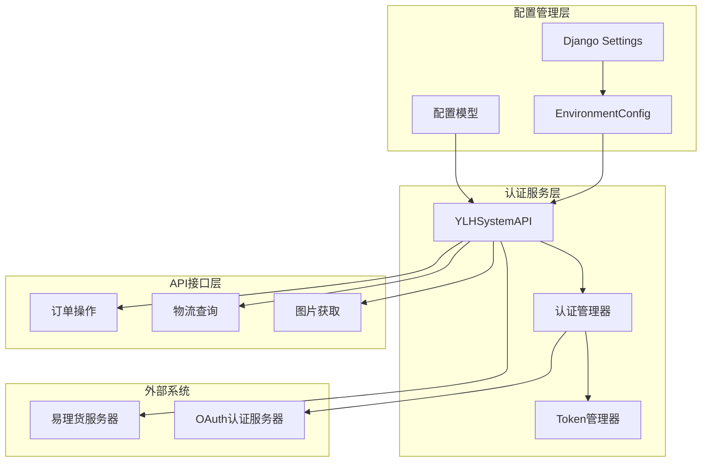

**图表来源**
- [ylhapi.py](file://backend/integrations/ylhapi.py#L16-L459)
- [env_config.py](file://backend/backend/settings/env_config.py#L37-L251)

## YLHSystemAPI类详解

YLHSystemAPI类是易理货系统的核心API客户端，提供了完整的认证和订单操作功能。

### 类结构与初始化

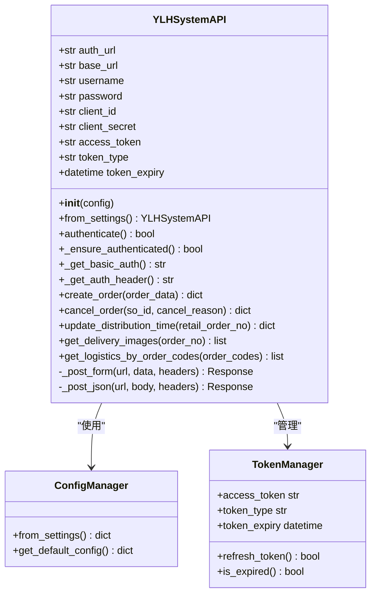

**图表来源**
- [ylhapi.py](file://backend/integrations/ylhapi.py#L16-L459)

### 核心属性说明

| 属性名 | 类型 | 描述 | 默认值 |
|--------|------|------|--------|
| auth_url | str | OAuth认证服务器地址 | 开发环境默认值 |
| base_url | str | 易理货API基础URL | 开发环境默认值 |
| username | str | 认证用户名 | 空字符串 |
| password | str | 认证密码 | 空字符串 |
| client_id | str | 客户端ID（Basic认证） | 'open_api_erp' |
| client_secret | str | 客户端密钥（Basic认证） | '12345678' |
| access_token | str | 访问令牌 | None |
| token_type | str | 令牌类型 | None |
| token_expiry | datetime | 令牌过期时间 | None |

**节来源**
- [ylhapi.py](file://backend/integrations/ylhapi.py#L23-L46)

## 双重认证机制

易理货系统采用双重认证机制，确保API调用的安全性：

### Basic认证头生成

系统首先使用client_id和client_secret生成Basic认证头：

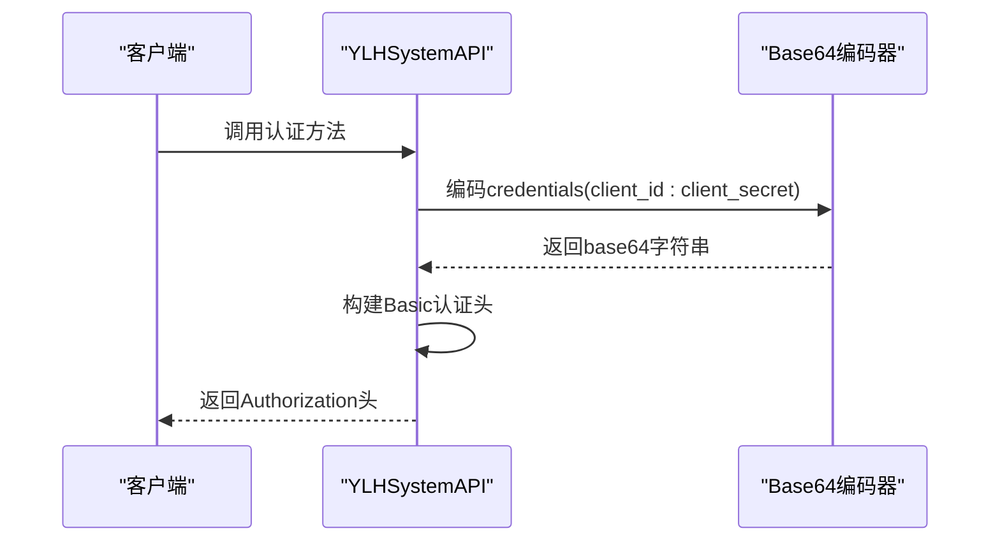

**图表来源**
- [ylhapi.py](file://backend/integrations/ylhapi.py#L60-L70)

### OAuth2密码模式认证

获取访问令牌的过程遵循OAuth2标准流程：

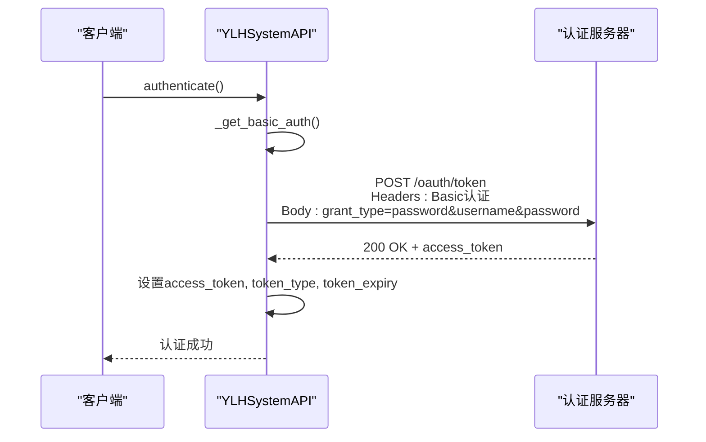

**图表来源**
- [ylhapi.py](file://backend/integrations/ylhapi.py#L71-L115)

**节来源**
- [ylhapi.py](file://backend/integrations/ylhapi.py#L60-L115)

## Token管理与自动刷新

系统实现了智能的Token管理机制，确保API调用的连续性。

### Token生命周期管理

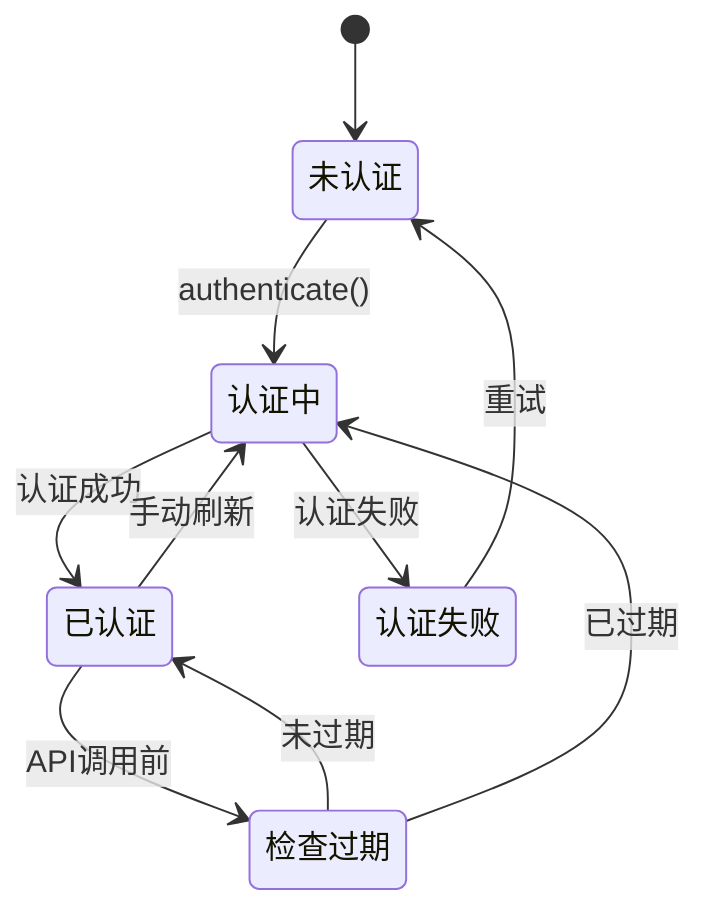

### 自动刷新逻辑

系统在每次API调用前都会检查Token的有效性：

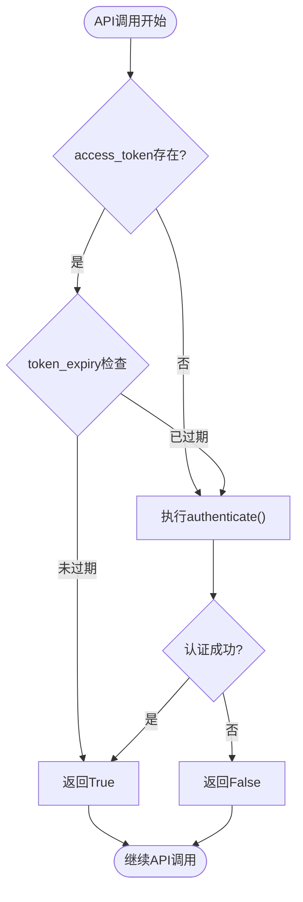

**图表来源**
- [ylhapi.py](file://backend/integrations/ylhapi.py#L117-L131)

### 过期时间管理

Token过期时间采用提前10分钟刷新策略：

| 参数 | 值 | 说明 |
|------|-----|------|
| expires_in | 3600秒 | 服务器返回的原始过期时间 |
| 刷新阈值 | 600秒 | 提前10分钟 |
| 实际过期时间 | expires_in - 600 | 预留缓冲时间 |

**节来源**
- [ylhapi.py](file://backend/integrations/ylhapi.py#L104-L105)

## 配置管理系统

系统提供了灵活的配置管理机制，支持多种配置来源和环境适配。

### 配置层次结构

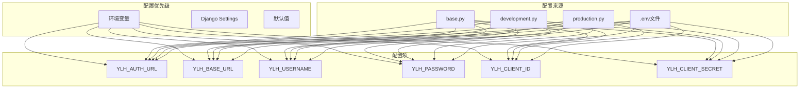

**图表来源**
- [base.py](file://backend/backend/settings/base.py#L249-L256)
- [env_config.py](file://backend/backend/settings/env_config.py#L50-L63)

### from_settings类方法

系统提供了便捷的配置加载方法：

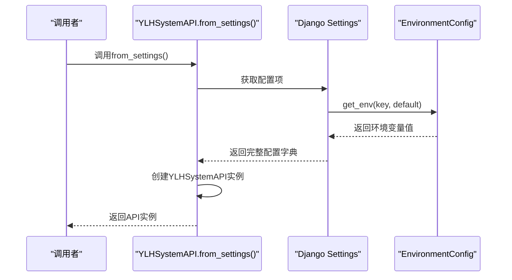

**图表来源**
- [ylhapi.py](file://backend/integrations/ylhapi.py#L47-L58)

**节来源**
- [ylhapi.py](file://backend/integrations/ylhapi.py#L47-L58)
- [base.py](file://backend/backend/settings/base.py#L249-L256)

## 安全存储机制

系统采用多层安全措施保护敏感配置信息。

### 环境变量保护

敏感信息通过环境变量传递，避免硬编码：

| 配置项 | 环境变量名 | 必需性 | 示例值 |
|--------|------------|--------|--------|
| YLH_AUTH_URL | YLH_AUTH_URL | 可选 | http://dev.ylhtest.com/... |
| YLH_BASE_URL | YLH_BASE_URL | 可选 | http://dev.ylhtest.com/... |
| YLH_USERNAME | YLH_USERNAME | 必需 | erp |
| YLH_PASSWORD | YLH_PASSWORD | 必需 | secure_password |
| YLH_CLIENT_ID | YLH_CLIENT_ID | 可选 | open_api_erp |
| YLH_CLIENT_SECRET | YLH_CLIENT_SECRET | 可选 | super_secret_key |

### 环境检测机制

系统自动检测运行环境并加载相应配置：

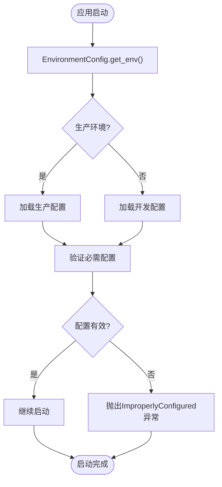

**图表来源**
- [env_config.py](file://backend/backend/settings/env_config.py#L186-L251)

**节来源**
- [base.py](file://backend/backend/settings/base.py#L249-L256)
- [env_config.py](file://backend/backend/settings/env_config.py#L50-L63)

## 实际应用场景

系统在多个业务场景中发挥关键作用，以下是主要的应用实例。

### 订单推送流程

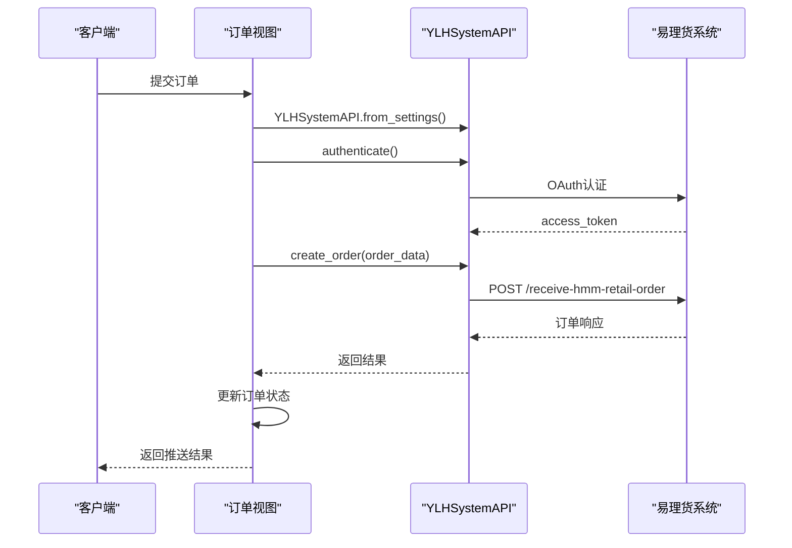

**图表来源**
- [views.py](file://backend/orders/views.py#L440-L478)

### 物流查询流程

系统支持实时查询订单物流信息：

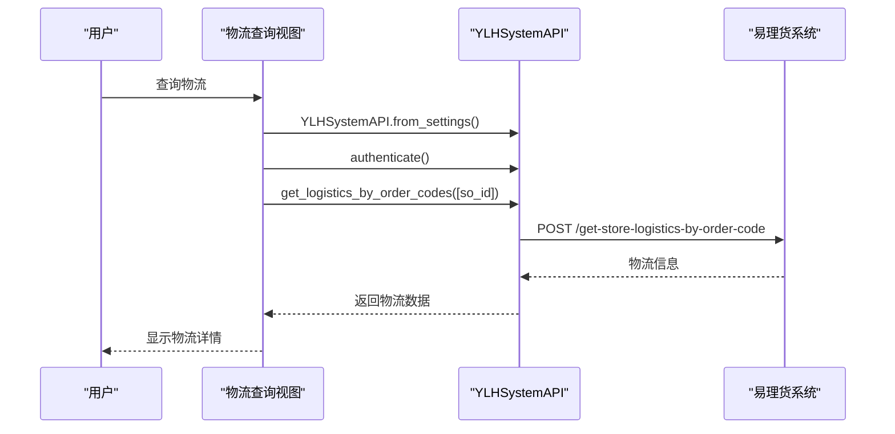

**图表来源**
- [views.py](file://backend/orders/views.py#L513-L537)

**节来源**
- [views.py](file://backend/orders/views.py#L440-L478)
- [views.py](file://backend/orders/views.py#L513-L537)

## 故障排除指南

常见问题及解决方案：

### 认证失败问题

| 错误现象 | 可能原因 | 解决方案 |
|----------|----------|----------|
| 认证返回False | 凭据错误 | 检查username、password、client_id、client_secret |
| Token过期频繁 | 网络延迟 | 检查网络连接稳定性 |
| 401 Unauthorized | Basic认证失败 | 验证client_id和client_secret |
| 400 Bad Request | OAuth参数错误 | 检查grant_type、username、password格式 |

### 配置问题诊断

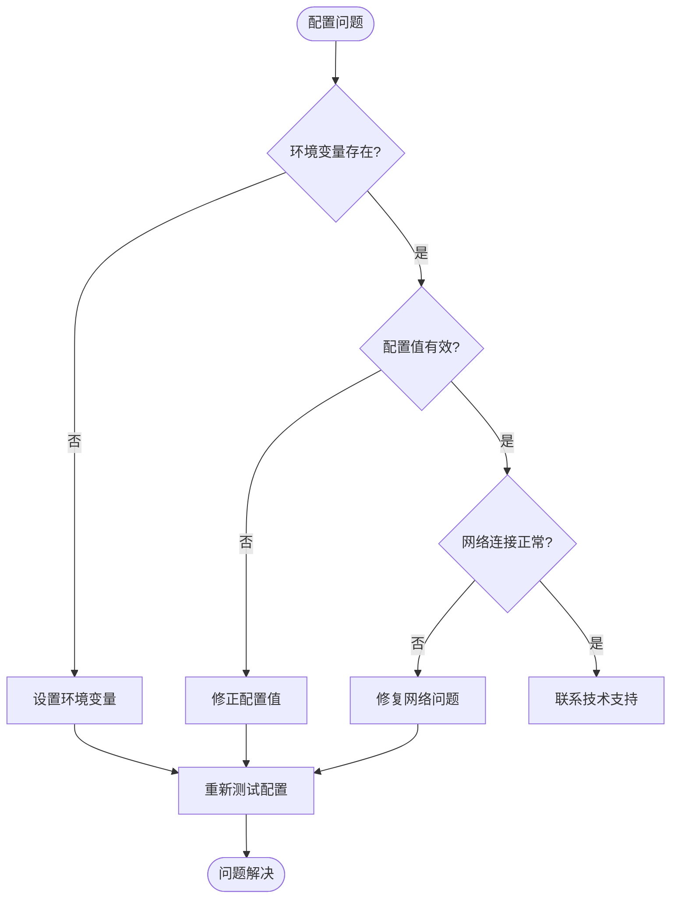

### 日志分析要点

系统提供详细的日志记录，便于问题诊断：

- **认证日志**：记录认证成功/失败状态
- **Token管理**：记录Token获取和刷新时间
- **API调用**：记录请求和响应详情
- **错误信息**：记录具体错误原因和堆栈信息

## 最佳实践建议

### 安全配置建议

1. **定期轮换凭据**：至少每90天更换一次认证凭据
2. **最小权限原则**：使用具有必要权限的最小权限账户
3. **监控告警**：建立认证失败和Token过期的监控告警
4. **备份配置**：定期备份重要的配置信息

### 性能优化建议

1. **连接池管理**：合理配置HTTP连接池大小
2. **超时设置**：根据网络状况调整请求超时时间
3. **重试机制**：实现指数退避的重试策略
4. **缓存策略**：缓存Token以减少认证频率

### 开发调试建议

1. **环境隔离**：开发、测试、生产环境使用不同的配置
2. **日志分级**：合理使用不同级别的日志记录
3. **单元测试**：为API调用编写充分的单元测试
4. **监控指标**：收集认证成功率、响应时间等关键指标

通过遵循这些最佳实践，可以确保易理货系统的稳定运行和安全性，为业务发展提供可靠的技术支撑。