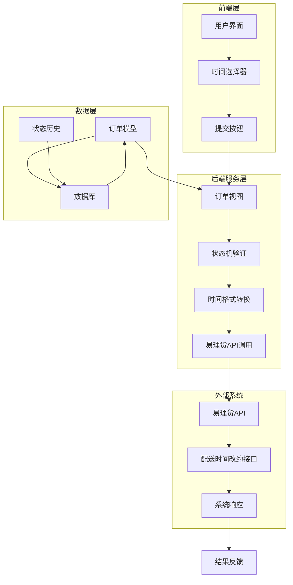
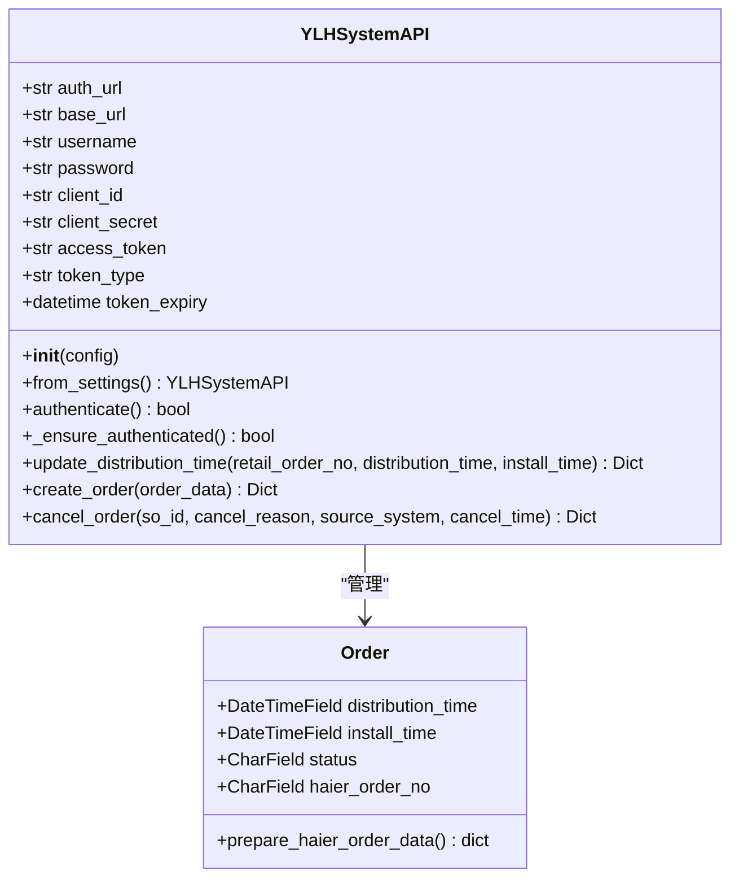
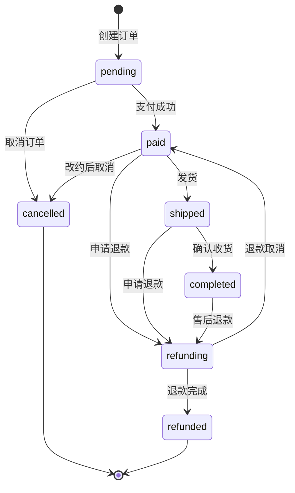
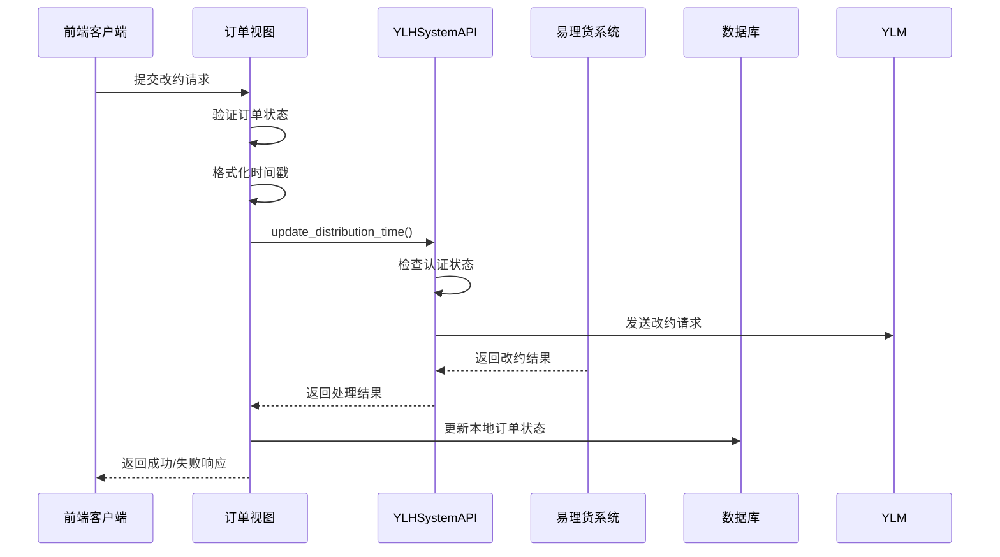
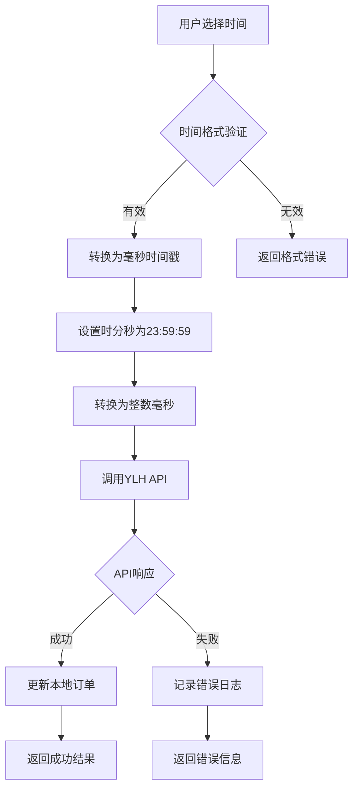
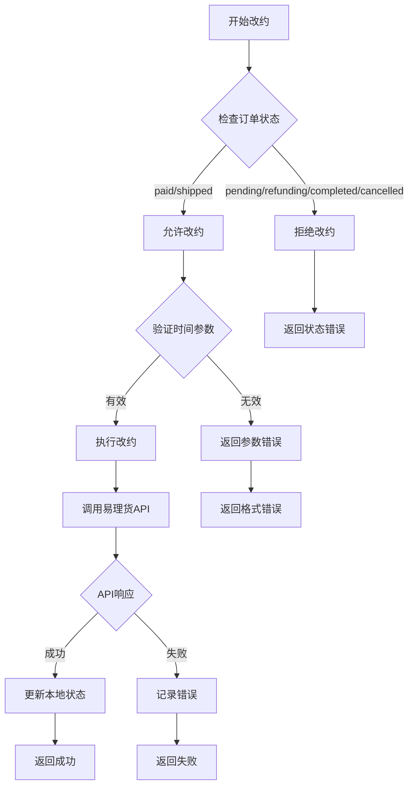
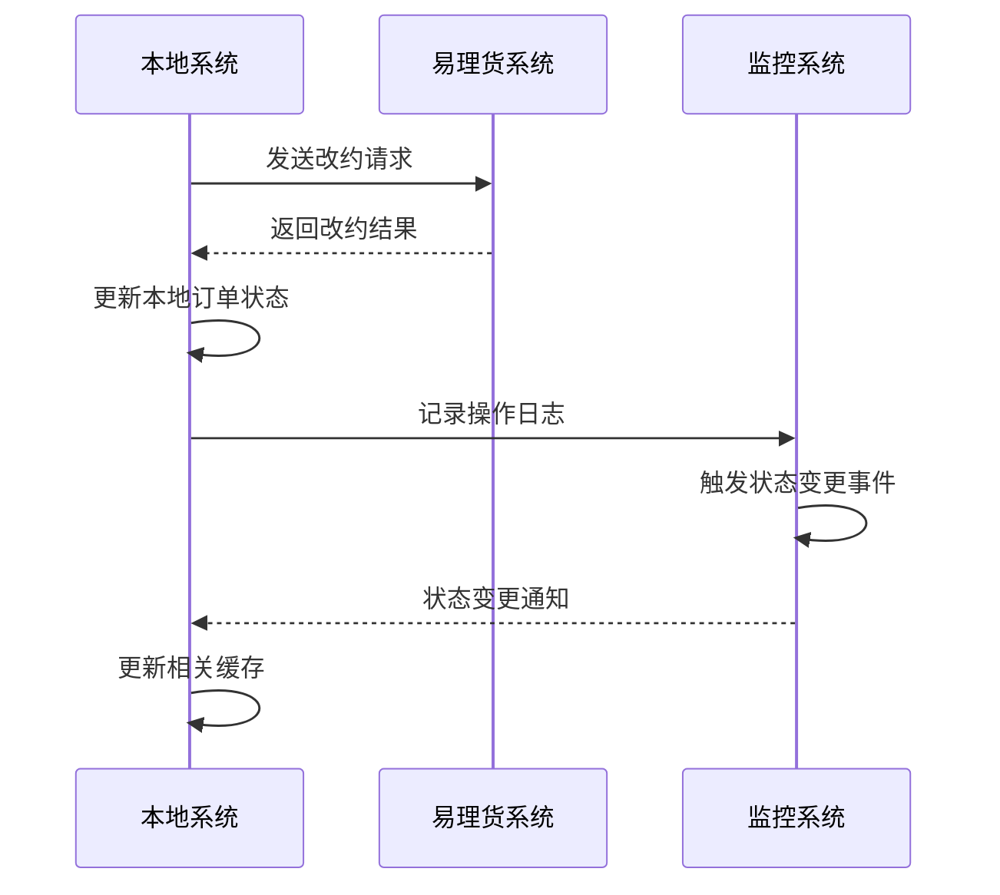
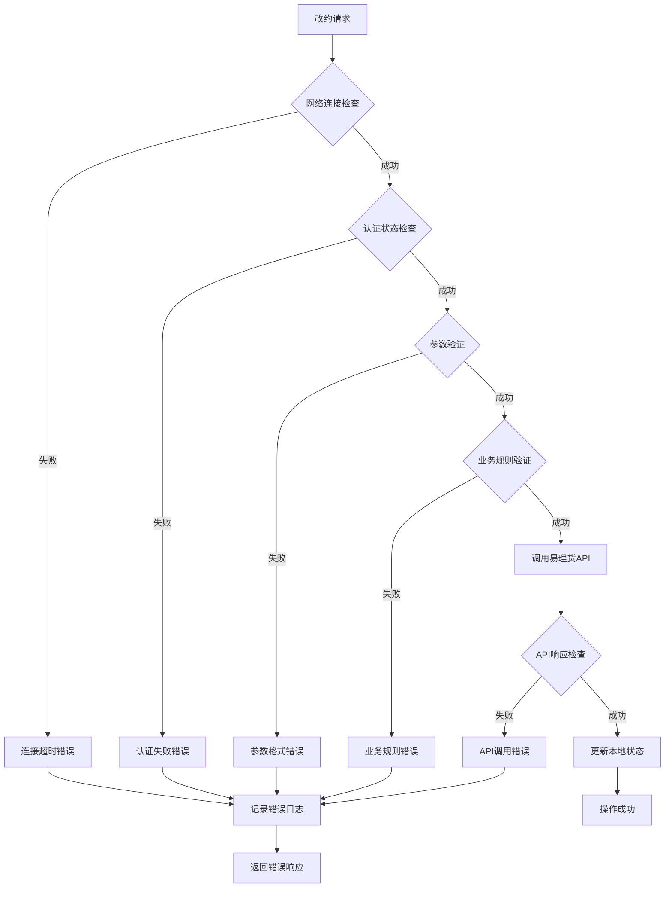

# 易理货系统配送安装时间改约集成机制

<cite>
**本文档引用的文件**
- [ylhapi.py](file://backend/integrations/ylhapi.py)
- [orders/models.py](file://backend/orders/models.py)
- [orders/state_machine.py](file://backend/orders/state_machine.py)
- [orders/views.py](file://backend/orders/views.py)
- [integrations/views.py](file://backend/integrations/views.py)
- [orders/services.py](file://backend/orders/services.py)
- [orders/serializers.py](file://backend/orders/serializers.py)
</cite>

## 目录
1. [概述](#概述)
2. [系统架构](#系统架构)
3. [核心组件分析](#核心组件分析)
4. [改约流程详解](#改约流程详解)
5. [时间戳处理机制](#时间戳处理机制)
6. [前置条件校验](#前置条件校验)
7. [结果同步机制](#结果同步机制)
8. [错误处理与监控](#错误处理与监控)
9. [最佳实践建议](#最佳实践建议)

## 概述

易理货系统配送安装时间改约集成机制是一个复杂的订单管理系统，负责处理用户对配送时间和安装时间的改约请求。该系统通过与易理货第三方平台的API集成，实现了订单状态的实时同步和改约操作的自动化处理。

### 核心功能特性

- **双时间改约**：支持同时修改配送时间和安装时间
- **严格的时间戳规则**：强制要求时间戳设置为当日23:59:59
- **状态机驱动**：基于订单状态机确保操作的合法性
- **实时同步**：与易理货系统保持数据一致性
- **完整审计**：记录所有改约操作的详细日志

## 系统架构

**架构图源文件**
- [orders/views.py](file://backend/orders/views.py#L1-L200)
- [ylhapi.py](file://backend/integrations/ylhapi.py#L1-L459)

## 核心组件分析

### YLHSystemAPI 类

YLHSystemAPI 是易理货系统的核心API客户端，负责与易理货平台进行通信。

**类图源文件**
- [ylhapi.py](file://backend/integrations/ylhapi.py#L16-L459)
- [orders/models.py](file://backend/orders/models.py#L13-L322)

### 订单状态机

订单状态机确保改约操作只能在合法的状态下进行。

**状态图源文件**
- [orders/state_machine.py](file://backend/orders/state_machine.py#L25-L57)

**节源文件**
- [orders/state_machine.py](file://backend/orders/state_machine.py#L1-L200)

## 改约流程详解

### update_distribution_time 方法实现

update_distribution_time 方法是改约功能的核心入口，负责处理配送时间和安装时间的更新请求。

**序列图源文件**
- [ylhapi.py](file://backend/integrations/ylhapi.py#L280-L328)
- [orders/views.py](file://backend/orders/views.py#L1-L200)

### 参数处理机制

改约方法接受三个关键参数：

| 参数名 | 类型 | 描述 | 必需性 |
|--------|------|------|--------|
| retail_order_no | str | 巨商汇订单号 | 必需 |
| distribution_time | int | 配送时间戳（毫秒） | 可选 |
| install_time | int | 安装时间戳（毫秒） | 可选 |

**节源文件**
- [ylhapi.py](file://backend/integrations/ylhapi.py#L280-L328)

## 时间戳处理机制

### 业务规则：当日23:59:59规则

易理货系统有严格的业务规则要求，所有改约的时间戳必须设置为当日23:59:59。这一规则确保了时间计算的一致性和准确性。

**流程图源文件**
- [ylhapi.py](file://backend/integrations/ylhapi.py#L454-L456)

### 时间格式转换

系统在内部维护两种时间格式：

| 字段名 | 数据类型 | 存储格式 | 用途 |
|--------|----------|----------|------|
| distribution_time | DateTimeField | ISO 8601 | Django ORM 操作 |
| install_time | DateTimeField | ISO 8601 | Django ORM 操作 |
| distributionTime | int | 毫秒时间戳 | 易理货 API 传输 |
| installTime | int | 毫秒时间戳 | 易理货 API 传输 |

**节源文件**
- [orders/models.py](file://backend/orders/models.py#L49-L50)
- [orders/models.py](file://backend/orders/models.py#L113-L114)

## 前置条件校验

### 订单状态验证

改约操作必须在特定的订单状态下才能执行，系统通过状态机进行严格验证。

**流程图源文件**
- [orders/state_machine.py](file://backend/orders/state_machine.py#L118-L124)

### 权限控制

系统实施多层次的权限控制：

1. **身份验证**：确保只有授权用户可以发起改约
2. **订单所有权**：验证用户是否为订单所有者
3. **状态权限**：检查当前状态是否允许改约
4. **业务规则**：验证时间参数是否符合业务规则

**节源文件**
- [orders/state_machine.py](file://backend/orders/state_machine.py#L118-L124)
- [orders/views.py](file://backend/orders/views.py#L33-L34)

## 结果同步机制

### 实时同步策略

系统采用实时同步策略，确保本地状态与易理货系统保持一致。

**序列图源文件**
- [ylhapi.py](file://backend/integrations/ylhapi.py#L317-L320)
- [orders/state_machine.py](file://backend/orders/state_machine.py#L146-L152)

### 数据一致性保障

系统通过以下机制保障数据一致性：

1. **事务处理**：改约操作在数据库事务中执行
2. **重试机制**：API调用失败时自动重试
3. **补偿机制**：本地状态回滚时同步撤销易理货状态
4. **监控告警**：异常情况及时通知运维团队

**节源文件**
- [ylhapi.py](file://backend/integrations/ylhapi.py#L132-L172)
- [orders/state_machine.py](file://backend/orders/state_machine.py#L146-L152)

## 错误处理与监控

### 异常处理机制

系统实现了完善的异常处理机制：

**流程图源文件**
- [ylhapi.py](file://backend/integrations/ylhapi.py#L117-L131)
- [ylhapi.py](file://backend/integrations/ylhapi.py#L294-L328)

### 日志记录与监控

系统记录详细的改约操作日志：

| 日志级别 | 记录内容 | 触发时机 |
|----------|----------|----------|
| INFO | 改约成功 | 操作完成时 |
| ERROR | 认证失败 | 认证过程中 |
| ERROR | 参数验证失败 | 参数检查时 |
| ERROR | API调用失败 | 接口调用异常 |
| WARN | 状态转换警告 | 状态异常时 |

**节源文件**
- [ylhapi.py](file://backend/integrations/ylhapi.py#L106-L115)
- [ylhapi.py](file://backend/integrations/ylhapi.py#L220-L227)

## 最佳实践建议

### 开发建议

1. **时间格式标准化**：始终使用当日23:59:59的时间格式
2. **错误处理完善**：实现完整的异常捕获和用户友好的错误提示
3. **性能优化**：合理使用缓存减少重复的API调用
4. **安全考虑**：实施适当的权限验证和数据加密

### 运维建议

1. **监控告警**：建立完善的监控体系，及时发现和处理异常
2. **日志管理**：定期清理和归档日志，确保系统性能
3. **容量规划**：根据业务增长预测系统资源需求
4. **备份策略**：制定完善的数据备份和恢复计划

### 用户体验优化

1. **即时反馈**：提供操作进度和结果的即时反馈
2. **错误指导**：给出清晰的错误原因和解决建议
3. **操作确认**：重要操作前提供二次确认机制
4. **历史记录**：保存用户的改约历史供参考

通过这套完整的配送安装时间改约集成机制，易理货系统能够高效、可靠地处理各种改约请求，为用户提供优质的订单管理体验。