# 商品与价格同步

<cite>
**本文档中引用的文件**
- [haierapi.py](file://backend/integrations/haierapi.py)
- [sync_haier_products.py](file://backend/catalog/management/commands/sync_haier_products.py)
- [models.py](file://backend/catalog/models.py)
- [integrations/models.py](file://backend/integrations/models.py)
- [admin.py](file://backend/integrations/admin.py)
- [env_config.py](file://backend/backend/settings/env_config.py)
</cite>

## 目录
1. [概述](#概述)
2. [系统架构](#系统架构)
3. [海尔API接口详解](#海尔api接口详解)
4. [商品同步管理命令](#商品同步管理命令)
5. [商品模型映射](#商品模型映射)
6. [同步日志系统](#同步日志系统)
7. [同步流程分析](#同步流程分析)
8. [配置管理](#配置管理)
9. [性能优化](#性能优化)
10. [故障排查指南](#故障排查指南)

## 概述

商品与价格同步系统是一个完整的供应链集成解决方案，负责从海尔API获取商品数据并同步到本地数据库。该系统支持多种同步策略，包括按商品编码、分类和品牌进行过滤，同时提供价格信息合并和库存同步功能。

### 核心特性

- **多维度过滤**：支持按product-codes、category、brand进行灵活筛选
- **价格同步**：通过--sync-prices选项触发价格信息合并
- **库存同步**：支持实时库存查询和更新
- **审计追踪**：完整的同步日志记录系统
- **错误处理**：完善的异常处理和重试机制

## 系统架构

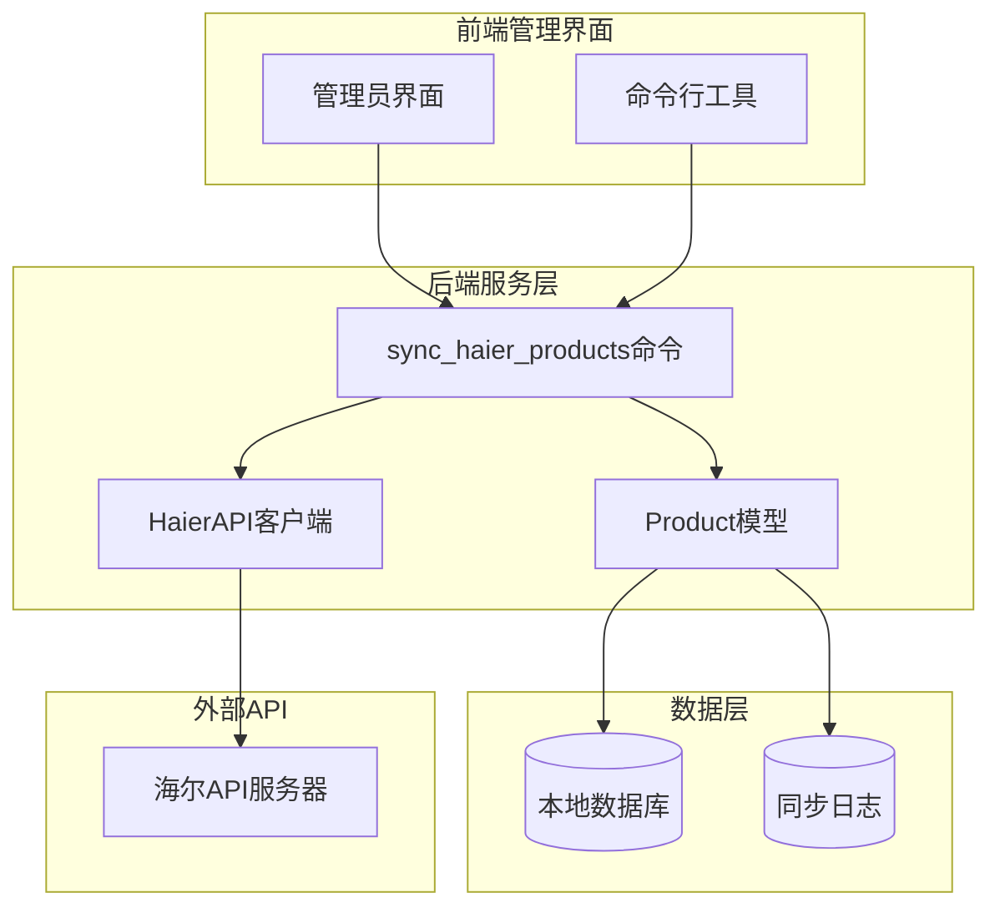

**图表来源**
- [sync_haier_products.py](file://backend/catalog/management/commands/sync_haier_products.py#L13-L156)
- [haierapi.py](file://backend/integrations/haierapi.py#L10-L214)
- [models.py](file://backend/catalog/models.py#L43-L312)

## 海尔API接口详解

### HaierAPI类设计

HaierAPI类是与海尔开放平台交互的核心组件，提供了完整的API调用封装。

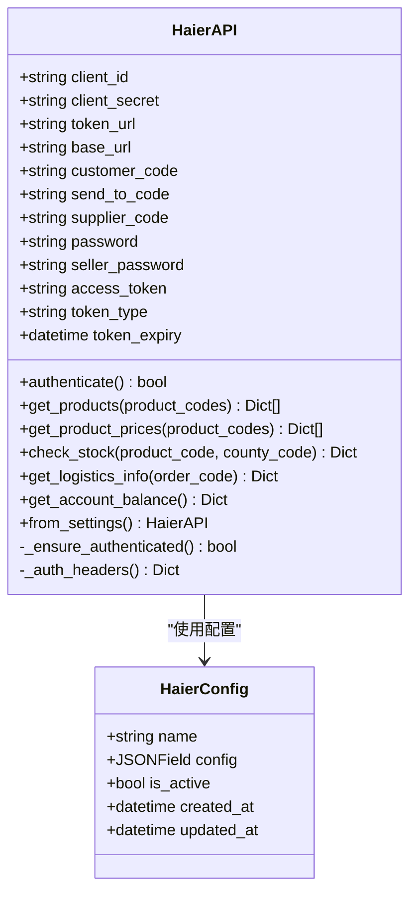

**图表来源**
- [haierapi.py](file://backend/integrations/haierapi.py#L10-L214)
- [integrations/models.py](file://backend/integrations/models.py#L4-L47)

### get_products()接口

`get_products()`方法用于获取海尔商品信息，支持多种过滤条件：

#### 请求参数

| 参数名 | 类型 | 必需 | 描述 |
|--------|------|------|------|
| customerCode | string | 是 | 客户编码，从配置中读取 |
| supplierCode | string | 是 | 供应商编码，默认'1001' |
| searchType | string | 是 | 搜索类型，固定为'PTJSH' |
| passWord | string | 是 | 密码验证 |
| sendToCode | string | 否 | 发送目标编码 |
| productCodes | array | 否 | 商品编码列表，最多20个 |

#### 响应数据结构

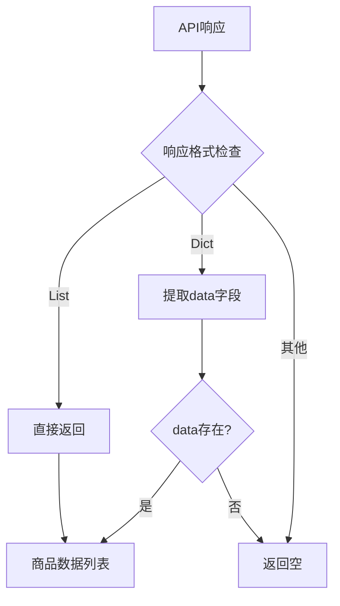

**图表来源**
- [haierapi.py](file://backend/integrations/haierapi.py#L74-L97)

### get_product_prices()接口

`get_product_prices()`方法专门用于获取商品价格信息：

#### 请求参数

| 参数名 | 类型 | 必需 | 描述 |
|--------|------|------|------|
| customerCode | string | 是 | 客户编码 |
| sendToCode | string | 否 | 发送目标编码 |
| productCodes | array | 是 | 商品编码列表，最多20个 |
| priceType | string | 是 | 价格类型，固定为'PT' |
| passWord | string | 是 | 密码验证 |

#### 价格字段映射

| 海尔字段 | 本地字段 | 描述 |
|----------|----------|------|
| supplyPrice | supply_price | 普通供价 |
| invoicePrice | invoice_price | 开票价 |
| marketPrice | market_price | 市场价 |
| stockRebatePolicy | stock_rebate | 直扣政策 |
| rebateMoney | rebate_money | 台返金额 |

**章节来源**
- [haierapi.py](file://backend/integrations/haierapi.py#L74-L119)

## 商品同步管理命令

### 命令行接口设计

sync_haier_products命令提供了丰富的同步控制选项：

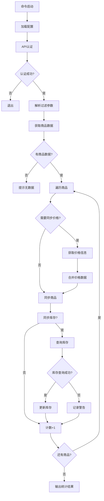

**图表来源**
- [sync_haier_products.py](file://backend/catalog/management/commands/sync_haier_products.py#L50-L156)

### 过滤策略

#### 1. 按商品编码过滤
```bash
python manage.py sync_haier_products --product-codes GA0SZC00U GA0SZC00V
```

#### 2. 按分类过滤
```bash
python manage.py sync_haier_products --category "空调"
```

#### 3. 按品牌过滤
```bash
python manage.py sync_haier_products --brand "海尔"
```

#### 4. 组合过滤
```bash
python manage.py sync_haier_products --category "冰箱" --brand "美的" --sync-prices
```

### 选项参数详解

| 参数 | 类型 | 默认值 | 描述 |
|------|------|--------|------|
| --product-codes | List[str] | None | 指定要同步的产品编码列表 |
| --category | str | None | 指定商品分类名称 |
| --brand | str | None | 指定品牌名称 |
| --sync-prices | bool | False | 同步价格信息 |
| --sync-stock | bool | False | 同步库存信息 |
| --county-code | str | "110101" | 区域编码（用于库存查询） |

**章节来源**
- [sync_haier_products.py](file://backend/catalog/management/commands/sync_haier_products.py#L16-L48)

## 商品模型映射

### Product.sync_from_haier()静态方法

该方法是商品数据同步的核心，负责将海尔API返回的原始数据映射到本地Product模型：

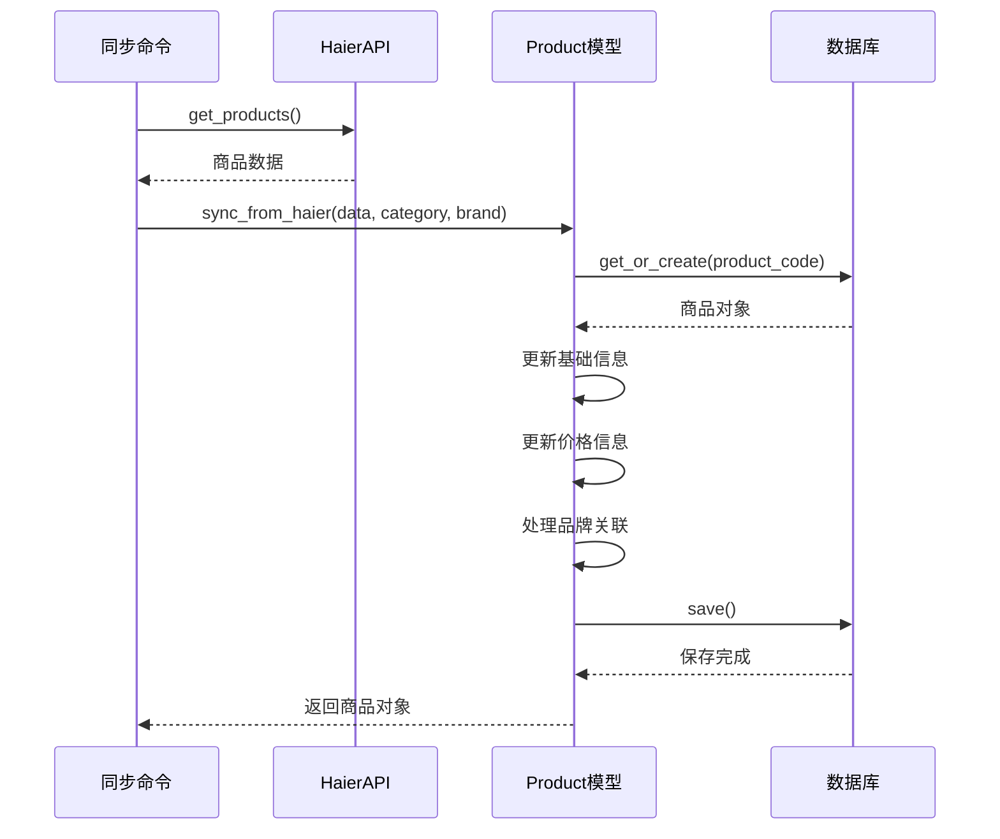

**图表来源**
- [sync_haier_products.py](file://backend/catalog/management/commands/sync_haier_products.py#L116-L118)
- [models.py](file://backend/catalog/models.py#L118-L179)

### 数据映射规则

#### 基础字段映射

| 海尔字段 | 本地字段 | 处理方式 |
|----------|----------|----------|
| productCode | product_code | 主键，唯一标识 |
| productModel | name | 商品名称，使用model作为默认值 |
| productImageUrl | product_image_url | 主图URL |
| productLageUrls | product_page_urls | 拉页URL列表 |
| isSales | is_sales | 销售状态，'1'表示可采 |
| noSalesReason | no_sales_reason | 不可采原因 |

#### 价格信息映射

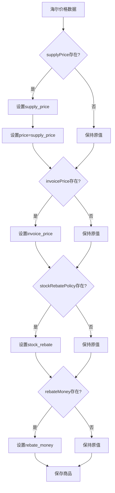

**图表来源**
- [models.py](file://backend/catalog/models.py#L157-L167)

### update_stock_from_haier()方法

该方法专门处理库存信息的更新：

#### 库存字段映射

| 海尔字段 | 本地字段 | 描述 |
|----------|----------|------|
| stock | stock | 库存数量 |
| secCode | warehouse_code | 库位编码 |
| warehouseGrade | warehouse_grade | 仓库等级 |

**章节来源**
- [models.py](file://backend/catalog/models.py#L118-L194)

## 同步日志系统

### HaierSyncLog模型设计

HaierSyncLog模型提供了完整的同步操作审计功能：

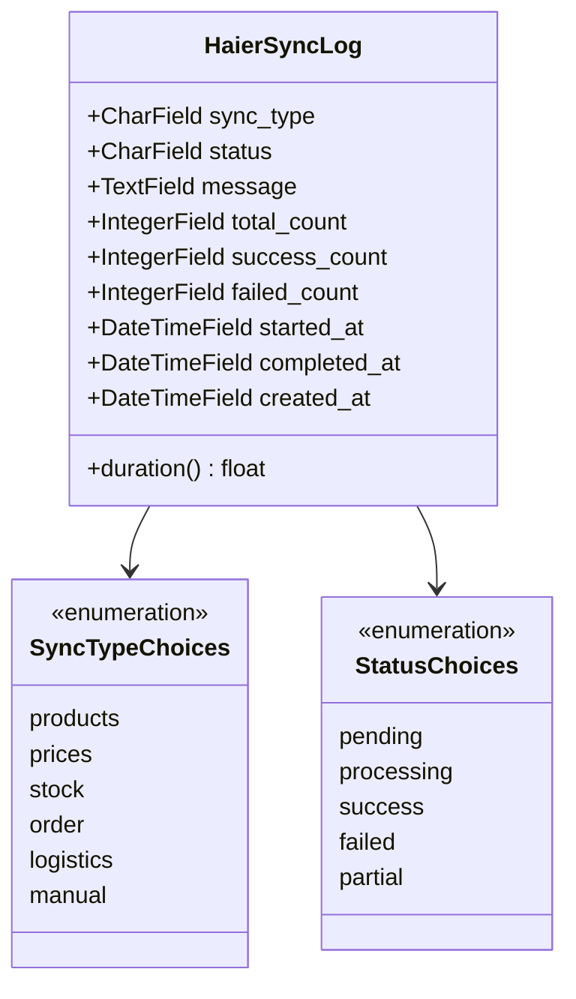

**图表来源**
- [integrations/models.py](file://backend/integrations/models.py#L50-L149)

### 日志记录策略

#### 同步类型分类

| 同步类型 | 描述 | 触发时机 |
|----------|------|----------|
| products | 商品同步 | 批量获取商品信息 |
| prices | 价格同步 | 单个商品价格查询 |
| stock | 库存同步 | 库存状态更新 |
| order | 订单推送 | 订单状态变更 |
| logistics | 物流查询 | 物流信息获取 |
| manual | 手动操作 | 用户手动触发 |

#### 状态流转

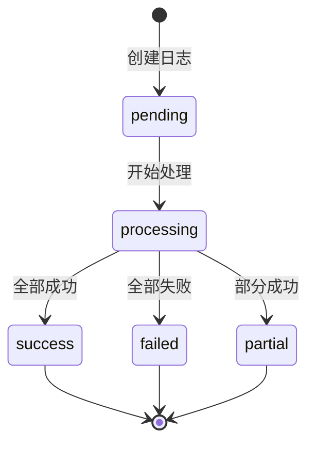

### 审计功能

#### 关键指标监控

- **处理效率**：通过duration属性计算同步耗时
- **成功率**：success_count / total_count
- **错误追踪**：详细的message字段记录
- **时间线**：按created_at排序的完整操作历史

**章节来源**
- [integrations/models.py](file://backend/integrations/models.py#L50-L149)
- [admin.py](file://backend/integrations/admin.py#L14-L26)

## 同步流程分析

### 完整同步流程

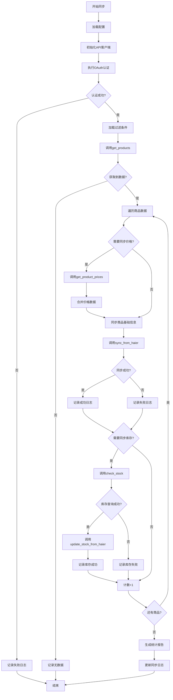

**图表来源**
- [sync_haier_products.py](file://backend/catalog/management/commands/sync_haier_products.py#L50-L156)

### 错误处理机制

#### 分层错误处理

1. **网络层错误**：API调用失败，记录HTTP状态码和错误信息
2. **认证层错误**：Token过期或无效，自动重新认证
3. **业务层错误**：商品数据格式错误，跳过当前商品继续处理
4. **数据库层错误**：保存失败，记录详细错误信息

#### 重试策略

- **指数退避**：网络错误时采用指数退避算法
- **最大重试次数**：限制重试次数防止无限循环
- **熔断机制**：连续失败超过阈值时暂停同步

### 性能优化

#### 批量处理优化

- **产品编码限制**：每次API调用最多20个商品编码
- **并发控制**：合理控制并发请求数量
- **缓存机制**：对频繁访问的配置信息进行缓存

#### 数据库优化

- **索引策略**：为product_code、supplier、supplier_code建立复合索引
- **批量更新**：使用Django的bulk_update功能提高效率
- **事务管理**：确保数据一致性

**章节来源**
- [sync_haier_products.py](file://backend/catalog/management/commands/sync_haier_products.py#L147-L156)

## 配置管理

### 环境配置

系统支持多环境配置管理，通过EnvironmentConfig类实现：

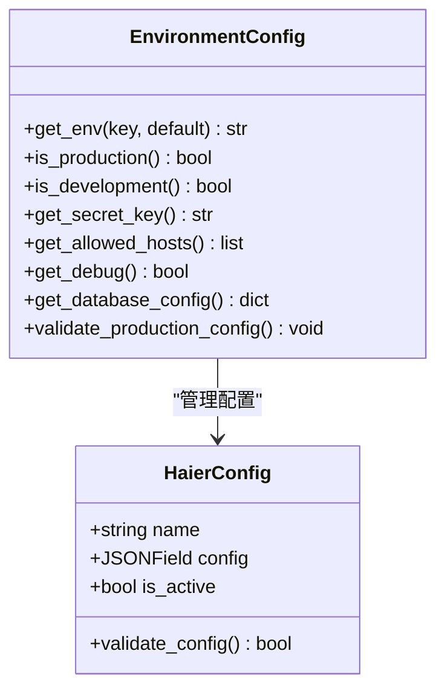

**图表来源**
- [env_config.py](file://backend/backend/settings/env_config.py#L37-L252)
- [integrations/models.py](file://backend/integrations/models.py#L4-L47)

### 配置参数详解

#### 海尔API配置参数

| 参数名 | 类型 | 必需 | 描述 |
|--------|------|------|------|
| client_id | string | 是 | OAuth客户端ID |
| client_secret | string | 是 | OAuth客户端密钥 |
| token_url | string | 是 | Token获取地址 |
| base_url | string | 是 | API基础URL |
| customer_code | string | 是 | 客户编码 |
| send_to_code | string | 否 | 发送目标编码 |
| supplier_code | string | 否 | 供应商编码，默认'1001' |
| password | string | 是 | API访问密码 |
| seller_password | string | 是 | 卖家密码 |

#### 环境变量配置

```bash
# 基础配置
DJANGO_ENV=development
SECRET_KEY=your-secret-key
ALLOWED_HOSTS=localhost,127.0.0.1

# 数据库配置
POSTGRES_DB=electric_miniprogram
POSTGRES_USER=postgres
POSTGRES_PASSWORD=password
POSTGRES_HOST=localhost
POSTGRES_PORT=5432

# 海尔API配置
HAIER_CLIENT_ID=your-client-id
HAIER_CLIENT_SECRET=your-client-secret
HAIER_TOKEN_URL=https://openplat-test.haier.net/oauth2/auth
HAIER_BASE_URL=https://openplat-test.haier.net
HAIER_CUSTOMER_CODE=8800633175
HAIER_SEND_TO_CODE=8800633175
HAIER_SUPPLIER_CODE=1001
HAIER_PASSWORD=your-password
HAIER_SELLER_PASSWORD=your-password
```

**章节来源**
- [env_config.py](file://backend/backend/settings/env_config.py#L14-L32)
- [haierapi.py](file://backend/integrations/haierapi.py#L27-L39)

## 性能优化

### 并发处理优化

#### 异步处理策略

虽然当前实现是同步的，但系统设计支持未来的异步扩展：

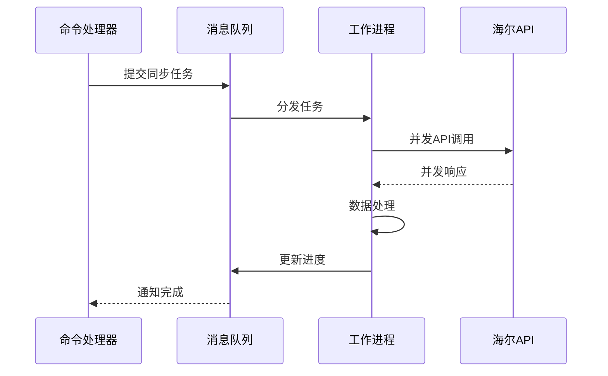

#### 缓存策略

- **配置缓存**：缓存HaierConfig配置避免重复查询
- **认证缓存**：Token有效期管理，减少认证频率
- **数据缓存**：热点商品数据缓存

### 监控指标

#### 关键性能指标(KPI)

| 指标 | 计算公式 | 目标值 |
|------|----------|--------|
| 同步速度 | 总商品数 / 同步耗时 | >100商品/分钟 |
| 成功率 | 成功数 / 总数 | >95% |
| 平均响应时间 | 总响应时间 / 请求次数 | <5秒 |
| 错误率 | 失败数 / 总数 | <5% |

#### 监控告警

- **同步延迟**：超过预设时间阈值发送告警
- **失败率过高**：连续失败超过阈值触发告警
- **API限流**：遇到限流错误及时告警

## 故障排查指南

### 常见问题及解决方案

#### 1. 认证失败

**症状**：命令执行时显示"认证失败"

**可能原因**：
- OAuth配置错误
- 网络连接问题
- Token过期

**解决步骤**：
```bash
# 检查配置
python manage.py shell
>>> from integrations.haierapi import HaierAPI
>>> from django.conf import settings
>>> config = {...}  # 使用实际配置
>>> api = HaierAPI(config)
>>> api.authenticate()

# 检查网络连通性
curl -X POST https://openplat-test.haier.net/oauth2/auth \
  -H "Content-Type: application/json" \
  -d '{"client_id":"your_id","client_secret":"your_secret","grant_type":"client_credentials"}'
```

#### 2. 商品数据为空

**症状**：显示"未查询到商品"

**可能原因**：
- 过滤条件过于严格
- API权限不足
- 商品编码不存在

**排查步骤**：
```bash
# 尝试不带过滤条件
python manage.py sync_haier_products

# 检查具体商品
python manage.py sync_haier_products --product-codes GA0SZC00U
```

#### 3. 价格同步失败

**症状**：价格信息未更新

**可能原因**：
- 价格API权限不足
- 商品编码不在价格查询范围内
- 网络超时

**调试方法**：
```python
# 在shell中测试
from integrations.haierapi import HaierAPI
api = HaierAPI.from_settings()
prices = api.get_product_prices(['GA0SZC00U'])
print(prices)  # 检查返回数据
```

#### 4. 库存同步问题

**症状**：库存信息不准确

**排查重点**：
- county_code是否正确
- 库存API权限
- 地区编码有效性

### 日志分析

#### 查看同步日志

```bash
# 通过管理界面查看
# 或者通过shell查询
python manage.py shell
>>> from integrations.models import HaierSyncLog
>>> logs = HaierSyncLog.objects.all().order_by('-created_at')
>>> for log in logs[:10]:
...     print(f"{log.created_at}: {log.sync_type} - {log.status}")
```

#### 日志解读要点

- **sync_type**: 确认同步类型是否符合预期
- **status**: 检查是否有failed状态
- **message**: 查看具体的错误信息
- **duration**: 监控同步性能

### 性能调优建议

#### 大规模同步优化

1. **分批处理**：对于大量商品，建议分批次同步
2. **并发控制**：根据API限流情况调整并发数
3. **错误恢复**：实现断点续传功能
4. **资源监控**：监控CPU和内存使用情况

#### 生产环境部署

```bash
# 使用后台进程运行
nohup python manage.py sync_haier_products --sync-prices --sync-stock > sync.log 2>&1 &

# 设置定时任务
crontab -e
# 每天凌晨2点同步
0 2 * * * cd /path/to/project && python manage.py sync_haier_products --sync-prices >> /var/log/sync.log 2>&1
```

**章节来源**
- [sync_haier_products.py](file://backend/catalog/management/commands/sync_haier_products.py#L67-L70)
- [haierapi.py](file://backend/integrations/haierapi.py#L41-L64)

## 结论

商品与价格同步系统是一个功能完整、设计合理的供应链集成解决方案。它通过模块化的架构设计，提供了灵活的同步策略、完善的错误处理机制和全面的审计功能。系统支持多种过滤条件，能够满足不同场景下的商品同步需求，同时通过同步日志系统确保了操作的可追溯性和系统的稳定性。

该系统的设计充分考虑了生产环境的复杂性，提供了丰富的配置选项和监控指标，为后续的功能扩展和性能优化奠定了良好的基础。通过合理的错误处理和重试机制，系统能够在各种网络环境下稳定运行，确保商品数据的及时性和准确性。